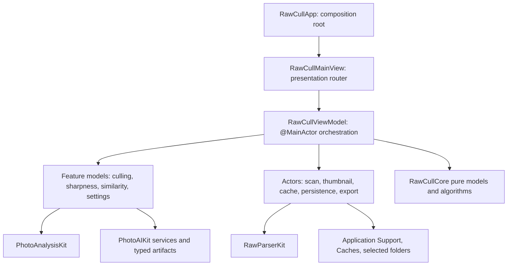

## RawCull Developer Notes

These pages explain RawCull from a developer's point of view. They are intended
for readers who already understand Swift and SwiftUI and now need to learn where
behavior lives, how data moves through the app, and which invariants must
survive a change.

Source paths in these pages are relative to the named repository. App paths such
as `RawCull/Model/ViewModels/RawCullViewModel.swift` belong to the RawCull
repository. Package paths belong to the separately versioned Swift packages
referenced by `RawCull.xcodeproj`; this documentation repository does not
contain or compile source snapshots.

## Start Here

Read these pages in this order when learning the project:

1. [Thumbnails and Scan Pipeline](thumbnail/) follows a selected catalog from
   directory discovery to visible images.
2. [Concurrency](concurrency-revised/) explains `@MainActor`, actor ownership,
   cancellation, and bounded parallelism across that pipeline.
3. [Cache System](cache/) explains why grid, preview, disk, full-size, and
   analysis caches are separate.
4. [Focus Mask and Sharpness](focusmask/) follows scoring and focus evidence
   into persisted culling data.
5. [Burst Groups](burstgroup/) combines sharpness, similarity artifacts,
   grouping, ranking, and the burst-review UI.
6. [Artificial Intelligence](ai/) and [RawCull Packages](packages/) explain the
   reusable package boundaries behind the app.

Use [File Read and Write](filereadandwrite/) and
[Security-Scoped URLs](security/) whenever a change touches persistence, caches,
user-selected folders, export, or copying.

## Repository And Target Map

| Area                       | Primary source                                                            | Responsibility                                                                                                                |
| -------------------------- | ------------------------------------------------------------------------- | ----------------------------------------------------------------------------------------------------------------------------- |
| App composition            | `RawCull/Main/RawCullApp.swift`                                           | Creates the AI composition root and shared observable models, injects environment state, and defines app windows and commands |
| Main presentation          | `RawCull/Main/RawCullMainView.swift`                                      | Switches between loupe, grid, similarity, rated, and comparison modes and owns top-level sheets and overlays                  |
| App orchestration          | `RawCull/Model/ViewModels/RawCullViewModel.swift` plus feature extensions | Owns main-actor catalog, selection, navigation, progress, culling, similarity, and burst-review state                         |
| Background ownership       | `RawCull/Actors/`                                                         | Serializes scans, thumbnail requests, caches, persistence, extraction, and contention gates                                   |
| App services and adapters  | `RawCull/Model/`                                                          | Connects the UI model to RAW parsing, sharpness analysis, AI providers, persistence, diagnostics, and rsync                   |
| Reusable domain logic      | `RawCullCore` package                                                     | Value models and pure algorithms such as burst grouping and ranking                                                           |
| RAW decoding               | `RawParserKit` package                                                    | Format dispatch, metadata normalization, MakerNote parsing, thumbnail extraction, and preview creation                        |
| Image analysis             | `PhotoAnalysisKit` package                                                | Sharpness, saliency, focus evidence, masks, and analysis descriptors                                                          |
| AI contracts and workflows | `PhotoAIKit` package products                                             | Typed similarity artifacts, Vision/CLIP backends, semantic search, segmentation, and storage contracts                        |
| Tests                      | `RawCullTests/` and package test targets                                  | Executable behavior contracts, concurrency checks, cache identity checks, and integration coverage                            |

## Architectural Shape

The boundaries are based on ownership:

- SwiftUI views render observable state and translate gestures, commands, and
  bindings into model actions.
- `RawCullViewModel` and feature view models are `@MainActor` because their
  state drives presentation.
- Actors own shared mutable background state and serialize work such as cache
  access, thumbnail coalescing, and writes.
- `RawCullCore` contains reusable value models and pure decisions that do not
  need UI isolation.
- `RawParserKit`, `PhotoAnalysisKit`, and `PhotoAIKit` hide specialized parsing
  and analysis implementations behind typed boundaries.
- Security-scoped access remains alive at the app or operation boundary for as
  long as user-selected files are used.

## Follow One Feature Through The Code

When investigating a behavior, read it in this direction:

1. Find the SwiftUI control or lifecycle trigger.
2. Find the `RawCullViewModel` or feature-model method it calls.
3. Identify which actor, adapter, or package owns the expensive or mutable work.
4. Follow the value returned to main-actor state.
5. Read the tests named after the actor, model, or feature before changing the
   invariant.

This approach is more reliable than starting with an individual utility type
because it shows both ownership and the complete lifetime of the operation.

## Focused References

| Page                                                  | Use it when changing                                          |
| ----------------------------------------------------- | ------------------------------------------------------------- |
| [Memory Pressure](memorypressure/)                    | Cache limits, pressure events, or diagnostics                 |
| [Detailed Sharpness Scoring](detailsharpnessscoring/) | Formula-level sharpness behavior and score-impacting factors  |
| [Detailed Focus Mask Computation](detailsfocusmask/)  | Focus-mask rendering, region selection, and visual thresholds |
| [Synchronous Code](heavy/)                            | Blocking ImageIO, RAW parsing, or explicit executor bridges   |
| [Sony/Nikon MakerNote Parser](sonymakernoteparser/)   | Focus-point metadata and vendor-specific parsing              |
| [AI Model Downloads](ai/aimodeldownloads/)            | Model installation, validation, signing, and activation       |
| [Repository Git Workflow](pushpull/)                  | The documentation repository's linear-history workflow        |
