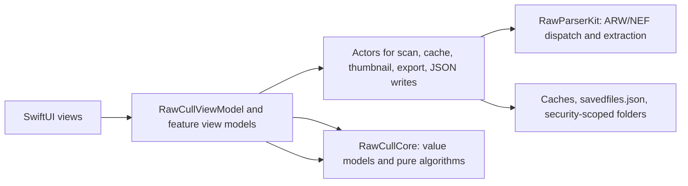

## RawCull Developer Notes

These pages explain how RawCull is developed from a developer's point of view. The goal is not user help. The goal is to make the source easier to reason about when you return to the project: which file owns which behavior, how data moves through the app, where expensive work happens, and what to check before changing a subsystem.

RawCull is a native macOS SwiftUI app for culling RAW photos, currently focused on Sony ARW and Nikon NEF files. This repository builds the Hugo documentation site. The Swift trees under `sourcecode/` are source snapshots used by the documentation and by package tests; they are not compiled by the Hugo site itself.

## Source Snapshot Layout

| Path | Role |
|---|---|
| `sourcecode/RawCull/` | App target: SwiftUI views, `@Observable` view models, actors, cache owners, persistence, diagnostics, and rsync workflow |
| `sourcecode/RawCullCore/` | Shared Swift package: value models, burst grouping/ranking, focus-point normalization, histogram calculation, and tests |
| `sourcecode/RawParserKit/` | RAW parsing package: format registry, Sony/Nikon MakerNote parsers, embedded JPEG extraction, thumbnail extraction, cancellation bridge, and tests |

## How To Read The Docs

Start with the pipeline pages, then use the focused references when changing one area.

| Page | Use it when you need to understand |
|---|---|
| [Thumbnails and Scan Pipeline](thumbnail/) | Folder selection, file discovery, EXIF/focus extraction, thumbnail preload, on-demand thumbnails, and RAW format dispatch |
| [Concurrency](concurrency-revised/) | Actor boundaries, main-actor state, task groups, cancellation, and how blocking ImageIO is kept off Swift's cooperative pool |
| [Memory Cache](cache/) | The RAM thumbnail caches, disk thumbnail cache, full-size JPEG disk cache, cache diagnostics, and burst-analysis cache |
| [Memory Pressure](memorypressure/) | How RawCull reads system/app memory and reacts to kernel pressure events |
| [Focus Mask](focusmask/) | Sharpness scoring, saliency, AF-point weighting, focus-mask generation, calibration, and scoring persistence |
| [Detailed Sharpness Scoring](detailsharpnessscoring/) | Step-by-step source walk-through of sharpness scoring, formulas, examples, and score-impacting factors |
| [Detailed Focus Mask Computation](detailsfocusmask/) | Step-by-step source walk-through of focus-mask rendering, patch selection, visual thresholds, examples, and result-impacting factors |
| [Burst Groups](burstgroup/) | Vision similarity indexing, grouping rules, ranking weights, review states, manual winners, and culling actions |
| [Artificial Intelligence](ai/) | PhotoAIKit architecture, model identity, reusable AI boundaries, and the complete CLIP activation and similarity flow in RawCull |
| [Saved Files](savedfiles/) | `savedfiles.json`, ratings, sharpness/saliency persistence, burst winner overrides, and debounced writes |
| [File Read and Write](filereadandwrite/) | Every app file RawCull reads or writes, including caches, bookmarks, JSON, extracted JPEGs, and rsync include files |
| [Security-Scoped URLs](security/) | Sandbox access, bookmarks, active catalog scope, and rsync source/destination scope |
| [SwiftUI Components](swiftuicomponents/) | The main view hierarchy and reusable SwiftUI components already present in the app |
| [Calculations Reference](calculations/) | Formula-level reference for memory, cache cost, histogram, sharpness, burst ranking, and rsync totals |
| [Synchronous Code](heavy/) | The places that still do blocking work and why they are wrapped the way they are |
| [Sony/Nikon MakerNote Parser](sonymakernoteparser/) | How focus points and embedded JPEG locations are parsed from RAW metadata |
| [Findings](findings/) | Current source-review findings and follow-up items |
| [Enhancements](enhancements/) | Source-backed roadmap ideas for next development passes |
| [Compiling RawCull](compile/) | Building the documentation site and notes for compiling the macOS app elsewhere |
| [Repository Git Workflow](pushpull/) | Git push/pull workflow for this documentation repository |

## Architectural Shape

The pattern to watch for is separation by risk:

- UI state lives on `@MainActor` observable classes.
- Long-running or shared mutable work lives in actors.
- Pure reusable algorithms live in `RawCullCore`.
- Vendor-specific RAW knowledge lives in `RawParserKit`.
- Non-Sendable image types are converted or consumed before crossing concurrency boundaries.
