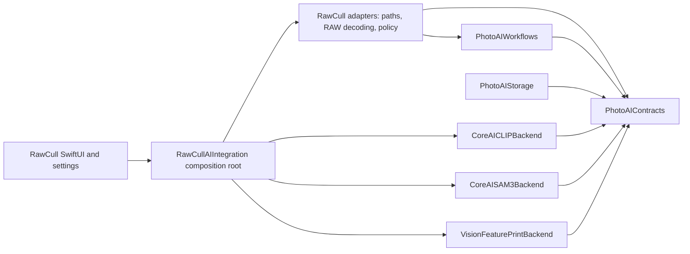
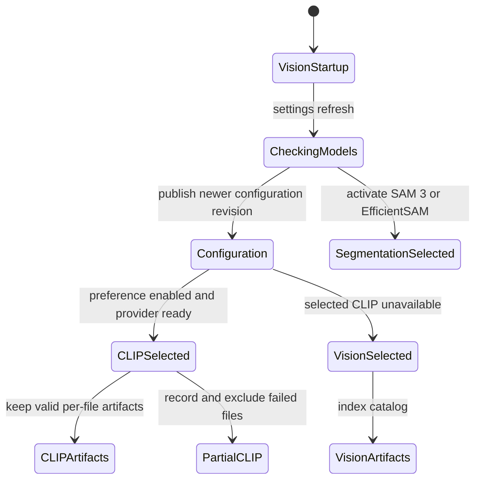

+++
author = "Thomas Evensen"
title = "Artificial Intelligence"
linkTitle = "AI"
date = "2026-08-21"
lastmod = "2026-08-31"
description = "Learning guide to PhotoAIKit and RawCull's AI integration."
tags = ["ai", "clip", "sam3", "photoaikit"]
categories = ["technical details"]
mermaid = true
weight = 60
+++

# Artificial Intelligence in RawCull

This section explains how RawCull uses reusable AI components without allowing
model-runtime details to spread through the application. It is written as a
learning path: first understand the boundary between RawCull and PhotoAIKit,
then study the package itself, and finally follow CLIP from application startup
to a persisted similarity artifact.

The source for this section comes from the pinned PhotoAIKit dependency and the
RawCull repository. Paths beginning with `Sources/` refer to PhotoAIKit at the
revision in `Package.resolved`. RawCull intelligence code lives under
`RawCull/Intelligence`; app composition and presentation remain under
`RawCull/Main`, `RawCull/Model`, and `RawCull/Views`.

## What This Section Documents

| Document                                                       | Main question                                          | Start here when                                                                                                      |
| -------------------------------------------------------------- | ------------------------------------------------------ | -------------------------------------------------------------------------------------------------------------------- |
| This overview                                                  | Where does AI belong in the system?                    | You need the vocabulary and responsibility split                                                                     |
| [How RawCull Enables and Uses CLIP](clip-in-rawcull/)          | How does the CLIP preference become a running backend? | You are tracing model discovery, activation, RAW decoding, inference, fallback, distance calculation, or persistence |
| [AI Model Downloads](aimodeldownloads/)                        | Where do model assets come from?                       | You are changing download, acceptance, or installation behavior                                                      |
| [Evaluating CLIP Models](evaluateclipmodels/)                  | How are candidate CLIP models compared reproducibly?   | You are preparing fixtures, running evaluations, or interpreting model-quality measurements                          |
| [CLIP Model Evaluation Results](evaluation/)                   | How did the evaluated CLIP models perform?             | You need the recorded comparison results and conclusions                                                             |
| [AI Model Licence and Provenance Clearance](licenceprocedure/) | What evidence is required before a model can ship?     | You are reviewing licences, provenance, redistribution, or release readiness                                         |
| [Publishing New RawCull AI Models](newmodels/)                 | How is an approved model packaged and published?       | You are preparing a model release or updating the download manifest                                                  |

PhotoAIKit contains three backend families used by RawCull:

- **CLIP image embeddings** for visual similarity and semantic search.
- **SAM 3 and EfficientSAM subject segmentation** for subject masks.
- **Apple Vision feature prints** for always-available image similarity.

Vision is the startup and service-selection fallback: RawCull uses it when CLIP
is disabled or the selected CLIP bundle cannot produce a validated provider. A
selected CLIP indexing pass keeps its valid per-file artifacts and records the
files that fail; it does not mix Vision artifacts into that pass or
automatically rerun the whole batch.

The detailed CLIP document follows code that is connected to RawCull's
similarity and burst-analysis features. The package architecture document also
covers the SAM 3 contracts, workflows, and storage so that the complete package
design is understandable. Not every reusable package capability is necessarily
exposed as a finished RawCull user workflow.

## The Central Design Idea

RawCull and PhotoAIKit answer different kinds of questions.

**PhotoAIKit asks:**

- What does an image source look like at a package boundary?
- How is a model bundle validated and identified?
- How does a backend produce and compare a similarity artifact?
- How is bounded indexing or segmentation orchestrated?
- How can reusable artifacts and masks be encoded or cached?

**RawCull asks:**

- Where are models installed for this application?
- How is a Sony or Nikon RAW file decoded for AI input?
- Which backend did the user request?
- When should a catalog be indexed or reindexed?
- How do similarity distances affect burst grouping and culling?
- What state and wording should SwiftUI present?

This is dependency inversion in practical form. PhotoAIKit defines small
protocols such as `ImageDecoding`, `ImageSimilarityArtifactProviding`, and
`ImageSimilarityArtifactComparing`. RawCull injects app-specific implementations
and keeps its file model, UI, sandbox policy, and culling decisions outside the
package.

The arrow direction matters: PhotoAIKit does not import RawCull. A reusable
package should not need to know what `FileItem`, `RawCullViewModel`, an
app-specific model folder, or a burst winner means.

## Responsibility Boundary

| Concern                                                                          | Owner                       | Reason                                                           |
| -------------------------------------------------------------------------------- | --------------------------- | ---------------------------------------------------------------- |
| Typed model, image, artifact, and segmentation contracts                         | PhotoAIKit                  | Backends and hosts need one stable language                      |
| Core AI CLIP and SAM 3 inference                                                 | PhotoAIKit backend products | Framework-specific tensor and inference code is reusable         |
| Vision feature-print generation and native distance                              | PhotoAIKit backend product  | The opaque Vision payload stays behind its backend boundary      |
| Bounded indexing, optional fallback mechanisms, segmentation, and mask selection | PhotoAIKit workflows        | These mechanisms do not depend on RawCull UI or culling policy   |
| Optional embedding codecs and mask stores                                        | PhotoAIKit storage          | Persistence mechanics are reusable, but locations are not        |
| Model installation directories and candidate order                               | RawCull                     | Paths and sandbox policy belong to the host application          |
| RAW decoding                                                                     | RawCull                     | PhotoAIKit should not depend on `RawParserKit` or camera formats |
| Settings and capability wording                                                  | RawCull                     | User-facing state and localization belong to the app             |
| Similarity ranking adjustments and burst grouping                                | RawCull                     | These are photo-culling product decisions, not CLIP behavior     |
| Burst-analysis cache location and lifecycle                                      | RawCull                     | The host owns when and where catalog results persist             |

## Current Runtime Shape

`RawCullApplicationState` is the object-graph assembly boundary. It creates one
`RawCullAIIntegration`, one shared `SimilarityScoringModel`, the focused
similarity and semantic-search features, the Deep Review controller, the main
view model, and one `RawCullIntelligenceRuntime`. Identity assertions protect
against accidentally constructing parallel observable state.

`RawCullAIIntegration` remains the concrete provider composition root. The
runtime owns stable feature lifetimes and applies complete revisioned
configurations from settings. Views receive focused feature surfaces instead of
the composition root or low-level scoring model:

| Consumer                       | Narrow dependency                                                 | Capability and persistence rule                                                                                                           |
| ------------------------------ | ----------------------------------------------------------------- | ----------------------------------------------------------------------------------------------------------------------------------------- |
| `RawCullSimilarityFeature`     | Shared `SimilarityScoringModel` plus `RawCullSimilarityServicing` | Owns the public hydration, indexing, ranking, cancellation, and backend-presentation surface while persisting descriptor-valid artifacts  |
| `RawCullSemanticSearchFeature` | Shared scoring model and optional semantic-search service         | Projects semantic-search state, binds weakly to application selection/navigation, and never indexes missing images as a query side effect |
| `BurstAnalysisCoordinator`     | Similarity feature, scoring models, and cache repository          | Owns burst generation, progress, cache preparation, missing computation, grouping, ranking, cancellation, and derived-cache saving        |
| `DeepAIReviewController`       | `DeepAIReviewFeature`                                             | Builds immutable requests from app evidence and validates the group signature before recommendations reach culling policy                 |
| `RawCullAISettingsModel`       | `RawCullIntelligenceConfigurationApplying`                        | Publishes one ordered configuration; the runtime ignores stale revisions and applies only meaningful identity changes                     |

The safe startup and refresh path is:

1. `RawCullApp` calls `RawCullApplicationState.live()` and retains its view
   model and intelligence runtime as stable `@State` roots.
2. Assembly creates the shared scoring model and focused features from the
   initial Vision-backed configuration.
3. `RawCullAISettingsModel.refresh()` asks the integration to validate both CLIP
   and both segmentation-model candidates.
4. PhotoAIKit validates model bundles and derives model-asset fingerprints.
5. Settings publishes a monotonically revisioned configuration. The runtime
   replaces similarity or semantic-search services only when their identities
   changed and applies segmentation selection independently.
6. Missing, invalid, or disabled CLIP leaves burst similarity on Vision and
   semantic search unavailable.
7. CLIP indexing retains valid files and logs per-file failures; Vision is not
   inserted into that CLIP result set.
8. Changing the segmentation selection immediately updates the active provider.
   A full refresh rechecks every candidate and saved-evidence state.

Burst similarity, semantic search, and Deep Review are separate features even
when they share package code. Burst similarity may use Vision or CLIP. Semantic
search requires CLIP image artifacts whose descriptor exactly matches the text
provider. Deep Review uses segmentation masks and has its own availability,
selection, and storage lifecycle.

## Vocabulary

| Term                    | Meaning in this codebase                                                                                                                     |
| ----------------------- | -------------------------------------------------------------------------------------------------------------------------------------------- |
| **Provider**            | A backend object that performs inference or creates an artifact                                                                              |
| **Backend descriptor**  | Identity of the backend, model, representation, preprocessing, normalization, and configuration                                              |
| **Similarity artifact** | A descriptor plus a backend-owned payload; CLIP stores an encoded vector, while Vision stores an opaque archived observation                 |
| **Source fingerprint**  | Standardized file path, size, and modification date used to detect changed source images                                                     |
| **Model fingerprint**   | Identity derived from the selected `.aimodel` or `.aimodelc`, cryptographically verified when the manifest provides a checksum               |
| **Composition root**    | The one place where concrete providers, stores, paths, and app adapters are assembled                                                        |
| **Partial CLIP result** | Valid CLIP artifacts plus per-file failures; failed files remain unavailable to similarity and burst grouping until a later successful index |
| **Host**                | The application integrating PhotoAIKit; here, RawCull                                                                                        |

## Suggested Learning Order

This section follows the main documentation index: first read the scan,
concurrency, cache, focus/sharpness, and burst-group pages. Then read this
overview and [RawCull Packages](../packages/) for the boundaries. Continue with
[How PhotoAIKit Is Constructed](../packages/photoaikit/), then follow the live
path in [How RawCull Loads and Uses CLIP](clip-in-rawcull/) and
[Modular AI Integration](../modularaiintegration/).

Installation and acceptance steps intentionally live only in
[AI Model Downloads](aimodeldownloads/). The architecture pages describe managed
locations and validation but do not duplicate download procedures.

For model-selection work, continue with
[Evaluating CLIP Models](evaluateclipmodels/) and the recorded
[CLIP Model Evaluation Results](evaluation/). Release work then proceeds through
[AI Model Licence and Provenance Clearance](licenceprocedure/) before
[Publishing New RawCull AI Models](newmodels/).
