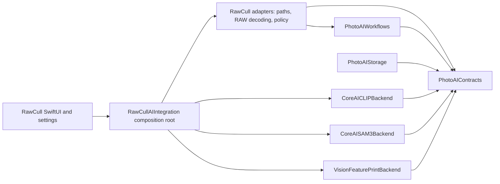
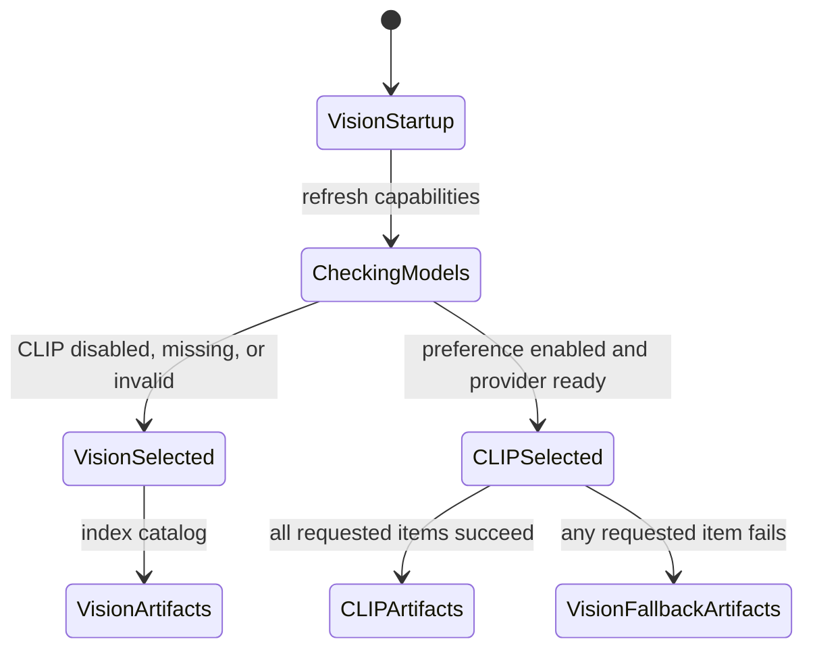

+++
author = "Thomas Evensen"
title = "Artificial Intelligence"
linkTitle = "AI"
date = "2026-07-18"
description = "Learning guide to PhotoAIKit and RawCull's AI integration."
tags = ["ai", "clip", "sam3", "photoaikit"]
categories = ["technical details"]
mermaid = true
weight = 60
+++

# Artificial Intelligence in RawCull

This section explains how RawCull uses reusable AI components without allowing model-runtime details to spread through the application. It is written as a learning path: first understand the boundary between RawCull and PhotoAIKit, then study the package itself, and finally follow CLIP from application startup to a persisted similarity artifact.

The source for this section comes from the sibling `PhotoAIKit` and `RawCull` projects. Paths beginning with `Sources/` refer to PhotoAIKit. Paths beginning with `Model/`, `Main/`, `Views/`, or `Actors/` refer to the RawCull app target.

## What This Section Documents

| Document | Main question | Start here when |
|---|---|---|
| This overview | Where does AI belong in the system? | You need the vocabulary and responsibility split |
| [How RawCull Enables and Uses CLIP](clip-in-rawcull/) | How does the CLIP preference become a running backend? | You are tracing model discovery, activation, RAW decoding, inference, fallback, distance calculation, or persistence |

PhotoAIKit currently contains two main AI families:

- **CLIP image embeddings** for visual similarity.
- **SAM 3 subject segmentation** for subject masks.

It also contains an Apple Vision feature-print backend. In RawCull, Vision is both the always-available similarity implementation and the whole-batch fallback when CLIP indexing fails.

The detailed CLIP document follows code that is connected to RawCull's similarity and burst-analysis features. The package architecture document also covers the SAM 3 contracts, workflows, and storage so that the complete package design is understandable. Not every reusable package capability is necessarily exposed as a finished RawCull user workflow.

## The Central Design Idea

RawCull and PhotoAIKit answer different kinds of questions.

**PhotoAIKit asks:**

- What does an image source look like at a package boundary?
- How is a model bundle validated and identified?
- How does a backend produce and compare a similarity artifact?
- How is bounded indexing or segmentation orchestrated?
- How can reusable artifacts and masks be encoded or cached?

**RawCull asks:**

- Where are models installed for this application?
- How is a Sony or Nikon RAW file decoded for AI input?
- Which backend did the user request?
- When should a catalog be indexed or reindexed?
- How do similarity distances affect burst grouping and culling?
- What state and wording should SwiftUI present?

This is dependency inversion in practical form. PhotoAIKit defines small protocols such as `ImageDecoding`, `ImageSimilarityArtifactProviding`, and `ImageSimilarityArtifactComparing`. RawCull injects app-specific implementations and keeps its file model, UI, sandbox policy, and culling decisions outside the package.

The arrow direction matters: PhotoAIKit does not import RawCull. A reusable package should not need to know what `FileItem`, `RawCullViewModel`, an app-specific model folder, or a burst winner means.

## Responsibility Boundary

| Concern | Owner | Reason |
|---|---|---|
| Typed model, image, artifact, and segmentation contracts | PhotoAIKit | Backends and hosts need one stable language |
| Core AI CLIP and SAM 3 inference | PhotoAIKit backend products | Framework-specific tensor and inference code is reusable |
| Vision feature-print generation and native distance | PhotoAIKit backend product | The opaque Vision payload stays behind its backend boundary |
| Bounded indexing, fallback, segmentation, and mask selection | PhotoAIKit workflows | These algorithms do not depend on RawCull UI or culling policy |
| Optional embedding codecs and mask stores | PhotoAIKit storage | Persistence mechanics are reusable, but locations are not |
| Model installation directories and candidate order | RawCull | Paths and sandbox policy belong to the host application |
| RAW decoding | RawCull | PhotoAIKit should not depend on `RawParserKit` or camera formats |
| Settings and capability wording | RawCull | User-facing state and localization belong to the app |
| Similarity ranking adjustments and burst grouping | RawCull | These are photo-culling product decisions, not CLIP behavior |
| Burst-analysis cache location and lifecycle | RawCull | The host owns when and where catalog results persist |

## Current Runtime Shape

RawCull deliberately has a safe startup path:

1. `RawCullApp` creates one `RawCullAIIntegration` composition root.
2. The main view model initially receives the Vision similarity service.
3. `RawCullAISettingsModel.refresh()` asks the integration to validate the CLIP and SAM 3 model candidates.
4. PhotoAIKit validates the selected model bundle and fingerprints its asset.
5. If CLIP validation and provider construction succeed, the saved CLIP preference can select `RawCullCLIPSimilarityService`.
6. If CLIP is disabled, missing, invalid, or cannot be constructed, RawCull continues with Vision.
7. If CLIP starts a batch but any item fails, the complete requested batch is retried with Vision.

The whole-batch fallback is an integrity rule, not only an error-recovery convenience. CLIP vectors and Vision feature prints have different representations and distance semantics. Recomputing the entire batch prevents a catalog from containing artifacts that cannot be compared with one another.

## Vocabulary

| Term | Meaning in this codebase |
|---|---|
| **Provider** | A backend object that performs inference or creates an artifact |
| **Backend descriptor** | Identity of the backend, model, representation, preprocessing, normalization, and configuration |
| **Similarity artifact** | A descriptor plus a backend-owned payload; CLIP stores an encoded vector, while Vision stores an opaque archived observation |
| **Source fingerprint** | Standardized file path, size, and modification date used to detect changed source images |
| **Model fingerprint** | Identity derived from the selected `.aimodel` or `.aimodelc`, cryptographically verified when the manifest provides a checksum |
| **Composition root** | The one place where concrete providers, stores, paths, and app adapters are assembled |
| **Whole-batch fallback** | Discard the primary pass after any failure and run every requested source through one fallback backend |
| **Host** | The application integrating PhotoAIKit; here, RawCull |

## Suggested Learning Order

Read [How PhotoAIKit Is Constructed](packages/photoaikit/) first if dependency boundaries, protocols, or package products are unfamiliar. It builds the mental model from the bottom up.

Then read [How RawCull Enables and Uses CLIP](clip-in-rawcull/). That document follows the runtime path and shows where the clean package abstractions meet app-specific concerns such as model locations, RAW files, settings, burst grouping, and cache validation.

Finally, keep [AI Runtime Step by Step](stepbystepAI/) beside the source code. It expands the runtime path into exact function hops and branches, including what does and does not invoke CLIP when a developer indexes similarity, analyzes bursts, opens a burst, or enters the detailed comparison view.
