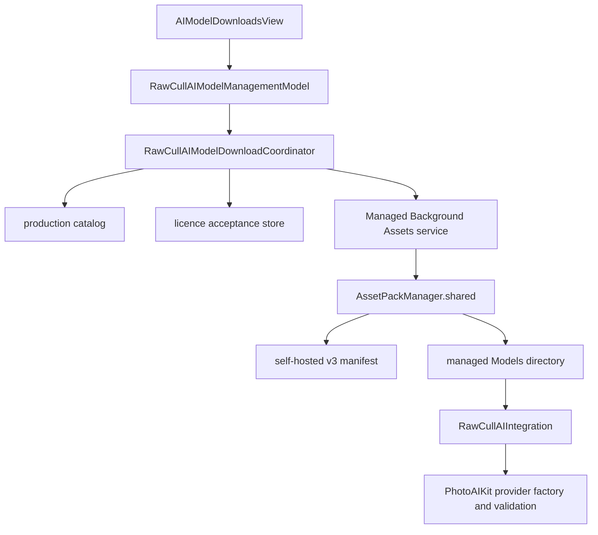

+++
author = "Thomas Evensen"
title = "AI Model Downloads"
date = "2026-08-21"
lastmod = "2026-09-15"
weight = 20
tags = ["ai", "models", "background-assets", "provenance"]
categories = ["technical details"]
mermaid = true
+++

# AI Model Download Service

RawCull uses Apple's Managed Background Assets APIs to install optional model
directories without bundling the model binaries in the application. Production
currently points to the self-hosted `v3` manifest. The next manifest version is
reserved as `v4`, but no `v4` release or hosted manifest was published at the
2026-09-15 verification point:

```text
https://github.com/rsyncOSX/RawCull-AI-Models/releases/download/v3/manifest.json
```

The executable production set contains exactly two packs:

| Model | Asset-pack ID | Installed destination | Download bytes | Installed bytes |
|---|---|---|---:|---:|
| DataComp CLIP | `no.blogspot.RawCull.models.clip-datacomp` | `Models/CLIP-DataComp` | 282,966,632 | 307,801,147 |
| Meta SAM 3 | `no.blogspot.RawCull.models.sam3` | `Models/SAM3` | 1,542,689,157 | 1,667,576,486 |

## Download Verification Snapshot

The hosted manifest and both production archives were downloaded from their
versioned `v3` URLs on 2026-09-15. Local `shasum -a 256` and `stat` results
matched the GitHub release metadata, RawCull catalog, and repository provenance:

| Artifact | Version in manifest | Bytes | SHA-256 |
|---|---:|---:|---|
| `manifest.json` | — | 771 | `a7e6d97d9055288cd430f80a30416e59705557c97d9d0de0cf2ad226415bc2b4` |
| `no.blogspot.RawCull.models.clip-datacomp` | 3 | 282,966,632 | `cf433dcd199b44635a4ff0260bd8e79177e4907a4cfcb2f72043066b8cbe4ef7` |
| `no.blogspot.RawCull.models.sam3` | 3 | 1,542,689,157 | `dd0adc697060129435d4a70515011a37f547e1ad7cd530d943341bf3ca9184a9` |

The manifest itself contains exactly those two IDs, both with on-demand policy,
third-party hosting, version `3`, and download URLs under the `v3` release. A
successful URL or an `installed` runtime state is not enough: release evidence
requires the exact byte count and SHA-256 of the downloaded response.
GitHub reported the release itself as `immutable: false`, so the tag-qualified
URLs are stable names but are not a cryptographic immutability guarantee.

OpenAI CLIP is retained as a prepared descriptor but is excluded by
`includeOpenAICLIP = false`. EfficientSAM is retained as a blocked prepared
descriptor and is excluded from both runtime selection and downloads. The
developer manifest template therefore contains DataComp CLIP and SAM 3 only.

## Sources Of Truth

| File | Authority |
|---|---|
| `RawCullAIModelDownloadCatalog.swift` | Stable IDs, inclusion flags, metadata, archive evidence, licence gates, readiness |
| `RawCullAIModelDownloadService.swift` | Manifest URL, Background Assets state machine, installation/removal |
| `RawCull-Info.plist` | `BAManifestURL`, hosting mode, App Group and permitted domains |
| `ModelAssets/manifest.template.json` | Developer input describing selected source directories and destinations |
| `ModelAssets/Notices/<model>/PROVENANCE.json` | Upstream, conversion, model fingerprint, archive, and notice evidence |
| `Scripts/VerifyModelProvenance.py` | Fail-closed consistency checks for every production-enabled model |

The app catalog and repository provenance contain the expected archive SHA-256,
but the runtime download service does not hash the archive itself. Background
Assets owns archive delivery and installation. PhotoAIKit validates the installed
model bundle when constructing its provider. Release engineering must still
verify the exact hosted archive bytes independently.

The provider validation baseline is PhotoAIKit `v2.4.1`, revision
`20e57359603313af7c2d38cae3e8b6e37f8838ef`. It includes updated SAM 3
multi-subject handling and pins `apple/coreai-models` revision
`cc812078731871574c9b2eb620aa40734c4b89ee`. Those are package/exporter
revisions, not Background Assets pack versions; keep all three version domains
separate in release records.

## Runtime Architecture



`RawCullAIModelDownloadCatalog.prepared` contains every known descriptor.
`production` filters it through `RawCullAIModelInclusion.downloadIDs` before the
settings model sees it. This is the first runtime gate; a blocked or excluded
descriptor cannot become downloadable merely because a manifest happens to
contain its asset-pack ID.

For each included descriptor, the coordinator applies the remaining gates in
this order:

1. reject `.blocked` release readiness;
2. query Background Assets for local availability or manifest presence;
3. require a stored acceptance when the verified licence descriptor says so;
4. request `ensureLocalAvailability(..., requireLatestVersion: true)`;
5. resolve the descriptor's installed directory through `AssetPackManager`;
6. give the managed URL to the integration/resource manager;
7. construct a provider only after PhotoAIKit capability validation succeeds.

Managed candidates take precedence over local or bundled development candidates.
When validating a release, record the actual loaded URL and model identity so a
local directory cannot hide a broken managed-download path.

## Production Descriptors

### DataComp CLIP

- model: ViT-B/32 at 256 px, `datacomp_s34b_b86k`;
- upstream reference revision:
  `4afec35ffe57a943d569ff7ee888061830164da8`;
- selected source weight: `open_clip_model.safetensors`, 605,189,364 bytes,
  SHA-256
  `92c26d60d3200ed5ed040dff31a8d19f8140648da8007216c25744c478deef27`;
- archive SHA-256:
  `cf433dcd199b44635a4ff0260bd8e79177e4907a4cfcb2f72043066b8cbe4ef7`;
- explicit acceptance: not required;
- purposes: similarity, burst grouping, and semantic search.

The notice catalog records an OpenCLIP/DataComp MIT notice, the OpenAI CLIP
tokenizer MIT notice, and Apple's BSD 3-Clause conversion-recipe notice.

### Meta SAM 3

- upstream revision:
  `3c879f39826c281e95690f02c7821c4de09afae7`;
- selected source weight: `model.safetensors`, 3,439,938,512 bytes,
  SHA-256
  `6d06f0a5f84e435071fe6603e61d0b4cc7b40e0d39d487cfd4d67d8cc11cc14a`;
- archive SHA-256:
  `dd0adc697060129435d4a70515011a37f547e1ad7cd530d943341bf3ca9184a9`;
- bundled SAM License text SHA-256:
  `b08db9d32c687054e99cbd41eb1dad19c76936dfb9e2b58e186a01204d8be9ab`;
- explicit verified-licence acceptance: required before download;
- purpose: local text-prompted subject segmentation for Deep Review.

Acceptance records are bound to model ID, model version, licence name/version,
and licence-text hash. A model or licence change can therefore require fresh
acceptance even when the asset-pack ID stays stable.

The repository records SAM 3 as ready and enabled at the project owner's
direction. That technical distribution state is not a claim of independent
legal review; preserve the licence, notice, provenance, and release-decision
records with future versions.

## User-Visible States

| State | Meaning |
|---|---|
| `checking` | Initial catalog and local-state resolution |
| `unavailable(reason:)` | Descriptor is release-blocked |
| `licenceRequired` | A verified bundled licence must be accepted |
| `notConfigured` | No valid hosting source is configured |
| `ready` | Pack is in the manifest and may be downloaded |
| `downloading(progress:)` | Background Assets is transferring the pack |
| `validating` | The installed directory/provider is being checked |
| `installed(location:)` | Background Assets exposes the model directory |
| `removing` | Managed copy is being removed |
| `failed(message:)` | Manifest, runtime, licence, installation, or validation failure |

The download task consumes `statusUpdates` and publishes fractional progress.
Removal uses `AssetPackManager.remove`. Retry re-runs state resolution; it does
not silently convert a blocked descriptor into a ready one.

### macOS 27 Development-Build Guard

`RawCullBackgroundAssetsRuntime` disables live Background Assets use for the
known affected development builds `26A5406e` and `26A5421a`, where validation
can trap even with the configured App Group. Distribution-signed builds are not
covered by that development-signature guard. Re-evaluate the hard-coded build
set when testing later seeds.

Unit tests also replace the production URL with `example.invalid` when
`XCTestConfigurationFilePath` is present, preventing an Xcode test host from
performing live model networking.

## Packaging Contract

`ModelAssets/manifest.template.json` is a developer input, not the served
manifest. It contains one directory selector per production pack:

```text
CLIP-DataComp -> Models/CLIP-DataComp
SAM3          -> Models/SAM3
```

The deployable packs produced by `ba-package` are extensionless files. They are
not Android `.aar` archives, and RawCull does not unpack them. The generated
download manifest maps the stable asset-pack IDs to those hosted files.

Each frozen staging directory must include the model, required tokenizer or
support assets, and its matching notices. Package first, then calculate SHA-256
and byte size from the exact archive to be uploaded. If a provenance file is
also embedded in the archive, do not rebuild the archive after inserting the
archive's own digest; keep final archive evidence in the repository/external
release record to avoid a self-referential checksum.

## Release Gates And Verification

Run from the RawCull repository root:

```sh
make verify-model-provenance
python3 Scripts/TestModelProvenance.py
make release-preflight
```

`verify-model-provenance` derives enabled models from the inclusion flags and
checks readiness, paths, upstream revisions, release tag/URL, archive hash and
size, model identity, and notice hashes. The mutation test verifies rejection
cases with temporary fixtures. `release-preflight` also requires a clean tree,
a nonempty marketing version, and a nonconflicting release tag.

The scripts validate repository consistency; they do not download hosted files
or test inference quality. A release also needs focused download tests,
provider initialization, CLIP similarity/semantic-search checks, SAM 3 prompt
and mask-placement checks, removal/redownload, and a clean-machine installation.

For an independent hosted-byte check, download to a temporary directory and
compare the result with the release record:

```sh
VERIFY_DIR=$(mktemp -d)

curl --fail --location \
  --output "$VERIFY_DIR/manifest.json" \
  https://github.com/rsyncOSX/RawCull-AI-Models/releases/download/v3/manifest.json
curl --fail --location \
  --output "$VERIFY_DIR/no.blogspot.RawCull.models.clip-datacomp" \
  https://github.com/rsyncOSX/RawCull-AI-Models/releases/download/v3/no.blogspot.RawCull.models.clip-datacomp
curl --fail --location \
  --output "$VERIFY_DIR/no.blogspot.RawCull.models.sam3" \
  https://github.com/rsyncOSX/RawCull-AI-Models/releases/download/v3/no.blogspot.RawCull.models.sam3

shasum -a 256 "$VERIFY_DIR"/*
stat -f '%z %N' "$VERIFY_DIR"/*
```

Repeat with `v4` only after that release exists, and compare against newly
generated `v4` evidence. Never treat the values in the table above as expected
hashes for rebuilt archives.

Publish every model pack first and `manifest.json` last. Never replace an
archive in place after publishing its manifest; publish a new pack version and
new evidence instead.

## Signing And Hosting

Self-hosted production uses `BAUsesAppleHosting = NO`, the configured GitHub
domain allowlist, and App Group `group.no.blogspot.RawCull.model-assets` shared
by the app and downloader extension. For Apple hosting, use the corresponding
App Store Connect packs, set `BAUsesAppleHosting = YES`, remove `BAManifestURL`,
and build the downloader extension with the Apple-hosted configuration.

The app plist URL and `RawCullAIModelDownloadSource.productionManifestURL` must
always match.
