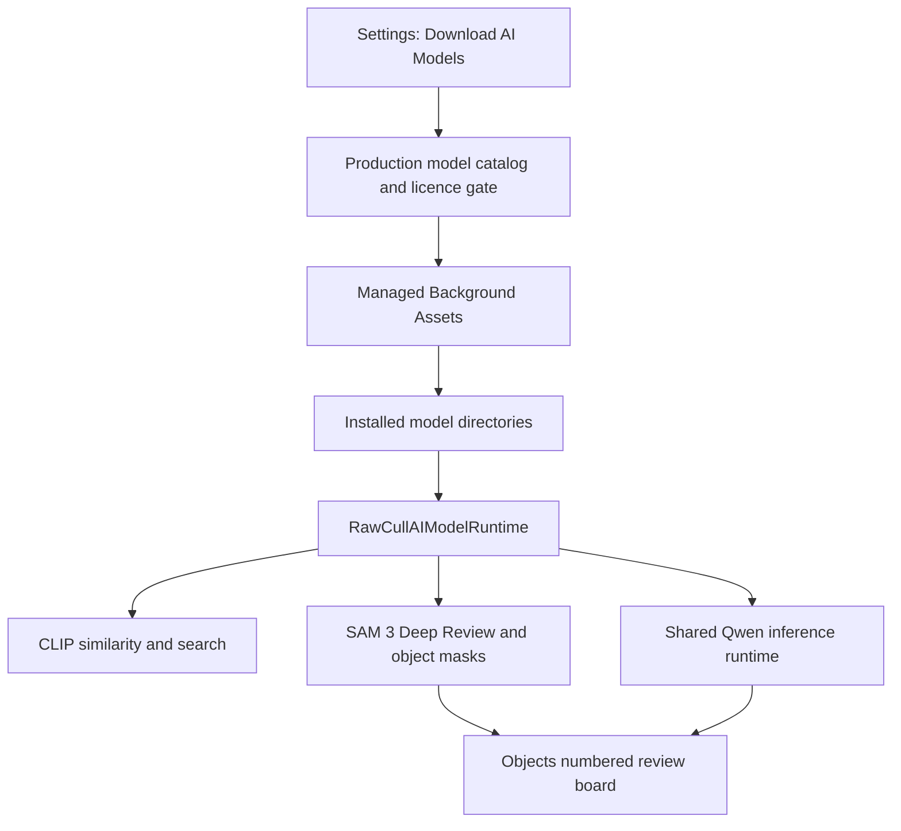

+++
author = "Thomas Evensen"
title = "AI Model Downloads"
date = "2026-08-21"
lastmod = "2026-09-26"
weight = 20
tags = ["ai", "models", "background-assets", "provenance"]
categories = ["technical details"]
mermaid = true
+++

# AI Model Downloads

RawCull installs optional AI models with Apple's Managed Background Assets. The
model binaries are not bundled into the app. In the 3.2.6 code reviewed on
September 26, 2026, the production catalog includes DataComp CLIP, Meta SAM 3,
and Qwen3-VL-2B-Instruct. Their recorded Apple-hosted pack identities are:

| Model | Permanent asset-pack ID | Installed destination | Download bytes |
|---|---|---|---:|
| DataComp CLIP | `rawcull-clip-datacomp` | `Models/CLIP-DataComp` | 282,967,354 |
| Meta SAM 3 | `rawcull-sam3` | `Models/SAM3` | 1,542,689,931 |
| Qwen3-VL-2B-Instruct | `rawcull-qwen3-vl-2b` | `Models/Qwen/qwen3_vl_2b` | 3,754,599,603 |

The `AppStore` build uses `RawCull-AppStore-Info.plist` with
`BAUsesAppleHosting = YES`, `BAHasManagedAssetPacks = YES`, and App Group
`group.no.blogspot.RawCull.model-assets`. It does not use a self-hosted
`BAManifestURL`. The Direct/Developer ID build still points to the self-hosted
`v3` manifest through `RawCull-Info.plist`. These are different distribution
paths; confirm the signed build's configuration before diagnosing a download.
The self-hosted `v3` manifest does not provide the current managed Qwen pack,
so use the Apple-hosted App Store configuration when testing managed Objects
installation.

The catalog marks the three production descriptors ready, but that is an
application-side gate. It does not prove that a particular App Store Connect
pack version is available to external testers or approved for the App Store.
SAM 3 requires acceptance of its verified bundled licence before download.
OpenAI CLIP is excluded from production. EfficientSAM is not a production pack.

## Install and use

1. In **Settings → AI → Download AI Models**, request the models needed for the
   feature. Similarity and semantic search use CLIP; Deep Review uses SAM 3;
   Qwen Vision uses Qwen; Objects needs both SAM 3 and Qwen.
2. Wait for installation and provider validation. A completed download is not
   enough if a model bundle or its supporting files cannot load.
3. Open **AI Analysis** and choose **SAM 3 + CLIP**, **Qwen Vision**, or
   **Objects**. Choose Selected or Tagged images. In Objects, use Automatic
   concepts or enter Specific Concepts. Use **Clear Results** before rerunning
   an already Complete image with different concepts or criteria.
4. If a model is unavailable, check its state in Settings. Retry its download
   or reinstall it. A failed Objects assessment is shown separately from a
   genuine SAM 3 no-match result and can be retried.

The models run locally after installation. Objects returns retained SAM 3
matches for the selected concepts, then asks Qwen to describe numbered crops.
Its count is not an exhaustive scene inventory. Qwen's generated prose and
self-reported confidence may be wrong even when the response is structured and
the row says Complete. Compare every claim with the source photograph.

## Runtime boundaries

`RawCullAIModelDownloadCatalog.production` selects download descriptors.
`RawCullAIModelRuntime` applies installed model locations and validates
providers. The Qwen inference actor serializes generation across Qwen Vision
and Objects. Removing a model during an Objects run cancels publication of a
stale result in the focused feature test. This does not replace signed-build
lifecycle testing.

The application catalog and repository provenance record expected archive
SHA-256 and sizes. Background Assets owns delivery and installation; the app's
download service does not independently hash the transport archive. The
provider validates the installed model bundle. Release engineering must verify
packaging evidence and the exact installed version separately.

## Release verification

For every signed build sent to testers, record the app build, macOS version,
PhotoAIKit revision, hosting configuration, pack IDs and Apple-assigned
versions, processing/internal-beta state, and the actual download and inference
result. On a clean test account, verify download, licence acceptance, analysis,
relaunch, removal, and reinstall. Check cancellation and removal during work.
For Objects, compare numbered masks, crops, descriptions, and relationships
with the source, including one subject, multiple similar subjects, mixed
categories, overlap, tiny subjects, and no-match cases.

See [Publishing and Testing RawCull AI Models](../newmodels/) for the model-pack
runbook and the advisory Objects test-release checklist. The technical
packaging commands live in the RawCull repository's `Docs/newmodels.md`.
