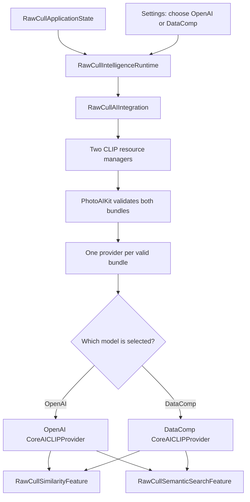
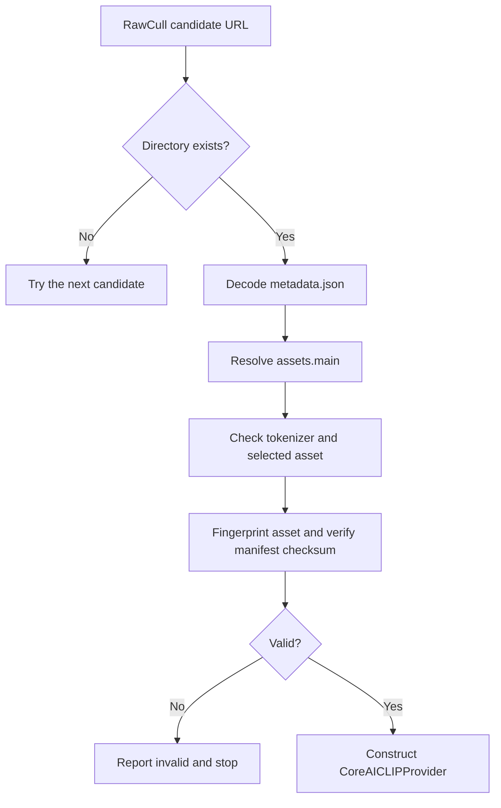
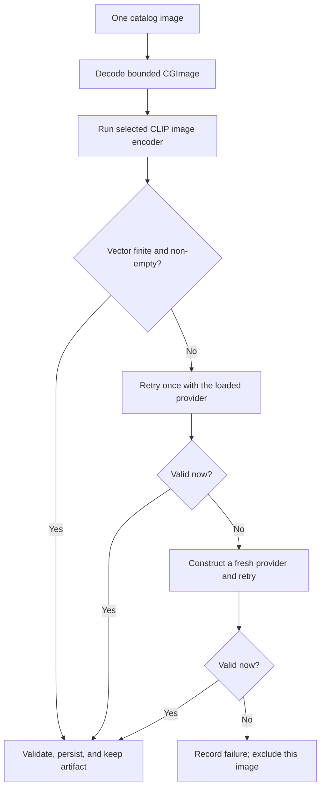

+++
author = "Thomas Evensen"
title = "How RawCull Loads and Uses CLIP"
linkTitle = "CLIP in RawCull"
date = "2026-08-21"
lastmod = "2026-08-31"
description = "A beginner-friendly source walk-through of RawCull's OpenAI and DataComp CLIP models, model loading, PhotoAIKit packages, image similarity, semantic search, recovery, and persistence."
tags = ["ai", "clip", "openai", "datacomp", "photoaikit", "semantic-search", "similarity", "rawcull"]
categories = ["technical details"]
mermaid = true
weight = 20
+++

# How RawCull Loads and Uses CLIP

RawCull supports two CLIP models:

- **OpenAI CLIP ViT-B/32**, which processes a 224 × 224 image;
- **OpenCLIP DataComp ViT-B-32-256**, which processes a 256 × 256 image.

The user selects one model in **Settings > AI**. That one selection defines the
vector space used for both image-to-image similarity and text-to-image semantic
search. RawCull never mixes vectors from the two models.

This page starts with the basic idea behind CLIP and then follows the current
source code from application startup, through model validation and Core AI
inference, to search results, burst groups, and persisted artifacts.

## 1. CLIP In Plain Language

CLIP stands for **Contrastive Language-Image Pre-training**. It was trained to
place matching images and text descriptions near each other in a shared
mathematical space.

For example, CLIP can turn these two inputs into vectors:

```text
image: a photograph of a red fox at dusk  ──► [0.012, -0.084, ...]
text:  "red fox at dusk"                  ──► [0.018, -0.079, ...]
```

A vector is just an ordered list of numbers. RawCull does not display those
numbers to the user. It compares their directions:

- two image vectors pointing in similar directions represent visually or
  semantically related images;
- an image vector pointing in a similar direction to a text vector is a possible
  match for that text;
- vectors produced by different CLIP models are not comparable, even when they
  contain the same number of values.

CLIP does not write a caption, locate the exact pixels of an object, rate a
photo, or decide which burst frame is sharpest. It provides similarity evidence.
RawCull decides how to use that evidence.

The original [OpenAI CLIP introduction](https://openai.com/index/clip/) and
[CLIP paper](https://arxiv.org/abs/2103.00020) explain the contrastive training
method in more depth.

## 2. Why There Are Two CLIP Models

Both choices use the same general CLIP idea and the same size of output vector,
but they use different learned weights and different image resolutions.

| Property              | OpenAI model                   | DataComp model                            |
| --------------------- | ------------------------------ | ----------------------------------------- |
| RawCull name          | OpenAI                         | DataComp                                  |
| Bundle folder         | `CLIP-OpenAI`                  | `CLIP-DataComp`                           |
| Export source         | `openai/clip-vit-base-patch32` | `mlfoundations/open_clip`                 |
| Architecture          | `ViT-B-32`                     | `ViT-B-32-256`                            |
| Pretrained checkpoint | Original OpenAI weights        | `datacomp_s34b_b86k`                      |
| Model input           | 224 × 224 RGB                  | 256 × 256 RGB                             |
| Image patch size      | 32 × 32 pixels                 | 32 × 32 pixels                            |
| Embedding size        | 512 floating-point values      | 512 floating-point values                 |
| Text context          | 77 tokens                      | 77 tokens                                 |
| Token padding         | End-of-text token `49407`      | Zero                                      |
| Text attention mask   | Supplied                       | Not required by the exported text encoder |

The model details do not come from hard-coded branches inside
`CoreAICLIPProvider`. The exporter writes them into each bundle's
`metadata.json`, and the provider builds a `CLIPRuntimeConfiguration` from that
metadata.

### 2.1 OpenAI CLIP ViT-B/32

The OpenAI choice is the original `clip-vit-base-patch32` checkpoint used by
PhotoAIKit's exporter.

`ViT-B/32` can be read as:

- **ViT**: the image encoder is a Vision Transformer;
- **B**: the base-size transformer family;
- **32**: the image is divided into 32 × 32 pixel patches before transformer
  processing.

The exported image encoder receives a 224 × 224 image and returns a
512-dimensional, L2-normalized image vector. The exported text encoder receives
up to 77 CLIP BPE tokens plus an attention mask and returns a normalized
512-dimensional text vector.

The original CLIP family was trained on 400 million image-text pairs collected
from the internet. The aim was not to learn a fixed list of RawCull categories.
It learned a broad relationship between visual content and natural-language
descriptions.

### 2.2 OpenCLIP DataComp ViT-B-32-256

The DataComp choice uses the open-source
[OpenCLIP](https://github.com/mlfoundations/open_clip) implementation and the
`datacomp_s34b_b86k` checkpoint. Its architecture is `ViT-B-32-256`: a base
Vision Transformer with 32 × 32 patches and a 256 × 256 image input.

This checkpoint was trained on the DataComp-1B dataset and its published name
records that the training run saw approximately 34 billion samples. The
[DataComp model card](https://huggingface.co/laion/CLIP-ViT-B-32-256x256-DataComp-s34B-b86K)
describes the released checkpoint.

The DataComp model also produces 512-dimensional normalized vectors and uses a
77-token CLIP BPE context. Its exported text graph follows OpenCLIP's input
contract: token IDs are padded with zero and no separate attention-mask input is
required.

### 2.3 What The Model Choice Means In RawCull

The two models can rank the same catalog differently because their weights,
training data, and input resolution differ. RawCull does not declare one model
universally better. It treats them as two valid alternatives.

The important rule is:

> An OpenAI image vector can be compared only with OpenAI image or text vectors
> from the same model fingerprint and processing configuration. The equivalent
> rule applies to DataComp.

Both output 512 values, but matching dimensions alone do not make two vector
spaces compatible.

## 3. Packages And Frameworks In The CLIP Path

RawCull is the host application. Most reusable CLIP mechanics live in
PhotoAIKit, while RAW decoding and culling policy remain in RawCull.

### 3.1 Swift Packages Used At Runtime

| Package or product          | How CLIP uses it                                                                                                                                                                                                     |
| --------------------------- | -------------------------------------------------------------------------------------------------------------------------------------------------------------------------------------------------------------------- |
| `PhotoAIContracts`          | Defines model identities, bundle validation, backend descriptors, image and text embeddings, similarity artifacts, source fingerprints, and the small provider/decoder protocols shared by RawCull and the backends. |
| `CoreAICLIPBackend`         | Supplies `CoreAICLIPProvider`, the actor that reads CLIP metadata, tokenizes text, preprocesses images, lazily runs Core AI, creates artifacts, and compares compatible image and text vectors.                      |
| `PhotoAIWorkflows`          | Supplies `SimilarityArtifactIndexer`, which performs bounded asynchronous decode-and-inference work and reports per-source progress and failures.                                                                    |
| `PhotoAIStorage`            | Supplies the descriptor-complete artifact codec used by RawCull's per-file similarity store.                                                                                                                         |
| `VisionFeaturePrintBackend` | Supplies the always-available Apple Vision similarity backend used when CLIP is disabled, missing, invalid, or cannot create a provider. It is not a per-image fallback during a selected CLIP indexing pass.        |
| `RawParserKit`              | Extracts a bounded thumbnail `CGImage` from supported camera RAW files before PhotoAIKit sees the image.                                                                                                             |
| `RawCullCore`               | Groups adjacent photos using the distances RawCull computed from CLIP artifacts and owns shared burst-domain types.                                                                                                  |

RawCull also links `CoreAISAM3Backend`, but SAM 3 is a separate segmentation
model. Its resource check happens alongside the two CLIP checks; it is not used
to calculate CLIP vectors.

PhotoAIKit has one external Swift package dependency: `apple/coreai-models`,
pinned to an exact revision. Its `CoreAISegmentation` product makes the Core AI
runtime APIs available to the CLIP and SAM 3 backend targets.

### 3.2 Apple Frameworks Used Around The Packages

| Framework               | Role                                                                                                                            |
| ----------------------- | ------------------------------------------------------------------------------------------------------------------------------- |
| Core AI                 | Loads the `.aimodel` or `.aimodelc`, specializes it for the Mac, creates NDArrays, and runs the named image and text functions. |
| Core Graphics           | Converts a decoded `CGImage` into the model's sRGB pixel input.                                                                 |
| ImageIO                 | Provides RawCull's secondary thumbnail-decoding path when `RawParserKit` cannot return an image.                                |
| Vision                  | Produces feature prints when RawCull selects its non-CLIP similarity service.                                                   |
| Foundation              | Provides URLs, JSON coding, file metadata, `UserDefaults`, tasks, and application-support paths.                                |
| CryptoKit               | Supports stable cache keys and model/artifact fingerprinting code.                                                              |
| SwiftUI and Observation | Present the model picker, CLIP toggle, capability state, indexing progress, and semantic-search controls.                       |
| OSLog                   | Records backend selection, model fingerprints, failures, and diagnostics.                                                       |

### 3.3 Python Packages Used Only To Export Models

The model bundle is created before RawCull runs. PhotoAIKit's
`Tools/export_clip.py` declares these build-time tools:

| Python package            | Export-time job                                                      |
| ------------------------- | -------------------------------------------------------------------- |
| `transformers`            | Loads the OpenAI CLIP checkpoint and saves its tokenizer.            |
| `open_clip_torch`         | Loads the OpenCLIP DataComp architecture and checkpoint.             |
| `torch` and `torchvision` | Hold the source model and tensors used during export.                |
| `coreai-torch`            | Converts the PyTorch image and text encoders into Core AI functions. |
| `coreai-core`             | Saves and optimizes the portable Core AI model asset.                |

These Python packages are not shipped as part of RawCull's Swift runtime.

## 4. The Complete Runtime Shape

The main path is:



There may be two validated providers in memory, but RawCull exposes only the
selected provider to the active similarity and semantic-search features.

## 5. Startup Uses Vision First

`RawCull/Main/RawCullApp.swift` creates the object graph synchronously through
`RawCullApplicationState.live()`:

```swift
let applicationState = RawCullApplicationState.live()
_viewModel = State(initialValue: applicationState.viewModel)
_intelligenceRuntime = State(
    initialValue: applicationState.intelligenceRuntime
)
```

Assembly creates one integration, one shared `SimilarityScoringModel`, focused
similarity and semantic-search features, a `DeepAIReviewController`, the main
view model, settings/model-management models, and the stable runtime. Vision is
the initial similarity service because it needs no downloaded bundle, so the app
can open even when both CLIP folders are absent.

`RawCullAISettingsModel` binds weakly to the runtime as a
`RawCullIntelligenceConfigurationApplying` consumer. Each refresh publishes one
complete, monotonically revisioned configuration containing similarity,
semantic-search, and segmentation choices. The runtime rejects stale revisions
and changes only services whose descriptor identity differs.

The asynchronous `.task` attached to the main window calls
`aiSettingsModel.refresh()`. Model directory inspection, fingerprinting, and
provider construction therefore do not block `RawCullApp.init()`.

## 6. Preferences And The Selected Model

`RawCull/Intelligence/ModelManagement/RawCullAISettingsModel.swift` stores two
CLIP preference values:

```text
RawCullAI.useCLIPForSimilarity
RawCullAI.selectedCLIPModel
```

When no values have been saved:

- CLIP similarity defaults to enabled;
- the OpenAI model is the default selection.

The model picker is mutually exclusive. Choosing DataComp replaces OpenAI as the
selected model; it does not combine their results.

The CLIP toggle is a request, not proof that a model is usable:

| CLIP toggle | Selected bundle valid | Similarity backend   |
| ----------- | --------------------: | -------------------- |
| Off         |             No or yes | Vision feature print |
| On          |                    No | Vision feature print |
| On          |                   Yes | Selected CLIP model  |

Semantic-search readiness is tracked separately because Vision can compare two
images but cannot compare an image with text. A valid selected CLIP provider is
required for semantic search.

RawCull can read already-cached compatible CLIP artifacts for semantic search.
To create missing semantic-search artifacts through the normal indexing button,
the selected CLIP model must also be active as the similarity backend.

Changing the selected model immediately reapplies both services. It is not
necessary to restart RawCull.

## 7. Model Locations

`RawCullAIPaths.live()` creates two separate installed-model locations:

```text
~/Library/Application Support/RawCull/Models/
├── CLIP-DataComp/
└── CLIP-OpenAI/
```

A sandboxed build resolves the same relative folders inside its container:

```text
~/Library/Containers/no.blogspot.RawCull/Data/Library/Application Support/
└── RawCull/Models/
    ├── CLIP-DataComp/
    └── CLIP-OpenAI/
```

**Settings > AI** shows the exact paths for the running build.

`RawCullAIModelCandidates.urls(...)` puts the installed directory first. Debug
builds may add app-bundle resource candidates such as `Models/CLIP-OpenAI`;
release builds do not use bundled fallback unless it is explicitly enabled
during construction.

PhotoAIKit does not search these paths. RawCull owns path policy and passes an
ordered URL list into the package.

## 8. What A CLIP Bundle Contains

Each model has its own self-contained directory:

```text
CLIP-OpenAI/ or CLIP-DataComp/
├── metadata.json
├── tokenizer/
│   └── tokenizer.json
└── selected-model.aimodel
```

The selected model may instead be a compiled `.aimodelc` directory.

A current metadata version 0.4 export describes:

- model family, source, revision, architecture, and pretrained checkpoint;
- 512 embedding dimensions;
- input width and height;
- shortest-side resize, center crop, and interpolation policy;
- RGB mean and standard deviation;
- tokenizer type, version, context length, and padding token;
- the `image_encoder` and `text_encoder` function names;
- output normalization and configuration versions;
- `assets.main`, which names the selected Core AI asset;
- `asset_fingerprints.main`, which records the expected asset fingerprint.

This matters because a model is more than its weight file. The tokenizer and
preprocessing rules must match the weights used during training.

## 9. Validation And Provider Construction

`RawCullAIIntegration` owns one resource manager for each model:

```text
clipDataCompModelResourceManager
clipOpenAIModelResourceManager
```

During `refreshCapabilities()`, RawCull loads SAM 3, DataComp CLIP, and OpenAI
CLIP concurrently:

```swift
async let sam3Load = sam3ModelResourceManager.load()
async let clipDataCompLoad = clipDataCompModelResourceManager.load()
async let clipOpenAILoad = clipOpenAIModelResourceManager.load()
```

Each `RawCullAIModelResourceManager` is an actor. It first builds a lightweight
snapshot from paths, file kinds, sizes, modification dates, and resolved
symbolic-link paths. If nothing changed, it can reuse the previous capability
and provider instead of hashing a large model again.

When the snapshot changes, PhotoAIKit remains the authority:



A missing candidate is skipped. An invalid higher-priority candidate stops
resolution instead of being hidden by a lower-priority debug bundle.

The provider constructor validates the bundle again, stores its fingerprinted
`ModelIdentity`, decodes `metadata.json`, and validates the model-specific
`CLIPRuntimeConfiguration`. It does **not** load the large Core AI model yet.

Capability and provider-construction failure are recorded separately. Settings
can therefore distinguish a missing or damaged bundle from a bundle that
validated but could not initialize its runtime configuration.

## 10. Lazy Core AI Loading

The first image or text embedding request calls
`CoreAICLIPProvider.loadModel()`.

The provider then:

1. reads `assets.main` and creates an `AIModel`;
2. asks Core AI to prefer GPU specialization;
3. creates `CLIPTokenizer` from the bundle's tokenizer folder;
4. finds and loads the metadata-selected image and text functions;
5. requires `pixel_values` and `image_embeds` on the image side;
6. requires `input_ids` and `text_embeds` on the text side;
7. accepts `attention_mask` when the text function declares it;
8. validates tensor ranks, dimensions, scalar types, resolution, and token
   context length;
9. caches the functions, descriptors, tokenizer, and compatibility inputs inside
   the provider actor.

New bundles use two named functions in one asset:

```text
image_encoder(pixel_values)                 -> image_embeds
text_encoder(input_ids[, attention_mask])  -> text_embeds
```

This avoids running the text tower while indexing an image and avoids running
the image tower for every search query.

PhotoAIKit still supports older single-function CLIP exports. If an older image
function also requires text inputs, the provider supplies tokens for
`"a photo"`. If an older text function requires an image, it supplies a zero
image. These are compatibility inputs, not RawCull's semantic-search query.

The loaded model is cached in the actor, so later requests reuse it. The first
request can take longer because macOS may specialize a portable model for the
current Mac.

## 11. From A RAW File To Model Pixels

PhotoAIKit deliberately does not know how to decode camera RAW formats.
RawCull's `RawCullSimilarityImageDecoder` supplies that application-specific
step.

For each `AIImageSource`, the decoder:

1. checks task cancellation;
2. asks `RawParserKitImageLoader` for a thumbnail no larger than 512 pixels;
3. if that fails, asks ImageIO for an existing embedded thumbnail;
4. reports `imageDecodeFailed` if neither path returns a `CGImage`.

The 512-pixel value belongs to RawCull's embedding pipeline. It gives the model
provider a bounded image instead of decoding an unnecessarily large RAW preview.

The selected provider then applies the exact preprocessing declared by that
model:

1. convert to an 8-bit sRGB RGBA drawing buffer;
2. resize the shortest side while preserving aspect ratio;
3. take a centered 224 × 224 OpenAI crop or 256 × 256 DataComp crop;
4. convert red, green, and blue from bytes to values in `0 ... 1`;
5. subtract CLIP means `0.48145466`, `0.4578275`, and `0.40821073`;
6. divide by CLIP standard deviations `0.26862954`, `0.26130258`, and
   `0.27577711`;
7. change interleaved RGB into channel-first `[1, 3, height, width]` order;
8. write a Float16 or Float32 Core AI NDArray, as required by the model.

The center crop can remove pixels near the long edges of a photograph. That is
intentional: preprocessing must match the model's training and export contract.

## 12. Creating A CLIP Image Artifact

After preprocessing, the provider runs `image_encoder` and reads `image_embeds`.

Both current graphs export an L2-normalized vector. PhotoAIKit wraps the result
in `ImageEmbedding`, which also applies safe L2 normalization:

```text
magnitude = sqrt(sum(value²))
normalizedValue = value / magnitude
```

The provider then creates a `SimilarityArtifact`:

```text
SimilarityArtifact
├── descriptor
│   ├── backend = "clip"
│   ├── model fingerprint
│   ├── dimensions = 512
│   ├── representation version
│   ├── preprocessing version
│   ├── normalization version
│   ├── configuration version
│   ├── source path, size, and modification date
│   └── artifact schema version
└── payload
    └── JSON-encoded ImageEmbedding vector
```

The descriptor prevents RawCull from treating a vector as reusable merely
because it can be decoded.

## 13. Indexing, Concurrency, And Failure Recovery

`RawCullCLIPSimilarityService` creates a PhotoAIKit `SimilarityArtifactIndexer`
with:

- the selected CLIP provider;
- RawCull's diagnosing RAW decoder;
- no per-image or whole-batch fallback provider;
- a current concurrency limit of 1.

The current CLIP behavior is:



Only non-finite embedding output receives the two recovery attempts. A decode
error or another model error is recorded for that source without discarding
valid CLIP artifacts already created for other images.

This is different from the earlier whole-batch fallback design:

- RawCull no longer throws away a successful CLIP pass because one image failed;
- it does not mix Vision artifacts into a selected CLIP indexing pass;
- a failed image has no current artifact and is excluded from similarity
  comparisons and burst grouping until it can be indexed successfully.

When CLIP is disabled or its selected bundle is unavailable at service selection
time, RawCull uses `RawCullVisionSimilarityService` instead. Vision currently
indexes with a concurrency limit of 4.

`RawCullCLIPFailureRecorder` logs the file and failing stage (`decode` or
`inference`). `SimilarityScoringModel` also records a partial-CLIP diagnostics
event with the successful and failed counts. The diagnostics schema can still
represent a legacy `usedWholeBatchFallback` result, and PhotoAIKit's generic
indexer still supports `.wholeBatch`; the current RawCull CLIP service selects
`.none`, so that branch is not produced by current CLIP indexing.

### Burst and semantic artifact boundaries

`SimilarityScoringModel` deliberately keeps two maps:

- `embeddings` is the active burst/image-similarity set and may contain Vision
  or CLIP artifacts from the selected similarity service;
- `semanticArtifacts` contains only CLIP artifacts compatible with the selected
  semantic-search descriptor.

A successful CLIP artifact may be admitted to both maps, but the maps are not
interchangeable. Vision artifacts can drive burst grouping but cannot be
compared with a CLIP text embedding. Semantic search never generates missing
image artifacts; it searches the compatible set already hydrated or indexed by
similarity work.

## 14. How RawCull Uses Image-To-Image Distance

For two compatible CLIP artifacts, PhotoAIKit computes cosine distance:

```text
cosineDistance(a, b) =
    1 - dot(a, b) / (magnitude(a) × magnitude(b))
```

For normalized vectors:

- `0` means the directions are effectively identical;
- `1` means the directions are orthogonal;
- `2` means the directions are opposite.

Before computing the value, the provider verifies that both artifacts have the
same model fingerprint, dimensions, representation, preprocessing,
normalization, configuration, and schema. It also checks that each JSON payload
matches its descriptor.

RawCull uses this primitive distance in three ways:

1. **Find similar images.** It compares a selected anchor image with every
   compatible catalog artifact and sorts smaller distances first.
2. **Apply a small product-policy adjustment.** If available saliency labels
   identify different subjects, `SimilarityScoringModel` adds `0.10` to the
   distance.
3. **Group bursts.** It compares adjacent images in capture order and passes the
   distances to `RawCullCore.BurstGroupingEngine`. The current default visual
   threshold is `0.25`.

CLIP supplies the distance. RawCull owns the saliency adjustment, threshold,
burst rules, sharpness scoring, recommendation, and rating behavior.

If an image has no valid artifact, burst grouping splits the ordered catalog
into eligible runs around that gap. It does not invent a distance across the
missing image.

## 15. How Semantic Search Works

Semantic search uses the text half of the same selected CLIP provider and the
already-persisted image artifacts.

For a query such as `red fox at dusk`, RawCull:

1. trims surrounding whitespace but otherwise sends the literal query;
2. tokenizes it with the bundle's CLIP BPE tokenizer;
3. truncates or pads it to the model's 77-token context;
4. runs `text_encoder`;
5. validates that the returned 512-value vector is finite, non-empty, and
   L2-normalized;
6. compares it only with cached image artifacts that match the selected model
   and every backend descriptor field;
7. sorts larger cosine-similarity scores first.

Image-to-text uses cosine **similarity**, not distance:

```text
cosineSimilarity(image, text) = dot(imageVector, textVector)
```

The provider clamps the result to `-1 ... 1`. It is a relative ranking score,
not a calibrated probability or confidence percentage.

The text embedding is query-scoped and is not written to disk. The expensive
image encoder does not run during a search. Only the text encoder runs once,
followed by ordinary vector dot products over the compatible cached images.

RawCull's deterministic tie order is:

1. higher score;
2. earlier catalog order;
3. localized filename order;
4. UUID string.

The UI initially presents the highest-ranked 20 images. The user can expand the
selection without recomputing embeddings or scores. Rating and filename filters
are applied before semantic ranking, and the selected semantic results become
the active catalog working set until the search is cleared.

## 16. Persisting And Reusing Image Artifacts

RawCull persists successful similarity artifacts per source file under:

```text
Application Support/RawCull/
└── AnalysisArtifacts/
    └── Similarity/
```

`PerFileAnalysisArtifactStore` writes one atomic JSON record per
source/backend/pipeline identity. This lets an artifact survive application
restart and be reused by both image similarity and semantic search.

The store validates:

- standardized source path, file size, and modification date;
- selected model fingerprint;
- artifact schema and vector representation;
- preprocessing, normalization, and configuration versions;
- RawCull's 512-pixel input limit;
- RawCull embedding pipeline version 3.

Moving or renaming a source file changes its standardized path and is therefore
a cache miss. The default pruning policy removes records unused for 90 days and
caps the store at 50,000 entries.

RawCull also saves catalog-wide burst analysis under:

```text
Application Support/RawCull/BurstAnalysis/
```

The current burst cache schema is 9. Its similarity signature includes grouping
configuration, the selected backend descriptor, accepted artifact descriptors,
artifact schema, 512-pixel input limit, and embedding pipeline version. It also
verifies the catalog, file identities, and a digest of the artifact set.

These identities create independent invalidation paths:

```text
model asset changed       -> model fingerprint mismatch
selected model changed    -> backend descriptor mismatch
preprocessing changed     -> preprocessing or pipeline mismatch
source file changed       -> source fingerprint mismatch
artifact format changed   -> schema mismatch
grouping policy changed   -> burst signature mismatch
```

## 17. Switching Between OpenAI And DataComp

When the selected model changes, `RawCullAISettingsModel` publishes a newer
complete configuration. `RawCullIntelligenceRuntime.apply(configuration:)`
compares its identity with the last accepted configuration.

If the similarity identity changed, `RawCullSimilarityFeature`:

1. cancels incompatible similarity work through its bound application context;
2. installs the new service in the shared scoring model;
3. invalidates superseded hydration/indexing generations;
4. hydrates only artifacts compatible with the new descriptor and current
   catalog.

The semantic-search configuration is replaced independently through the focused
feature. Both features deliberately project the same scoring-model identity;
views do not reach through them to that low-level model.

This reset is required even though both models return 512 values. Keeping an
OpenAI vector while labeling the active service DataComp would make every
subsequent comparison mathematically meaningless.

## 18. Cancellation And Stale-Result Protection

The code uses two complementary mechanisms:

- **Task cancellation** asks ongoing decode, inference, persistence, or ranking
  work to stop.
- **Generation counters** prevent a result from being published after the user
  has started a newer operation or switched models.

The decoder checks cancellation before and after image loading. The CLIP
recovery path never converts `CancellationError` into a model failure. Indexing,
image ranking, semantic search, semantic artifact hydration, and burst grouping
each keep their own generation.

Cancellation answers “should this work continue?” A generation check answers
“even if it finished, does it still belong to the current user action?”

## 19. Troubleshooting

Use this order because it follows the runtime path:

1. **Check the selected model.** OpenAI and DataComp use different folders.
2. **Check the CLIP toggle.** It must be on to index missing CLIP artifacts
   through the normal similarity workflow.
3. **Check Settings capability text.** A saved preference does not mean that the
   selected provider exists.
4. **Check the displayed folder.** Use the exact path shown by the running
   sandboxed or non-sandboxed build.
5. **Check the bundle structure.** Confirm `metadata.json`,
   `tokenizer/tokenizer.json`, and the `.aimodel` or `.aimodelc` selected by
   `assets.main`.
6. **Check the fingerprint.** A declared checksum must match the selected asset.
7. **Check metadata compatibility.** Resolution, crop policy, token context,
   function names, tensor names, shapes, and scalar types must match the Core AI
   asset.
8. **Remove or repair an invalid higher-priority install.** Resolution stops at
   an invalid installed directory instead of silently using a debug-bundled
   copy.
9. **Expect the first inference to be slower.** Core AI may specialize the model
   for the Mac.
10. **Inspect similarity diagnostics.** A partial CLIP result identifies decode
    or inference failures by image. It does not mean that the complete catalog
    switched to Vision.
11. **Reindex missing images.** Images that still produced invalid output after
    recovery remain excluded until a later successful indexing pass.
12. **Check semantic-search coverage.** Search ranks compatible cached CLIP
    artifacts only; it never decodes and indexes missing images as a side effect
    of submitting a query.

## 20. Source Map

| Concern                                                        | Current source                                                                                                                             |
| -------------------------------------------------------------- | ------------------------------------------------------------------------------------------------------------------------------------------ |
| App construction and stable runtime                            | `RawCull/Main/RawCullApp.swift`, `RawCull/Intelligence/Composition/RawCullIntelligenceRuntime.swift`                                       |
| CLIP choices and application-support paths                     | `RawCull/Intelligence/Contracts/RawCullAIModels.swift`                                                                                     |
| Candidate URLs and cached resource checks                      | `RawCull/Intelligence/ModelManagement/RawCullAIModelResourceManager.swift`                                                                 |
| Provider dictionaries, selection, and refresh                  | `RawCull/Intelligence/Composition/RawCullAIIntegration.swift`                                                                              |
| Saved preference and selected model                            | `RawCull/Intelligence/ModelManagement/RawCullAISettingsModel.swift`                                                                        |
| Settings model picker and capability status                    | `RawCull/Views/Settings/AISettingsTab.swift`                                                                                               |
| Focused similarity and semantic-search boundaries              | `RawCull/Intelligence/Similarity/RawCullSimilarityFeature.swift`, `RawCull/Intelligence/SemanticSearch/RawCullSemanticSearchFeature.swift` |
| RAW decoding, CLIP retry, Vision service, and distance routing | `RawCull/Intelligence/Similarity/RawCullVisionSimilarityService.swift`                                                                     |
| Image indexing, ranking, grouping, and semantic-search state   | `RawCull/Intelligence/Similarity/SimilarityScoringModel.swift`                                                                             |
| Literal query ranking service                                  | `RawCull/Intelligence/SemanticSearch/RawCullSemanticSearchService.swift`                                                                   |
| Semantic-search controls and coverage                          | `RawCull/Views/SimilarityGridView/SemanticSearchViews.swift`                                                                               |
| Per-file artifact persistence                                  | `RawCull/Intelligence/Persistence/PerFileAnalysisArtifactStore.swift`                                                                      |
| Catalog-wide burst persistence                                 | `RawCull/Intelligence/Persistence/BurstAnalysisCache.swift`                                                                                |
| PhotoAIKit package products                                    | `PhotoAIKit/Package.swift`                                                                                                                 |
| Metadata-driven runtime configuration                          | `PhotoAIKit/Sources/CoreAICLIPBackend/CLIPRuntimeConfiguration.swift`                                                                      |
| Image and text inference                                       | `PhotoAIKit/Sources/CoreAICLIPBackend/CoreAICLIPProvider.swift`                                                                            |
| Bundle resolution and fingerprint identity                     | `PhotoAIKit/Sources/PhotoAIContracts/ModelBundleResolver.swift`, `ModelIdentity.swift`, and `ModelAssetFingerprint.swift`                  |
| Model exporter and exact model specifications                  | `PhotoAIKit/Tools/export_clip.py`                                                                                                          |

For the package layering behind these types, continue with
[How PhotoAIKit Is Constructed](../../packages/photoaikit/).
