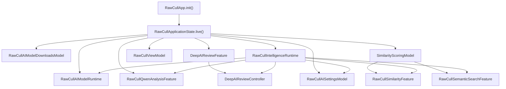
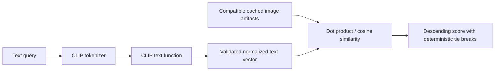

i+++
author = "Thomas Evensen"
title = "AI Models in RawCull"
linkTitle = "AI Models in RawCull"
date = "2026-09-20"
lastmod = "2026-09-20"
description = "A code-level guide to RawCull's local AI models: runtime construction, CLIP similarity and semantic search, SAM 3 Deep Review, and Qwen vision-language analysis."
weight = 58
tags = ["ai", "clip", "sam3", "qwen", "architecture", "core-ai"]
categories = ["technical details"]
mermaid = true
+++

# AI Models in RawCull

RawCull uses several local machine-learning backends, but it does not treat them
as interchangeable. Each model family has a deliberately narrow job:

| Model or backend | RawCull job | Output used by RawCull |
| --- | --- | --- |
| DataComp CLIP | Image similarity, burst grouping, semantic search, and coarse subject labels for Deep Review | Normalized image/text embedding vectors and cosine distances/similarities |
| OpenAI CLIP | Fully implemented alternative CLIP bundle; currently excluded from the production model list | The same typed CLIP artifacts as DataComp, with a different model fingerprint |
| SAM 3 | Text-prompted subject segmentation for Deep Review | A subject mask, prompt, confidence, geometry, quality, and diagnostics |
| Qwen3-VL-2B-Instruct | Independent vision-language assessment of selected or tagged photographs | A structured photo assessment or a free-form response |
| Apple Vision feature print | Always-available image-similarity fallback | Opaque Vision feature-print artifacts and native distances |

All inference stays in the application process. The downloadable model assets
are installed separately because they are large, but the analysis path does not
send photographs to a remote inference service.

This page follows RawCull commit
[`3c4315d9`](https://github.com/rsyncOSX/RawCull/tree/3c4315d9bd1717fdabb1795ee0efa2eaf5ff87c2)
and the PhotoAIKit revision pinned by that project,
[`c5c76590`](https://github.com/rsyncOSX/PhotoAIKit/tree/c5c76590c3d79ad508d24d893cd7d8d6aa873355).
Code links are pinned to those revisions so that the explanation remains tied to
the implementation it describes.

## Source Catalog: `RawCull/Intelligence`

The `Intelligence` directory is organized by responsibility rather than by one
model per folder. Start with this catalog when tracing the code.

### Composition and contracts

| Source | Responsibility |
| --- | --- |
| [`Composition/RawCullAIModelRuntime.swift`](https://github.com/rsyncOSX/RawCull/blob/3c4315d9bd1717fdabb1795ee0efa2eaf5ff87c2/RawCull/Intelligence/Composition/RawCullAIModelRuntime.swift) | Owns model-resource managers, validated CLIP and SAM 3 providers, the Vision fallback, Qwen inference runtime, mask stores, and the active segmentation pipeline. |
| [`Composition/RawCullIntelligenceRuntime.swift`](https://github.com/rsyncOSX/RawCull/blob/3c4315d9bd1717fdabb1795ee0efa2eaf5ff87c2/RawCull/Intelligence/Composition/RawCullIntelligenceRuntime.swift) | Assembles the complete application AI graph and preserves stable feature identities while services change. |
| [`Contracts/RawCullAIModels.swift`](https://github.com/rsyncOSX/RawCull/blob/3c4315d9bd1717fdabb1795ee0efa2eaf5ff87c2/RawCull/Intelligence/Contracts/RawCullAIModels.swift) | Defines model choices, paths, capability states, and saved-artifact evidence. |

### Model management

| Source | Responsibility |
| --- | --- |
| [`RawCullAIModelDownloadCatalog.swift`](https://github.com/rsyncOSX/RawCull/blob/3c4315d9bd1717fdabb1795ee0efa2eaf5ff87c2/RawCull/Intelligence/ModelManagement/RawCullAIModelDownloadCatalog.swift) | Production model inventory, inclusion switches, asset-pack identifiers, versions, byte counts, checksums, licences, and provenance links. |
| [`RawCullAIModelDownloadService.swift`](https://github.com/rsyncOSX/RawCull/blob/3c4315d9bd1717fdabb1795ee0efa2eaf5ff87c2/RawCull/Intelligence/ModelManagement/RawCullAIModelDownloadService.swift) | Background Assets download coordination and installed-location resolution. |
| [`RawCullAIModelDownloadsModel.swift`](https://github.com/rsyncOSX/RawCull/blob/3c4315d9bd1717fdabb1795ee0efa2eaf5ff87c2/RawCull/Intelligence/ModelManagement/RawCullAIModelDownloadsModel.swift) | Observable download, licence, progress, removal, and installed-location state. |
| [`RawCullAIModelResourceManager.swift`](https://github.com/rsyncOSX/RawCull/blob/3c4315d9bd1717fdabb1795ee0efa2eaf5ff87c2/RawCull/Intelligence/ModelManagement/RawCullAIModelResourceManager.swift) | Actor-isolated validation and provider construction with a metadata snapshot cache. |
| [`RawCullAISettingsModel.swift`](https://github.com/rsyncOSX/RawCull/blob/3c4315d9bd1717fdabb1795ee0efa2eaf5ff87c2/RawCull/Intelligence/ModelManagement/RawCullAISettingsModel.swift) | Applies installed locations, refreshes capabilities, stores user selections, and publishes revisioned runtime configurations. |

### CLIP, similarity, and semantic search

| Source | Responsibility |
| --- | --- |
| [`RawCullVisionSimilarityService.swift`](https://github.com/rsyncOSX/RawCull/blob/3c4315d9bd1717fdabb1795ee0efa2eaf5ff87c2/RawCull/Intelligence/Similarity/RawCullVisionSimilarityService.swift) | Defines the shared similarity-service boundary, Vision implementation, CLIP implementation, RAW decoding adapter, finite-vector recovery, and artifact validation. |
| [`SimilarityScoringModel.swift`](https://github.com/rsyncOSX/RawCull/blob/3c4315d9bd1717fdabb1795ee0efa2eaf5ff87c2/RawCull/Intelligence/Similarity/SimilarityScoringModel.swift) | Owns indexed artifacts, hydration, persistence, image ranking, grouping, semantic-search state, and CLIP-based subject classification. |
| [`RawCullSimilarityFeature.swift`](https://github.com/rsyncOSX/RawCull/blob/3c4315d9bd1717fdabb1795ee0efa2eaf5ff87c2/RawCull/Intelligence/Similarity/RawCullSimilarityFeature.swift) | Stable application-facing similarity surface with cancellation and generation gates. |
| [`RawCullSemanticSearchService.swift`](https://github.com/rsyncOSX/RawCull/blob/3c4315d9bd1717fdabb1795ee0efa2eaf5ff87c2/RawCull/Intelligence/SemanticSearch/RawCullSemanticSearchService.swift) | Encodes a text query, admits compatible CLIP artifacts, compares image and text vectors, and ranks deterministically. |
| [`RawCullSemanticSearchFeature.swift`](https://github.com/rsyncOSX/RawCull/blob/3c4315d9bd1717fdabb1795ee0efa2eaf5ff87c2/RawCull/Intelligence/SemanticSearch/RawCullSemanticSearchFeature.swift) | Presentation and application-target adapter for semantic search. |

### Deep Review with SAM 3 and CLIP

| Source | Responsibility |
| --- | --- |
| [`DeepAIReviewController.swift`](https://github.com/rsyncOSX/RawCull/blob/3c4315d9bd1717fdabb1795ee0efa2eaf5ff87c2/RawCull/Intelligence/DeepReview/DeepAIReviewController.swift) | Converts the current RawCull selection, burst evidence, sharpness evidence, subject label, and AF point into a review request. |
| [`DeepAIReviewFeature.swift`](https://github.com/rsyncOSX/RawCull/blob/3c4315d9bd1717fdabb1795ee0efa2eaf5ff87c2/RawCull/Intelligence/DeepReview/DeepAIReviewFeature.swift) | Owns review state and implements the complete decode → prompt → mask → score → recommendation pipeline. |
| [`SubjectMaskFocusScorer.swift`](https://github.com/rsyncOSX/RawCull/blob/3c4315d9bd1717fdabb1795ee0efa2eaf5ff87c2/RawCull/Intelligence/DeepReview/SubjectMaskFocusScorer.swift) | Computes subject-only broad, local, and fine detail evidence from an image and SAM mask. |
| [`DeepAIReviewMaskOutlineRenderer.swift`](https://github.com/rsyncOSX/RawCull/blob/3c4315d9bd1717fdabb1795ee0efa2eaf5ff87c2/RawCull/Intelligence/DeepReview/DeepAIReviewMaskOutlineRenderer.swift) | Turns a persisted filled mask into a display outline. |

### Qwen

| Source | Responsibility |
| --- | --- |
| [`QwenInferenceRuntime.swift`](https://github.com/rsyncOSX/RawCull/blob/3c4315d9bd1717fdabb1795ee0efa2eaf5ff87c2/RawCull/Intelligence/Qwen/QwenInferenceRuntime.swift) | Actor-owned Qwen provider validation, lazy vision-language model loading, session creation, prompt construction, response decoding, and invalidation. |
| [`RawCullQwenAnalysisFeature.swift`](https://github.com/rsyncOSX/RawCull/blob/3c4315d9bd1717fdabb1795ee0efa2eaf5ff87c2/RawCull/Intelligence/Qwen/RawCullQwenAnalysisFeature.swift) | Main-actor batch operation, image loading, progress, per-file failure isolation, result retention, and cancellation. |
| [`QwenPhotoAssessment.swift`](https://github.com/rsyncOSX/RawCull/blob/3c4315d9bd1717fdabb1795ee0efa2eaf5ff87c2/RawCull/Intelligence/Qwen/QwenPhotoAssessment.swift) | Structured response schema, validation, free-form fallback, aggregate score, and result types. |

### Persistence and burst consumption

`PerFileAnalysisArtifactStore` persists descriptor-bearing similarity artifacts.
The burst-analysis files consume those artifacts, build groups, cache results,
and reject incompatible cache data. They are not model runtimes themselves.
This separation is important: a CLIP model produces an embedding; RawCull's
burst policy decides what that embedding means for grouping and culling.

## The Model Inventory Shipped by RawCull

The authoritative inventory is
[`RawCullAIModelDownloadCatalog.prepared`](https://github.com/rsyncOSX/RawCull/blob/3c4315d9bd1717fdabb1795ee0efa2eaf5ff87c2/RawCull/Intelligence/ModelManagement/RawCullAIModelDownloadCatalog.swift#L123).
`production` filters that inventory through code-only inclusion switches.

| Production model | Asset-pack ID | Installed model path inside pack | Download size | Installed size |
| --- | --- | --- | ---: | ---: |
| DataComp CLIP, ViT-B/32 at 256 px | `rawcull-clip-datacomp` | `Models/CLIP-DataComp` | 282,967,354 bytes | 307,800,172 bytes |
| Meta SAM 3 | `rawcull-sam3` | `Models/SAM3` | 1,542,689,931 bytes | 1,667,570,378 bytes |
| Qwen3-VL-2B-Instruct | `rawcull-qwen3-vl-2b` | `Models/Qwen/qwen3_vl_2b` | 3,754,599,603 bytes | 5,395,195,663 bytes |

OpenAI CLIP exists in `RawCullCLIPModel`, has a resource manager, and can be
selected by the runtime, but `includeOpenAICLIP` is currently `false`.
DataComp CLIP, SAM 3, and Qwen download are enabled. SAM 3 requires explicit
acceptance of its bundled, hash-verified licence before download; the DataComp
and Qwen licences do not require an extra acceptance action.

## How AI Modules Are Instantiated

The application has two stable roots: `RawCullViewModel` for general app state
and `RawCullIntelligenceRuntime` for AI-facing state. They are created once in
[`RawCullApp.init()`](https://github.com/rsyncOSX/RawCull/blob/3c4315d9bd1717fdabb1795ee0efa2eaf5ff87c2/RawCull/Main/RawCullApp.swift#L111)
and retained in SwiftUI `@State`.



The exact construction order in `RawCullApplicationState.make` is significant:

1. `RawCullAIModelRuntime` is supplied by `live()`. Its initializer creates
   resource-manager actors for SAM 3 and both CLIP choices, one
   `QwenInferenceRuntime`, the Vision provider/service, mask stores, and a
   placeholder unavailable segmentation pipeline.
2. `RawCullAIModelDownloadsModel` is created with the production catalog and
   application paths.
3. `RawCullQwenAnalysisFeature` receives the exact Qwen inference actor owned by
   the model runtime.
4. `DeepAIReviewFeature` starts with the model runtime's current segmentation
   capability. It is bound back to the model runtime so a later SAM provider can
   install a real pipeline without replacing the feature.
5. `RawCullAISettingsModel` receives the model runtime, downloads model, Qwen
   feature, preferences store, and saved-evidence scanner.
6. Settings produces a synchronous initial configuration. Before asynchronous
   validation finishes this normally selects the Vision fallback.
7. A single `SimilarityScoringModel` is created. Both similarity and semantic
   search share this same artifact/state owner.
8. Stable feature and controller objects are created around those models.
9. `RawCullViewModel` receives the exact same feature objects.
10. `RawCullIntelligenceRuntime` retains the graph and binds the narrow weak
    application contexts.
11. Settings binds its weak configuration consumer and immediately publishes
    the first revision.

Debug assertions verify identity sharing. These checks are not cosmetic: a
second Qwen inference actor, scoring model, or Deep Review feature would split
model state, tasks, caches, and UI observation.

The first asynchronous validation begins from the main view's `.task`:

```swift
.task {
    await intelligenceRuntime.settingsModel.refresh()
}
```

`refresh()` asks the downloads model for an installed-location snapshot. That
snapshot flows through settings to `RawCullAIModelRuntime`, which validates
Qwen and refreshes CLIP and SAM 3 capabilities. See
[The RawCull Intelligence Runtime](../runtime/) for the complete lifetime and
reconfiguration path.

## Model Discovery, Validation, and Provider Construction

CLIP and SAM 3 use one
`RawCullAIModelResourceManager<Provider>` actor per model choice. The actor owns:

- caller-ordered fallback candidate URLs;
- the current managed asset-pack URL;
- the PhotoAIKit `ModelProviderFactory`;
- a lightweight file-metadata snapshot; and
- the cached capability/provider result.

Changing the managed URL clears the cache. `load()` prepends the managed URL to
any fallback candidates, snapshots every directory entry, and returns its cached
result if path, kind, size, modification date, and resolved symlink path have not
changed. When the snapshot changes, PhotoAIKit remains authoritative: it checks
`metadata.json`, the declared model asset, required tokenizer files, accepted
`.aimodel`/`.aimodelc` extensions, and the model fingerprint or manifest checksum.
Only then does the factory create the concrete provider.

The file-metadata snapshot is an optimization, not a security decision. It
decides when full validation may be reused; it does not replace PhotoAIKit's
model-bundle validation.

Qwen has a separate actor because its lifecycle differs. Its validation builds
an immutable `CoreAIQwenProvider`; its much heavier
`CoreAIVisionLanguageModel` is created lazily on the first assessment and reused
across later `LanguageModelSession` values.

## How CLIP Works in RawCull

CLIP places images and text in a shared vector space. RawCull uses that property
in three ways: image-to-image distance, text-to-image semantic search, and a
small closed-set subject-label pass that helps choose SAM prompts.

### Provider construction and identity

PhotoAIKit's
[`CoreAICLIPProvider`](https://github.com/rsyncOSX/PhotoAIKit/blob/c5c76590c3d79ad508d24d893cd7d8d6aa873355/Sources/CoreAICLIPBackend/CoreAICLIPProvider.swift)
is an actor implementing image embedding, artifact generation/comparison, text
embedding, and image/text comparison. During initialization it:

1. validates the supplied model bundle;
2. derives a `ModelIdentity` and asset fingerprint;
3. decodes model-specific preprocessing, tokenizer, function-name,
   normalization, and configuration metadata; and
4. exposes a `SimilarityBackendDescriptor` containing all compatibility-critical
   versions.

The descriptor is effectively the type identity of an embedding on disk. It
records backend, model fingerprint, representation, preprocessing,
normalization, and configuration versions. Image artifacts additionally record
vector dimensions, schema version, and a source fingerprint. Consequently,
RawCull does not compare a DataComp vector with an OpenAI vector, reuse an
artifact after preprocessing changes, or silently treat an edited source file
as unchanged.

### Image preprocessing and inference

`RawCullSimilarityImageDecoder` first asks `RawParserKitImageLoader` for a
bounded thumbnail. If that fails it attempts an ImageIO thumbnail without
requesting a full fallback decode. The resulting `CGImage` is passed through
the model-specific preprocessing declared by the CLIP bundle. Current metadata
supports either the legacy stretch/bilinear path or shortest-side resize plus
square center crop with bicubic interpolation and configured RGB mean/standard
deviation.

The provider lazily loads Core AI functions and tokenizer resources. The image
function receives the prepared image tensor and, if required by the exported
graph, dummy text inputs. Its output is flattened, checked against the expected
dimension, wrapped in an `ImageEmbedding`, JSON-encoded, and stored in a
`SimilarityArtifact`. The backend descriptor records the bundle's declared
normalization version; image/text comparison later verifies that the image
vector actually has approximately unit magnitude.

### Indexing and recovery

`RawCullCLIPSimilarityService` uses PhotoAIKit's bounded
`SimilarityArtifactIndexer` with concurrency limit 1. CLIP inference is kept
serial because the provider is actor-owned and model execution is resource
intensive. There is no per-file or whole-batch Vision substitution during a
CLIP pass.

For a non-finite vector, `RawCullRecoveringCLIPArtifactProvider` performs a
targeted sequence:

1. reject the invalid output;
2. retry once with the already-loaded provider;
3. construct a fresh provider from the same validated model location;
4. verify that the replacement descriptor is exactly the same; and
5. retry once with the replacement.

Successful CLIP artifacts from other files are retained. A file that still
fails is reported and remains unindexed; it is not given a Vision artifact that
would make the batch heterogeneous. Decode failures and inference failures are
recorded separately for diagnostics.

### Image similarity and burst grouping

For compatible normalized image embeddings, PhotoAIKit returns cosine distance.
`SimilarityScoringModel` owns the artifact dictionary and computes distances
from an anchor. It can apply a small RawCull-owned subject-label mismatch
penalty, then uses those distances as input to ranking and burst grouping.

This responsibility split is deliberate:

- CLIP defines the vector and mathematical comparison;
- PhotoAIKit defines artifact compatibility and indexing mechanics; and
- RawCull defines catalog admission, grouping thresholds, ordering, progress,
  persistence, and culling policy.

Vision remains the runtime fallback when CLIP is disabled or cannot be
validated. Vision and CLIP artifacts are both descriptor-bearing, so switching
backends causes incompatible state to be rejected or rehydrated rather than
misinterpreted.

### Semantic search

Semantic search never indexes missing images as a side effect. It operates only
on already-persisted, descriptor-compatible CLIP image artifacts:



`RawCullCLIPSemanticSearchService` trims and validates the query, filters image
artifacts by the complete backend descriptor, generates one transient text
embedding, and scores each compatible image. Because both vectors are
normalized, their dot product is cosine similarity. Valid scores lie in
`-1...1`; they are relative ranking values, not confidence percentages.

Sorting is deterministic: score descending, then original catalog order,
localized filename, and UUID. Individual malformed artifacts become per-file
failures rather than aborting every valid result. Text embeddings are scoped to
one search and are not persisted.

## Deep Analysis: How SAM 3 and CLIP Work Together

The UI calls this mode **SAM 3 + CLIP**, but the two models are not fused and
CLIP does not calculate the final focus score. Their collaboration is a staged
pipeline:

1. CLIP optionally supplies a coarse subject label from existing embeddings.
2. That label selects an ordered set of text prompts for SAM 3.
3. SAM 3 creates or retrieves the best acceptable subject mask.
4. RawCull measures detail only inside that mask and recommends the strongest
   candidate.

If CLIP semantic artifacts are unavailable, RawCull falls back to the existing
saliency label from normal sharpness analysis. If neither label exists, SAM 3
still receives the general `subject` prompt. Therefore SAM 3 is the required
model for Deep Review; CLIP enriches prompt selection when available.

### 1. Building the request

`DeepAIReviewController.start(for:)` asks `RawCullViewModel` for a stable group
context. `deepAIReviewContext(for:)` captures:

- a `BurstGroupSignature` tied to the current catalog and exact member files;
- existing burst ranks, falling back to input order;
- normal sharpness scores;
- a subject label;
- the normalized camera autofocus point; and
- the chosen sharpness source: embedded preview or RAW demosaic.

For the CLIP label pass, `SimilarityScoringModel.classifySubjects` runs six
literal queries against existing semantic artifacts: person, bird, deer,
animal, car, and landscape. Each file receives the label with its highest
cosine similarity. This pass does not alter the visible semantic-search result,
decode source images, or generate missing embeddings.

### 2. Candidate limiting and decoding

Candidates are sorted by current burst rank. Groups of 12 or fewer are analyzed
in full; larger groups analyze the first 8 candidates. Each candidate is then
decoded at a bounded size. Embedded-preview mode reuses RawCull's similarity
decoder. RAW-demosaic mode uses `CIRAWFilter`, explicitly sets sharpness to 0,
detail to 0.6, contrast to 1, and exposure to 0, then downsizes to the configured
maximum before producing a `CGImage`.

### 3. Prompt selection

The preset and subject label determine ordered attempts:

| Preset/evidence | SAM prompt order |
| --- | --- |
| Full Subject | `subject` |
| Auto or Head/Face with bird/wildlife label | `bird head`, `bird`, `subject` |
| Auto or Head/Face with person/face label | `face`, `person`, `subject` |
| Auto or Head/Face with deer label | `animal head`, `deer`, `animal`, `subject` |
| Auto or Head/Face with generic animal label | `animal head`, `animal`, `subject` |
| No recognized label | `subject` |

The Head/Face preset is considered verified only when the first selected prompt
is `bird head`, `animal head`, or `face`; falling back to a broader mask is
reported as `specificPromptNotFound`.

### 4. SAM 3 inference

PhotoAIKit's
[`CoreAISAM3Provider`](https://github.com/rsyncOSX/PhotoAIKit/blob/c5c76590c3d79ad508d24d893cd7d8d6aa873355/Sources/CoreAISAM3Backend/CoreAISAM3Provider.swift)
is actor-isolated. It validates the bundle and lazily creates a
`CoreAISegmentationEngine` plus CLIP-compatible text tokenizer. The prompt text
is tokenized and sent with the bounded image to the Core AI segmenter. Runtime
parameters use a 0.5 mask threshold and at most 5 segments.

The response's probability map is preferred. If absent, the provider unions
compatible returned segment masks. Probabilities are converted to a white RGBA
mask with a smooth alpha transition around the threshold. The result records
the prompt, confidence, model identity, input/output sizes, timing, resource,
and asset identity.

PhotoAIKit's `SegmentationService` first checks memory and disk stores by a key
that includes source file identity, prompt, model identity, and maximum input
size. A missing mask is generated, resized back to the display image dimensions,
and saved to both stores. Model changes therefore do not accidentally reuse
masks made by a different SAM asset.

`SubjectMaskSelector` tries prompts in order, measuring coverage and quality for
each candidate. It stops at the first mask meeting the warning-or-better
threshold, otherwise retains the best attempt by quality, confidence, and then
coverage. Every attempt records cache miss, candidate quality/confidence, or
failure.

### 5. Subject-detail scoring

`SubjectMaskFocusScorer` converts the photograph to luminance using Rec. 709
weights and samples Laplacian-style edge energy. Only pixels with mask alpha
above 16 contribute to subject evidence. It computes:

- **broad subject score** — robust tail detail across the masked subject;
- **local detail score** — the strongest reliable cell in a 6 × 6 patch grid;
- **fine detail score** — micro-contrast within the mask;
- **mask coverage** — masked pixels divided by total pixels; and
- **AF evidence** — whether the normalized autofocus point lies inside the mask.

The final detail score is:

```text
0.40 × broad subject detail
+ 0.40 × strongest local detail (or broad detail when local is unavailable)
+ 0.20 × fine detail
```

If global edge detail exceeds the subject score by the configured margin,
RawCull applies a `0.82` background-dominance multiplier and records a caution.
The scorer reports missing local patches, unusable masks, unavailable subject
detail, and other evidence limitations rather than manufacturing a score.

### 6. Recommendation and confidence

Candidates sort by deep score descending, with the earlier burst rank breaking
ties. The first finite score becomes the recommendation. Reasons record strong
subject detail, AF-inside-subject evidence, local detail evidence, and successful
prompt matching.

Confidence depends on the winning margin and evidence quality:

- **high**: at least a 12% lead, mask and local evidence present, no issues, and
  no fallback prompt;
- **medium**: at least a 5% lead, or strong evidence obtained through a fallback
  prompt; and
- **low**: all other cases.

The result is advisory. Deep Review stores results by group signature, publishes
progress after every candidate, and keeps completed candidate/mask evidence for
the analysis history and zoom outline. It does not silently change ratings or
apply a culling decision.

## How Qwen Analysis Works

Qwen is not part of CLIP similarity or SAM segmentation. It is a separate local
vision-language tool selected in the AI Analysis view.

### Validation and lazy loading

`QwenInferenceRuntime` is an actor with three pieces of state: an optional
`CoreAIQwenProvider`, an optional loaded `CoreAIVisionLanguageModel`, and a
generation counter. Validation asks PhotoAIKit's Qwen factory to inspect the
bundle. The provider checks required tokenizer resources, metadata kind, Qwen
identity, vocabulary/context values, and VLM-specific embedding and vision
assets. RawCull additionally rejects a valid text-only Qwen bundle because
photo assessment requires modality `.vision`.

Successful validation stores the lightweight provider and clears any previously
loaded model. The first call to `assess` constructs the heavy vision-language
model asynchronously; later calls reuse it. A generation captured before
loading prevents a model removed or replaced during the await from becoming
active afterward. `clear()` advances the generation and releases both provider
and loaded model.

### Per-image request

The feature processes pending files sequentially. It requests a thumbnail up to
2048 pixels, then calls `assess(criteria:image:)`. The runtime creates a new
Foundation Models `LanguageModelSession` around the reused model, attaches the
`CGImage`, and requests at most 512 response tokens.

The prompt includes the user's criteria and asks for exactly one JSON object
when the request is a photo assessment. The schema contains:

- subject description;
- composition, exposure, and subject-visibility scores from 1 through 5;
- optional `eyesOpen`;
- up to four problems and strengths; and
- confidence from 0 through 1.

The instruction explicitly says to use visible evidence only. For a request
that does not fit the assessment schema, Qwen may answer in ordinary text.

### Response handling

`QwenModelResponse.decode` trims the response. It first attempts to extract the
outermost JSON object and decode `QwenPhotoAssessment`. Score ranges and
confidence are validated. If that structured decode does not succeed but the
response is nonempty, RawCull retains it as a free-form result.

The structured `overallScore` is a RawCull presentation value, not a model
output:

```text
0.50 × composition
+ 0.20 × exposure
+ 0.30 × subject visibility
```

Each component is first divided by 5. The batch continues after an individual
file fails, and successful or failed results replace earlier results for the
same file. Already analyzed files are skipped on the next run. Cancellation and
model removal advance operation state so obsolete work cannot publish as a
current result.

Qwen results currently live in the feature's in-memory `results` array; unlike
CLIP artifacts and SAM masks, this implementation does not persist them across
application sessions.

## Capability and Failure Behavior

The settings UI distinguishes these states instead of reducing them to one
Boolean:

- `checking`: a location exists or is being resolved, but validation is not
  complete;
- `available`: validation and provider construction succeeded;
- `missing`: expected resources are absent;
- `invalid`: a resource exists but metadata, checksum, files, modality, or
  provider construction failed; and
- `unavailable`: a feature cannot be offered for another explicit reason.

Semantic-search readiness is separate from generic CLIP readiness. Image
similarity can always fall back to Vision; text search requires a validated
provider that implements the text/image contracts. Deep Review can keep its
stable controller while its service is temporarily `nil`. Qwen publishes its
own status and cancels an active batch if that status becomes unavailable.

## Persistence Boundaries

| Data | Lifetime/location | Compatibility protection |
| --- | --- | --- |
| CLIP or Vision similarity artifacts | Per-file analysis artifact store and burst cache | Full backend descriptor plus source fingerprint and schema version |
| CLIP text query embedding | One search call | Never persisted |
| SAM 3 masks | Memory store plus `Caches/no.blogspot.RawCull/SAM3Masks` when disk-store construction succeeds | Source identity, prompt, model identity, and max input side |
| Deep Review recommendations | In-memory feature dictionary keyed by `BurstGroupSignature` | Exact group signature; reset/cancellation generation |
| Qwen results | In-memory feature array keyed by file UUID | Current batch generation; no cross-launch persistence |
| User model selections | `UserDefaults` | Inclusion lists sanitize choices no longer shipped |
| Model assets | Managed Background Assets locations | Catalog ID, model bundle validation, and asset fingerprint/checksum |

## Practical Trace Points

When debugging a model problem, follow the layer that owns the decision:

1. **Asset not present or licence blocked:** model download catalog, downloads
   model, and download service.
2. **Bundle present but invalid:** `RawCullAIModelResourceManager` and
   PhotoAIKit `ModelBundleResolver`.
3. **Provider validates but feature stays on Vision:** settings snapshot,
   `RawCullAIModelRuntime.similarityService`, and runtime configuration identity.
4. **Some CLIP images fail:** decoder/inference failure report and finite-vector
   recovery in `RawCullCLIPSimilarityService`.
5. **Semantic search has no candidates:** semantic artifact hydration and exact
   descriptor compatibility.
6. **SAM mask is missing or poor:** prompt attempts, mask cache key, geometry,
   quality, and segmentation diagnostics.
7. **Deep score looks unexpected:** inspect broad/local/fine evidence, mask
   coverage, AF inclusion, and background-dominance caution.
8. **Qwen is available but a batch fails:** distinguish thumbnail decoding,
   lazy model load, session response, empty response, and per-file result decode.

The central architectural rule is that model runtimes create typed evidence;
RawCull's feature and policy layers decide how that evidence affects ranking,
grouping, presentation, and user actions.

