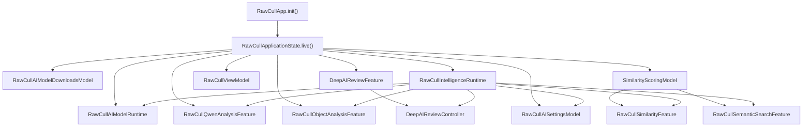
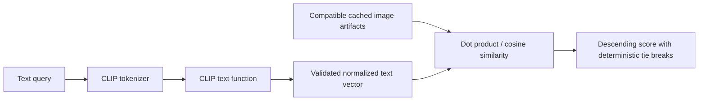

+++
author = "Thomas Evensen"
title = "AI Models in RawCull"
linkTitle = "AI Models in RawCull"
date = "2026-09-20"
lastmod = "2026-09-26"
description = "Code-level guide to local CLIP, Vision, SAM 3, Qwen, Deep Review, and numbered Objects analysis in RawCull."
weight = 58
tags = ["ai", "clip", "sam3", "qwen", "objects", "architecture", "core-ai"]
categories = ["technical details"]
mermaid = true
+++

# AI Models in RawCull

RawCull uses several local machine-learning backends, but it does not treat them
as interchangeable. Each model family has a deliberately narrow job:

| Model or backend | RawCull job | Output used by RawCull |
| --- | --- | --- |
| DataComp CLIP | Image similarity, burst grouping, semantic search, and coarse subject labels for Deep Review | Normalized image/text embedding vectors and cosine distances/similarities |
| OpenAI CLIP | Fully implemented alternative CLIP bundle; currently excluded from the production model list | The same typed CLIP artifacts as DataComp, with a different model fingerprint |
| SAM 3 | Prompted subject segmentation for Deep Review and separate instance segmentation for Objects | A chosen subject mask, or up to eight numbered masks per concept |
| Qwen3-VL-2B-Instruct | Standalone photo assessment; concept discovery and board interpretation in Objects | A photo assessment, validated object concepts and per-object findings, or a visible retryable response failure |
| Apple Vision feature print | Always-available image-similarity fallback | Opaque Vision feature-print artifacts and native distances |

All inference stays in the application process. The downloadable model assets
are installed separately because they are large, but the analysis path does not
send photographs to a remote inference service.

This page was checked against the local RawCull `version-3.2.6` working tree
on September 26, 2026, including the packaged-model evaluation and later
in-app Objects observations. RawCull source links follow that branch.
PhotoAIKit links use revision
[`77cc1d84`](https://github.com/rsyncOSX/PhotoAIKit/tree/77cc1d84a5d98a485caa15be102c8a55eb3d7698),
pinned by this checkout. The local working tree may be ahead of the published
branch until those changes are pushed.

## Source Catalog: `RawCull/Intelligence`

The `Intelligence` directory is organized by responsibility rather than by one
model per folder. Start with this catalog when tracing the code.

### Composition and contracts

| Source | Responsibility |
| --- | --- |
| [`Composition/RawCullAIModelRuntime.swift`](https://github.com/rsyncOSX/RawCull/blob/version-3.2.6/RawCull/Intelligence/Composition/RawCullAIModelRuntime.swift) | Owns model-resource managers, validated CLIP and SAM 3 providers, the Vision fallback, Qwen inference runtime, mask stores, and the active segmentation pipeline. |
| [`Composition/RawCullIntelligenceRuntime.swift`](https://github.com/rsyncOSX/RawCull/blob/version-3.2.6/RawCull/Intelligence/Composition/RawCullIntelligenceRuntime.swift) | Assembles the complete application AI graph and preserves stable feature identities while services change. |
| [`Contracts/RawCullAIModels.swift`](https://github.com/rsyncOSX/RawCull/blob/version-3.2.6/RawCull/Intelligence/Contracts/RawCullAIModels.swift) | Defines model choices, paths, capability states, and saved-artifact evidence. |

### Model management

| Source | Responsibility |
| --- | --- |
| [`RawCullAIModelDownloadCatalog.swift`](https://github.com/rsyncOSX/RawCull/blob/version-3.2.6/RawCull/Intelligence/ModelManagement/RawCullAIModelDownloadCatalog.swift) | Production model inventory, inclusion switches, asset-pack identifiers, versions, byte counts, checksums, licences, and provenance links. |
| [`RawCullAIModelDownloadService.swift`](https://github.com/rsyncOSX/RawCull/blob/version-3.2.6/RawCull/Intelligence/ModelManagement/RawCullAIModelDownloadService.swift) | Background Assets download coordination and installed-location resolution. |
| [`RawCullAIModelDownloadsModel.swift`](https://github.com/rsyncOSX/RawCull/blob/version-3.2.6/RawCull/Intelligence/ModelManagement/RawCullAIModelDownloadsModel.swift) | Observable download, licence, progress, removal, and installed-location state. |
| [`RawCullAIModelResourceManager.swift`](https://github.com/rsyncOSX/RawCull/blob/version-3.2.6/RawCull/Intelligence/ModelManagement/RawCullAIModelResourceManager.swift) | Actor-isolated validation and provider construction with a metadata snapshot cache. |
| [`RawCullAISettingsModel.swift`](https://github.com/rsyncOSX/RawCull/blob/version-3.2.6/RawCull/Intelligence/ModelManagement/RawCullAISettingsModel.swift) | Applies installed locations, refreshes capabilities, stores user selections, and publishes revisioned runtime configurations. |

### CLIP, similarity, and semantic search

| Source | Responsibility |
| --- | --- |
| [`RawCullVisionSimilarityService.swift`](https://github.com/rsyncOSX/RawCull/blob/version-3.2.6/RawCull/Intelligence/Similarity/RawCullVisionSimilarityService.swift) | Defines the shared similarity-service boundary, Vision implementation, CLIP implementation, RAW decoding adapter, finite-vector recovery, and artifact validation. |
| [`SimilarityScoringModel.swift`](https://github.com/rsyncOSX/RawCull/blob/version-3.2.6/RawCull/Intelligence/Similarity/SimilarityScoringModel.swift) | Owns indexed artifacts, hydration, persistence, image ranking, grouping, semantic-search state, and CLIP-based subject classification. |
| [`RawCullSimilarityFeature.swift`](https://github.com/rsyncOSX/RawCull/blob/version-3.2.6/RawCull/Intelligence/Similarity/RawCullSimilarityFeature.swift) | Stable application-facing similarity surface with cancellation and generation gates. |
| [`RawCullSemanticSearchService.swift`](https://github.com/rsyncOSX/RawCull/blob/version-3.2.6/RawCull/Intelligence/SemanticSearch/RawCullSemanticSearchService.swift) | Encodes a text query, admits compatible CLIP artifacts, compares image and text vectors, and ranks deterministically. |
| [`RawCullSemanticSearchFeature.swift`](https://github.com/rsyncOSX/RawCull/blob/version-3.2.6/RawCull/Intelligence/SemanticSearch/RawCullSemanticSearchFeature.swift) | Presentation and application-target adapter for semantic search. |

### Deep Review with SAM 3 and CLIP

| Source | Responsibility |
| --- | --- |
| [`DeepAIReviewController.swift`](https://github.com/rsyncOSX/RawCull/blob/version-3.2.6/RawCull/Intelligence/DeepReview/DeepAIReviewController.swift) | Converts the current RawCull selection, burst evidence, sharpness evidence, subject label, and AF point into a review request. |
| [`DeepAIReviewFeature.swift`](https://github.com/rsyncOSX/RawCull/blob/version-3.2.6/RawCull/Intelligence/DeepReview/DeepAIReviewFeature.swift) | Owns review state and implements the complete decode → prompt → mask → score → recommendation pipeline. |
| [`SubjectMaskFocusScorer.swift`](https://github.com/rsyncOSX/RawCull/blob/version-3.2.6/RawCull/Intelligence/DeepReview/SubjectMaskFocusScorer.swift) | Computes subject-only broad, local, and fine detail evidence from an image and SAM mask. |
| [`DeepAIReviewMaskOutlineRenderer.swift`](https://github.com/rsyncOSX/RawCull/blob/version-3.2.6/RawCull/Intelligence/DeepReview/DeepAIReviewMaskOutlineRenderer.swift) | Turns a persisted filled mask into a display outline. |

### Objects: Qwen discovery, SAM 3 instances, Qwen review

| Source | Responsibility |
| --- | --- |
| [`ObjectAnalysis/RawCullObjectAnalysisFeature.swift`](https://github.com/rsyncOSX/RawCull/blob/version-3.2.6/RawCull/Intelligence/ObjectAnalysis/RawCullObjectAnalysisFeature.swift) | Batch coordination, availability, cancellation, retry, private capture, and stage timings. |
| [`ObjectAnalysis/ObjectConceptDiscovery.swift`](https://github.com/rsyncOSX/RawCull/blob/version-3.2.6/RawCull/Intelligence/ObjectAnalysis/ObjectConceptDiscovery.swift) | Automatic prompt, concept validation, and Specific Concepts parsing. |
| [`ObjectAnalysis/ObjectInstanceDeduplicator.swift`](https://github.com/rsyncOSX/RawCull/blob/version-3.2.6/RawCull/Intelligence/ObjectAnalysis/ObjectInstanceDeduplicator.swift) | Filters weak masks, merges near-identical masks across concepts, and assigns board IDs. |
| [`ObjectAnalysis/ObjectReviewBoardRenderer.swift`](https://github.com/rsyncOSX/RawCull/blob/version-3.2.6/RawCull/Intelligence/ObjectAnalysis/ObjectReviewBoardRenderer.swift) | Renders the 2,048-pixel overview and numbered, outlined crops for Qwen; fails if a numbered crop cannot be prepared. |
| [`ObjectAnalysis/ObjectJSONEnvelope.swift`](https://github.com/rsyncOSX/RawCull/blob/version-3.2.6/RawCull/Intelligence/ObjectAnalysis/ObjectJSONEnvelope.swift) and [`ObjectAnalysis/ObjectAnalysisResponseDecoder.swift`](https://github.com/rsyncOSX/RawCull/blob/version-3.2.6/RawCull/Intelligence/ObjectAnalysis/ObjectAnalysisResponseDecoder.swift) | Recover one JSON object from a wrapper, then validate fields, confidence, list limits, and board IDs. |
| [`ObjectAnalysis/ObjectAnalysisModels.swift`](https://github.com/rsyncOSX/RawCull/blob/version-3.2.6/RawCull/Intelligence/ObjectAnalysis/ObjectAnalysisModels.swift) | Mode, instance, assessment, progress, timing, and result types. |
| [`ObjectAnalysis/ObjectMaskOutlineRenderer.swift`](https://github.com/rsyncOSX/RawCull/blob/version-3.2.6/RawCull/Intelligence/ObjectAnalysis/ObjectMaskOutlineRenderer.swift) | Detail-view contour from a stored grayscale instance mask. |
| [`Views/AIAnalysis/ObjectAnalysisView.swift`](https://github.com/rsyncOSX/RawCull/blob/version-3.2.6/RawCull/Views/AIAnalysis/ObjectAnalysisView.swift) | Controls, status table, numbered overlays, crop, per-object detail, and retry. |

The object-set workflow uses PhotoAIKit's `ObjectSegmentationService`,
`ObjectMaskMemoryStore`, optional `ObjectMaskDiskStore`, and SAM 3
`ObjectInstanceSegmenting` contract. Its cache is separate from the Deep
Review subject-mask cache.

### Qwen

| Source | Responsibility |
| --- | --- |
| [`QwenInferenceRuntime.swift`](https://github.com/rsyncOSX/RawCull/blob/version-3.2.6/RawCull/Intelligence/Qwen/QwenInferenceRuntime.swift) | Actor-owned Qwen provider validation, lazy vision-language model loading, session creation, prompt construction, response decoding, and invalidation. |
| [`RawCullQwenAnalysisFeature.swift`](https://github.com/rsyncOSX/RawCull/blob/version-3.2.6/RawCull/Intelligence/Qwen/RawCullQwenAnalysisFeature.swift) | Main-actor batch operation, image loading, progress, per-file failure isolation, result retention, and cancellation. |
| [`QwenPhotoAssessment.swift`](https://github.com/rsyncOSX/RawCull/blob/version-3.2.6/RawCull/Intelligence/Qwen/QwenPhotoAssessment.swift) | Structured response schema, validation, free-form fallback, aggregate score, and result types. |

### Persistence and burst consumption

`PerFileAnalysisArtifactStore` persists descriptor-bearing similarity artifacts.
The burst-analysis files consume those artifacts, build groups, cache results,
and reject incompatible cache data. They are not model runtimes themselves.
This separation is important: a CLIP model produces an embedding; RawCull's
burst policy decides what that embedding means for grouping and culling.

## The Model Inventory Shipped by RawCull

The authoritative inventory is
[`RawCullAIModelDownloadCatalog.prepared`](https://github.com/rsyncOSX/RawCull/blob/version-3.2.6/RawCull/Intelligence/ModelManagement/RawCullAIModelDownloadCatalog.swift#L123).
`production` filters that inventory through code-only inclusion switches.

| Production model | Asset-pack ID | Installed model path inside pack | Download size | Installed size |
| --- | --- | --- | ---: | ---: |
| DataComp CLIP, ViT-B/32 at 256 px | `rawcull-clip-datacomp` | `Models/CLIP-DataComp` | 282,967,354 bytes | 307,800,172 bytes |
| Meta SAM 3 | `rawcull-sam3` | `Models/SAM3` | 1,542,689,931 bytes | 1,667,570,378 bytes |
| Qwen3-VL-2B-Instruct | `rawcull-qwen3-vl-2b` | `Models/Qwen/qwen3_vl_2b` | 3,754,599,603 bytes | 5,395,195,663 bytes |

OpenAI CLIP exists in `RawCullCLIPModel`, has a resource manager, and can be
selected by the runtime, but `includeOpenAICLIP` is currently `false`.
DataComp CLIP, SAM 3, and Qwen download are enabled. SAM 3 requires explicit
acceptance of its bundled, hash-verified licence before download; the DataComp
and Qwen licences do not require an extra acceptance action.

## How AI Modules Are Instantiated

The application has two stable roots: `RawCullViewModel` for general app state
and `RawCullIntelligenceRuntime` for AI-facing state. They are created once in
[`RawCullApp.init()`](https://github.com/rsyncOSX/RawCull/blob/version-3.2.6/RawCull/Main/RawCullApp.swift#L111)
and retained in SwiftUI `@State`.



The exact construction order in `RawCullApplicationState.make` is significant:

1. `RawCullAIModelRuntime` is supplied by `live()`. Its initializer creates
   resource-manager actors for SAM 3 and both CLIP choices, one
   `QwenInferenceRuntime`, the Vision provider/service, mask stores, and a
   placeholder unavailable segmentation pipeline.
2. `RawCullAIModelDownloadsModel` is created with the production catalog and
   application paths.
3. `RawCullQwenAnalysisFeature` and `RawCullObjectAnalysisFeature` receive the
   same Qwen inference actor. Objects also receives its memory and optional
   disk instance-mask stores.
4. `DeepAIReviewFeature` starts with the model runtime's current segmentation
   capability. It is bound back to the model runtime so a later SAM provider can
   install a real pipeline without replacing the feature.
5. `RawCullAISettingsModel` receives the model runtime, downloads model, Qwen
   feature, preferences store, and saved-evidence scanner.
6. Settings produces a synchronous initial configuration. Before asynchronous
   validation finishes this normally selects the Vision fallback.
7. A single `SimilarityScoringModel` is created. Both similarity and semantic
   search share this same artifact/state owner.
8. Stable feature and controller objects are created around those models.
9. `RawCullViewModel` receives the exact same feature objects.
10. `RawCullIntelligenceRuntime` retains the graph and binds the narrow weak
    application contexts.
11. Settings binds its weak configuration consumer and immediately publishes
    the first revision.

Debug assertions verify identity sharing. These checks are not cosmetic: a
second Qwen inference actor, scoring model, Objects feature, or Deep Review feature would split
model state, tasks, caches, and UI observation.

The first asynchronous validation begins from the main view's `.task`:

```swift
.task {
    await intelligenceRuntime.settingsModel.refresh()
}
```

`refresh()` asks the downloads model for an installed-location snapshot. That
snapshot flows through settings to `RawCullAIModelRuntime`, which validates
Qwen and refreshes CLIP and SAM 3 capabilities. See
[The RawCull AI Runtime](../runtime/#development-handoff-photoaikit-objects-to-the-runtime)
for the concrete PhotoAIKit provider handoff, feature wiring, lifetime, and
reconfiguration path. In particular, the download snapshot supplies URLs;
PhotoAIKit factories validate bundles and create typed providers; the model
runtime retains those providers; and Settings sends selected services in a
revisioned configuration to the stable intelligence runtime. Qwen follows its
own actor path and updates its existing analysis feature through model status.

### Why Qwen has its own inference runtime

It may look simpler to put Qwen's provider, loaded model, and inference methods
directly inside `RawCullAIModelRuntime`. The two types have different jobs,
however, and keeping those jobs separate makes their concurrency and lifetimes
clear.

Think of `RawCullAIModelRuntime` as the coordinator for the application's model
room. It knows which resources are installed, validates capabilities, selects
the services that RawCull should expose, and publishes those choices on the
main actor. `QwenInferenceRuntime`, by contrast, is the specialist operating
one machine in that room. Its actor protects Qwen-specific mutable state: the
validated provider, the lazily loaded vision-language model, and the generation
counter used to reject work from a model that has since been removed or
replaced. It also owns Qwen-specific work such as creating sessions, building
prompts, running generation, and decoding responses.

This boundary matters because Qwen inference can suspend for comparatively
long operations such as loading the model and generating a response. Those
operations should be serialized by the Qwen actor without turning the
main-actor `RawCullAIModelRuntime` into the place where heavy inference runs.
It also keeps Qwen's two-stage lifecycle—validate a lightweight provider now,
then load the heavy model only when it is first used—independent of the CLIP
and SAM 3 resource lifecycles.

Separate does not mean unrelated. `RawCullAIModelRuntime.init` creates one
`QwenInferenceRuntime` and retains it as `qwenInference`. During application
assembly, that exact instance is passed to `RawCullQwenAnalysisFeature` and
`RawCullObjectAnalysisFeature`.
Consequently, there is one owner of Qwen's provider and loaded model, while the
model runtime remains the composition point that creates and coordinates the
application's complete collection of AI backends. In short:

- `RawCullAIModelRuntime` answers **which AI capabilities are available and
  how they fit into the application**;
- `QwenInferenceRuntime` answers **how one Qwen request is safely executed**;
  and
- constructing the latter inside the former guarantees a single, shared Qwen
  runtime rather than independent copies with competing model state.

## Model Discovery, Validation, and Provider Construction

CLIP and SAM 3 use one
`RawCullAIModelResourceManager<Provider>` actor per model choice. The actor owns:

- caller-ordered fallback candidate URLs;
- the current managed asset-pack URL;
- the PhotoAIKit `ModelProviderFactory`;
- a lightweight file-metadata snapshot; and
- the cached capability/provider result.

Changing the managed URL clears the cache. `load()` prepends the managed URL to
any fallback candidates, snapshots every directory entry, and returns its cached
result if path, kind, size, modification date, and resolved symlink path have not
changed. When the snapshot changes, PhotoAIKit remains authoritative: it checks
`metadata.json`, the declared model asset, required tokenizer files, accepted
`.aimodel`/`.aimodelc` extensions, and the model fingerprint or manifest checksum.
Only then does the factory create the concrete provider.

The file-metadata snapshot is an optimization, not a security decision. It
decides when full validation may be reused; it does not replace PhotoAIKit's
model-bundle validation.

Qwen has a separate actor because its lifecycle differs. Its validation builds
an immutable `CoreAIQwenProvider`; its much heavier
`CoreAIVisionLanguageModel` is created lazily on the first assessment and reused
across later `LanguageModelSession` values.

## How CLIP Works in RawCull

CLIP places images and text in a shared vector space. RawCull uses that property
in three ways: image-to-image distance, text-to-image semantic search, and a
small closed-set subject-label pass that helps choose SAM prompts.

### Provider construction and identity

PhotoAIKit's
[`CoreAICLIPProvider`](https://github.com/rsyncOSX/PhotoAIKit/blob/77cc1d84a5d98a485caa15be102c8a55eb3d7698/Sources/CoreAICLIPBackend/CoreAICLIPProvider.swift)
is an actor implementing image embedding, artifact generation/comparison, text
embedding, and image/text comparison. During initialization it:

1. validates the supplied model bundle;
2. derives a `ModelIdentity` and asset fingerprint;
3. decodes model-specific preprocessing, tokenizer, function-name,
   normalization, and configuration metadata; and
4. exposes a `SimilarityBackendDescriptor` containing all compatibility-critical
   versions.

The descriptor is effectively the type identity of an embedding on disk. It
records backend, model fingerprint, representation, preprocessing,
normalization, and configuration versions. Image artifacts additionally record
vector dimensions, schema version, and a source fingerprint. Consequently,
RawCull does not compare a DataComp vector with an OpenAI vector, reuse an
artifact after preprocessing changes, or silently treat an edited source file
as unchanged.

### Image preprocessing and inference

`RawCullSimilarityImageDecoder` first asks `RawParserKitImageLoader` for a
bounded thumbnail. If that fails it attempts an ImageIO thumbnail without
requesting a full fallback decode. The resulting `CGImage` is passed through
the model-specific preprocessing declared by the CLIP bundle. Current metadata
supports either the legacy stretch/bilinear path or shortest-side resize plus
square center crop with bicubic interpolation and configured RGB mean/standard
deviation.

The provider lazily loads Core AI functions and tokenizer resources. The image
function receives the prepared image tensor and, if required by the exported
graph, dummy text inputs. Its output is flattened, checked against the expected
dimension, wrapped in an `ImageEmbedding`, JSON-encoded, and stored in a
`SimilarityArtifact`. The backend descriptor records the bundle's declared
normalization version; image/text comparison later verifies that the image
vector actually has approximately unit magnitude.

### Indexing and recovery

`RawCullCLIPSimilarityService` uses PhotoAIKit's bounded
`SimilarityArtifactIndexer` with concurrency limit 1. CLIP inference is kept
serial because the provider is actor-owned and model execution is resource
intensive. There is no per-file or whole-batch Vision substitution during a
CLIP pass.

For a non-finite vector, `RawCullRecoveringCLIPArtifactProvider` performs a
targeted sequence:

1. reject the invalid output;
2. retry once with the already-loaded provider;
3. construct a fresh provider from the same validated model location;
4. verify that the replacement descriptor is exactly the same; and
5. retry once with the replacement.

Successful CLIP artifacts from other files are retained. A file that still
fails is reported and remains unindexed; it is not given a Vision artifact that
would make the batch heterogeneous. Decode failures and inference failures are
recorded separately for diagnostics.

### Image similarity and burst grouping

For compatible normalized image embeddings, PhotoAIKit returns cosine distance.
`SimilarityScoringModel` owns the artifact dictionary and computes distances
from an anchor. It can apply a small RawCull-owned subject-label mismatch
penalty, then uses those distances as input to ranking and burst grouping.

This responsibility split is deliberate:

- CLIP defines the vector and mathematical comparison;
- PhotoAIKit defines artifact compatibility and indexing mechanics; and
- RawCull defines catalog admission, grouping thresholds, ordering, progress,
  persistence, and culling policy.

Vision remains the runtime fallback when CLIP is disabled or cannot be
validated. Vision and CLIP artifacts are both descriptor-bearing, so switching
backends causes incompatible state to be rejected or rehydrated rather than
misinterpreted.

### Semantic search

Semantic search never indexes missing images as a side effect. It operates only
on already-persisted, descriptor-compatible CLIP image artifacts:



`RawCullCLIPSemanticSearchService` trims and validates the query, filters image
artifacts by the complete backend descriptor, generates one transient text
embedding, and scores each compatible image. Because both vectors are
normalized, their dot product is cosine similarity. Valid scores lie in
`-1...1`; they are relative ranking values, not confidence percentages.

Sorting is deterministic: score descending, then original catalog order,
localized filename, and UUID. Individual malformed artifacts become per-file
failures rather than aborting every valid result. Text embeddings are scoped to
one search and are not persisted.

## Deep Analysis: How SAM 3 and CLIP Work Together

The UI calls this mode **SAM 3 + CLIP**, but the two models are not fused and
CLIP does not calculate the final focus score. Their collaboration is a staged
pipeline:

1. CLIP optionally supplies a coarse subject label from existing embeddings.
2. That label selects an ordered set of text prompts for SAM 3.
3. SAM 3 creates or retrieves the best acceptable subject mask.
4. RawCull measures detail only inside that mask and recommends the strongest
   candidate.

If CLIP semantic artifacts are unavailable, RawCull falls back to the existing
saliency label from normal sharpness analysis. If neither label exists, SAM 3
still receives the general `subject` prompt. Therefore SAM 3 is the required
model for Deep Review; CLIP enriches prompt selection when available.

### 1. Building the request

`DeepAIReviewController.start(for:)` asks `RawCullViewModel` for a stable group
context. `deepAIReviewContext(for:)` captures:

- a `BurstGroupSignature` tied to the current catalog and exact member files;
- existing burst ranks, falling back to input order;
- normal sharpness scores;
- a subject label;
- the normalized camera autofocus point; and
- the chosen sharpness source: embedded preview or RAW demosaic.

For the CLIP label pass, `SimilarityScoringModel.classifySubjects` runs six
literal queries against existing semantic artifacts: person, bird, deer,
animal, car, and landscape. Each file receives the label with its highest
cosine similarity. This pass does not alter the visible semantic-search result,
decode source images, or generate missing embeddings.

### 2. Candidate limiting and decoding

Candidates are sorted by current burst rank. Groups of 12 or fewer are analyzed
in full; larger groups analyze the first 8 candidates. Each candidate is then
decoded at a bounded size. Embedded-preview mode reuses RawCull's similarity
decoder. RAW-demosaic mode uses `CIRAWFilter`, explicitly sets sharpness to 0,
detail to 0.6, contrast to 1, and exposure to 0, then downsizes to the configured
maximum before producing a `CGImage`.

### 3. Prompt selection

The preset and subject label determine ordered attempts:

| Preset/evidence | SAM prompt order |
| --- | --- |
| Full Subject | `subject` |
| Auto or Head/Face with bird/wildlife label | `bird head`, `bird`, `subject` |
| Auto or Head/Face with person/face label | `face`, `person`, `subject` |
| Auto or Head/Face with deer label | `animal head`, `deer`, `animal`, `subject` |
| Auto or Head/Face with generic animal label | `animal head`, `animal`, `subject` |
| No recognized label | `subject` |

The Head/Face preset is considered verified only when the first selected prompt
is `bird head`, `animal head`, or `face`; falling back to a broader mask is
reported as `specificPromptNotFound`.

### 4. SAM 3 inference

PhotoAIKit's
[`CoreAISAM3Provider`](https://github.com/rsyncOSX/PhotoAIKit/blob/77cc1d84a5d98a485caa15be102c8a55eb3d7698/Sources/CoreAISAM3Backend/CoreAISAM3Provider.swift)
is actor-isolated. It validates the bundle and lazily creates a
`CoreAISegmentationEngine` plus CLIP-compatible text tokenizer. The prompt text
is tokenized and sent with the bounded image to the Core AI segmenter. Runtime
parameters use a 0.5 mask threshold and at most 5 segments.

The response's probability map is preferred. If absent, the provider unions
compatible returned segment masks. Probabilities are converted to a white RGBA
mask with a smooth alpha transition around the threshold. The result records
the prompt, confidence, model identity, input/output sizes, timing, resource,
and asset identity.

PhotoAIKit's `SegmentationService` first checks memory and disk stores by a key
that includes source file identity, prompt, model identity, and maximum input
size. A missing mask is generated, resized back to the display image dimensions,
and saved to both stores. Model changes therefore do not accidentally reuse
masks made by a different SAM asset.

`SubjectMaskSelector` tries prompts in order, measuring coverage and quality for
each candidate. It stops at the first mask meeting the warning-or-better
threshold, otherwise retains the best attempt by quality, confidence, and then
coverage. Every attempt records cache miss, candidate quality/confidence, or
failure.

### 5. Subject-detail scoring

`SubjectMaskFocusScorer` converts the photograph to luminance using Rec. 709
weights and samples Laplacian-style edge energy. Only pixels with mask alpha
above 16 contribute to subject evidence. It computes:

- **broad subject score** — robust tail detail across the masked subject;
- **local detail score** — the strongest reliable cell in a 6 × 6 patch grid;
- **fine detail score** — micro-contrast within the mask;
- **mask coverage** — masked pixels divided by total pixels; and
- **AF evidence** — whether the normalized autofocus point lies inside the mask.

The final detail score is:

```text
0.40 × broad subject detail
+ 0.40 × strongest local detail (or broad detail when local is unavailable)
+ 0.20 × fine detail
```

If global edge detail exceeds the subject score by the configured margin,
RawCull applies a `0.82` background-dominance multiplier and records a caution.
The scorer reports missing local patches, unusable masks, unavailable subject
detail, and other evidence limitations rather than manufacturing a score.

### 6. Recommendation and confidence

Candidates sort by deep score descending, with the earlier burst rank breaking
ties. The first finite score becomes the recommendation. Reasons record strong
subject detail, AF-inside-subject evidence, local detail evidence, and successful
prompt matching.

Confidence depends on the winning margin and evidence quality:

- **high**: at least a 12% lead, mask and local evidence present, no issues, and
  no fallback prompt;
- **medium**: at least a 5% lead, or strong evidence obtained through a fallback
  prompt; and
- **low**: all other cases.

The result is advisory. Deep Review stores results by group signature, publishes
progress after every candidate, and keeps completed candidate/mask evidence for
the analysis history and zoom outline. It does not silently change ratings or
apply a culling decision.

## How Qwen Analysis Works

Qwen is not part of CLIP similarity or SAM segmentation. It is a separate local
vision-language tool selected in the AI Analysis view.

### Validation and lazy loading

`QwenInferenceRuntime` is an actor with three pieces of state: an optional
`CoreAIQwenProvider`, an optional loaded `CoreAIVisionLanguageModel`, and a
generation counter. Validation asks PhotoAIKit's Qwen factory to inspect the
bundle. The provider checks required tokenizer resources, metadata kind, Qwen
identity, vocabulary/context values, and VLM-specific embedding and vision
assets. RawCull additionally rejects a valid text-only Qwen bundle because
photo assessment requires modality `.vision`.

Successful validation stores the lightweight provider and clears any previously
loaded model. The first call to `assess` constructs the heavy vision-language
model asynchronously; later calls reuse it. A generation captured before
loading prevents a model removed or replaced during the await from becoming
active afterward. `clear()` advances the generation and releases both provider
and loaded model.

### Per-image request

The feature processes pending files sequentially. It requests a thumbnail up to
2048 pixels, then calls `assess(criteria:image:)`. The runtime creates a new
Foundation Models `LanguageModelSession` around the reused model, attaches the
`CGImage`, and requests at most 512 response tokens.

The prompt includes the user's criteria and asks for exactly one JSON object
when the request is a photo assessment. The schema contains:

- subject description;
- composition, exposure, and subject-visibility scores from 1 through 5;
- optional `eyesOpen`;
- up to four problems and strengths; and
- confidence from 0 through 1.

The instruction explicitly says to use visible evidence only. For a request
that does not fit the assessment schema, Qwen may answer in ordinary text.

### Response handling

`QwenModelResponse.decode` trims the response. It first attempts to extract the
outermost JSON object and decode `QwenPhotoAssessment`. Score ranges and
confidence are validated. If that structured decode does not succeed but the
response is nonempty, RawCull retains it as a free-form result.

The structured `overallScore` is a RawCull presentation value, not a model
output:

```text
0.50 × composition
+ 0.20 × exposure
+ 0.30 × subject visibility
```

Each component is first divided by 5. The batch continues after an individual
file fails, and successful or failed results replace earlier results for the
same file. Already analyzed files are skipped on the next run. Cancellation and
model removal advance operation state so obsolete work cannot publish as a
current result.

Qwen results currently live in the feature's in-memory `results` array; unlike
CLIP artifacts and SAM masks, this implementation does not persist them across
application sessions.

## Objects: instance-level SAM 3 and Qwen analysis

Objects is a third AI Analysis tool beside **SAM 3 + CLIP** and standalone
**Qwen**. It accepts selected Grid photos or tagged photos. It requires
installed, validated SAM 3 and vision-capable Qwen. CLIP embeddings and Deep
Review's single-subject score do not feed this workflow.

### End-to-end stages and ownership

1. The stable, main-actor object feature checks that both model services are
   available and snapshots the concept mode and photographic criteria.
2. It loads one bounded RAW or JPEG thumbnail, at most 4,320 pixels on its
   longest side, and processes files sequentially.
3. Automatic mode asks Qwen for visible object concepts; Specific Concepts
   parses the user's comma-separated noun phrases.
4. PhotoAIKit's object service asks SAM 3 for up to eight instances per concept
   and checks its separate object-mask caches.
5. RawCull filters weak/invalid masks, merges near-duplicate regions across
   concepts, and assigns board-local IDs 1 through 8.
6. A deterministic 2,048-pixel board shows the original overview above
   numbered, outlined object crops. Qwen assesses that one photograph.
7. RawCull extracts one complete JSON object and validates the schema, every
   expected board ID, values, list caps, and finite confidence. The UI shows
   per-object findings or a visible, retryable assessment problem.

The availability state distinguishes checking, ready, SAM 3 unavailable,
Qwen unavailable, and both unavailable. Settings installs the current
segmentation service and Qwen status into the existing feature after
validation. A changed service or status cancels active work. Switching AI
tools or input source also cancels an active batch. Completion, result
replacement, and cancellation are generation-gated.

### Concept discovery and manual mode

Automatic asks Qwen for zero to six short concept entries. Each entry has
query, displayName, and reason. Query must be a concrete, visible, whole-object
noun phrase suitable for SAM 3. SegmentationConcept validates it; normalized
duplicates collapse. An empty set or invalid JSON is an actionable discovery
failure, with no guessed fallback concepts. The discovery request cap is 384
output tokens.

Specific Concepts bypasses discovery. The user enters up to six
comma-separated queries such as bird, person. Empty or invalid entries fail
before segmentation; duplicate normalized queries collapse. Both modes can
add photographic criteria to the final Qwen request.

### SAM 3 instances, filtering, and caches

ObjectSegmentationService uses source file identity, concept, SAM 3 model
identity, the 4,320-pixel input limit, and the eight-instance limit in its
cache key. It checks the object-mask memory and optional disk store before
inference, bounds the image, invokes CoreAISAM3Provider.segmentInstances,
resizes masks to display dimensions, and saves the typed result. This is
independent of Deep Review's SegmentationService and SubjectMaskSelector,
which choose one subject mask from ordered prompt attempts.

RawCull counts the raw SAM 3 candidates. Its deduplicator rejects nonfinite
or below-0.5 mask scores, invalid boxes, masks with fewer than 64 of
256-by-256 sampled pixels, and masks covering at least 95% of the sample.
Candidates sort by score and geometry. Overlapping masks with similar area
merge when mask intersection-over-union reaches 0.85 or smaller-mask
containment reaches 0.90; a second concept becomes an alias of the retained
object. At most eight objects remain. Their board IDs are strings and local to
that analysis result. A SAM 3 mask score describes segmentation quality; it
is distinct from Qwen's assessment confidence.

An empty retained set is a successful **No Matching Objects** result and does
not call Qwen for a board. Genuine no-match photos still need broader
validation.

### Board geometry and the Qwen contract

ObjectReviewBoardRenderer creates one 2,048-by-2,048 image. Its top half is
an aspect-fit overview of the source photo. Its bottom half contains up to
eight padded crops in two rows of four. Each crop and yellow mask outline are
aspect-fit. A separate dark header carries a large white number without
covering the subject. The renderer explicitly converts normalized
bottom-left box coordinates to top-left CGImage crop coordinates.

If the source or mask crop for a retained object cannot be made, rendering
throws `reviewBoardUnavailable`. The feature records the per-photo failure
before asking Qwen to assess a board; it does not submit a board with a
numbered ID whose crop was silently omitted.

The prompt tells Qwen that the overview and crops repeat views of one
photograph, each board ID denotes a different physical subject, and the
objects array must contain exactly one entry for each ID. Descriptions should
use the matching numbered crop; relationships should use the overview.
The assessment request cap is 1,024 output tokens. The requested result has
an optional scene summary; per-object concept, description, visibility, focus,
expression, obstructions, strengths, problems, and confidence; and photo-level
relationships, strengths, problems, preferred IDs, and confidence.

ObjectJSONEnvelope extracts one complete balanced JSON object from a
recoverable Markdown or prose wrapper, respecting quoted braces. It rejects
incomplete JSON and multiple objects. The decoder accepts only the narrow
variations observed from the packaged model: an omitted imageSummary, a
whole-number board ID normalized to a string, and one short text value in an
object list field (the exact string "none" becomes an empty list). It still
requires every board ID exactly once, rejects unknown or duplicate IDs and
preferred IDs, enforces list limits and enum values, and requires finite
confidence in 0...1. Free-form prose is not upgraded to a structured judgment.

If Qwen fails this boundary, the detail view retains its response and shows
a specific assessment error. The results table says **Assessment needs
retry**. Retry reuses successful SAM 3 masks only when source size/date, Qwen
model name, concept mode and queries, and cache keys still match. Otherwise
it segments again. The table labels Qwen confidence; the detail view labels
SAM 3 mask score separately and shows numbered boxes, cached-mask outlines,
the selected crop, and its assessment.

The object count in the table is the number of **retained SAM 3 matches for the
chosen concepts**, after filtering and deduplication. It is not a count of all
subjects in the photograph. A Complete row means the response passed the
schema and board-ID checks; the photographer still needs to compare its
descriptions, count claims, and confidence with the source image. The detail
panel shows the assessment for the currently selected object, not all object
descriptions at once.

### September 24, 2026 packaged-model check

Eight supplied puffin ARW files were processed in both modes with local
qwen3_vl_2b and sam3_float16.aimodel. Automatic discovered puffin for all
eight; manual mode used bird. All 16 runs produced structured assessments
with the expected board ID set. SAM 3 returned seven or eight raw candidates
per run, filtered to one retained bird on six photos and two birds on two.
Warm concept discovery took 2.98–3.56 seconds, segmentation 6.59–6.99
seconds, board rendering 0.028–0.044 seconds, and final Qwen assessment
10.21–20.14 seconds. The sequential probe took 371.5 seconds; process
peak resident memory was 9.47 GiB. The first Automatic run included model
startup and took 45.1 seconds overall.

These measurements came from an in-process macOS feature/model test, not a
release build, clean install, or TestFlight run. Separate two-bird visual
checks found a swapped flying/perched description, nearly identical
descriptions for differently facing birds, and a response claiming three
birds where the photograph had two. Those errors occurred with schema-valid
output and Qwen-reported confidence of 0.95–1.00. Valid JSON and IDs verify
response shape, not visual accuracy or calibrated confidence. Mixed
categories, touching/overlapping and tiny subjects, genuine no-match cases,
RAW/JPEG parity, model removal, large tagged batches, and lifecycle checks
remain open. The per-photo table and gate status are in the
[RawCull implementation notes](https://github.com/rsyncOSX/RawCull/blob/version-3.2.6/Docs/sam3qwen.md#163-implementation-checkpoint--september-24-2026).

### September 24–26, 2026 in-app observations

In-app Automatic runs showed all eight puffin photos and all eight photos in a
mixed-subject batch as Complete. The mixed batch included landscape, deer,
muskox, horse, bird, rabbit, and puffin photographs. These screenshots show the
workflow operating in the app on those selections, but do not identify the
installed model-pack fingerprints or establish a clean-install TestFlight run.

Two visual checks remain unresolved. In `_DSC3028.ARW`, clicking the two
numbered puffins showed crops and descriptions associated with opposite birds;
the source of the mismatch, whether Qwen's board grounding or the UI's
object-to-crop association, has not been established. In `_DSC3031.ARW`, SAM 3
retained two puffins and Qwen's object details described two positions, while
its image summary claimed a third puffin on the ground. That Complete result
reported 95% Qwen confidence. The invented third bird is a prose error, not a
third SAM 3 instance or a missing board ID.

Objects is being treated as an advisory test feature while users report issues.
The two photographs are regression cases for visual grounding and object
mapping. Before treating the broader validation as complete, the signed build
and hosted model packs still need a clean-install run covering launch, analyze,
cancel, remove, and reinstall, with build, model identities, macOS version, and
memory recorded. See the [in-app validation and follow-up](https://github.com/rsyncOSX/RawCull/blob/version-3.2.6/Docs/sam3qwen.md#in-app-automatic-validation--september-24-2026)
and [September 26 observation](https://github.com/rsyncOSX/RawCull/blob/version-3.2.6/Docs/sam3qwen.md#additional-in-app-observation-and-public-test-decision--september-26-2026).

### Private diagnostics

The feature records raw/retained counts, model identities, and separate
concept-discovery, segmentation, board-rendering, and assessment durations.
An explicit RAWCULL_OBJECT_CAPTURE_DIR environment variable enables private
response capture with file name/ID, stage, model, requested token cap, and
response character count. The directory must have 0700 permissions and new
files use 0600. Normal logs do not include full images, prompts, or Qwen
responses. The runtime exposes neither finish reason nor generated-token
count, so response length and visible truncation must be inspected directly.
Remove private capture files after diagnosis.

## Capability and Failure Behavior

The settings UI distinguishes these states instead of reducing them to one
Boolean:

- `checking`: a location exists or is being resolved, but validation is not
  complete;
- `available`: validation and provider construction succeeded;
- `missing`: expected resources are absent;
- `invalid`: a resource exists but metadata, checksum, files, modality, or
  provider construction failed; and
- `unavailable`: a feature cannot be offered for another explicit reason.

Semantic-search readiness is separate from generic CLIP readiness. Image
similarity can always fall back to Vision; text search requires a validated
provider that implements the text/image contracts. Deep Review can keep its
stable controller while its service is temporarily `nil`. Qwen publishes its
own status and cancels an active batch if that status becomes unavailable.

## Persistence Boundaries

| Data | Lifetime/location | Compatibility protection |
| --- | --- | --- |
| CLIP or Vision similarity artifacts | Per-file analysis artifact store and burst cache | Full backend descriptor plus source fingerprint and schema version |
| CLIP text query embedding | One search call | Never persisted |
| SAM 3 masks | Memory store plus `Caches/no.blogspot.RawCull/SAM3Masks` when disk-store construction succeeds | Source identity, prompt, model identity, and max input side |
| Deep Review recommendations | In-memory feature dictionary keyed by `BurstGroupSignature` | Exact group signature; reset/cancellation generation |
| Qwen results | In-memory feature array keyed by file UUID | Current batch generation; no cross-launch persistence |
| Objects masks | Separate object-mask memory store and optional `ObjectMaskDiskStore` | Source identity, concept, SAM 3 model identity, 4,320-pixel input limit, and eight-instance limit |
| Objects assessments and timings | In-memory feature results keyed by file UUID | Batch generation and board-ID validation; no cross-launch assessment persistence |
| User model selections | `UserDefaults` | Inclusion lists sanitize choices no longer shipped |
| Model assets | Managed Background Assets locations | Catalog ID, model bundle validation, and asset fingerprint/checksum |

## Practical Trace Points

When debugging a model problem, follow the layer that owns the decision:

1. **Asset not present or licence blocked:** model download catalog, downloads
   model, and download service.
2. **Bundle present but invalid:** `RawCullAIModelResourceManager` and
   PhotoAIKit `ModelBundleResolver`.
3. **Provider validates but feature stays on Vision:** settings snapshot,
   `RawCullAIModelRuntime.similarityService`, and runtime configuration identity.
4. **Some CLIP images fail:** decoder/inference failure report and finite-vector
   recovery in `RawCullCLIPSimilarityService`.
5. **Semantic search has no candidates:** semantic artifact hydration and exact
   descriptor compatibility.
6. **SAM mask is missing or poor:** prompt attempts, mask cache key, geometry,
   quality, and segmentation diagnostics.
7. **Deep score looks unexpected:** inspect broad/local/fine evidence, mask
   coverage, AF inclusion, and background-dominance caution.
8. **Qwen is available but a batch fails:** distinguish thumbnail decoding,
   lazy model load, session response, empty response, and per-file result decode.
9. **Objects fails before SAM 3:** inspect concept discovery and its exact JSON
   or concept-validation error; Specific Concepts isolates that boundary.
10. **Objects has masks but no structured judgment:** inspect the assessment
    error, rendered board, and board-ID set. Retry may reuse cached masks.
11. **Objects text disagrees with the photo:** compare the source, numbered crop,
    outline, and description. High model-reported confidence does not settle a
    grounding error.

The central architectural rule is that model runtimes create typed evidence;
RawCull's feature and policy layers decide how that evidence affects ranking,
grouping, presentation, and user actions.
