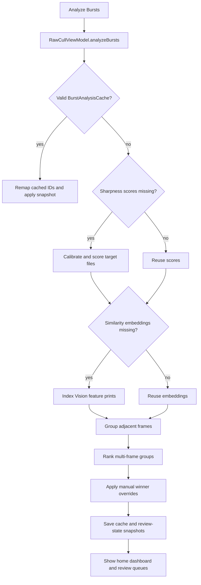

+++
author = "Thomas Evensen"
title = "Burst Groups"
date = "2026-07-15"
weight = 45
tags = ["burst", "similarity", "grouping", "vision", "sharpness"]
categories = ["technical details"]
mermaid = true
+++

# Burst Groups

Burst analysis turns a flat catalog into groups of adjacent, visually similar frames. It ranks each multi-frame group, presents review queues, and supports culling decisions such as keeping the best frame, keeping the top two, deferring a group, or setting a manual pick.

The implementation separates orchestration, Vision feature-print indexing, pure grouping and ranking engines, cache persistence, and the review UI.

## Source Map

| Area | Main files |
|---|---|
| Analysis orchestration and user actions | `sourcecode/RawCull/RawCull/Model/ViewModels/RawCullViewModel+BurstGrouping.swift` |
| Similarity indexing and grouping state | `sourcecode/RawCull/RawCull/Model/ViewModels/SimilarityScoringModel.swift` |
| Pure grouping and ranking | `sourcecode/RawCullCore/Sources/RawCullCore/BurstGroupingEngine.swift`, `BurstRankingEngine.swift` |
| Shared models | `sourcecode/RawCullCore/Sources/RawCullCore/BurstAnalysisModels.swift`, app `BurstAnalysisModels.swift`, `BurstReviewQueueModels.swift` |
| Cache | `sourcecode/RawCull/RawCull/Actors/BurstAnalysisCache.swift` |
| Ratings and manual overrides | `CullingModel.swift`, `SavedFiles.swift` |
| Burst home and review list | `BurstGroupsHomeView.swift`, `SimilarityGridSelectionView.swift`, `CullingGridView.swift` |
| Single-burst workspace and comparison | `BurstCullingWorkspaceView.swift`, `ComparisonGridView.swift` |
| Tests | `RawCullCore/Tests/RawCullCoreTests/BurstGroupingEngineTests.swift`, `BurstRankingEngineTests.swift`, app burst/culling tests |

## End-to-End Flow



Every awaited phase is protected by the analysis generation and selected catalog. A cancelled or superseded run cannot publish late results into a newer catalog.

The target is normally every catalog file sorted by localized filename, which acts as shot order. If files are selected, visible selected files are followed by hidden selected files. If no selection exists and a star filter is active, only files with that rating are analyzed.

## Similarity Embeddings

`SimilarityScoringModel` creates Vision feature-print embeddings from thumbnail-resolution images. It archives each `VNFeaturePrintObservation` as `Data` keyed by `FileItem.id`, avoiding a large collection of live Vision objects.

| Setting | Current value |
|---|---:|
| Embedding thumbnail maximum | 512 px |
| Embedding pipeline version | 1 |
| Vision revision | `VNGenerateImageFeaturePrintRequestRevision2` |
| Maximum concurrent indexing tasks | 4 |

Embedding decode first uses the RawParserKit thumbnail path and then falls back to ImageIO. The feature-print request uses `.scaleFill`.

The same model can rank a catalog by distance from an anchor image. Burst grouping instead calculates feature-print distances only between adjacent files. Those adjacent distances are cached in memory and reused when possible during regrouping.

## Grouping Rules

`BurstGroupingEngine.group(...)` makes one sequential pass. It starts a new group when any boundary rule fires.

| Boundary reason | Trigger |
|---|---|
| Visual distance changed | Adjacent feature-print distance is at or above `visualDistanceThreshold` |
| Similarity evidence missing | No adjacent distance is available |
| Capture gap | Absolute modification-date gap is greater than `maxTimeGapSeconds` |
| Camera changed | Normalized camera value changed and `requireSameCamera` is enabled |
| Focal length changed | Parsed focal-length delta exceeds `maxFocalLengthDeltaMM` |
| Exposure changed | Aperture changes by more than 0.2, ISO changes, or shutter-speed text changes |

Lens changes are recorded as evidence but do not independently split a group. They do make group metadata unstable during ranking.

Default configuration:

```text
visualDistanceThreshold = 0.25
maxTimeGapSeconds = 2.0
requireSameCamera = true
requireSimilarFocalLength = true
maxFocalLengthDeltaMM = 3.0
algorithmVersion = 2
```

The burst sensitivity control changes only the visual threshold. `reGroupBursts()` cancels older grouping work, reuses embeddings and adjacent-distance data, rebuilds rankings, and saves a new cache. The current home/category presentation is preserved instead of being forced into the grouped grid.

## Ranking Formula

`BurstRankingEngine` computes:

```text
overall =
    rankingSharpness * 0.62
  + focusPoint      * 0.12
  + saliency        * 0.10
  + metadata        * 0.16
```

Sharpness is normalized by `SharpnessScoringModel.maxScore`. When at least two group members have scores and their normalized spread is at least 0.03, global and burst-relative sharpness are blended:

```text
rankingSharpness = normalizedSharpness * 0.65
                 + burstRelativeSharpness * 0.35
```

The other components are heuristic evidence:

- Focus is 0.70 when camera AF data exists and 0.45 otherwise.
- Saliency is 0.75 when the subject label matches the group's dominant label, 0.25 on a mismatch, and 0.45–0.60 when evidence is incomplete.
- Metadata starts from group stability, gains 0.15 for tight similarity, loses 0.10 at ISO 6400 or above, and gains 0.05 at f/5.6 or wider.

Ties in overall score retain original shot order.

## Confidence And One-Click Safety

| Confidence | Conditions |
|---|---|
| High | Scores exist, group has at least 3 files, best leads second by at least 0.12, best normalized sharpness is at least 0.65, metadata is stable, and all internal visual distances are below 0.22 |
| Medium | Best leads by at least 0.05 and metadata is stable |
| Low | Scores are absent, candidates are close, or evidence is unstable |

`isSafeForOneClickCulling` is true only for high-confidence results. `keepBestInGroup` and `keepTopTwoInGroup` also require the current sharpness score table to be non-empty; otherwise they return without changing ratings.

## Home Dashboard And Review Queues

After analysis, `BurstGroupsHomeView` shows catalog coverage, group counts, the active similarity threshold, up to three suggested picks, and these queue categories:

| Category | Selection rule |
|---|---|
| All | Every computed group, including singleton groups |
| Single Images | Groups containing exactly one file |
| Needs Review | Multi-frame groups with explicit review-needed state or unsafe/uncertain ranking evidence |
| Deferred | Multi-frame groups explicitly deferred |
| Marked Reviewed | Multi-frame groups explicitly marked `.reviewed` |
| Reviewed | Effective reviewed results, decisions already applied, and manual-winner groups |

The grouped culling grid can collapse a burst to its top three ranked frames. A group header opens the dedicated workspace and toggles Reviewed or Deferred state.

`BurstCullingWorkspaceView` displays ranked frames as a filmstrip with rating, source, zoom, focus overlay, manual-pick, defer, and review controls. `P`/`N` move between frames and `G` advances to the next eligible multi-frame group in the current queue. The detailed comparison grid remains available from the workspace.

## Review States

`RawCullCore.BurstReviewState` currently defines:

- `.none`
- `.needsReview`
- `.reviewed`
- `.deferred`
- `.algorithmReviewed`
- `.manualWinnerOverride`
- `.decisionApplied`

The app and package enum are now aligned. `algorithmReviewed` remains for cache compatibility.

`BurstReviewQueuePolicy.effectiveState(for:)` preserves explicit modern states. For `.none` or legacy `.algorithmReviewed`, it derives Needs Review when confidence is not high, cautions exist, no recommendation exists, or one-click culling is unsafe; otherwise it treats the group as reviewed.

Toggling Reviewed or Deferred a second time resets the result to `.none` and removes that group from the explicit state dictionary. Review states are persisted using a catalog-and-membership `BurstGroupSignature`, so they can be restored after a threshold change even if numeric group IDs change.

## Manual Winner Overrides

A manual winner is stored in `savedfiles.json` as `BurstWinnerOverride`:

| Field | Meaning |
|---|---|
| `winnerFileName` | User-selected winner |
| `memberFileNames` | Group membership snapshot |

Overrides use filenames because saved-file persistence is filename-based. `CullingModel` canonicalizes member names so lookup is order-independent and prunes overrides whose files no longer exist. Applying an override promotes the selected file, recalculates second place, and sets `.manualWinnerOverride`.

## User Actions

| Action | Method | Effect |
|---|---|---|
| Keep best | `keepBestInGroup` | On a safe result, rate the winner 3 stars and reject the rest |
| Keep top two | `keepTopTwoInGroup` | On a safe result, rate first place 3 stars, second place 2 stars, and reject the rest |
| Set manual pick | `setManualBurstWinner` | Persist the winner override and rate the selected frame 3 stars |
| Open group | `compareBurstGroup` | Open the workspace with up to four ranked comparison IDs |
| Next group | `advanceToNextBurstGroup` | Open the next eligible multi-frame group in the active queue |
| Toggle reviewed/deferred | `toggleBurstGroupReviewed`, `toggleBurstGroupDeferred` | Persist or clear the explicit review state |
| Undo last burst action | `undoLastBurstAction` | Restore the previous ratings captured for the last one-click action |
| Reindex | `reindexBurstAnalysis` | Clear loaded analysis, delete the catalog cache, and recompute |

One-click rating actions capture a `BurstUndoEntry` before writing ratings. Only the most recent burst action is retained for undo.

## Cache Validity

`BurstAnalysisCache` stores embeddings, scores, saliency, groups, boundary evidence, ranked results, and review-state snapshots. A snapshot is accepted only when all of these still match:

- cache schema version (currently 4),
- grouping algorithm version,
- catalog path,
- effective sharpness thumbnail size and complete sharpness signature,
- grouping, embedding, and Vision similarity signature,
- file count,
- every file path, size, and modification date.

On load, cached UUIDs are remapped to the current scan's UUIDs by file path because `FileItem.id` values are recreated. Cache saves are also guarded by the completed analysis context, generation, catalog, and similarity signature so stale asynchronous work cannot overwrite a newer result.

## What To Check When Changing This Area

- Bump `BurstGroupingConfig.algorithmVersion` when grouping semantics change.
- Update the embedding pipeline version or similarity signature when embedding inputs change.
- Update the sharpness scoring signature when score meaning changes.
- Keep review-state decoding backward compatible and preserve signature-based restoration across regrouping.
- Keep manual winner overrides durable across cache invalidation and UUID remapping.
- Treat high confidence plus available sharpness scores as the one-click culling gate.
