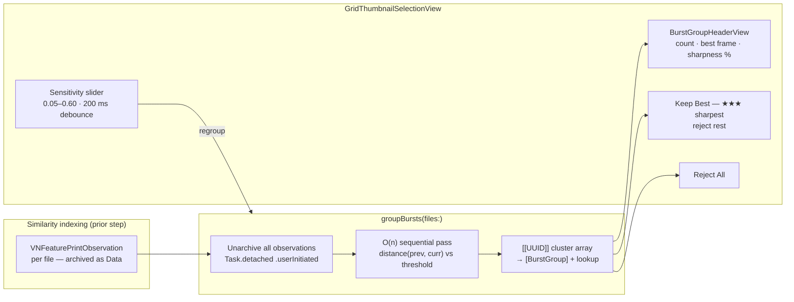

+++
author = "Thomas Evensen"
title = "Burst Grouping"
date = "2026-04-17"
weight = 1
tags = ["burst", "similarity", "grouping"]
categories = ["technical details"]
mermaid = true
+++

# Burst Grouping

RawCull can cluster a catalog into **burst groups** — sequences of consecutive frames that are visually similar. Burst mode lets you review and cull entire bursts at once, applying star ratings to the sharpest frame or rejecting the whole group with a single button click.

---

## Architecture

Burst grouping builds on the visual-similarity embedding system in `SimilarityScoringModel`. The same `VNFeaturePrintObservation` embeddings computed during similarity indexing are reused — no separate Vision requests are needed.



---

## Data Model

```swift
/// A burst group: a sequence of consecutive frames that are visually similar.
struct BurstGroup: Identifiable {
    let id: Int          // sequential index (0-based)
    let fileIDs: [UUID]  // name-sorted order (= shot order)
}
```

`SimilarityScoringModel` exposes the following burst-related state:

| Property | Type | Description |
|---|---|---|
| `burstGroups` | `[BurstGroup]` | All groups for the current catalog |
| `burstGroupLookup` | `[UUID: Int]` | O(1) file-to-group index lookup |
| `burstSensitivity` | `Float` | Distance threshold for clustering (default 0.25) |
| `burstModeActive` | `Bool` | When true, grid renders burst section headers |
| `isGrouping` | `Bool` | True while `groupBursts()` is running |

---

## groupBursts Algorithm

`groupBursts(files:)` is an `async` public method on `@Observable @MainActor SimilarityScoringModel`. `files` must be sorted by filename (= shot order) before calling.

### Step-by-step

1. **Cancel in-flight work.** Any previous `_groupingTask` is cancelled before starting. This prevents multiple concurrent unarchive passes during interactive slider adjustment — otherwise the cooperative thread pool saturates on large catalogs.

2. **Generation tracking.** A monotonically-increasing `_groupingGeneration` counter is incremented. Only the result from the most-recent generation is applied; stale completions are silently dropped.

3. **Detached task.** All heavy work runs in `Task.detached(priority: .userInitiated)`:

```swift
Task.detached(priority: .userInitiated) { () -> [[UUID]]? in
    // Phase A: unarchive all embeddings
    var observations: [UUID: VNFeaturePrintObservation] = [:]
    for (id, data) in snapshot {
        if let obs = try? NSKeyedUnarchiver.unarchivedObject(
            ofClass: VNFeaturePrintObservation.self, from: data) {
            observations[id] = obs
        }
        if unarchiveCount & 0x3F == 0, Task.isCancelled { return nil }
    }

    // Phase B: O(n) sequential pass
    var groups: [[UUID]] = []
    var current: [UUID] = []
    for (i, id) in fileIDs.enumerated() {
        if i & 0x3F == 0, Task.isCancelled { return nil }
        if i == 0 { current.append(id); continue }
        let prevID = fileIDs[i - 1]
        var d: Float = 0
        let computed = (try? prevObs.computeDistance(&d, to: obs)) != nil
        if !computed || d >= threshold {
            groups.append(current)
            current = [id]
        } else {
            current.append(id)
        }
    }
    if !current.isEmpty { groups.append(current) }
    return groups
}
```

4. **Cancellation checks every 64 iterations** (`& 0x3F == 0`) in both the unarchive loop and the sequential pass — coarse enough not to add overhead, fine enough to cancel a large catalog quickly when the slider moves.

5. **Lookup construction.** The `[[UUID]]` result is converted to `[BurstGroup]` and a `[UUID: Int]` lookup map in a single pass on `@MainActor`.

### Complexity

| Operation | Complexity |
|---|---|
| Unarchive pass | O(n) — one `NSKeyedUnarchiver` call per file |
| Sequential distance pass | O(n) — one `computeDistance` call per consecutive pair |
| Lookup construction | O(n) |

Total: **O(n)** after embeddings are available. No sorting or matrix operations.

---

## Burst Mode UI — GridThumbnailSelectionView

When `burstModeActive` is true, `GridThumbnailSelectionView` switches from a flat grid to a section-per-group layout.

### Render cache

To avoid re-walking all burst groups on every frame, the grid maintains a render cache keyed by `gridCacheKey` — a content signature computed from:

- Burst structure hash (group count + each group's file count)
- Total file count
- Current filter state
- Sharpness score count

When the key changes, `recomputeGridCache()` walks the burst groups once to build:
- `visibleBurstGroups`: groups that pass the current rating filter
- `bestInGroup: [Int: BestInGroupInfo]`: sharpest frame and its score per group

### BurstGroupHeaderView

Each burst group is rendered with a section header:

```
Burst 3 · 7 frames · Best: DSC04821.ARW · 82%  [Keep Best]  [Reject All]
```

| Control | Action |
|---|---|
| **Keep Best** | Sets ★★★ (rating 3) on the sharpest frame in the group; sets rating −1 (rejected) on all other frames. Disabled if no sharpness scores are available. |
| **Reject All** | Sets rating −1 (rejected) on all frames in the group. |

"Sharpest frame" is the file with the highest `sharpnessModel.scores[id]` value within the group.

### Sensitivity slider

A slider from 0.05 to 0.60 controls `burstSensitivity`. Changes are debounced by 200 ms — the slider can be dragged freely without spawning a new grouping pass on every tick. When the debounce fires, `groupBursts(files:)` is called, cancelling the previous in-flight pass.

Lower values produce tighter groups (only near-identical frames cluster together). Higher values merge more frames into each group, including moderate camera movement between shots.

---

## Integration with Sharpness Scoring

Burst grouping is independent of sharpness scoring but integrates with it for the "Keep Best" action:

- If `sharpnessModel.scores` is empty, the **Keep Best** button is disabled.
- When scores are present, `BestInGroupInfo` identifies the `UUID` with the maximum score in the group. The sharpness percentage shown in the header is `scores[bestID] / maxScore × 100`.

Both models are `@Observable @MainActor` and live for the lifetime of the app. `SimilarityScoringModel.reset()` is called on catalog change, which also cancels the in-flight grouping task and clears all burst state.

---

## Source Files

| File | Role |
|---|---|
| `Model/ViewModels/SimilarityScoringModel.swift` | `BurstGroup`, `groupBursts`, all burst state |
| `Views/GridView/GridThumbnailSelectionView.swift` | `BurstGroupHeaderView`, render cache, sensitivity slider |
