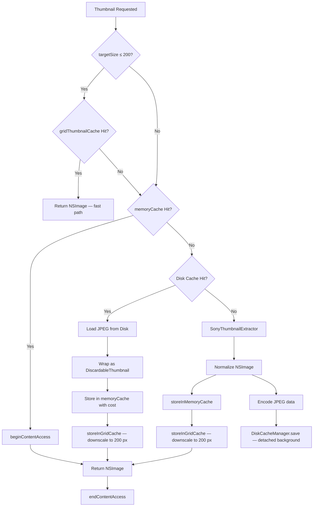
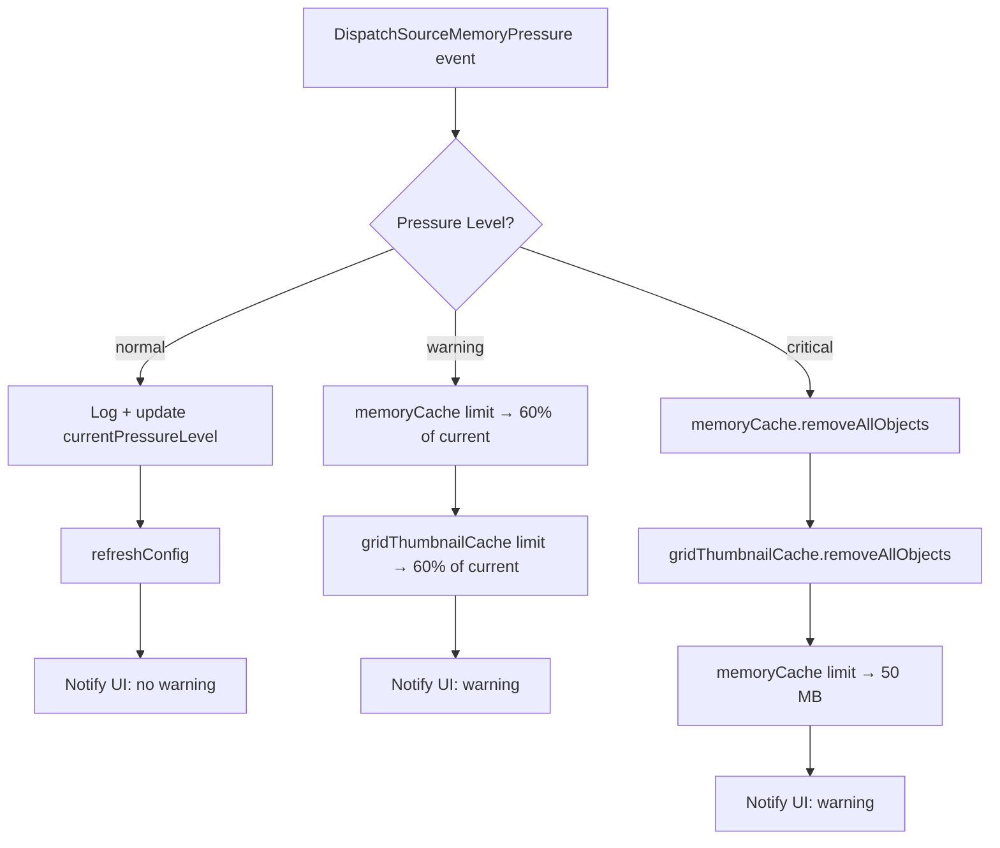

+++
author = "Thomas Evensen"
title = "Memory Cache"
date = "2026-03-17"
weight = 1
tags = ["memory", "cache", "evictions"]
categories = ["technical details"]
mermaid = true
+++

# Cache System — RawCull

RawCull uses a three-layer cache to avoid repeated RAW decoding. Decoding an ARW file on demand is expensive — the three-layer approach ensures that most requests are served from RAM or disk rather than from source.

Layers (fastest to slowest):

1. **Memory cache** — `NSCache<NSURL, DiscardableThumbnail>` in RAM
2. **Disk cache** — JPEG files on disk in `~/Library/Caches/no.blogspot.RawCull/Thumbnails/`
3. **Source decode** — `CGImageSourceCreateThumbnailAtIndex` from the ARW file

The same cache stack is shared by two paths: the bulk preload flow (`ScanAndCreateThumbnails`) and on-demand per-file requests (`RequestThumbnail`).

---

## 1. Core Types

### DiscardableThumbnail

`DiscardableThumbnail` is the in-memory cache entry. It wraps an `NSImage` and implements `NSDiscardableContent` so `NSCache` can manage it under memory pressure without immediately evicting objects that are currently in use.

```swift
final class DiscardableThumbnail: NSObject, NSDiscardableContent, @unchecked Sendable {
    let image: NSImage
    nonisolated let cost: Int
    private let state = OSAllocatedUnfairLock(
        initialState: (isDiscarded: false, accessCount: 0)
    )
}
```

**Cost calculation** happens at initialization from the actual pixel dimensions of all image representations:

```
cost = (Σ rep.pixelsWide × rep.pixelsHigh × costPerPixel) × 1.1
```

- Iterates every `NSImageRep` in the image
- Falls back to logical `image.size` if no representations are present
- The 1.1 multiplier adds a 10% overhead for wrapper and metadata
- `costPerPixel` comes from `SettingsViewModel.thumbnailCostPerPixel` (default: 6)

**Thread safety** uses `OSAllocatedUnfairLock` on a tuple `(isDiscarded: Bool, accessCount: Int)` to keep both fields consistent under concurrent access.

**`NSDiscardableContent` protocol**:

| Method | Behavior |
|---|---|
| `beginContentAccess() -> Bool` | Acquires lock, increments `accessCount`, returns `false` if already discarded |
| `endContentAccess()` | Acquires lock, decrements `accessCount` |
| `discardContentIfPossible()` | Acquires lock, marks `isDiscarded = true` only if `accessCount == 0` |
| `isContentDiscarded() -> Bool` | Acquires lock, returns `isDiscarded` |

The correct access pattern for any caller:

```swift
if let wrapper = SharedMemoryCache.shared.object(forKey: url as NSURL),
   wrapper.beginContentAccess() {
    defer { wrapper.endContentAccess() }
    use(wrapper.image)
} else {
    // Cache miss or discarded — fall through to disk or source
}
```

---

### CacheConfig

`CacheConfig` is an immutable value type passed to `SharedMemoryCache` at initialization or after a settings change:

```swift
struct CacheConfig {
    nonisolated let totalCostLimit: Int   // bytes (full-res cache)
    nonisolated let countLimit: Int
    nonisolated let gridTotalCostLimit: Int  // bytes (200 px grid cache)
    nonisolated var costPerPixel: Int?

    static let production = CacheConfig(
        totalCostLimit: 500 * 1024 * 1024,       // 500 MB default (overwritten from settings)
        countLimit: 1000,
        gridTotalCostLimit: 400 * 1024 * 1024    // 400 MB default
    )

    static let testing = CacheConfig(
        totalCostLimit: 100_000,                 // intentionally tiny
        countLimit: 5,
        gridTotalCostLimit: 400 * 1024 * 1024
    )
}
```

In production, `totalCostLimit` is overwritten from `SettingsViewModel.memoryCacheSizeMB` (default 10,000 MB) and `gridTotalCostLimit` is overwritten from `SettingsViewModel.gridCacheSizeMB` (default 400 MB) when `applyConfig` runs. The `countLimit` of 10,000 is intentionally very high — under normal operation `totalCostLimit` is always the binding constraint.

---

### CacheDelegate

`CacheDelegate` implements `NSCacheDelegate` and counts evictions via an isolated `EvictionCounter` actor:

```swift
final class CacheDelegate: NSObject, NSCacheDelegate, @unchecked Sendable {
    nonisolated static let shared = CacheDelegate()

    // NSCacheDelegate — called synchronously on NSCache's internal queue
    func cache(_ cache: NSCache<AnyObject, AnyObject>, willEvictObject obj: Any) {
        guard obj is DiscardableThumbnail else { return }
        Task { await evictionCounter.increment() }
    }
}

actor EvictionCounter {
    private var count = 0
    func increment() { count += 1 }
    func getCount() -> Int { count }
    func reset() { count = 0 }
}
```

The delegate does not affect eviction behavior — it only feeds the statistics system.

---

### SharedMemoryCache (actor)

`SharedMemoryCache` is a global actor singleton that owns two `NSCache` instances, memory pressure monitoring, and cache statistics. It uses a **dual-cache design**: a full-resolution memory cache and a dedicated grid thumbnail cache serving the 200 px grid-view fast path.

```swift
actor SharedMemoryCache {
    nonisolated static let shared = SharedMemoryCache()

    // nonisolated(unsafe) allows synchronous access from any context.
    // NSCache itself is thread-safe; this is intentional and documented.
    nonisolated(unsafe) let memoryCache = NSCache<NSURL, DiscardableThumbnail>()

    /// Dedicated in-memory-only cache for grid-size (≤500 px) thumbnails.
    /// Keyed by the same NSURL as memoryCache; never persisted to disk.
    nonisolated(unsafe) let gridThumbnailCache = NSCache<NSURL, DiscardableThumbnail>()

    private(set) nonisolated(unsafe) var currentPressureLevel: MemoryPressureLevel = .normal

    private var _costPerPixel: Int = 4
    private var diskCache: DiskCacheManager
    private var memoryPressureSource: DispatchSourceMemoryPressure?
    private var setupTask: Task<Void, Never>?

    // Statistics (actor-isolated)
    private var cacheMemory: Int = 0   // RAM hits
    private var cacheDisk: Int = 0     // Disk hits

    // Tracks grid cache memory cost without actor isolation
    private nonisolated(unsafe) let _gridCost = OSAllocatedUnfairLock(initialState: 0)
}
```

**Synchronous accessors for the full-resolution cache** — `nonisolated`, callable without `await`:

```swift
nonisolated func object(forKey key: NSURL) -> DiscardableThumbnail?
nonisolated func setObject(_ obj: DiscardableThumbnail, forKey key: NSURL, cost: Int)
nonisolated func removeAllObjects()
```

**Synchronous accessors for the grid thumbnail cache** — also `nonisolated`:

```swift
nonisolated func gridObject(forKey key: NSURL) -> DiscardableThumbnail?
nonisolated func setGridObject(_ obj: DiscardableThumbnail, forKey key: NSURL, cost: Int)
nonisolated func removeAllGridObjects()
nonisolated func getGridCacheCurrentCost() -> Int
```

`setGridObject` updates `_gridCost` via `OSAllocatedUnfairLock` so the running total is always consistent without requiring an actor hop. `getGridCacheCurrentCost()` reads the same lock — used by the Cache settings tab to display live grid cache usage.

### Grid Thumbnail Cache

The grid thumbnail cache (`gridThumbnailCache`) is separate from the full-resolution `memoryCache` because the grid view needs many small (≤200 px) thumbnails very quickly and should not compete with or evict the full-resolution images used in the zoom/preview path.

**Configuration** (applied in `applyConfig`):

| Property | Value | Rationale |
|---|---|---|
| `totalCostLimit` | 400 MB (from `gridCacheSizeMB`) | Fits thousands of 200 px thumbnails while leaving headroom |
| `countLimit` | 3000 | Hard cap on item count as a secondary safety net |
| `evictsObjectsWithDiscardedContent` | `false` | Retain entries even after `NSDiscardableContent` is discarded |

The grid cache is never written to disk. `ScanAndCreateThumbnails.storeInGridCache(_:for:)` downscales each image to ≤200 px before storing, so the grid cache always holds consistently-sized entries regardless of the bulk preload target size. `ThumbnailLoader.thumbnailLoader(file:targetSize:)` reads from it directly when `targetSize ≤ 200`, bypassing the full-resolution path and the 6-slot concurrency throttle entirely.

**Initialization** is gated by a `setupTask` so that concurrent callers to `ensureReady()` share a single initialization pass:

```swift
func ensureReady(config: CacheConfig? = nil) async {
    if let existing = setupTask {
        await existing.value
        return
    }
    let capturedConfig = config
    let task = Task {
        self.startMemoryPressureMonitoring()
        let finalConfig: CacheConfig
        if let cfg = capturedConfig {
            finalConfig = cfg
        } else {
            let settings = await SettingsViewModel.shared.asyncgetsettings()
            finalConfig = self.calculateConfig(from: settings)
        }
        self.applyConfig(finalConfig)
    }
    setupTask = task
    await task.value
}
```

**Configuration flow**:

```
ensureReady()
  -> startMemoryPressureMonitoring()
  -> SettingsViewModel.shared.asyncgetsettings()
      -> calculateConfig(from:)
          -> applyConfig(_:)
```

`calculateConfig` converts settings to a `CacheConfig`:
- `totalCostLimit = memoryCacheSizeMB × 1024 × 1024`
- `countLimit = 10,000` (intentionally very high — memory cost, not item count, is the real constraint)
- `gridTotalCostLimit = gridCacheSizeMB × 1024 × 1024`
- `costPerPixel = thumbnailCostPerPixel`

`applyConfig` applies the config to both `NSCache` instances:
- `memoryCache.totalCostLimit = config.totalCostLimit`
- `memoryCache.countLimit = config.countLimit`
- `memoryCache.evictsObjectsWithDiscardedContent = false`
- `memoryCache.delegate = CacheDelegate.shared`
- `gridThumbnailCache.totalCostLimit = config.gridTotalCostLimit`
- `gridThumbnailCache.countLimit = 3000`
- `gridThumbnailCache.evictsObjectsWithDiscardedContent = false`
- `gridThumbnailCache.delegate = CacheDelegate.shared`

---

### DiskCacheManager (actor)

`DiskCacheManager` stores JPEG thumbnails on disk and retrieves them on RAM cache misses.

```swift
actor DiskCacheManager {
    private let cacheDirectory: URL
    // ~/Library/Caches/no.blogspot.RawCull/Thumbnails/
}
```

**Cache key generation** — deterministic `CryptoKit.Insecure.MD5` hash of the standardized source path:

```swift
private func cacheURL(for sourceURL: URL) -> URL {
    let standardizedPath = sourceURL.standardized.path
    let data = Data(standardizedPath.utf8)
    let digest = Insecure.MD5.hash(data: data)
    let hash = digest.map { String(format: "%02x", $0) }.joined()
    return cacheDirectory.appendingPathComponent(hash).appendingPathExtension("jpg")
}
```

MD5 is used as a non-cryptographic filename hash — a fixed-width, filesystem-safe string with a vanishingly small collision rate across one user's catalog. `Insecure.MD5` makes the "not-for-security" intent explicit, and `.standardized` resolves `..`/`.` components so two URLs pointing at the same file always hash identically.

**Load** — detached `userInitiated` priority task:

```swift
func load(for sourceURL: URL) async -> NSImage? {
    let url = cacheURL(for: sourceURL)
    return await Task.detached(priority: .userInitiated) {
        guard FileManager.default.fileExists(atPath: url.path) else { return nil }
        return NSImage(contentsOf: url)
    }.value
}
```

**Save** — accepts pre-encoded `Data` (a `Sendable` type) to cross the actor boundary safely:

```swift
func save(_ jpegData: Data, for sourceURL: URL) async {
    let fileURL = cacheURL(for: sourceURL)
    // `Data` is Sendable — safe to hand off to a detached task.
    await Task.detached(priority: .background) {
        do {
            try jpegData.write(to: fileURL, options: .atomic)
        } catch {
            // Log error
        }
    }.value
}

// Called inside the actor that owns the CGImage, before crossing actor boundaries
nonisolated static func jpegData(from cgImage: CGImage) -> Data? {
    // CGImageDestination → JPEG quality 0.7
}
```

Note that the callers of `save` invoke it from their own `Task.detached` so the encoded-and-write sequence is itself fully off-actor; the `await Task.detached(...).value` inside `save` means the disk-cache actor does not serialise multiple concurrent writes on its executor.

**Cache maintenance**:

| Method | Behavior |
|---|---|
| `getDiskCacheSize() async -> Int` | Sums `totalFileAllocatedSize` for all `.jpg` cache files |
| `pruneCache(maxAgeInDays: Int = 30) async` | Removes files with modification date older than threshold |

Both run in detached `utility` priority tasks.

---

## 2. Memory Pressure Handling

Memory pressure is monitored via `DispatchSource.makeMemoryPressureSource`:

```swift
func startMemoryPressureMonitoring() {
    let source = DispatchSource.makeMemoryPressureSource(
        eventMask: [.normal, .warning, .critical],
        queue: .global(qos: .utility)
    )
    source.setEventHandler { [weak self] in
        Task { await self?.handleMemoryPressureEvent() }
    }
    source.resume()
    memoryPressureSource = source
}
```

**Response by level**:

| Level | Main cache action | Grid cache action |
|---|---|---|
| `.normal` | Log, update `currentPressureLevel`, `refreshConfig()`, notify `memorypressurewarning(false)` | — |
| `.warning` | Reduce `totalCostLimit` to **60% of current limit**, notify `memorypressurewarning(true)` | Reduce `totalCostLimit` to **60% of current limit** |
| `.critical` | `removeAllObjects()`, set limit to 50 MB, notify `memorypressurewarning(true)` | `removeAllObjects()` |

**Important detail about warning compounding**: the warning level calculates its reduction from the *current* limit, not the original configured limit. Repeated warning events compound:

```
Original: 10000 MB
After 1st warning: 6000 MB
After 2nd warning: 3600 MB
After 3rd warning: 2160 MB
```

The limit is only restored to the configured value when `applyConfig()` runs again — for example, on app start or after a settings change.

---

## 3. Cache Statistics

`SharedMemoryCache` tracks hits and evictions in actor-isolated counters:

- `cacheMemory` — incremented on every RAM hit (via `updateCacheMemory()`)
- `cacheDisk` — incremented on every disk hit (via `updateCacheDisk()`)
- Eviction count — tracked by `CacheDelegate.EvictionCounter`

`getCacheStatistics() async -> CacheStatistics` returns a snapshot:

```swift
struct CacheStatistics {
    nonisolated let hits: Int
    nonisolated let misses: Int
    nonisolated let evictions: Int
    nonisolated let hitRate: Double   // (hits / (hits + misses)) * 100
}
```

`clearCaches() async`:
1. `memoryCache.removeAllObjects()`
2. `gridThumbnailCache.removeAllObjects()`
3. `diskCache.pruneCache(maxAgeInDays: 0)` — prunes all files
4. Resets `cacheMemory`, `cacheDisk`, `_gridCost`, and eviction count to 0

---

## 4. End-to-End Cache Flow

### 4.1 Bulk preload path (ScanAndCreateThumbnails)

```
Process ARW file URL
│
├─ Check SharedMemoryCache.object(forKey:)    ← full-res RAM cache
│   ├─ Hit: storeInGridCache(image, for: url) → notify progress → return
│   └─ Miss:
│       ├─ Check DiskCacheManager.load(for:)
│       │   ├─ Hit: storeInMemoryCache + storeInGridCache → notify progress → return
│       │   └─ Miss:
│       │       ├─ notifyExtractionNeeded() → sets creatingthumbnails = true on UI
│       │       ├─ SonyThumbnailExtractor.extractSonyThumbnail(from:maxDimension:qualityCost:)
│       │       ├─ Normalize CGImage → NSImage
│       │       ├─ storeInMemoryCache(_:for:) — full-res DiscardableThumbnail → NSCache
│       │       ├─ storeInGridCache(_:for:)  — downscale to 200 px → gridThumbnailCache
│       │       └─ Encode JPEG → DiskCacheManager.save(_:for:) [detached, background]
└─ Notify UI of progress
```

`storeInGridCache` calls `downscale(_:to: 200)` — a private helper that uses `NSImage.draw` into a proportionally-scaled `NSImage`. The downscaled copy is wrapped in a `DiscardableThumbnail` and stored in `gridThumbnailCache` via `setGridObject`.

### 4.2 On-demand path (ThumbnailLoader → RequestThumbnail)

```
thumbnailLoader(file:targetSize:)
│
├─ targetSize ≤ 200?
│   └─ Yes: SharedMemoryCache.gridObject(forKey:)
│           ├─ Hit: return wrapper.image  ← fast path, no slot acquired
│           └─ Miss: fall through to full path below
│
├─ acquireSlot() — block if activeTasks ≥ 6
│
└─ RequestThumbnail.requestThumbnail(for:targetSize:)
       ├─ RAM cache (object(forKey:))
       ├─ Disk cache (DiskCacheManager.load(for:))
       └─ SonyThumbnailExtractor extraction
```

---

## 5. Settings That Affect Cache Behavior

Settings live in `SettingsViewModel` and are persisted to `~/Library/Application Support/RawCull/settings.json`.

| Setting | Default | Effect |
|---|---|---|
| `memoryCacheSizeMB` | 10000 | `NSCache.totalCostLimit = memoryCacheSizeMB × 1024 × 1024` (full-res cache only) |
| `gridCacheSizeMB` | 400 | `gridThumbnailCache.totalCostLimit = gridCacheSizeMB × 1024 × 1024` (200 px grid cache) |
| `thumbnailCostPerPixel` | 6 | Cost per pixel in `DiscardableThumbnail.cost` for both caches |
| `thumbnailSizePreview` | 1616 | Target size for bulk preload; affects full-res entry cost |
| `thumbnailSizeGrid` | 200 | Grid list thumbnail size |
| `thumbnailSizeFullSize` | 8700 | Full-size zoom path upper bound |

Grid view thumbnails are fixed at **200 px** (not user-configurable). The grid cache limit is hardcoded at 400 MB.

The **Settings → Cache** tab shows two lines of live usage:
- Disk cache size (from `DiskCacheManager.getDiskCacheSize()`)
- Grid cache (200 px): current cost / 400 MB limit (from `SharedMemoryCache.shared.getGridCacheCurrentCost()`)

`SettingsViewModel.validateSettings()` emits warnings if:
- `memoryCacheSizeMB < 500`
- `memoryCacheSizeMB > 80%` of available system memory

---

## 6. Cache Flow Diagram



---

## 7. Memory Pressure Response Diagram


