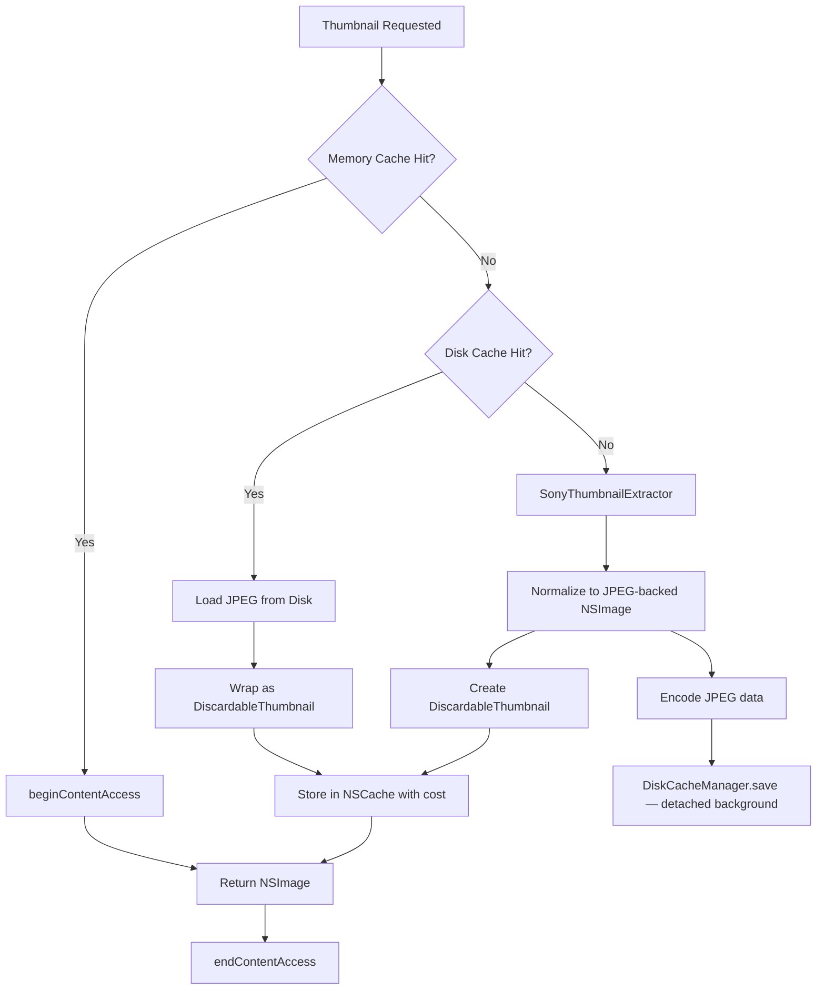
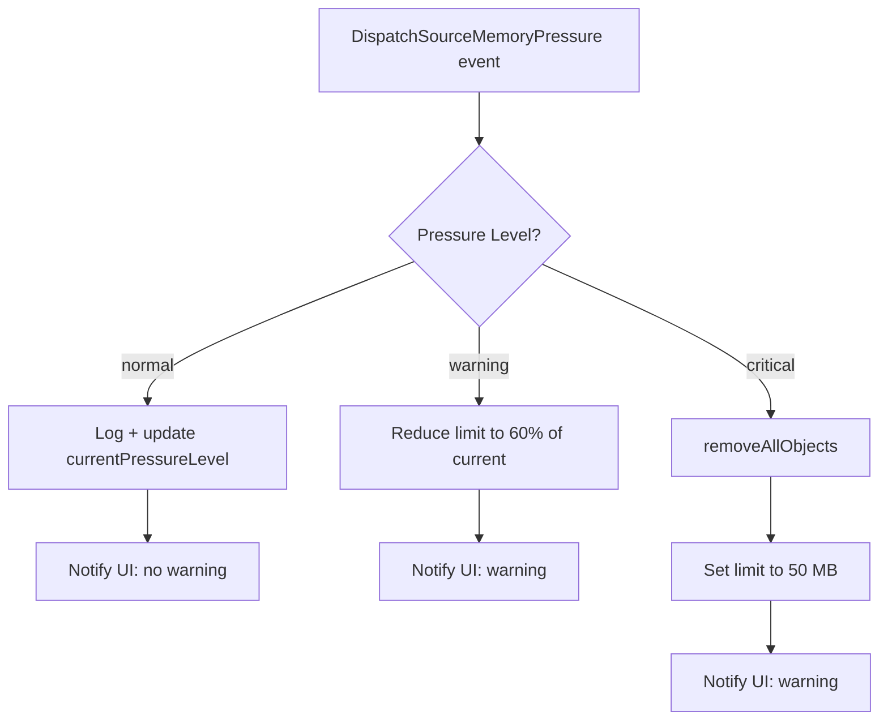

+++
author = "Thomas Evensen"
title = "Memory Cache"
date = "2026-03-17"
weight = 1
tags = ["memory", "cache", "evictions"]
categories = ["technical details"]
mermaid = true
+++

# Cache System — RawCull

RawCull uses a three-layer cache to avoid repeated RAW decoding. Decoding an ARW file on demand is expensive — the three-layer approach ensures that most requests are served from RAM or disk rather than from source.

Layers (fastest to slowest):

1. **Memory cache** — `NSCache<NSURL, DiscardableThumbnail>` in RAM
2. **Disk cache** — JPEG files on disk in `~/Library/Caches/no.blogspot.RawCull/Thumbnails/`
3. **Source decode** — `CGImageSourceCreateThumbnailAtIndex` from the ARW file

The same cache stack is shared by two paths: the bulk preload flow (`ScanAndCreateThumbnails`) and on-demand per-file requests (`RequestThumbnail`).

---

## 1. Core Types

### DiscardableThumbnail

`DiscardableThumbnail` is the in-memory cache entry. It wraps an `NSImage` and implements `NSDiscardableContent` so `NSCache` can manage it under memory pressure without immediately evicting objects that are currently in use.

```swift
final class DiscardableThumbnail: NSObject, NSDiscardableContent, @unchecked Sendable {
    let image: NSImage
    nonisolated let cost: Int
    private let state = OSAllocatedUnfairLock(
        initialState: (isDiscarded: false, accessCount: 0)
    )
}
```

**Cost calculation** happens at initialization from the actual pixel dimensions of all image representations:

```
cost = (Σ rep.pixelsWide × rep.pixelsHigh × costPerPixel) × 1.1
```

- Iterates every `NSImageRep` in the image
- Falls back to logical `image.size` if no representations are present
- The 1.1 multiplier adds a 10% overhead for wrapper and metadata
- `costPerPixel` comes from `SettingsViewModel.thumbnailCostPerPixel` (default: 4, representing RGBA bytes per pixel)

**Thread safety** uses `OSAllocatedUnfairLock` on a tuple `(isDiscarded: Bool, accessCount: Int)` to keep both fields consistent under concurrent access.

**`NSDiscardableContent` protocol**:

| Method | Behavior |
|---|---|
| `beginContentAccess() -> Bool` | Acquires lock, increments `accessCount`, returns `false` if already discarded |
| `endContentAccess()` | Acquires lock, decrements `accessCount` |
| `discardContentIfPossible()` | Acquires lock, marks `isDiscarded = true` only if `accessCount == 0` |
| `isContentDiscarded() -> Bool` | Acquires lock, returns `isDiscarded` |

The correct access pattern for any caller:

```swift
if let wrapper = SharedMemoryCache.shared.object(forKey: url as NSURL),
   wrapper.beginContentAccess() {
    defer { wrapper.endContentAccess() }
    use(wrapper.image)
} else {
    // Cache miss or discarded — fall through to disk or source
}
```

---

### CacheConfig

`CacheConfig` is an immutable value type passed to `SharedMemoryCache` at initialization or after a settings change:

```swift
struct CacheConfig {
    nonisolated let totalCostLimit: Int   // bytes
    nonisolated let countLimit: Int
    nonisolated var costPerPixel: Int?

    static let production = CacheConfig(
        totalCostLimit: 500 * 1024 * 1024,  // 500 MB default
        countLimit: 1000
    )

    static let testing = CacheConfig(
        totalCostLimit: 100_000,            // intentionally tiny
        countLimit: 5
    )
}
```

In production, `totalCostLimit` is overwritten from `SettingsViewModel.memoryCacheSizeMB` when `applyConfig` runs. The `countLimit` of 10,000 is intentionally very high — under normal operation `totalCostLimit` is always the binding constraint.

---

### CacheDelegate

`CacheDelegate` implements `NSCacheDelegate` and counts evictions via an isolated `EvictionCounter` actor:

```swift
final class CacheDelegate: NSObject, NSCacheDelegate, @unchecked Sendable {
    nonisolated static let shared = CacheDelegate()

    // NSCacheDelegate — called synchronously on NSCache's internal queue
    func cache(_ cache: NSCache<AnyObject, AnyObject>, willEvictObject obj: Any) {
        guard obj is DiscardableThumbnail else { return }
        Task { await evictionCounter.increment() }
    }
}

actor EvictionCounter {
    private var count = 0
    func increment() { count += 1 }
    func getCount() -> Int { count }
    func reset() { count = 0 }
}
```

The delegate does not affect eviction behavior — it only feeds the statistics system.

---

### SharedMemoryCache (actor)

`SharedMemoryCache` is a global actor singleton that owns the `NSCache`, memory pressure monitoring, and cache statistics.

```swift
actor SharedMemoryCache {
    nonisolated static let shared = SharedMemoryCache()

    // nonisolated(unsafe) allows synchronous access from any context.
    // NSCache itself is thread-safe; this is intentional and documented.
    nonisolated(unsafe) let memoryCache = NSCache<NSURL, DiscardableThumbnail>()
    nonisolated(unsafe) var currentPressureLevel: MemoryPressureLevel = .normal

    private var _costPerPixel: Int = 4
    private var diskCache: DiskCacheManager
    private var memoryPressureSource: DispatchSourceMemoryPressure?
    private var setupTask: Task<Void, Never>?

    // Statistics (actor-isolated)
    private var cacheMemory: Int = 0   // RAM hits
    private var cacheDisk: Int = 0     // Disk hits
}
```

**Synchronous accessors** — `nonisolated`, callable from any context without `await`:

```swift
nonisolated func object(forKey key: NSURL) -> DiscardableThumbnail?
nonisolated func setObject(_ obj: DiscardableThumbnail, forKey key: NSURL, cost: Int)
nonisolated func removeAllObjects()
```

**Initialization** is gated by a `setupTask` so that concurrent callers to `ensureReady()` share a single initialization pass:

```swift
func ensureReady(config: CacheConfig? = nil) async {
    if let existing = setupTask {
        await existing.value
        return
    }
    let task = Task { await self.setCacheCostsFromSavedSettings() }
    setupTask = task
    await task.value
    startMemoryPressureMonitoring()
}
```

**Configuration flow**:

```
ensureReady()
  -> setCacheCostsFromSavedSettings()
      -> SettingsViewModel.shared.asyncgetsettings()
          -> calculateConfig(from:)
              -> applyConfig(_:)
```

`calculateConfig` converts settings to a `CacheConfig`:
- `totalCostLimit = memoryCacheSizeMB × 1024 × 1024`
- `countLimit = 10,000` (intentionally very high — memory cost, not item count, is the real constraint)
- `costPerPixel = thumbnailCostPerPixel`

`applyConfig` applies the config to `NSCache`:
- `memoryCache.totalCostLimit = config.totalCostLimit`
- `memoryCache.countLimit = config.countLimit`
- `memoryCache.delegate = CacheDelegate.shared`

---

### DiskCacheManager (actor)

`DiskCacheManager` stores JPEG thumbnails on disk and retrieves them on RAM cache misses.

```swift
actor DiskCacheManager {
    private let cacheDirectory: URL
    // ~/Library/Caches/no.blogspot.RawCull/Thumbnails/
}
```

**Cache key generation** — deterministic MD5 hash of the standardized source path:

```swift
func cacheURL(for sourceURL: URL) -> URL {
    let standardized = sourceURL.standardizedFileURL.path
    let hash = MD5(string: standardized)   // hex string
    return cacheDirectory.appendingPathComponent(hash + ".jpg")
}
```

**Load** — detached `userInitiated` priority task:

```swift
func load(for sourceURL: URL) async -> NSImage? {
    let url = cacheURL(for: sourceURL)
    return await Task.detached(priority: .userInitiated) {
        guard FileManager.default.fileExists(atPath: url.path) else { return nil }
        return NSImage(contentsOf: url)
    }.value
}
```

**Save** — accepts pre-encoded `Data` (a `Sendable` type) to cross the actor boundary safely:

```swift
func save(_ jpegData: Data, for sourceURL: URL) async {
    let url = cacheURL(for: sourceURL)
    Task.detached(priority: .background) {
        do {
            try jpegData.write(to: url)
        } catch {
            // Log error
        }
    }
}

// Called inside the actor that owns the CGImage, before crossing actor boundaries
static nonisolated func jpegData(from cgImage: CGImage) -> Data? {
    // CGImageDestination → JPEG quality 0.7
}
```

**Cache maintenance**:

| Method | Behavior |
|---|---|
| `getDiskCacheSize() async -> Int` | Sums `totalFileAllocatedSize` for all `.jpg` cache files |
| `pruneCache(maxAgeInDays: Int = 30) async` | Removes files with modification date older than threshold |

Both run in detached `utility` priority tasks.

---

## 2. Memory Pressure Handling

Memory pressure is monitored via `DispatchSource.makeMemoryPressureSource`:

```swift
func startMemoryPressureMonitoring() {
    let source = DispatchSource.makeMemoryPressureSource(
        eventMask: [.normal, .warning, .critical],
        queue: .global(qos: .utility)
    )
    source.setEventHandler { [weak self] in
        Task { await self?.handleMemoryPressureEvent() }
    }
    source.resume()
    memoryPressureSource = source
}
```

**Response by level**:

| Level | Action |
|---|---|
| `.normal` | Log, update `currentPressureLevel`, notify `fileHandlers.memorypressurewarning(false)` |
| `.warning` | Reduce `totalCostLimit` to **60% of the current limit**, notify `fileHandlers.memorypressurewarning(true)` |
| `.critical` | `removeAllObjects()`, set `totalCostLimit` to 50 MB, notify `fileHandlers.memorypressurewarning(true)` |

**Important detail about warning compounding**: the warning level calculates its reduction from the *current* limit, not the original configured limit. Repeated warning events compound:

```
Original: 5000 MB
After 1st warning: 3000 MB
After 2nd warning: 1800 MB
After 3rd warning: 1080 MB
```

The limit is only restored to the configured value when `applyConfig()` runs again — for example, on app start or after a settings change.

---

## 3. Cache Statistics

`SharedMemoryCache` tracks hits and evictions in actor-isolated counters:

- `cacheMemory` — incremented on every RAM hit (via `updateCacheMemory()`)
- `cacheDisk` — incremented on every disk hit (via `updateCacheDisk()`)
- Eviction count — tracked by `CacheDelegate.EvictionCounter`

`getCacheStatistics() async -> CacheStatistics` returns a snapshot:

```swift
struct CacheStatistics {
    nonisolated let hits: Int
    nonisolated let misses: Int
    nonisolated let evictions: Int
    nonisolated let hitRate: Double   // (hits / (hits + misses)) * 100
}
```

`clearCaches() async`:
1. Reads and logs final statistics
2. `memoryCache.removeAllObjects()`
3. `diskCache.pruneCache(maxAgeInDays: 0)` — prunes all files
4. Resets `cacheMemory`, `cacheDisk`, and eviction count to 0

---

## 4. End-to-End Cache Flow

```
Request thumbnail for URL
│
├─ Check SharedMemoryCache.object(forKey:)
│   ├─ Hit: beginContentAccess() → use image → endContentAccess() → return
│   └─ Miss:
│       ├─ Check DiskCacheManager.load(for:)
│       │   ├─ Hit: wrap as DiscardableThumbnail → store in NSCache → return
│       │   └─ Miss:
│       │       ├─ SonyThumbnailExtractor.extractSonyThumbnail(from:maxDimension:qualityCost:)
│       │       ├─ Normalize CGImage → NSImage (JPEG-backed, quality 0.7)
│       │       ├─ Create DiscardableThumbnail → store in NSCache (with cost)
│       │       └─ Encode JPEG data → DiskCacheManager.save(_:for:) [detached, background]
└─ Return CGImage to caller
```

---

## 5. Settings That Affect Cache Behavior

Settings live in `SettingsViewModel` and are persisted to `~/Library/Application Support/RawCull/settings.json`.

| Setting | Default | Effect |
|---|---|---|
| `memoryCacheSizeMB` | 5000 | `NSCache.totalCostLimit = memoryCacheSizeMB × 1024 × 1024` |
| `thumbnailCostPerPixel` | 4 | Cost per pixel in `DiscardableThumbnail.cost` |
| `thumbnailSizePreview` | 1024 | Target size for bulk preload; affects entry cost |
| `thumbnailSizeGrid` | 100 | Grid thumbnail size |
| `thumbnailSizeGridView` | 400 | Grid View thumbnail size |
| `thumbnailSizeFullSize` | 8700 | Full-size zoom path upper bound |

`SettingsViewModel.validateSettings()` emits warnings if:
- `memoryCacheSizeMB < 500`
- `memoryCacheSizeMB > 80%` of available system memory

---

## 6. Cache Flow Diagram



---

## 7. Memory Pressure Response Diagram


