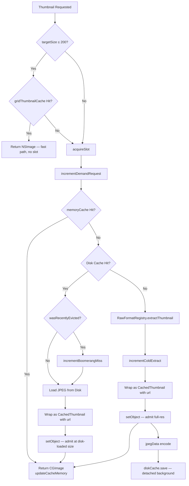
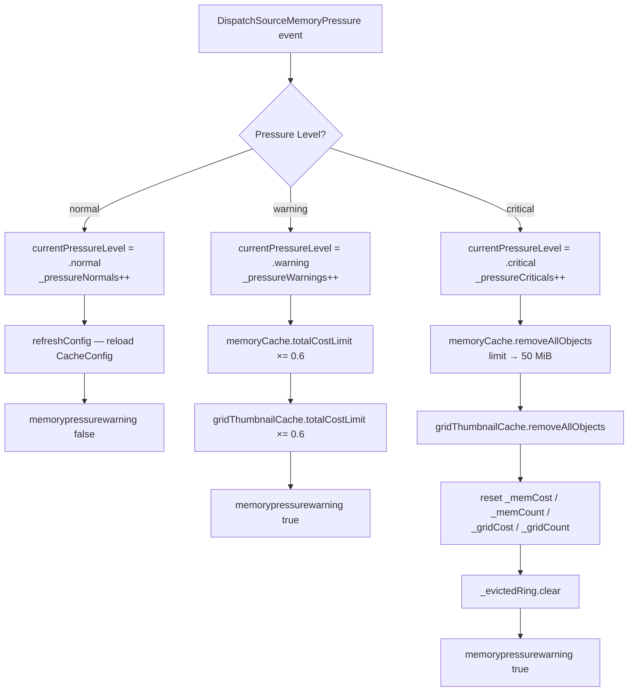

+++
author = "Thomas Evensen"
title = "Memory Cache"
date = "2026-04-29"
weight = 1
tags = ["memory", "cache", "evictions", "boomerang"]
categories = ["technical details"]
mermaid = true
+++

# Cache System — RawCull

RawCull uses a three-layer cache to avoid repeated RAW decoding. Decoding an ARW (or other RAW) file on demand is expensive — the layered approach ensures that most requests are served from RAM or disk rather than from the source file.

Layers, fastest to slowest:

1. **Memory cache** — `NSCache<NSURL, CachedThumbnail>` in RAM, full-resolution preview entries.
2. **Grid memory cache** — a second `NSCache<NSURL, CachedThumbnail>` holding 200 px downscaled copies. Never persisted to disk.
3. **Disk cache** — JPEG files in `~/Library/Caches/no.blogspot.RawCull/Thumbnails/`.
4. **Source decode** — `CGImageSourceCreateThumbnailAtIndex` over a format-specific extractor (Sony ARW, Nikon NEF, …) selected via `RawFormatRegistry`.

Two paths share this stack: the bulk preload flow (`ScanAndCreateThumbnails`) and on-demand per-file requests (`RequestThumbnail`, fronted by `ThumbnailLoader`).

---

## 1. Core Types

### CachedThumbnail

`CachedThumbnail` is the in-memory cache entry. It is a plain reference wrapper around an `NSImage` — it does **not** conform to `NSDiscardableContent`.

```swift
final class CachedThumbnail: NSObject, @unchecked Sendable {
    let image: NSImage
    nonisolated let cost: Int
    nonisolated let url: NSURL?

    nonisolated init(image: NSImage, url: NSURL? = nil)
}
```

The earlier implementation (`DiscardableThumbnail`) adopted `NSDiscardableContent` so the OS could purge bitmap pages under memory pressure. Memory Diagnostics measurements showed `NSCache` was using that conformance to evict wrappers aggressively at very low utilisation (~8 % of the configured cap) — every eviction paired 1:1 with a `discardContentIfPossible` call, collapsing the RAM hit rate to under 5 %. The wrapper now holds a plain reference so eviction is driven only by:

- the explicit `totalCostLimit` / `countLimit` on the `NSCache`, and
- the `handleMemoryPressureEvent` handler in `SharedMemoryCache`.

**Cost calculation** at initialisation iterates every `NSImageRep` in the image:

```
cost = (Σ rep.pixelsWide × rep.pixelsHigh × costPerPixel) × 1.1
```

- Falls back to logical `image.size` if no representations are present.
- The 1.1 multiplier adds 10 % overhead for the wrapper and metadata.
- `costPerPixel` is read once from `SharedMemoryCache.shared.costPerPixel` — a `nonisolated let` fixed at **4** (RGBA). It is no longer a user-tunable setting; representations in this app are always sRGB RGBA, so there is no reason for the value to vary at runtime.

**The `url` field** is optional and is set whenever the entry will be admitted to the full-resolution `memoryCache`. It is read back by `CacheDelegate` when `NSCache` evicts the value, so the evicting URL can be pushed onto the recently-evicted ring used for boomerang diagnostics. Grid-cache entries are stored without a URL because grid-cache evictions are intentionally not tracked.

Because there is no `NSDiscardableContent` protocol, callers simply read `wrapper.image` directly:

```swift
if let wrapper = SharedMemoryCache.shared.object(forKey: url as NSURL) {
    use(wrapper.image)        // no beginContentAccess / endContentAccess
} else {
    // Cache miss — fall through to disk or source.
}
```

---

### CacheConfig

`CacheConfig` is the immutable snapshot passed to `SharedMemoryCache.applyConfig`:

```swift
struct CacheConfig {
    nonisolated let totalCostLimit: Int          // bytes (full-res cache)
    nonisolated let countLimit: Int
    nonisolated let gridTotalCostLimit: Int      // bytes (200 px grid cache)

    static let production = CacheConfig(
        totalCostLimit: 500 * 1024 * 1024,       // ~500 MB (overwritten from settings)
        countLimit: 1000
        // gridTotalCostLimit defaults to 400 * 1024 * 1024
    )

    static let testing = CacheConfig(
        totalCostLimit: 100_000,                 // intentionally tiny
        countLimit: 5
    )
}
```

`CacheConfig` carries no `costPerPixel` field — that constant lives on `SharedMemoryCache` itself and never changes.

In production, both byte caps are overwritten from `SavedSettings` by `calculateConfig(from:)` before `applyConfig` runs:

- `totalCostLimit = memoryCacheSizeMB · 1024 · 1024`
- `gridTotalCostLimit = gridCacheSizeMB · 1024 · 1024`
- `countLimit = 10 000` — intentionally very high so byte cost, not item count, is the binding constraint. `NSCache` applies `min(countLimit, totalCostLimit)` and we want cost to do the evicting.

---

### CacheDelegate

`CacheDelegate` implements `NSCacheDelegate` and is shared by both `NSCache` instances. It is fully synchronous — eviction bookkeeping happens inside the delegate callback:

```swift
final class CacheDelegate: NSObject, NSCacheDelegate, @unchecked Sendable {
    nonisolated static let shared = CacheDelegate()

    private let evictionCount = OSAllocatedUnfairLock(initialState: 0)

    nonisolated func cache(_ cache: NSCache<AnyObject, AnyObject>, willEvictObject obj: Any) {
        guard let thumb = obj as? CachedThumbnail else { return }
        if cache === SharedMemoryCache.shared.gridThumbnailCache {
            SharedMemoryCache.shared.gridEntryEvicted(cost: thumb.cost)
        } else if cache === SharedMemoryCache.shared.memoryCache {
            SharedMemoryCache.shared.memEntryEvicted(cost: thumb.cost)
            if let url = thumb.url {
                SharedMemoryCache.shared.noteEviction(url: url)
            }
        }
        evictionCount.withLock { $0 += 1 }
    }
}
```

The earlier delegate dispatched into an `EvictionCounter` actor with a fire-and-forget `Task { await actor.increment() }`. Under high eviction churn that path fell behind the synchronous delegate fires by more than 20 % at sample time, so the counter is now a plain `OSAllocatedUnfairLock`.

Three things happen on every full-cache eviction:

1. `memEntryEvicted` decrements the manual `_memCost` / `_memCount` counters that mirror what `NSCache` does not expose publicly.
2. The evicted `NSURL` is pushed onto the bounded `EvictedRing` so a subsequent disk fallback for the same key can be classified as a *boomerang miss* in diagnostics.
3. The eviction counter is incremented.

Grid-cache evictions only update the grid counters; they do not feed the boomerang ring.

---

### SharedMemoryCache (actor)

`SharedMemoryCache` is the global actor singleton that owns both `NSCache` instances, memory-pressure monitoring, statistics, and the diagnostics counters.

```swift
actor SharedMemoryCache {
    nonisolated static let shared = SharedMemoryCache()

    // NSCache itself is thread-safe; nonisolated(unsafe) makes the synchronous
    // accessors below callable without an actor hop.
    nonisolated(unsafe) let memoryCache       = NSCache<NSURL, CachedThumbnail>()
    nonisolated(unsafe) let gridThumbnailCache = NSCache<NSURL, CachedThumbnail>()

    /// Bytes per pixel used by `CachedThumbnail` to compute NSCache cost.
    /// Fixed at 4 (RGBA) — no longer user-configurable.
    nonisolated let costPerPixel: Int = 4

    private(set) nonisolated(unsafe) var currentPressureLevel: MemoryPressureLevel = .normal

    // Hits — actor-isolated
    private var cacheMemory = 0
    private var cacheDisk   = 0

    // Manual cost / count mirrors (NSCache does not expose these)
    private let _memCost  = OSAllocatedUnfairLock(initialState: 0)
    private let _memCount = OSAllocatedUnfairLock(initialState: 0)
    private let _gridCost  = OSAllocatedUnfairLock(initialState: 0)
    private let _gridCount = OSAllocatedUnfairLock(initialState: 0)

    // Boomerang-miss diagnostics
    private let _cacheCold       = OSAllocatedUnfairLock(initialState: 0)
    private let _demandRequests  = OSAllocatedUnfairLock(initialState: 0)
    private let _boomerangMisses = OSAllocatedUnfairLock(initialState: 0)
    private let _evictedRing     = OSAllocatedUnfairLock(initialState: EvictedRing())

    // Pressure event counters
    private let _pressureNormals   = OSAllocatedUnfairLock(initialState: 0)
    private let _pressureWarnings  = OSAllocatedUnfairLock(initialState: 0)
    private let _pressureCriticals = OSAllocatedUnfairLock(initialState: 0)
}
```

Every counter that has to be observable from `nonisolated` callbacks (the delegate, the synchronous accessors, the diagnostics view) lives behind an `OSAllocatedUnfairLock` rather than actor-isolated state, so reads cost a single uncontended atomic and never require an `await`.

**Synchronous accessors** — all `nonisolated`, callable from any executor:

```swift
nonisolated func object(forKey:)            -> CachedThumbnail?
nonisolated func setObject(_:forKey:cost:)
nonisolated func removeAllObjects()
nonisolated func getMemoryCacheCurrentCost() -> Int
nonisolated func getMemoryCacheCount()       -> Int
nonisolated func memEntryEvicted(cost:)               // called by CacheDelegate

nonisolated func gridObject(forKey:)        -> CachedThumbnail?
nonisolated func setGridObject(_:forKey:cost:)
nonisolated func removeAllGridObjects()
nonisolated func getGridCacheCurrentCost()  -> Int
nonisolated func getGridCacheCount()        -> Int
nonisolated func gridEntryEvicted(cost:)              // called by CacheDelegate
```

`setObject` increments `_memCost` and `_memCount` atomically with the `NSCache` write; `memEntryEvicted` decrements them (clamped at zero) when an eviction fires. The same pair of operations is mirrored for the grid cache. These manual counters are what the **Settings → Cache** tab and the Memory Diagnostics console display — `NSCache` deliberately hides its internal totals.

**Setup is gated by `setupTask`** so concurrent callers to `ensureReady()` share a single initialisation pass:

```swift
func ensureReady(config: CacheConfig? = nil) async {
    if let task = setupTask { return await task.value }
    let capturedConfig = config
    let newTask = Task {
        startMemoryPressureMonitoring()
        let finalConfig = capturedConfig
            ?? calculateConfig(from: await SettingsViewModel.shared.asyncgetsettings())
        applyConfig(finalConfig)
    }
    setupTask = newTask
    await newTask.value
}
```

`applyConfig` is the single place where `NSCache` limits and the delegate are wired up:

```swift
memoryCache.totalCostLimit         = config.totalCostLimit
memoryCache.countLimit             = config.countLimit
memoryCache.delegate               = CacheDelegate.shared

gridThumbnailCache.totalCostLimit  = config.gridTotalCostLimit
gridThumbnailCache.countLimit      = 3000
gridThumbnailCache.delegate        = CacheDelegate.shared
```

`evictsObjectsWithDiscardedContent` is **not** set. Since `CachedThumbnail` no longer adopts `NSDiscardableContent` it would be a no-op; eviction is governed by `totalCostLimit` / `countLimit` and the explicit pressure handler.

---

### EvictedRing

`EvictedRing` is a fileprivate, bounded FIFO of recently-evicted `NSURL`s from the full-resolution cache. It is the data structure behind boomerang detection.

```swift
fileprivate struct EvictedRing: Sendable {
    nonisolated static let capacity = 2000

    private var buffer: [NSURL?]
    private var set: Set<NSURL>
    private var cursor: Int

    nonisolated mutating func note(_ url: NSURL)         // O(1) insert
    nonisolated func contains(_ url: NSURL) -> Bool      // O(1) lookup
    nonisolated mutating func clear()
}
```

- A fixed-size array is used as a ring buffer (O(1) insert).
- A parallel `Set<NSURL>` mirror gives O(1) membership tests for the disk-fallback hot path in `RequestThumbnail`.
- Capacity is 2000, roughly twice the current peak `_memCount` — so the boomerang signal reflects only *recent* evictions.
- The struct itself performs no synchronisation; all access goes through `SharedMemoryCache._evictedRing`'s unfair lock.
- The ring is cleared by `clearCaches()` and by the `.critical` pressure handler. A wholesale flush would otherwise turn every subsequent disk fallback into a spurious boomerang.

---

### DiskCacheManager (actor)

`DiskCacheManager` stores JPEG thumbnails on disk and returns them on RAM-cache misses.

```swift
actor DiskCacheManager {
    let cacheDirectory: URL
    // ~/Library/Caches/no.blogspot.RawCull/Thumbnails/
}
```

**Cache key** — deterministic MD5 hash of the standardised source path:

```swift
private func cacheURL(for sourceURL: URL) -> URL {
    let standardizedPath = sourceURL.standardized.path
    let data = Data(standardizedPath.utf8)
    let digest = Insecure.MD5.hash(data: data)
    let hash = digest.map { String(format: "%02x", $0) }.joined()
    return cacheDirectory.appendingPathComponent(hash).appendingPathExtension("jpg")
}
```

MD5 is used as a non-cryptographic filename hash — `CryptoKit.Insecure.MD5` makes the "not-for-security" intent explicit. `.standardized` resolves `..` / `.` so two URLs pointing at the same file always produce the same filename.

**Load** — runs the file-system reads on a detached `userInitiated` task so the actor's executor is never blocked on I/O:

```swift
func load(for sourceURL: URL) async -> NSImage? {
    let fileURL = cacheURL(for: sourceURL)
    return await Task.detached(priority: .userInitiated) {
        guard let data = try? Data(contentsOf: fileURL) else { return nil }
        return NSImage(data: data)
    }.value
}
```

**Save** — accepts pre-encoded JPEG `Data` (a `Sendable` type) so callers never need to send a `CGImage` across an actor boundary. The static `jpegData(from:)` helper is `nonisolated` and is invoked inside the actor that owns the `CGImage`:

```swift
func save(_ jpegData: Data, for sourceURL: URL) async {
    let fileURL = cacheURL(for: sourceURL)
    await Task.detached(priority: .background) {
        try? jpegData.write(to: fileURL, options: .atomic)
    }.value
}

nonisolated static func jpegData(from cgImage: CGImage) -> Data?  // CGImageDestination, JPEG quality 0.7
```

`save` itself is invoked from the callers' own `Task.detached`, so neither the producing actor nor the disk-cache actor is serialised on writes.

**Maintenance**:

| Method | Behaviour |
|---|---|
| `getDiskCacheSize() async -> Int` | Sums `totalFileAllocatedSize` over every `.jpg` in the cache directory |
| `pruneCache(maxAgeInDays: Int = 30) async` | Removes files older than the threshold (called with `0` to wipe everything) |

Both run on detached `utility` tasks.

---

## 2. Eviction Algorithm

Eviction is driven by three independent mechanisms, in increasing order of severity.

### 2.1 NSCache LRU under `totalCostLimit` / `countLimit`

This is the steady-state mechanism. Every call to `setObject(_:forKey:cost:)` adds the entry's `cost` to the cache's running total. When that total would exceed `totalCostLimit`, `NSCache` evicts least-recently-used entries until the new entry fits — calling `cache(_:willEvictObject:)` synchronously for each. The same logic applies to `countLimit`, but with a 10 000-item cap that is intentionally far above the byte-budgeted ceiling so cost is the binding constraint.

For each eviction, `CacheDelegate` runs synchronously:

1. Decrement `_memCost` / `_memCount` (or the grid pair) by the evicted entry's `cost`.
2. If the eviction came from the full-resolution cache and the entry has a `url`, call `noteEviction(url:)` to push it onto the `EvictedRing`.
3. Increment the global eviction counter.

Because LRU operates on entries the user is no longer looking at, and because branches B and C of the bulk preload (see §3.1) intentionally do not pre-admit to the full-resolution cache, the steady state is mostly evictions of older preview entries that the user has scrolled past.

### 2.2 `.warning` pressure — proportional shrink

When `DispatchSource.makeMemoryPressureSource` fires `.warning`, `handleMemoryPressureEvent` shrinks both caps in place:

```swift
let reducedCost = Int(Double(memoryCache.totalCostLimit) * 0.6)
memoryCache.totalCostLimit       = reducedCost
gridThumbnailCache.totalCostLimit = Int(Double(gridThumbnailCache.totalCostLimit) * 0.6)
```

Existing entries are **not** explicitly removed. `NSCache` evicts incrementally as new inserts push the running total above the new lower cap, so the response is gradual instead of a stall.

The reduction is computed from the *current* limit, not the original configured value, so repeated warning events compound:

```
Original:                    4000 MB
After 1st warning (× 0.6):   2400 MB
After 2nd warning (× 0.6):   1440 MB
After 3rd warning (× 0.6):    864 MB
```

The cap is restored to the configured value when a `.normal` event arrives — `handleMemoryPressureEvent` calls `refreshConfig()`, which re-reads settings and re-applies the full `CacheConfig`.

### 2.3 `.critical` pressure — wholesale flush

`.critical` empties both caches and floors the full-res cap at 50 MiB until the next `.normal`:

```swift
memoryCache.removeAllObjects()
memoryCache.totalCostLimit = 50 * 1024 * 1024
_memCost.withLock  { $0 = 0 }
_memCount.withLock { $0 = 0 }
gridThumbnailCache.removeAllObjects()
_gridCost.withLock  { $0 = 0 }
_gridCount.withLock { $0 = 0 }
_evictedRing.withLock { $0.clear() }
```

The evicted ring is cleared at the same time. Otherwise every subsequent disk-fallback would falsely register as a boomerang miss. The demand counters (`_demandRequests`, `_boomerangMisses`, `_cacheCold`) are intentionally **not** reset — the diagnostics view needs cumulative totals across pressure events.

Pressure transitions are also tallied:

| Counter | Incremented on |
|---|---|
| `_pressureNormals`   | `.normal` event |
| `_pressureWarnings`  | `.warning` event |
| `_pressureCriticals` | `.critical` event |

A 5-second diagnostics sampler can miss a `.warning → .normal` flicker, but these counters cannot. Combined with `getLiveTotalCostLimit()` (which reads `NSCache.totalCostLimit` directly), Memory Diagnostics can detect transient shrinks even when both samples report `Normal`.

---

## 3. End-to-End Cache Flow

### 3.1 Bulk preload — `ScanAndCreateThumbnails.processSingleFile`

```
Process source URL (Sony ARW, Nikon NEF, …)
│
├─ A. SharedMemoryCache.object(forKey:)                ← full-res RAM
│   ├─ Hit:  storeInGridCache only → updateCacheMemory → return
│   │        (object(forKey:) already touched LRU; no re-admission)
│   └─ Miss:
│       ├─ B. DiskCacheManager.load(for:)
│       │   ├─ Hit:  storeInGridCache only → updateCacheDisk → return
│       │   └─ Miss:
│       │       ├─ C. notifyExtractionNeeded()         ← UI: creatingthumbnails = true
│       │       │      RawFormatRegistry.format(for: url).extractThumbnail(…)
│       │       │      NSImage(cgImage:size:)
│       │       │      storeInGridCache only           ← NOT in full-res cache
│       │       │      DiskCacheManager.jpegData(from:) → diskCache.save(_:for:) detached
└─ Notify UI of progress / ETA
```

The invariant is uniform across all three branches: **the bulk preload never admits to the full-resolution `memoryCache`**. `RequestThumbnail` is the only admitter, so LRU ordering tracks UI traffic instead of scan order. Memory Diagnostics on a 635-file catalogue (default 4 GB cap) showed 100 % of disk-fallbacks were boomerangs when scan pre-admitted: ~180 freshly extracted entries would self-evict during scan, and the user would pay near-100 % boomerang cost on first browse. Branch A also avoids re-admitting on a hit — `object(forKey:)` already touched LRU, and a second `setObject` would compete with UI-driven LRU ordering.

The grid cache is always warmed and the disk JPEG is always saved — UI-driven requests then take branch B of `RequestThumbnail` and admit to the full-res cache there at the smaller disk-decoded size, so a catalogue that would not fit at full-extracted size still fits.

`storeInGridCache` calls `downscale(_:to: 200)` (a private helper that uses `NSImage.lockFocus`/`draw` into a proportionally-scaled `NSImage`) before wrapping in a `CachedThumbnail` (with no URL — grid evictions are intentionally not tracked) and calling `setGridObject`.

### 3.2 On-demand — `ThumbnailLoader → RequestThumbnail`

```
ThumbnailLoader.thumbnailLoader(file:targetSize:)
│
├─ targetSize ≤ 200?
│   └─ Yes: SharedMemoryCache.gridObject(forKey:)
│           ├─ Hit:  return wrapper.image                   ← fast path, no slot acquired
│           └─ Miss: fall through to full path
│
├─ acquireSlot()                                            ← block if activeTasks ≥ 6
│
└─ RequestThumbnail.shared.requestThumbnail(for:targetSize:)
       │
       ├─ incrementDemandRequest()                          ← total UI-driven requests
       │
       ├─ A. SharedMemoryCache.object(forKey:)              ← full-res RAM
       │     └─ Hit:  updateCacheMemory → nsImageToCGImage → return
       │
       ├─ B. DiskCacheManager.load(for:)
       │     ├─ wasRecentlyEvicted(url:)? → incrementBoomerangMiss()
       │     └─ Hit:  storeInMemory (admit at disk-loaded size) → updateCacheDisk → return
       │
       └─ C. RawFormatRegistry.format(for:).extractThumbnail(…)
             ├─ incrementColdExtract()                      ← bucket 3 of demand
             ├─ storeInMemory (admit at full extracted size)
             └─ jpegData(from:) → detached diskCache.save
```

The grid fast path is what makes the Grid view scroll smoothly: a hit there returns immediately and never contends with the 6-slot throttle that gates the full-resolution path.

`storeInMemory` in `RequestThumbnail` constructs the `CachedThumbnail` *with* its `url`, so when `NSCache` later evicts the entry the URL lands in the boomerang ring and is available to classify the next disk fallback.

The three demand counters — `_demandRequests`, `_cacheCold`, `_boomerangMisses` — together with the layer-relative `cacheMemory` / `cacheDisk` counters give the Memory Diagnostics view enough information to compute a *true* hit rate whose denominator includes cold extractions, not just the layer-relative hit rate that excludes branch C.

---

## 4. Cache Statistics

`SharedMemoryCache.getCacheStatistics()` returns a snapshot:

```swift
struct CacheStatistics {
    nonisolated let hits: Int        // cacheMemory
    nonisolated let misses: Int      // cacheDisk
    nonisolated let evictions: Int   // CacheDelegate.shared.getEvictionCount()
    nonisolated let hitRate: Double  // cacheMemory / (cacheMemory + cacheDisk) × 100
}
```

`hits`, `misses`, and `hitRate` are *layer-relative* — they answer "of the requests that resolved at the RAM or disk layer, what fraction came from RAM?" They deliberately exclude branch C cold extractions, because those would be misleading mid-scan.

Memory Diagnostics combines this with `_demandRequests`, `_cacheCold`, and `_boomerangMisses` for a complete picture of demand traffic.

`clearCaches()` is the global reset:

1. `memoryCache.removeAllObjects()` and `gridThumbnailCache.removeAllObjects()`.
2. `diskCache.pruneCache(maxAgeInDays: 0)` — wipes every JPEG.
3. Reset `cacheMemory`, `cacheDisk`, every cost/count counter, every diagnostics counter, every pressure counter, the evicted ring, and the `CacheDelegate` eviction count.

---

## 5. Settings That Affect Cache Behaviour

Settings live in `SettingsViewModel` and are persisted to `~/Library/Application Support/RawCull/settings.json`.

| Setting | Default | Slider range | Effect |
|---|---|---|---|
| `memoryCacheSizeMB`     | 4000  | 1000 – 8000, step 250 | `memoryCache.totalCostLimit = memoryCacheSizeMB · 1024 · 1024` |
| `gridCacheSizeMB`       | 400   | 400 – 2000, step 50   | `gridThumbnailCache.totalCostLimit = gridCacheSizeMB · 1024 · 1024` |
| `thumbnailSizePreview`  | 1616  | —                     | Target size for bulk preload and on-demand preview extraction |
| `thumbnailSizeGrid`     | 200   | —                     | Grid list thumbnail size (grid cache is downscaled to this value) |
| `thumbnailSizeFullSize` | 8700  | —                     | Upper bound for the full-size zoom path |

`costPerPixel` is **not** a setting — it is a `nonisolated let` constant on `SharedMemoryCache` fixed at **4** (RGBA). Grid view thumbnails are fixed at 200 px (not user-configurable). The grid `countLimit` is hardcoded at 3000.

The **Settings → Cache** tab shows live usage:

- Disk cache size (`DiskCacheManager.getDiskCacheSize()`).
- Grid cache (200 px): current cost / configured limit, plus a live thumbnail count (`getGridCacheCount()`), refreshed every 5 seconds.
- An "Estimate for RAW files" panel with an additional file-count slider (500 – 5000, step 100) that converts the configured cache caps into approximate image counts using `thumbnailSizePreview² × costPerPixel` for the main cache and the running average grid-entry cost (or `(thumbnailSizeGrid·2)² × 4 × 1.1` if no entries exist yet) for the grid cache.

`SettingsViewModel.validateSettings()` warns when:

- `memoryCacheSizeMB < 500`
- `memoryCacheSizeMB > 80 %` of physical memory

`SettingsViewModel.resetToDefaultsMemoryCache()` resets `memoryCacheSizeMB` to **5000** and `gridCacheSizeMB` to **400** (the reset baseline differs from the on-load default of 4000).

A change to `memoryCacheSizeMB` or `gridCacheSizeMB` triggers `SharedMemoryCache.refreshConfig()` from the Cache settings tab via a `.task(id:)` modifier, which re-applies the `CacheConfig`.

---

## 6. Cache Flow Diagram



---

## 7. Memory Pressure Response Diagram


