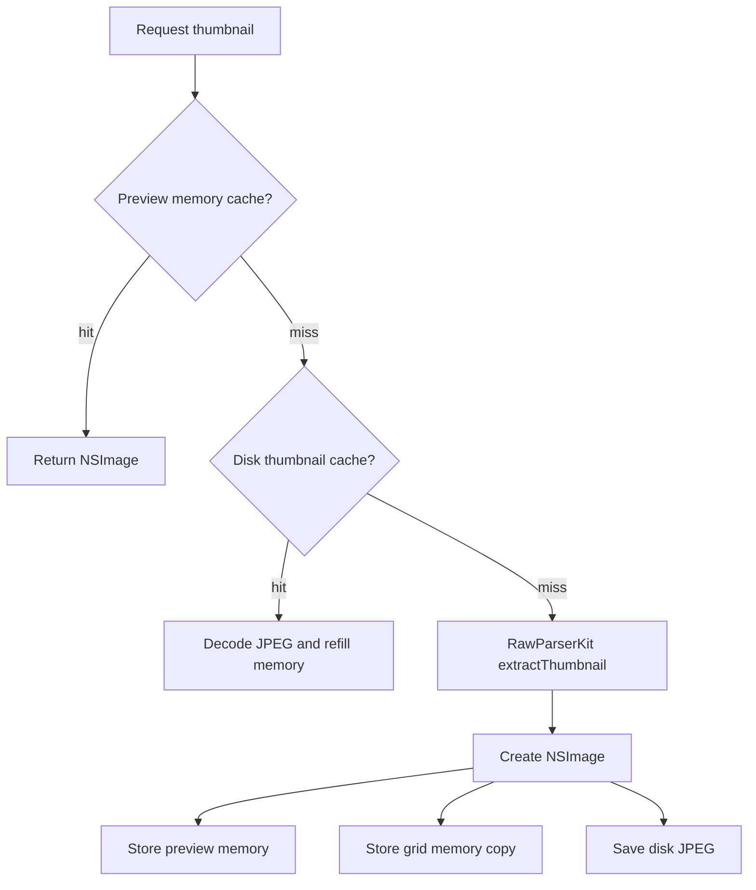

+++
author = "Thomas Evensen"
title = "Memory Cache"
date = "2026-05-19"
weight = 20
tags = ["memory", "cache", "evictions", "thumbnails"]
categories = ["technical details"]
mermaid = true
+++

# Cache System

RawCull uses several caches because RAW decoding is expensive and because different UI surfaces need different image sizes. The normal thumbnail path is layered RAM -> disk -> RAW extraction. The zoom path has its own disk cache for larger embedded JPEGs. Burst analysis has a separate JSON cache for derived analysis data.

## Source Map

| Cache | Main files | Stores |
|---|---|---|
| Preview memory cache | `Actors/SharedMemoryCache.swift`, `Model/Cache/CachedThumbnail.swift` | Larger `NSImage` thumbnails for detail/loupe use |
| Grid memory cache | `Actors/SharedMemoryCache.swift` | Small grid thumbnails, downscaled before insertion |
| Thumbnail disk cache | `Actors/DiskCacheManager.swift` | JPEG thumbnail files under the app cache directory |
| Full-size JPEG disk cache | `Actors/FullSizeJPGDiskCache.swift`, `Model/Handlers/ZoomPreviewHandler.swift` | Larger embedded JPEG previews for zoom |
| Burst analysis cache | `Actors/BurstAnalysisCache.swift` | JSON snapshots of embeddings, scores, groups, rankings, and review state |
| Diagnostics | `Model/Cache/CacheDelegate.swift`, `Model/Cache/CacheStatistics.swift`, `Views/Diagnostics/MemoryDiagnosticsView.swift` | Hit/miss/eviction/pressure counters |

## Thumbnail Lookup


```mermaid
flowchart TD
    A["Request thumbnail"] --> B{"Preview memory cache?"}
    B -->|"hit"| C["Return NSImage"]
    B -->|"miss"| D{"Disk thumbnail cache?"}
    D -->|"hit"| E["Decode JPEG and refill memory"]
    D -->|"miss"| F["RawParserKit extractThumbnail"]
    F --> G["Create NSImage"]
    G --> H["Store preview memory"]
    G --> I["Store grid memory copy"]
    G --> J["Save disk JPEG"]
```

The same lookup idea is used by preload and on-demand requests. `ScanAndCreateThumbnails` warms the cache after a catalog opens. `ThumbnailLoader` and `RequestThumbnail` resolve individual thumbnails while the user scrolls.

## `CachedThumbnail`

`CachedThumbnail` wraps an immutable `NSImage` and stores its cache cost.

The cost is calculated from image representations:

```text
cost = sum(rep.pixelsWide * rep.pixelsHigh * 4) * 1.1
```

The `4` is `SharedMemoryCache.costPerPixel`, fixed for RGBA. The `1.1` multiplier gives a small overhead buffer for the wrapper and image metadata.

`CachedThumbnail` is `@unchecked Sendable`. The project invariant is: construct the `NSImage` fully before caching it, then treat it as immutable.

The class intentionally does not conform to `NSDiscardableContent`. Earlier versions did, but diagnostics showed `NSCache` discarded entries too aggressively and destroyed the RAM hit rate. Eviction is now controlled by explicit cache limits and memory-pressure handling.

## `SharedMemoryCache`

`SharedMemoryCache` is an actor singleton:

```swift
actor SharedMemoryCache {
    nonisolated static let shared = SharedMemoryCache()
}
```

It is still an actor because it owns configuration, pressure monitoring, disk-cache references, and statistics. Its two `NSCache` objects are marked `nonisolated(unsafe)` because `NSCache` is already thread-safe and the app needs synchronous lookup APIs.

That gives RawCull both:

- actor isolation for mutable app-owned state,
- fast synchronous cache reads for hot thumbnail paths.

## Adaptive Limits

`CacheRecommendationPolicy` chooses cache caps from physical memory, current used memory, user maximums, and memory pressure.

Baseline limits:

| Machine memory | Preview baseline | Grid baseline |
|---|---:|---:|
| 64 GB or more | 8000 MB | 2000 MB |
| 32 GB or more | 4096 MB | 1024 MB |
| Less than 32 GB | 2048 MB | 768 MB |

At normal pressure, RawCull calculates available headroom:

```text
freeMB = physicalMB - usedMB
expandableMB = max(0, freeMB - 3072)
extraBudgetMB = expandableMB * 0.5
previewMB = baselinePreview + extraBudgetMB * 0.65
gridMB = baselineGrid + extraBudgetMB * 0.35
```

Values are rounded up to 256 MB steps and capped by both the machine tier and user settings.

At warning or critical pressure, the policy falls back toward 60 percent of the baseline, again respecting user limits and minimum settings.

## Eviction Tracking

`CacheDelegate` is shared by both `NSCache` instances. It records three counters:

| Counter | Meaning |
|---|---|
| memory evictions | Preview-memory entries evicted |
| grid evictions | Grid-memory entries evicted |
| unknown evictions | A delegated `NSCache` that was neither known cache |

The delegate also calls back into `SharedMemoryCache` to decrement manual cost/count mirrors. This is necessary because `NSCache` does not expose current cost or item count.

For preview-cache evictions, the delegate stores the evicted URL in a recent-eviction ring. If the same URL is requested shortly after and falls back to disk, diagnostics can label that as a boomerang miss: the item was useful, but the cache evicted it too soon.

## Memory Pressure

`SharedMemoryCache` owns a `DispatchSourceMemoryPressure`.

| Kernel event | RawCull response |
|---|---|
| `.normal` | Restore cache configuration from settings/adaptive policy |
| `.warning` | Reduce preview and grid cache cost limits to 60 percent of their current limits |
| `.critical` | Clear both memory caches, reset counters, set preview cache limit to 50 MB until recovery |

The current pressure level is stored behind an `OSAllocatedUnfairLock` and exposed as a synchronous `nonisolated` property. This lets `MemoryViewModel` and diagnostics read pressure state without an actor hop.

## Disk Caches

`DiskCacheManager` stores generated thumbnail JPEGs. It is used by both preload and on-demand thumbnail loading.

`FullSizeJPGDiskCache` stores larger embedded previews for the zoom overlay. It is deliberately separate from the normal thumbnail cache because zoom images are larger and should not compete with grid scrolling for memory.

## Burst Analysis Cache

`BurstAnalysisCache` is not an image cache. It stores analysis artifacts under Application Support:

- Vision feature-print embeddings,
- sharpness scores and saliency info,
- burst groups and boundary evidence,
- ranking results,
- review states.

A snapshot is accepted only when the catalog, file count, file sizes/modification dates, thumbnail size, sharpness signature, similarity signature, schema version, and algorithm version still match.

## What To Check When Changing This Area

- Keep `CachedThumbnail` immutable after insertion.
- Update manual cost/count mirrors whenever adding or removing cache entries.
- Check diagnostics if cache hit rate drops; boomerang misses often point to a limit or pollution problem.
- Do not feed zoom-preview images into the normal thumbnail RAM cache unless you intentionally want them competing with grid thumbnails.
- When changing scoring or burst algorithms, bump signatures/versions so stale burst-analysis cache data is rejected.
