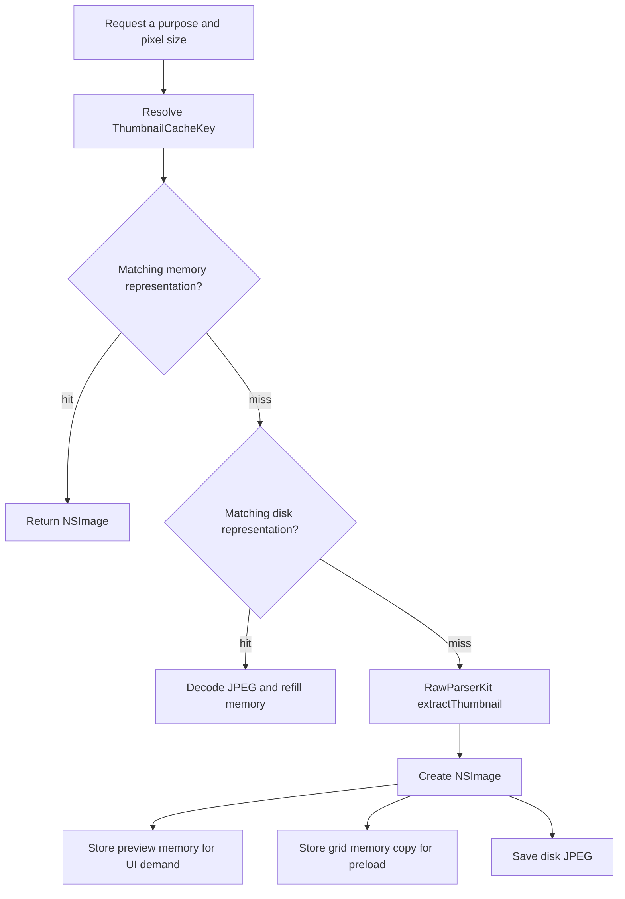

+++
author = "Thomas Evensen"
title = "Memory Cache"
date = "2026-05-19"
lastmod = "2026-08-20"
weight = 20
tags = ["memory", "cache", "evictions", "thumbnails"]
categories = ["technical details"]
mermaid = true
+++

# Cache System

RawCull uses several caches because RAW decoding is expensive and because
different UI surfaces need different representations and lifetimes. The normal
thumbnail path is layered RAM -> disk -> RAW extraction. The zoom path has its
own disk cache for larger embedded JPEGs. Similarity has reusable per-file
artifacts plus a separate catalog-wide burst snapshot. These layers must not
share keys merely because they originate from the same RAW file.

## Source Map

| Cache                         | Main files                                                                                                              | Stores                                                                             |
| ----------------------------- | ----------------------------------------------------------------------------------------------------------------------- | ---------------------------------------------------------------------------------- |
| Thumbnail identity            | `Model/Cache/ThumbnailCacheKey.swift`                                                                                   | Source fingerprint plus representation purpose, size, orientation, and schema      |
| Preview memory cache          | `Actors/SharedMemoryCache.swift`, `Model/Cache/CachedThumbnail.swift`                                                   | Larger `NSImage` thumbnails admitted by UI demand                                  |
| Grid memory cache             | `Actors/SharedMemoryCache.swift`                                                                                        | Small 200 px thumbnails populated by preload                                       |
| Thumbnail disk cache          | `Actors/DiskCacheManager.swift`                                                                                         | Representation-aware JPEG thumbnail files under the app cache directory            |
| Full-size JPEG disk cache     | `Actors/FullSizeJPGDiskCache.swift`, `Model/Handlers/ZoomPreviewHandler.swift`                                          | Larger embedded JPEG previews for zoom                                             |
| Per-file similarity artifacts | `Actors/PerFileAnalysisArtifactStore.swift`                                                                             | Individually validated Vision/CLIP `SimilarityArtifact` records                    |
| Burst analysis cache          | `Actors/BurstAnalysisCache.swift`                                                                                       | Derived catalog snapshots of artifacts, scores, groups, rankings, and review state |
| Diagnostics                   | `Model/Cache/CacheDelegate.swift`, `Model/Cache/CacheStatistics.swift`, `Views/Diagnostics/MemoryDiagnosticsView.swift` | Hit/miss/eviction/pressure counters                                                |

## Thumbnail Lookup


```mermaid
flowchart TD
    A["Request a purpose and pixel size"] --> Key["Resolve ThumbnailCacheKey"]
    Key --> B{"Matching memory representation?"}
    B -->|"hit"| C["Return NSImage"]
    B -->|"miss"| D{"Matching disk representation?"}
    D -->|"hit"| E["Decode JPEG and refill memory"]
    D -->|"miss"| F["RawParserKit extractThumbnail"]
    F --> G["Create NSImage"]
    G --> H["Store preview memory for UI demand"]
    G --> I["Store grid memory copy for preload"]
    G --> J["Save disk JPEG"]
```

The same lookup order is used by preload and on-demand requests, but admission
differs. `ScanAndCreateThumbnails` warms disk and the 200 px grid cache after a
catalog opens. `ThumbnailLoader` and `RequestThumbnail` resolve UI demand; only
`RequestThumbnail` admits disk or source results into preview RAM.
`ThumbnailPreloadGate` prevents a grid miss from duplicating cold work already
being performed by preload for the active catalog.

## Cache Identity

`ThumbnailCacheKey` is the single identity used by memory lookup, disk lookup,
and exact-key request coalescing. It contains:

- a standardized source URL;
- source byte size and modification date;
- representation purpose (`grid` or `preview`);
- requested pixel size;
- orientation policy;
- thumbnail schema version.

This answers two separate questions: “Are these still the same source bytes?”
and “Is this the representation the caller requested?” A path-only key fails the
first question when a file is replaced in place. A key without purpose or size
fails the second by allowing a small grid image to satisfy a preview request.

If source metadata cannot be resolved, the key initializer returns `nil`. The
image may still be decoded for the caller, but RawCull avoids persistent or
coalesced reuse rather than assigning unsafe identity.
`ThumbnailCacheIdentityTests` covers file replacement, requested-size
separation, purpose separation, orientation policy, and schema participation.

## `CachedThumbnail`

`CachedThumbnail` wraps an immutable `NSImage`, its cache cost, and the
standardized source URL used by eviction diagnostics.

The cost is calculated from image representations:

```text
cost = sum(rep.pixelsWide * rep.pixelsHigh * 4) * 1.1
```

The `4` is `SharedMemoryCache.costPerPixel`, fixed for RGBA. The `1.1`
multiplier gives a small overhead buffer for the wrapper and image metadata.

`CachedThumbnail` is `@unchecked Sendable`. The project invariant is: construct
the `NSImage` fully before caching it, then treat it as immutable.

The class intentionally does not conform to `NSDiscardableContent`. Earlier
versions did, but diagnostics showed `NSCache` discarded entries too
aggressively and destroyed the RAM hit rate. Eviction is now controlled by
explicit cache limits and memory-pressure handling.

## `SharedMemoryCache`

`SharedMemoryCache` is an actor singleton:

```swift
actor SharedMemoryCache {
    nonisolated static let shared = SharedMemoryCache()
}
```

It is still an actor because it owns configuration, pressure monitoring,
disk-cache references, and statistics. Its two `NSCache` objects are marked
`nonisolated(unsafe)` because `NSCache` is already thread-safe and the app needs
synchronous lookup APIs.

That gives RawCull both:

- actor isolation for mutable app-owned state,
- fast synchronous cache reads for hot thumbnail paths.

Both memory caches are keyed by the complete `ThumbnailCacheKey`. The preview
and grid APIs remain separate even though they use the same identity type,
making admission policy visible at the call site.

## Adaptive Limits

`CacheRecommendationPolicy` chooses cache caps from physical memory, current
used memory, user maximums, and memory pressure.

Baseline limits:

| Machine memory  | Preview baseline | Grid baseline |
| --------------- | ---------------: | ------------: |
| 64 GB or more   |          8000 MB |       2000 MB |
| 32 GB or more   |          4096 MB |       1024 MB |
| Less than 32 GB |          2048 MB |        768 MB |

At normal pressure, RawCull calculates available headroom:

```text
freeMB = physicalMB - usedMB
expandableMB = max(0, freeMB - 3072)
extraBudgetMB = expandableMB * 0.5
previewMB = baselinePreview + extraBudgetMB * 0.65
gridMB = baselineGrid + extraBudgetMB * 0.35
```

Values are rounded up to 256 MB steps and capped by both the machine tier and
user settings.

At warning or critical pressure, the policy falls back toward 60 percent of the
baseline, again respecting user limits and minimum settings.

## Eviction Tracking

`CacheDelegate` is shared by both `NSCache` instances. It records three
counters:

| Counter           | Meaning                                            |
| ----------------- | -------------------------------------------------- |
| memory evictions  | Preview-memory entries evicted                     |
| grid evictions    | Grid-memory entries evicted                        |
| unknown evictions | A delegated `NSCache` that was neither known cache |

The delegate also calls back into `SharedMemoryCache` to decrement manual
cost/count mirrors. This is necessary because `NSCache` does not expose current
cost or item count.

For preview-cache evictions, the delegate stores the evicted URL in a
recent-eviction ring. If the same URL is requested shortly after and falls back
to disk, diagnostics can label that as a boomerang miss: the item was useful,
but the cache evicted it too soon.

## Memory Pressure

`SharedMemoryCache` owns a `DispatchSourceMemoryPressure`.

| Kernel event | RawCull response                                                                          |
| ------------ | ----------------------------------------------------------------------------------------- |
| `.normal`    | Restore cache configuration from settings/adaptive policy                                 |
| `.warning`   | Reduce preview and grid cache cost limits to 60 percent of their current limits           |
| `.critical`  | Clear both memory caches, reset counters, set preview cache limit to 50 MB until recovery |

The current pressure level is stored behind an `OSAllocatedUnfairLock` and
exposed as a synchronous `nonisolated` property. This lets `MemoryViewModel` and
diagnostics read pressure state without an actor hop.

## Disk Caches

`DiskCacheManager` stores generated quality-0.7 thumbnail JPEGs in a
schema-specific directory. Its filename is an MD5 hash of the complete cache
identifier. MD5 is a fixed-width filesystem key here, not a security primitive.
A corrupt JPEG is removed and treated as a cache miss, and writes are atomic.
Callers encode to Sendable `Data` before crossing the actor/task boundary.

`FullSizeJPGDiskCache` stores larger embedded previews for the zoom overlay. It
is deliberately separate from the normal thumbnail cache because zoom images are
larger and should not compete with grid scrolling for memory.

## Similarity And Burst Analysis Caches

Similarity persistence has two levels under Application Support:

| Level                   | Owner                          | Reuse unit                                    |
| ----------------------- | ------------------------------ | --------------------------------------------- |
| Per-file artifact store | `PerFileAnalysisArtifactStore` | One source fingerprint and backend descriptor |
| Burst analysis snapshot | `BurstAnalysisCache`           | One compatible catalog analysis context       |

The per-file store lets RawCull reuse valid `SimilarityArtifact` values when a
catalog-wide snapshot is stale or incomplete. Records include their own schema,
source identity, backend/model descriptor, and pipeline signature. Invalid
records are ignored or removed individually.

`BurstAnalysisCache` is not an image cache. Its current schema is 9. It stores:

- typed Vision or CLIP similarity artifacts,
- sharpness scores and saliency info,
- burst groups and boundary evidence,
- ranking results,
- review states,
- a digest of the descriptor-and-payload artifact set.

A snapshot is accepted only when the catalog, file count, every file's
size/modification date, thumbnail size, sharpness descriptor, grouping
configuration, backend and artifact descriptors, artifact schema, pipeline
version, artifact digest, cache schema, and grouping algorithm version still
match. File UUIDs are remapped by path after a new scan. A legacy schema may
supply migration candidates, but it is not accepted as a current snapshot.

## What To Check When Changing This Area

- Keep `CachedThumbnail` immutable after insertion.
- Use `ThumbnailCacheKey` consistently for RAM, disk, and in-flight coalescing;
  never fall back to path-only reuse.
- Keep grid and preview purposes separate and bump the thumbnail schema when
  representation semantics change.
- Update manual cost/count mirrors whenever adding or removing cache entries.
- Check diagnostics if cache hit rate drops; boomerang misses often point to a
  limit or pollution problem.
- Do not feed zoom-preview images into the normal thumbnail RAM cache unless you
  intentionally want them competing with grid thumbnails.
- Keep per-file AI artifact persistence separate from the catalog-wide derived
  snapshot.
- When changing scoring, similarity, or burst algorithms, update descriptors,
  signatures, digests, and schema/algorithm versions so stale analysis data is
  rejected.
