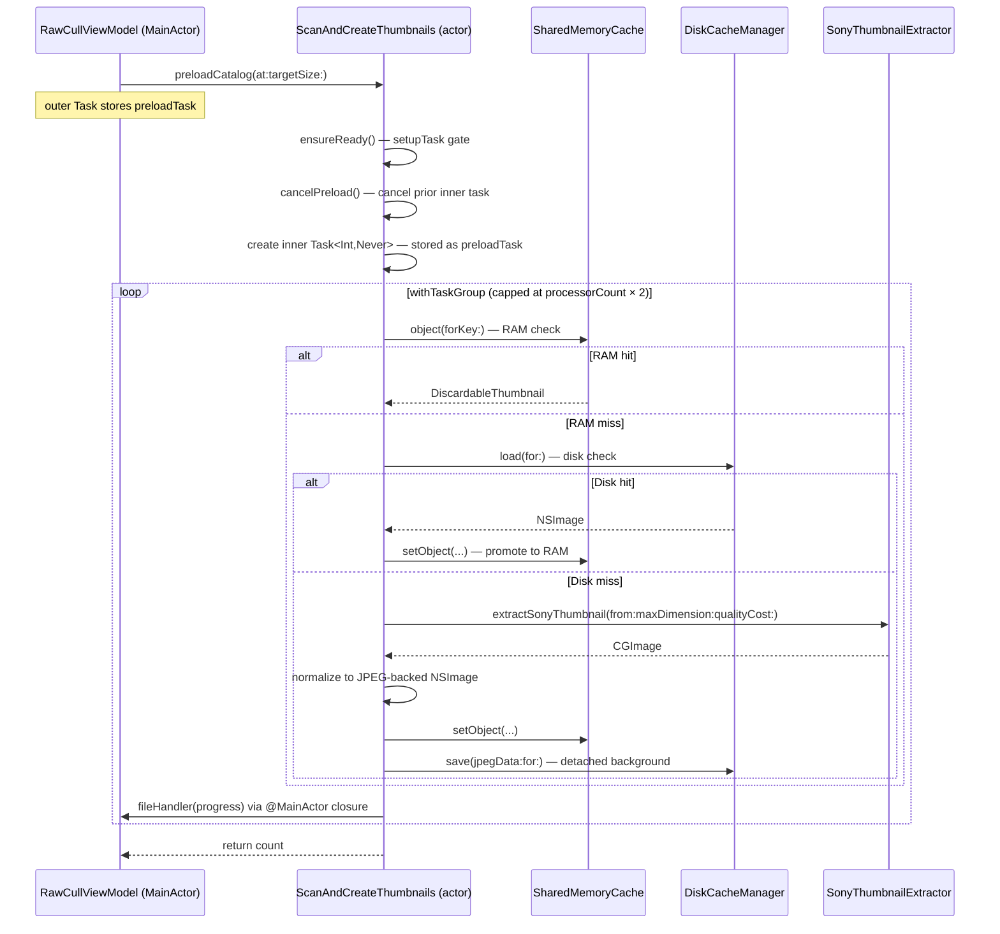
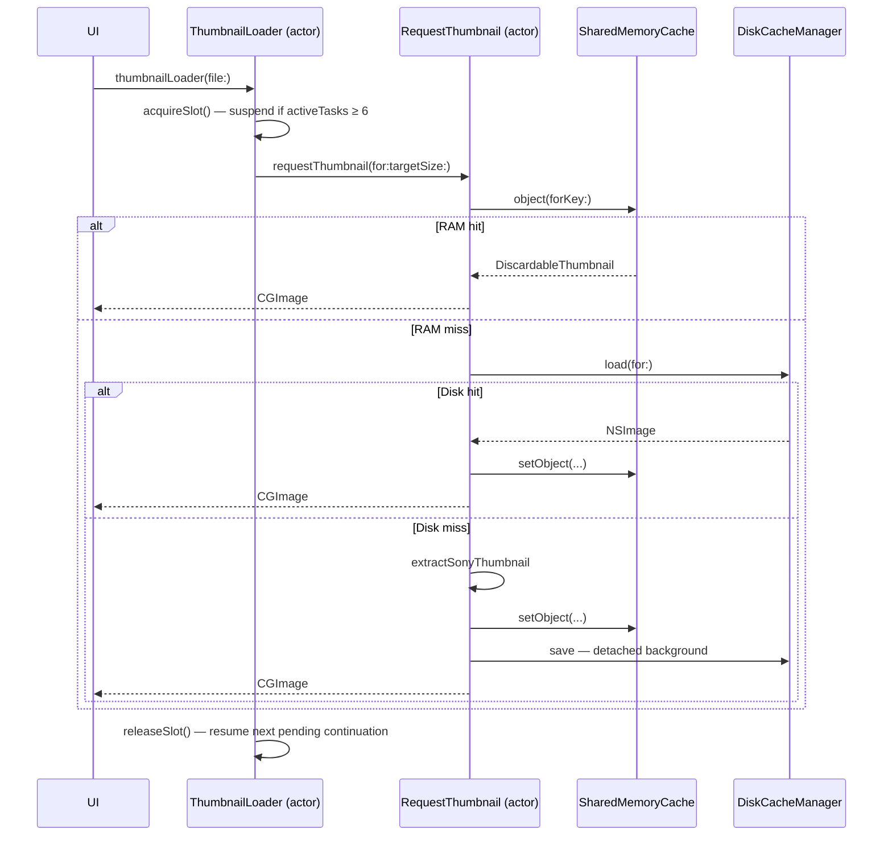

+++
author = "Thomas Evensen"
title = "Concurrency model"
date = "2026-03-17"
tags = ["concurrency"]
categories = ["technical details"]
mermaid = true
+++

# Concurrency Model — RawCull

> **Files covered:**
> - `RawCull/Model/ViewModels/RawCullViewModel.swift`
> - `RawCull/Views/RawCullSidebarMainView/extension+RawCullView.swift`
> - `RawCull/Actors/ScanFiles.swift`
> - `RawCull/Actors/ScanAndCreateThumbnails.swift`
> - `RawCull/Actors/ExtractAndSaveJPGs.swift`
> - `RawCull/Actors/ThumbnailLoader.swift`
> - `RawCull/Actors/RequestThumbnail.swift`
> - `RawCull/Actors/SharedMemoryCache.swift`
> - `RawCull/Actors/DiskCacheManager.swift`
> - `RawCull/Actors/SaveJPGImage.swift`
> - `RawCull/Enum/SonyThumbnailExtractor.swift`
> - `RawCull/Enum/JPGSonyARWExtractor.swift`

---

## Overview

RawCull uses Swift structured concurrency (`async`/`await`, `Task`, `TaskGroup`, and `actor`) across four primary flows:

| Flow | Entry point | Core actor(s) | Purpose |
|---|---|---|---|
| Catalog scan | `RawCullViewModel.handleSourceChange(url:)` | `ScanFiles` | Scan ARW files, extract metadata, load focus points |
| Thumbnail preload | `RawCullViewModel.handleSourceChange(url:)` | `ScanAndCreateThumbnails` | Bulk-populate the thumbnail cache for a selected catalog |
| JPG extraction | `extension+RawCullView.extractAllJPGS()` | `ExtractAndSaveJPGs` | Extract embedded JPEG previews and save to disk |
| On-demand thumbnails | UI grid + detail views | `ThumbnailLoader`, `RequestThumbnail` | Rate-limited, cached per-file thumbnail retrieval |

The two long-running operations (thumbnail preload and JPG extraction) share a **two-level task pattern**:

1. An **outer `Task`** created from the `ViewModel` or `View` layer.
2. An **inner `Task`** stored inside the actor, which owns the real work and cancellation handle.

This split keeps UI responsive: `handleSourceChange` is `@MainActor` but `async` — when it `await`s the outer `Task`, the main actor is free to handle other work while the task's body runs on the `ScanAndCreateThumbnails` actor. The inner task runs heavy I/O and image work on actor and cooperative thread-pool queues. Cancellation requires calling both levels.

---

## 1. Catalog Scan — `ScanFiles`

### 1.1 Entry point

`RawCullViewModel.handleSourceChange(url:)` is `@MainActor` and is called whenever the user selects a new catalog. It triggers the scan before any thumbnail work starts.

### 1.2 Scan flow

`ScanFiles.scanFiles(url:onProgress:)` runs on the `ScanFiles` actor:

1. Opens the directory with security-scoped resource access.
2. Uses `withTaskGroup` to process all ARW files in parallel.
3. For each file, a task reads `URLResourceValues` (name, size, content type, modification date) and calls `extractExifData(from:)`.
4. After the group finishes, resolves focus points via a two-stage fallback:
   - **Native extraction first**: `extractNativeFocusPoints(from:)` runs a `withTaskGroup` over all `FileItem`s, calling `SonyMakerNoteParser.focusLocation(from:)` on each ARW file.
   - **JSON fallback**: if native extraction yields no results, `decodeFocusPointsJSON(from:)` reads `focuspoints.json` synchronously from the same directory.
5. Returns `[FileItem]`.

`extractExifData(from:)` reads EXIF data via `CGImageSourceCopyPropertiesAtIndex` and formats:
- Shutter speed (e.g., `"1/1000"` or `"2.5s"`)
- Focal length (e.g., `"50.0mm"`)
- Aperture (e.g., `"ƒ/2.8"`)
- ISO (e.g., `"ISO 400"`)
- Camera model (from TIFF dictionary)
- Lens model (from EXIF dictionary)

`RawCullViewModel` then calls `ScanFiles.sortFiles(_:by:searchText:)` (`@concurrent nonisolated`, runs on the cooperative thread pool), updates `files` and `filteredFiles` on the main actor, and maps decoded focus points to `FocusPointsModel` objects.

---

## 2. Thumbnail Preload — `ScanAndCreateThumbnails`

### 2.1 How the task starts

`RawCullViewModel.handleSourceChange(url:)` is the entry point (`@MainActor`).

Step-by-step:

1. **Skip duplicates**: `processedURLs: Set<URL>` prevents re-processing a catalog URL already handled in this session.
2. **Fetch settings**: `SettingsViewModel.shared.asyncgetsettings()` provides `thumbnailSizePreview` and `thumbnailCostPerPixel`.
3. **Build handlers**: `CreateFileHandlers().createFileHandlers(...)` wires up four `@MainActor @Sendable` closures:
   - `fileHandler(Int)` — progress count
   - `maxfilesHandler(Int)` — total file count
   - `estimatedTimeHandler(Int)` — ETA in seconds
   - `memorypressurewarning(Bool)` — memory pressure state for UI
4. **Create actor**: `ScanAndCreateThumbnails()` is instantiated and handlers injected.
5. **Store actor reference**: `currentScanAndCreateThumbnailsActor` is set so `abort()` can reach it.
6. **Create outer Task** on the ViewModel:

```swift
preloadTask = Task {
    await scanAndCreateThumbnails.preloadCatalog(
        at: url,
        targetSize: thumbnailSizePreview
    )
}
await preloadTask?.value
```

The `await` suspends `handleSourceChange` (freeing the main actor while the preload runs on the `ScanAndCreateThumbnails` actor) until the preload finishes or is cancelled.

### 2.2 Inside the actor

`preloadCatalog(at:targetSize:)` runs on the `ScanAndCreateThumbnails` actor:

1. **One-time setup**: `ensureReady()` calls `SharedMemoryCache.shared.ensureReady()` and fetches settings via a `setupTask` gate (preventing duplicate initialization from concurrent callers).
2. **Cancel prior work**: `cancelPreload()` cancels and nils any existing inner task.
3. **Discover files**: Enumerate ARW files non-recursively via `DiscoverFiles`.
4. **Notify max**: `fileHandlers?.maxfilesHandler(files.count)` updates the progress bar maximum.
5. **Create inner `Task<Int, Never>`**: stored as `preloadTask` on the actor.
6. **Bounded `withTaskGroup`**: caps parallelism at `ProcessInfo.processInfo.activeProcessorCount * 2` using index-based back-pressure and per-iteration cancellation checks:

```swift
for (index, url) in urls.enumerated() {
    if Task.isCancelled {
        group.cancelAll()
        break
    }
    if index >= maxConcurrent {
        await group.next()
    }
    group.addTask {
        await self.processSingleFile(url, targetSize: targetSize, itemIndex: index)
    }
}
await group.waitForAll()
```

### 2.3 Per-file processing and cancellation points

`processSingleFile(_:targetSize:itemIndex:)` follows the three-tier cache lookup and checks `Task.isCancelled` at every expensive step:

| Step | Cancellation check | Action on cancel |
|---|---|---|
| Before RAM lookup | `Task.isCancelled` | Return immediately |
| After RAM hit confirmed | `Task.isCancelled` | Skip remaining work |
| Before disk lookup | `Task.isCancelled` | Return immediately |
| Before source extraction | `Task.isCancelled` | Return immediately |
| After extraction completes | `Task.isCancelled` | Skip caching and disk write |

**On extraction success**:
1. Call `cgImageToNormalizedNSImage(_:)` — converts `CGImage` to an `NSImage` backed by a single JPEG representation (quality 0.7). This normalization ensures memory and disk representations are consistent.
2. `storeInMemoryCache(_:for:)` — creates `DiscardableThumbnail` with pixel-accurate cost and stores in `SharedMemoryCache`.
3. Encode `jpegData` and call `diskCache.save(_:for:)` — this is a detached background task. The closure captures `diskCache` directly to avoid retaining the actor.

### 2.4 Request coalescing

`ScanAndCreateThumbnails.thumbnail(for:targetSize:)` exposes an async lookup for direct per-file requests. It calls `resolveImage(for:targetSize:)`, which adds in-flight task coalescing via `inflightTasks: [URL: Task<CGImage, Error>]`:

1. Check RAM cache.
2. Check disk cache.
3. If `inflightTasks[url]` exists, `await` it — multiple callers share the same work.
4. Otherwise, create a new unstructured `Task` inside the actor, store it in `inflightTasks`, extract and cache the thumbnail, then remove the entry when done.

This prevents duplicate extraction work when multiple UI elements request the same file simultaneously.

---

## 3. JPG Extraction — `ExtractAndSaveJPGs`

### 3.1 How the task starts

`extension+RawCullView.extractAllJPGS()` creates an unstructured outer task from the View layer:

```swift
Task {
    viewModel.creatingthumbnails = true

    let handlers = CreateFileHandlers().createFileHandlers(
        fileHandler: viewModel.fileHandler,
        maxfilesHandler: viewModel.maxfilesHandler,
        estimatedTimeHandler: viewModel.estimatedTimeHandler,
        memorypressurewarning: { _ in },
    )

    let extract = ExtractAndSaveJPGs()
    await extract.setFileHandlers(handlers)
    viewModel.currentExtractAndSaveJPGsActor = extract

    guard let url = viewModel.selectedSource?.url else { return }
    await extract.extractAndSaveAlljpgs(from: url)

    viewModel.currentExtractAndSaveJPGsActor = nil
    viewModel.creatingthumbnails = false
}
```

Unlike the preload flow, the outer task is not stored on the ViewModel. Cancellation is driven entirely through the actor reference via `viewModel.abort()`.

### 3.2 Inside the actor

`extractAndSaveAlljpgs(from:)` mirrors the preload pattern exactly:

1. Cancel any previous inner task via `cancelExtractJPGSTask()`.
2. Discover all ARW files (non-recursive).
3. Create a `Task<Int, Never>` stored as `extractJPEGSTask`.
4. Use `withThrowingTaskGroup` with `activeProcessorCount * 2` concurrency cap and the same index-based back-pressure pattern as `ScanAndCreateThumbnails` (cancellation check + `group.cancelAll()`, index guard before `group.next()`, `group.waitForAll()` to drain).
5. Call `processSingleExtraction(_:itemIndex:)` per file.

`processSingleExtraction` checks cancellation before and after `JPGSonyARWExtractor.jpgSonyARWExtractor(from:fullSize:)`, then writes the result via `SaveJPGImage().save(image:originalURL:)`.

`SaveJPGImage.save` is `@concurrent nonisolated` and runs on the cooperative thread pool. It:
- Replaces the `.arw` extension with `.jpg`
- Uses `CGImageDestinationCreateWithURL` with JPEG quality `1.0`
- Logs success/failure with image dimensions and file paths

---

## 4. Rate-Limited On-Demand Loading

### 4.1 ThumbnailLoader

`ThumbnailLoader` is a shared actor that enforces a maximum of 6 concurrent thumbnail loads. Excess requests suspend via `CheckedContinuation` and are queued:

```swift
actor ThumbnailLoader {
    static let shared = ThumbnailLoader()
    private let maxConcurrent = 6
    private var activeTasks = 0
    private var pendingContinuations: [(id: UUID, continuation: CheckedContinuation<Void, Never>)] = []
}
```

**`acquireSlot()` flow**:
1. If `activeTasks < maxConcurrent`: increment `activeTasks`, return immediately.
2. Otherwise: call `withCheckedContinuation { continuation in ... }` — this suspends the caller.
3. A cancellation handler is registered to remove the pending continuation by ID so it is never resumed after cancellation.

**`releaseSlot()` flow**:
1. Decrement `activeTasks`.
2. If `pendingContinuations` is non-empty, pop the first and `resume()` it.

**`thumbnailLoader(file:)` flow**:

```swift
func thumbnailLoader(file: FileItem) async -> NSImage? {
    await acquireSlot()
    defer { releaseSlot() }
    guard !Task.isCancelled else { return nil }
    let settings = await getSettings()
    let cgThumb = await RequestThumbnail().requestThumbnail(
        for: file.url,
        targetSize: settings.thumbnailSizePreview
    )
    guard !Task.isCancelled else { return nil }
    if let cgThumb {
        return NSImage(cgImage: cgThumb, size: .zero)
    }
    return nil
}
```

Settings are cached on the actor to avoid repeated `SettingsViewModel` calls. The result is wrapped as `NSImage(cgImage:size:.zero)` before returning to the caller.

### 4.2 RequestThumbnail

`RequestThumbnail` handles the per-file cache resolution path for the on-demand flow:

1. `ensureReady()` — same `setupTask` gate pattern as `ScanAndCreateThumbnails`.
2. RAM cache lookup via `SharedMemoryCache.object(forKey:)`; on hit, calls `SharedMemoryCache.updateCacheMemory()` for statistics.
3. Disk cache lookup via `DiskCacheManager.load(for:)`; on hit, calls `SharedMemoryCache.updateCacheDisk()` for statistics.
4. Extraction fallback: `SonyThumbnailExtractor.extractSonyThumbnail(from:maxDimension:qualityCost:)`.
5. Store in RAM cache via `storeInMemory(_:for:)`.
6. Schedule disk save via a detached background task.

`requestThumbnail(for:targetSize:)` returns `CGImage?` for direct use by SwiftUI views. All errors are caught and logged; the method returns `nil` on failure.

`nsImageToCGImage(_:)` is `async` and tries `cgImage(forProposedRect:)` first; if that fails, it falls back to a TIFF round-trip on a `Task.detached(priority: .utility)` task to avoid blocking the actor with CPU-bound work.

---

## 5. Task Ownership and Handles

| Layer | Owner | Handle name | Type |
|---|---|---|---|
| Outer task (preload) | `RawCullViewModel` | `preloadTask` | `Task<Void, Never>?` |
| Inner task (preload) | `ScanAndCreateThumbnails` | `preloadTask` | `Task<Int, Never>?` |
| Outer task (extract) | View (`extractAllJPGS`) | not stored | `Task<Void, Never>` |
| Inner task (extract) | `ExtractAndSaveJPGs` | `extractJPEGSTask` | `Task<Int, Never>?` |
| Slot queue (on-demand) | `ThumbnailLoader.shared` | `pendingContinuations` | `[(UUID, CheckedContinuation)]` |

---

## 6. Cancellation

### 6.1 `abort()`

`RawCullViewModel.abort()` is the single cancellation entry point for user-initiated stops:

```swift
func abort() {
    preloadTask?.cancel()
    preloadTask = nil

    if let actor = currentScanAndCreateThumbnailsActor {
        Task { await actor.cancelPreload() }
    }
    currentScanAndCreateThumbnailsActor = nil

    if let actor = currentExtractAndSaveJPGsActor {
        Task { await actor.cancelExtractJPGSTask() }
    }
    currentExtractAndSaveJPGsActor = nil

    creatingthumbnails = false
}
```

### 6.2 Why both levels matter

Cancelling the outer `Task` propagates into child structured tasks, but does **not** automatically cancel the actor's inner `Task`. The inner task is unstructured (`Task { ... }` created inside the actor) — it is not a child of the outer task. The actor-specific cancel methods (`cancelPreload`, `cancelExtractJPGSTask`) must be explicitly called to cancel the inner task and allow the `withTaskGroup` to unwind.

### 6.3 `ThumbnailLoader.cancelAll()`

`cancelAll()` resumes all pending continuations immediately, unblocking any tasks waiting for a slot. This is called during teardown to prevent suspension leaks.

---

## 7. ETA Estimation

Both long-running actors compute a rolling ETA estimate:

**Algorithm**:
1. Record a timestamp before each file starts processing.
2. After completion, compute `delta = now - lastItemTime`.
3. Append `delta` to `processingTimes` array.
4. Keep only the **last 10 items** in the array.
5. After collecting `minimumSamplesBeforeEstimation` (10) items, calculate:

```
avgTime = sum(processingTimes) / processingTimes.count
remaining = (totalFiles - itemsProcessed) * avgTime
```

6. Only update the displayed ETA if `remaining < lastEstimatedSeconds` — this prevents the counter from jumping upward when a slow file takes longer than expected.

| Actor | Minimum samples threshold |
|---|---|
| `ScanAndCreateThumbnails` | `minimumSamplesBeforeEstimation = 10` |
| `ExtractAndSaveJPGs` | `estimationStartIndex = 10` |

---

## 8. Actor Isolation and Thread Safety

| Component | Isolation strategy |
|---|---|
| `ScanAndCreateThumbnails`, `ExtractAndSaveJPGs`, `ScanFiles` | All mutable state is actor-isolated; mutations only through actor methods |
| `SharedMemoryCache` | `nonisolated(unsafe)` for `NSCache` (thread-safe by design); all statistics and config remain actor-isolated |
| `DiskCacheManager` | Actor-isolates path calculation and coordination; actual file I/O runs in detached tasks |
| `ThumbnailLoader` | Actor-isolated slot counter and continuation queue |
| `DiscardableThumbnail` | `@unchecked Sendable` with `OSAllocatedUnfairLock` protecting `(isDiscarded, accessCount)` |
| `CacheDelegate` | `@unchecked Sendable` — `willEvictObject` is called synchronously by `NSCache`; increments are dispatched to an isolated `EvictionCounter` actor |
| `RawCullViewModel` | `@MainActor` — all UI state updates serialized on the main thread |
| `SonyThumbnailExtractor`, `JPGSonyARWExtractor` | `nonisolated` static methods dispatched to global GCD queues to prevent actor starvation |
| `SaveJPGImage` | `actor` with a single `@concurrent nonisolated` method — runs on the cooperative thread pool, not the actor's executor |

CPU-bound ImageIO and disk I/O work runs off-actor to keep the main thread and actor queues responsive.

---

## 9. Flow Diagrams

### Thumbnail Preload — Two-Level Task Pattern



### On-Demand Request



---

## 10. Settings Reference

| Setting | Default | Effect |
|---|---|---|
| `memoryCacheSizeMB` | 5000 | Sets `NSCache.totalCostLimit` |
| `thumbnailCostPerPixel` | 4 | Cost per pixel in `DiscardableThumbnail` |
| `thumbnailSizePreview` | 1024 | Target size for bulk preload and on-demand loading via `ThumbnailLoader` |
| `thumbnailSizeGrid` | 100 | Grid thumbnail size |
| `thumbnailSizeGridView` | 400 | Grid View thumbnail size |
| `thumbnailSizeFullSize` | 8700 | Full-size zoom path upper bound |
| `useThumbnailAsZoomPreview` | false | Use cached thumbnail instead of re-extracting for zoom |
