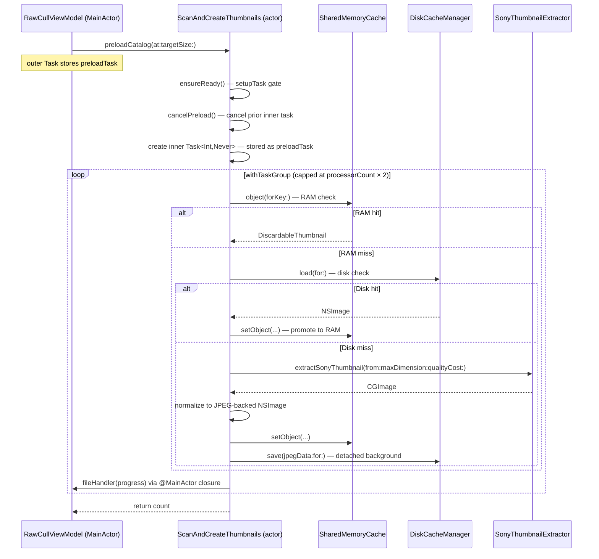
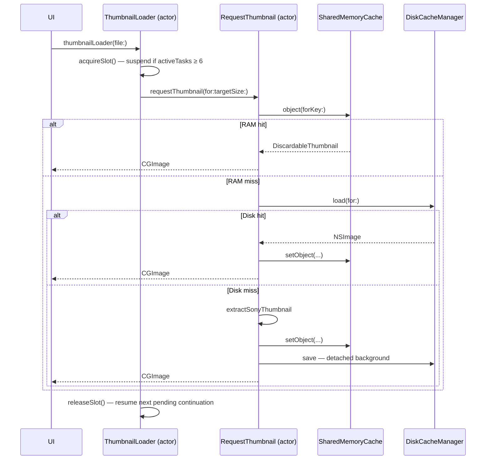

+++
author = "Thomas Evensen"
title = "Concurrency"
date = "2026-04-11"
tags = ["concurrency"]
categories = ["technical details"]
mermaid = true
+++

# Concurrency — RawCull

> **Source files covered:**
> `Actors/ScanFiles.swift` · `Actors/ScanAndCreateThumbnails.swift` · `Actors/ExtractAndSaveJPGs.swift`
> `Actors/ThumbnailLoader.swift` · `Actors/RequestThumbnail.swift` · `Actors/SharedMemoryCache.swift`
> `Actors/DiskCacheManager.swift` · `Actors/SaveJPGImage.swift` · `Actors/DiscoverFiles.swift`
> `Actors/ActorCreateOutputforView.swift` · `Model/ViewModels/RawCullViewModel.swift`
> `Model/ViewModels/SharpnessScoringModel.swift` · `Model/ViewModels/SettingsViewModel.swift`
> `Model/ParametersRsync/ExecuteCopyFiles.swift` · `Model/Cache/CacheDelegate.swift`
> `Enum/SonyThumbnailExtractor.swift` · `Enum/JPGSonyARWExtractor.swift`
> `Views/RawCullSidebarMainView/extension+RawCullView.swift`

---

## 1. Why Concurrency Matters

RawCull works with Sony A1 ARW raw files. A single RAW file from the A1 can be 50–80 MB. When you open a folder with hundreds of shots, the app must scan metadata, extract embedded JPEG previews, decode thumbnails, and manage a multi-gigabyte in-memory cache — all while keeping the UI fluid and responsive. Without concurrency that would be impossible.

RawCull is written in Swift 6 with strict concurrency checking enabled. The compiler verifies thread safety at compile time: every type that crosses a concurrency boundary must be `Sendable`, and every mutable shared state must be isolated to an actor. The project makes heavy use of Swift's structured concurrency model: actors, async/await, task groups, and the MainActor.

> **Swift 6 strict concurrency:** Data-race warnings become hard compiler errors. The patterns in this document — Sendable encoding, actor isolation, `nonisolated(unsafe)` for externally thread-safe types — are not style choices; they are required for the code to compile.

---

## 2. Foundations

### 2.1 async / await

`async`/`await` is the cornerstone of Swift's structured concurrency model. An async function can suspend itself — yielding the underlying thread to other work — then resume where it left off when the result is ready. Unlike GCD callbacks, the code reads top-to-bottom like ordinary synchronous code.

```swift
// A normal synchronous function — blocks the calling thread the entire time
func loadImageBlocking(url: URL) -> NSImage? { ... }

// An async function — suspends while waiting; doesn't block any thread
func loadImageAsync(url: URL) async -> NSImage? {
    let data = await fetchDataFromDisk(url: url)  // pause; let other work run
    return NSImage(data: data)
}
```

In RawCull, virtually every file-loading, cache-lookup, and thumbnail-generation operation is `async`. This keeps the main thread — and therefore the UI — always free.

### 2.2 Actors — Isolated Mutable State

An actor is a reference type (like a class) that protects its mutable state with automatic mutual exclusion. Only one caller can execute inside an actor at a time; the Swift runtime enforces isolation. If you try to read an actor's property from outside without `await`, the compiler refuses to compile.

**The rule in one sentence:** Every stored property of an actor is only readable and writable from within that actor's own methods. All other callers must `await` a method call to hop onto the actor.

RawCull defines ten actors:

| Actor | File | Responsibility |
|---|---|---|
| `ScanFiles` | `Actors/ScanFiles.swift` | Scans a folder for ARW files, reads EXIF, extracts focus points |
| `ScanAndCreateThumbnails` | `Actors/ScanAndCreateThumbnails.swift` | Bulk thumbnail creation with bounded concurrent task group |
| `RequestThumbnail` | `Actors/RequestThumbnail.swift` | On-demand thumbnail resolver (RAM → disk → extract) |
| `ThumbnailLoader` | `Actors/ThumbnailLoader.swift` | Rate-limits concurrent thumbnail requests using continuations |
| `DiskCacheManager` | `Actors/DiskCacheManager.swift` | Reads and writes JPEG thumbnails to/from the on-disk cache |
| `SharedMemoryCache` | `Actors/SharedMemoryCache.swift` | Singleton wrapping NSCache; manages memory pressure and config |
| `ExtractAndSaveJPGs` | `Actors/ExtractAndSaveJPGs.swift` | Extracts full-resolution JPEGs from ARW files in parallel |
| `SaveJPGImage` | `Actors/SaveJPGImage.swift` | Encodes and writes a single JPEG to disk |
| `DiscoverFiles` | `Actors/DiscoverFiles.swift` | Enumerates `.arw` files in a directory (optionally recursive) |
| `EvictionCounter` | `Model/Cache/CacheDelegate.swift` | Private actor that safely tracks NSCache eviction counts |

> **Note:** `ActorCreateOutputforView` in `Actors/ActorCreateOutputforView.swift` is named like an actor but is a plain `struct`. Its method is `@concurrent nonisolated` — see §2.5.

`DiscoverFiles` shows the minimal actor pattern with `@concurrent nonisolated`:

```swift
// From Actors/DiscoverFiles.swift
actor DiscoverFiles {

    // @concurrent tells Swift: run this method on the cooperative thread pool,
    // not on the actor's serial queue. Safe because the method only uses
    // local variables — no actor state is touched.
    @concurrent
    nonisolated func discoverFiles(at catalogURL: URL, recursive: Bool) async -> [URL] {
        await Task {
            let supported: Set<String> = [SupportedFileType.arw.rawValue]
            let fileManager = FileManager.default
            var urls: [URL] = []
            guard let enumerator = fileManager.enumerator(
                at: catalogURL,
                includingPropertiesForKeys: [.isRegularFileKey],
                options: recursive ? [] : [.skipsSubdirectoryDescendants]
            ) else { return urls }
            while let fileURL = enumerator.nextObject() as? URL {
                if supported.contains(fileURL.pathExtension.lowercased()) {
                    urls.append(fileURL)
                }
            }
            return urls
        }.value
    }
}
```

### 2.3 @MainActor — Protecting the UI Thread

The main thread in a macOS app is special: all UI rendering must happen there. Swift's `@MainActor` annotation is a global actor that ensures annotated code runs exclusively on the main thread. This replaces `DispatchQueue.main.async { ... }` with something the compiler can verify.

RawCull has four `@Observable @MainActor` ViewModel classes:

| Class | File | Role |
|---|---|---|
| `RawCullViewModel` | `Model/ViewModels/RawCullViewModel.swift` | Primary app state; drives file list, scanning, cancellation |
| `SharpnessScoringModel` | `Model/ViewModels/SharpnessScoringModel.swift` | Sharpness scores, saliency, aperture filters |
| `GridThumbnailViewModel` | `Model/ViewModels/GridThumbnailViewModel.swift` | Grid-level thumbnail state |
| `ExecuteCopyFiles` | `Model/ParametersRsync/ExecuteCopyFiles.swift` | rsync copy process state and progress |

`RawCullViewModel` is the canonical example: the entire class lives on `@MainActor`, but its `async` methods can still suspend and let the main thread process other events while waiting for actor work to complete.

```swift
// From Model/ViewModels/RawCullViewModel.swift

@Observable @MainActor
final class RawCullViewModel {

    var files: [FileItem] = []
    var filteredFiles: [FileItem] = []
    var creatingthumbnails: Bool = false

    func handleSourceChange(url: URL) async {
        scanning = true
        let scan = ScanFiles()
        files = await scan.scanFiles(url: url)  // suspends; main thread stays free
        // Back on main thread here — safe to update UI
        scanning = false
    }
}
```

When `handleSourceChange` calls `await scan.scanFiles(...)`, the main thread suspends (it is **not** blocked — it continues to process other UI events). When the scan is done, Swift automatically resumes on the main thread before assigning to `files`.

#### Crossing the boundary with MainActor.run

Actors that need to read `@Observable` (main-thread) properties from a background context use `MainActor.run`:

```swift
// From Model/ViewModels/SettingsViewModel.swift

// nonisolated means this is callable without an actor hop.
// To safely READ the @Observable properties we still need to
// jump to the MainActor for just a moment.
nonisolated func asyncgetsettings() async -> SavedSettings {
    await MainActor.run {               // Hop to main thread, read, return
        SavedSettings(
            memoryCacheSizeMB: self.memoryCacheSizeMB,
            thumbnailSizeGrid: self.thumbnailSizeGrid,
            thumbnailSizePreview: self.thumbnailSizePreview,
            thumbnailSizeFullSize: self.thumbnailSizeFullSize,
            thumbnailCostPerPixel: self.thumbnailCostPerPixel,
            thumbnailSizeGridView: self.thumbnailSizeGridView,
            useThumbnailAsZoomPreview: self.useThumbnailAsZoomPreview
        )
    }   // Back to the calling actor with a Sendable value type
}
```

`SavedSettings` is a plain `Codable` struct (value type) so it is `Sendable` and safe to return across the actor boundary. This is the standard way to safely snapshot `@Observable` (main-thread) properties from background actors.

#### ExecuteCopyFiles — intentional Task.sleep before cleanup

```swift
// From Model/ParametersRsync/ExecuteCopyFiles.swift

@Observable @MainActor
final class ExecuteCopyFiles {

    private func handleProcessTermination(...) async {
        let viewOutput = await ActorCreateOutputforView()
                                .createOutputForView(stringoutputfromrsync)
        let result = CopyDataResult(output: stringoutputfromrsync,
                                    viewOutput: viewOutput,
                                    linesCount: stringoutputfromrsync?.count ?? 0)
        onCompletion?(result)

        // Ensure the completion handler finishes before releasing resources.
        try? await Task.sleep(for: .milliseconds(10))
        cleanup()
    }
}
```

> **Why the sleep?** The brief `Task.sleep` before `cleanup()` is an intentional concurrency fix. Without it there was a race: the security-scoped resource access could be released before the `onCompletion` callback had finished using it.

### 2.4 Sendable — Type-Safety Across Boundaries

A `Sendable` type can safely cross actor/task boundaries. Swift 6 enforces this at compile time: sending a non-`Sendable` value to a different isolation domain is a hard error. The most common pattern in RawCull is encoding `CGImage` (non-Sendable, wraps a C++ object) to `Data` (Sendable value type) before any boundary crossing.

```swift
// ❌ WRONG — Swift 6 compiler error
Task.detached {
    await diskCache.save(cgImage, for: url)  // Error: CGImage is not Sendable
}

// ✅ CORRECT — encode to Data first, then cross the boundary
if let jpegData = DiskCacheManager.jpegData(from: cgImage) {
    let dcache = diskCache  // Actor references are Sendable
    Task.detached(priority: .background) {
        await dcache.save(jpegData, for: url)  // Data ✓, actor ref ✓
    }
}
```

Value types (structs, enums) with only `Sendable` stored properties are automatically `Sendable`. `SavedSettings`, `FileItem`, `ExifMetadata`, `CopyDataResult` — all structs — are `Sendable` for this reason.

### 2.5 @concurrent and nonisolated

Two related annotations let code escape actor isolation when it is safe to do so, allowing more work to run in parallel.

**`nonisolated`** — a method on an actor that can be called without `await` from outside. It must not read or write any actor-isolated property. Safe for pure computation or for accessing `nonisolated(unsafe)` properties.

**`@concurrent`** — a Swift 6 annotation that says: "execute this on the cooperative thread pool, not on the actor's serial queue." Useful for pure CPU work that doesn't need actor isolation but lives on an actor for organizational reasons.

```swift
// From Actors/ScanFiles.swift

// sortFiles works only on the passed-in 'files' array (value type, passed by copy)
// and never touches any actor property.
@concurrent
nonisolated static func sortFiles(
    _ files: [FileItem],
    by sortOrder: [some SortComparator<FileItem>],
    searchText: String
) async -> [FileItem] {
    let sorted = files.sorted(using: sortOrder)
    return searchText.isEmpty ? sorted
           : sorted.filter { $0.name.localizedCaseInsensitiveContains(searchText) }
}
```

```swift
// From Actors/ActorCreateOutputforView.swift
// Note: ActorCreateOutputforView is a struct despite its name.

struct ActorCreateOutputforView {
    // Pure mapping: [String] → [RsyncOutputData]
    @concurrent
    nonisolated func createOutputForView(_ strings: [String]?) async -> [RsyncOutputData] {
        guard let strings else { return [] }
        return strings.map { RsyncOutputData(record: $0) }
    }
}
```

### 2.6 Task vs Task.detached

- **`Task { ... }`** — inherits the current actor context and task priority. If called from `@MainActor`, it also runs on `@MainActor` unless it `await`s something that moves it elsewhere. Used for fire-and-forget UI callbacks.
- **`Task.detached { ... }`** — starts a completely independent task. It inherits no actor context and runs on the cooperative thread pool at the specified priority. Used for genuinely background work (disk writes, Mach kernel calls) that has no relationship to the calling context.

```swift
// From Actors/ScanAndCreateThumbnails.swift

// Encode CGImage to Data INSIDE the actor (owns the image) before crossing any boundary.
guard let jpegData = DiskCacheManager.jpegData(from: cgImage) else { return }

let dcache = diskCache   // Capture the actor reference (actors are Sendable)
Task.detached(priority: .background) {
    await dcache.save(jpegData, for: url)
}
// Don't await — thumbnail is shown immediately while disk write happens in background.
```

```swift
// Fire-and-forget UI callback from inside an actor
private func notifyFileHandler(_ count: Int) {
    let handler = fileHandlers?.fileHandler
    Task { @MainActor in handler?(count) }
    // Creates a Task on the main thread but returns immediately.
    // Thumbnail generation must NOT stall waiting for UI rendering.
}
```

### 2.7 Task Groups

When you have a collection of independent items — like hundreds of RAW files — you want to process them in parallel. Swift's `withTaskGroup` lets you spawn many child tasks and collect their results. RawCull always caps parallelism manually to avoid overwhelming disk I/O:

```swift
// From Actors/ScanAndCreateThumbnails.swift

let maxConcurrent = ProcessInfo.processInfo.activeProcessorCount * 2

for (index, url) in urls.enumerated() {
    if Task.isCancelled {
        group.cancelAll()
        break
    }
    // Once we've queued maxConcurrent tasks, wait for one to finish
    // before adding more — this is backpressure / throttling.
    if index >= maxConcurrent {
        await group.next()
    }
    group.addTask {
        await self.processSingleFile(url, targetSize: targetSize, itemIndex: index)
    }
}
await group.waitForAll()
```

Without the `group.next()` backpressure, queueing 2,000 tasks at once would create 2,000 concurrent tasks competing for CPU and disk I/O.

### 2.8 Cooperative Cancellation

Swift concurrency uses cooperative cancellation. You cannot forcefully kill a `Task`; instead, you call `task.cancel()` to set a cancellation flag, and the task's code must periodically check `Task.isCancelled` and stop voluntarily. This gives clean shutdown instead of dangling resources.

```swift
// From Actors/ScanAndCreateThumbnails.swift

private func processSingleFile(_ url: URL, targetSize: Int, itemIndex: Int) async {
    if Task.isCancelled { return }                    // Before any I/O
    if let wrapper = SharedMemoryCache.shared.object(forKey: url as NSURL) { ... }
    if Task.isCancelled { return }                    // Before disk lookup
    if let diskImage = await diskCache.load(for: url) { ... }
    if Task.isCancelled { return }                    // Before expensive extraction
    let cgImage = try await SonyThumbnailExtractor.extractSonyThumbnail(...)
}
```

Each guard cuts work short at a logical checkpoint. The more expensive the upcoming operation, the more important the guard.

---

## 3. The Four Primary Flows

| Flow | Entry point | Core actor(s) | Purpose |
|---|---|---|---|
| Catalog scan | `RawCullViewModel.handleSourceChange(url:)` | `ScanFiles` | Scan ARW files, extract metadata, load focus points |
| Thumbnail preload | `RawCullViewModel.handleSourceChange(url:)` | `ScanAndCreateThumbnails` | Bulk-populate the thumbnail cache for a selected catalog |
| JPG extraction | `extension+RawCullView.extractAllJPGS()` | `ExtractAndSaveJPGs` | Extract embedded JPEG previews and save to disk |
| On-demand thumbnails | UI grid + detail views | `ThumbnailLoader`, `RequestThumbnail` | Rate-limited, cached per-file thumbnail retrieval |

The two long-running operations (thumbnail preload and JPG extraction) share a **two-level task pattern**:

1. An **outer `Task`** created from the ViewModel or View layer.
2. An **inner `Task`** stored inside the actor, which owns the real work and cancellation handle.

This split keeps UI responsive: `handleSourceChange` is `@MainActor` but `async` — when it `await`s the outer `Task`, the main actor is free to handle other work while the task's body runs on the `ScanAndCreateThumbnails` actor. The inner task runs heavy I/O and image work on actor and cooperative thread-pool queues. Cancellation requires calling both levels.

---

## 4. Catalog Scan — ScanFiles

### 4.1 Entry point

`RawCullViewModel.handleSourceChange(url:)` is `@MainActor` and is called whenever the user selects a new catalog. It triggers the scan before any thumbnail work starts.

### 4.2 Scan flow

`ScanFiles.scanFiles(url:onProgress:)` runs on the `ScanFiles` actor:

1. Opens the directory with security-scoped resource access.
2. Uses `withTaskGroup` to process all ARW files in parallel.
3. For each file, a task reads `URLResourceValues` (name, size, content type, modification date) and calls `extractExifData(from:)`.
4. After the group finishes, resolves focus points via a two-stage fallback:
   - **Native extraction first**: `extractNativeFocusPoints(from:)` runs a `withTaskGroup` over all `FileItem`s, calling `SonyMakerNoteParser.focusLocation(from:)` on each ARW file.
   - **JSON fallback**: if native extraction yields no results, `decodeFocusPointsJSON(from:)` reads `focuspoints.json` from the same directory via `Task.detached(priority: .utility)`.
5. Returns `[FileItem]`.

`extractExifData(from:)` reads EXIF data via `CGImageSourceCopyPropertiesAtIndex` and formats:
- Shutter speed (e.g., `"1/1000"` or `"2.5s"`)
- Focal length (e.g., `"50.0mm"`)
- Aperture (e.g., `"ƒ/2.8"`)
- ISO (e.g., `"ISO 400"`)
- Camera model (from TIFF dictionary)
- Lens model (from EXIF dictionary)

```swift
// From Actors/ScanFiles.swift

private func extractNativeFocusPoints(from items: [FileItem]) async -> [DecodeFocusPoints]? {
    let collected = await withTaskGroup(of: DecodeFocusPoints?.self) { group in
        for item in items {
            group.addTask {
                // SonyMakerNoteParser.focusLocation is a pure function — no shared state
                guard let location = SonyMakerNoteParser.focusLocation(from: item.url)
                else { return nil }
                return DecodeFocusPoints(
                    sourceFile: item.url.lastPathComponent,
                    focusLocation: location
                )
            }
        }
        var results: [DecodeFocusPoints] = []
        for await result in group {
            if let r = result { results.append(r) }
        }
        return results
    }
    return collected.isEmpty ? nil : collected
}
```

`RawCullViewModel` then calls `ScanFiles.sortFiles(_:by:searchText:)` (`@concurrent nonisolated`, runs on the cooperative thread pool), updates `files` and `filteredFiles` on the main actor, and maps decoded focus points to `FocusPointsModel` objects.

---

## 5. Thumbnail Preload — ScanAndCreateThumbnails

### 5.1 How the task starts

`RawCullViewModel.handleSourceChange(url:)` is the entry point (`@MainActor`).

Step-by-step:

1. **Skip duplicates**: `processedURLs: Set<URL>` prevents re-processing a catalog URL already handled in this session.
2. **Fetch settings**: `SettingsViewModel.shared.asyncgetsettings()` provides `thumbnailSizePreview` and `thumbnailCostPerPixel`.
3. **Build handlers**: `CreateFileHandlers().createFileHandlers(...)` wires up four `@MainActor @Sendable` closures:
   - `fileHandler(Int)` — progress count
   - `maxfilesHandler(Int)` — total file count
   - `estimatedTimeHandler(Int)` — ETA in seconds
   - `memorypressurewarning(Bool)` — memory pressure state for UI
4. **Create actor**: `ScanAndCreateThumbnails()` is instantiated and handlers injected.
5. **Store actor reference**: `currentScanAndCreateThumbnailsActor` is set so `abort()` can reach it.
6. **Create outer Task** on the ViewModel:

```swift
preloadTask = Task {
    await scanAndCreateThumbnails.preloadCatalog(
        at: url,
        targetSize: thumbnailSizePreview
    )
}
await preloadTask?.value
```

The `await` suspends `handleSourceChange` (freeing the main actor while the preload runs on the `ScanAndCreateThumbnails` actor) until the preload finishes or is cancelled.

### 5.2 Inside the actor

`preloadCatalog(at:targetSize:)` runs on the `ScanAndCreateThumbnails` actor:

1. **One-time setup**: `ensureReady()` calls `SharedMemoryCache.shared.ensureReady()` and fetches settings via a `setupTask` gate (preventing duplicate initialization from concurrent callers).
2. **Cancel prior work**: `cancelPreload()` cancels and nils any existing inner task.
3. **Discover files**: Enumerate ARW files non-recursively via `DiscoverFiles`.
4. **Notify max**: `fileHandlers?.maxfilesHandler(files.count)` updates the progress bar maximum.
5. **Create inner `Task<Int, Never>`**: stored as `preloadTask` on the actor.
6. **Bounded `withTaskGroup`**: caps parallelism at `ProcessInfo.processInfo.activeProcessorCount * 2` using index-based back-pressure and per-iteration cancellation checks.

### 5.3 Per-file processing and cancellation points

`processSingleFile(_:targetSize:itemIndex:)` follows the three-tier cache lookup and checks `Task.isCancelled` at every expensive step:

| Step | Action on cancel |
|---|---|
| Before RAM lookup | Return immediately |
| After RAM hit confirmed | Skip remaining work |
| Before disk lookup | Return immediately |
| Before source extraction | Return immediately |
| After extraction completes | Skip caching and disk write |

**On extraction success**:
1. Call `cgImageToNormalizedNSImage(_:)` — converts `CGImage` to an `NSImage` backed by a single JPEG representation (quality 0.7). This normalization ensures memory and disk representations are consistent.
2. `storeInMemoryCache(_:for:)` — creates `DiscardableThumbnail` with pixel-accurate cost and stores in `SharedMemoryCache`.
3. Encode `jpegData` inside the actor (CGImage is not Sendable), then call `diskCache.save(_:for:)` from a detached background task. The closure captures `diskCache` directly to avoid retaining the actor:

```swift
let dcache = diskCache   // Capture the actor-isolated let before detaching
Task.detached(priority: .background) {
    await dcache.save(jpegData, for: url)
}
```

### 5.4 Request coalescing

`ScanAndCreateThumbnails` also exposes an async per-file lookup via `resolveImage(for:targetSize:)`, which adds in-flight task coalescing via `inflightTasks: [URL: Task<CGImage, Error>]`:

1. Check RAM cache.
2. Check disk cache.
3. If `inflightTasks[url]` exists, `await` it — multiple callers share the same work.
4. Otherwise, create a new unstructured `Task` inside the actor, store it in `inflightTasks`, extract and cache the thumbnail, then remove the entry when done.

This prevents duplicate extraction work when multiple UI elements request the same file simultaneously.

---

## 6. JPG Extraction — ExtractAndSaveJPGs

### 6.1 How the task starts

`extension+RawCullView.extractAllJPGS()` creates an unstructured outer task from the View layer:

```swift
Task {
    viewModel.creatingthumbnails = true

    let handlers = CreateFileHandlers().createFileHandlers(
        fileHandler: viewModel.fileHandler,
        maxfilesHandler: viewModel.maxfilesHandler,
        estimatedTimeHandler: viewModel.estimatedTimeHandler,
        memorypressurewarning: { _ in },
    )

    let extract = ExtractAndSaveJPGs()
    await extract.setFileHandlers(handlers)
    viewModel.currentExtractAndSaveJPGsActor = extract

    guard let url = viewModel.selectedSource?.url else { return }
    await extract.extractAndSaveAlljpgs(from: url)

    viewModel.currentExtractAndSaveJPGsActor = nil
    viewModel.creatingthumbnails = false
}
```

Unlike the preload flow, the outer task is not stored on the ViewModel. Cancellation is driven entirely through the actor reference via `viewModel.abort()`.

### 6.2 Inside the actor

`extractAndSaveAlljpgs(from:)` mirrors the preload pattern exactly:

1. Cancel any previous inner task via `cancelExtractJPGSTask()`.
2. Discover all ARW files (non-recursive via `DiscoverFiles`).
3. Create a `Task<Int, Never>` stored as `extractJPEGSTask`.
4. Use `withThrowingTaskGroup` with `activeProcessorCount * 2` concurrency cap and the same index-based back-pressure pattern as `ScanAndCreateThumbnails` (cancellation check + `group.cancelAll()`, index guard before `group.next()`, `group.waitForAll()` to drain).
5. Call `processSingleExtraction(_:itemIndex:)` per file.

`processSingleExtraction` checks cancellation before and after `JPGSonyARWExtractor.jpgSonyARWExtractor(from:fullSize:)`, then writes the result via `SaveJPGImage().save(image:originalURL:)`.

`SaveJPGImage.save` is an `actor` with a single `@concurrent nonisolated` method. It runs on the cooperative thread pool (not on the actor's serial queue) and:
- Replaces the `.arw` extension with `.jpg`
- Uses `CGImageDestinationCreateWithURL` with JPEG quality `1.0`
- Logs success/failure with image dimensions and file paths

---

## 7. On-Demand Loading — ThumbnailLoader + RequestThumbnail

### 7.1 ThumbnailLoader — CheckedContinuation Rate Limiter

`ThumbnailLoader` is a shared actor that enforces a maximum of 6 concurrent thumbnail loads. Excess requests suspend via `CheckedContinuation` and are queued in FIFO order.

`withCheckedContinuation` is Swift's way to suspend a task and resume it later from a completely different context. The "Checked" version adds runtime safety: if you forget to call `resume()` exactly once, the program crashes with a clear error rather than silently deadlocking.

```swift
// From Actors/ThumbnailLoader.swift

actor ThumbnailLoader {
    static let shared = ThumbnailLoader()

    private let maxConcurrent = 6
    private var activeTasks  = 0
    private var pendingContinuations: [(id: UUID, continuation: CheckedContinuation<Void, Never>)] = []

    private func acquireSlot() async {
        if activeTasks < maxConcurrent {
            activeTasks += 1
            return   // Slot available — proceed immediately
        }

        // No slot available — suspend this task and wait
        let id = UUID()
        await withTaskCancellationHandler {
            await withCheckedContinuation { continuation in
                // Suspended. Store the continuation.
                // releaseSlot() will call continuation.resume() when a slot opens.
                pendingContinuations.append((id: id, continuation: continuation))
            }
            activeTasks += 1
        } onCancel: {
            // If the task is cancelled while waiting, remove it from the queue
            Task { await self.removeAndResumePendingContinuation(id: id) }
        }
    }

    private func releaseSlot() {
        activeTasks -= 1
        if let next = pendingContinuations.first {
            pendingContinuations.removeFirst()
            next.continuation.resume()   // Wake up the oldest waiting task
        }
    }

    func thumbnailLoader(file: FileItem) async -> NSImage? {
        await acquireSlot()
        defer { releaseSlot() }

        guard !Task.isCancelled else { return nil }
        let settings = await getSettings()   // Cached on actor; avoids repeated SettingsViewModel calls
        let cgThumb = await RequestThumbnail().requestThumbnail(
            for: file.url,
            targetSize: settings.thumbnailSizePreview
        )
        guard !Task.isCancelled else { return nil }
        if let cgThumb {
            return NSImage(cgImage: cgThumb, size: .zero)
        }
        return nil
    }
}
```

`withTaskCancellationHandler` ensures that if a task is cancelled while waiting for a slot, it cleans up its pending continuation entry by UUID, preventing a slot from being consumed by a cancelled caller.

### 7.2 RequestThumbnail

`RequestThumbnail` handles per-file cache resolution for the on-demand flow:

1. `ensureReady()` — same `setupTask` gate pattern as `ScanAndCreateThumbnails`.
2. RAM cache lookup via `SharedMemoryCache.object(forKey:)`; on hit, calls `SharedMemoryCache.updateCacheMemory()` for statistics.
3. Disk cache lookup via `DiskCacheManager.load(for:)`; on hit, calls `SharedMemoryCache.updateCacheDisk()` for statistics.
4. Extraction fallback: `SonyThumbnailExtractor.extractSonyThumbnail(from:maxDimension:qualityCost:)`.
5. Store in RAM cache via `storeInMemory(_:for:)`.
6. Schedule disk save via a detached background task (CGImage → Data encoding happens inside the actor before detaching).

`nsImageToCGImage(_:)` is `async` and tries `cgImage(forProposedRect:)` first; if that fails, it falls back to a TIFF round-trip on a `Task.detached(priority: .utility)` task to avoid blocking the actor with CPU-bound work.

---

## 8. Shared Infrastructure

### 8.1 SharedMemoryCache — Singleton Actor

`SharedMemoryCache` wraps `NSCache` (Apple's automatic memory-evicting cache). It uses a two-tier design that combines actor isolation for configuration with `nonisolated` access for the hot-path cache operations.

```swift
// From Actors/SharedMemoryCache.swift (simplified)

actor SharedMemoryCache {
    nonisolated static let shared = SharedMemoryCache()

    // ── Actor-isolated state (requires await to access) ──────────────────
    private var _costPerPixel: Int = 4
    private var savedSettings: SavedSettings?
    private var setupTask: Task<Void, Never>?
    private var memoryPressureSource: DispatchSourceMemoryPressure?

    // ── Non-isolated state (no await needed) ─────────────────────────────
    // NSCache is internally thread-safe, so we can safely bypass the
    // actor's serialization for fast synchronous lookups.
    nonisolated(unsafe) let memoryCache = NSCache<NSURL, DiscardableThumbnail>()

    // Synchronous cache lookup — no 'await' required by callers
    nonisolated func object(forKey key: NSURL) -> DiscardableThumbnail? {
        memoryCache.object(forKey: key)
    }
    nonisolated func setObject(_ obj: DiscardableThumbnail, forKey key: NSURL, cost: Int) {
        memoryCache.setObject(obj, forKey: key, cost: cost)
    }
}
```

Configuration properties (cost per pixel, settings, memory pressure source) are actor-isolated. But the hot-path `NSCache` operations — called in every SwiftUI view that renders a thumbnail — are `nonisolated`. `NSCache` provides its own thread safety, so `nonisolated(unsafe)` is legitimate here.

#### The setupTask gate — guarding against duplicate initialization

```swift
func ensureReady(config: CacheConfig? = nil) async {
    // If setup is already in progress (or done), just wait for it to finish
    if let task = setupTask {
        return await task.value   // Join the existing task — don't start a new one
    }

    // Start a new setup task — store it IMMEDIATELY before awaiting
    let newTask = Task {
        self.startMemoryPressureMonitoring()
        let settings = await SettingsViewModel.shared.asyncgetsettings()
        let config   = self.calculateConfig(from: settings)
        self.applyConfig(config)
    }

    // Storing BEFORE awaiting is critical: if another caller arrives during
    // the await below, they'll find setupTask already set and join it.
    setupTask = newTask
    await newTask.value
}
```

> **Race condition fix:** If you stored `setupTask = newTask` *after* `await newTask.value`, a second concurrent caller could find `setupTask` still `nil` and start a duplicate initialization.

#### Memory pressure monitoring

```swift
private func startMemoryPressureMonitoring() {
    let source = DispatchSource.makeMemoryPressureSource(
        eventMask: .all, queue: .global(qos: .utility)
    )

    // When the OS fires a memory pressure event (on a GCD background queue),
    // create a Task to hop back onto the actor and respond.
    source.setEventHandler { [weak self] in
        guard let self else { return }
        Task { await self.handleMemoryPressureEvent() }
    }

    source.resume()
    memoryPressureSource = source
}
```

The memory pressure handler modifies `nonisolated(unsafe) var currentPressureLevel` from the GCD DispatchSource callback and fires a fire-and-forget `Task { @MainActor in handler?.memorypressurewarning(...) }` to notify the UI.

### 8.2 DiskCacheManager

`DiskCacheManager` actor-isolates path calculation and coordination. All actual file I/O runs in `Task.detached` to keep the actor's queue free:

- `load(for:)` — `Task.detached(priority: .userInitiated)` for file reads.
- `save(_:for:)` — `Task.detached(priority: .background)` for atomic writes.
- `pruneCache(maxAgeInDays:)` — `Task.detached` for file enumeration.
- `nonisolated static func jpegData(from:) -> Data?` — encodes `CGImage` to JPEG `Data` before any boundary crossing; callers invoke this while still inside their own actor, then pass `Data` to `DiskCacheManager`.

### 8.3 CacheDelegate + EvictionCounter

`NSCache` can evict objects at any time when memory gets tight. `CacheDelegate` conforms to `NSCacheDelegate` so it gets a callback when an eviction happens. The tricky part: this callback is called from `NSCache`'s internal C++ thread — not from any Swift actor. The solution is a nested actor that owns the mutable counter.

```swift
// From Model/Cache/CacheDelegate.swift

final class CacheDelegate: NSObject, NSCacheDelegate, @unchecked Sendable {
    nonisolated static let shared = CacheDelegate()

    private let evictionCounter = EvictionCounter()

    // Called by NSCache on its own internal thread
    nonisolated func cache(_ cache: NSCache<AnyObject, AnyObject>,
                           willEvictObject obj: Any) {
        if obj is DiscardableThumbnail {
            Task {
                let count = await evictionCounter.increment()
                // log the count...
            }
        }
    }

    func getEvictionCount() async -> Int { await evictionCounter.getCount() }
    func resetEvictionCount() async      { await evictionCounter.reset()    }
}

// A private actor that safely owns the mutable counter
private actor EvictionCounter {
    private var count = 0
    func increment() -> Int { count += 1; return count }
    func getCount()  -> Int { count }
    func reset()             { count = 0 }
}
```

`EvictionCounter` is a textbook use of an actor for the simplest possible case: protecting a single integer from concurrent writes. Before actors existed, you would use `NSLock` or `DispatchQueue(label:)`. The actor is cleaner, safer, and compiler-verified.

---

## 9. Additional Patterns

### 9.1 Bridging GCD to Prevent Thread Pool Starvation

Both `JPGSonyARWExtractor` and `SonyThumbnailExtractor` are caseless enums — pure namespaces with no instance state — that perform CPU-intensive ImageIO work. They use a pattern that bridges GCD and Swift concurrency via `withCheckedContinuation`.

#### The problem: thread pool starvation

Swift's cooperative thread pool has a limited number of threads — typically one per CPU core. When an `async` function calls a **synchronous, blocking** API (like `CGImageSourceCreateWithURL`), that call does not suspend — it **blocks** the thread. If many tasks do this simultaneously, every thread in the pool becomes occupied with blocked I/O, leaving no threads free to run other `await` continuations. The app effectively freezes.

The fix is to deliberately hop off the cooperative thread pool onto a GCD global queue — which has its own, much larger pool of threads — for the duration of the blocking call. When the GCD block finishes, it calls `continuation.resume()`, which re-queues the Swift task on the cooperative pool for the lightweight work that follows.

> **Second motivation (from the source comments):** Even without starvation, running the blocking work directly on the calling actor would serialize extractions — because actors are serial, only one extraction could happen at a time. By dispatching to GCD immediately, the actor is freed to start the next request while GCD runs many extractions concurrently on its own thread pool.

#### JPGSonyARWExtractor — withCheckedContinuation + GCD

```swift
// From Enum/JPGSonyARWExtractor.swift

@preconcurrency import AppKit  // Suppresses Sendable errors for pre-concurrency AppKit types

enum JPGSonyARWExtractor {
    static func jpgSonyARWExtractor(
        from arwURL: URL,
        fullSize: Bool = false,
    ) async -> CGImage? {

        return await withCheckedContinuation { continuation in
            // Dispatch to GCD to prevent Thread Pool Starvation.
            DispatchQueue.global(qos: .utility).async {

                guard let imageSource = CGImageSourceCreateWithURL(arwURL as CFURL, nil) else {
                    continuation.resume(returning: nil)
                    return
                }

                // Scan all sub-images in the ARW container and find the largest JPEG preview
                let imageCount = CGImageSourceGetCount(imageSource)
                var targetIndex = -1
                var targetWidth  = 0

                for index in 0 ..< imageCount {
                    guard let props = CGImageSourceCopyPropertiesAtIndex(imageSource, index, nil)
                            as? [CFString: Any] else { continue }

                    let hasJFIF     = (props[kCGImagePropertyJFIFDictionary] as? [CFString: Any]) != nil
                    let tiffDict    = props[kCGImagePropertyTIFFDictionary] as? [CFString: Any]
                    let compression = tiffDict?[kCGImagePropertyTIFFCompression] as? Int
                    let isJPEG      = hasJFIF || (compression == 6)  // TIFF compression 6 = JPEG

                    if let width = getWidth(from: props), isJPEG, width > targetWidth {
                        targetWidth = width
                        targetIndex = index
                    }
                }

                guard targetIndex != -1 else {
                    continuation.resume(returning: nil)
                    return
                }

                let maxSize = CGFloat(fullSize ? 8640 : 4320)
                let result: CGImage?

                if CGFloat(targetWidth) > maxSize {
                    let options: [CFString: Any] = [
                        kCGImageSourceCreateThumbnailFromImageAlways: true,
                        kCGImageSourceCreateThumbnailWithTransform:   true,
                        kCGImageSourceThumbnailMaxPixelSize:           Int(maxSize),
                    ]
                    result = CGImageSourceCreateThumbnailAtIndex(imageSource, targetIndex,
                                                                 options as CFDictionary)
                } else {
                    let options: [CFString: Any] = [
                        kCGImageSourceShouldCache:            true,
                        kCGImageSourceShouldCacheImmediately: true,
                    ]
                    result = CGImageSourceCreateImageAtIndex(imageSource, targetIndex,
                                                            options as CFDictionary)
                }

                continuation.resume(returning: result)
            }
        }
    }
}
```

#### SonyThumbnailExtractor — withCheckedThrowingContinuation + GCD

`SonyThumbnailExtractor` uses the throwing variant. All heavy ImageIO work lives in the private synchronous `extractSync` function called only from the GCD block:

```swift
// From Enum/SonyThumbnailExtractor.swift

enum SonyThumbnailExtractor {
    static func extractSonyThumbnail(
        from url: URL,
        maxDimension: CGFloat,
        qualityCost: Int = 4,
    ) async throws -> CGImage {

        try await withCheckedThrowingContinuation { continuation in
            DispatchQueue.global(qos: .userInitiated).async {
                do {
                    let image = try Self.extractSync(from: url,
                                                    maxDimension: maxDimension,
                                                    qualityCost: qualityCost)
                    continuation.resume(returning: image)
                } catch {
                    continuation.resume(throwing: error)
                }
            }
        }
    }

    private nonisolated static func extractSync(
        from url: URL,
        maxDimension: CGFloat,
        qualityCost: Int,
    ) throws -> CGImage {
        let sourceOptions = [kCGImageSourceShouldCache: false] as CFDictionary
        guard let source = CGImageSourceCreateWithURL(url as CFURL, sourceOptions)
        else { throw ThumbnailError.invalidSource }

        let thumbOptions: [CFString: Any] = [
            kCGImageSourceCreateThumbnailFromImageAlways: true,
            kCGImageSourceCreateThumbnailWithTransform:   true,
            kCGImageSourceThumbnailMaxPixelSize:           maxDimension,
            kCGImageSourceShouldCacheImmediately:          true,
        ]
        guard let raw = CGImageSourceCreateThumbnailAtIndex(source, 0,
                                                            thumbOptions as CFDictionary)
        else { throw ThumbnailError.generationFailed }

        return try rerender(raw, qualityCost: qualityCost)
    }

    // Re-renders into sRGB CGContext to normalise colour space and apply
    // the chosen interpolation quality
    private nonisolated static func rerender(_ image: CGImage, qualityCost: Int) throws -> CGImage {
        let quality: CGInterpolationQuality = switch qualityCost {
            case 1...2: .low
            case 3...4: .medium
            default:    .high
        }
        guard let colorSpace = CGColorSpace(name: CGColorSpace.sRGB)
        else { throw ThumbnailError.contextCreationFailed }

        let bitmapInfo = CGBitmapInfo(rawValue: CGImageAlphaInfo.premultipliedLast.rawValue)
        guard let ctx = CGContext(data: nil, width: image.width, height: image.height,
                                  bitsPerComponent: 8, bytesPerRow: 0,
                                  space: colorSpace, bitmapInfo: bitmapInfo.rawValue)
        else { throw ThumbnailError.contextCreationFailed }

        ctx.interpolationQuality = quality
        ctx.draw(image, in: CGRect(x: 0, y: 0, width: image.width, height: image.height))
        guard let result = ctx.makeImage() else { throw ThumbnailError.generationFailed }
        return result
    }
}
```

#### QoS choices

- `JPGSonyARWExtractor` uses `.utility` — extracting full-resolution previews for JPG export is a background batch job that can yield to foreground work.
- `SonyThumbnailExtractor` uses `.userInitiated` — thumbnail extraction is driven directly by user scrolling, so results need to appear quickly.

#### @preconcurrency import

`JPGSonyARWExtractor` uses `@preconcurrency import AppKit`. AppKit was written before Swift concurrency existed, so many of its types are not formally `Sendable`. `@preconcurrency import` tells the compiler to treat missing `Sendable` conformances from that module as warnings rather than errors — the sanctioned way to integrate legacy frameworks without disabling strict concurrency checking globally.

#### Why caseless enums?

Using a caseless `enum` signals that the type is a pure namespace — no instance state, cannot be instantiated, every method is inherently `static`, `self` does not exist. The Swift compiler never has to consider whether the type crosses an isolation boundary. It is the right choice for stateless utility code that performs only I/O and pure computation.

### 9.2 AsyncStream — Streaming rsync Progress

`AsyncStream` models a sequence of values that arrive over time — analogous to a Combine publisher — using async/await. RawCull uses it to stream progress updates from the rsync copy process to the UI.

```swift
// From Model/ParametersRsync/ExecuteCopyFiles.swift

// In init(): create an AsyncStream with its continuation
let (stream, continuation) = AsyncStream.makeStream(of: Int.self)
self.progressStream       = stream        // Consumer reads from this
self.progressContinuation = continuation  // Producer writes to this

// ── Producer (inside streaming handler callback) ─────────────────────────
streamingHandlers = CreateStreamingHandlers().createHandlersWithCleanup(
    fileHandler: { [weak self] count in
        self?.progressContinuation?.yield(count)
    }
)

// ── Consumer (in a ViewModel or View) ────────────────────────────────────
if let stream = copyFiles.progressStream {
    for await count in stream {
        updateProgressBar(count)
    }
    // Loop exits naturally when continuation.finish() is called
}

// ── Cleanup (inside handleProcessTermination) ─────────────────────────────
progressContinuation?.finish()   // Signals the consumer loop to exit
progressContinuation = nil
progressStream = nil
```

`AsyncStream` is ideal here: rsync is a long-running subprocess that emits a count each time it copies a file. When the process finishes, calling `.finish()` on the continuation terminates the `for await` loop cleanly without polling.

### 9.3 SharpnessScoringModel — Batched @MainActor Updates

`SharpnessScoringModel` is an `@Observable @MainActor` class that runs parallel sharpness scoring while minimizing unnecessary SwiftUI re-renders.

**The key pattern:** Progress scalars (`scoringProgress`, `scoringEstimatedSeconds`) are cheap to update and drive the progress UI — they are written after every completed image. But the actual scores dictionary (`scores: [UUID: Float]`) is expensive to observe because any change triggers a full re-render of the grid. So scores are accumulated locally in `localScores: [UUID: Float]` inside the task and assigned to the `@Observable` property exactly **once** at the end of the run.

```swift
// From Model/ViewModels/SharpnessScoringModel.swift (simplified)

func scoreFiles(_ files: [FileItem]) async {
    isScoring = true
    defer { isScoring = false }
    scores = [:]
    saliencyInfo = [:]

    let model = focusMaskModel
    let config = focusMaskModel.config
    var iterator = files.makeIterator()
    var active = 0
    let maxConcurrent = 6

    // Wrap withTaskGroup in an unstructured Task so we can cancel it via
    // _scoringTask while scoreFiles is suspended at `await workTask.value`.
    let workTask = Task {
        await withTaskGroup(of: (UUID, Float?, SaliencyInfo?).self) { group in
            // Seed the first batch
            while active < maxConcurrent, let file = iterator.next() {
                group.addTask(priority: .userInitiated) { ... }
                active += 1
            }

            // Accumulate locally — assign to @Observable state ONCE at the end
            // so the UI only pays one observer notification for the entire run.
            var localScores:   [UUID: Float]       = [:]
            var localSaliency: [UUID: SaliencyInfo] = [:]
            var completedCount = 0

            for await (id, score, saliency) in group {
                active -= 1
                guard !Task.isCancelled else { break }

                if let score   { localScores[id]   = score }
                if let saliency { localSaliency[id] = saliency }
                completedCount += 1

                // Progress and ETA are cheap scalars — update every image.
                self.scoringProgress = completedCount
                // ... ETA calculation ...

                // Replenish: add next file to keep maxConcurrent slots filled
                if let file = iterator.next() {
                    group.addTask(priority: .userInitiated) { ... }
                    active += 1
                }
            }

            // Only commit if we weren't cancelled mid-run.
            // cancelScoring() already cleared scores; overwriting with
            // partial results would re-surface data the user discarded.
            guard !Task.isCancelled else { return }
            self.scores      = localScores
            self.saliencyInfo = localSaliency
        }
    }

    _scoringTask = workTask
    await workTask.value
    _scoringTask = nil

    guard !workTask.isCancelled else { return }
    sortBySharpness = true
    scoringProgress = 0
}
```

The iterator-based approach (seed first batch, drain + replenish) is an alternative to the index-based `group.next()` pattern used in `ScanAndCreateThumbnails`. Both achieve bounded concurrency; the iterator form is slightly more readable when you don't need the index.

`cancelScoring()` calls `_scoringTask?.cancel()` and immediately clears all results — so if a cancelled run somehow attempted to commit `localScores`, the `guard !Task.isCancelled` check prevents partial results from appearing in the UI.

**p90 normalization for star ratings:**

```swift
var maxScore: Float {
    guard scores.count >= 2 else { return scores.values.first ?? 1.0 }
    var sorted = Array(scores.values)
    sorted.sort()
    let k = Int(Float(sorted.count - 1) * 0.90)
    return max(sorted[k], 1e-6)
}
```

`maxScore` is the p90 of all scores — used as the "100%" anchor for badge normalization. Using p90 rather than the maximum prevents a single noise spike from making every other image render as near-zero stars.

### 9.4 MemoryViewModel — Offloading Blocking Calls from @MainActor

`MemoryViewModel` displays live memory statistics (total RAM, used RAM, app footprint). Getting these stats requires Mach kernel calls (`vm_statistics64`, `task_vm_info`) — synchronous system calls that block briefly. Running them directly on `@MainActor` would cause UI stutter.

```swift
// From Model/ViewModels/MemoryViewModel.swift

func updateMemoryStats() async {
    // Step 1: Move the heavy work OFF the MainActor
    let (total, used, app, threshold) = await Task.detached {
        let total     = ProcessInfo.processInfo.physicalMemory
        let used      = self.getUsedSystemMemory()   // Blocking Mach call
        let app       = self.getAppMemory()           // Blocking Mach call
        let threshold = self.calculateMemoryPressureThreshold(total: total)
        return (total, used, app, threshold)
    }.value

    // Step 2: Update @Observable properties back on MainActor
    await MainActor.run {
        self.totalMemory             = total
        self.usedMemory              = used
        self.appMemory               = app
        self.memoryPressureThreshold = threshold
    }
}

// The Mach calls are nonisolated: they don't touch any actor state
private nonisolated func getUsedSystemMemory() -> UInt64 {
    var stat = vm_statistics64()
    // ... kernel call ...
    return (wired + active + compressed) * pageSize
}
```

This pattern — `Task.detached` for blocking work, then `MainActor.run` to update observable state — is the canonical way to keep the UI thread responsive while doing expensive computation or I/O in a class that must also update the UI.

---

## 10. Task Ownership and Handles

| Layer | Owner | Handle name | Type |
|---|---|---|---|
| Outer task (preload) | `RawCullViewModel` | `preloadTask` | `Task<Void, Never>?` |
| Inner task (preload) | `ScanAndCreateThumbnails` | `preloadTask` | `Task<Int, Never>?` |
| Outer task (extract) | View (`extractAllJPGS`) | not stored | `Task<Void, Never>` |
| Inner task (extract) | `ExtractAndSaveJPGs` | `extractJPEGSTask` | `Task<Int, Never>?` |
| Scoring task | `SharpnessScoringModel` | `_scoringTask` | `Task<Void, Never>?` |
| Slot queue (on-demand) | `ThumbnailLoader.shared` | `pendingContinuations` | `[(UUID, CheckedContinuation)]` |

---

## 11. Cancellation In Depth

### 11.1 abort()

`RawCullViewModel.abort()` is the single cancellation entry point for user-initiated stops:

```swift
func abort() {
    preloadTask?.cancel()
    preloadTask = nil

    if let actor = currentScanAndCreateThumbnailsActor {
        Task { await actor.cancelPreload() }
    }
    currentScanAndCreateThumbnailsActor = nil

    if let actor = currentExtractAndSaveJPGsActor {
        Task { await actor.cancelExtractJPGSTask() }
    }
    currentExtractAndSaveJPGsActor = nil

    creatingthumbnails = false
}
```

### 11.2 Why both levels matter

Cancelling the outer `Task` propagates into child structured tasks, but does **not** automatically cancel the actor's inner `Task`. The inner task is unstructured (`Task { ... }` created inside the actor) — it is not a child of the outer task. The actor-specific cancel methods (`cancelPreload`, `cancelExtractJPGSTask`) must be explicitly called to cancel the inner task and allow the `withTaskGroup` to unwind.

### 11.3 ThumbnailLoader.cancelAll()

`cancelAll()` resumes all pending continuations immediately, unblocking any tasks waiting for a slot. This is called during teardown to prevent suspension leaks.

---

## 12. ETA Estimation

Both `ScanAndCreateThumbnails` and `ExtractAndSaveJPGs` compute a rolling ETA estimate:

**Algorithm**:
1. Record a timestamp before each file starts processing.
2. After completion, compute `delta = now - lastItemTime`.
3. Append `delta` to `processingTimes` array.
4. Keep only the **last 10 items** (`processingTimes.suffix(10)`).
5. After collecting `minimumSamplesBeforeEstimation` (10) items, calculate:

```
avgTime = sum(processingTimes) / processingTimes.count
remaining = (totalFiles - itemsProcessed) * avgTime
```

6. Only update the displayed ETA if `remaining < lastEstimatedSeconds` — this prevents the counter from jumping upward when a slow file takes longer than expected.

| Actor | Minimum samples threshold |
|---|---|
| `ScanAndCreateThumbnails` | `minimumSamplesBeforeEstimation = 10` |
| `ExtractAndSaveJPGs` | `estimationStartIndex = 10` |

`SharpnessScoringModel` uses a simpler rate-based ETA: `elapsed / completedCount` gives the average rate, and `(totalFiles - completedCount) / rate` gives the remaining seconds. This is recalculated after every image rather than using a rolling window.

---

## 13. Actor Isolation and Thread Safety Reference

| Component | Isolation strategy |
|---|---|
| `ScanAndCreateThumbnails`, `ExtractAndSaveJPGs`, `ScanFiles` | All mutable state is actor-isolated; mutations only through actor methods |
| `SharedMemoryCache` | `nonisolated(unsafe)` for `NSCache` (thread-safe by design); all statistics and config remain actor-isolated |
| `DiskCacheManager` | Actor-isolates path calculation and coordination; actual file I/O runs in detached tasks |
| `ThumbnailLoader` | Actor-isolated slot counter and continuation queue |
| `SaveJPGImage` | Declared `actor` but its only method is `@concurrent nonisolated` — runs on the cooperative thread pool, not the actor's executor |
| `DiscardableThumbnail` | `@unchecked Sendable` with `OSAllocatedUnfairLock` protecting `(isDiscarded, accessCount)` |
| `CacheDelegate` | `@unchecked Sendable` — `willEvictObject` is called synchronously by `NSCache`; increments are dispatched to the isolated `EvictionCounter` actor |
| `RawCullViewModel`, `SharpnessScoringModel`, `GridThumbnailViewModel`, `ExecuteCopyFiles` | `@Observable @MainActor` — all UI state updates serialized on the main thread |
| `SettingsViewModel` | `@Observable` without `@MainActor` on the class; has `@MainActor static let shared`; exposes `nonisolated func asyncgetsettings()` + `MainActor.run` for background access |
| `SonyThumbnailExtractor`, `JPGSonyARWExtractor` | Caseless enums; `nonisolated static` methods dispatched to GCD global queues to prevent actor starvation and serialization |
| `ActorCreateOutputforView` | Struct (not actor) with `@concurrent nonisolated func` — runs on cooperative thread pool |

CPU-bound ImageIO and disk I/O work runs off-actor to keep the main thread and actor queues responsive.

---

## 14. Flow Diagrams

### Thumbnail Preload — Two-Level Task Pattern



### On-Demand Request



---

## 15. Settings Reference

| Setting | Default | Effect |
|---|---|---|
| `memoryCacheSizeMB` | 5000 | Sets `NSCache.totalCostLimit` |
| `thumbnailCostPerPixel` | 4 | Cost per pixel in `DiscardableThumbnail` |
| `thumbnailSizePreview` | 1024 | Target size for bulk preload and on-demand loading via `ThumbnailLoader` |
| `thumbnailSizeGrid` | 100 | Grid thumbnail size |
| `thumbnailSizeGridView` | 400 | Grid View thumbnail size |
| `thumbnailSizeFullSize` | 8700 | Full-size zoom path upper bound |
| `useThumbnailAsZoomPreview` | false | Use cached thumbnail instead of re-extracting for zoom |

---

## 16. Quick Reference

| Keyword / Pattern | What it does | Where in RawCull |
|---|---|---|
| `async` / `await` | Suspend without blocking; resume when ready | Everywhere — all I/O functions |
| `actor` | Reference type with automatic mutual exclusion | `ScanFiles`, `DiskCacheManager`, `ThumbnailLoader`, … |
| `@MainActor` | Restrict execution to the main thread | `RawCullViewModel`, `SharpnessScoringModel`, `ExecuteCopyFiles` |
| `@Observable + @MainActor` | SwiftUI-observable classes on main thread | `RawCullViewModel`, `SettingsViewModel` |
| `withTaskGroup` | Fan out many tasks in parallel, collect results | `ScanFiles.scanFiles`, `ScanAndCreateThumbnails.preloadCatalog`, `SharpnessScoringModel.scoreFiles` |
| `Task { }` | Fire-and-forget; inherits current actor | UI callbacks, `abort()` dispatch to actor methods |
| `Task.detached { }` | Fully independent background task | Disk-cache saves, `MemoryViewModel` stats, settings file I/O |
| `Task.isCancelled` | Cooperative cancellation check | `processSingleFile` — multiple guard points |
| `task.cancel()` | Request cooperative cancellation | `RawCullViewModel.abort()`, `SharpnessScoringModel.cancelScoring()` |
| `AsyncStream` | Push-based sequence of values over time | `ExecuteCopyFiles` rsync progress stream |
| `CheckedContinuation` (rate-limiter) | Suspend a task; resume it from another context | `ThumbnailLoader.acquireSlot()` |
| `withCheckedContinuation` + `DispatchQueue.global` | Escape the cooperative pool; prevent thread pool starvation | `JPGSonyARWExtractor`, `SonyThumbnailExtractor` |
| `withCheckedThrowingContinuation` | Throwing variant of continuation bridging | `SonyThumbnailExtractor.extractSonyThumbnail` |
| `@preconcurrency import` | Suppress Sendable errors for pre-concurrency frameworks | `JPGSonyARWExtractor` (AppKit) |
| `nonisolated` | Escape actor isolation for pure functions | `ScanFiles.sortFiles`, `SettingsViewModel.asyncgetsettings` |
| `@concurrent` | Run on thread pool, not actor queue | `ScanFiles.sortFiles`, `DiscoverFiles.discoverFiles`, `ActorCreateOutputforView` |
| `nonisolated(unsafe)` | Bypass isolation for externally thread-safe objects | `SharedMemoryCache.memoryCache` (NSCache) |
| `MainActor.run { }` | Hop to main thread for a block, then return | `SettingsViewModel.asyncgetsettings`, `MemoryViewModel.updateMemoryStats` |
| `Sendable` | Types safe to cross actor/task boundaries | `SavedSettings`, `FileItem`, `Data` (CGImage → Data encoding) |
| `@unchecked Sendable` | Manually asserted Sendable for types with internal locking | `DiscardableThumbnail`, `CacheDelegate`, `FocusMaskModel` |
| Local accumulation before `@Observable` commit | Minimize SwiftUI re-renders during batch operations | `SharpnessScoringModel.scoreFiles` — `localScores` dict |
| setupTask gate | One-shot actor initialization safe under concurrent callers | `SharedMemoryCache.ensureReady`, `ScanAndCreateThumbnails.ensureReady` |
| Inflated task stored for cancellation | Keep a handle on an inner unstructured task | `ExtractAndSaveJPGs.extractJPEGSTask`, `SharpnessScoringModel._scoringTask` |
