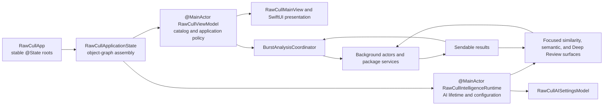
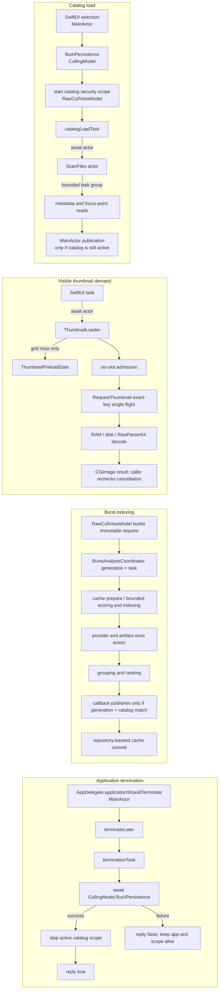

+++
author = "Thomas Evensen"
title = "Concurrency"
date = "2026-08-21"
lastmod = "2026-08-31"
tags = ["concurrency", "actors", "swift"]
categories = ["technical details"]
mermaid = true
weight = 35
slug = "concurrency-revised"
+++

# Concurrency

This page describes the current RawCull runtime in the **RawCull** repository.
The app uses Swift 6 with default main-actor isolation: presentation state
begins on `@MainActor`, shared mutable background state lives in actors, and
CPU, decode, or file work leaves inherited UI isolation explicitly.

A Swift task is not a thread. `await` is a suspension point, not an automatic
hop to a background thread. RawCull reasons about actor, executor, queue, and
task ownership; it never uses worker-thread identity as an application
invariant.

## Composition And Presentation Boundaries

`RawCullApp` retains the two roots returned by `RawCullApplicationState.live()`:
one `RawCullViewModel` and one `RawCullIntelligenceRuntime`. The application
state assembles one integration, one shared similarity model, focused similarity
and semantic-search features, a Deep Review controller,
settings/model-management models, and the main view model. Settings publishes a
complete revisioned configuration to the runtime rather than invoking
independent callbacks on the view model.

`RawCullMainView` is the presentation boundary. It binds the main-actor view
model to SwiftUI scenes, sheets, alerts, commands, and child views. It does not
own catalog decoding, thumbnail admission, analysis, or persistence work.

`RawCullViewModel` is `@Observable @MainActor`. It owns the current catalog,
selection, application operation lifetimes, result application, culling policy,
and active catalog security scope. `BurstAnalysisCoordinator` owns the burst
worker task, generation, progress, cache preparation, compute orchestration, and
cache save. `RawCullSimilarityFeature`, `RawCullSemanticSearchFeature`, and
`DeepAIReviewController` are the view-facing AI boundaries. Background actors
own mutable file, cache, provider, and persistence state.

```mermaid
flowchart LR
    APP["RawCullApp<br/>stable @State roots"] --> STATE["RawCullApplicationState<br/>object-graph assembly"]
    STATE --> VM["@MainActor RawCullViewModel<br/>catalog and application policy"]
    STATE --> RT["@MainActor RawCullIntelligenceRuntime<br/>AI lifetime and configuration"]
    RT --> AIS["RawCullAISettingsModel"]
    RT --> FEATURES["Focused similarity, semantic, and Deep Review surfaces"]
    VM --> VIEW["RawCullMainView and SwiftUI presentation"]
    VM --> BURST["BurstAnalysisCoordinator"]
    FEATURES --> ACTORS["Background actors and package services"]
    BURST --> ACTORS
    ACTORS --> VALUES["Sendable results"]
    VALUES --> FEATURES
    VALUES --> BURST
```

## Four Runtime Paths And Their Hops

```mermaid
flowchart TB
    subgraph CATALOG["Catalog load"]
        C1["SwiftUI selection<br/>MainActor"] --> C2["flushPersistence<br/>CullingModel"]
        C2 --> C3["start catalog security scope<br/>RawCullViewModel"]
        C3 --> C4["catalogLoadTask"]
        C4 -->|"await actor"| C5["ScanFiles actor"]
        C5 -->|"bounded task group"| C6["metadata and focus-point reads"]
        C6 --> C7["MainActor publication<br/>only if catalog is still active"]
    end

    subgraph THUMBS["Visible thumbnail demand"]
        T1["SwiftUI task"] -->|"await actor"| T2["ThumbnailLoader"]
        T2 -->|"grid miss only"| T3["ThumbnailPreloadGate"]
        T2 --> T4["six-slot admission"]
        T4 --> T5["RequestThumbnail exact-key single flight"]
        T5 --> T6["RAM / disk / RawParserKit decode"]
        T6 --> T7["CGImage result; caller rechecks cancellation"]
    end

    subgraph BURST["Burst indexing"]
        B1["RawCullViewModel builds immutable request"] --> B2["BurstAnalysisCoordinator generation + task"]
        B2 --> B3["cache prepare / bounded scoring and indexing"]
        B3 --> B4["provider and artifact-store actors"]
        B4 --> B5["grouping and ranking"]
        B5 --> B6["callback publishes only if generation + catalog match"]
        B6 --> B7["repository-backed cache commit"]
    end

    subgraph TERM["Application termination"]
        A1["AppDelegate.applicationShouldTerminate<br/>MainActor"] --> A2["terminateLater"]
        A2 --> A3["terminationTask"]
        A3 --> A4["await CullingModel.flushPersistence"]
        A4 -->|"success"| A5["stop active catalog scope"]
        A4 -->|"failure"| A6["reply false; keep app and scope alive"]
        A5 --> A7["reply true"]
    end

    C7 ~~~ T1
    T7 ~~~ B1
    B7 ~~~ A1
```

The invisible ordering links (`~~~`) make Mermaid place the four runtime paths
below one another. They describe layout only; they are not runtime hops.

The catalog path is latest-wins. `startCatalogLoad` first flushes pending
culling data, then checks cancellation and the selected source before starting
the new load. `cancelCatalogLoad` cancels catalog, preload, hydration, and
cache-warming tasks; asks batch actors to cancel their inner tasks; resets
dependent analysis; and stops the active catalog scope. Publication repeatedly
checks `isActiveCatalogLoad(url)` and task cancellation.

The termination path deliberately delays AppKit termination. `AppDelegate`
stores one termination task, flushes persistence, and releases the catalog
security scope only after a successful save. A failed flush returns `false` to
AppKit, leaving the app open so the user can retry without losing access or
unsaved state.

## Concurrency Mechanisms

### Main-Actor Isolation

Use the main actor for observable UI state and workflow coordination, not for
expensive work.

| Owner                                                       | State and lifetime owned                                                                                                     |
| ----------------------------------------------------------- | ---------------------------------------------------------------------------------------------------------------------------- |
| `RawCullViewModel`                                          | Active catalog, selection, security scope, catalog/preload/export tasks, result application, culling and presentation policy |
| `CullingModel`                                              | In-memory culling records, debounced save task, persistence revision and errors                                              |
| `SharpnessScoringModel`                                     | Scoring request/generation, options, progress, scores and breakdowns                                                         |
| `SimilarityScoringModel`                                    | Artifact, search, ranking, and grouping generations and published results                                                    |
| `RawCullSimilarityFeature` / `RawCullSemanticSearchFeature` | Focused operation surfaces, application bindings, and projections over the one shared scoring model                          |
| `BurstAnalysisCoordinator`                                  | Burst worker task, generation, progress, cache preparation, missing compute, grouping, ranking, and cache save               |
| `DeepAIReviewController` / `DeepAIReviewFeature`            | App-facing request adaptation plus review generation, progress, recommendation, and cancellation                             |
| `RawCullIntelligenceRuntime`                                | Stable AI feature lifetimes and last accepted configuration revision/identity                                                |
| `RawCullAISettingsModel`                                    | Capability-refresh generation, preferences, and complete configuration publication                                           |

A task created from one of these owners inherits main-actor isolation. That is
useful for its stateful prefix and final publication. Heavy work must then be
reached through an actor, a package async API, or an explicit `@concurrent`
boundary.

### Actor Serialization

Actors protect shared asynchronous state.

| Actor                                                           | Serialized invariant                                               |
| --------------------------------------------------------------- | ------------------------------------------------------------------ |
| `ThumbnailPreloadGate`                                          | Active preload catalogs and parked grid-demand waiters             |
| `ThumbnailLoader`                                               | Six decode slots, FIFO continuations, and cached settings          |
| `RequestThumbnail`                                              | Setup single flight and one producer per exact `ThumbnailCacheKey` |
| `ScanFiles`, `ScanAndCreateThumbnails`, `ExtractAndSaveJPGs`    | Batch task, progress, cancellation, and result accumulation        |
| `DiskCacheManager`, `BurstAnalysisCache`, `WriteSavedFilesJSON` | File-backed cache or persistence transactions                      |
| PhotoAIKit provider/store actors                                | Model runtime, artifact, index, and mask-store state               |

Actor serialization does not make independent work parallel. Where file work can
overlap, owners use a bounded task group and keep only a sliding window of
children active.

### Bounded Structured Parallelism

| Operation                              |                                                          Bound |
| -------------------------------------- | -------------------------------------------------------------: |
| Visible thumbnail loading              |                                   6 slots in `ThumbnailLoader` |
| App scan/extract batches               |              `RawImageLoadingConcurrency.batchExtractionLimit` |
| Sharpness scoring                      | Fast 6, Balanced 4, High Precision 3; RAW demosaic capped at 2 |
| PhotoAnalysisKit batch and calibration |              Caller supplied; RawCull passes the scoring bound |
| PhotoAIKit indexing                    |                        `maximumConcurrentTasks` sliding window |

Structured child tasks inherit cancellation and finish before the task-group
scope returns. Completion order can drive progress, but final arrays are
restored to request order where order is part of the API. Cancellation calls
`cancelAll()` and partial results are not committed as a successful run.

### Explicit Concurrent Work

A task marked `@concurrent`, or an `@concurrent` function, explicitly leaves
inherited actor isolation while retaining structured task behavior. Examples
include RawCull's RAW demosaic helper, sorting and ranking helpers, diagnostics,
and PhotoAnalysisKit's Core Image/Vision worker. The pinned PhotoAnalysisKit
1.2.2 implementation uses an explicit concurrent child and a cancellation
handler; it does not use a detached task for the focus engine.

### Detached And Queue-Backed Work

`Task.detached` is reserved for operations that deliberately must not inherit
actor isolation, including selected cache/file operations and conversion of
blocking image representations. The owner still awaits or otherwise controls the
result, and propagates cancellation where required.

Blocking ImageIO work is stronger than ordinary CPU work. RawParserKit bridges
it to a GCD queue with a checked continuation and lock-backed cancellation state
so it does not occupy Swift's cooperative executor. Framework pipe and PTY
callbacks similarly arrive outside main-actor isolation and explicitly return
through a main-actor task.

## Thumbnail Contention Invariants

Thumbnail concurrency has three separate layers:

1. `ThumbnailPreloadGate` blocks only grid misses whose parent directory is the
   catalog currently being preloaded. Other catalogs, preview requests, AI
   workflows, semantic search, and Deep Review bypass the gate.
2. `ThumbnailLoader` admits at most six active loads. A released slot is
   transferred directly to the next waiter; cancellation removes and resumes a
   queued continuation exactly once.
3. `RequestThumbnail` coalesces only an exact `ThumbnailCacheKey`. Each waiter
   owns its continuation. Cancelling one waiter preserves the shared producer;
   cancelling the final waiter removes the table entry and cancels the producer.

`ThumbnailCacheKey` is replacement-safe and representation-aware. It includes
the standardized path, source file size, modification-date bit pattern, purpose
(grid or preview), requested pixel size, orientation policy, and thumbnail
schema. If source metadata cannot be resolved, reusable coalescing and caching
are skipped: a path alone cannot identify bytes replaced in place.

Every in-flight request also has a generation UUID. A producer may finish after
its final waiter was cancelled and a new request for the same key began; the
generation check prevents that old completion from removing or resuming the new
request's waiters.

## Latest-Wins And Stale-Result Prevention

Cancellation is cooperative and is not enough by itself. A callback or framework
operation may complete after cancellation, so owners pair task cancellation with
identity checks.

| Workflow                                   | Commit guard                                                |
| ------------------------------------------ | ----------------------------------------------------------- |
| Catalog load                               | Active catalog URL, selected source, and cancellation       |
| Catalog sort/search                        | Requested text, sort order, file IDs, and cancellation      |
| Sharpness scoring                          | `ScoringRequest`, scoring-generation UUID, and cancellation |
| Similarity hydrate/index/rank/search/group | Per-workflow generation plus catalog/query snapshots        |
| Burst analysis                             | Burst generation plus catalog URL                           |
| Deep Review                                | Integer generation plus cancellation                        |
| Raw diagnostics                            | Generation UUID plus cancellation                           |
| Thumbnail single flight                    | Exact cache key plus producer-generation UUID               |

Progress callbacks use the same guard as final publication. An older run must
not update a newer run's progress, clear its task property, or publish a stale
result.

## Continuation Ownership And Cleanup

| Owner                       | Normal resume                     | Cancellation cleanup                                           |
| --------------------------- | --------------------------------- | -------------------------------------------------------------- |
| `ThumbnailPreloadGate`      | The matching catalog preload ends | Remove waiter, record cancellation, resume false               |
| `ThumbnailLoader`           | A real slot is transferred        | Remove queued waiter and resume cancelled                      |
| `RequestThumbnail`          | Exact-key producer finishes       | Remove waiter and resume nil; cancel producer when none remain |
| RawParserKit decode limiter | A decode permit becomes free      | Remove cancelled admission waiter and resume cancellation      |
| RawParserKit ImageIO bridge | GCD operation completes           | Lock-backed state guarantees exactly one completion            |

The collection owner is responsible for exactly one continuation resume. Never
hold a lock across `await`, invoke arbitrary client code while holding a lock,
or use a continuation without a cancellation path.

## Security-Scope And Persistence Lifetimes

| Operation           | Owner                            | Start                                                               | Stop / failure cleanup                                                                                                         |
| ------------------- | -------------------------------- | ------------------------------------------------------------------- | ------------------------------------------------------------------------------------------------------------------------------ |
| Active catalog      | `RawCullViewModel`               | Before `catalogLoadTask`, after the previous catalog is flushed     | Catalog cancellation, empty/failed load, replacement, successful termination, or deinit                                        |
| Selected JPG export | `RawCullViewModel+Thumbnails`    | Before constructing `ExtractAndSaveJPGs`                            | Main-actor completion path after success, failure, or cancellation                                                             |
| Rsync copy          | `ExecuteCopyFiles`               | Bookmark URL, then direct-path fallback, for source and destination | One idempotent `cleanup()` on startup failure, completion, close, or deinit; it also removes the operation's include-list file |
| App termination     | `AppDelegate` and `CullingModel` | No new scope; uses the active catalog scope                         | Flush first; release scope only on successful flush                                                                            |

Every successful security-scope start has one owner that records the URL and one
idempotent cleanup path.

## Source-To-Test Map

| Runtime rule                                                                                                 | Protecting tests                                                             |
| ------------------------------------------------------------------------------------------------------------ | ---------------------------------------------------------------------------- |
| Exact-key thumbnail coalescing, independent waiter cancellation, producer generation, and preload-gate drain | `RawCullTests/ThumbnailContentionTests.swift`                                |
| Six-slot limit, FIFO transfer, queued cancellation, and cancel-all                                           | `RawCullTests/ThumbnailLoaderConcurrencyTests.swift`                         |
| Replacement-safe source/representation identity                                                              | `RawCullTests/ThumbnailCacheIdentityTests.swift`                             |
| Scoring request coalescing and generation-safe completion                                                    | `RawCullTests/SharpnessScoringTests.swift`                                   |
| Persistence debounce, failed-save dirty state, retry, atomic backup/write, and legacy decode                 | `RawCullTests/CullingModelTests.swift`                                       |
| Catalog scope idempotence, replacement, failed start, cancellation, and empty catalog                        | `RawCullTests/RawCullVerifyViewModelSecurityScopeTests.swift`                |
| Export selection and denied destination scope                                                                | `RawCullTests/ExtractJPGsSelectionTests.swift`                               |
| Rsync source/destination cleanup and operation-local include files                                           | `RawCullTests/ExecuteCopyFilesStartupTests.swift`                            |
| Package batch ordering, bounds, progress, and cancellation                                                   | `PhotoAnalysisKit/Tests/PhotoAnalysisKitTests/PhotoAnalysisBatchTests.swift` |

## Review Checklist

1. Which actor or task owns the mutable state and lifetime?
2. Does the synchronous prefix require that actor?
3. Is independent work bounded and structured?
4. Is the work CPU-bound, blocking, or callback-based, and which executor or
   queue boundary is appropriate?
5. What Sendable value crosses the boundary?
6. How is every continuation resumed on success and cancellation?
7. Which generation, catalog, query, key, or request identity prevents a stale
   commit?
8. Who stops each successfully started security scope?
9. What test makes the invariant executable?

“`await` moves this to a background thread” is not a valid concurrency model.
Name the actual actor, task, executor, queue, cancellation owner, and commit
guard.
