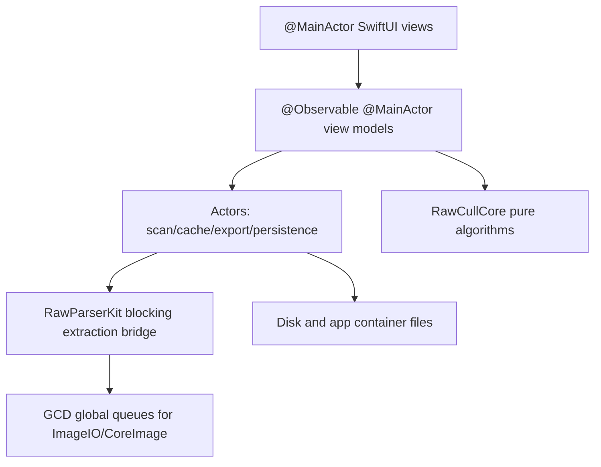
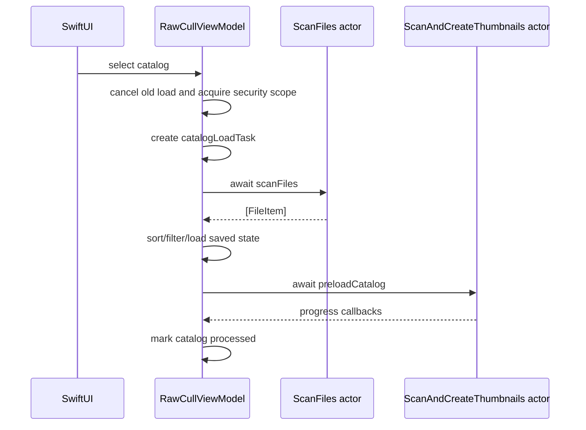

+++
author = "Thomas Evensen"
title = "Concurrency"
date = "2026-05-19"
tags = ["concurrency", "actors", "swift"]
categories = ["technical details"]
mermaid = true
weight = 35
slug = "concurrency-revised"
+++

# Concurrency

RawCull uses Swift concurrency to keep the UI responsive while it scans folders, reads RAW metadata, extracts thumbnails, scores sharpness, builds burst groups, and writes cache/persistence files.

The rule of thumb is simple:

- SwiftUI and user-visible state live on `@MainActor`.
- Shared mutable background services are actors.
- Pure algorithms are stateless package functions/enums.
- Blocking ImageIO/CoreImage work is moved off Swift's cooperative executor.

## Source Map

| Area | Files |
|---|---|
| Main UI state | `Model/ViewModels/RawCullViewModel.swift` and extensions |
| Feature view models | `SharpnessScoringModel.swift`, `SimilarityScoringModel.swift`, `SettingsViewModel.swift`, `MemoryViewModel.swift`, `GridThumbnailViewModel.swift` |
| Scan and thumbnail actors | `Actors/ScanFiles.swift`, `ScanAndCreateThumbnails.swift`, `ThumbnailLoader.swift`, `RequestThumbnail.swift` |
| Cache actors | `SharedMemoryCache.swift`, `DiskCacheManager.swift`, `FullSizeJPGDiskCache.swift`, `BurstAnalysisCache.swift` |
| Export and persistence actors | `ExtractAndSaveJPGs.swift`, `SaveJPGImage.swift`, `WriteSavedFilesJSON.swift`, `ScanAndExtractJPGs.swift` |
| Blocking bridge | `RawParserKit/Sources/RawParserKit/CancellableImageIOWork.swift` |
| Pure package algorithms | `RawCullCore/Sources/RawCullCore/` |

## Isolation Model

```mermaid
flowchart TD
    A["@MainActor SwiftUI views"] --> B["@Observable @MainActor view models"]
    B --> C["Actors: scan/cache/export/persistence"]
    C --> D["RawParserKit blocking extraction bridge"]
    B --> E["RawCullCore pure algorithms"]
    C --> F["Disk and app container files"]
    D --> G["GCD global queues for ImageIO/CoreImage"]
```

`RawCullViewModel` is the main coordinator. It owns selected catalog state, file lists, current view mode, selected file IDs, zoom overlay state, culling model, sharpness model, similarity model, and burst-analysis state.

Because `RawCullViewModel` is `@MainActor`, views can bind to it safely. Expensive work is delegated to actors or detached/background tasks and awaited.

## Actors In The App Target

| Actor | Responsibility |
|---|---|
| `ScanFiles` | Read catalog contents, EXIF, native focus points, and optional `focuspoints.json` |
| `ScanAndCreateThumbnails` | Bulk thumbnail preload with bounded task-group parallelism |
| `ThumbnailLoader` | Rate-limit many UI thumbnail requests |
| `RequestThumbnail` | Resolve one thumbnail through RAM, disk, or source extraction |
| `SharedMemoryCache` | Own cache config, memory-pressure monitoring, stats, and cache actors |
| `DiskCacheManager` | Read/write generated thumbnail JPEGs |
| `FullSizeJPGDiskCache` | Read/write larger embedded JPEG previews for zoom |
| `BurstAnalysisCache` | Persist and validate burst-analysis JSON snapshots |
| `ExtractAndSaveJPGs` | Batch extract embedded JPEGs next to RAW files |
| `SaveJPGImage` | Write one encoded JPEG to disk |
| `ScanAndExtractJPGs` | Warm the full-size JPEG disk cache |
| `WriteSavedFilesJSON` | Atomic `savedfiles.json` writes |

`DiscoverFiles` and `CreateOutputforView` are structs, not actors. They contain pure or detached work and do not own mutable shared state.

## Main-Actor View Models

| Class | Role |
|---|---|
| `RawCullViewModel` | App coordinator and catalog lifecycle |
| `SharpnessScoringModel` | Sharpness scores, saliency, scoring options, breakdowns |
| `SimilarityScoringModel` | Vision embeddings, distances, burst groups, grouping UI state |
| `SettingsViewModel` | Persisted settings and async settings snapshots |
| `MemoryViewModel` | Memory stats for the settings/diagnostics UI |
| `GridThumbnailViewModel` | Grid-window state |
| `ExecuteCopyFiles` | rsync subprocess state and copy progress |

The common pattern is: mutate observable UI state on the main actor, then await background actors for heavy work.

## Catalog Load Concurrency

```mermaid
sequenceDiagram
    participant UI as SwiftUI
    participant VM as RawCullViewModel
    participant Scan as ScanFiles actor
    participant Preload as ScanAndCreateThumbnails actor
    UI->>VM: select catalog
    VM->>VM: cancel old load and acquire security scope
    VM->>VM: create catalogLoadTask
    VM->>Scan: await scanFiles
    Scan-->>VM: [FileItem]
    VM->>VM: sort/filter/load saved state
    VM->>Preload: await preloadCatalog
    Preload-->>VM: progress callbacks
    VM->>VM: mark catalog processed
```

Every awaited stage checks `isActiveCatalogLoad(_:)`. If the user switches folders while old work is still finishing, those stale results are discarded.

## Task Groups And Backpressure

RawCull uses task groups when work is independent per file:

- `ScanFiles.scanFiles`,
- `ScanAndCreateThumbnails.preloadCatalog`,
- `ExtractAndSaveJPGs`,
- sharpness scoring,
- similarity indexing.

The important detail is bounded concurrency. The producer does not queue thousands of child tasks at once. It keeps only a limited number active, usually based on `ProcessInfo.processInfo.activeProcessorCount * 2` or a scoring-specific cap.

This protects disk I/O, memory, and the cooperative executor.

## Cancellation

Cancellation is cooperative. RawCull checks `Task.isCancelled` before expensive steps and after awaited calls. That is especially important around:

- directory enumeration,
- ImageIO thumbnail extraction,
- sharpness scoring,
- similarity indexing,
- cache warming,
- zoom overlay image loading.

Long-running view-model tasks are stored so the app can cancel them:

| Property | Cancels |
|---|---|
| `catalogLoadTask` | Current catalog load |
| `preloadTask` | Thumbnail preload |
| `jpgCacheWarmTask` | Full-size JPEG cache warming |
| `zoomExtractionTask` | Current zoom overlay load |
| `burstAnalysisTask` | Current burst analysis |

`cancelCatalogLoad()` is the main teardown method. It cancels tasks, asks actors to cancel their inner work, resets burst state, and releases the active catalog security scope.

## Sendable Patterns

Swift 6 strict concurrency means values crossing isolation boundaries must be safe.

RawCull uses these patterns:

- `RawCullCore` models such as `RawCullFileItem`, `ExifMetadata`, `SaliencyInfo`, and burst-analysis structs are value types and `Sendable`.
- Parser conformers are stateless enum types with static methods.
- `CachedThumbnail` is `@unchecked Sendable` with an immutability invariant.
- Non-Sendable image values are consumed before crossing boundaries or encoded to `Data` when needed.
- Lock-backed counters use `OSAllocatedUnfairLock` when callbacks must be synchronous and nonisolated.

## Blocking Work Escape Hatch

`RawParserKit.CancellableImageIOWork` moves synchronous ImageIO work onto GCD global queues. The Swift task awaits a continuation while the actual blocking decode runs outside Swift's cooperative thread pool.

That bridge also carries cancellation through an `ImageIOCancellationToken`, so parser loops can stop at checkpoints.

Use this pattern for heavy synchronous framework work. Do not run blocking ImageIO directly inside an actor method or a Swift task-group child.

## Pure Algorithms

`RawCullCore` contains pure, synchronous logic:

- burst grouping,
- burst ranking,
- focus-point string normalization,
- histogram calculation,
- shared value models.

These pieces are easier to test because they do not require SwiftUI, actors, app sandbox access, or ImageIO.

## What To Check When Changing This Area

- New user-visible mutable state should usually live on a `@MainActor` view model.
- New shared mutable background state should usually be an actor.
- Pure rules should go into `RawCullCore` when they can avoid app dependencies.
- Any synchronous ImageIO/CoreImage work needs an explicit off-cooperative-executor strategy.
- Every catalog-loading stage must guard against stale results after folder switches.
- Cancellation should be checked before each expensive step, not just at the beginning.
