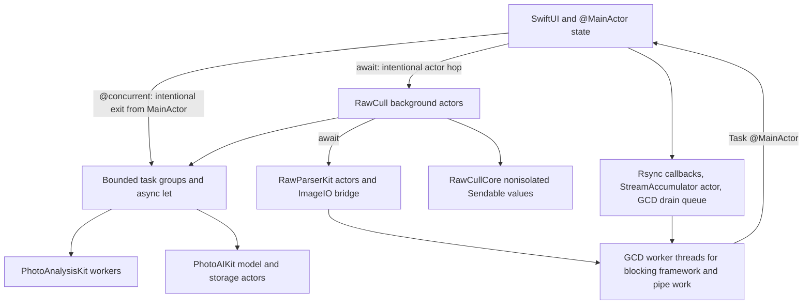

+++
author = "Thomas Evensen"
title = "Concurrency"
date = "2026-08-01"
tags = ["concurrency", "actors", "swift"]
categories = ["technical details"]
mermaid = true
weight = 35
slug = "concurrency-revised"
+++

# Concurrency

This page documents concurrency in the `RawCullAIModels` branch of RawCull and in the first-party Swift packages checked out beside it. The audit covers production source in the RawCull app, `DecodeEncodeGeneric`, `ParseRsyncOutput`, `PhotoAIKit`, `PhotoAnalysisKit`, `RawCullCore`, `RawParserKit`, `RsyncArguments`, `RsyncProcessStreaming`, and `RsyncAnalyse`.

RawCull uses concurrency to keep SwiftUI responsive while it scans folders, reads RAW metadata, extracts and caches previews, calculates sharpness, creates similarity artifacts, groups bursts, runs AI models, downloads model assets, and streams rsync output.

## The rule: isolate work, do not guess about threads

A Swift `Task` is not a thread. Swift schedules tasks on executors, and executors use threads. At an `await`, a task may suspend and later resume on a different worker thread even when it resumes on the same actor. RawCull must never depend on the worker thread being unchanged.

In this document, **hop** means a change of actor, executor, or dispatch queue that is required or explicitly requested by the source code:

- Calling an actor-isolated method from outside that actor hops to the actor's executor.
- `@MainActor`, `MainActor.run`, and `Task { @MainActor in ... }` hop to the main actor when the caller is elsewhere.
- `@concurrent` and `Task { @concurrent in ... }` explicitly move non-UI work off inherited actor isolation and onto the concurrent executor.
- A task-group child is independently scheduled so that sibling work can run in parallel.
- `Task.detached` creates an unstructured task that does not inherit actor isolation.
- `DispatchQueue.async` submits work to the named GCD queue.

None of `await`, `Task.sleep`, task priority, or cancellation alone requests an executor hop. They may cause suspension and a later change of worker thread, but that is scheduler behavior and must not be observed as application logic.

> Every executor hop in RawCull must be intentional. Add an explicit isolation annotation or concurrency primitive and document the reason. A change of worker thread after suspension is neither an error nor a behavior RawCull may rely on.

## Compiler concurrency model

| Target | Language and isolation settings | Consequence |
|---|---|---|
| RawCull app | Swift 6, Approachable Concurrency, default `MainActor` isolation | Swift 6 enforces data-race safety, and unannotated app declarations commonly begin main-actor isolated. Background work must opt out deliberately. The test target additionally spells out `SWIFT_STRICT_CONCURRENCY = complete`. |
| `RawCullCore` | Swift 6, default `MainActor`, `InferIsolatedConformances`, `NonisolatedNonsendingByDefault` | Pure models and algorithms are explicitly `nonisolated` so they can run in the caller's non-UI domain. |
| `RawParserKit` | Swift 6, default `MainActor`, `InferIsolatedConformances`, `NonisolatedNonsendingByDefault` | Parser utilities opt out with `nonisolated`; stateful loaders and limiters use actors. |
| `PhotoAnalysisKit` | Swift 6, `InferIsolatedConformances`, `NonisolatedNonsendingByDefault` | Analysis APIs are not main-actor-owned; explicit workers and task groups provide concurrency. |
| `PhotoAIKit` | Swift 6 | Model runtimes, stores, and indexes use actors; workflows use bounded structured concurrency. |
| Remaining packages | Swift 6 toolchains; no package-level default actor isolation | Isolation is supplied by declarations such as `@MainActor` or `actor`. |

`swift-tools-version` selects the PackageDescription API and minimum toolchain. It is not, by itself, proof of the package's Swift language mode; packages that declare `swiftLanguageModes: [.v6]` do so explicitly.

## Concurrency architecture

```mermaid
flowchart TD
    UI["SwiftUI and @MainActor state"]
    APP["RawCull background actors"]
    GROUPS["Bounded task groups and async let"]
    PARSER["RawParserKit actors and ImageIO bridge"]
    ANALYSIS["PhotoAnalysisKit workers"]
    AI["PhotoAIKit model and storage actors"]
    CORE["RawCullCore nonisolated Sendable values"]
    RSYNC["Rsync callbacks, StreamAccumulator actor, GCD drain queue"]
    GCD["GCD worker threads for blocking framework and pipe work"]

    UI -->|"await: intentional actor hop"| APP
    UI -->|"@concurrent: intentional exit from MainActor"| GROUPS
    APP --> GROUPS
    APP -->|"await"| PARSER
    GROUPS --> ANALYSIS
    GROUPS --> AI
    APP --> CORE
    UI --> RSYNC
    PARSER --> GCD
    RSYNC --> GCD
    GCD -->|"Task @MainActor"| UI
```

## 1. Main-actor concurrency

The main actor owns SwiftUI and user-visible mutable state. This is correctness isolation, not a way to make work parallel.

| Main-actor owner | Responsibility |
|---|---|
| `RawCullViewModel` | Catalog lifecycle, selection, culling state, thumbnail and burst coordination |
| `CullingModel` | Ratings and saved culling state |
| `SharpnessScoringModel`, `FocusMaskModel` | Observable scoring options, results, calibration, and focus-mask presentation |
| `SimilarityScoringModel` | Similarity artifacts, semantic search, burst groups, ranking, and progress |
| `RawCullAISettingsModel`, `DeepAIReviewFeature` | Model availability/download UI and deep-review UI state |
| `SettingsViewModel` | Settings snapshots and persistence coordination |
| `MemoryViewModel`, `MemoryDiagnosticsViewModel`, `SimilarityDiagnosticsViewModel` | Diagnostic state presented by SwiftUI |
| `GridThumbnailViewModel`, `ComparisonGridImageCoordinator` | View-specific selection and image-loading state |
| `ExecuteCopyFiles`, `Params`, `ArgumentsSynchronize`, `RemoteDataNumbers` | rsync UI state and parameters |
| `RawCullAIIntegration` | Main-actor capability snapshot and service selection |
| `CreateStreamingHandlers`, `ReadSavedFilesJSON` | App-facing callbacks and state application |

SwiftUI `.task` modifiers and button-created `Task` values inherit main-actor isolation when their synchronous prefix reads or mutates view state. That entry is intentional. They then hop only when awaiting a background actor or an explicitly concurrent function, and resume on the main actor before changing UI state.

`DispatchQueue.main.async` is used in the comparison filmstrip and vertical image table to defer `scrollTo` by one run-loop turn so lazy view IDs have entered scroll geometry. These calls do not exist merely to reach the main thread; they intentionally delay already-main-actor UI work.

## 2. Actors that serialize mutable state

An actor hop is wanted because it establishes exclusive access to the actor's state. It may suspend the caller, but it does not promise a particular worker thread.

### RawCull app actors

| Group | Actors | Serialized state or operation |
|---|---|---|
| Catalog and batch work | `ScanFiles`, `ScanAndCreateThumbnails`, `ScanAndExtractJPGs`, `ExtractAndSaveJPGs` | Scan state, stored batch task, progress counters, ETA, and cancellation |
| Thumbnail flow | `ThumbnailLoader`, `RequestThumbnail` | Admission slots, waiters, settings snapshots, one-time setup, and per-request cache flow |
| Cache and persistence | `SharedMemoryCache`, `DiskCacheManager`, `FullSizeJPGDiskCache`, `BurstAnalysisCache`, `PerFileAnalysisArtifactStore`, `WriteSavedFilesJSON`, `SaveJPGImage` | Cache configuration, disk-cache operations, atomic JSON/artifact commits, schema validation, and writes |
| Diagnostics | `SimilarityDiagnosticsLog` | Ordered diagnostic log writes |
| AI resources and downloads | `RawCullAIModelResourceManager`, `RawCullManagedBackgroundAssetsModelDownloadService`, `RawCullAIModelDownloadCoordinator`, `RawCullAIModelLicenceAcceptanceFileStore` | Provider reuse, model download state, licence acceptance, and file-backed records |
| AI recovery | `RawCullCLIPFailureRecorder`, `RawCullRecoveringCLIPArtifactProvider` | Ordered failure collection and primary-to-fallback provider decisions |

`SharedMemoryCache` deliberately exposes its `NSCache` instances through `nonisolated(unsafe)`: `NSCache` supplies its own thread safety. Synchronous counters, eviction history, and memory-pressure samples use `OSAllocatedUnfairLock`. This avoids an actor hop in synchronous cache delegate callbacks while retaining an explicit synchronization invariant.

### Package actors

| Package | Actors | Purpose of isolation |
|---|---|---|
| `RawParserKit` | `RawImageLoader`, `DecodeConcurrencyLimiter` | Coalesce duplicate image/metadata tasks and bound full-size and thumbnail decodes |
| `PhotoAnalysisKit` | `VisionFeaturePrintBackend` | Serialize its Vision feature-print request state |
| `PhotoAIKit` | `CoreAICLIPProvider`, `CoreAISAM3Provider`, `VisionFeaturePrintBackend`, `SegmentationService`, `SubjectMaskCatalogIndex`, `SubjectMaskMemoryStore`, `SubjectMaskDiskStore`, private `ProgressRecorder` | Own non-Sendable model runtimes, lazy model loads, repositories, cache inventory, disk/memory masks, and progress |
| `RsyncProcessStreaming` | `StreamAccumulator` | Preserve partial stdout lines, errors, and counters across callback arrivals |
| `RsyncAnalyse` | `ActorRsyncOutputAnalyser` | Serialize access to the parsed-output cache while returning Sendable analysis values |

PhotoAIKit's Core AI model providers are actors because model loading and inference resources are shared and not safe to use concurrently without ownership. An `await` from a RawCull workflow to a provider is therefore an intentional provider-actor hop. The pinned `coreai-models` implementation may use its own async execution internally; RawCull does not assume which thread it uses.

## 3. Structured parallelism

Structured child tasks inherit cancellation and cannot outlive their scope. RawCull uses them when operations are independent and results must be joined.

| Site | Primitive | Work and concurrency limit | Why independent scheduling is wanted |
|---|---|---|---|
| `ScanFiles.scanFiles` | `withTaskGroup` | Metadata and native focus-point read per file | Independent files can be decoded concurrently. |
| `ScanAndCreateThumbnails`, `ScanAndExtractJPGs`, `ExtractAndSaveJPGs` | `withTaskGroup` | Preview/cache/export work capped by `activeProcessorCount * 2` | Bounded parallel file work improves throughput without unbounded bitmap allocation. |
| `PhotoAnalysisKit.analyzeBatch` and input loading | `withTaskGroup` | Sliding window, caller-configured limit, default 8 | Loading and scoring different images are independent; output is restored to input order. |
| `PhotoAnalysisKit` calibration | `withTaskGroup` | Sliding window of image energy calculations | Calibration samples are independent and cancellation discards partial output. |
| `PhotoAIKit.EmbeddingIndexer`, `SimilarityArtifactIndexer` | `withThrowingTaskGroup` | Sliding window controlled by `maximumConcurrentTasks` | Decode/provider/store work overlaps while progress remains completion ordered. |
| Cache settings | four `async let` children | Thumbnail, full-size preview, similarity-artifact, and burst-cache usage | Four unrelated actor queries can complete in parallel. |
| AI capability refresh | three `async let` children | SAM3 and two CLIP resource managers | Model bundles are validated independently. |
| AI settings refresh | two `async let` children | Capability refresh and saved-evidence scan | Independent inputs are joined before one UI update. |

Task-group children are scheduled independently of the actor running the group. That is the explicit parallelism boundary. Each child captures Sendable values and calls the actor or provider that owns mutable state.

## 4. Unstructured tasks and lifetime

RawCull creates unstructured tasks to bridge synchronous UI/callback entry points, coalesce duplicate requests, and retain cancellable long-running work.

| Pattern | Representative owners | Lifetime rule |
|---|---|---|
| Main-actor workflow task | `RawCullViewModel`, `SharpnessScoringModel`, `SimilarityScoringModel`, `DeepAIReviewFeature`, `RawCullAISettingsModel` | Store the task, cancel the previous generation, check cancellation/generation before publishing results. |
| Actor-owned single-flight task | `RawImageLoader`, `RequestThumbnail`, `SharedMemoryCache` | Reuse an in-flight task for the same setup or resource and remove it after awaiting the value. |
| Actor-owned batch task | scan, preload, export, catalog-index actors | Actor serializes replacement; cancellation is propagated to child work. |
| SwiftUI `.task` | thumbnail, zoom, settings, diagnostics, and search views | SwiftUI cancels it with view identity/lifetime; stored sub-tasks are cancelled on replacement. |
| Fire-and-forget notification | preload/extraction progress and synchronous cancellation entry points | The task contains a single explicit actor call and owns no result needed by its creator. |

Important stored tasks include catalog load, thumbnail preload, full-size cache warming, zoom extraction, burst analysis, similarity and semantic hydration, scoring, semantic search, model download, deep review, memory sampling, mask loading, and image-source loading. Their exact properties live with the owning view model or actor; ownership, not thread identity, defines their lifetime.

A bare `Task { ... }` inherits the surrounding actor. It does **not** hop away merely because it is asynchronous. This is wanted when its synchronous prefix accesses actor-owned state. If a new task has no actor work before its first `await`, use `Task { @concurrent in ... }` or call an explicitly `@concurrent` function so that leaving the main actor is visible in source.

## 5. Explicit concurrent-executor work

`@concurrent` is the Swift 6.2 spelling RawCull uses for work that must not inherit the caller's actor. It is an executor hop, not a guarantee that a new OS thread will be created.

| Site | Work moved off inherited isolation | Why the hop is wanted |
|---|---|---|
| `CreateOutputforView.createOutputForView` | Parse collected rsync lines | Parsing is CPU work with no UI state. |
| `ScanFiles.sortFiles` | Sort immutable file snapshots | Sorting may be large and does not need the scan actor or main actor. |
| `RawCullSavedBurstEvidenceScanner.scan` | Directory enumeration and JSON decoding | Capability evidence scanning is file/CPU work, not UI work. |
| `RawCullSemanticSearchService.rank` | Text encoding and candidate ranking | Ranking can be substantial and publishes only Sendable progress/results. |
| `RawCullDeepReviewImageDecoder.image`, `RawCullDeepAIReviewPipeline.review` | RAW/Core Image decode and review pipeline | Expensive review must not occupy inherited main-actor isolation. |
| `SubjectMaskFocusScorer.score` | Mask-weighted focus scoring | Pure image analysis is non-UI CPU work. |
| `SimilarityScoringModel` workers | Artifact indexing, semantic search, burst grouping, pairwise distance work | Main-actor model owns publication; computation runs off it. |
| `RawCullViewModel+Diagnostics` | Diagnostic extraction | File diagnostics are computed away from UI and returned through `MainActor.run`. |
| `RawCullAIModelDownloadService` progress task | Consume asset status updates | The stream wait is not UI-owned; its callback explicitly hops to `@MainActor`. |
| `PhotoAnalysisKit.FocusMaskEngine` worker | Synchronous Core Image/Vision operation | The operation must not inherit UI isolation; cancellation cancels the worker. |
| `PhotoAIKit.SubjectMaskDiskStore` and storage-key reads | Synchronous disk, identity, PNG, and JSON work | Explicitly leave the store actor so the actor is not occupied during file work. |

The PhotoAIKit disk-store tasks intentionally leave actor isolation, but `@concurrent` still uses Swift's cooperative executor. It is appropriate for short bounded operations; any operation shown by profiling to block for a long time should use a dedicated blocking-I/O bridge like RawParserKit's GCD continuation bridge.

## 6. Detached tasks and blocking work

`Task.detached` is used only where losing actor inheritance is deliberate. It does not inherit actor isolation or task-local values, and cancellation is not automatically structured unless the parent explicitly awaits and/or cancels it.

| Area | Detached work | Reason |
|---|---|---|
| Catalog discovery and sidecar reads | Directory enumeration, `Data(contentsOf:)` | Synchronous file work must not run on the main or scan actor. |
| Thumbnail and preview caches | Image decode, JPEG conversion, disk reads/writes, size calculation, pruning | ImageIO and filesystem work should not occupy cache actors. |
| `RawParserKit.RawImageLoader` | Sidecar/preview decode and metadata reads | Expensive synchronous ImageIO is separated from loader serialization. |
| Settings and burst cache | JSON reads/writes, cache usage, clear | Blocking persistence is performed outside UI/actor isolation. |
| Memory diagnostics | Mach and VM statistics | System calls are sampled away from the main actor, followed by `MainActor.run`. |
| Zoom/full-size preview | Preview load and sharpening | Pixel work is kept off UI isolation. |

RawParserKit's `CancellableImageIOWork` is the stronger escape hatch for blocking framework calls. It uses `withCheckedThrowingContinuation` and submits the operation to `DispatchQueue.global(qos:)`. This is an intentional queue hop: blocking ImageIO/CoreImage work runs on a GCD worker rather than occupying a Swift cooperative-pool thread. `ImageIOCancellationToken` and `WorkState` use `OSAllocatedUnfairLock` so cancellation can race safely with exactly-once continuation resumption.

The queue submission may run on a different worker thread, but GCD does not promise a fresh thread or a stable thread identity. The guarantee RawCull relies on is queue/executor separation, not a thread number.

## 7. Async streams, callbacks, and continuations

| Boundary | Mechanism | Isolation behavior |
|---|---|---|
| Memory settings timer | `AsyncStream` plus a producer task | `Task.sleep` suspends between ticks; it does not request a hop. SwiftUI owns and cancels the consumer, and termination cancels the producer. |
| Copy progress | `AsyncStream<Int>` | Rsync callbacks yield Sendable progress; the main-actor owner consumes and presents it. |
| Managed model download | framework `AsyncSequence` | A `Task { @concurrent in ... }` consumes updates, then awaits an explicitly main-actor progress closure. |
| Thumbnail/decode admission | checked continuations plus cancellation handlers | Actors park callers without blocking a thread and resume each continuation exactly once when a slot is transferred or cancelled. |
| ImageIO bridge | checked throwing continuation | A GCD callback resumes the Swift task; the waiting task resumes on its own required executor, not on the callback's thread by contract. |
| rsync pipes and PTY | `FileHandle`/`DispatchSourceRead` callbacks | Callbacks arrive outside main-actor isolation; `Task { @MainActor in ... }` explicitly returns to UI/process state. |

## 8. GCD, locks, and framework callbacks

GCD remains where the source API is callback-based or blocking:

- `RsyncProcessStreaming` uses a named serial termination queue to wait briefly, drain stdout/stderr, clear handlers, and then creates `Task { @MainActor in ... }` to finalize process state. The first hop avoids blocking the main actor; the return hop protects main-actor process/UI state.
- PTY and pipe callbacks create main-actor tasks before accessing `RsyncProcess`.
- A short `DispatchQueue.main.asyncAfter` in PTY cleanup deliberately defers final drain/close; it is a timing boundary, not an accidental thread correction.
- RawParserKit's ImageIO bridge uses a global GCD queue specifically for blocking decode work.
- The two SwiftUI `DispatchQueue.main.async` calls deliberately defer scrolling by one run loop.

Locks are limited to synchronous callback-compatible state:

- `SharedMemoryCache` and `CacheDelegate` use `OSAllocatedUnfairLock` for counters, pressure state, and eviction history.
- `ImageIOCancellationToken` uses it for the cancellation bit.
- `WorkState` uses it to enforce exactly-once continuation completion.

Code must never hold one of these locks across `await`, call arbitrary client code while holding it, or use it as a substitute for actor ownership of asynchronous mutable state.

## 9. Sendable and nonisolated data flow

Values crossing task and actor boundaries are immutable or explicitly `Sendable`:

- `RawCullCore` declares its catalog, EXIF, saliency, burst grouping, boundary, ranking, and review values `nonisolated` and `Sendable`. Its algorithms are synchronous and stateless; concurrency is supplied by callers.
- `RawParserKit` exposes Sendable metadata/value types and actor-owned loaders. Images are consumed inside their owning isolation domain or encoded to `Data` before crossing a detached-task boundary.
- `PhotoAnalysisKit` batch requests contain `@Sendable` async input providers. `FocusMaskEngine` is `@unchecked Sendable` under the documented invariant that its `CIContext` has no mutable model/UI state and every operation receives immutable configuration.
- `PhotoAIKit` contracts are Sendable values and `@Sendable` provider/progress closures. `CoreAISAM3Provider` temporarily marks upstream runtime types `@unchecked Sendable`; the documented invariant is that they never leave that actor, and the conformances should be removed when upstream supplies correct annotations.
- `CachedThumbnail`, rsync `ProcessHandlers`, and lock/continuation bridge state use `@unchecked Sendable` only with a local immutability or synchronization invariant.

`nonisolated` does not mean “background thread.” It means the declaration is not owned by an actor. A synchronous `nonisolated` function runs on the calling thread; an async one follows its declared/caller isolation rules. Use `@concurrent` when execution must explicitly leave inherited actor isolation.

## Package coverage

| Package | Concurrency present in production code |
|---|---|
| `DecodeEncodeGeneric` | Async URLSession decode APIs. `await URLSession.data(from:)` suspends without promising a thread hop; the package owns no actor or task. |
| `ParseRsyncOutput` | The stateful parser class is `@MainActor`; parsing is serialized with its app-facing state. RawCull's `CreateOutputforView` separately moves bulk line transformation off main actor. |
| `PhotoAIKit` | Eight actors, bounded throwing task groups, actor-owned catalog task, explicit concurrent disk/identity tasks, Sendable contracts, cancellation checks, and async progress callbacks. |
| `PhotoAnalysisKit` | Vision actor, bounded task groups, explicit concurrent cancellable Core Image/Vision worker, Sendable inputs/results. |
| `RawCullCore` | No tasks or actors. Explicitly nonisolated, Sendable value models and pure algorithms support safe use from any isolation domain. |
| `RawParserKit` | Loader and limiter actors, task coalescing, cancellation-aware admission continuations, detached ImageIO tasks, and a GCD/continuation bridge for blocking work. |
| `RsyncProcessStreaming` | Main-actor process manager, accumulator actor, pipe/PTY callbacks, main-actor return tasks, a serial drain queue, dispatch source, timer, and Sendable handler boundary. |
| `RsyncArguments` | No asynchronous work, tasks, actors, queues, or locks; it builds argument values synchronously. |
| `RsyncAnalyse` | `ActorRsyncOutputAnalyser` protects its mutable analysis cache. Its parsing methods are synchronous actor operations and return nested Sendable result, statistics, change, and flag values. It is adjacent to RawCull but is not a direct package reference of the app target. |

The app also pins external packages through `PhotoAIKit`, including Apple's `coreai-models`. Their source is not part of the first-party checkouts under `/Users/thomas/GitHub/RawCull`; RawCull treats their async APIs as suspension points and does not make thread-affinity claims about their internals.

## Cancellation, stale results, and backpressure

Cancellation is cooperative. Long-running loops check `Task.isCancelled` or `Task.checkCancellation()` before expensive steps and after suspension points. Task groups call `cancelAll()` when abandoning partial work. Continuation-based limiters remove and resume cancelled waiters. Framework work receives an explicit cancellation token where the underlying synchronous API cannot observe Swift task cancellation directly.

Cancellation alone does not prevent an old operation from publishing late. Main-actor workflows also use task identity, generation counters, selected catalog IDs, source IDs, or current-query checks before applying results. `RawCullViewModel.cancelCatalogLoad()` cancels catalog-related tasks, tells actors to cancel their inner work, resets dependent analysis state, and releases the active security-scoped resource.

Backpressure is intentional:

- RAW thumbnail decoding is capped at 6 and full-size decoding at 2 in `RawParserKit`.
- App batch extraction uses `max(1, activeProcessorCount * 2)`.
- PhotoAnalysisKit and PhotoAIKit batch APIs maintain a sliding window rather than enqueueing every file at once.
- `ThumbnailLoader` parks excess callers with continuations instead of blocking threads.

## Hop audit checklist

Before adding or changing concurrent work, answer these questions in code review:

1. **Who owns the mutable state?** Use `@MainActor` for UI state and an actor for shared background state.
2. **Does the synchronous prefix need that actor?** Keep a bare inherited `Task` only when work before the first `await` uses actor-owned state. Otherwise make the exit explicit with `@concurrent`.
3. **Is parallelism structured?** Prefer `async let` or a bounded task group. Store an unstructured task only when a synchronous entry point or independently cancellable lifetime requires it.
4. **Is the operation blocking?** An actor or `@concurrent` prevents main-actor occupation but does not make blocking safe for Swift's cooperative pool. Use the GCD continuation bridge for long ImageIO/CoreImage or pipe-drain work.
5. **What causes each hop?** Name the actor call, `@concurrent`, detached task, group child, `MainActor.run`, or dispatch queue. Do not write “`await` moves to a background thread.”
6. **How does work return?** UI publication must occur through main-actor isolation; continuation waiters resume on their required executor automatically.
7. **What crosses the boundary?** Transfer Sendable values. Encode non-Sendable images to `Data`, or consume them inside the actor that owns them.
8. **How does it stop?** Define task ownership, cancellation checks, continuation cleanup, and stale-result rejection.
9. **Is a thread change being observed?** Remove correctness logic based on `Thread.current` or thread IDs. Thread logging is diagnostic only.
10. **Is every hop wanted?** If no correctness, responsiveness, or parallelism reason can be written beside the boundary, remove the boundary rather than relying on an accidental scheduling effect.
