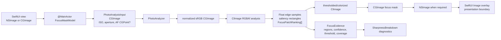

+++
author = "Thomas Evensen"
title = "Detailed Focus Mask Computation"
date = "2026-08-21"
lastmod = "2026-08-31"
weight = 42
tags = ["focus mask", "sharpness", "focus", "vision", "metal", "saliency"]
categories = ["technical details"]
mermaid = true
+++

# Detailed Focus Mask Computation

This page follows visible focus-mask rendering at **PhotoAnalysisKit 1.2.2**,
revision **3bf462fab0d82f5e4c315273688933ace68fa737**.

The focus mask is not the camera's AF-point marker. The marker reports where the
camera attempted focus. The mask is a package-generated bitmap of selected
edge-detail evidence. The AF point can guide selection, but it is never painted
as the mask by itself.

RawCull owns the SwiftUI trigger, image and metadata supplied to the package,
task lifetime, and overlay presentation. PhotoAnalysisKit owns normalization,
saliency, evidence selection, Laplacian generation, patch ranking, thresholding,
morphology, colorization, clipping, and mask diagnostics.

For shared ownership, persistence, calibration, and scalar score behavior, see
[Focus Mask And Sharpness](../focusmask/).

## Data Shapes And The Overlay Boundary



`CGImage` is the public decoded-image boundary. Package internals create
`CIImage` values and render RGBAf edge-energy samples with a reusable
`CIContext`. The returned `CGImage` contains only the overlay bitmap; RawCull
positions it over the displayed image. The package does not retain a SwiftUI
view, app model, URL, or persistence object.

## Call Paths

| RawCull context       | Model call                       | Package facade                       | Evidence behavior                                                                                                               |
| --------------------- | -------------------------------- | ------------------------------------ | ------------------------------------------------------------------------------------------------------------------------------- |
| Main thumbnail/detail | `generateFocusMask`              | `PhotoAnalyzer.focusMask`            | Can reuse existing `FocusEvidence`; classification is skipped and a saved winning saliency rectangle avoids a new saliency pass |
| Zoom overlay          | `generateFocusMaskWithBreakdown` | `PhotoAnalyzer.analyzeWithFocusMask` | Recomputes saliency, scalar breakdown, evidence, and mask together                                                              |
| Comparison grid       | `generateFocusMaskWithBreakdown` | `PhotoAnalyzer.analyzeWithFocusMask` | Same aligned diagnostic path per comparison image                                                                               |

The RawCull entry files are:

- `Views/ThumbnailComponents/MainThumbnailImageView.swift`;
- `Views/ZoomViews/ZoomOverlayView.swift`;
- `Views/ComparisonGridView/ComparisonGridImageCoordinator.swift`;
- `Model/ViewModels/FocusandSharpness/FocusMaskModel.swift`.

Views snapshot the effective config, inject ISO, aperture, and normalized AF
point, cancel a previous mask task when image or config identity changes, and
check cancellation before publishing the result.

## Which Values Affect What

The categories below are important when tuning the mask.

### Scalar Score Values

These change package scalar analysis and therefore belong in
`SharpnessAnalysisDescriptor`:

- pre-blur radius;
- border inset;
- salient weight and explicit override;
- subject-size factor;
- silhouette-penalty strength;
- broad/center/neighborhood AF radii used by scoring evidence;
- fine-detail blend;
- classification policy;
- the stable scoring gain and algorithm/policy versions.

ISO and aperture also change scalar analysis, but are per-image inputs rather
than descriptor configuration. Photo type and quality change scalar output
indirectly by applying the values above.

### Mask Presentation Values

These change only the rendered overlay or its visibility:

| Value                           | Current default | Effect                                                              |
| ------------------------------- | --------------: | ------------------------------------------------------------------- |
| `threshold`                     |            0.46 | Fallback/floor reference for adaptive visual threshold              |
| `dilationRadius`                |             1.0 | Connects thresholded edge pixels                                    |
| `erosionRadius`                 |             1.0 | Removes isolated/small responses before dilation                    |
| `featherRadius`                 |             2.0 | Softens the clipped mask alpha                                      |
| `showRawLaplacian`              |           false | Debug early return before threshold, patches, color, and morphology |
| `guaranteeVisibleFocusEvidence` |           false | Allows a second, lower percentile when coverage is too small        |
| `minimumEvidenceCoverage`       |           0.001 | Coverage target for that optional relaxation                        |
| `isolateMaskToSubject`          |            true | Chooses subject/AF search regions rather than the whole frame       |

The final mask uses a single warm red/orange color matrix: red 1.0, green 0.22,
blue 0.02, alpha 0.92 before SwiftUI compositing.

### Shared Evidence Values

Some values affect both analysis evidence and rendering even though the final
mask threshold itself never becomes a scalar multiplier:

- pre-blur radius, energy gain, ISO, aperture blur damp, and image resolution
  determine the shared primary Laplacian;
- border inset excludes scalar border samples and blackens the corresponding
  mask border;
- saliency candidates and AF point determine scoring regions and potential mask
  search regions;
- AF radii determine scalar evidence regions and which mask region can be
  selected;
- existing `FocusEvidence` can make mask selection follow a previous score.

### Calibration Output

Calibration returns
`FocusCalibrationResult(threshold, sampleCount, p50, p90, p95, p99)`. RawCull
applies only **threshold** to the active config. The percentiles and sample
count are diagnostics. Calibration changes visual threshold policy; it does not
rescale stored scalar scores.

## Stage 1: Normalize And Resolve Per-Image Configuration

`PhotoAnalyzer.focusMask` and `analyzeWithFocusMask` normalize the input
`CGImage` to sRGB. They copy the caller's `SharpnessConfiguration`, then
replace:

```text
config.iso          = input.iso
config.apertureHint = derived from input.aperture
```

Aperture at or below f/5.6 is wide, at or above f/8 is landscape, the interval
between is mid, and missing metadata defaults to mid.

The package engine runs synchronous Vision/Core Image work in an explicitly
`@concurrent` child task. A cancellation handler cancels that worker. This is
not a detached task in the pinned revision.

## Stage 2: Obtain Saliency And Score Evidence

The simple facade follows this rule:

```text
saved winningSaliencyRect exists -> reuse it
else isolateMaskToSubject         -> run saliency, without classification
else                              -> no salient region
```

The diagnostic facade always detects saliency, optionally classifies, computes a
`SharpnessBreakdown`, then gives the resulting evidence to mask rendering. That
keeps the displayed patch, score diagnostics, and saliency decision from the
same analysis pass.

The evidence can request one of:

- AF center;
- AF neighborhood;
- broad AF point;
- saliency;
- mixed AF and saliency;
- global;
- none.

If the requested evidence is unavailable, rendering falls back in this order:
broad AF, saliency, then global.

## Stage 3: Scale And Build The Primary Laplacian

The input `CIImage` is transformed by the requested mask scale. The package
builds the shared amplified Laplacian:

```text
ISO factor:
  below 800          1.0
  800...3199         linear 1.0 -> 1.6
  3200 and above     linear tail capped at 2.2

resolution factor =
  clamp(sqrt(max(longestSide, 512) / 512), 1, 3)

blur radius =
  min(preBlurRadius * ISO factor * resolution factor * aperture damp, 100)

Laplacian =
  abs(8 * center - 8 neighbors)
  collapsed with [0.299, 0.587, 0.114]
  multiplied by energyMultiplier
```

Landscape aperture damp is 0.8; wide and mid are 1.0. The package then blackens
the configured border inset so expanded Gaussian edges are not visual evidence.

### Raw Laplacian Debug Mode

When `showRawLaplacian` is true, the package crops the boosted Laplacian to the
scaled image extent and returns it immediately. It records the saliency/AF
region source, but does **not**:

- build or select patches;
- calculate an adaptive visual threshold;
- threshold or colorize edges;
- erode, dilate, thin, clip, or feather the mask.

Use this mode to inspect the edge-energy input, not the final overlay.

## Stage 4: Resolve Search Regions

With subject isolation enabled, the package converts normalized Vision and AF
coordinates into pixel rectangles. AF Y is inverted when moving between the
view/AF convention and Core Image pixel space.

It also creates two tighter AF rectangles from defaults:

```text
AF center half-radius       0.025 of image dimensions
AF neighborhood half-radius 0.075
broad AF half-radius         config.afRegionRadius
```

Search regions are selected from the requested evidence. Mixed evidence searches
AF and saliency separately. Global/none searches the whole image. With subject
isolation disabled, the whole image becomes the saliency-shaped selection and
the search is effectively global.

When AF evidence is available, a finer Laplacian is built:

```text
fine pre-blur = max(0.35, primary preBlurRadius * 0.52)
```

AF regions use this fine source, optionally center-weighted around the AF point.
This fine factor is **mask selection policy**; scalar quality's second pass uses
a different 0.58 factor and blend.

## Stage 5: Generate Candidate Patches

For each bounded search region:

```text
patch width =
  min(max(region width * 0.34, image width * 0.035), image width * 0.14)

patch height =
  min(max(region height * 0.34, image height * 0.035), image height * 0.14)

grid step = patch dimension * 0.50
```

If the AF-centered patch overlaps at least 75% of its intended size, it is
added. The renderer also appends a separate 6%-of-image AF patch when an AF
point exists.

Each patch records:

- robust p90...p97 tail detail relative to p20;
- micro-contrast standard deviation;
- coverage above an adaptive patch threshold;
- normalized distance to AF and whether it contains AF;
- interior versus silhouette fraction;
- ring, compact-detail, and linear-edge shape evidence;
- a below-AF penalty and eye/head heuristic adjustment.

## Stage 6: Rank Patches

The current composite is:

```text
robust tail
+ micro contrast * 0.35
+ coverage * 0.08
+ AF proximity * 0.12
+ interior bonus (0.03 when not touching search border)
- silhouette * (0.18 for AF-anchored regions, otherwise 0.45)
+ eye/head adjustment

eye/head adjustment =
  ring detail * 0.10
+ compact detail * 0.08
- linear edge * 0.10
- below-AF penalty

below-AF penalty =
  clamp((distance below AF - 0.025) / 0.15, 0, 1) * 0.18
```

AF proximity falls linearly to zero at normalized distance 0.20. Composite
scores are floored at zero.

For AF-anchored evidence, the nearest patch is promoted ahead of the strongest
only when it is not already strongest and the strongest is less than 1.15 times
the nearest. Selection then walks descending composite score, rejects patches
with overlap ratio 0.55 or greater, and keeps at most three.

These rankings are visual-evidence selection and diagnostics. Scalar scoring
does use the best AF-local and salient-interior patch's **robust tail score** as
a conservative 25% refinement of broad subject evidence, but it does not use the
rendered mask threshold, morphology, color, or coverage relaxation.

## Stage 7: Choose The Visual Threshold

Samples are collected only from the selected patch rectangles. The adaptive
threshold is:

| Evidence                     | Percentile | Floor from config threshold | May exceed fallback? |
| ---------------------------- | ---------: | --------------------------: | -------------------- |
| AF center/neighborhood/point |       0.82 |         0.32 times fallback | No                   |
| Saliency, mixed, or global   |       0.90 |         0.55 times fallback | Yes                  |

The floor is at least 0.01 and the final threshold is at most 0.95.

If `guaranteeVisibleFocusEvidence` is enabled and coverage is below
`minimumEvidenceCoverage`, the package tries percentile 0.70, with floor 0.16
times the current threshold and capped at the current threshold. It applies the
relaxed value only when it is lower, and records the new coverage and
`relaxedForVisibility = true`.

That relaxation is presentation-only. In RawCull, views enable it when an
existing normalized badge classifies the file as sharp but the normal overlay
would be too sparse.

## Stage 8: Render And Clip

The package performs this sequence:

1. copy the Laplacian red channel into grayscale;
2. apply `CIColorThreshold`;
3. apply morphology minimum with `erosionRadius`, when positive;
4. apply morphology maximum with `dilationRadius`, when positive;
5. apply a morphology minimum of 0.6 to restore narrow lines;
6. colorize to warm red/orange with alpha 0.92;
7. clip the result to the union of selected patch rectangles;
8. Gaussian-feather with `featherRadius`, when positive;
9. crop to the scaled image extent and create the output `CGImage`.

If no viable patches are selected, there are no patch rectangles to retain and
the rendered evidence is empty.

## Stage 9: Return Diagnostics

The mask result updates `FocusEvidence` with:

- visualized region and overlay style;
- all sorted patch rankings;
- effective threshold, coverage, and relaxation flag;
- visualized centroid distance from AF;
- spatial-alignment score and best/second-best dominance;
- silhouette indication;
- high, medium, or low evidence confidence plus a reason.

Confidence rules are intentionally readable:

- no viable patch -> low;
- AF anchored within normalized distance 0.05 -> high, otherwise low;
- global with composite at least 0.10 -> medium, otherwise low;
- non-AF subject with silhouette below 0.20 and dominance at least 1.08 -> high;
- other usable subject evidence -> medium.

The diagnostic facade also records `FocusMaskRegionSource` and the visual
threshold in `SharpnessBreakdown`. RawCull adapts that package breakdown only to
add the selected scoring source.

## SwiftUI Publication And Cancellation

RawCull views own their mask tasks:

- a new image, config, source, or explicit regeneration cancels the old task;
- view disappearance/toggle-off cancels and clears mask state;
- package workers check cancellation before and after Vision, Laplacian, patch,
  and render stages;
- views check cancellation before assigning the returned mask and breakdown.

The package result is a value. It cannot publish into an old view on its own;
the owning SwiftUI task is the final stale-result boundary.

## Debugging A Surprising Mask

1. Confirm the input image, mask scale, ISO, aperture, and normalized AF point.
2. Inspect `winningRegion`, winning saliency rectangle, and region source.
3. Compare AF-center, AF-neighborhood, broad AF, saliency, and global scores.
4. Inspect sorted patch composite components, especially AF distance,
   silhouette, linear-edge, and below-AF penalties.
5. Check effective visual threshold, coverage, and whether visibility was
   relaxed.
6. Enable raw Laplacian mode to separate edge-energy input from threshold and
   morphology.
7. Remember that a strong scalar score and a sparse mask are compatible: the
   mask deliberately shows at most three localized evidence patches.

## Protecting Tests

| Stage                                                                                   | Tests                                                          |
| --------------------------------------------------------------------------------------- | -------------------------------------------------------------- |
| RawCull facade, Metal resource, returned breakdown, scoring-source adaptation           | `RawCullTests/PhotoAnalysisKitIntegrationTests.swift`          |
| Public analyze/mask/calibration behavior and cancellation                               | `PhotoAnalysisKitTests/PhotoAnalyzerTests.swift`               |
| Robust tail, micro-contrast, ISO curve, aperture gates, failure classification, presets | `PhotoAnalysisKitTests/SharpnessMetricsTests.swift`            |
| Descriptor excludes mask-only presentation and includes scalar policy                   | `PhotoAnalysisKitTests/SharpnessAnalysisDescriptorTests.swift` |
| Bounded input loading and analysis cancellation                                         | `PhotoAnalysisKitTests/PhotoAnalysisBatchTests.swift`          |

## Change Checklist

When changing the mask:

1. classify the value as scalar-affecting, mask-only, shared evidence, or
   calibration output;
2. update the descriptor only for scalar-affecting behavior;
3. verify simple rendering can reuse score evidence without repeating Vision;
4. verify AF and Vision coordinate conversion;
5. test cancellation at the package worker and SwiftUI publication boundaries;
6. inspect raw Laplacian, patch diagnostics, threshold coverage, and final
   overlay as separate stages;
7. update this page and the overview together.
