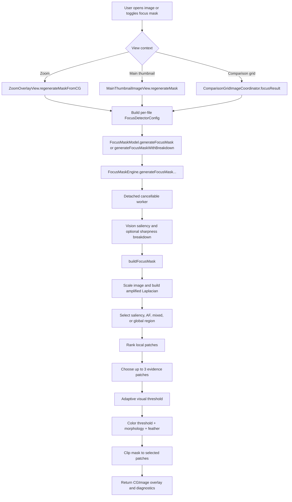

+++
author = "Thomas Evensen"
title = "Detailed Focus Mask Computation"
date = "2026-06-29"
weight = 42
tags = ["focus mask", "sharpness", "focus", "vision", "metal", "saliency"]
categories = ["technical details"]
mermaid = true
+++

# Detailed Focus Mask Computation

This page explains, step by step, how RawCull computes the visible focus mask: where the work starts in the UI, which model and engine methods run, how the bitmap overlay is produced, what the intermediate values mean, and which factors can change the final result.

The short version: the focus mask is not a camera focus-point display. It is a computed overlay built from local edge energy. RawCull first finds useful regions to inspect, then computes a Laplacian edge-energy image, ranks local patches, thresholds the strongest evidence, colorizes it, clips it to the selected patch areas, and finally draws the result over the photo.

The red focus-point marker and the focus mask are related but separate:

- the focus-point marker shows where the camera says autofocus was attempted,
- the focus mask shows where RawCull found likely in-focus edge detail,
- when an autofocus point exists, the mask can use it to choose and rank evidence.

## Source Map

| Responsibility | Main code |
|---|---|
| Focus-mask state and engine wrapper | `sourcecode/RawCull/Model/ViewModels/FocusandSharpness/FocusMaskModel.swift` |
| Immutable compute engine and cancellable worker helper | `sourcecode/RawCull/Model/ViewModels/FocusandSharpness/FocusMaskEngine.swift` |
| Focus-mask bitmap generation | `sourcecode/RawCull/Model/ViewModels/FocusandSharpness/FocusMaskEngine+MaskGeneration.swift` |
| Shared Laplacian edge-energy builder | `sourcecode/RawCull/Model/ViewModels/FocusandSharpness/FocusMaskEngine+Scoring.swift` |
| Config defaults and tunable factors | `sourcecode/RawCull/Model/ViewModels/FocusandSharpness/FocusDetectorConfig.swift` |
| Diagnostics and patch evidence types | `sourcecode/RawCull/Model/ViewModels/FocusandSharpness/FocusMaskTypes.swift` |
| Metal edge-energy kernel | `sourcecode/RawCull/Kernels.ci.metal` |
| Zoom overlay trigger and display | `sourcecode/RawCull/Views/ZoomViews/ZoomOverlayView.swift` |
| Main thumbnail trigger and display | `sourcecode/RawCull/Views/ThumbnailComponents/MainThumbnailImageView.swift` |
| Comparison-grid trigger and display | `sourcecode/RawCull/Views/ComparisonGridView/ComparisonGridImageCoordinator.swift`, `ComparisonImagePaneView.swift` |
| Focus-mask button | `sourcecode/RawCull/Views/FocusPeek/FocusMaskControlsView.swift` |
| Settings sliders | `sourcecode/RawCull/Views/Settings/FocusSettingsTab.swift` |
| AF marker overlay | `sourcecode/RawCull/Views/FocusPoints/FocusOverlayView.swift` |

## End-To-End Flow



## Step 1: The User Asks For A Mask

The focus mask can be generated from three user-facing places.

| Place | Trigger | What image is used |
|---|---|---|
| Zoom overlay | Opening/changing the zoom image, changing focus config, or toggling the mask button | `viewModel.zoomOverlayCGImage`, downscaled to width 1024 when larger |
| Main thumbnail/detail image | Toggling the focus-mask button or changing source/config | The currently displayed `NSImage` |
| Comparison grid | Loading comparison images or regenerating masks | Each comparison `CGImage`, downscaled to width 1024 when larger |

In `ZoomOverlayView`, mask generation is kicked off by `.task(id: viewModel.zoomOverlayCGImage?.hashValue)` and by changes to `viewModel.sharpnessModel.effectiveFocusConfig`. The concrete method is:

```text
ZoomOverlayView.regenerateMaskFromCG()
  -> FocusMaskModel.generateFocusMaskWithBreakdown(...)
```

In `MainThumbnailImageView`, the flow is:

```text
FocusMaskControlsView toggles showFocusMask
  -> MainThumbnailImageView.generateFocusMaskIfNeeded()
  -> MainThumbnailImageView.regenerateMask()
  -> FocusMaskModel.generateFocusMask(...)
```

In the comparison grid, the flow is:

```text
ComparisonGridImageCoordinator.loadState(...)
  -> populateFocusMask(...)
  -> focusResult(...)
  -> FocusMaskModel.generateFocusMaskWithBreakdown(...)
```

Example:

If the user opens a 6000 x 4000 RAW preview in the zoom overlay, `ZoomOverlayView` downsizes the `CGImage` to 1024 pixels wide before computing the mask. The displayed image can still be larger in the UI, but the mask computation runs on the smaller inspection image so the overlay is fast and memory-friendly.

## Step 2: RawCull Builds A Per-File Config

Before calling the engine, each view builds a `FocusDetectorConfig`.

The base config comes from:

```text
viewModel.sharpnessModel.effectiveFocusConfig
```

Then the view injects per-file metadata:

```text
config.iso = file.exifData?.isoValue ?? 400
config.apertureHint = FocusDetectorConfig.ApertureHint.from(aperture: file.exifData?.apertureValue)
afPoint = file.afFocusNormalized
```

If the file already has a sharpness score and the UI label says it is sharp, the view can also enable:

```text
config.guaranteeVisibleFocusEvidence = true
```

That flag is visual-only. It lets the mask relax the threshold if the selected evidence would otherwise be nearly invisible.

Example:

Suppose two files have the same subject and same edge detail:

| File | Metadata | Expected mask behavior |
|---|---|---|
| ISO 400, f/5.6 | Normal pre-blur | Fine edges survive more easily |
| ISO 6400, f/5.6 | Larger ISO blur factor | Noise is suppressed before edge detection, so random grain is less likely to be highlighted |

The ISO 6400 image may show fewer tiny red speckles, because `buildAmplifiedLaplacian` increases the blur radius before the Laplacian kernel runs.

## Step 3: FocusMaskModel Bridges UI And Engine

`FocusMaskModel` is `@Observable @MainActor`, because it belongs to UI state. It owns:

```text
var config = FocusDetectorConfig()
private nonisolated let engine = FocusMaskEngine()
```

It exposes two public generation methods:

| Method | Used when | Returns |
|---|---|---|
| `generateFocusMask(from:scale:configOverride:afPoint:evidence:)` | Main thumbnail/detail path | An `NSImage?` mask |
| `generateFocusMaskWithBreakdown(from:scale:configOverride:afPoint:)` | Zoom and comparison paths | A `CGImage?` mask plus `SaliencyInfo?` and `SharpnessBreakdown?` |

The distinction matters. The simple method can reuse existing `FocusEvidence` from previous scoring. The breakdown method computes or refreshes diagnostic information while generating the overlay.

Example:

If a file was already sharpness-scored, `MainThumbnailImageView` passes:

```text
viewModel.sharpnessModel.breakdowns[file.id]?.focusEvidence
```

That lets the overlay reuse the same winning region or patch evidence that explained the score, so the visual mask and the inspector diagnostics stay aligned.

## Step 4: FocusMaskEngine Runs Off The Main Actor

`FocusMaskEngine` is immutable and `@unchecked Sendable`. It owns a shared `CIContext` configured with:

```text
.workingColorSpace: NSNull()
.workingFormat: CIFormat.RGBAf
```

The engine methods call `runCancellableWorker`, which creates a detached task. That keeps Core Image, Vision, patch sampling, and Metal-backed filtering away from the main actor.

Cancellation checks appear throughout the pipeline:

- before saliency detection,
- before and after Laplacian creation,
- before patch ranking returns,
- before the UI stores the final mask.

Example:

If the user holds the right-arrow key in the zoom overlay, the selected image changes repeatedly. Each old `maskTask` is cancelled. RawCull avoids spending time finishing masks for images that are no longer visible.

## Step 5: The Engine Chooses Saliency And Breakdown Data

There are two engine entry points:

```text
FocusMaskEngine.generateFocusMask(...)
FocusMaskEngine.generateFocusMaskWithBreakdown(...)
```

The simpler path decides a saliency region only when needed:

```text
if evidence has winningSaliencyRect:
    use it
else if config.isolateMaskToSubject:
    run Vision saliency and select a candidate
else:
    use no salient region
```

The breakdown path always does more diagnostic work:

```text
detectSaliencyAndClassify(...)
computeSharpnessBreakdown(...)
buildFocusMask(...)
store mask diagnostics back into breakdown
```

This is why zoom and comparison views can later show fields like:

- mask region,
- mask threshold,
- winning region,
- rendered region,
- location confidence,
- selected patch summaries.

## Step 6: buildFocusMask Starts With A Scaled CIImage

The private method that actually builds the bitmap is:

```text
FocusMaskEngine.buildFocusMask(...)
```

Its first real image operation is:

```text
scaledImage = inputImage.transformed(by: CGAffineTransform(scaleX: scale, y: scale))
rawLaplacian = buildAmplifiedLaplacian(from: scaledImage, config: config)
```

Most callers pass `scale: 1.0`, because they already choose an appropriate source image size before calling the engine.

The Laplacian image is the raw focus-evidence map. Bright pixels mean strong local second-derivative edge energy. Flat pixels are dark.

## Step 7: The Shared Laplacian Pipeline Computes Edge Energy

`buildAmplifiedLaplacian` lives in `FocusMaskEngine+Scoring.swift`, because both sharpness scoring and focus-mask rendering use it.

It does three things:

1. apply Gaussian pre-blur,
2. run the Metal `focusLaplacian` kernel,
3. multiply the edge energy by `config.energyMultiplier`.

The effective blur radius is:

```text
effectiveRadius = preBlurRadius * isoFactor * resFactor * apertureBlurDamp
```

Where:

| Factor | Code source | Impact |
|---|---|---|
| `preBlurRadius` | Focus settings / preset | Higher values ignore more tiny texture and noise |
| `isoFactor` | `isoScalingFactor(iso:)` | Higher ISO increases blur to suppress noise |
| `resFactor` | `resolutionScalingFactor(for:)` | Larger images get proportionally more blur |
| `apertureBlurDamp` | `config.apertureHint.blurDamp` | Landscape apertures damp the blur to preserve whole-frame detail |

The Metal kernel in `Kernels.ci.metal` samples a 3 x 3 neighborhood:

```text
laplace = 8 * center - sum(8 neighbors)
energy = luminance_weighted_absolute_laplace
```

It writes the same scalar energy to RGB with alpha 1. Downstream Core Image filters can then threshold or colorize the result without converting formats.

Example:

Imagine a black bird eye surrounded by bright feathers:

- at the dark pupil edge, neighboring pixels change abruptly, so Laplacian energy is high,
- on a smooth out-of-focus background, neighboring pixels are similar, so energy is near zero,
- on high-ISO grain, raw energy could be high, but pre-blur reduces isolated noise before the kernel sees it.

## Step 8: Border Artifacts Are Removed

If `config.borderInsetFraction > 0`, `buildFocusMask` masks out the outer border of the Laplacian:

```text
innerRect = scaledImage.extent.insetBy(
    dx: width * borderInsetFraction,
    dy: height * borderInsetFraction
)
boostedLaplacian = rawLaplacian cropped to innerRect over black background
```

This prevents Gaussian blur and kernel edge behavior near the image border from creating false highlighted edges.

Example:

A bright sky frame with a dark border or vignette can produce strong edge energy at the frame boundary. The border inset stops that artifact from becoming the "best focus" evidence.

## Step 9: Raw Laplacian Debug Mode Can Return Early

When:

```text
config.showRawLaplacian == true
```

`buildFocusMask` returns the boosted Laplacian directly instead of a colorized, thresholded, clipped focus mask.

This mode is useful for debugging. It shows the whole edge-energy field rather than the final user-facing mask. It is not the normal overlay users see during culling.

## Step 10: RawCull Selects The Search Region

The normal path decides where to look for focus evidence.

If:

```text
config.isolateMaskToSubject == true
```

RawCull calls:

```text
focusMaskRegionSelection(
    extent: scaledImage.extent,
    salientRegion: salientRegion,
    afPoint: afPoint,
    afRegionRadius: config.afRegionRadius
)
```

That can produce:

| Region source | Meaning |
|---|---|
| `saliency` | Vision found a subject region |
| `afPoint` | Camera AF point exists and creates an AF rectangle |
| `saliencyAndAF` | Both are available |
| `none` | Neither is available |

If subject isolation is disabled, the search region becomes the full image extent.

Coordinate note: AF points are stored in normalized image coordinates, but Core Image and Vision-style rectangles use different vertical orientation conventions in this code path. The engine flips the Y coordinate with:

```text
visionY = 1.0 - afPoint.y
```

Example:

If the camera AF point is at `(0.50, 0.35)` in normalized display coordinates, the Core Image search center becomes approximately `(0.50, 0.65)` in the unit rectangle used by the mask selection helper.

## Step 11: The Visual Evidence Region Is Chosen

The mask can be asked to visualize a specific kind of evidence. `FocusEvidenceRegion` can be:

| Value | Meaning |
|---|---|
| `afCenter` | Very tight region around the AF point |
| `afNeighborhood` | Wider neighborhood around the AF point |
| `afPoint` | AF rectangle from `afRegionRadius` |
| `saliency` | Vision subject rectangle |
| `mixed` | AF and saliency regions together |
| `global` | Whole image |
| `none` | Let the code pick a fallback |

If no explicit evidence region is available, the fallback order is:

```text
AF point if available
else saliency if available
else global
```

Example:

For a bird photo with a parsed AF point on the eye, the mask usually prefers AF-anchored evidence. For a portrait without an AF point but with a detected salient face/body region, it uses saliency. For a landscape with no subject and no AF point, it falls back to global edges.

## Step 12: AF-Anchored Masks Get A Finer Local Laplacian

When AF evidence exists, the mask builds a second local Laplacian with less blur:

```text
fineConfig.preBlurRadius = max(0.35, config.preBlurRadius * 0.52)
fineLaplacian = buildAmplifiedLaplacian(from: scaledImage, config: fineConfig)
```

This is visual-overlay behavior. It helps small AF-local details survive the normal noise-reduction blur.

Example:

A small bird eye may be only a few pixels wide in the downscaled preview. The primary Laplacian is good at avoiding noisy false positives, but it can soften the tiny eye highlight. The finer AF pass helps the local patch ranking see that compact detail.

## Step 13: AF-Weighted Source Can Favor The Center

For AF-local search rectangles, the engine can apply:

```text
centerWeightedLaplacian(...)
```

This creates a radial gradient centered on the AF point and multiplies it with the Laplacian. Details closer to the AF point keep more weight; details near the edge of the AF rectangle lose weight.

Example:

If the AF rectangle covers both the bird's eye and a high-contrast branch just beside the head, center weighting helps the eye region win when it is close to the camera's AF point.

## Step 14: Search Regions Become Patch Rankings

For each selected search region, the engine calls:

```text
patchRankings(in:sourceImage:extent:afPoint:visualRegion:context:)
```

That method tiles the region with overlapping patches:

```text
patchWidth  = clamp(region.width  * 0.34, image.width  * 0.035, image.width  * 0.14)
patchHeight = clamp(region.height * 0.34, image.height * 0.035, image.height * 0.14)
stepX = patchWidth  * 0.50
stepY = patchHeight * 0.50
```

It also adds a patch centered on the AF point when possible.

Each patch is scored by:

```text
patchRanking(for:searchRegion:sourceImage:extent:afPoint:visualRegion:context:)
```

The ranking records:

- robust high-end edge energy,
- micro-contrast,
- threshold coverage,
- distance to AF point,
- silhouette fraction,
- ring/compact detail shape,
- linear-edge penalty,
- whether the patch contains the AF point,
- final composite score.

## Step 15: Patch Composite Score Decides Which Area Is Worth Showing

The patch composite is built roughly like this:

```text
composite =
    robustTailScore
  + microContrast * 0.35
  + coverage * 0.08
  + afProximity * 0.12
  + interiorBonus
  - silhouetteFraction * silhouettePenalty
  + eyeHeadHeuristicAdjustment
```

The exact code clamps the result to zero or above.

The intent is to prefer patches with real interior detail, not just any contrast line.

| Component | What it rewards or penalizes |
|---|---|
| `robustTailScore` | Strong but robust edge-energy tail |
| `microContrast` | Local variation inside the patch |
| `coverage` | Enough pixels above a local threshold |
| `afProximity` | Closeness to the AF point |
| `interiorBonus` | Patches not touching the search boundary |
| `silhouetteFraction` | Penalizes outline-only detail |
| `ringDetailScore` / `compactDetailScore` | Rewards compact subject-like detail |
| `linearEdgePenalty` | Penalizes a single long line masquerading as focus |
| `belowAFPenalty` | In AF mode, penalizes patches too far below the AF point |

Example:

Consider a bird against the sky:

- Patch A covers the bird's outline only. It has strong edges but little interior texture, so silhouette penalty applies.
- Patch B covers the eye and feather detail. It has compact/ring detail and real micro-contrast, so it gets a stronger composite score.
- Patch C covers a branch near the AF point. It has high linear edge energy, but the linear-edge penalty can reduce it.

The final mask should prefer Patch B.

## Step 16: Up To Three Evidence Patches Are Selected

After ranking all patches, RawCull calls:

```text
selectEvidencePatches(from:rankings, visualRegion:visualRegion)
```

The selection rules are:

1. discard patches with non-finite or zero composite score,
2. sort strongest first,
3. in AF-anchored mode, prefer the nearest AF patch if it is within 15% of the strongest patch's score,
4. keep patches that do not overlap too much,
5. stop after three patches.

Overlap is rejected when:

```text
overlapRatio(candidate, selected) >= 0.55
```

Example:

If the top three ranked patches all sit on the same bird eye, RawCull keeps the best one and skips heavily overlapping duplicates. It may then include a nearby feather patch or head patch so the overlay shows a compact area of focus evidence rather than three identical rectangles.

## Step 17: The Visual Threshold Is Adaptive

RawCull samples the selected patch rectangles from the boosted Laplacian:

```text
visualSamples = redSamples(in: selectedPatchRects, from: boostedLaplacian)
```

Then it computes:

```text
adaptiveVisualThreshold(
    samples,
    fallback: config.threshold,
    percentile: AF anchored ? 0.82 : 0.90,
    floorMultiplier: AF anchored ? 0.32 : 0.55,
    capAtFallback: AF anchored
)
```

This means the threshold is derived from the actual local evidence distribution, not only from the settings slider.

| Mode | Percentile | Practical effect |
|---|---:|---|
| AF-anchored | 82nd percentile | More willing to show local evidence around AF |
| Saliency/global | 90th percentile | Stricter; highlights only stronger subject/global edges |

The result is clamped to:

```text
max(fallback * floorMultiplier, 0.01) ... 0.95
```

Example:

If a subject has weak but consistent feather detail, the local percentile threshold may settle below the global `config.threshold`, allowing visible edges. If a subject has very strong contrast, the threshold rises so the mask does not flood the entire region.

## Step 18: The Mask Can Relax Threshold For Visibility

If:

```text
config.guaranteeVisibleFocusEvidence == true
```

RawCull checks coverage:

```text
coverage = pixelsAboveThreshold / sampledPixels
```

If coverage is below:

```text
config.minimumEvidenceCoverage
```

it tries a relaxed threshold using the 70th percentile and a lower floor.

Example:

A file can score as sharp because a small AF-local detail patch is genuinely strong, but the visual threshold might produce only a few red pixels. With visibility guarantee enabled, the overlay can relax enough to make that focus evidence inspectable. This changes the overlay, not the saved score.

## Step 19: Edges Are Thresholded, Cleaned, And Colorized

The method:

```text
buildColorizedThresholdedEdges(from:threshold:config:)
```

turns the boosted Laplacian into the red/orange overlay.

It performs:

1. `CIColorMatrix` to extract edge energy into grayscale,
2. `CIColorThreshold` using the adaptive visual threshold,
3. optional `CIMorphologyMinimum` for erosion,
4. optional `CIMorphologyMaximum` for dilation,
5. a small `CIMorphologyMinimum` to thin the dilated result,
6. `CIColorMatrix` to colorize the binary mask.

The colorization uses strong red, a little green, very little blue, and high alpha:

```text
red   = 1.0
green = 0.22
blue  = 0.02
alpha = 0.92
```

Example:

If `erosionRadius` is raised, isolated noise pixels disappear more aggressively. If `dilationRadius` is raised, nearby edge fragments connect and look more continuous. Too much dilation can make the mask look thick; too much erosion can remove legitimate fine detail.

## Step 20: The Mask Is Clipped To Selected Evidence Patches

The red edge image still covers the whole Laplacian extent. RawCull clips it to selected patch rectangles:

```text
clip(edgeMask, to: patchRects, extent: scaledImage.extent)
```

This creates a white mask from the selected rectangles and blends the colorized edges through it.

If `config.featherRadius > 0`, the clipped mask is then Gaussian-blurred slightly:

```text
feather.radius = config.featherRadius
```

Finally the result is cropped back to the image extent and rendered:

```text
context.createCGImage(croppedMask, from: croppedMask.extent)
```

Example:

A photo may contain sharp grass in the background and a slightly soft bird in the foreground. If the selected evidence region is saliency or AF, clipping prevents background grass from covering the whole overlay. The mask can still show the best subject-local evidence, even if other parts of the frame have stronger raw texture.

## Step 21: Diagnostics Are Returned With The Mask

The engine returns:

```text
FocusMaskRenderResult(
    image: CGImage?,
    diagnostics: FocusMaskDiagnostics,
    evidence: FocusEvidence?
)
```

For the breakdown path, `generateFocusMaskWithBreakdown` stores:

```text
breakdown.focusMaskRegionSource = maskResult.diagnostics.regionSource
breakdown.focusMaskVisualThreshold = maskResult.diagnostics.visualThreshold
breakdown.focusEvidence = maskResult.evidence
```

The UI can then show those values in `CandidateInspectorView`.

Important diagnostic fields include:

| Field | Meaning |
|---|---|
| `focusMaskRegionSource` | Whether the mask had saliency, AF, both, or neither |
| `focusMaskVisualThreshold` | Final threshold used for the overlay |
| `focusEvidence.winningRegion` | Region selected by the scoring/evidence logic |
| `focusEvidence.visualizedRegion` | Region actually rendered by the mask |
| `focusEvidence.maskCoverage` | Fraction of sampled pixels above threshold |
| `focusEvidence.relaxedForVisibility` | Whether visibility relaxation was used |
| `focusEvidence.patchRankings` | Ranked local patches and their metrics |
| `focusEvidence.focusEvidenceConfidence` | High, medium, or low confidence explanation |

Example:

If the inspector says:

```text
Mask Region: AF + saliency
Rendered Region: AF point
Evidence Threshold: 0.31
Location Confidence: High
Reason: AF-local patch is spatially aligned
```

that means RawCull had both subject and AF data, chose an AF-local visualization, used an adaptive threshold of 0.31, and found the selected patch close enough to the AF point to trust its location.

## Step 22: The UI Draws The Mask Over The Image

In `ZoomOverlayView`, the final drawing is:

```text
if showFocusMask, let mask = focusMask {
    Image(decorative: mask, scale: 1.0, orientation: .up)
        .resizable()
        .scaledToFit()
        .blendMode(.screen)
        .opacity(0.95)
}
```

The same visual idea is used by thumbnail and comparison image views: the generated bitmap is drawn above the source image, aligned to the same aspect-fit frame.

The separate focus-point overlay uses `FocusPointMarker` and red corner brackets. It is controlled by `showFocusPoints`, not by the focus-mask image.

## What Most Affects The Result

| Factor | Where it comes from | Impact on mask |
|---|---|---|
| Source image size and quality | Zoom/thumbnail/comparison loaders | More pixels can expose fine detail, but increase compute and may require more blur |
| `preBlurRadius` | Focus settings and presets | Higher ignores noise/texture; lower preserves tiny details |
| ISO | EXIF per file | Higher ISO increases blur factor to avoid grain highlights |
| Aperture hint | EXIF f-number | Landscape apertures reduce blur damp and scoring saliency dominance |
| `threshold` | Focus settings/calibration | Higher shows fewer, stronger edges; lower shows more edges |
| `energyMultiplier` | Focus settings | Raises visual edge energy before thresholding |
| `erosionRadius` | Focus settings | Removes isolated small mask pixels |
| `dilationRadius` | Focus settings | Connects and expands nearby edge pixels |
| `featherRadius` | Config default/settings persistence | Softens the clipped overlay |
| AF point availability | MakerNote parsing during scan | Can anchor patch selection near the focus attempt |
| Saliency availability | Vision saliency | Can isolate the mask to subject-like regions |
| Existing score breakdown | `SharpnessScoringModel.breakdowns` | Can reuse previous winning evidence |
| `guaranteeVisibleFocusEvidence` | Enabled for images labeled sharp in some views | Can relax the threshold so weak but valid evidence is visible |
| Cancellation/navigation | UI task lifecycle | Prevents stale masks from being shown after image changes |

## Practical Examples

### Example 1: Sharp Bird Eye, Busy Background

Inputs:

- AF point exists on or near the bird's eye,
- Vision saliency finds the bird,
- background branches contain many high-contrast lines.

Likely flow:

1. region source becomes `saliencyAndAF`,
2. visual region falls back to AF-local evidence,
3. fine Laplacian and center weighting favor the AF area,
4. patches around the eye/head outrank branch patches,
5. the mask is clipped to one to three subject-local patches.

Result:

The overlay should highlight small red/orange edges around the eye, head, or feather detail instead of painting every sharp branch in the frame.

### Example 2: Bird Outline Sharp, Interior Soft

Inputs:

- subject silhouette has strong edge contrast,
- eye and feather interior are soft,
- saliency finds the bird.

Likely flow:

1. outline patches produce high raw Laplacian energy,
2. `silhouetteFraction` rises because edge energy is concentrated near the outside of the patch,
3. the silhouette penalty reduces composite score,
4. if no stronger interior patch exists, confidence may be medium or low.

Result:

The mask may show less than expected, or it may highlight only the best available edge. This is intentional: a sharp outline alone does not prove the subject detail is in focus.

### Example 3: High-ISO Indoor Portrait

Inputs:

- ISO is high,
- face/subject is visible,
- image contains sensor noise in flat areas.

Likely flow:

1. `isoScalingFactor` increases the pre-blur radius,
2. isolated grain is smoothed before the Metal Laplacian,
3. patches with real facial detail keep stronger micro-contrast,
4. erosion removes remaining isolated noise pixels.

Result:

The overlay should avoid sparkling across flat walls or skin noise. It should prefer consistent detail such as eyes, eyelashes, hair, or clothing texture.

### Example 4: Landscape With No Clear Subject

Inputs:

- no useful AF point,
- Vision saliency may be weak or irrelevant,
- aperture is f/8 or smaller.

Likely flow:

1. if subject isolation cannot find a useful region, mask falls back toward global evidence,
2. landscape aperture hint damps blur so whole-frame detail is not smoothed away,
3. global patches are ranked by robust edge energy and micro-contrast.

Result:

The mask can show distributed detail in trees, rocks, buildings, or horizon texture. This is different from a wildlife frame, where background detail is intentionally less important.

### Example 5: Mask Looks Sparse On A Sharp Image

Inputs:

- image has a high sharpness score,
- selected patch is small,
- adaptive threshold is strict.

Likely flow:

1. the score can be high from compact, reliable evidence,
2. the visual mask may still have low coverage,
3. if the image is labeled sharp, `guaranteeVisibleFocusEvidence` may relax the threshold,
4. diagnostics set `relaxedForVisibility = true`.

Result:

The overlay becomes easier to inspect, but this does not change the computed sharpness score.

## Common Misreadings

| Observation | What it usually means |
|---|---|
| Mask does not cover the whole sharp subject | RawCull clips to the strongest evidence patches, not every sharp pixel |
| Mask appears near AF point instead of most contrasty background | AF evidence is being trusted as the focus attempt |
| Mask is global-only | No usable AF/saliency evidence was available, or the winning evidence asked for global |
| Mask is sparse | Threshold is high, evidence is compact, or visibility relaxation is off |
| Mask highlights outline but confidence is low/medium | Silhouette/linear-edge penalties may see outline contrast without enough interior detail |
| Focus-point brackets and mask disagree | The camera AF point and computed edge evidence are separate signals |

## How To Debug A Surprising Mask

Start with the inspector fields, because they tell you why a mask was drawn where it was.

1. Check `Mask Region`: did the engine have saliency, AF, both, or neither?
2. Check `Winning Region` and `Rendered Region`: did it choose AF, saliency, mixed, or global?
3. Check `Evidence Threshold`: a high value means only very strong edges survived.
4. Check `Evidence Coverage`: very low coverage means the mask is intentionally sparse.
5. Check `Visibility Relaxed`: if yes, the overlay was made more visible for inspection.
6. Check the top patch summaries: look for AF distance, coverage, silhouette fraction, and composite score.
7. Toggle focus points: compare the red AF marker with the red/orange computed mask.
8. Adjust settings one at a time: threshold, pre-blur, amplify, erosion, dilation.

## Change Checklist

When changing focus-mask behavior, check these code paths together:

- `FocusMaskEngine+MaskGeneration.swift` for visual overlay logic,
- `FocusMaskEngine+Scoring.swift` for shared Laplacian behavior,
- `FocusDetectorConfig.swift` for defaults and settings impact,
- `ZoomOverlayView.swift` for zoom mask generation and diagnostics persistence,
- `MainThumbnailImageView.swift` for thumbnail/detail mask generation,
- `ComparisonGridImageCoordinator.swift` for comparison-grid masks,
- `CandidateInspectorView.swift` for diagnostics display.

Be especially careful with `buildAmplifiedLaplacian`. It is shared by visual focus masks and sharpness scoring. A change there can alter both the overlay and the numeric score behavior.
