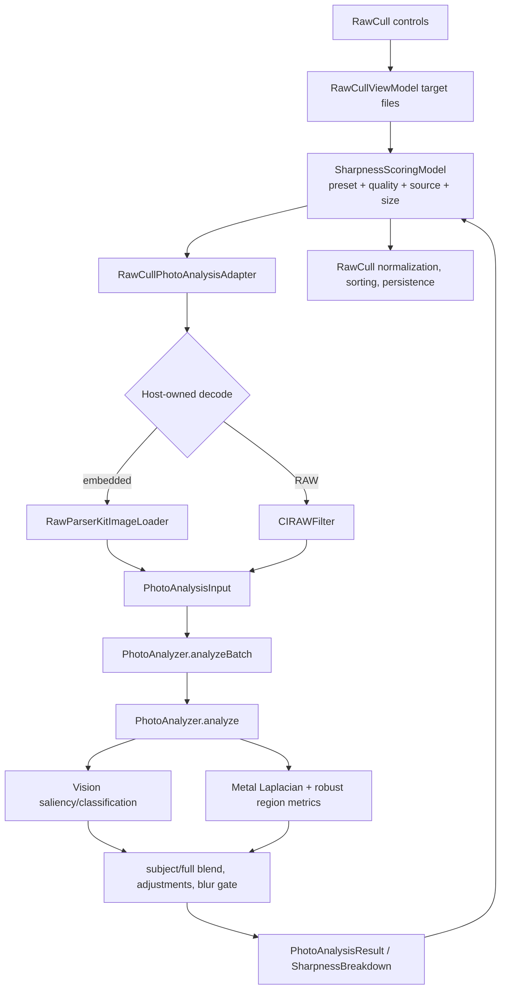

+++
author = "Thomas Evensen"
title = "Detailed Sharpness Scoring"
date = "2026-08-21"
weight = 41
tags = ["sharpness", "focus", "scoring", "vision", "metal", "saliency"]
categories = ["technical details"]
mermaid = true
+++

# Detailed Sharpness Scoring

This is the algorithm-level reference for scalar sharpness at
**PhotoAnalysisKit 1.2.0**, revision
**6e83ceebbca47a5dea0b1b2b4ee8b9132c281449**. RawCull chooses files and image
sources, maps UI settings, bounds work, publishes progress, normalizes badges,
and persists results. PhotoAnalysisKit owns the analysis formula.

For ownership, cancellation, calibration, and UI flow, start with
[Focus Mask And Sharpness](../focusmask/). This page concentrates on the
package algorithm and names RawCull policy only where it changes package input
or consumes package output.

## Compact Worked Example

Consider a wildlife frame after Laplacian sampling:

```text
full-frame robust score                 0.18
AF broad score                          0.30
Vision salient broad score              0.24
best AF-local patch                     0.34
best salient-interior patch             0.28
wildlife salient weight                 0.85
subject saliency area                   ignored because AF exists
subject border fraction                 0.50 (below silhouette trigger)
subject micro-contrast                  0.020
aperture                                f/5.6 -> wide gate 0.010...0.025
```

The actual pipeline combines the evidence in stages:

```text
broad subject = 0.6 * 0.30 + 0.4 * 0.24 = 0.276

local detail  = 0.6 * 0.34 + 0.4 * 0.28 = 0.316
subject       = 0.75 * 0.276 + 0.25 * 0.316 = 0.286

base          = 0.15 * 0.18 + 0.85 * 0.286 = 0.2701

blur t        = (0.020 - 0.010) / (0.025 - 0.010) = 0.6667
attenuation   = 0.20 + 0.80 * 0.6667 = 0.7333

final         = 0.2701 * 0.7333 = about 0.198
```

There is no silhouette penalty because 50% is below 62%, and no subject-size
bonus because an AF region exists. The final value is a raw relative score, not
a percentage. RawCull later normalizes it against the catalog denominator for a
badge.

The numeric values above are illustrative inputs to the current formulas; they
are not fixture output from a particular image.

## End-To-End Boundary



## 1. RawCull-Owned Input Policy

### Target Files

`RawCullViewModel.sharpnessScoringTargetFiles` chooses, in order:

1. explicitly selected files, keeping visible selected files first and appending
   selected files hidden by the current projection;
2. the exact active star-rating set;
3. otherwise the active catalog set, including semantic-search scope, sorted by
   filename.

Calibration and scoring use the same target array. After a non-cancelled,
nonempty result, RawCull merges scores and subject labels into `CullingModel`
and reapplies catalog sorting.

Protected by:
`RawCullTests/CullingModelTests.swift` target-scope and
`calibrateAndScoreCurrentCatalog` tests.

### Preset And Quality

RawCull starts from the shared focus config, then applies the selected
PhotoAnalysisKit preset and quality.

| RawCull photo type | Package changes from the input config |
|---|---|
| Auto | No preset change |
| Birds/Wildlife | pre-blur 2.2; border 0.05; salient weight and explicit override 0.85; size factor 0.05; silhouette strength 0.55; AF radius 0.06; classify and isolate |
| Portrait | pre-blur at most 1.7; salient weight/override 0.80; size factor 0.08; silhouette 0.25; AF radius 0.10; classify and isolate |
| Landscape | pre-blur at most 1.55; salient weight 0.35 with explicit override 0.35; size factor 0; silhouette 0.15; AF radius 0; do not isolate mask |
| Action | pre-blur 2.0; salient weight/override 0.65; size factor 0.05; silhouette 0.40; AF radius 0.09; classify and isolate |

| Quality | Package fine-detail weight | RawCull minimum size | RawCull concurrency |
|---|---:|---:|---:|
| Fast | 0 | 512 | 6 |
| Balanced | at least 0.25 | 768 | 4 |
| High Precision | at least 0.45 and classification enabled | 1024 | 3 |

The effective maximum pixel size is clamped between the quality minimum and
2048. RAW demosaic further caps concurrency at 2.

Protected by: `RawCullTests/SharpnessScoringTests.swift` preset, quality, size,
and concurrency assertions; package policy also has
`PhotoAnalysisKitTests/SharpnessMetricsTests.swift`.

### Image Source

| Source | RawCull implementation |
|---|---|
| Embedded Preview | `RawParserKitImageLoader.shared.thumbnailCGImage` at the effective size |
| RAW Demosaic | Concurrent `CIRAWFilter` decode; sharpness 0, detail 0.6, contrast 1.0, exposure 0; scale longest side to effective size |

The adapter returns `PhotoAnalysisInput(image:iso:aperture:normalizedAFPoint:)`.
PhotoAnalysisKit never opens RawCull files and does not choose a source.

Protected by:
`RawCullTests/PhotoAnalysisKitIntegrationTests.swift` and adapter overrides in
`RawCullTests/SharpnessScoringTests.swift`.

## 2. Package Defaults And Per-Image Resolution

The default `SharpnessConfiguration` values at the pinned revision are:

| Value | Default | Role |
|---|---:|---|
| `preBlurRadius` | 1.92 | Shared edge-energy input |
| `iso` | 400 | Replaced from each input |
| `threshold` | 0.46 | Mask presentation only |
| `energyMultiplier` | 7.62 | Stable scoring and shared edge gain |
| `borderInsetFraction` | 0.04 | Scalar full-frame border exclusion; also blackens mask border |
| `salientWeight` | 0.75 | Scalar subject/full blend |
| `subjectSizeFactor` | 0.10 | Scalar saliency-only size bonus |
| `silhouettePenaltyStrength` | 0.55 | Scalar penalty maximum |
| `fineDetailBlendWeight` | 0 | Scalar second pass |
| `enableSubjectClassification` | true | Label only; saliency candidates are still analysis evidence |
| `afRegionRadius` | 0.12 | Broad AF scoring region |
| `afCenterRegionRadius` | 0.025 | Evidence diagnostic/local region |
| `afNeighborhoodRegionRadius` | 0.075 | Evidence diagnostic/local-patch region |
| `apertureHint` | mid | Replaced from each input |

`PhotoAnalyzer.analyze` copies the config, sets the input ISO, and derives:

| Aperture | Hint | Blur gate low/high | Blur damp | Fallback salient override |
|---|---|---|---:|---:|
| f/5.6 or wider | wide | 0.010 / 0.025 | 1.0 | none |
| between f/5.6 and f/8 | mid | 0.008 / 0.022 | 1.0 | none |
| f/8 or narrower | landscape | 0.006 / 0.018 | 0.8 | 0.55 |
| missing | mid | 0.008 / 0.022 | 1.0 | none |

An explicit preset override wins over the aperture fallback.

Protected by:
`PhotoAnalysisKitTests/SharpnessMetricsTests.swift` and
`RawCullTests/SharpnessScoringTests.swift`.

## 3. Normalization And Vision

PhotoAnalysisKit normalizes the decoded `CGImage` to sRGB RGBA before
analysis. Vision produces attention-based saliency candidates. Classification,
when enabled, is additional metadata; it is not itself a score.

For each candidate, the engine computes a local detail score. Candidate
selection favors AF containment/alignment when an AF point exists, then uses
Vision confidence, detail, and area as tie-break evidence. Vision rectangles
use a bottom-origin coordinate convention; the rendered bitmap is sampled with
the Y coordinate inverted so the intended pixels are measured.

Protected by:
`PhotoAnalysisKitTests/PhotoAnalyzerTests.swift` and integration mask tests.

## 4. Edge-Energy Image

The package applies:

```text
isoFactor:
  ISO < 800          -> 1.0
  800 <= ISO < 3200  -> 1.0 + (ISO - 800) / 2400 * 0.6
  ISO >= 3200        -> min(1.6 + (ISO - 3200) / 6400 * 0.6, 2.2)

resolutionFactor =
  clamp(sqrt(max(longestSide, 512) / 512), 1, 3)

effective blur radius =
  min(preBlurRadius * isoFactor * resolutionFactor * apertureBlurDamp, 100)
```

After Gaussian pre-blur, the Metal `focusLaplacian` kernel computes:

```text
laplace = 8 * center - sum(the 8 neighboring pixels)
energy  = dot(abs(laplace.rgb), [0.299, 0.587, 0.114])
```

A color matrix multiplies that energy by 7.62. The scoring image is cropped back
to the source extent because Gaussian blur expands its extent.

Balanced and High Precision additionally build a fine pass with:

```text
fine pre-blur = max(0.35, primary pre-blur * 0.58)
combined      = primary * (1 - w) + fine * w
w             = clamped to 0...0.65
```

Protected by:
`PhotoAnalysisKitTests/SharpnessMetricsTests.swift` ISO and numeric helper
tests, and `PhotoAnalysisKitTests/PhotoAnalyzerTests.swift` end-to-end tests.

## 5. Region Samples And Robust Tail Score

The engine creates these sample sets:

- full frame, excluding `borderInsetFraction` on every edge;
- each Vision candidate;
- a broad AF square with half-size `afRegionRadius`;
- AF-center and AF-neighborhood squares for evidence;
- best local patches within the AF neighborhood and winning saliency region.

A region needs 64 samples for broad scalar use; the tighter AF center needs 16.

For any nonempty sample array:

```text
p20 = sample at floor((n - 1) * 0.20)
p90 = sample at floor((n - 1) * 0.90)
p97 = sample at floor((n - 1) * 0.97)

band mean = mean(max(0, value - p20))
            for original samples where p90 <= value <= p97

density = min(1, (bandCount / n) / 0.06)
robust tail score = band mean * density
```

If p97 is not greater than p90, or the band is unexpectedly empty, the fallback
is `max(0, p90 - p20)`. The density factor keeps a few isolated edges or noise
spikes from scoring like dense detail. Micro-contrast is the standard deviation
of finite Laplacian samples.

Protected by:
`PhotoAnalysisKitTests/SharpnessMetricsTests.swift` and the forwarding checks
in `RawCullTests/SharpnessScoringTests.swift`.

## 6. Subject Construction

The broad subject score is:

```text
AF and saliency present -> 0.6 * AF + 0.4 * saliency
only one present        -> that score
neither present         -> nil
```

The local detail score uses the same 0.6/0.4 blend for the best AF-local and
salient-interior patches. The effective subject is conservative:

```text
broad and local present -> 0.75 * broad + 0.25 * local
only one present        -> that score
```

This prevents one tiny high-energy patch from replacing the broad subject
measurement while still rewarding localized detail.

Protected by package numeric/source tests around
`conservativeSubjectScore` and focus evidence in
`PhotoAnalysisKitTests/SharpnessMetricsTests.swift`.

## 7. Full/Subject Blend And Adjustments

When both full and subject scores exist:

```text
weight = explicit preset override
         ?? aperture hint override
         ?? config.salientWeight

base = full * (1 - weight) + subject * weight
```

Two adjustments occur before the blur gate:

1. **Silhouette penalty.** The package compares average energy in the outer 12%
   of the effective subject region with its interior. If the derived border
   fraction exceeds 0.62:

   ```text
   over = min(1, (borderFraction - 0.62) / 0.38)
   base *= 1 - silhouettePenaltyStrength * over
   ```

2. **Subject-size bonus.** Only when no AF region exists and Vision supplied the
   subject:

   ```text
   base *= 1 + saliencyArea * subjectSizeFactor
   ```

Fallbacks are intentionally asymmetric:

```text
full only    -> full * (1 - weight)^3
subject only -> subject
neither      -> no analysis
```

Protected by:
`PhotoAnalysisKitTests/SharpnessMetricsTests.swift` preset and failure-policy
tests, plus `PhotoAnalyzerTests.swift`.

## 8. Aperture-Aware Blur Gate

The effective AF analysis is preferred over saliency for subject
micro-contrast. With at least 64 samples:

```text
t = clamp((sigma - blurGateLow) / (blurGateHigh - blurGateLow), 0, 1)
attenuation = 0.20 + 0.80 * t
final score = base * attenuation
```

Without a valid subject sample set, attenuation is 1.0.

Focus-failure classification is diagnostic:

- **motion blur** when global, subject, and AF-or-subject are all below 0.08 and
  sigma is below 0.012;
- **missed focus** when global is at least 0.12 and subject/global is below 0.55;
- otherwise **none**.

Protected by:
`PhotoAnalysisKitTests/SharpnessMetricsTests.swift` focus-failure and aperture
tests.

## 9. Score Range, UI Normalization, And Persistence

The package score is nonnegative for valid finite inputs, but the implementation
does **not** clamp the final score to 1.0. The subject-size multiplier can also
raise the blended value. Treat the output as a stable relative metric, not a
percentage or probability.

RawCull stores the raw value. It computes a badge denominator from the lone
score, small-set maximum, or large-set 90th-percentile element and clamps the UI
ratio to 0...1. That presentation normalization does not change the stored
score or burst-ranking input.

`SharpnessAnalysisDescriptor` schema 1 / algorithm 4 identifies package
behavior. It includes scoring-affecting config and policy versions, excludes
mask-only settings and per-image values, and fixes the scoring gain at 7.62.
RawCull adds source and effective pixel size, then validates source file size
and modification date on reload. Legacy descriptors decode but are stale.

Protected by:

- `PhotoAnalysisKitTests/SharpnessAnalysisDescriptorTests.swift`;
- `RawCullTests/SharpnessScoringTests.swift`;
- `RawCullTests/CullingModelTests.swift`.

## Change Checklist

When changing scoring:

1. change package code and package tests first;
2. decide whether the scalar algorithm or ISO/aperture policy version must
   increase;
3. verify descriptor tests include every scalar-affecting setting and exclude
   mask-only presentation;
4. verify RawCull preset, quality, source, and size mapping;
5. test batch cancellation and latest-generation publication;
6. inspect raw score distributions separately from normalized badge labels;
7. update this reference and the overview together.
