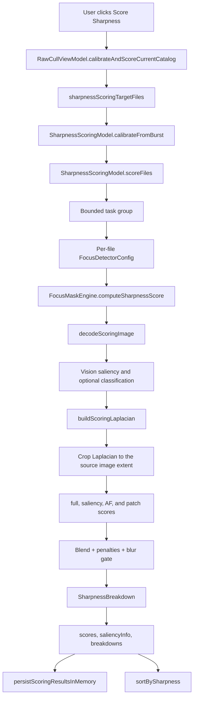

+++
author = "Thomas Evensen"
title = "Detailed Sharpness Scoring"
date = "2026-07-15"
weight = 41
tags = ["sharpness", "focus", "scoring", "vision", "metal", "saliency"]
categories = ["technical details"]
mermaid = true
+++

# Detailed Sharpness Scoring

This page explains, step by step, where RawCull computes sharpness scores, what code is involved, what the score means, and which factors can move the result up or down.

The short version: RawCull does not ask "is the whole image contrasty?". It asks "how much reliable edge detail exists in the useful part of the image, especially around the subject or the camera AF point?". The score is then used for sharpness sorting, burst ranking, saved scoring results, and inspection badges.

## Source Map

| Responsibility | Main code |
|---|---|
| User-facing score state, options, progress, cancellation | `sourcecode/RawCull/RawCull/Model/ViewModels/FocusandSharpness/SharpnessScoringModel.swift` |
| Photo type, quality, source, scoring size options | `sourcecode/RawCull/RawCull/Model/ViewModels/FocusandSharpness/SharpnessScoringOptions.swift` |
| Focus detector and scoring parameters | `sourcecode/RawCull/RawCull/Model/ViewModels/FocusandSharpness/FocusDetectorConfig.swift` |
| Image decode, saliency, Laplacian scoring, final blend | `sourcecode/RawCull/RawCull/Model/ViewModels/FocusandSharpness/FocusMaskEngine+Scoring.swift` |
| Result diagnostics | `sourcecode/RawCull/RawCull/Model/ViewModels/FocusandSharpness/FocusMaskTypes.swift` |
| Metal edge-energy kernel | `sourcecode/RawCull/RawCull/Kernels.ci.metal` |
| UI trigger and controls | `sourcecode/RawCull/RawCull/Views/GridView/SharpnessControlsView.swift`, `sourcecode/RawCull/RawCull/Views/GridView/ScoringParametersSheetView.swift` |
| App-level orchestration and persistence | `sourcecode/RawCull/RawCull/Model/ViewModels/RawCullViewModel+Sharpness.swift`, `sourcecode/RawCull/RawCull/Model/ViewModels/CullingModel.swift`, `sourcecode/RawCull/RawCull/Model/JSON/SavedFiles.swift` |
| Sorting visible files by score | `sourcecode/RawCull/RawCull/Model/ViewModels/RawCullViewModel+Catalog.swift` |
| Badge labels | `sourcecode/RawCull/RawCull/Views/ThumbnailComponents/ImageItemView.swift` |
| Saved and burst-cache scoring signature | `sourcecode/RawCull/RawCull/Actors/BurstAnalysisCache.swift` |

## End-To-End Flow



The main call chain is:

```text
SharpnessControlsView
  -> RawCullViewModel.calibrateAndScoreCurrentCatalog()
  -> RawCullViewModel.calibrateAndScoreFiles(_:)
  -> SharpnessScoringModel.calibrateFromBurst(_:)
  -> SharpnessScoringModel.scoreFiles(_:)
  -> FocusMaskEngine.computeSharpnessScore(...)
  -> FocusMaskEngine.computeSharpnessBreakdown(...)
  -> FocusMaskEngine.computeSharpnessAnalysis(...)
```

## Step 1: The User Starts Scoring

The visible button lives in `SharpnessControlsView.swift`.

When the user presses **Score Sharpness** or **Re-score**, the button starts:

```text
Task { await viewModel.calibrateAndScoreCurrentCatalog() }
```

The target set is computed by `RawCullViewModel.sharpnessScoringTargetFiles`:

```text
sharpnessScoringTargetFiles = burstAnalysisOrderedFiles()
```

That means scoring follows the currently relevant catalog scope. Depending on selection and filtering, the UI description can be:

| Situation | Description |
|---|---|
| Some files selected | "N selected files" |
| Star filter active | "N 3-star files", "N 2-star files", etc. |
| No narrower scope | "N catalog files" |

Example:

If a catalog contains 2,000 RAW files but the user has selected 45 files, RawCull scores those 45 selected files. If no files are selected but a 3-star filter is active, it scores the visible 3-star set. If neither is true, it scores the catalog files.

## Step 2: RawCull Calibrates Before Scoring

`RawCullViewModel+Sharpness.swift` runs calibration before scoring:

```text
await sharpnessModel.calibrateFromBurst(files)
await sharpnessModel.scoreFiles(files)
```

Calibration calls:

```text
FocusMaskModel.calibrateAndApplyFromBurstParallel(...)
```

The purpose is to tune the active focus-mask threshold from the current file set. Calibration is mostly about the visual focus mask threshold, but it uses the same image/detail family as scoring. If there are too few scoreable files, RawCull logs a warning and keeps the existing config.

Important detail: calibration does not itself store final per-file sharpness scores. The score table is filled by `scoreFiles(_:)`.

## Step 3: SharpnessScoringModel Owns The Score Run

`SharpnessScoringModel` is `@Observable @MainActor`. It owns the UI-visible state:

| Property | Meaning |
|---|---|
| `scores: [UUID: Float]` | Final raw sharpness score per `FileItem.id` |
| `saliencyInfo: [UUID: SaliencyInfo]` | Optional Vision subject label and confidence per file |
| `breakdowns: [UUID: SharpnessBreakdown]` | Debug information explaining why the score became what it became |
| `isScoring` | Drives disabled controls, progress overlays, and cancel UI |
| `sortBySharpness` | When true, visible files are sorted sharpest first |
| `photoType` | Preset such as Auto, Birds/Wildlife, Portrait, Landscape, Action |
| `scoringQuality` | Fast, Balanced, or High Precision |
| `scoringSource` | Embedded Preview or RAW Demosaic |
| `thumbnailMaxPixelSize` | Requested maximum scoring image size |
| `maxScore` | UI normalization denominator for badges |

At the beginning of a run, `scoreFiles(_:)` resets:

```text
scores = [:]
saliencyInfo = [:]
breakdowns = [:]
scoringProgress = 0
scoringTotal = files.count
```

The model stores results locally while the task group is running. It only assigns the dictionaries back to observable state at the end of a clean, non-cancelled run. This avoids partially completed score tables being treated as a successful catalog score.

## Step 4: Work Is Parallel, But Bounded

`scoreFiles(_:)` creates a bounded task group. It does not launch one task for every file in a large catalog. Instead it keeps a fixed number of active tasks and adds another file each time one completes.

The maximum concurrency depends on the selected source and quality:

| Source or quality | Concurrency behavior |
|---|---|
| Embedded Preview, Fast | Up to 6 scoring tasks |
| Embedded Preview, Balanced | Up to 4 scoring tasks |
| Embedded Preview, High Precision | Up to 3 scoring tasks |
| RAW Demosaic | Capped to 2 tasks, even if quality would allow more |

This cap matters because RAW demosaic uses `CIRAWFilter` and is much heavier than scoring camera previews.

Example:

If 300 files are scored in Fast Embedded Preview mode, RawCull starts 6 tasks. When one finishes, task 7 starts. The UI progress updates after every completed file. If the same 300 files are scored from RAW Demosaic, only 2 are active at a time to reduce memory and CPU pressure.

## Step 5: Per-File Config Is Built From Global Options And EXIF

Before each file is sent to the engine, `SharpnessScoringModel` creates a per-file `FocusDetectorConfig`:

```text
fileConfig = effectiveFocusConfig
fileConfig.iso = file.exifData?.isoValue ?? 400
fileConfig.apertureHint = FocusDetectorConfig.ApertureHint.from(aperture: file.exifData?.apertureValue)
afPoint = file.afFocusNormalized
```

The base config comes from:

```text
effectiveFocusConfig =
    scoringQuality.applying(
        to: photoType.applying(
            to: focusMaskModel.config
        )
    )
```

So the final config is a blend of:

1. the current focus-mask model config,
2. photo-type preset,
3. scoring quality preset,
4. per-file ISO,
5. per-file aperture hint,
6. per-file AF point, when parsed during scan.

### Photo Type Impact

`SharpnessPhotoType` changes how strongly RawCull trusts subject detail versus full-frame detail.

| Photo type | Important changes | Practical result |
|---|---|---|
| Auto | Leaves current config mostly as-is | General behavior |
| Birds/Wildlife | High subject weight, smaller AF region, stronger silhouette penalty | A sharp bird matters more than a sharp background |
| Portrait | High subject weight, larger AF region, lower silhouette penalty | Face/subject sharpness matters most |
| Landscape | Lower subject weight, no subject isolation, smaller pre-blur | Whole-frame detail matters more |
| Action | Medium-high subject weight, larger AF region | Moving subject detail matters, but less narrowly than birds |

Example:

For a bird against a detailed forest, Birds/Wildlife uses a high subject weight so the bird can outrank a frame where the background is crisp but the bird is soft. Landscape does almost the opposite: a single Vision salient object should not dominate a mountain scene where detail across the frame is meaningful.

### Quality Impact

`SharpnessScoringQuality` changes both speed and detail sensitivity.

| Quality | Minimum size | Max concurrent tasks | Fine-detail pass |
|---|---:|---:|---:|
| Fast | 512 px | 6 | Disabled |
| Balanced | 768 px | 4 | At least 0.25 |
| High Precision | 1024 px | 3 | At least 0.45 |

Balanced and High Precision blend a second, finer Laplacian pass into the score. This helps small details survive the noise-reduction pre-blur.

Example:

A small bird eye may occupy only a few pixels in a 512 px preview. Fast mode may mostly score wing/body edges. High Precision at 2048 px with a fine-detail blend is more likely to preserve eye and feather detail, but it takes longer.

### Source Impact

`SharpnessScoringSource` chooses which image is measured.

| Source | Code path | Use |
|---|---|---|
| `embeddedPreview` | Sony embedded JPEG fallback, then ImageIO thumbnail | Fast culling and normal catalog scoring |
| `rawDemosaic` | `CIRAWFilter` output scaled down | Slower final checks when preview scoring may not be enough |

Embedded previews are usually what the photographer sees quickly. RAW demosaic is closer to measuring the RAW file itself, but it costs more and may produce slightly different contrast/detail characteristics.

## Step 6: The Scoring Image Is Decoded

The engine entry point is:

```text
FocusMaskEngine.computeSharpnessScore(
    fromRawURL: url,
    config: fileConfig,
    thumbnailMaxPixelSize: thumbSize,
    afPoint: afPoint,
    scoringSource: scoringSource
)
```

The first engine step is `decodeScoringImage(...)`.

For Embedded Preview, RawCull tries:

1. `extractSonyEmbeddedPreview(...)`
2. `decodeThumbnail(...)`

The Sony-specific fallback reads embedded JPEG byte ranges through `SonyMakerNoteParser` for newer ARW files where ImageIO cannot create a thumbnail.

For RAW Demosaic, RawCull uses:

```text
CIRAWFilter(imageURL: url)
```

with scoring-oriented settings:

| Setting | Value | Reason |
|---|---:|---|
| `sharpnessAmount` | 0.0 | Avoid measuring artificial RAW-sharpening |
| `detailAmount` | 0.6 | Preserve detail during demosaic |
| `contrastAmount` | 1.0 | Neutral contrast |
| `exposure` | 0.0 | Do not shift exposure for scoring |

After decode, every image is normalized through an 8-bit sRGB RGBA CGContext. This keeps the Metal pipeline predictable regardless of the source image color space or bit depth.

## Step 7: Vision Finds The Subject

`detectSaliencyAndClassify(for:classify:)` runs Vision:

```text
VNGenerateAttentionBasedSaliencyImageRequest
VNClassifyImageRequest, when enabled
```

The saliency pass returns candidate bounding boxes for visually important regions. RawCull filters candidates:

```text
area > 0.03 OR confidence >= 0.9
```

This means a saliency region is kept if it covers at least 3 percent of the image, or if Vision is very confident even though the region is small.

When classification is enabled, RawCull also stores a useful subject label, such as a wildlife or portrait-related label, in `SaliencyInfo`. The label can later be persisted with the score.

### How The Winning Saliency Region Is Chosen

If Vision finds multiple candidates, `selectSaliencyCandidate(...)` ranks them by:

1. whether the candidate contains the AF point,
2. distance to the AF point,
3. Vision confidence,
4. measured interior detail,
5. candidate area,
6. deterministic coordinate tie-breaker.

Example:

Vision finds two subjects:

| Candidate | Contains AF point | Confidence | Detail | Result |
|---|---:|---:|---:|---|
| Bird in foreground | Yes | 0.72 | 0.31 | Wins |
| Branch in background | No | 0.91 | 0.45 | Loses |

Even though the branch has higher Vision confidence and more detail, the camera AF point tells RawCull the intended subject was probably the bird.

## Step 8: Metal Converts The Image To Edge Energy

The sharpness score is based on Laplacian edge energy. The Metal kernel is `focusLaplacian` in `Kernels.ci.metal`.

For every pixel, the kernel samples a 3 by 3 neighborhood:

```text
laplace = 8 * center - sum(8 neighbors)
energy = luminance(abs(laplace.rgb))
```

Flat areas produce values near zero. Strong second-derivative edges produce larger values. The RGB edge response is collapsed into a single scalar using Rec. 601 luminance weights:

```text
0.299 red + 0.587 green + 0.114 blue
```

Before the Metal kernel runs, `buildAmplifiedLaplacian(...)` applies Gaussian pre-blur:

```text
effectiveRadius =
    preBlurRadius
    * isoScalingFactor(iso)
    * resolutionScalingFactor(imageSize)
    * apertureHint.blurDamp
```

The radius is capped at 100 px.

### Extent Normalization After Blur

Core Image's Gaussian blur expands the filter output beyond the input bounds. After the primary and optional fine-detail Laplacian passes are built, `computeSharpnessAnalysis(...)` now crops the result back to the decoded image extent:

```text
rawBoosted = buildScoringLaplacian(...)
boosted = rawBoosted.cropped(to: inputImage.extent)
```

This is required before calculating bitmap width and height, border insets, and normalized AF/saliency rectangles. Without the crop, those coordinates would be interpreted against blur padding rather than the real photo and could sample shifted or incorrectly scaled regions.

### Why Pre-Blur Exists

Without pre-blur, the Laplacian would fire on noise, hot pixels, sensor pattern noise, and JPEG artifacts. Pre-blur makes the score care more about meaningful edges than random high-frequency noise.

### ISO Impact

`isoScalingFactor(iso:)` increases pre-blur as ISO rises:

| ISO range | Factor |
|---|---:|
| Below 800 | 1.0 |
| 800 to 3200 | Ramps from 1.0 to 1.6 |
| Above 3200 | Ramps toward 2.2, capped |

Example:

With `preBlurRadius = 2.2` and a 1024 px image:

```text
resolution factor = sqrt(1024 / 512) = 1.414

ISO 400:
effective radius = 2.2 * 1.0 * 1.414 = 3.11

ISO 3200:
effective radius = 2.2 * 1.6 * 1.414 = 4.98
```

The ISO 3200 image is blurred more before edge detection, so random noise is less likely to inflate the score.

### Resolution Impact

`resolutionScalingFactor(for:)` is:

```text
sqrt(max(longestSide, 512) / 512)
```

clamped from 1.0 to 3.0.

Example:

| Longest side | Resolution factor |
|---:|---:|
| 512 px | 1.00 |
| 1024 px | 1.41 |
| 2048 px | 2.00 |
| 4608 px | 3.00 cap |

Larger scoring images need a larger pre-blur radius so "detail scale" remains comparable across sizes.

### Aperture Impact

`FocusDetectorConfig.ApertureHint` is derived from EXIF aperture:

| Aperture | Hint |
|---|---|
| f/5.6 or wider | `.wide` |
| Between f/5.6 and f/8 | `.mid` |
| f/8 or narrower | `.landscape` |

The aperture hint changes:

| Hint | Blur-gate low/high | Blur damp | Subject weight override |
|---|---:|---:|---:|
| Wide | 0.010 / 0.025 | 1.0 | none |
| Mid | 0.008 / 0.022 | 1.0 | none |
| Landscape | 0.006 / 0.018 | 0.8 | 0.55 |

Landscape aperture reduces the blur radius and reduces subject dominance. This protects deep-depth-of-field scenes where sharpness across the frame matters.

## Step 9: RawCull Collects Sample Sets

`computeSharpnessAnalysis(...)` renders the source-extent-cropped Laplacian output to an `RGBAf` bitmap and reads the red channel as a `Float` edge-energy sample. The bitmap dimensions therefore match the decoded scoring image.

It collects these sample sets:

| Sample set | What it contains |
|---|---|
| `full` | All finite edge-energy pixels inside the border inset |
| `salient` | Pixels inside the winning Vision saliency rectangle |
| `AF` | Pixels in a square centered on the camera AF point |
| `AF center` | Smaller square around the AF point |
| `AF neighborhood` | Larger neighborhood around the AF point |
| local patches | Best detail patches inside AF neighborhood or saliency region |

The full-frame sample excludes the border:

```text
borderCols = width * borderInsetFraction
borderRows = height * borderInsetFraction
```

This avoids Gaussian edge artifacts near image boundaries.

Example:

For a 1024 by 683 scoring image with `borderInsetFraction = 0.05`:

```text
borderCols = 1024 * 0.05 = 51 px
borderRows = 683 * 0.05 = 34 px
```

The full-frame score ignores the outer 51 columns on the left/right and 34 rows on the top/bottom.

## Step 10: Each Sample Set Becomes A Robust Tail Score

RawCull does not average all edge pixels. A normal average would be dominated by large smooth areas, and a simple maximum would be dominated by one artifact.

Instead, `robustTailScore(_:)`:

1. sorts the sample values,
2. finds p20, p90, and p97,
3. takes values between p90 and p97,
4. subtracts the p20 noise floor,
5. averages that upper-tail band,
6. applies a density factor if too few pixels are in the band.

In formula form:

```text
tail samples = values where p90 <= value <= p97
band mean = average(max(0, value - p20))
density factor = min(1, (tailCount / totalCount) / 0.06)
robust tail score = band mean * density factor
```

The 6 percent density target penalizes sparse edge hits. A frame with only a few isolated hard edges can look deceptively sharp if measured by maximum value alone.

### Example: Real Detail Versus Sparse Edge

Image A has many fine feathers:

```text
p20 = 0.03
p90 = 0.28
p97 = 0.42
tailCount / totalCount = 0.06
bandMean after p20 subtraction = 0.32
densityFactor = 1.0
score = 0.32
```

Image B has one high-contrast branch but little subject texture:

```text
p20 = 0.03
p90 = 0.26
p97 = 0.40
tailCount / totalCount = 0.015
bandMean after p20 subtraction = 0.31
densityFactor = 0.015 / 0.06 = 0.25
score = 0.31 * 0.25 = 0.0775
```

Both images have strong edge values, but Image B has too few useful edge pixels, so the robust score is much lower.

## Step 11: AF, Saliency, And Local Patches Form A Subject Score

RawCull computes:

```text
fullScore
salientScore
afScore
afCenterScore
afNeighborhoodScore
afLocalPatchScore
subjectInteriorPatchScore
```

First it builds a broad subject score:

```text
if AF and saliency exist:
    broadSubjectScore = AF * 0.6 + saliency * 0.4
else if AF exists:
    broadSubjectScore = AF
else if saliency exists:
    broadSubjectScore = saliency
```

Then it blends in local patch detail:

```text
if AF local patch and subject interior patch exist:
    localDetailScore = AFLocalPatch * 0.6 + subjectInteriorPatch * 0.4
else if only one exists:
    localDetailScore = that one

if broad subject and local detail exist:
    effectiveSubjectScore = broadSubjectScore * 0.75 + localDetailScore * 0.25
else:
    effectiveSubjectScore = whichever exists
```

This is intentionally conservative. A broad region can contain too much background. A tiny patch can overreact to one crisp edge. Blending them gives local detail a say without letting it fully override the broad subject region.

### Example: AF And Saliency Agree

```text
afScore = 0.36
salientScore = 0.32
afLocalPatchScore = 0.42
subjectInteriorPatchScore = 0.34

broadSubjectScore = 0.36 * 0.6 + 0.32 * 0.4
                  = 0.344

localDetailScore = 0.42 * 0.6 + 0.34 * 0.4
                 = 0.388

effectiveSubjectScore = 0.344 * 0.75 + 0.388 * 0.25
                      = 0.355
```

The local patch improves the subject score slightly because it found crisp detail near the intended focus area.

### Example: AF Point On The Wrong Object

```text
afScore = 0.12
salientScore = 0.34

broadSubjectScore = 0.12 * 0.6 + 0.34 * 0.4
                  = 0.208
```

The score does not blindly use saliency and ignore AF, or blindly use AF and ignore saliency. It records weaker subject evidence because the two signals disagree.

## Step 12: Full-Frame And Subject Scores Are Blended

The main blend is:

```text
base = fullScore * (1 - salientWeight)
     + effectiveSubjectScore * salientWeight
```

`salientWeight` comes from:

```text
config.explicitSalientWeightOverride
    ?? apertureHint.salientWeightOverride
    ?? config.salientWeight
```

Photo type presets often set `explicitSalientWeightOverride`, so they usually win over the aperture hint. Landscape photo type uses a much lower subject weight than Birds/Wildlife.

### Example: Birds/Wildlife

```text
fullScore = 0.22
effectiveSubjectScore = 0.36
salientWeight = 0.85

base = 0.22 * 0.15 + 0.36 * 0.85
     = 0.033 + 0.306
     = 0.339
```

The final score is close to the subject score because the bird/wildlife preset cares strongly about the subject.

### Example: Landscape

```text
fullScore = 0.30
effectiveSubjectScore = 0.22
salientWeight = 0.35

base = 0.30 * 0.65 + 0.22 * 0.35
     = 0.195 + 0.077
     = 0.272
```

The full frame carries most of the result because the scene is expected to have broad depth of field.

### If There Is No Subject

If RawCull has a full-frame score but no saliency or AF subject score, it applies a strong penalty:

```text
p = 1 - salientWeight
base = fullScore * p * p * p
```

Example in Birds/Wildlife mode:

```text
fullScore = 0.30
salientWeight = 0.85
p = 0.15

base = 0.30 * 0.15 * 0.15 * 0.15
     = 0.0010125
```

That looks harsh, but it is intentional for wildlife-first culling: a sharp background without a detected subject is usually not a strong keeper candidate.

In Landscape mode:

```text
fullScore = 0.30
salientWeight = 0.35
p = 0.65

base = 0.30 * 0.65 * 0.65 * 0.65
     = 0.082
```

The penalty is much softer because whole-frame detail is meaningful for landscapes.

## Step 13: Silhouette Penalty Reduces Rim-Only Sharpness

For each subject region, RawCull tracks how much edge energy lives in the outer 12 percent rim of the region versus the interior.

This matters for backlit birds, aircraft, or portraits where only the outline is sharp. A silhouette rim can produce a high edge score even if the face, eye, feathers, or body detail is soft.

When more than 62 percent of subject edge energy is in the rim:

```text
over = (borderFraction - 0.62) / (1.0 - 0.62)
base *= 1.0 - silhouettePenaltyStrength * over
```

Example:

```text
base = 0.34
borderFraction = 0.80
silhouettePenaltyStrength = 0.55

over = (0.80 - 0.62) / 0.38 = 0.474
multiplier = 1.0 - 0.55 * 0.474 = 0.739
base after penalty = 0.34 * 0.739 = 0.251
```

The photo still receives credit for real outline detail, but it is no longer ranked as if the subject interior were crisp.

## Step 14: Subject Size Can Add A Bonus

If there is no AF region and the score depends on Vision saliency, RawCull can apply a subject-size bonus:

```text
base *= 1.0 + area * subjectSizeFactor
```

This does not apply when AF is available, because AF already gives a high-confidence subject location and the bonus would double-count subject evidence.

Example:

```text
base = 0.28
saliency area = 0.20
subjectSizeFactor = 0.10

bonus multiplier = 1.0 + 0.20 * 0.10 = 1.02
base after bonus = 0.2856
```

The default wildlife-style bonus is small. It nudges closer/larger subjects upward without overpowering real sharpness.

## Step 15: Blur Gate Applies The Final Attenuation

The blur gate uses subject micro-contrast:

```text
subjectMicro = standard deviation of subject-region Laplacian samples
```

If subject micro-contrast is below the aperture-specific low threshold, the final score is multiplied by 0.20. If it is above the high threshold, no attenuation is applied. Between low and high, it ramps linearly:

```text
t = clamp((subjectMicro - blurGateLow) / (blurGateHigh - blurGateLow), 0, 1)
blurAttenuation = 0.20 + t * 0.80
finalScore = base * blurAttenuation
```

Example for `.mid` aperture:

```text
blurGateLow = 0.008
blurGateHigh = 0.022
base = 0.34
subjectMicro = 0.015

t = (0.015 - 0.008) / (0.022 - 0.008)
  = 0.5

blurAttenuation = 0.20 + 0.5 * 0.80
                = 0.60

finalScore = 0.34 * 0.60
           = 0.204
```

This prevents low-texture or genuinely soft subjects from ranking too high, while avoiding an all-or-nothing cliff.

## Step 16: Focus Failure Is Classified

`classifyFocusFailure(...)` stores a diagnostic label in `SharpnessBreakdown`.

It can return:

| Failure kind | Condition |
|---|---|
| `.motionBlur` | Global, subject, and AF/subject scores are all below 0.08, and micro-contrast is below 0.012 |
| `.missedFocus` | Global score is at least 0.12, but subject score is less than 55 percent of global score |
| `.none` | Neither condition matched |

Example: motion blur

```text
globalScore = 0.05
subjectScore = 0.04
afPointScore = 0.03
blurGateSigma = 0.009

result = motionBlur
```

Everything is weak, including micro-contrast.

Example: missed focus

```text
globalScore = 0.26
subjectScore = 0.10
subject / global = 0.385

result = missedFocus
```

The image has sharp detail somewhere, but not on the subject.

## Step 17: SharpnessBreakdown Explains The Result

The final result is not only a number. `computeSharpnessBreakdown(...)` returns:

| Field | Meaning |
|---|---|
| `finalScore` | The score used for sorting and ranking |
| `globalScore` | Robust full-frame detail score |
| `subjectScore` | Winning saliency-region detail score |
| `afPointScore` | AF-region detail score |
| `blurGateSigma` | Subject micro-contrast used by the blur gate |
| `subjectLabel` | Optional Vision classification label |
| `subjectConfidence` | Vision confidence |
| `focusFailureKind` | None, motion blur, or missed focus |
| `focusEvidence.winningRegion` | Whether strongest evidence came from AF center, AF neighborhood, AF point, saliency, global, mixed, or none |
| `focusEvidence.scoringAFLocalPatchScore` | Best local AF patch score used for scoring |
| `focusEvidence.scoringSubjectInteriorPatchScore` | Best local saliency patch score used for scoring |
| `focusEvidence.scoringLocalDetailScore` | Local patch score after AF/saliency blend |
| `focusEvidence.saliencySelectionReason` | Why the winning saliency region was selected |
| `scoringSource` | Embedded Preview or RAW Demosaic |

When a score looks surprising, inspect the breakdown before changing thresholds. It usually tells whether the problem is subject detection, AF disagreement, silhouette dominance, blur attenuation, or source image quality.

## Step 18: Scores Are Stored And Sorting Turns On

At the end of a successful score run, `SharpnessScoringModel` assigns:

```text
self.scores = localScores
self.saliencyInfo = localSaliency
self.breakdowns = localBreakdowns
self.sortBySharpness = true
```

Then `RawCullViewModel.calibrateAndScoreFiles(_:)` persists scoring results:

```text
persistScoringResultsInMemory(files: files)
await handleSortOrderChange()
```

Sorting happens in `RawCullViewModel+Catalog.swift`:

```text
if sharpnessModel.sortBySharpness, !sharpnessModel.scores.isEmpty {
    result.sort { (scores[$0.id] ?? -1) > (scores[$1.id] ?? -1) }
}
```

Files with higher scores appear first. Files without a score sort below scored files because they use `-1` as the fallback.

## Step 19: Scores Are Normalized For Badges

The raw score is a `Float`, often in a small range such as 0.03 to 0.50. UI badges need a relative label, so `SharpnessScoringModel` maintains `maxScore`.

`recomputeMaxScore()` uses:

| Score count | Denominator |
|---:|---|
| 0 or 1 | The only score, or 1.0 |
| 2 to 9 | Raw maximum |
| 10 or more | 90th percentile |

The 90th percentile prevents one extreme outlier from making every other file look soft.

`SharpnessLabel` then uses:

```text
normalized = score / maxScore

0.85...1.00 = sharp
0.65...0.85 = good
0.35...0.65 = check
0.00...0.35 = soft
```

Example:

```text
maxScore = 0.40
score = 0.34
normalized = 0.85
label = sharp
```

Another file:

```text
maxScore = 0.40
score = 0.20
normalized = 0.50
label = check
```

Important: badge labels are relative to the current scored set. The raw `finalScore` is what is stored and sorted.

## Step 20: Scores Are Persisted With A Signature

After scoring, RawCull merges results into `savedfiles.json` through `CullingModel.mergeScoringResults(...)`.

The persisted fields are:

| Field | Purpose |
|---|---|
| `sharpnessScore` | Raw final score |
| `saliencySubject` | Optional subject label |
| `sharpnessScoringSignature` | Validity signature for scoring settings and algorithm |
| `sharpnessFileSize` | File identity check |
| `sharpnessModificationDate` | File identity check |

On catalog load, `loadPersistedScoringandSaliency()` only restores a score when:

1. the file name matches,
2. the file size matches,
3. the file modification date matches,
4. the saved `SharpnessScoringSignature` equals the current signature.

The signature includes:

```text
algorithmVersion
isoScalingPolicyVersion
apertureHintPolicyVersion
scoringPhotoType
scoringQuality
scoringSource
thumbnailMaxPixelSize
preBlurRadius
borderInsetFraction
salientWeight
explicitSalientWeightOverride
subjectSizeFactor
silhouettePenaltyStrength
afRegionRadius
fineDetailBlendWeight
stableScoringEnergyMultiplier
```

This protects against stale scores after changing scoring logic, quality/source, image size, or important config values.

### Current Signature Compatibility Finding

`SharpnessScoringSignature.currentAlgorithmVersion` is currently `3`. The July 2026 source update corrected score geometry by cropping the blur-expanded Laplacian back to the source extent, but it did not change that version. A score or burst cache written by an earlier version-3 build can therefore still pass signature validation even though it was computed with the old padded geometry.

Before distributing the corrected scoring behavior, increment `currentAlgorithmVersion` so persisted file scores and burst-analysis snapshots are recomputed.

## Worked Examples

These examples use simplified numbers, but they match the structure of the code.

### Example 1: Sharp Bird, Soft Background

Settings:

```text
photoType = Birds/Wildlife
salientWeight = 0.85
subjectSizeFactor = 0.05
silhouettePenaltyStrength = 0.55
```

Measurements:

```text
fullScore = 0.18
afScore = 0.38
salientScore = 0.34
afLocalPatchScore = 0.44
subjectInteriorPatchScore = 0.36
subjectMicro = 0.026
blur gate = 1.0
borderFraction = 0.45
```

Calculation:

```text
broadSubject = 0.38 * 0.6 + 0.34 * 0.4 = 0.364
localDetail = 0.44 * 0.6 + 0.36 * 0.4 = 0.408
effectiveSubject = 0.364 * 0.75 + 0.408 * 0.25 = 0.375

base = 0.18 * 0.15 + 0.375 * 0.85 = 0.346
silhouette penalty = none
finalScore = 0.346
```

Result:

The file sorts high because the subject and AF region are sharp, even though the whole frame is not.

### Example 2: Sharp Background, Soft Bird

Settings:

```text
photoType = Birds/Wildlife
salientWeight = 0.85
```

Measurements:

```text
fullScore = 0.32
afScore = 0.09
salientScore = 0.11
subjectMicro = 0.011
blur gate for mid aperture = about 0.37
```

Calculation:

```text
broadSubject = 0.09 * 0.6 + 0.11 * 0.4 = 0.098
base = 0.32 * 0.15 + 0.098 * 0.85 = 0.131
finalScore = 0.131 * 0.37 = 0.048
```

Failure classification:

```text
globalScore = 0.32
subjectScore = 0.11
subject/global = 0.34
result = missedFocus
```

Result:

This file should not rank high for wildlife culling. The image has detail, but the intended subject is soft.

### Example 3: Backlit Bird Silhouette

Measurements:

```text
fullScore = 0.22
effectiveSubjectScore = 0.36
salientWeight = 0.85
borderFraction = 0.82
silhouettePenaltyStrength = 0.55
blur gate = 1.0
```

Calculation:

```text
base before penalty = 0.22 * 0.15 + 0.36 * 0.85 = 0.339

over = (0.82 - 0.62) / 0.38 = 0.526
multiplier = 1.0 - 0.55 * 0.526 = 0.711

finalScore = 0.339 * 0.711 = 0.241
```

Result:

The strong outline still counts, but RawCull avoids ranking the file as if internal subject detail were sharp.

### Example 4: Landscape With Broad Detail

Settings:

```text
photoType = Landscape
salientWeight = 0.35
apertureHint = landscape
blurDamp = 0.8
```

Measurements:

```text
fullScore = 0.31
salientScore = 0.24
no AF point
subjectMicro = 0.020
blur gate = 1.0
```

Calculation:

```text
base = 0.31 * 0.65 + 0.24 * 0.35 = 0.286
finalScore = 0.286
```

Result:

The file can score well because landscape scoring trusts broad full-frame detail.

### Example 5: High ISO Noise Does Not Automatically Win

Assume two files have similar raw edge peaks, but one is ISO 6400.

At ISO 6400:

```text
isoScalingFactor = about 1.9
```

The pre-blur radius becomes larger before Laplacian detection. Random noise is smoothed more aggressively. If true subject detail remains, it will still produce robust edge energy. If the apparent sharpness was mostly noise, the robust tail score drops.

Result:

High ISO can still score well, but only when there is stable edge structure after noise-aware smoothing.

## Factors That Increase The Score

| Factor | Why it helps |
|---|---|
| Strong repeated edge detail in the p90-p97 band | Raises robust tail score without relying on one outlier |
| AF point and saliency agree | Produces stronger subject confidence |
| Crisp local patch inside AF or subject region | Improves effective subject score |
| High subject micro-contrast | Avoids blur-gate attenuation |
| Larger real subject region without AF | May receive a small subject-size bonus |
| Landscape photo type on deep-DoF scenes | Gives more weight to full-frame detail |

## Factors That Decrease The Score

| Factor | Why it hurts |
|---|---|
| Soft subject, even with sharp background | Subject-weighted modes prioritize the intended subject |
| No saliency/AF subject in wildlife-like modes | Full-frame fallback is heavily penalized |
| Sparse isolated edges | Density factor reduces robust tail score |
| Edge energy only on the silhouette rim | Silhouette penalty reduces rim-only scores |
| Low subject micro-contrast | Blur gate attenuates the final score |
| High ISO noise without stable structure | ISO-scaled pre-blur suppresses noise-driven edge energy |
| Old persisted score signature | Score is rejected and must be recomputed |

## Common Debugging Questions

### Why did a visually crisp photo get a low score?

Check `SharpnessBreakdown`:

| Symptom | Likely reason |
|---|---|
| `globalScore` high, `subjectScore` low | Missed focus or wrong subject |
| `blurGateSigma` low | Subject region lacks micro-contrast |
| `focusEvidence.winningRegion = global` in wildlife mode | Subject/AF evidence was weak or missing |
| High `borderFraction` | Silhouette penalty may have applied |
| No saliency info | Vision may not have found a subject |

### Why did changing quality change scores?

Balanced and High Precision can use larger images and a fine-detail Laplacian blend. They may rank small eyes, feather detail, eyelashes, or texture differently than Fast mode. This is expected, and the scoring signature prevents old Fast scores from being reused as High Precision scores.

### Why are badge labels relative?

The raw score range depends on source image size, source type, ISO, subject matter, and config. Badge labels use `score / maxScore`, where `maxScore` is usually the 90th percentile for scored sets of 10 or more images. This gives useful in-catalog labels without letting one outlier flatten the scale.

### Why can RAW Demosaic differ from Embedded Preview?

Embedded Preview scores the camera-generated JPEG preview or ImageIO thumbnail. RAW Demosaic scores a `CIRAWFilter` rendering with RawCull's scoring settings. They can differ because camera JPEG processing, sharpening, noise reduction, tone curves, and embedded preview size are not identical to RawCull's demosaic path.

## Changing This Code Safely

When changing sharpness scoring:

1. Increment `SharpnessScoringSignature.currentAlgorithmVersion` when score meaning or sampling geometry changes; the current blur-extent crop still needs that invalidation bump.
2. Check `SharpnessBreakdown` fields before tuning thresholds.
3. Test wildlife, portrait, landscape, and high-ISO examples separately.
4. Keep RAW demosaic concurrency low.
5. Treat overlay visibility changes separately from numeric scoring changes.
6. Re-check burst ranking, because burst winner selection uses sharpness as one of its strongest signals.

The most important rule: do not tune from the final number alone. The breakdown tells which part of the pipeline produced the result.
