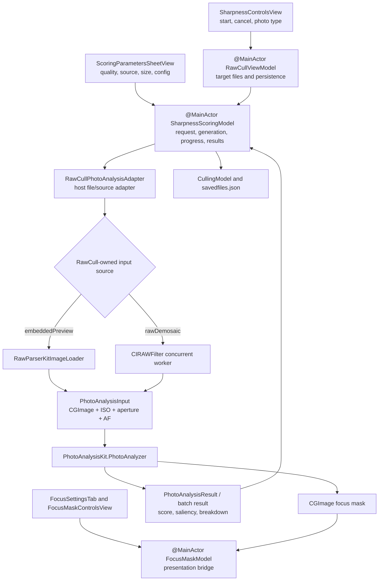

+++
author = "Thomas Evensen"
title = "Focus Mask and Sharpness"
date = "2026-08-21"
lastmod = "2026-08-31"
weight = 40
tags = ["sharpness", "focus", "vision", "metal"]
categories = ["technical details"]
mermaid = true
+++

# Focus Mask And Sharpness

RawCull exposes four related results, but they are not interchangeable:

| Result               | Meaning                                                                                           | Main consumer                       |
| -------------------- | ------------------------------------------------------------------------------------------------- | ----------------------------------- |
| Scalar sharpness     | A package-computed ranking value based on full-frame, salient-subject, AF, and local-patch detail | Sorting, burst ranking, persistence |
| Saliency evidence    | Vision candidates and an optional classification label/confidence                                 | Subject selection and diagnostics   |
| Focus-point evidence | Camera AF position plus AF-center, neighborhood, and local scores                                 | Region selection and diagnostics    |
| Rendered focus mask  | A thresholded, colorized overlay clipped to selected evidence patches                             | Visual inspection only              |

The scalar score and the overlay share edge-energy and evidence machinery in
PhotoAnalysisKit, but showing more red pixels does not increase a stored score.
Mask presentation can be relaxed without changing scalar analysis.

RawCull pins **PhotoAnalysisKit 1.2.2**, revision
**3bf462fab0d82f5e4c315273688933ace68fa737**. The package owns sharpness,
saliency, calibration, focus evidence, and mask algorithms. RawCull owns UI
settings, file decoding/source selection, workflow lifetime, normalization, and
persistence.

## Ownership From Controls To Package



`SharpnessScoringModel` and `FocusMaskModel` are `@Observable @MainActor`
because they publish UI state. Their `PhotoAnalyzer` and adapter values are
immutable, nonisolated boundaries. PhotoAnalysisKit's internal `FocusMaskEngine`
is `@unchecked Sendable` only because Core Image does not declare `CIContext`
Sendable; the documented invariant is an immutable engine with value snapshots
for every operation.

## Configuration Resolution

A scoring run snapshots one effective `SharpnessConfiguration`:

```text
focusMaskModel.config
  -> SharpnessPhotoType.packagePreset.applying
  -> SharpnessScoringQuality.packageQuality.applying
  -> PhotoAnalyzer applies each input's ISO and aperture hint
```

RawCull's default focus configuration is `.birdsInFlight`. Photo type maps to
PhotoAnalysisKit presets: Automatic, Birds and Wildlife, Portrait, Landscape, or
General Action. Quality maps to Fast, Balanced, or High Precision.

The selected thumbnail setting is normalized before decode:

```text
effective size = min(max(user value, quality minimum), 2048)

quality minimum:
  Fast           512
  Balanced       768
  High Precision 1024
```

The UI currently offers 1024, 1536, and 2048 px choices. The quality minimum
still matters for old settings and programmatic values. Embedded previews use
RawParserKit's thumbnail loader. RAW demosaic uses `CIRAWFilter`, disables added
sharpness, and sets detail 0.6, contrast 1.0, and exposure 0 before scaling the
longest side to the effective size.

## Analysis Descriptor And Cache Identity

`PhotoAnalyzer.sharpnessDescriptor(for:)` produces
`SharpnessAnalysisDescriptor`, the package-owned identity for non-mask scalar
analysis. At the pinned PhotoAnalysisKit 1.2.2 revision it has:

- descriptor schema version 1;
- scalar algorithm version 4;
- ISO-scaling policy version 1;
- aperture-hint policy version 1;
- the scoring-affecting configuration values and the stable scoring gain 7.62.

It deliberately excludes per-image ISO and aperture, decoded image size, input
source, source-file identity, and mask-only presentation settings. RawCull adds
the missing host identity in `SharpnessScoringSignature`:

| Identity layer                  | Fields                                                                  |
| ------------------------------- | ----------------------------------------------------------------------- |
| Package descriptor              | Algorithm/policy versions, scoring configuration, stable gain           |
| RawCull signature               | Descriptor + embedded-preview/RAW source + effective maximum pixel size |
| Per-file persistence validation | Signature + source file size + modification date                        |

Legacy signatures without a package descriptor still decode, but compare stale
to every current signature. On catalog load, RawCull restores a score only when
the full signature matches and the current file size and modification date match
(date tolerance is 0.001 seconds). A config, quality, source, size, algorithm,
or source-file change therefore forces recomputation.

## Calibration Lifetime

Calibration is a **visual-threshold** operation, not catalog normalization of
the scalar score. Before scoring, RawCull asks `FocusMaskModel` to load inputs
and call `PhotoAnalyzer.calibrate`. PhotoAnalysisKit:

1. loads inputs with the same bounded concurrency and source choice as scoring;
2. applies each file's ISO and aperture;
3. disables classification;
4. samples up to about 4096 positive Laplacian energies per successful image;
5. requires at least five successful images;
6. chooses the requested percentile (RawCull uses 0.90) and clamps the threshold
   to 0.01...0.95.

Only `focusMaskModel.config.threshold` is updated. Scalar scoring uses the
stable gain and package descriptor; it does not depend on the catalog's
calibration distribution. The calibrated threshold remains in the shared focus
model until settings, later calibration, or model reset changes it.

## Scoring, Progress, Cancellation, And Publication

`SharpnessScoringModel.scoreFiles` builds a request identity from ordered file
IDs, the scoring signature, and the concurrency limit.

- An identical request already in flight is coalesced and awaited.
- A different request cancels the old task and installs a new generation UUID.
- Fast, Balanced, and High Precision admit 6, 4, and 3 package tasks
  respectively; RAW demosaic is capped at 2.
- PhotoAnalysisKit keeps a sliding task-group window, reports completion-order
  progress, and restores final results to request order.
- RawCull publishes progress only while the generation matches.
- Cancellation makes the package return nil and partial results are discarded.
- Final score, saliency, and breakdown dictionaries are replaced only if the
  task is not cancelled and the generation still matches.
- A successful run enables sharpness sorting, then `RawCullViewModel` merges the
  results into `CullingModel`.

This is latest-wins state management. Cancelling work alone is insufficient;
every progress and final commit also checks the generation.

Mask tasks have the same presentation rule. SwiftUI views own stored mask tasks,
cancel them on image/config replacement, and check cancellation before assigning
the returned overlay or diagnostics.

## Raw Score Versus UI Label

PhotoAnalysisKit does not promise that the raw scalar is a percentage or clamp
the final value to 0...1. It is a relative detail metric whose scale is kept
stable by the package gain and descriptor.

RawCull computes an O(1) UI denominator when the score dictionary changes:

```text
fewer than 2 scores -> lone score, or 1
2 through 9         -> maximum
10 or more          -> element at floor((n - 1) * 0.90) in sorted scores
denominator floor   -> 1e-6
```

Badge consumers clamp `score / maxScore` to 0...1 before mapping it to
presentation labels. That UI normalization is catalog-relative and is not
persisted as the package score.

## Focus Mask Presentation

`FocusMaskModel` offers two package-backed paths:

| Path                                    | Package call                         | Use                                                                                                                                    |
| --------------------------------------- | ------------------------------------ | -------------------------------------------------------------------------------------------------------------------------------------- |
| Existing image, optional saved evidence | `PhotoAnalyzer.focusMask`            | Render without repeating classification and, when evidence includes a winning saliency rectangle, without repeating saliency selection |
| Image plus fresh diagnostics            | `PhotoAnalyzer.analyzeWithFocusMask` | Compute scalar/saliency/evidence and render one aligned mask                                                                           |

Views pass a `CGImage`, ISO, aperture, normalized AF point, scale, and a
configuration snapshot. RawCull adapts the package breakdown only to add
`SharpnessScoringSource`; it does not reinterpret the numeric fields.

Presentation-only controls include threshold, dilation, erosion, feathering,
raw-Laplacian display, subject isolation, minimum visible coverage, and
guaranteed-visible evidence. Some shared values such as pre-blur, border inset,
AF radii, ISO, and aperture affect the evidence image or regions used by both
paths. See [Detailed Focus Mask Computation](../detailsfocusmask/) for the exact
stage classification.

## Read These Files In Order

1. **RawCull/Views/GridView/SharpnessControlsView.swift** and
   **ScoringParametersSheetView.swift** — user entry and settings.
2. **RawCull/Model/ViewModels/RawCullViewModel+Sharpness.swift** — target scope,
   persistence handoff, and sort.
3. **RawCull/Model/ViewModels/FocusandSharpness/SharpnessScoringModel.swift** —
   request identity, generation, bounds, progress, and publication.
4. **RawCull/Model/ViewModels/FocusandSharpness/SharpnessScoringOptions.swift**
   — RawCull-to-package preset, quality, source, and size mapping.
5. **RawCull/Model/ViewModels/FocusandSharpness/RawCullPhotoAnalysisAdapter.swift**
   — decode ownership and `PhotoAnalysisInput` construction.
6. **RawCull/Model/ViewModels/FocusandSharpness/FocusMaskModel.swift** and
   **FocusMaskTypes.swift** — mask bridge and result adaptation.
7. **PhotoAnalysisKit/Sources/PhotoAnalysisKit/PhotoAnalyzer.swift** and
   **PhotoAnalysisBatch.swift** — public package facade and bounded batch.
8. **SharpnessConfiguration.swift**, **SharpnessPresets.swift**, and
   **SharpnessAnalysisDescriptor.swift** — defaults, policy, and identity.
9. **FocusMaskEngine+Scoring.swift**, **FocusMaskEngine+MaskGeneration.swift**,
   and **Resources/Kernels.ci.metal** — algorithm implementation.

Continue with [Detailed Sharpness Scoring](../detailsharpnessscoring/) for the
numeric algorithm, or [Detailed Focus Mask Computation](../detailsfocusmask/)
for overlay rendering.

## Protecting Tests

| Boundary or invariant                                                                                | Tests                                                          |
| ---------------------------------------------------------------------------------------------------- | -------------------------------------------------------------- |
| RawCull/package Metal integration and scoring-source adaptation                                      | `RawCullTests/PhotoAnalysisKitIntegrationTests.swift`          |
| Preset/quality mapping, descriptor signatures, legacy invalidation, coalesced runs, UI normalization | `RawCullTests/SharpnessScoringTests.swift`                     |
| Persistence merge and file/signature validation behavior                                             | `RawCullTests/CullingModelTests.swift`                         |
| Batch bounds, ordering, progress, decode failure, cancellation                                       | `PhotoAnalysisKitTests/PhotoAnalysisBatchTests.swift`          |
| Descriptor inclusions/exclusions and policy versions                                                 | `PhotoAnalysisKitTests/SharpnessAnalysisDescriptorTests.swift` |
| Numeric score helpers, aperture policy, ISO curve, focus-failure classification                      | `PhotoAnalysisKitTests/SharpnessMetricsTests.swift`            |
| Analyze, mask, calibration, and cancellation facade                                                  | `PhotoAnalysisKitTests/PhotoAnalyzerTests.swift`               |
