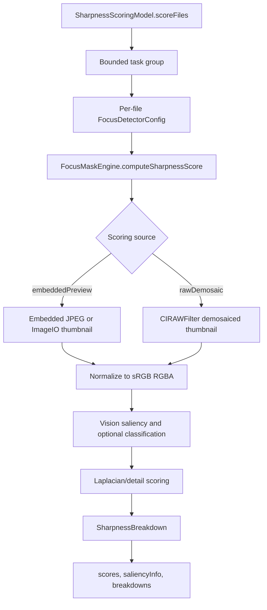

+++
author = "Thomas Evensen"
title = "Focus Mask and Sharpness"
date = "2026-05-19"
weight = 40
tags = ["sharpness", "focus", "vision", "metal"]
categories = ["technical details"]
mermaid = true
+++

# Focus Mask and Sharpness

RawCull's focus system does two related jobs:

1. produce a visible focus mask for image inspection,
2. compute a scalar sharpness score for sorting, burst ranking, and saved scoring.

Both jobs use the same core engine, but the UI overlay and the numeric score are not identical. The overlay tries to show useful focus evidence. The score tries to rank files fairly across a catalog or burst.

## Source Map

| Area | Files |
|---|---|
| UI-facing model | `SharpnessScoringModel.swift`, `FocusMaskModel.swift` |
| Engine | `FocusMaskEngine.swift`, `FocusMaskEngine+Scoring.swift`, `FocusMaskEngine+MaskGeneration.swift` |
| Configuration | `FocusDetectorConfig.swift`, `SharpnessScoringOptions.swift`, `FocusMaskCalibration.swift` |
| Data types | `FocusMaskTypes.swift`, `RawCullCore/SaliencyInfo.swift` |
| UI controls | `SharpnessControlsView.swift`, `FocusMaskControlsView.swift`, `FocusSettingsTab.swift`, `FocusOverlayView.swift`, `ZoomOverlayView.swift` |
| Metal kernel | `Kernels.ci.metal` |
| Persistence integration | `RawCullViewModel+Sharpness.swift`, `CullingModel.swift`, `SavedFiles.swift` |

## Scoring Flow



`SharpnessScoringModel` is `@Observable @MainActor`. It owns progress, current options, scores, saliency info, and per-file breakdowns. It uses a bounded task group so multiple files can score in parallel without launching the whole catalog at once.

## Scoring Options

The main knobs are:

| Setting | Meaning |
|---|---|
| `photoType` | Applies subject-specific config presets, with `.auto` as the general mode |
| `scoringQuality` | Adjusts scoring config, scoring size, and concurrent task count |
| `scoringSource` | Chooses embedded preview or demosaiced RAW thumbnail |
| `thumbnailMaxPixelSize` | Requested scoring size, normalized by quality option |
| `focusMaskModel.config` | The active `FocusDetectorConfig` |

`effectiveFocusConfig` combines photo type and quality into the config used for scoring. Per file, the model also injects ISO and an aperture hint derived from EXIF.

## Image Source Choices

| Source | Strength | Cost |
|---|---|---|
| `embeddedPreview` | Fast and good for normal culling | Uses the camera-generated preview or ImageIO thumbnail |
| `rawDemosaic` | More precise final check | Slower; concurrency is capped more aggressively |

For Sony ARW files, `FocusMaskEngine` has a fallback that reads an embedded JPEG directly through `SonyMakerNoteParser` when ImageIO cannot produce the preview.

## Saliency And AF Evidence

The engine uses Vision saliency to find likely subject regions. When enabled, it also runs image classification and stores the best subject label in `SaliencyInfo`.

The camera AF point comes from `FileItem.afFocusNormalized`, which is parsed during catalog scan. When present, it helps choose the relevant subject/patch and improves burst-ranking confidence.

Region selection favors:

1. saliency regions that contain or align with the AF point,
2. regions closer to the AF point,
3. higher Vision confidence,
4. stronger local detail,
5. larger region area as a final tie-breaker.

## Sharpness Breakdown

`SharpnessBreakdown` is the main debugging record for a scored file.

| Field | Meaning |
|---|---|
| `finalScore` | Score used by sorting and burst ranking |
| `globalScore` | Full-frame detail score when available |
| `subjectScore` | Salient-subject detail score when available |
| `afPointScore` | AF-region detail score when available |
| `blurGateSigma` | Blur-gate measurement used to reduce weak subject scores |
| `subjectLabel` / `subjectConfidence` | Classification result from Vision |
| `focusFailureKind` | None, motion blur, or missed focus |
| `focusMaskRegionSource` | Whether overlay evidence came from saliency, AF, both, or neither |
| `focusEvidence` | Patch rankings, confidence, and explanation data |
| `scoringSource` | Embedded preview or RAW demosaic |

The breakdown is useful when a score looks wrong because it tells you whether the engine trusted subject detail, AF-local detail, global detail, or a fallback.

## Normalization For UI

Raw scores can vary by catalog and subject. `SharpnessScoringModel` keeps `maxScore` as an O(1) normalization denominator for UI badges:

```text
if score count < 2: use the only score or 1.0
if score count < 10: use raw max score
if score count >= 10: use 90th percentile
```

The 90th percentile avoids one extreme outlier compressing every other image badge.

## Calibration

`calibrateFromBurst(_:)` samples a burst/catalog and calls `FocusMaskModel.calibrateAndApplyFromBurstParallel(...)`. The calibration updates the active focus config from measured detail distribution. It needs enough scoreable images; otherwise it logs a warning and leaves the current config in place.

This is used before burst scoring when sharpness data is missing.

## Persistence

Sharpness data is persisted through `savedfiles.json`:

- raw sharpness score,
- saliency subject label,
- scoring signature,
- source file size,
- source modification date.

On catalog load, RawCull restores persisted scores only when the file identity and scoring signature still match. This prevents old scores from being reused after changing quality/source/config or after a RAW file changes.

## Focus Mask Overlay

The overlay path uses the same engine family but is tuned for visual inspection. `ZoomOverlayView` can regenerate masks for the current zoom image and stores the resulting breakdown/saliency back into `SharpnessScoringModel`.

The visual mask can isolate to subject or AF evidence, and it has a "guarantee visible focus evidence" mode for making weak evidence inspectable. That visual relaxation should not be confused with the scalar score.

## Tests

The package tests cover supporting pure/package behavior:

| Test area | Location |
|---|---|
| Focus-point normalization | `RawCullCore/Tests/RawCullCoreTests/FocusPointParserTests.swift` |
| Histogram calculation | `RawCullCore/Tests/RawCullCoreTests/HistogramCalculatorTests.swift` |
| ImageIO cancellation bridge | `RawParserKit/Tests/RawParserKitTests/CancellableImageIOWorkTests.swift` |
| MakerNote parsing | `RawParserKit/Tests/RawParserKitTests/SonyMakerNoteParserTests.swift`, `NikonMakerNoteParserTests.swift` |

App-target focus scoring itself is still mainly verified through source review/manual behavior in this snapshot.

## What To Check When Changing This Area

- If a scoring option changes score meaning, update `SharpnessScoringSignature`.
- If you tune scoring weights, inspect both single-image badges and burst ranking.
- Keep RAW demosaic concurrency low; it is much heavier than embedded-preview scoring.
- Treat overlay visibility tweaks separately from scalar scoring tweaks.
- When a score looks wrong, inspect `SharpnessBreakdown` before changing thresholds.
