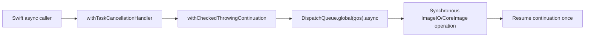

+++
author = "Thomas Evensen"
title = "Synchronous Code"
date = "2026-05-19"
tags = ["concurrency", "imageio", "blocking"]
categories = ["technical details"]
mermaid = true
weight = 85
+++

# Synchronous Code

Most RawCull code uses async/await, actors, and task groups. Some Apple framework work is still fundamentally synchronous: ImageIO thumbnail decode, CoreImage RAW rendering, JPEG encoding, and direct binary MakerNote parsing. This page explains where that work lives and how the app keeps it from freezing the UI or starving Swift's cooperative executor.

## Source Map

| Area | Files |
|---|---|
| Cancellation-aware blocking bridge | `RawParserKit/Sources/RawParserKit/CancellableImageIOWork.swift` |
| Thumbnail extraction | `SonyThumbnailExtractor.swift`, `NikonThumbnailExtractor.swift` |
| Embedded JPEG extraction | `JPGSonyARWExtractor.swift`, `JPGNikonNEFExtractor.swift`, `SonyRAWJPEGCreator.swift` |
| MakerNote parsing | `SonyMakerNoteParser.swift`, `NikonMakerNoteParser.swift` |
| App callers | `RequestThumbnail.swift`, `ScanAndCreateThumbnails.swift`, `ExtractAndSaveJPGs.swift`, `ScanAndExtractJPGs.swift`, `ZoomPreviewHandler.swift` |
| Sharpness scoring | `FocusMaskEngine+Scoring.swift`, `FocusMaskEngine+MaskGeneration.swift` |

## Why Blocking Work Matters

Swift's cooperative thread pool expects async tasks to suspend instead of occupying threads for long periods. ImageIO and CoreImage calls often do not suspend; they block until decode/render work is done.

If RawCull ran those calls directly inside task-group children, many RAW files could occupy the cooperative pool at once. The UI might still be on the main actor, but background progress would become sluggish and cancellation would feel late.

## The Bridge

`CancellableImageIOWork.run(qos:_:)` wraps blocking work like this:



The operation receives an `ImageIOCancellationToken`. The token checks both its own locked cancellation flag and `Task.isCancelled`.

`WorkState` protects the continuation with a lock so cancellation and completion races resume exactly once.

## Extractor Pattern

The parser package uses stateless enum extractors. A typical extractor exposes an async public API and a private synchronous implementation:

```text
public async extractThumbnail(...)
    -> CancellableImageIOWork.run(...)
        -> private extractSync(...)
```

That shape appears in Sony and Nikon thumbnail/JPEG extractors.

## Quality Of Service

The chosen GCD QoS communicates user impact:

| Work | Typical QoS | Reason |
|---|---|---|
| On-demand thumbnails | userInitiated | User is scrolling or selecting images |
| Bulk cache warming | utility/background through caller context | Useful but should yield to direct UI work |
| JPEG export/cache warming | utility | Batch work that can run behind UI interaction |
| Memory diagnostics sampling | utility/detached | Should not block UI rendering |

The exact QoS is set in the package extractor or caller. When adding a new path, choose based on whether the user is waiting for the result right now.

## Sharpness Scoring

`FocusMaskEngine.computeSharpnessScore(...)` performs decode, saliency detection, and focus-detail scoring off the main actor. It uses `runCancellableWorker` around the scoring body and checks cancellation between decode, Vision, and scoring phases.

The scoring image can come from:

| Source | Meaning |
|---|---|
| `embeddedPreview` | Prefer embedded JPEG or ImageIO thumbnail for speed |
| `rawDemosaic` | Use `CIRAWFilter` for a slower but more precise demosaiced thumbnail |

The code normalizes decoded images to 8-bit sRGB RGBA before the Metal/CoreImage focus pipeline. That makes the scoring pipeline less sensitive to source color space or bit depth.

## Direct Binary Parsing

Sony and Nikon MakerNote parsers read bytes directly from the RAW file to locate focus-point data and embedded JPEG offsets. This is synchronous file/data parsing, but it is small compared with RAW image decode and usually runs inside scan/parser work already off the main UI path.

The parsers are written as stateless enums, so they do not need actor isolation.

## Safe Rules For New Blocking Work

- Keep blocking APIs out of SwiftUI view bodies and `@MainActor` methods.
- Prefer adding blocking ImageIO work to `RawParserKit` behind an async API.
- Use `CancellableImageIOWork` when the operation may be slow or repeated across many files.
- Add cancellation checkpoints before and after expensive framework calls.
- Convert non-Sendable image objects before crossing actor/task boundaries when needed.
- Put pure parsing or calculation logic in package code with tests.

## When A Synchronous Call Is Acceptable

A synchronous call is usually acceptable when all of these are true:

- it is small and bounded,
- it does not decode or render full images,
- it runs outside view rendering,
- it does not capture mutable UI state,
- cancellation delay would not be visible to the user.

Examples include formatting values, parsing small strings, or calculating simple per-model display data.
