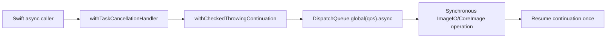

+++
author = "Thomas Evensen"
title = "Synchronous Code"
date = "2026-05-19"
tags = ["concurrency", "imageio", "blocking"]
categories = ["technical details"]
mermaid = true
weight = 85
+++

# Synchronous Code

Most RawCull code uses async/await, actors, and task groups. Some framework and system APIs are still synchronous: ImageIO decode, Core Image RAW rendering, JPEG encoding, filesystem calls, binary MakerNote parsing, and process launch. `async` on a caller does not make one of those calls nonblocking. This page records where the blocking work lives and which execution strategy each path uses.

## Source Map

| Area | Files |
|---|---|
| Cancellation-aware blocking bridge | `RawParserKit/Sources/RawParserKit/CancellableImageIOWork.swift` |
| RAW thumbnail and embedded JPEG extraction | `SonyThumbnailExtractor.swift`, `NikonThumbnailExtractor.swift`, `JPGSonyARWExtractor.swift` (`SonyEmbeddedJPEGExtractor`), `JPGNikonNEFExtractor.swift` (`NikonEmbeddedJPEGExtractor`) |
| RAW development and orientation | `SonyRAWJPEGCreator.swift`, `ThumbnailSharpener.swift`, `OrientationNormalizedImageLoader.swift` |
| Binary RAW parsing | `SonyMakerNoteParser.swift`, `NikonMakerNoteParser.swift`, `SonyRawFormat.swift`, `NikonRawFormat.swift` |
| Thumbnail and preview callers | `RequestThumbnail.swift`, `ScanAndCreateThumbnails.swift`, `ScanAndExtractJPGs.swift`, `FullSizePreviewLoader.swift`, `ZoomPreviewHandler.swift`, `ComparisonImageLoader.swift` |
| Export and JPEG encoding | `ExtractAndSaveJPGs.swift`, `SaveJPGImage.swift`, `DiskCacheManager.swift`, `FullSizeJPGDiskCache.swift` |
| Filesystem and persistence | `ScanFiles.swift`, `DiscoverFiles.swift`, `PerFileAnalysisArtifactStore.swift`, `SettingsViewModel.swift`, `ReadSavedFilesJSON.swift`, `WriteSavedFilesJSON.swift` |
| Diagnostics and image analysis | `RawCullViewModel+Diagnostics.swift`, `RawFileDiagnostics.swift`, `RawCullPhotoAnalysisAdapter.swift`, `DeepAIReviewFeature.swift` |
| External process | `ExecuteCopyFiles.swift`, `RsyncProcessStreaming.RsyncProcess` |

## Why Blocking Work Matters

Swift's cooperative thread pool expects async tasks to suspend instead of occupying threads for long periods. ImageIO and CoreImage calls often do not suspend; they block until decode/render work is done.

If RawCull runs those calls directly inside many task-group children, the calls can occupy the cooperative pool together. The UI may remain on the main actor, but unrelated async work can stop making progress and cancellation can appear late. Actor isolation prevents data races; it does not prevent a synchronous call from monopolizing the thread executing that actor.

## The Bridge

`CancellableImageIOWork.run(qos:_:)` wraps blocking work like this:



The operation receives an `ImageIOCancellationToken`. The token checks its own lock-backed cancellation flag and `Task.isCancelled`. Cancellation resumes the awaiting continuation promptly, but it cannot forcibly interrupt an ImageIO or Core Image call already executing. The worker must reach a checkpoint before it observes cancellation.

`WorkState` protects the continuation with a lock so cancellation and completion races resume exactly once.

## Current RAW Extractor Pattern

The parser package uses stateless enum extractors. A typical extractor exposes an async public API and a private synchronous implementation:

```text
public async extractThumbnail(...)
    -> CancellableImageIOWork.run(...)
        -> private extractSync(...)
```

That shape appears in the Sony and Nikon thumbnail extractors and in `SonyEmbeddedJPEGExtractor` and `NikonEmbeddedJPEGExtractor`. The compatibility enums `JPGSonyARWExtractor` and `JPGNikonNEFExtractor` are deprecated; new callers and documentation must use the current extractor names.

`SonyRAWJPEGCreator.createFullSizeJPEG` uses the same bridge at utility QoS for `CIRAWFilter`, render probing, and JPEG representation. `DecodeConcurrencyLimiter` separately bounds how many expensive decodes are admitted; limiting concurrency and moving blocking work off the cooperative executor solve different problems and both protections should remain.

## Blocking-Work Audit

| Synchronous operation | Current execution boundary | Why |
|---|---|---|
| Sony/Nikon thumbnail and embedded-preview ImageIO decode | `CancellableImageIOWork` on a global GCD queue, with cancellation checkpoints and decode limiting where supplied | Decode duration is input- and OS-decoder-dependent and may be repeated across a catalog. |
| Sony developed RAW via `CIRAWFilter` and JPEG representation | `CancellableImageIOWork` at utility QoS | Full RAW development and encoding are long, nonsuspending framework calls. |
| Sharpened RAW preview | Detached task in `ZoomPreviewHandler`; concurrent task in `ComparisonImageLoader` | `ThumbnailSharpener` performs synchronous `CIRAWFilter` and `CIContext` rendering. The detached zoom path is appropriate for potentially long rendering; a concurrent task alone still uses Swift's cooperative executor and must remain bounded. |
| Orientation-normalized ImageIO load | Detached task in disk/full-size preview cache callers; otherwise kept inside an already isolated worker | File decode can block. The synchronous loader is a leaf API, so the caller owns the execution boundary. |
| Thumbnail/full-size cache reads, writes, size scans, and pruning | `Task.detached` with user-initiated, background, or utility priority according to latency | `Data.write`, directory enumeration, resource-value reads, ImageIO cache decode, and deletion are filesystem-bound and nonsuspending. |
| JPG export writes | Encode `CGImage` to Sendable `Data` in the owning actor, then atomic `Data.write` in a detached background task | Avoids sending a non-Sendable image across isolation and keeps file writes off the actor/cooperative executor. |
| Catalog enumeration | Synchronous `contentsOfDirectory` at the start of the `ScanFiles` actor operation | One bounded directory listing precedes parallel per-file work. Revisit this boundary if catalogs or remote volumes make enumeration measurably slow. |
| `focuspoints.json` and settings reads | Detached utility task | Whole-file `Data(contentsOf:)` can block even for normally small JSON files. |
| Sony/Nikon MakerNote and embedded-JPEG byte parsing | Runs within RAW-loader, extractor, scan, or diagnostic worker context | `FileHandle` and mapped/full-file fallback reads are synchronous. They must not be called directly from the main actor; full-file fallbacks make duration input-dependent. |
| RAW diagnostics | `Task { @concurrent ... }` in `presentRawDiagnostics` | Keeps parser and ImageIO inspection off `@MainActor`. Because diagnostics can read large RAW structures, preserve cancellation checks and move to the GCD bridge/detached execution if profiling shows cooperative-pool occupation. |
| Sorting, filtering, histogram math, and small result transforms | `@concurrent` | CPU work is bounded, does not wait on blocking APIs, and benefits from leaving the caller's actor without requiring a dedicated blocking thread. |
| rsync startup | Synchronous argument/include-list preparation and `executeProcess()` on `ExecuteCopyFiles`' main-actor method; output and completion are streamed asynchronously by `RsyncProcessStreaming` | `executeProcess()` launches and returns; it does not synchronously wait for rsync to finish. Include-list size and launch latency must stay bounded or be moved off the main actor. |

App-owned artifact and culling persistence actors also perform atomic reads/writes and directory maintenance. Serialization protects their state, but it does not make filesystem APIs suspend. Keep batches bounded and move any measured long operation to detached I/O while passing only Sendable values back to the owner.

## `@concurrent`, Detached Tasks, And The GCD Bridge

These mechanisms are not interchangeable:

| Mechanism | Use it for | Do not use it as |
|---|---|---|
| `@concurrent` | Bounded CPU work such as sorting, filtering, small transformations, or a short diagnostic calculation that should not inherit actor isolation | A general wrapper for ImageIO, full-file reads, RAW rendering, JPEG encoding, or other calls that may block for an unbounded time |
| `Task.detached` | A contained filesystem or rendering operation where the caller passes immutable/Sendable inputs and awaits the result | A way to escape ownership, priority, cancellation, or Sendable rules; cancellation must still be checked and structured lifetime retained by awaiting `.value` where required |
| `CancellableImageIOWork` | Reusable, cancellation-aware package APIs around nonsuspending ImageIO/Core Image work | Proof that the underlying call itself is cancellable; it only controls the waiter and checkpoints around the call |
| Dedicated process API | A long-running external command whose output, cancellation, and termination have their own lifecycle | Work to wait for synchronously on an actor or Swift task thread |

## Quality Of Service

The chosen GCD QoS communicates user impact:

| Work | Typical QoS | Reason |
|---|---|---|
| On-demand thumbnails | userInitiated | User is scrolling or selecting images |
| Bulk cache warming | utility/background | Useful but should yield to direct UI work |
| JPEG export/cache warming | utility | Batch work that can run behind UI interaction |
| Memory diagnostics sampling | utility/detached | Should not block UI rendering |

The exact QoS is set in the package extractor or caller. When adding a new path, choose based on whether the user is waiting for the result right now.

## Image Analysis

Sharpness scoring is adapted through `RawCullPhotoAnalysisAdapter`. Embedded-preview or demosaiced-RAW preparation runs away from the main actor, and the pipeline checks cancellation between decode, Vision, and scoring phases. Deep AI Review likewise marks decode/inference helpers `@concurrent`; any synchronous `CIRAWFilter`/`CIContext` portion must stay concurrency-limited because `@concurrent` alone does not turn rendering into a suspending operation.

The scoring image can come from:

| Source | Meaning |
|---|---|
| `embeddedPreview` | Prefer embedded JPEG or ImageIO thumbnail for speed |
| `rawDemosaic` | Use `CIRAWFilter` for a slower but more precise demosaiced thumbnail |

The code normalizes decoded images to 8-bit sRGB RGBA before the focus pipeline. That makes scoring less sensitive to source color space or bit depth and provides a clear Sendable/value boundary where possible.

## Direct Binary Parsing

Sony and Nikon MakerNote parsers use `FileHandle` to read bounded leading regions first, but some fallbacks read the full file to find later MakerNotes or JPEG ranges. They locate focus-point data and embedded JPEG offsets, then may read the selected JPEG byte range directly. These are synchronous filesystem operations and must remain inside scan/parser/extractor/diagnostic worker contexts.

The parsers are written as stateless enums, so they do not need actor isolation.

## Safe Rules For New Blocking Work

- Keep blocking APIs out of SwiftUI view bodies and `@MainActor` methods. The narrow rsync launch path is an explicit exception only while launch remains short and non-waiting.
- Put reusable blocking ImageIO/Core Image work in `RawParserKit` behind an async API and the GCD continuation bridge.
- Use detached I/O for isolated app-owned filesystem work, capture only Sendable values, and await the result when subsequent ownership or security-scope cleanup depends on completion.
- Use `@concurrent` for bounded CPU work, not merely because a function is synchronous.
- Bound catalog-wide decode/render fan-out with a limiter; executor choice does not impose backpressure.
- Add cancellation checkpoints before and after expensive framework calls.
- Convert non-Sendable image objects before crossing actor/task boundaries when needed.
- Put pure parsing or calculation logic in package code with fixtures and tests.

## When A Synchronous Call Is Acceptable

A synchronous call is safe inside an actor only when all of these are true:

- it is small and bounded,
- it does not perform network/removable-volume I/O or decode/render a full image,
- it cannot expand from a small header/record into an unbounded full-file or directory operation,
- it does not capture mutable UI state,
- cancellation delay would not be visible to the user,
- multiplying it by the maximum actor/task-group concurrency still leaves cooperative threads available.

Examples include formatting values, cache-key construction, parsing a fixed-size in-memory record, or calculating display data. Move the work to detached I/O or `CancellableImageIOWork` when duration depends on file size, decoder behavior, volume latency, catalog size, or external-process completion. When uncertain, measure with a representative large RAW file and catalog; an actor is an ownership boundary, not a blocking-work queue.

## Review Checklist

- Search for `CGImageSource`, `CGImageDestination`, `CIRAWFilter`, `CIContext`, `Data(contentsOf:)`, `Data.write`, `FileHandle`, directory enumeration, and process launch when auditing a new release.
- Verify package extractors still go through `CancellableImageIOWork` and catalog callers still apply decode limits.
- Verify detached closures capture `Data`, `URL`, scalar configuration, or other Sendable values rather than actor-owned `CGImage`/`NSImage` state.
- Verify cancellation and completion races resume continuations exactly once; `CancellableImageIOWorkTests.swift` covers this bridge.
- Verify export/security-scope owners await detached writes before stopping access.
- Remove deprecated compatibility names from call sites and documentation as migrations complete.
