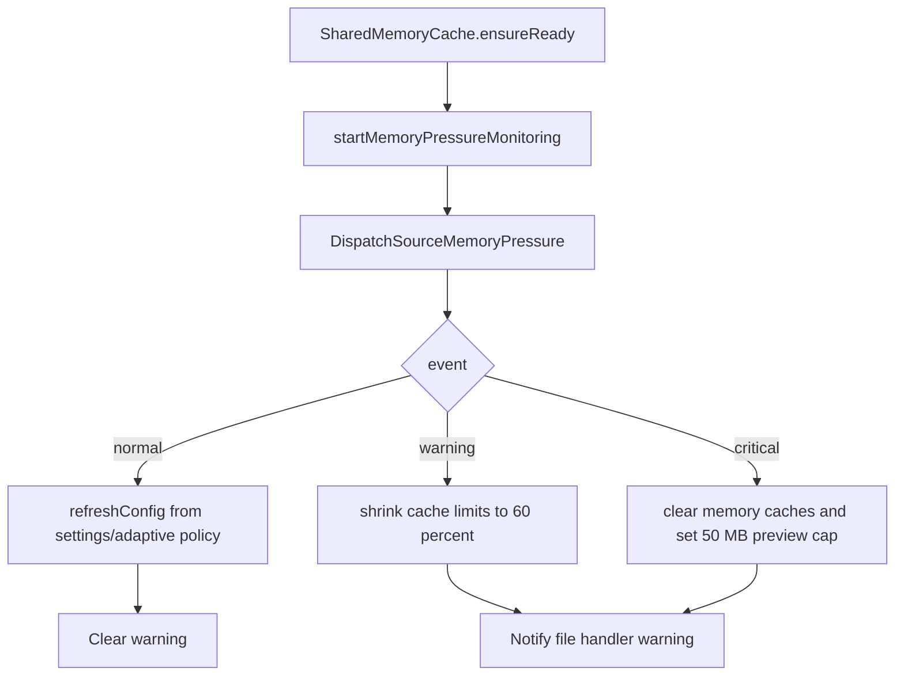

# Memory Pressure

RawCull can hold many images in memory while scanning and culling. The memory-pressure code exists to keep the app responsive when macOS reports pressure and to make cache behavior visible during development.

## Source Map

| File | Role |
|---|---|
| `Actors/SharedMemoryCache.swift` | Owns cache limits, memory-pressure dispatch source, pressure counters, and cache clearing |
| `Model/ViewModels/MemoryViewModel.swift` | Samples total system memory, used system memory, app memory, and pressure threshold for the UI |
| `Model/Cache/CacheConfig.swift` | Contains `CacheRecommendationPolicy` and cache-limit calculation |
| `Model/ViewModels/MemoryDiagnosticsViewModel.swift` | Writes diagnostics samples for cache/memory review |
| `Views/Settings/MemoryTab.swift` | Displays memory stats, cache limits, and pressure status |
| `Views/RawCullSidebarMainView/MemoryWarningLabelView.swift` | Shows the sidebar warning during pressure |

## Runtime Flow



`SharedMemoryCache` starts monitoring lazily during `ensureReady()`. That is called before thumbnail cache use, so the memory-pressure handler is active before large thumbnail work begins.

## Measuring System Memory

`MemoryViewModel.getUsedSystemMemory()` uses Mach VM statistics:

```text
usedMemory = min((wired + active + compressed) * pageSize, physicalMemory)
```

The model intentionally uses a simple definition of "used":

| VM field | Meaning |
|---|---|
| `wire_count` | Wired pages that cannot be paged out |
| `active_count` | Pages currently active |
| `compressor_page_count` | Pages held by the VM compressor |

The result is clamped to physical memory so the UI cannot show impossible totals.

## Measuring App Memory

RawCull measures its own process footprint with:

```text
task_info(... TASK_VM_INFO ...).phys_footprint
```

That is the value displayed as app memory usage. It is a better signal than simply adding image sizes because it reflects what the kernel says the process currently costs.

## Percentages In The UI

`MemoryViewModel` exposes:

```text
memoryPressurePercentage = memoryPressureThreshold / totalMemory * 100
usedMemoryPercentage = usedMemory / totalMemory * 100
appMemoryPercentage = appMemory / usedMemory * 100
```

The default pressure threshold is 85 percent of physical memory:

```text
memoryPressureThreshold = totalMemory * 0.85
```

This UI threshold is informational. The actual pressure response is driven by macOS `DispatchSourceMemoryPressure` events.

## Cache Limit Policy

`CacheRecommendationPolicy.adaptiveLimits(...)` is the first place to inspect when tuning memory behavior.

RawCull has two independent RAM budgets:

| Cache | `NSCache` | Primary content | Settings maximum |
|---|---|---|---|
| Preview | `memoryCache` | Preview and loupe thumbnails | `memoryCacheSizeMB` |
| Grid | `gridThumbnailCache` | Grid-size thumbnails | `gridCacheSizeMB` |

Both use byte cost as the binding constraint. The preview count limit is 10,000 and the grid count limit is 3,000, so normal eviction should be driven by pixel cost rather than item count.

At normal pressure:

1. Choose a baseline from physical RAM.
2. Estimate free memory from Mach stats.
3. Keep a 3 GB reserve.
4. Use half of the remaining expandable memory as extra cache budget.
5. Split that extra budget 65 percent preview cache and 35 percent grid cache.
6. Round to 256 MB steps.
7. Clamp by machine tier and user maximums.

The current tiers are:

| Physical RAM | Preview baseline | Grid baseline | Preview tier cap | Grid tier cap | Default user maxima |
|---|---:|---:|---:|---:|---|
| Less than 32 GB | 2,048 MB | 768 MB | 4,096 MB | 1,024 MB | 4,096 / 1,024 MB |
| 32 GB to less than 64 GB | 4,096 MB | 1,024 MB | 8,000 MB | 2,000 MB | 4,096 / 1,024 MB |
| 64 GB or more | 8,000 MB | 2,000 MB | 8,000 MB | 2,000 MB | 8,000 / 2,000 MB |

The policy never treats a user maximum as a target. It calculates an adaptive recommendation and then clamps preview and grid independently to their saved maxima. At warning or critical state, `calculateConfig(from:)` uses 60 percent of the tier baseline, rounded up to 256 MB and bounded by the configured minimum and user maximum.

At non-normal pressure, RawCull returns reduced baseline limits and then the live pressure handler may shrink or clear active caches immediately.

## Pressure Responses

| Event | Code path | Effect |
|---|---|---|
| Normal | `handleMemoryPressureEvent`, `.normal` | Set pressure level to normal, increment normal counter, refresh config, clear warning |
| Warning | `.warning` | Set pressure level to warning, increment warning counter, reduce the current preview and grid cost limits to 60 percent, retain entries for `NSCache` to evict, show warning |
| Critical | `.critical` | Set pressure level to critical, increment critical counter, clear preview and grid RAM caches, reset their cost/count mirrors, clear the recent-eviction ring, and set the preview limit to 50 MB |

The grid cache is cleared on critical pressure too. The disk caches are not deleted; only RAM is released.

The 50 MB critical cap applies to the preview cache. Critical handling clears the grid cache but does not rewrite its live cost limit. A later `.normal` event calls `refreshConfig()`, re-runs the adaptive calculation using current memory and saved settings, restores both live limits, and clears the UI warning. Recovery does not repopulate either cache; normal demand and preload work warm them again.

## Why Pressure State Is Lock-Backed

`currentPressureLevel` is read by UI and diagnostics without `await`. The value is stored in an `OSAllocatedUnfairLock`, which makes the read/write contract explicit while avoiding a main-actor or cache-actor hop during frequent sampling.

The same pattern is used for pressure counters, demand/boomerang counters, and cache cost/count mirrors. The synchronous surface is deliberately narrow: pressure snapshots, `NSCache` lookups/inserts, and lock-backed counters. Configuration, disk-cache access, monitoring setup, and handler ownership remain actor-isolated or explicitly run in detached tasks. This design does not imply that arbitrary cache operations may bypass actor isolation merely because `NSCache` itself is thread-safe.

## Diagnostics Contract

`MemoryDiagnosticsViewModel` samples every five seconds while its console is open and can export the session as TSV. Limit changes must be evaluated with both caches and both kinds of pressure evidence:

| Measurement | What it proves |
|---|---|
| `mem_cost_MB`, `mem_items`, `mem_limit_MB` | Preview occupancy against the saved maximum |
| `grid_cost_MB`, `grid_items`, `grid_limit_MB` | Grid occupancy against the saved maximum |
| `live_limit_MB` | The preview cache's actual live cap, including a warning shrink that differs from settings |
| `pressure`, `pressure_warns`, `pressure_crits` | Current sampled state plus cumulative events that may occur between samples |
| `mem_evictions`, `grid_evictions`, `unk_evictions` | Which cache produced eviction traffic; unknown should stay zero |
| `demand_total`, `cold_extracts`, `boomerang_misses`, `true_hit_rate_pct`, `cold_rate_pct` | Whether a smaller limit causes repeated disk/source work instead of useful eviction |
| `app_MB`, `used_MB`, `free_MB`, `headroom_MB` | Whether the change lowers process footprint without consuming system headroom |
| Thumbnail contention and AI/grid start counters | Whether memory tuning coincides with duplicate work or competing pipelines |

The saved maximum columns are not proof of the current live limit. During pressure, use `live_limit_MB` for preview and corroborate grid behavior with `grid_cost_MB`, eviction deltas, and the pressure counters.

## Validation When Limits Change

Run the cache-policy tests in `RawCullTests/ThumbnailProviderTests.swift`. They currently cover the production/testing relationship, explicit `CacheConfig` values, the 16 GB baseline, expansion and tier caps, user maxima, and warning-state rounding. Add fixtures for every new RAM tier, clamp, rounding rule, or pressure branch.

Also retain the concurrency test in `RawCullVerifyTestsDataRaceDetectionTests.swift`, which samples `currentPressureLevel` concurrently, and the diagnostics schema assertion in `ThumbnailContentionTests.swift`, which protects TSV consumers when columns change.

For an operational limit change, capture a diagnostics session with the same representative catalog and workflow before and after the change:

1. Record idle, initial grid population, sustained scrolling, loupe/preview use, and recovery after induced or observed pressure.
2. Compare peak `app_MB`, preview/grid cost and item counts, live limits, per-cache evictions, boomerang misses, cold rate, and time to first usable grid.
3. Confirm warning shrinks both live caches without deleting disk data.
4. Confirm critical clears both RAM caches, preview falls to the 50 MB cap, counters record the event, and `.normal` restores adaptive limits.
5. Reject a larger limit if it only raises footprint without improving hit/boomerang measurements; reject a smaller limit if it creates repeated cold extraction or visible grid/preview churn.

## What To Check When Changing This Area

- Memory sampling should stay off the main actor; Mach calls run in `Task.detached`.
- Do not rely only on the 85 percent UI threshold; the real emergency signal is the kernel pressure event.
- If cache limits look strange, inspect both user settings and the adaptive tier caps.
- Treat preview and grid limits separately; a healthy total can hide churn in one cache.
- If diagnostics miss short pressure spikes, use cumulative pressure counters rather than only sampled pressure labels.
- Critical pressure should free RAM quickly and should not delete disk caches.
- After recovery, verify both live limits were recalculated from current settings and memory, not merely reset to hard-coded values.
