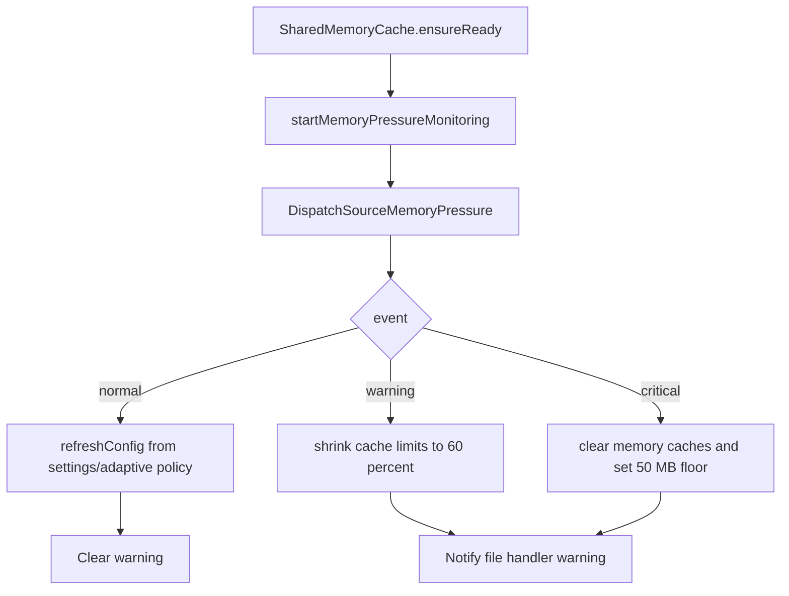

# Memory Pressure

RawCull can hold many images in memory while scanning and culling. The memory-pressure code exists to keep the app responsive when macOS reports pressure and to make cache behavior visible during development.

## Source Map

| File | Role |
|---|---|
| `Actors/SharedMemoryCache.swift` | Owns cache limits, memory-pressure dispatch source, pressure counters, and cache clearing |
| `Model/ViewModels/MemoryViewModel.swift` | Samples total system memory, used system memory, app memory, and pressure threshold for the UI |
| `Model/Cache/CacheConfig.swift` | Contains `CacheRecommendationPolicy` and cache-limit calculation |
| `Model/ViewModels/MemoryDiagnosticsViewModel.swift` | Writes diagnostics samples for cache/memory review |
| `Views/Settings/MemoryTab.swift` | Displays memory stats, cache limits, and pressure status |
| `Views/RawCullSidebarMainView/MemoryWarningLabelView.swift` | Shows the sidebar warning during pressure |

## Runtime Flow



`SharedMemoryCache` starts monitoring lazily during `ensureReady()`. That is called before thumbnail cache use, so the memory-pressure handler is active before large thumbnail work begins.

## Measuring System Memory

`MemoryViewModel.getUsedSystemMemory()` uses Mach VM statistics:

```text
usedMemory = min((wired + active + compressed) * pageSize, physicalMemory)
```

The model intentionally uses a simple definition of "used":

| VM field | Meaning |
|---|---|
| `wire_count` | Wired pages that cannot be paged out |
| `active_count` | Pages currently active |
| `compressor_page_count` | Pages held by the VM compressor |

The result is clamped to physical memory so the UI cannot show impossible totals.

## Measuring App Memory

RawCull measures its own process footprint with:

```text
task_info(... TASK_VM_INFO ...).phys_footprint
```

That is the value displayed as app memory usage. It is a better signal than simply adding image sizes because it reflects what the kernel says the process currently costs.

## Percentages In The UI

`MemoryViewModel` exposes:

```text
memoryPressurePercentage = memoryPressureThreshold / totalMemory * 100
usedMemoryPercentage = usedMemory / totalMemory * 100
appMemoryPercentage = appMemory / usedMemory * 100
```

The default pressure threshold is 85 percent of physical memory:

```text
memoryPressureThreshold = totalMemory * 0.85
```

This UI threshold is informational. The actual pressure response is driven by macOS `DispatchSourceMemoryPressure` events.

## Cache Limit Policy

`CacheRecommendationPolicy.adaptiveLimits(...)` is the first place to inspect when tuning memory behavior.

At normal pressure:

1. Choose a baseline from physical RAM.
2. Estimate free memory from Mach stats.
3. Keep a 3 GB reserve.
4. Use half of the remaining expandable memory as extra cache budget.
5. Split that extra budget 65 percent preview cache and 35 percent grid cache.
6. Round to 256 MB steps.
7. Clamp by machine tier and user maximums.

At non-normal pressure, RawCull returns reduced baseline limits and then the live pressure handler may shrink or clear active caches immediately.

## Pressure Responses

| Event | Code path | Effect |
|---|---|---|
| Normal | `handleMemoryPressureEvent`, `.normal` | Set pressure level to normal, increment normal counter, refresh config, clear warning |
| Warning | `.warning` | Set pressure level to warning, increment warning counter, reduce current preview/grid cost limits to 60 percent, show warning |
| Critical | `.critical` | Set pressure level to critical, increment critical counter, clear memory caches, reset manual counters, set preview limit to 50 MB |

The grid cache is cleared on critical pressure too. The disk caches are not deleted; only RAM is released.

## Why Pressure State Is Lock-Backed

`currentPressureLevel` is read by UI and diagnostics without `await`. The value is stored in an `OSAllocatedUnfairLock`, which makes the read/write contract explicit while avoiding a main-actor or cache-actor hop during frequent sampling.

The same pattern is used for pressure counters and cache cost/count mirrors.

## What To Check When Changing This Area

- Memory sampling should stay off the main actor; Mach calls run in `Task.detached`.
- Do not rely only on the 85 percent UI threshold; the real emergency signal is the kernel pressure event.
- If cache limits look strange, inspect both user settings and the adaptive tier caps.
- If diagnostics miss short pressure spikes, use cumulative pressure counters rather than only sampled pressure labels.
- Critical pressure should free RAM quickly and should not delete disk caches.
