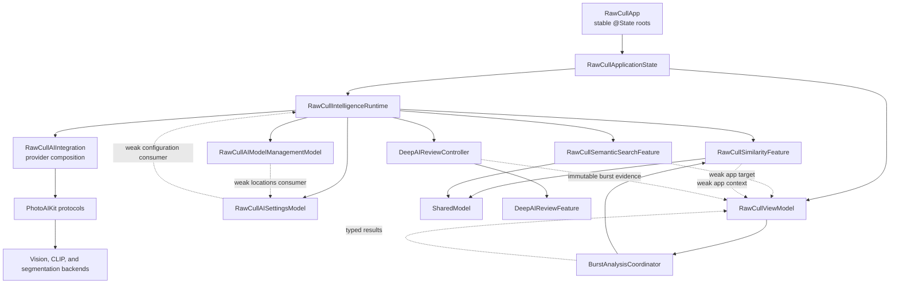
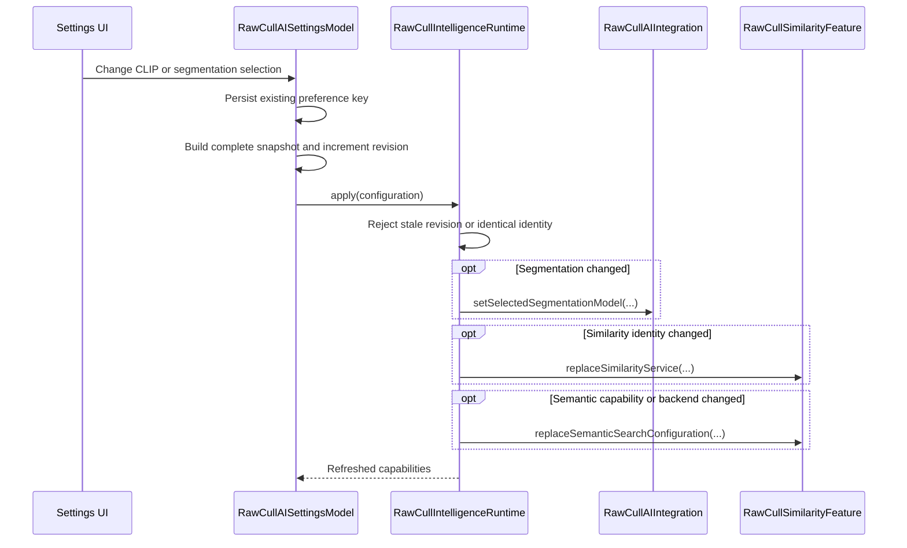
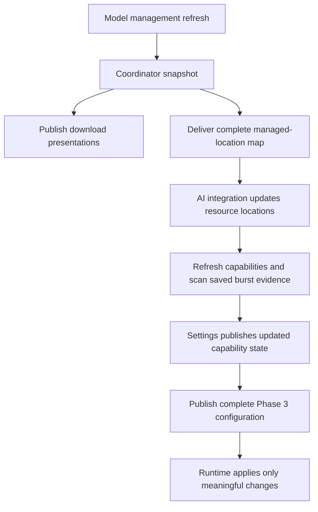
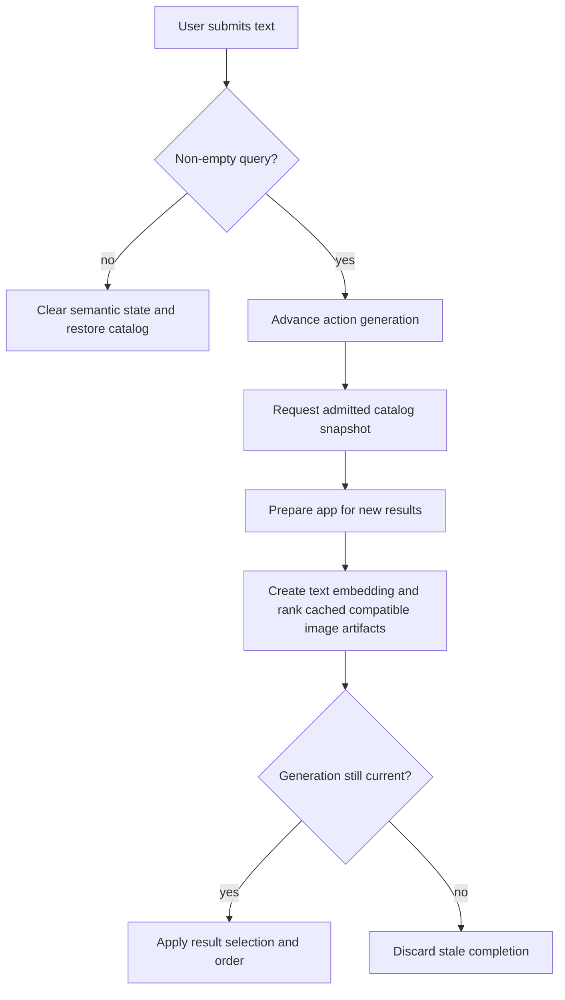
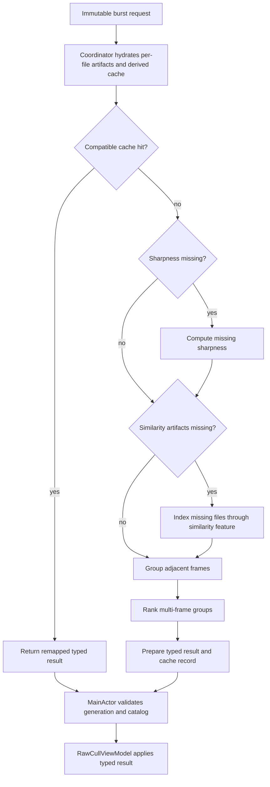
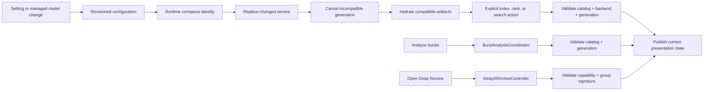

+++
author = "Thomas Evensen"
title = "Modular AI Integration"
date = "2026-08-29"
lastmod = "2026-08-31"
description = "How RawCull's completed modular AI refactor separates configuration, model management, similarity, semantic search, burst analysis, and optional Deep Review."
weight = 58
tags = ["ai", "architecture", "modularization", "semantic-search", "similarity", "burst-analysis"]
categories = ["technical details"]
mermaid = true
+++

# Modular AI Integration

RawCull's modular AI work reorganizes application ownership around stable,
focused feature boundaries. It does not replace Vision, CLIP, SAM 3, or
EfficientSAM with one new machine-learning model. In this documentation, "model"
can mean either an inference model installed on disk or an observable
application model that owns presentation state and actions. The refactoring is
primarily about the second meaning.

The implementation keeps PhotoAIKit as the reusable AI layer while RawCull owns
application composition, settings, catalog identity, task lifetime, culling
policy, and SwiftUI presentation. Phases 0–8 establish and migrate this
architecture, Phase 10 organizes it physically under `RawCull/Intelligence`, and
Phases 11–12 finalize the app-local boundary and remove transitional APIs.

> **Implementation status, 2026-08-31:** Phases 0–8 and 10–12 are implemented
> and automatically verified. Phase 9 remains intentionally deferred. The manual
> acceptance matrix for representative catalogs and installed licensed model
> resources remains pending; it is qualification work, not another architecture
> phase. Model downloads for the DataComp and OpenAI CLIP variants were manually
> verified during Phase 4.

## Why The Architecture Changed

AI behavior originally accumulated in several places at once:

- `RawCullViewModel` coordinated catalog state, semantic search, image
  similarity, burst analysis, persistence, selection, and review actions.
- settings used multiple callbacks to push related provider choices into the
  application;
- the app and settings could each appear to own parts of the AI lifetime;
- views reached through the central view model for operations that belonged to
  focused features;
- configuration, hydration, indexing, ranking, and cancellation did not have
  equally explicit request identities.

The modularization introduces one stable composition root and moves one vertical
slice at a time. Product behavior, cache formats, preference keys, backend
selection, and user-visible workflows remain compatible while ownership becomes
testable and easier to reason about.

## Architecture After Phases 7, 8, And 10



Solid arrows show lifetime ownership or dependency use. Dotted arrows are weak
application coordination edges. The weak edges allow a feature to request the
small amount of app behavior it needs without owning the app model and without
creating a retain cycle.

### Responsibility map

| Component                       | Current responsibility                                                                                                                                                                                            |
| ------------------------------- | ----------------------------------------------------------------------------------------------------------------------------------------------------------------------------------------------------------------- |
| `RawCullApp`                    | Retains one `RawCullApplicationState` in `@State` and exposes stable models to SwiftUI.                                                                                                                           |
| `RawCullApplicationState`       | Assembles the live object graph in a deterministic order and asserts shared object identity.                                                                                                                      |
| `RawCullIntelligenceRuntime`    | Owns the intelligence integration, focused similarity and semantic models, and Deep Review controller; accepts complete revisioned configurations and applies meaningful changes.                                 |
| `RawCullAIIntegration`          | Composes concrete PhotoAIKit providers, validates model resources, reports capabilities, and provides narrow similarity, semantic, and segmentation services.                                                     |
| `RawCullAISettingsModel`        | Owns user choices and capability presentation, persists preferences, and publishes one complete configuration snapshot.                                                                                           |
| `RawCullAIModelManagementModel` | Owns model-download presentation, licence state, managed locations, download tasks, validation, cancellation, and removal actions.                                                                                |
| `SimilarityScoringModel`        | Remains the single observable state store for similarity artifacts, indexing, distances, and semantic-search state.                                                                                               |
| `RawCullSimilarityFeature`      | Provides the Phase 6 API for catalog hydration, indexing, image ranking, backend presentation, cancellation, and stale-result protection.                                                                         |
| `RawCullSemanticSearchFeature`  | Provides semantic-search presentation and actions while projecting, rather than copying, state from the shared scoring model.                                                                                     |
| `BurstAnalysisCoordinator`      | Owns burst task lifetime, generation, progress, cache preparation and compatibility, missing compute, grouping, ranking, cancellation, and the primary derived-cache save.                                        |
| `DeepAIReviewController`        | Builds Deep Review requests from immutable application evidence, projects capability and operation state, and delegates execution to `DeepAIReviewFeature`.                                                       |
| `RawCullViewModel`              | Retains the stable burst coordinator and owns catalog snapshots, typed result application, selection, navigation, ratings, culling, review policy, manual winner overrides, undo, and recommendation application. |

## Invariants Preserved Across Every Phase

The refactoring is constrained by behavior rather than by file layout. These
invariants are especially important:

1. Vision feature prints remain the safe startup similarity backend.
2. CLIP is selected only when enabled and the chosen model produces a validated
   provider.
3. Semantic search requires compatible CLIP image artifacts and never performs
   hidden image indexing while executing a text query.
4. Similarity artifacts remain descriptor-validated. Backend, model,
   preprocessing, normalization, configuration, schema, and source fingerprint
   must be compatible before reuse.
5. A catalog change, backend change, cancellation, or superseding generation
   prevents late asynchronous work from publishing stale results.
6. Existing cache schemas, persisted descriptors, remapping behavior, ratings,
   selection, navigation, manual winners, undo, and review state remain intact.
7. SwiftUI observes one authoritative state owner for each value; feature
   boundaries do not introduce mirrored observable state.
8. PhotoAIKit remains independent of RawCull types and product policy.

## Phase 0 — Establish A Trustworthy Baseline

Phase 0 made the existing behavior measurable before changing ownership. The
baseline was recorded from the `version-3.1.1` reference and covered Debug,
Release, smoke, full, and performance gates as appropriate. It also captured the
resolved package state and the behavior of the important AI workflows.

The characterization suite established contracts for:

- application composition with Vision available before CLIP validation;
- saved burst evidence and compatible cache loading;
- similarity hydration, missing-only indexing, persistence, ranking, and
  cancellation;
- semantic-search completion, empty-index behavior, cancellation, and catalog
  restoration;
- burst analysis, regrouping, cache hits, manual overrides, and review state;
- Deep Review completion, cancellation, provider unavailability, and applying a
  recommended winner;
- model discovery, download state, licence acceptance, validation, and removal.

Phase 0 is part of the implementation because later phases use these tests as a
behavioral fence. A structural change is accepted only when it preserves the
characterized result, ordering, cache identity, and cancellation semantics.

## Phase 1 — Define And Enforce The Dependency Boundary

Phase 1 established the permitted dependency direction before moving code.


The important rule is that UI and application policy depend on narrow feature
surfaces, not on concrete backend products. `Scripts/VerifyAIImportBoundary.sh`
mechanically checks the app source for forbidden imports. A small, documented
set of existing `PhotoAIContracts` exposures remains as non-blocking migration
debt; the script prevents that surface from growing accidentally.

This phase deliberately did not reorganize directories or extract another
package. Logical dependency direction came first so later ownership changes
could be evaluated independently from physical movement.

## Phase 2 — Introduce A Stable Intelligence Runtime

Phase 2 created a lifetime container without moving feature behavior. The app
constructs one `RawCullApplicationState`, which contains exactly one
`RawCullIntelligenceRuntime` and one `RawCullViewModel`. The runtime retains the
integration, settings, model management, similarity, semantic-search, and Deep
Review objects needed for the full application lifetime.

`RawCullApplicationState.make(...)` assembles the graph in this order:

1. Create `RawCullAIModelManagementModel`.
2. Create `RawCullAISettingsModel` with that exact management model.
3. Ask settings for the initial typed configuration.
4. Create one `SimilarityScoringModel` from its initial similarity and semantic
   services.
5. Create `RawCullSimilarityFeature` over that scoring model.
6. Create `RawCullSemanticSearchFeature` over the same scoring model and the
   same similarity feature.
7. Create `RawCullViewModel` with those exact feature instances.
8. Create the runtime, bind its weak application edges, and bind settings to the
   runtime as its configuration consumer.

Identity assertions in the assembly method guard against accidentally creating a
second scoring model or feature instance. This matters because two otherwise
identical observable objects would split state updates between the UI and the
running operation.

Phase 2 preserves the distinction between ownership and coordination. Runtime
objects strongly own the features. Features refer back to the application only
through narrow weak protocols.

## Phase 3 — Replace Settings Callbacks With One Typed Configuration Path

Phase 3 replaces separate settings callbacks with a single revisioned
`RawCullIntelligenceConfiguration`. A snapshot carries:

- the selected similarity service;
- all artifact backend descriptors accepted by that service;
- semantic-search capability and its optional service;
- the selected segmentation model;
- a monotonically increasing revision.

The sendable identity contains descriptors and enum values, while service
existentials remain main-actor confined. This prevents concrete provider objects
from crossing concurrency domains merely to compare configuration.



The apply order is intentional: segmentation, then similarity, then semantic
search. Older revisions are ignored. A newer revision with the same identity is
accepted without resetting feature state. Reusing one complete snapshot avoids
transient combinations such as a new capability paired with an old provider.

The existing preference keys are preserved:

- `RawCullAI.useCLIPForSimilarity`
- `RawCullAI.selectedCLIPModel`
- `RawCullAI.selectedSegmentationModel`

## Phase 4 — Separate Settings From Model Management

Phase 4 extracts downloadable-model lifecycle state into
`RawCullAIModelManagementModel`. SwiftUI receives prepared
`RawCullAIModelDownloadPresentation` values and focused actions rather than the
catalog, coordinator, acceptance store, install locations, or task dictionary.

The management model owns:

- the production model catalog and per-model state;
- licence acceptance state;
- download, progress, validation, cancellation, removal, and refresh actions;
- top-level download tasks keyed by model ID;
- the complete set of successfully managed model locations.

The settings model retains the exact child management model and implements the
weak `RawCullAIManagedModelLocationsApplying` consumer. When managed locations
change, the sequence is:



This is a complete-state handoff, not a stream of individual path mutations. It
makes refresh, removal, and replacement converge on the same state. The model
download UI for both DataComp and OpenAI CLIP resources was manually exercised
after this phase; the broader cancellation and corrupt-download matrix remains
part of ongoing interactive qualification.

## Phase 5 — Migrate Semantic Search As A Vertical Slice

Phase 5 adds `RawCullSemanticSearchFeature` as the stable semantic-search UI and
action boundary. It does not introduce another semantic state store. Properties
such as capability, progress, indexed counts, selected IDs, result order, rank,
and score are computed projections of the shared `SimilarityScoringModel`.

The feature has one narrow weak application target,
`RawCullSemanticSearchApplicationTarget`, for behavior that genuinely belongs to
RawCull:

- admit the current catalog files to a query;
- prepare selection and presentation for a new query;
- invalidate scoped burst state when semantic selection changes;
- apply the semantic result selection;
- restore normal catalog order when a query is cleared or cancelled.

### Query behavior



`search(for:)` ranks only files with compatible cached CLIP artifacts. Source
decoding and image indexing are intentionally absent from the query action.
Indexing is an explicit similarity-feature action, so the UI can explain when
the semantic index is empty rather than starting expensive work invisibly.

The feature also owns an action generation. Clearing, cancelling, or starting a
new query advances that generation, ensuring a late result cannot reapply an old
selection. Semantic-search view-model forwarders were removed after callers
migrated to the feature directly.

## Phase 6 — Put Similarity Hydration, Indexing, And Ranking Behind One API

Phase 6 introduces `RawCullSimilarityFeature` as the application boundary for
image similarity. `SimilarityScoringModel` continues to own observable data; the
feature owns operation lifetime, typed requests, validation, and focused
presentation.

### Typed catalog and operation identities

The Phase 6 request values make the assumptions of an async operation explicit:

| Type                                       | Purpose                                                                                      |
| ------------------------------------------ | -------------------------------------------------------------------------------------------- |
| `RawCullSimilarityCatalogIdentity`         | Identifies the catalog URL and catalog generation.                                           |
| `RawCullSimilarityCatalogSnapshot`         | Couples ordered files to that identity.                                                      |
| `RawCullSimilarityCatalogHydrationRequest` | Hydrates both image and semantic artifacts for one catalog generation.                       |
| `RawCullSimilarityIndexRequest`            | Carries files, catalog identity, thumbnail size, and force-refresh policy.                   |
| `RawCullSimilarityRankingRequest`          | Carries anchor, ordered files, saliency information, and catalog identity.                   |
| `RawCullSimilarityRankingCompletion`       | Records the anchor, catalog identity, and backend identity that produced a valid completion. |

The feature owns separate hydration generations for image artifacts, semantic
artifacts, and catalog hydration, plus a ranking generation. Every completion
checks cancellation and the current catalog identity. Ranking additionally
checks that the backend is unchanged and that the model's final anchor matches
the request.

### Service replacement

When the Phase 3 runtime replaces the similarity service, the feature:

1. compares both the primary backend descriptor and the ordered accepted
   artifact descriptors;
2. asks the application context to cancel and reset backend-sensitive burst
   analysis;
3. installs the new service in the shared model;
4. cancels the prior image hydration generation;
5. hydrates compatible artifacts for the current catalog.

Semantic configuration replacement follows the same principle with its own task
and generation. This separation is necessary because burst similarity may use
Vision while semantic search requires CLIP artifacts from a matching model.

### Catalog hydration and indexing

Normal catalog indexing remains behaviorally compatible:

1. Hydrate descriptor-valid image-similarity artifacts.
2. Confirm that the catalog identity is still current.
3. Hydrate descriptor-valid semantic artifacts.
4. Confirm the identity again.
5. Index only missing files unless force refresh was requested.
6. Retain valid partial successes and report generation and persistence failures
   separately.
7. Persist reusable per-file artifacts without changing their existing schema.

Image-to-image ranking first ensures the requested file set has a complete
compatible index. It then ranks from the requested anchor and returns a typed
completion only if generation, catalog, backend, and anchor still match.

SwiftUI now calls focused feature actions and reads focused presentation values.
The main toolbar uses the feature's combined busy projection, and burst views
use the same feature surface where Phase 6 owns the behavior. Unused
transitional properties and cancellation forwarders were removed after caller
and Periphery audits.

### The intentional compatibility seam

The runtime and view model still retain the exact shared
`SimilarityScoringModel` for burst analysis and persistence. This is explicitly
marked as a Phases 7/9 compatibility reference, not as a second state owner.
Removing it during Phase 6 would have mixed the similarity UI migration with a
large burst-analysis rewrite.

## Phase 7 — Extract The Burst-Analysis Pipeline

Phase 7 was implemented on 2026-08-29 in four independently reviewable
subphases. The extraction preserves cache formats and application policy while
moving worker ownership out of `RawCullViewModel`.

### Phase 7A: immutable requests and results

Phase 7A introduced immutable, `Sendable` values that capture everything needed
to identify a burst run:

- catalog identity and ordered files;
- sharpness and similarity configuration signatures;
- analysis generation;
- selected backend and compatible artifact descriptors;
- typed groups, rankings, restored review state, cache outcome, and diagnostics.

The existing view-model pipeline first adopted these values without moving
worker, cache, or persistence ownership. Equality and sendability tests verify
that the snapshots match the previous inputs and cannot change beneath an
asynchronous operation.

### Phase 7B: cache hydration and compatibility decisions

Phase 7B moved per-file hydration, legacy import, derived cache loading,
artifact digests, and cache-hit decisions behind `BurstAnalysisCoordinator` and
its narrow cache-repository boundary. It preserves:

- current cache schemas and backend descriptors;
- file-ID remapping when a saved catalog is reopened;
- source-fingerprint and configuration compatibility checks;
- migrate-once behavior for legacy data;
- partial artifact reuse and invalid-entry rejection.

The coordinator returns an immutable cache-preparation value. The view model
validates and applies that value rather than making storage compatibility
decisions itself.

### Phase 7C: compute orchestration

Phase 7C extended the stable coordinator to perform missing sharpness work,
missing similarity indexing, grouping, ranking, progress sequencing, and the
primary derived-cache save. It accepts immutable snapshots and checks
cancellation and stale generations between expensive phases.



Background computation does not mutate application results directly. The
coordinator returns values; `RawCullViewModel` applies them on `MainActor` only
after checking the current generation and catalog identity.

### Phase 7D: reduce the central view model

Phase 7D made the stable, observable coordinator the owner of the task handle,
generation, progress, cache compatibility, computation, and primary save
lifecycle. `RawCullViewModel` retains:

- one stable coordinator reference;
- minimal progress and result projections needed by the UI;
- ratings, selection, navigation, manual winner overrides, undo, review state,
  and other application commands.

Transitional helpers were removed after caller and unused-code audits. The final
manual qualification still needs to exercise analyze, cancel, restore, regroup,
cached reopen, manual winner, and review flows end to end.

### Phase 7 validation

Focused coordinator and culling suites cover cache reuse, fresh computation,
progress, persistence, legacy remapping, membership-based review restoration,
cancellation, and stale-generation rejection. Exact-package Debug and Release
builds, performance tests, the AI import-boundary check, and diff checks passed.
The smoke plan passed 203 of 204 tests and the Thread Sanitizer plan passed 371
of 372 without runtime warnings; each plan's only failure was the pre-existing
release-metadata mismatch between 21 expected package pins and the 18 resolved
pins. The interactive burst qualification remains pending.

## Phase 8 — Isolate Deep Review As An Optional Capability

Phase 8 was implemented and automatically verified on 2026-08-30. The runtime
now owns one stable `DeepAIReviewController`. The controller privately adapts
immutable burst evidence into `DeepAIReviewRequest`, projects capability and
operation state, and delegates execution to `DeepAIReviewFeature`.

`DeepAIReviewSheetView` receives the controller rather than the application view
model, raw feature, request-building closure, or concrete provider checks. Its
typed presentation covers checking, unavailable, ready, preparing, running,
completing, cancelled, failed, and completed outcomes.

The boundary deliberately leaves product policy in the culling layer:

- group-signature validation before applying a recommendation;
- rating changes, winner overrides, review-state updates, and persistence;
- candidate limits, prompt policy, subject-mask scoring, provider selection, and
  cache behavior.

Focused controller, feature, runtime-identity, integration, culling, and
accessibility tests pass, as do exact-package Debug and Release builds and the
AI import-boundary check. The smoke plan passed 205 of 206 tests and the full
Thread Sanitizer plan passed 373 of 374 without runtime warnings; the only
failure in each was the same pre-existing package-pin metadata mismatch.
Interactive checks for unavailable providers, SAM 3 and EfficientSAM selection,
cancellation, retry, failure, success, and applying a matching recommendation
remain pending.

## Phase 9 — Persistence Boundary Deferred

Phase 9 is intentionally deferred until feature ownership has settled. The
future work will hide artifact codecs and PhotoAIKit storage records behind
feature-oriented repository operations while preserving the on-disk encoding,
legacy migrations, corrupt-record isolation, and partial-write behavior.

This phase is not a cache-schema redesign. Any schema change requires a separate
migration, compatibility, rollback, and release-version plan.

## Phase 10 — Organize The Established Boundary

Phase 10 was implemented and automatically verified on 2026-08-30. Twenty-six
existing source files moved byte-for-byte into ownership-oriented directories:

```text
RawCull/Intelligence/
  Composition/
  Contracts/
  Similarity/
  SemanticSearch/
  BurstAnalysis/
  DeepReview/
  ModelManagement/
  Persistence/
  Presentation/
```

SwiftUI screens remain under `RawCull/Views`. The persistence actors moved
physically, but their API remains unchanged because Phase 9 is deferred. The
synchronized Xcode root group discovered the hierarchy without project-file
membership edits.

All destination blobs match their pre-move Git hashes. Exact-package Debug and
Release builds, the AI import boundary, stale-path scan, combined Phase 7/8
regression suites, and diff checks pass. Compiler-indexed unused-code scans
found no unused code or imports in the moved boundary. Smoke passed 205 of 206
tests; the Thread Sanitizer plan passed 372 of 374 without runtime warnings.
Besides the known package-pin mismatch, one cancellation timing assertion missed
its window and passed immediately when its complete culling suite was rerun
under Thread Sanitizer. No production concurrency behavior changed in this
physical-only phase.

## Phase 11 — Keep The Boundary App-Local

Phase 11 completed the package decision on 2026-08-30. The intelligence boundary
remains in the application because its orchestration depends on RawCull catalog
identity, application paths, Background Assets wiring, settings, and culling
policy. Extracting those responsibilities would add adapter layers without
creating a cleaner dependency direction. Reconsider a package only if another
executable can reuse the orchestration with inputs independent of application
types and paths.

## Phase 12 — Enforce The Final Boundary

Phase 12 completed the caller audit and cleanup on 2026-08-30. Views now consume
focused similarity, semantic-search, and Deep Review surfaces. Removed
view-model forwarding members and provider-building initializers must not be
reintroduced. `Scripts/VerifyAIImportBoundary.sh` enforces exact production
file/module allowlists, prevents views and general model code from importing
restricted AI products, and rejects the removed compatibility APIs.

The final automated gates covered smoke, Thread Sanitizer, performance, Debug,
Release, dependency-boundary, and unused-code checks. Manual acceptance remains
separate because it requires a representative catalog and installed licensed
model resources.

## End-To-End Configuration And Operation Flow

The completed phases produce consistent paths from configuration and user
actions to guarded feature operations:



This flow prevents a settings change from reaching around the runtime, prevents
views from selecting concrete providers, and prevents async work from applying
results to the wrong catalog.

## Source Map

| Concern                                | Primary RawCull source                                                                                                       |
| -------------------------------------- | ---------------------------------------------------------------------------------------------------------------------------- |
| Composition and runtime                | `RawCull/Intelligence/Composition/RawCullIntelligenceRuntime.swift`                                                          |
| Concrete provider composition          | `RawCull/Intelligence/Composition/RawCullAIIntegration.swift`                                                                |
| Similarity feature API                 | `RawCull/Intelligence/Similarity/RawCullSimilarityFeature.swift`                                                             |
| Semantic-search feature API            | `RawCull/Intelligence/SemanticSearch/RawCullSemanticSearchFeature.swift`                                                     |
| Shared scoring state                   | `RawCull/Intelligence/Similarity/SimilarityScoringModel.swift`                                                               |
| Settings and configuration publication | `RawCull/Intelligence/ModelManagement/RawCullAISettingsModel.swift`                                                          |
| Download and installed-model lifecycle | `RawCull/Intelligence/ModelManagement/RawCullAIModelManagementModel.swift`                                                   |
| Burst values and orchestration         | `RawCull/Intelligence/BurstAnalysis/BurstAnalysisModels.swift`, `BurstAnalysisCoordinator.swift`, and coordinator extensions |
| Deep Review boundary                   | `RawCull/Intelligence/DeepReview/DeepAIReviewController.swift` and `DeepAIReviewFeature.swift`                               |
| Persistence actors                     | `RawCull/Intelligence/Persistence/PerFileAnalysisArtifactStore.swift` and `BurstAnalysisCache.swift`                         |
| Dependency-boundary verification       | `Scripts/VerifyAIImportBoundary.sh`                                                                                          |
| Detailed migration record              | `Docs/modularai.md`                                                                                                          |

For the reusable backend and contract design, continue with
[Artificial Intelligence](../ai/) and
[How PhotoAIKit Is Constructed](../packages/photoaikit/). For the burst
algorithm and persistence behavior preserved by the coordinator, see
[Burst Groups](../burstgroup/).

## Qualification Still Pending

The remaining interactive acceptance work covers startup and settings,
similarity and semantic search, burst analyze/cancel/restore/regroup flows, Deep
Review across available and unavailable segmentation providers, cache clearing,
saved-catalog reopen, and release termination behavior. Phase 9's persistence
boundary remains deferred. The Phase 11 package decision and Phase 12 cleanup
are complete and should not be presented as part of the manual qualification
pass.
