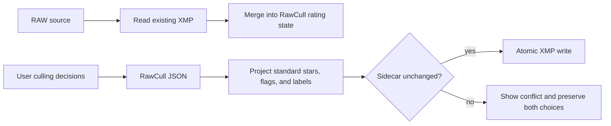

+++
author = "Thomas Evensen"
title = "Future Features and Competitive Evaluation"
linkTitle = "Future Features"
date = "2026-09-01"
lastmod = "2026-09-01"
description = "Competitive feature review and a prioritized roadmap for RawCull after version 3.2.0, including an evaluation of additional Core AI models."
tags = ["roadmap", "features", "culling", "ai", "core-ai", "competition", "xmp", "faces"]
categories = ["technical details"]
weight = 55
+++

# Future Features and Competitive Evaluation

This page evaluates possible RawCull features after version 3.2.0. It compares
the current implementation with representative professional culling products,
identifies the most important workflow gaps, and evaluates additional models
from Apple's Core AI model catalog.

The comparison was researched on 1 September 2026. Competitor products and
Apple's model catalog change frequently, so links to primary vendor sources are
included. The comparison is based on documented functions and inspection of
the RawCull source; it is not a controlled image-quality or speed benchmark.

The term *leading applications* in this document means representative products
with significant professional culling functionality. It is not a market-share
ranking.

## Executive Recommendation

RawCull should remain a focused, local, explainable culling application. It
should not try to become a complete editor, retouching suite, cloud gallery, or
delivery platform.

The most valuable next release would combine three features:

1. XMP interoperability with Lightroom Classic and Capture One;
2. face and eye inspection for portraits, events, and group photographs; and
3. an explainable, non-destructive first pass that organizes photographs into
   **Keep**, **Review**, and **Likely Reject**.

A suitable product description would be:

> RawCull First Pass: private, local, and explainable culling with face and eye
> inspection and seamless XMP handoff.

The first additional Core AI model to evaluate should be **EfficientSAM**. The
RawCull and PhotoAIKit integration already contains an EfficientSAM backend,
and the model is much smaller than SAM 3. Object detection and a small
vision-language model are reasonable later experiments, but they should not be
added until a measured culling problem justifies their download, memory, and
maintenance costs.

## Product Position

RawCull's strongest differentiator is not simply that it uses AI. Several
competitors also run culling locally. Its differentiator is the combination of:

- fast embedded RAW previews;
- Sony and Nikon camera autofocus-point extraction;
- full-frame, salient-subject, and AF-region sharpness evidence;
- visible focus masks and an explanation of ranking cautions;
- local visual similarity and burst grouping;
- local CLIP semantic search;
- non-destructive rating and review decisions; and
- no requirement to upload photographs for analysis.

This is a credible position: **show the photographer why one frame is stronger,
and leave the decision with the photographer**.

Future automation should preserve that contract. RawCull should not silently
delete a file, conceal a low-confidence result, or present a generative
explanation as measured fact.

## Version 3.0.0 and 3.2.0 Baseline

Version 3.0.0 is sometimes described as the non-AI version. More precisely, it
does not require separately downloaded AI models. It still uses Apple Vision
feature prints for image similarity and burst grouping, and PhotoAnalysisKit
uses Vision and Metal-based analysis. It does not provide CLIP text-to-image
search or segmentation-backed Deep Review.

Version 3.2.0 adds the optional Core AI layer:

| Capability | Version 3.0.0 | Version 3.2.0 |
|---|---|---|
| Embedded-preview culling | Yes | Yes |
| Sony ARW and Nikon NEF | Yes | Yes |
| EXIF and camera AF point | Yes | Yes |
| Sharpness calibration and focus masks | Yes | Yes |
| Vision feature-print similarity | Primary backend | Fallback backend |
| Burst grouping and candidate ranking | Yes | Yes |
| Local CLIP similarity | No | Optional |
| Natural-language semantic search | No | Optional; requires CLIP |
| SAM 3 or EfficientSAM Deep Review | No | Implemented but model-dependent |
| Managed model download workflow | No | Yes |

The normal culling workflow is deliberately shared. Features such as XMP,
improved ingest, broader formats, better review queues, and keyboard workflow
can therefore benefit both release lines. Model-dependent features should
degrade cleanly when no model is present.

## Current RawCull Capabilities

Source inspection confirms the following current application behavior:

- catalog discovery for registered Sony ARW and Nikon NEF files;
- concurrent EXIF, dimensions, camera, lens, ISO, aperture, and AF metadata;
- two-tier thumbnail caching plus full-size embedded/developed preview caches;
- AF overlays and GPU-generated focus masks;
- configurable sharpness scoring using full-frame, salient-subject, and
  AF-region evidence;
- visual grouping of neighboring frames and ranked burst candidates;
- manual comparison, burst workspaces, review/defer state, and manual winners;
- local CLIP image embeddings and text-query embeddings;
- Vision fallback when CLIP is unavailable or disabled;
- optional subject-mask Deep Review;
- reject, neutral keeper, and two- through five-star rating states;
- persisted ratings, analysis artifacts, burst decisions, cache signatures,
  and settings;
- embedded or developed JPEG export;
- rsync-based copying of tagged or minimum-rated RAW files, with progress and
  cancellation; and
- memory-pressure monitoring and cache diagnostics.

The application currently stores its rating decisions in RawCull's own JSON
data rather than writing standard XMP sidecars. This protects source files but
limits interoperability.

## Competitive Products Reviewed

### Aftershoot

Aftershoot offers automated, assisted, and manual culling. Its documented
workflow includes duplicate grouping, key faces, blur and closed-eye detection,
image scores, Selected/Highlight/Maybe/Blur/Closed Eyes groups, Survey Mode,
strictness controls, and preserved ratings and labels when exporting to
Lightroom Classic or Capture One.

Aftershoot also describes local/offline culling and non-destructive XMP
sidecars for RAW photographs. Its 2026 material promotes selection-style
learning and culling to a requested yield, although individual functions can
have staged availability.

Sources:

- [Aftershoot culling guide](https://support.aftershoot.com/en/articles/5223473-get-started-with-aftershoot-culling)
- [Aftershoot culling FAQ](https://aftershoot.com/culling-faq/)
- [Aftershoot technical behavior and XMP](https://support.aftershoot.com/en/articles/10601968-technical-answers-about-aftershoot)
- [Aftershoot cull-to-target status](https://support.aftershoot.com/en/articles/11533911-cull-to-target-with-aftershoot)

### Narrative Select

Narrative Select emphasizes assisted rather than opaque automatic decisions.
Its notable functions are synchronized face close-ups, individual face focus
and eye-state assessments, scene grouping, first-pass indicators, image
sharpness ranking, a people filter, rapid RAW loading, and direct handoff to an
editing workflow.

Narrative documents support for Canon CR2/CR3/CRW, Nikon NEF/NRW, Fuji RAF,
Sony ARW, Panasonic RW2, Olympus ORF, Pentax PEF, DNG, generic RAW, JPEG, HEIC,
and HEIF. It also states that images remain local and are not uploaded for
processing unless the user separately opts in to improvement use.

Sources:

- [Narrative Select feature overview](https://narrative.so/select)
- [Narrative face assessments](https://narrative.so/select/face-assessments)
- [Narrative Close-Ups panel](https://narrative.so/select/the-close-ups-panel)
- [Narrative camera and file compatibility](https://help.narrative.so/en/articles/7337390-what-camera-and-file-types-are-narrative-compatible-with)
- [How Narrative uses photographs](https://help.narrative.so/en/articles/7337412-how-does-narrative-use-your-photos)

### Adobe Lightroom Classic

Lightroom Classic Assisted Culling can select by subject focus, eye focus, and
eyes open. It can reject documents, receipts, probable misfires, and exposure
problems, and it can auto-stack by time and visual similarity. Results can be
turned into flags, ratings, labels, folders, or collections.

The June 2026 Faces panel presents every detected face together with eye-open
and eye-sharpness scores. Lightroom also added catalog-wide exact duplicate
detection across folders. This integration is important because it removes the
handoff step entirely for existing Lightroom customers.

Sources:

- [Lightroom Classic Assisted Culling](https://helpx.adobe.com/uk/lightroom-classic/help/assisted-culling.html)
- [Lightroom Classic June 2026 features](https://helpx.adobe.com/au/lightroom-classic/help/whats-new.html)
- [Lightroom Classic release notes](https://helpx.adobe.com/uk/lightroom-classic/help/whats-new/release-notes.html)

### Imagen

Imagen offers two clear automated policies: retain the best photograph from
each similar group, or cull to an exact number or percentage. It can identify
duplicates and low-rated images with blur, accidental-capture, or exposure
problems. Users review the results before sending selected photographs into
Imagen's editing workflow.

Imagen can show an edited preview before the culling decision, but culling is
performed on Imagen Cloud. This is a different product tradeoff from RawCull's
fully local analysis.

Sources:

- [Imagen AI culling introduction](https://support.imagen-ai.com/hc/en-us/articles/17225669268253-Get-started-with-AI-culling)
- [Imagen project and exact-target workflow](https://support.imagen-ai.com/hc/en-us/articles/29925087795357-Create-a-new-culling-project)

### FilterPixel

FilterPixel separates fast technical filtering from a genre-aware DeepCull.
The documented criteria include blur, focus, expressions, composition,
lighting, background, narrative value, brand safety, emotional moments, and
peak sports action. It promotes Keep/Review/Reject groups, best-of-burst
selection, target counts, and a score plus reason for each choice.

FilterPixel's public pages observed during this review were inconsistent about
whether DeepCull processing is local or cloud-based. RawCull should therefore
not use FilterPixel's processing location as a competitive fact without a new
verification. Its genre-aware selection and reason presentation are still
useful product references.

Sources:

- [FilterPixel product overview](https://filterpixel.com/)
- [FilterPixel DeepCull](https://filterpixel.com/deepcull)
- [FilterPixel workflow](https://filterpixel.com/blog/posts/how-to-use-filterpixel/)

### Photo Mechanic

Photo Mechanic remains a useful benchmark for ingest and metadata rather than
automatic AI selection. Its ingest can copy in the background, rename files,
apply metadata templates, create folders, track copied photographs, and open a
contact sheet while copying. It also provides tags, stars, configurable color
classes, XMP/IPTC interoperability, variables, and code replacements.

Sources:

- [Photo Mechanic ingest](https://docs.camerabits.com/support/solutions/articles/48000207409-ingesting-photos)
- [Photo Mechanic color classes and ratings](https://docs.camerabits.com/support/solutions/articles/48001142942-color-class-ratings)
- [Photo Mechanic terminology and XMP](https://docs.camerabits.com/support/solutions/articles/48001206190-glossary-of-terms)

## Capability Matrix

| Capability | RawCull 3.2 | Leading documented pattern | Evaluation |
|---|---|---|---|
| Embedded RAW preview speed | Yes, with memory/disk caches | Expected in every specialist culler | Competitive |
| Developed RAW preview | Yes | Available in broader editing products | Competitive for review |
| Camera AF-point evidence | Sony and Nikon | Rarely exposed as ranking evidence | RawCull advantage |
| Explainable sharpness | Full-frame, subject, AF region, confidence, cautions | Usually a single focus/blur score | RawCull advantage |
| Visual burst grouping | Neighboring-frame similarity | Duplicate stacks, scenes, auto-stacks | Competitive |
| Side-by-side comparison | Manual and burst workspaces | Survey and synchronized close-ups | Competitive; face synchronization missing |
| Semantic text search | Local CLIP | Not central in most specialist cullers | RawCull advantage |
| Face close-ups | No dedicated surface | Prominent in Narrative, Aftershoot, Lightroom | Major gap |
| Eye-open assessment | No | Standard for people photography | Major gap |
| Whole-shoot automatic first pass | No | Automated Keep/Review/Reject or equivalent | Major gap |
| Target number/percentage | No | Imagen; staged/advertised elsewhere | Gap |
| Exposure and misfire rejection | No automatic reject category | Lightroom and Imagen | Gap |
| Genre-aware moment selection | No | FilterPixel and other automated cullers | Long-term gap |
| Learning from corrections | No | Advertised by Aftershoot and FilterPixel | Long-term gap |
| Stars/reject state | Internal persistence | Standard | Present but isolated |
| Color labels and flags | No standard interchange | Common professional workflow | Gap |
| XMP read/write | No | Essential for Lightroom/Capture One handoff | Highest workflow gap |
| RAW formats | ARW and NEF | Major RAW families plus JPEG/HEIC | Large addressable-market gap |
| Safe card ingest | Selected-folder workflow | Rename, metadata, backup, verification | Partial |
| Local/offline inference | Yes | Also supported by some competitors | Strong, not unique alone |
| Exact duplicate files across folders | No | Lightroom catalog function | Low-priority gap |

## Recommended Roadmap

### P0: Release qualification for 3.2.0

Do not add a large new culling feature during the final release window. Finish
the contract already presented to users:

1. Run the complete automatic and manual acceptance matrix on representative
   ARW and NEF catalogs.
2. Verify a clean install, both CLIP downloads, cancellation, removal, relaunch,
   invalid-model recovery, and Vision fallback on the release candidate.
3. Decide whether Deep Review is a shipped feature, a manual-install preview,
   or a future feature, and make every UI and documentation statement agree.
4. Correct package-version and model-server documentation drift.
5. Record performance and peak memory for small, medium, and large catalogs.
6. Preserve a non-AI path whose basic culling workflow does not depend on model
   availability.

At the time of this review, the production code points to the GitHub `v2`
model manifest and both CLIP descriptors are ready. The README text still says
that the server is a non-routable placeholder. SAM 3 remains excluded by the
`includeSAM3 = false` product switch and is blocked for managed redistribution.

The AI dependency-boundary verifier passed. The smoke manifest enumerated 208
unique tests. The smoke run had one failure: the project and lockfile use
RawParserKit 1.3.0 while the RawCull README still documents 1.2.9. The observed
functional smoke tests passed; the failure was the release-metadata consistency
test.

### P1: XMP interoperability

This should be the first substantial feature after 3.2.0.

#### Required behavior

- Read existing XMP sidecars on catalog load.
- Import standard stars, reject flags, pick state, and color labels.
- Optionally import ratings written in-camera.
- Write RawCull decisions to a sidecar without modifying RAW bytes.
- Preserve unrelated XMP namespaces and fields.
- Detect whether the XMP changed since it was read.
- Present a conflict decision instead of overwriting newer metadata.
- Support batch write, cancellation, and atomic replacement.
- Offer explicit Lightroom Classic and Capture One label mappings.
- Provide **Write XMP**, **Reveal in Finder**, and **Open in editing app** actions.

#### Persistence rule

RawCull's internal JSON should remain the durable application record. XMP is an
interchange projection. That permits RawCull-specific analysis and review state
to evolve without placing private schemas into sidecars.

#### Acceptance criteria

- Round-trip a representative sidecar through Lightroom Classic.
- Round-trip stars and compatible labels through Capture One.
- Prove unrelated IPTC and application-specific fields are unchanged.
- Handle read-only catalogs, missing sidecars, malformed XML, and concurrent
  external edits.
- Never modify the RAW source while exporting rating metadata.

### P1: Face and eye inspection

People-specific assessment is the clearest feature gap against Narrative,
Aftershoot, and Lightroom.

#### Proposed interface

- A face strip beside the loupe and burst comparison.
- One crop for every important face, not only the largest face.
- Synchronized crops across the frames in a burst.
- Per-face sharpness and eye-region sharpness.
- Eye state: **Open**, **Closed**, **Uncertain**, or **Not visible**.
- Occlusion, profile, small-face, and low-resolution cautions.
- Main-subject versus background-face classification.
- An **Everyone acceptable** summary for group photographs.
- A shortcut that moves directly between questionable faces.

Eye state must not be reduced to a forced binary value. Sunglasses, profile
faces, motion, hair, tiny background faces, and deliberate expression require
an uncertain state. Automatic first-pass policy should send uncertainty to
Review rather than Likely Reject.

#### Evidence model

Each face result should record:

- normalized bounding box;
- face identity only within the active catalog or burst, unless the user
  explicitly enables persistent people grouping;
- face sharpness and eye-region sharpness;
- eye-state result and confidence;
- source fingerprint and analysis descriptor;
- whether the face is considered a main subject; and
- the reasons shown in the UI.

There is no dedicated face/eye-quality model in Apple's current public Core AI
model catalog. This feature therefore needs Apple Vision face observations,
possibly a purpose-trained eye-state model converted to Core AI, or both. A
general object detector or VLM should not be presented as a reliable substitute
without a labeled validation set.

### P1: Explainable First Pass

RawCull already produces much of the technical evidence needed for a useful
first pass. The first implementation can be a deterministic policy engine; it
does not need another neural network.

#### Output queues

| Queue | Meaning | Examples |
|---|---|---|
| **Keep** | Strong candidate with sufficient evidence | Best in burst, sharp subject, acceptable faces |
| **Review** | Creative or uncertain decision | Slight motion, uncertain eye state, disagreement between AF and subject evidence |
| **Likely Reject** | Strong technical reason to de-prioritize | Clearly missed focus, inferior duplicate, confirmed closed eyes in a posed group |

#### Safety invariants

- Never delete a source photograph.
- Always keep access to every queue.
- Retain at least one candidate per burst unless the user explicitly changes
  the rule.
- Put low-confidence or conflicting evidence in Review.
- Explain every automatic placement using stored evidence.
- Permit one-click override and undo.
- Re-running with changed policy must not erase manual ratings or winners.
- Persist policy identity so old results are not misrepresented after an
  algorithm change.

#### Initial evidence

- burst membership and within-burst rank;
- visual similarity distance;
- full-frame, salient-subject, and AF-region sharpness;
- AF-point containment and distance from the salient subject;
- analysis confidence and existing caution reasons;
- exposure clipping derived from image data rather than histogram appearance
  alone;
- face and eye results when available; and
- existing manual ratings and winners as hard overrides.

#### Target yield

After Keep/Review/Reject is trustworthy, add a requested target count or
percentage. The target is a policy constraint, not evidence of quality. RawCull
should show when reaching the requested number requires inclusion of weaker or
lower-confidence frames.

### P2: Local preference profiles

RawCull can learn useful preferences by adjusting transparent policy weights
before attempting end-to-end personalized AI.

Possible learned values include:

- preferred number of retained frames per burst;
- tolerance for subject motion and deliberate blur;
- relative importance of salient-subject sharpness and camera AF evidence;
- preferred subject size and framing;
- desired delivery percentage;
- treatment of uncertain eyes and background faces; and
- preference for technical perfection versus moment uniqueness.

Profiles should be named, inspectable, exportable, resettable, and scoped by
genre when the user wants that behavior. A profile must never silently turn a
manual reject into a keeper or replace a manual burst winner.

Suggested first profiles:

- Portrait and group;
- Wedding and event;
- Sports and action;
- Wildlife and birds;
- Landscape and architecture; and
- General/manual assistance.

Genre names should initially select documented weights and rules. Claims such
as *emotion*, *storytelling*, or *peak action* require separate labeled
evaluation before they become user-visible facts.

### P2: Broader format support

The market supports more camera systems than RawCull. A practical expansion
order is:

1. Canon CR3;
2. Fujifilm RAF;
3. DNG;
4. JPEG and HEIC/HEIF companions;
5. Panasonic RW2, Olympus ORF, and Pentax PEF.

Generic culling does not have to wait for MakerNote AF support. A format can
provide embedded preview, EXIF, sharpness, similarity, ratings, and XMP while
reporting that camera AF metadata is unavailable.

The UI should distinguish three states:

- camera AF point available and used;
- camera AF point absent or unsupported, with other evidence available; and
- image decoding or analysis unavailable.

This avoids treating broader format support as inferior or silently assigning
a false AF coordinate.

### P2: Safer ingest

RawCull should adopt a focused subset of Photo Mechanic's ingest strengths:

- camera-card detection;
- primary and backup destinations;
- optional checksum verification;
- configurable folder and filename templates;
- preservation of in-camera ratings;
- copy progress and cancellation;
- an ingest receipt containing source, destinations, counts, and failures; and
- optional eject only after successful verification.

Do not erase or format source media. Rich IPTC templates and sports code
replacement can remain outside RawCull unless users demonstrate demand.

### P3: Exact duplicates and catalog maintenance

Exact byte duplicates across folders are different from visually similar burst
frames. They require content hashing, catalog scope, and careful deletion or
move policy. This is useful but is closer to digital-asset management than
culling. It should follow the workflow features above.

## AI Evaluation

### Principles for adding another model

The existence of an Apple export recipe does not mean that RawCull should ship
the model. Every additional bundle creates:

- a download and storage cost;
- first-use specialization time;
- memory and energy pressure;
- another license and redistribution decision;
- another model fingerprint and cache-compatibility dimension;
- failure, cancellation, update, and removal states;
- a benchmark and regression obligation; and
- user-interface complexity.

A new model is justified only when it solves a measured culling problem better
than current Vision, CLIP, segmentation, deterministic analysis, or a small
purpose-trained model.

Apple's [Core AI Models repository](https://github.com/apple/coreai-models)
provides export recipes and Swift runtime utilities for macOS and iOS 27. The
[current upstream catalog](https://github.com/apple/coreai-models/blob/main/models/README.md)
includes language models, diffusion models, Qwen3-VL, CLIP, Depth Anything v3,
EDSR, EfficientSAM, PVT v2, SAM 3, YOLOS, audio models, and text encoders.
RawCull pins an exact repository revision, so features present on upstream
`main` are not automatically present in the version used by a release.

### Candidate model matrix

| Model or family | Possible RawCull use | Product fit | Recommendation |
|---|---|---|---|
| **EfficientSAM ViT-Tiny** | Subject masks from points, boxes, or a point grid; subject-detail focus scoring | High; existing PhotoAIKit and RawCull backend | Evaluate first and aim to make available after release gates |
| **SAM 3** | Text-guided subject segmentation and Deep Review | High capability, but 848M parameters and gated redistribution | Keep optional; do not block First Pass on it |
| **CLIP ViT-B/32** | Existing semantic search, similarity, zero-shot labels | Already central | Stabilize and benchmark; avoid model proliferation |
| **YOLOS Tiny/Base** | Object boxes, subject occupancy, possible ball/animal/person evidence | Medium; fixed object vocabulary and not a quality model | Prototype Tiny only after face/eye and First Pass |
| **Qwen3-VL 2B** | Local captions, scene summaries, possible moment/composition suggestions | Interesting but costly and generative | Research preview only; never technical ground truth |
| **Depth Anything v3 Small** | Foreground/background separation, depth layering, background-distraction evidence | Medium-low; segmentation and saliency already overlap | Experiment only if a benchmark proves incremental value |
| **PVT v2 B0** | Small visual backbone for a custom classifier | Low by itself; no culling-quality head | Use only as a base for a purpose-trained model |
| **EDSR x2** | Sharper-looking display crop | Poor for culling evidence because reconstruction can invent detail | Do not use for scoring; optional preview only |
| **RoBERTa/T5** | Query normalization or structured text processing | Low; CLIP queries and deterministic UI do not require them | Do not ship for current workflows |
| **Qwen/Gemma/Mistral/GPT-OSS LLMs** | Natural-language explanations from structured evidence | Low relative to size and complexity | Prefer deterministic explanations; no near-term bundle |
| **Stable Diffusion/FLUX** | Image generation | No culling purpose and risks changing evidence | Exclude |
| **CLAP/Whisper/Wav2Vec** | Audio understanding/transcription | No current still-photo culling purpose | Exclude |

### 1. EfficientSAM: strongest next candidate

Apple's current EfficientSAM recipe describes a 10-million-parameter ViT-Tiny
model. It supports a foreground click, box prompt, multiple point queries, and
a segment-everything point grid. RawCull already has:

- a `CoreAIEfficientSAMBackend` dependency;
- an EfficientSAM provider path in `RawCullAIIntegration`;
- an EfficientSAM model directory;
- a `RawCullSegmentationModel.efficientSAM` identity; and
- Deep Review code capable of consuming subject masks.

The missing work is primarily product inclusion, model packaging, validation,
license/provenance clearance, download-catalog support, and quality evaluation.

Recommended use:

- make EfficientSAM the lightweight Deep Review candidate;
- discover likely foreground subjects with a bounded point grid;
- combine masks with saliency and camera AF points;
- let the user click or box the intended subject when automatic discovery is
  ambiguous; and
- cache masks using the full model and prompt identity.

Required evaluation:

- portraits, groups, animals, birds, sports, landscapes, and low-light scenes;
- subject selection success rather than generic segmentation metrics alone;
- mask placement and boundary quality;
- AF-point containment stability;
- detail-score stability inside the selected mask;
- false selection of background objects;
- latency, peak memory, first-use specialization, cache size, and energy; and
- quality comparison against SAM 3 on the same labeled cases.

EfficientSAM does not understand a text target. The UI must describe point-grid
or user-prompted selection accurately and must not imply SAM 3-style language
grounding.

### 2. SAM 3: premium text-guided Deep Review

SAM 3 remains valuable when a photographer wants to specify *bird*, *face*,
*player*, or another text target. Apple's recipe describes an 848-million-
parameter gated model. The capability is stronger than EfficientSAM's point
prompts, but the size, gated access, and redistribution review make it a poor
mandatory dependency.

Recommended policy:

- keep Vision and ordinary burst review fully functional without it;
- treat SAM 3 as an optional advanced model;
- make its managed download visible only after legal and provenance clearance;
- require explicit license acceptance if the final legal review requires it;
- compare its added winner-selection value with EfficientSAM, not only mask
  appearance; and
- avoid advertising Deep Review as turnkey while normal users cannot obtain
  the model through the app.

### 3. Dedicated face and eye model: needed but not in the catalog

The most important new AI capability is face/eye quality, yet Apple's public
Core AI model catalog currently contains no dedicated model for:

- eyes open versus closed;
- eye-region sharpness;
- facial-expression suitability;
- gaze or camera engagement;
- group-photo all-faces acceptance; or
- intentional versus accidental eye closure.

RawCull should first evaluate Vision face rectangles and landmarks combined
with the existing sharpness analyzer. If eye-state classification remains
insufficient, a small purpose-trained classifier is a better fit than adding a
general 2B vision-language model.

Such a classifier needs consented or properly licensed training/evaluation
data, coverage across skin tones and ages, glasses and sunglasses, profiles,
occlusions, makeup, low light, motion, and small faces, plus explicit
uncertainty calibration. Accuracy must be reported per condition, not only as a
single aggregate percentage.

### 4. YOLOS: possible object evidence

Apple provides YOLOS Tiny at approximately 6.5 million parameters and YOLOS
Base at approximately 127 million parameters, together with an object-detection
runtime product. A detector could provide:

- person, animal, vehicle, or sports-object boxes;
- subject occupancy and edge-cutoff cautions;
- possible ball-in-frame evidence for selected sports; and
- a subject ROI when saliency is ambiguous.

Limitations:

- a general object vocabulary does not equal photographic importance;
- detection confidence does not measure focus, expression, composition, or
  peak action;
- it cannot replace a dedicated face/eye assessment; and
- unsupported subjects could bias the first-pass policy.

If evaluated, begin with YOLOS Tiny and use detections as optional evidence,
never as an automatic reject condition.

### 5. Qwen3-VL: later research only

Apple's current upstream `main` contains a Core AI export path for
Qwen3-VL-2B-Instruct with a 448-pixel vision encoder, token embedding, text
decoder, tokenizer, and bundle metadata. This capability may be newer than the
exact `coreai-models` revision pinned by RawCull.

Potential experiments:

- create searchable catalog captions;
- summarize a burst's visible differences;
- suggest scene or genre labels;
- identify possible emotional or peak-action moments; and
- turn structured evidence into accessible natural language.

Risks:

- generative claims can hallucinate details or intent;
- a 448-pixel view may miss the technical detail used for focus decisions;
- per-image inference across a large catalog may be too slow or memory-heavy;
- captions add a new private persistent-data category;
- a VLM can sound more certain than its evidence; and
- the model and tokenizer create a much larger distribution obligation.

Any VLM result must be labeled as a suggestion. It must not override measured
sharpness, face results, user ratings, or manual winners. A small deterministic
formatter remains preferable for explanations such as “subject sharpness was
higher and the AF point was inside the selected mask.”

### 6. Depth Anything v3: limited incremental value

Depth Anything v3 Small predicts monocular depth and confidence. It might help
measure subject separation, background complexity, foreground obstructions, or
depth-layer composition.

However, RawCull already has saliency and optional segmentation. Depth is not
itself a culling-quality measure, and incorrect monocular depth can create
confident but irrelevant rankings. Evaluate it only against a labeled feature
such as “background distraction” or “subject separation.” Do not add it merely
because a Core AI recipe exists.

### 7. EDSR: never use reconstructed detail for sharpness scoring

EDSR can enlarge a low-resolution preview, but super-resolution creates an
estimate of detail rather than evidence from the source. It must not feed:

- sharpness scoring;
- AF-region scoring;
- focus masks;
- eye sharpness;
- burst winner selection; or
- any label presented as source-image quality.

An optional display-only enhancement could be considered, but RawCull can
already extract embedded previews or develop the RAW. That makes EDSR a low
priority even for presentation.

## Model Admission Gates

Every new model should pass all gates below before it appears in production
Settings.

### Product gate

- Name the user problem and the decision improved by the model.
- Define a non-model baseline.
- Demonstrate incremental value on representative RawCull catalogs.
- Confirm that the feature remains understandable and reversible.

### Quality gate

- Use a versioned, labeled evaluation set.
- Separate technical metrics from subjective photographer preference.
- Record false-positive and false-negative costs.
- Calibrate an uncertain state where applicable.
- Compare results across supported cameras, genres, and difficult conditions.
- Require human review of ranking changes, not only tensor parity.

### Conversion and identity gate

- Pin the exact upstream revision and weight checksum.
- Record the exact Core AI exporter and PhotoAIKit revisions.
- Verify reference/Core AI parity using the real preprocessing path.
- Fingerprint the complete runtime bundle and tokenizer/resources.
- Include preprocessing, normalization, dimensions, and output interpretation
  in the backend descriptor.
- Invalidate only incompatible cached artifacts after a model change.

### Performance gate

- Measure cold specialization and warm inference separately.
- Record median and tail latency per image.
- Record peak resident memory and memory-pressure behavior.
- Test bounded concurrency and cancellation.
- Measure a realistic 500-, 2,000-, and 10,000-image workflow where relevant.
- Confirm that UI interaction and thumbnail loading remain responsive.

### Distribution gate

- Complete license and redistribution review for weights and converted assets.
- Preserve model card, notices, upstream revision, export command, and hashes.
- Verify the archive produced by Managed Background Assets.
- Test download, cancellation, validation, relaunch, update, removal, and
  insufficient-storage behavior.
- Do not confuse technical success with permission to redistribute.

### Presentation gate

- State whether a result is measured, inferred, or generated.
- Show confidence and meaningful uncertainty.
- Do not hide unavailable models behind unexplained disabled controls.
- Provide fallback behavior and recovery steps.
- Maintain VoiceOver descriptions for progress, result, confidence, and error
  states.

## Proposed AI Model Roadmap

| Stage | Models | Goal |
|---|---|---|
| 3.2 release | Vision plus DataComp/OpenAI CLIP | Stable similarity, burst grouping, and semantic search |
| 3.3 candidate | EfficientSAM | Lightweight, obtainable Deep Review and user-prompted subject masks |
| Later optional | SAM 3 | Text-guided premium Deep Review after redistribution clearance |
| Parallel research | Vision plus a small eye-state classifier | Face/eye inspection and group-photo review |
| Later experiment | YOLOS Tiny | Optional object/subject evidence |
| Research only | Qwen3-VL 2B | Captions and subjective suggestions, never technical ground truth |
| Evidence-dependent | Depth Anything v3 | Background/subject-separation evidence only if benchmarks justify it |

This ordering solves product needs rather than maximizing the number of models
shown in Settings.

## Features Not Recommended

RawCull should defer or reject the following unless its product scope changes:

- RAW editing profiles and automatic editing;
- retouching and generative removal;
- cloud galleries, proofing, print sales, and delivery;
- diffusion-based image generation;
- destructive automatic rejection or deletion;
- an LLM used only to rewrite deterministic evidence in friendlier words;
- super-resolution used as quality evidence;
- persistent face recognition by default; and
- a large model marketplace without a specific culling purpose for every
  model.

Aftershoot and Imagen are developing broad cull-edit-retouch-deliver systems.
Competing on their complete scope would consume resources without strengthening
RawCull's most defensible advantages.

## Success Measures

Future features should be judged by user outcomes rather than by model count.
Useful measures include:

- time from catalog open to completed first pass;
- time spent zooming into faces;
- percentage of automatic placements the photographer changes;
- missed-keeper rate in Likely Reject;
- number of unresolved Review images;
- agreement with manually chosen burst winners;
- XMP round-trip success rate;
- catalog formats and cameras admitted successfully;
- peak memory and cancellation latency; and
- percentage of workflows completed without leaving RawCull before handoff.

For automatic culling, missed keepers matter more than a superficially high
overall accuracy score. The default policy should be conservative enough that
uncertain photographs remain visible in Review.

## Recommended Next Design Work

Before implementation, prepare three focused specifications:

1. an XMP mapping and conflict-resolution specification;
2. a face/eye evidence schema and labeled acceptance matrix; and
3. a First Pass policy document defining queue invariants, reasons, target
   yield, overrides, persistence identity, and failure behavior.

EfficientSAM can be evaluated in parallel because its backend boundary already
exists. It should not delay XMP or the deterministic First Pass, and a new model
should never be required merely to display existing RawCull evidence clearly.
