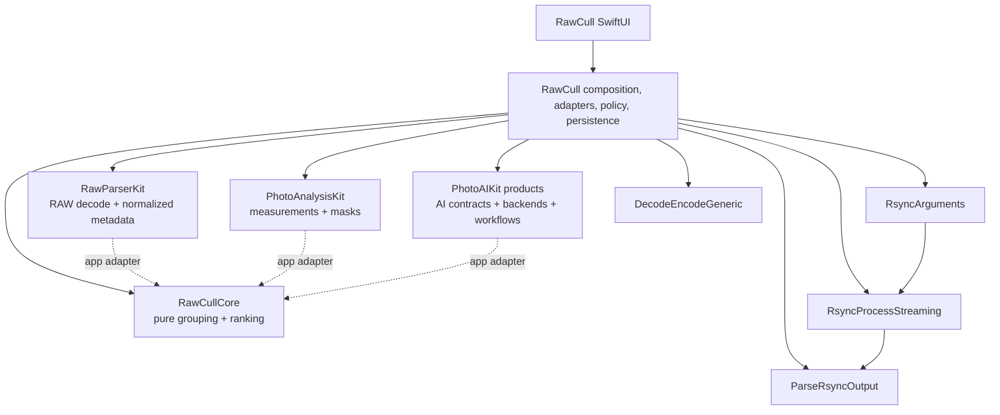

+++
author = "Thomas Evensen"
title = "RawCull Packages"
linkTitle = "Packages"
date = "2026-08-21"
description = "Pinned package revisions, imported products, dependency direction, and the recommended architecture reading order."
tags = ["ai", "analysis", "raw", "swift-package", "packages"]
categories = ["technical details"]
mermaid = true
weight = 60
+++

# RawCull Packages

RawCull is the composition root for four architecture packages and four small
rsync/persistence support packages. The package repositories are separately
versioned. They are **not** copied source snapshots inside TechDocRawCull; paths
under `Sources/` and `Tests/` in these guides refer to the named package
repository at the revision resolved by the app.

## Resolved Dependency Snapshot

This table is derived from
`RawCull.xcodeproj/project.xcworkspace/xcshareddata/swiftpm/Package.resolved`.
“App” means RawCull links a product directly; “transitive” means another package
owns the dependency. A revision-only pin has no semantic-version label.

| Identity | Relationship | Version/branch | Revision |
|---|---|---|---|
| PhotoAIKit | app | revision pin | `1e2eaccd00947fbadda300e4a617842479cae7b9` |
| PhotoAnalysisKit | app | `1.2.0` | `6e83ceebbca47a5dea0b1b2b4ee8b9132c281449` |
| RawCullCore | app | `1.1.2` | `d25a51e65ad32a82bf82f86fa0ec07d6e14498e9` |
| RawParserKit | app | `1.2.8` | `0576a7cfbbdb48a5e0cd34569f2fce53e6d72a54` |
| RsyncArguments | app | `1.0.0` | `0ff6518136c208dfbecc1a918f045048ca79853d` |
| RsyncProcessStreaming | app | `1.0.0` | `dd86f012b352888fd146e0b6e103740dc237f740` |
| ParseRsyncOutput | app | `1.0.0` | `e079e0c9d34bf07f7f2a4312b40feea79ae14847` |
| DecodeEncodeGeneric | app | `1.0.0` | `b5ecbbbe1b244191efec1532a979f6ae342d6617` |
| coreai-models | transitive from PhotoAIKit | revision pin | `bffc38fe48f50e4e962ac9772b64a5b55a605286` |
| EventSource | transitive | `1.4.1` | `a3a85a85214caf642abaa96ae664e4c772a59f6e` |
| swift-asn1 | transitive | `1.7.1` | `a9a5efd40eaf558a2bcd48d64b1d1646be686008` |
| swift-atomics | transitive | `1.3.1` | `0442cb5a3f98ab802acb777929fdb446bda11a34` |
| swift-collections | transitive | `1.6.0` | `a0cb0954ecb21e4e31b0070e6ed5674e8556685a` |
| swift-crypto | transitive | `4.5.1` | `47d3869a7291f085c1fb9fb1e6d3b97a793f45c6` |
| swift-huggingface | transitive | `0.9.0` | `b721959445b617d0bf03910b2b4aced345fd93bf` |
| swift-jinja | transitive | `2.4.2` | `7d0b8880ef8e567dd4e0089f8b99fb354129017c` |
| swift-nio | transitive | `2.101.3` | `0b18836bd8b0162e7e17a995a3fbee20ed8f3b2b` |
| swift-system | transitive | `1.8.0` | `704705c5c51156ede21172a38654d522ce487074` |
| swift-transformers | transitive | `1.3.3` | `2fa33e1f5e7131a7fc64c28e6d161dcec0d24820` |
| xgrammar | transitive | `main` | `3210db25b1d144a26904dce5935102f38e014902` |
| yyjson | transitive | `0.12.0` | `8b4a38dc994a110abaec8a400615567bd996105f` |

Do not infer the app boundary from every transitive pin. Xcode product references
and source imports define what RawCull actually consumes.

## Imported Products And Boundary Types

| Package | Products imported by RawCull | Values or protocols crossing the boundary |
|---|---|---|
| [RawParserKit](rawparserkit/) | `RawParserKit` | `RawImageLoader`, `RawImageMetadata`, `RawFocusPoint`, `RawFormatRegistry`, `CGImage` results; the app maps them through `RawParserKitImageLoader` |
| [PhotoAnalysisKit](photoanalysiskit/) | `PhotoAnalysisKit` | `PhotoAnalyzer`, `PhotoAnalysisInput`, `PhotoAnalysisDescriptor`, `PhotoAnalysisResult`, focus evidence and mask values |
| [RawCullCore](rawcullcore/) | `RawCullCore` | `RawCullFileItem`, `RawCullSourceCatalog`, `ExifMetadata`, burst inputs/results/configurations, ranking evidence, histograms; the app exposes compatibility typealiases such as `FileItem` |
| [PhotoAIKit](photoaikit/) | `PhotoAIContracts`, `CoreAICLIPBackend`, `CoreAISAM3Backend`, `CoreAIEfficientSAMBackend`, `VisionFeaturePrintBackend`, `PhotoAIWorkflows`, `PhotoAIStorage` | `AIImageSource`, model identities/resources, similarity artifacts/descriptors, provider protocols, segmentation requests/results, mask stores and workflows |
| RsyncArguments | `RsyncArguments` | rsync argument builders used by `Params` and `ArgumentsSynchronize` |
| RsyncProcessStreaming | `RsyncProcessStreaming` | `RsyncProcess` and `ProcessHandlers` used by the copy executor |
| ParseRsyncOutput | `ParseRsyncOutput` | parsed transfer progress and totals used by `RemoteDataNumbers` |
| DecodeEncodeGeneric | `DecodeEncodeGeneric` | generic JSON encode/decode used by saved-file persistence |

RawCull owns the translations between these vocabularies. None of the four
architecture packages imports another merely to share an app model.

## Dependency Direction

Solid arrows are compile-time imports by the app or support flow. Dotted arrows
are value translation performed by RawCull, not package dependencies.

## Recommended Reading Order

1. [RawParserKit](rawparserkit/) — a file becomes an orientation-normalized
   image and neutral metadata.
2. [PhotoAnalysisKit](photoanalysiskit/) — a decoded image becomes sharpness,
   saliency, focus evidence, and masks.
3. [RawCullCore](rawcullcore/) — measurements become burst boundaries,
   recommendations, and review state.
4. [PhotoAIKit](photoaikit/) — optional CLIP similarity/semantic search and
   segmentation run behind typed contracts.
5. Return to the app pages to see RawCull compose those independent boundaries,
   persist results, and present policy.

When a package pin changes, compare its manifest and public source at the new
resolved revision before updating this documentation. A sibling checkout may
be ahead of the revision RawCull actually builds.
