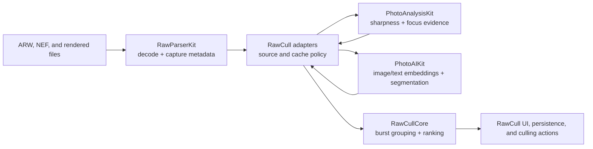

+++
author = "Thomas Evensen"
title = "RawCull Packages"
linkTitle = "Packages"
date = "2026-07-30"
description = "Architecture guide to the four reusable Swift packages used by RawCull."
tags = ["ai", "analysis", "raw", "swift-package", "packages"]
categories = ["technical details"]
mermaid = true
weight = 60
+++

# RawCull Packages

RawCull is split across four reusable Swift packages. Each package owns one kind
of knowledge and deliberately avoids importing the others. RawCull is the
composition root: it decodes a file and capture metadata with RawParserKit, asks
PhotoAnalysisKit or PhotoAIKit to measure or index it, translates the evidence
into RawCullCore values and decisions, and presents or persists the outcome.

The arrows are runtime data flow, not package dependencies. The four sibling
packages do not depend on one another; the RawCull application imports and
adapts them.

| Package                               | Owns                                                                                                                                                            | Deliberately leaves to RawCull                                                                       |
| ------------------------------------- | --------------------------------------------------------------------------------------------------------------------------------------------------------------- | ---------------------------------------------------------------------------------------------------- |
| [PhotoAIKit](photoaikit/)             | Model validation, CLIP image and text embeddings, image/text semantic comparison, SAM 3, Vision similarity artifacts, AI workflows, and optional storage codecs | Model installation, RAW decoding, query and result presentation, cache locations, and culling policy |
| [PhotoAnalysisKit](photoanalysiskit/) | Sharpness scoring, saliency and classification, focus evidence and masks, calibration, and Vision feature prints                                                | File decoding, source identity, persistence, settings wording, and culling decisions                 |
| [RawCullCore](rawcullcore/)           | Package-safe metadata, capture-time and exposure-aware burst grouping, evidence-based ranking, focus-point normalization, and luminance histograms              | RAW parsing, image analysis, application state, storage, and presentation                            |
| [RawParserKit](rawparserkit/)         | Vendor dispatch, MakerNote and embedded-JPEG parsing, image loading, orientation, structured capture/EXIF extraction, and bounded decode work                   | Analysis, scoring, catalogs, cache policy, and UI                                                    |

## Recommended Reading Order

1. Start with RawParserKit to see how a file becomes a normalized image and
   metadata.
2. Continue with PhotoAnalysisKit to see how a decoded image becomes sharpness
   and focus evidence.
3. Read RawCullCore to see how measurements become burst boundaries and
   recommendations.
4. Read PhotoAIKit for optional CLIP image similarity, text-query semantic
   search, and SAM 3 segmentation workflows.

The source for this section is the current `PhotoAIKit`, `PhotoAnalysisKit`,
`RawCullCore`, `RawParserKit`, and `RawCull` repositories under
`/Users/thomas/GitHub/RawCull`. In each package guide, paths beginning with
`Sources/` and `Tests/` are relative to that package. Paths beginning with
`RawCull/` are relative to the RawCull application repository.
