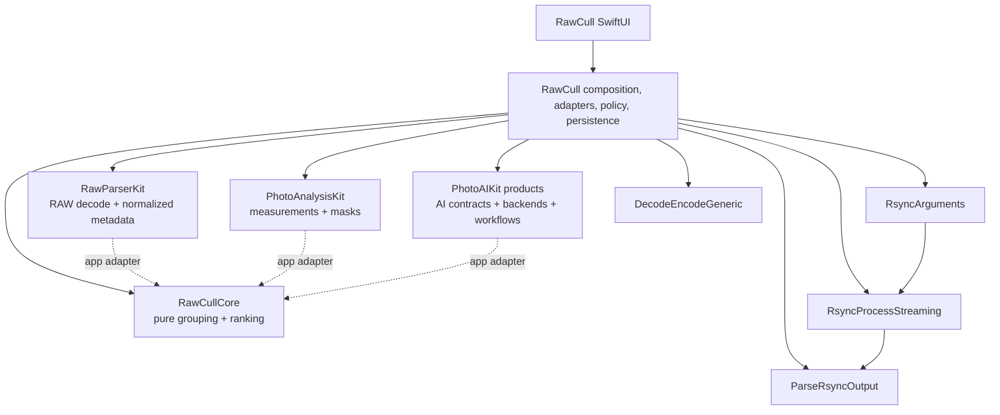

+++
author = "Thomas Evensen"
title = "RawCull Packages"
linkTitle = "Packages"
date = "2026-08-21"
lastmod = "2026-09-15"
description = "Pinned package revisions, imported products, dependency direction, and the recommended architecture reading order."
tags = ["ai", "analysis", "raw", "swift-package", "packages"]
categories = ["technical details"]
mermaid = true
weight = 60
+++

# RawCull Packages

RawCull is the composition root for four architecture packages and four small
rsync/persistence support packages. The package repositories are separately
versioned. They are **not** copied source snapshots inside TechDocRawCull; paths
under `Sources/` and `Tests/` in these guides refer to the named package
repository at the revision resolved by the app.

## Resolved Dependency Snapshot

This table is derived from
`RawCull.xcodeproj/project.xcworkspace/xcshareddata/swiftpm/Package.resolved`.
“App” means RawCull links a product directly; “transitive” means another package
owns the dependency. A revision-only pin has no semantic-version label.

| Identity              | Relationship               | Version/branch | Revision                                   |
| --------------------- | -------------------------- | -------------- | ------------------------------------------ |
| PhotoAIKit            | app                        | revision pin   | `20e57359603313af7c2d38cae3e8b6e37f8838ef` |
| PhotoAnalysisKit      | app                        | `1.3.1`        | `2a1466e04d821fa2628d6985296643e0d0c7e465` |
| RawCullCore           | app                        | `1.1.2`        | `d25a51e65ad32a82bf82f86fa0ec07d6e14498e9` |
| RawParserKit          | app                        | `1.3.0`        | `d2175ed880d39021bdb5f5a2a842b460af0b316c` |
| RsyncArguments        | app                        | `1.0.0`        | `0ff6518136c208dfbecc1a918f045048ca79853d` |
| RsyncProcessStreaming | app                        | `1.0.0`        | `dd86f012b352888fd146e0b6e103740dc237f740` |
| ParseRsyncOutput      | app                        | `1.0.0`        | `e079e0c9d34bf07f7f2a4312b40feea79ae14847` |
| DecodeEncodeGeneric   | app                        | `1.0.0`        | `b5ecbbbe1b244191efec1532a979f6ae342d6617` |
| coreai-models         | transitive from PhotoAIKit | revision pin   | `cc812078731871574c9b2eb620aa40734c4b89ee` |
| EventSource           | transitive                 | `1.5.1`        | `86b5096ac59ab46e66bd1f6377c604bc1dab0bc2` |
| swift-asn1            | transitive                 | `1.7.2`        | `d9a5b37470adc940d22c3bcd5ca6953a516b727f` |
| swift-collections     | transitive                 | `1.6.0`        | `a0cb0954ecb21e4e31b0070e6ed5674e8556685a` |
| swift-crypto          | transitive                 | `4.5.2`        | `da9d28d69ebe3894b18376c8f2395c2f37b8448f` |
| swift-huggingface     | transitive                 | `0.10.1`       | `b5403ed09403f674601fd1123e07c5b32914d16f` |
| swift-jinja           | transitive                 | `2.5.1`        | `4588064a20f3fc093c95f2f7d3359999bf30cae5` |
| swift-transformers    | transitive                 | `1.3.4`        | `c21fdcde390313a6d98d8e33a346f2c3486c3ab0` |
| xgrammar              | transitive                 | `0.2.2`        | `4d145cc13d878c751ebeed36af1c013074be76bc` |
| yyjson                | transitive                 | `0.12.0`       | `8b4a38dc994a110abaec8a400615567bd996105f` |

Do not infer the app boundary from every transitive pin. Xcode product
references and source imports define what RawCull actually consumes.

## Imported Products And Boundary Types

| Package                               | Products imported by RawCull                                                                                                                                 | Values or protocols crossing the boundary                                                                                                                                                  |
| ------------------------------------- | ------------------------------------------------------------------------------------------------------------------------------------------------------------ | ------------------------------------------------------------------------------------------------------------------------------------------------------------------------------------------ |
| [RawParserKit](rawparserkit/)         | `RawParserKit`                                                                                                                                               | `RawImageLoader`, `RawImageMetadata`, `RawFocusPoint`, `RawFormatRegistry`, `CGImage` results; the app maps them through `RawParserKitImageLoader`                                         |
| [PhotoAnalysisKit](photoanalysiskit/) | `PhotoAnalysisKit`                                                                                                                                           | `PhotoAnalyzer`, `PhotoAnalysisInput`, `PhotoAnalysisDescriptor`, `PhotoAnalysisResult`, focus evidence and mask values                                                                    |
| [RawCullCore](rawcullcore/)           | `RawCullCore`                                                                                                                                                | `RawCullFileItem`, `RawCullSourceCatalog`, `ExifMetadata`, burst inputs/results/configurations, ranking evidence, histograms; the app exposes compatibility typealiases such as `FileItem` |
| [PhotoAIKit](photoaikit/)             | `PhotoAIContracts`, `CoreAICLIPBackend`, `CoreAISAM3Backend`, `CoreAIEfficientSAMBackend`, `VisionFeaturePrintBackend`, `PhotoAIWorkflows`, `PhotoAIStorage` | `AIImageSource`, model identities/resources, similarity artifacts/descriptors, provider protocols, segmentation requests/results, mask stores and workflows                                |
| RsyncArguments                        | `RsyncArguments`                                                                                                                                             | rsync argument builders used by `Params` and `ArgumentsSynchronize`                                                                                                                        |
| RsyncProcessStreaming                 | `RsyncProcessStreaming`                                                                                                                                      | `RsyncProcess` and `ProcessHandlers` used by the copy executor                                                                                                                             |
| ParseRsyncOutput                      | `ParseRsyncOutput`                                                                                                                                           | parsed transfer progress and totals used by `RemoteDataNumbers`                                                                                                                            |
| DecodeEncodeGeneric                   | `DecodeEncodeGeneric`                                                                                                                                        | generic JSON encode/decode used by saved-file persistence                                                                                                                                  |

RawCull owns the translations between these vocabularies. None of the four
architecture packages imports another merely to share an app model.

## Dependency Direction

Solid arrows are compile-time imports by the app or support flow. Dotted arrows
are value translation performed by RawCull, not package dependencies.

## Recommended Reading Order

1. [RawParserKit](rawparserkit/) — a file becomes an orientation-normalized
   image and neutral metadata.
2. [PhotoAnalysisKit](photoanalysiskit/) — a decoded image becomes sharpness,
   saliency, focus evidence, and masks.
3. [RawCullCore](rawcullcore/) — measurements become burst boundaries,
   recommendations, and review state.
4. [PhotoAIKit](photoaikit/) — optional CLIP similarity/semantic search and
   segmentation run behind typed contracts.
5. Return to the app pages to see RawCull compose those independent boundaries,
   persist results, and present policy.

When a package pin changes, compare its manifest and public source at the new
resolved revision before updating this documentation. A sibling checkout may be
ahead of the revision RawCull actually builds.
