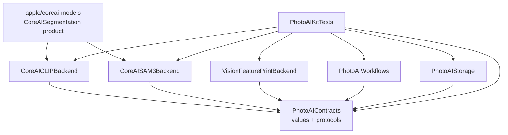
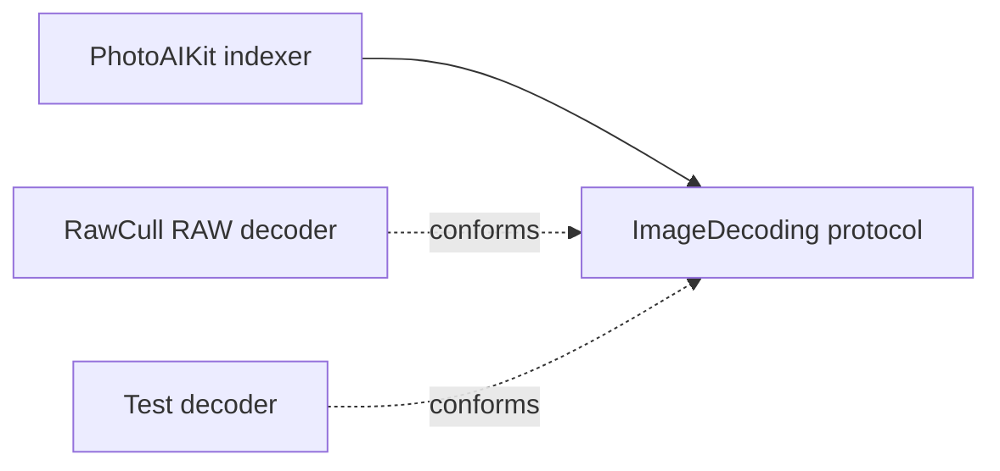

+++
author = "Thomas Evensen"
title = "How PhotoAIKit Is Constructed"
linkTitle = "PhotoAIKit Architecture"
date = "2026-07-30"
description = "A detailed guide to PhotoAIKit's contracts, CLIP image and text inference, semantic comparison, SAM 3, workflows, storage, concurrency, and model identity."
tags = ["ai", "swift-package", "clip", "semantic-search", "sam3", "architecture"]
categories = ["technical details"]
mermaid = true
weight = 10
+++

# How PhotoAIKit Is Constructed

PhotoAIKit is a reusable Swift package extracted from application code. Its most
important achievement is not merely that CLIP and SAM 3 run. It is that reusable
AI behavior has been separated from RawCull's UI, RAW-file handling, paths,
sandbox rules, and culling policy.

This document explains the construction from the bottom up and gives the reason
for each boundary.

## 1. Begin With The Package Boundary

The package owns:

- typed, `Sendable` contracts;
- model-bundle validation and fingerprinted model identity;
- Core AI CLIP image and text inference plus SAM 3 inference;
- validated image/text semantic comparison;
- Apple Vision feature-print generation and comparison;
- bounded similarity indexing and explicit fallback;
- segmentation, mask selection, geometry, and catalog workflows;
- optional artifact codecs and mask stores.

The host application owns:

- model download, installation, candidate URLs, and sandbox bookmarks;
- RAW decoding and application image models;
- SwiftUI, Observation state, and display wording;
- app-specific task staleness such as “latest selection wins”;
- query admission, result ordering, filtering, and semantic-search presentation;
- culling, burst ranking, sharpness, saliency, and rating policy;
- helper-process launch and application restart behavior.

This boundary makes PhotoAIKit reusable. A package that imports `FileItem` or
searches `Bundle.main` for a RawCull resource might be convenient for one app,
but it would silently encode application policy into the AI layer.

## 2. Read `Package.swift` As An Architecture Diagram

`PhotoAIKit/Package.swift` declares Swift tools 6.4, macOS 27, Swift 6 language
mode, six library products, and one test target. The only external package
dependency is a pinned revision of `apple/coreai-models`.



There is intentionally no large umbrella target in which every feature can reach
every implementation. Each higher-level product depends on `PhotoAIContracts`,
but the backends, workflows, and storage products do not depend on one another.

Why this shape helps:

- A host can import only the products it uses.
- Workflow code is testable with fake providers and decoders.
- Storage does not need to know which inference backend produced a value.
- A backend cannot accidentally reach into RawCull or into another backend.
- Framework-heavy dependencies remain concentrated in concrete backend targets.

## 3. `PhotoAIContracts`: The Stable Center

Contracts are the innermost layer. They contain data and protocol definitions,
not application decisions.

### 3.1 Translate Host Photos Into `AIImageSource`

`Sources/PhotoAIContracts/AIImageSource.swift` defines the package-owned source
value:

```swift
public struct AIImageSource: Codable, Hashable, Identifiable, Sendable {
    public let id: UUID
    public let url: URL
    public let displayName: String
}
```

RawCull maps `FileItem` into this type at its integration boundary. PhotoAIKit
therefore receives only what a reusable indexing or segmentation workflow needs.
It never learns ratings, focus data, camera metadata, or view state.

`SourceFileIdentity` reads size and modification date. `SourceFingerprint` adds
the standardized path. These values let persisted artifacts answer a crucial
cache question: “Was this result produced for the current contents of this
source file?”

### 3.2 Invert Image Decoding

PhotoAIKit declares:

```swift
public protocol ImageDecoding: Sendable {
    func image(for source: AIImageSource) async throws -> CGImage
}
```

The package needs a `CGImage`, but it should not prescribe how one is obtained.
A JPEG host can use ImageIO; RawCull can try `RawParserKit` first; tests can
return a generated image. The workflow depends on the capability, not on a
camera-format implementation.

This is the dependency-inversion principle in a small, concrete form:



### 3.3 Separate Generation From Comparison

`Sources/PhotoAIContracts/SimilarityArtifact.swift` defines two protocols:

- `ImageSimilarityArtifactProviding` creates an artifact from a `CGImage` and
  source.
- `ImageSimilarityArtifactComparing` computes the distance between two
  compatible artifacts.

The combined `ImageSimilarityBackend` type alias requires both.

The split matters because generation can be actor-isolated and expensive, while
comparison may be synchronous and nonisolated. It also keeps distance semantics
with the backend that understands its payload. RawCull does not decode a
`VNFeaturePrintObservation`, nor does it implement CLIP cosine distance from
unverified arbitrary data.

### 3.4 Keep Text Queries Query-Scoped

`Sources/PhotoAIContracts/TextEmbedding.swift` defines a second, deliberately
different similarity value. `TextEmbedding` contains a normalized text vector
and a `TextEmbeddingDescriptor` with the complete backend identity, dimensions,
tokenizer version, and schema version.

Text embeddings are not file-backed `SimilarityArtifact` values. They have no
source fingerprint and are intended to live for one query. The split public
protocols mirror the image API:

- `TextEmbeddingProviding` tokenizes and encodes a query.
- `ImageTextSimilarityComparing` compares a compatible image artifact with the
  text embedding.
- `ImageTextSimilarityBackend` combines both capabilities.

The comparison returns cosine similarity in `-1...1`, where a larger value is a
closer semantic match. It is a relative retrieval score, not a confidence or a
keep/reject decision.

### 3.5 Make Persisted Artifacts Self-Describing

A `SimilarityArtifact` has two fields:

```text
SimilarityArtifact
├── descriptor
│   ├── backend
│   ├── model fingerprint
│   ├── dimensions
│   ├── representation
│   ├── preprocessing version
│   ├── normalization version
│   ├── configuration version
│   ├── source fingerprint
│   └── schema version
└── payload (backend-owned Data)
```

This looks more elaborate than storing `[Float]`, but it prevents subtle cache
bugs. A vector is not reusable merely because its dimension matches. Reuse is
valid only if the source, model asset, preprocessing, normalization,
configuration, representation, and schema are still the same.

`SimilarityArtifactDescriptor.isCompatibleForDistance(with:)` intentionally
compares every backend/configuration field but excludes the source fingerprint.
Two different photos must have different source fingerprints, yet their
artifacts can still be compared when they were produced by the same backend
definition.

### 3.6 Treat Model Identity As Data

The model types are spread across:

- `ModelIdentity.swift`;
- `ModelAssetFingerprint.swift`;
- `ModelBundleResolver.swift`;
- `ModelResource.swift`.

`ModelIdentity.cacheIdentifier` preserves compatibility with older cache naming.
`artifactIdentifier` adds the selected asset fingerprint for new artifacts. This
distinction allows migration without pretending that two different model
binaries are the same model.

`ModelResourceDescriptor.clip` and `.sam3` describe package-neutral requirements
and version strings. `ModelCapabilityStatus` reports `available`, `missing`, or
`invalid` without user-facing wording. The host translates that status into its
own settings UI.

## 4. Model Bundles Are Supplied, Not Discovered

PhotoAIKit never chooses an application directory. The host supplies one URL or
an ordered list of candidates.

A valid bundle has this conceptual layout:

```text
ModelBundle/
├── metadata.json
├── tokenizer/
│   └── tokenizer.json
└── selected-model.aimodel  (or .aimodelc)
```

`metadata.json` names the selected model in `assets.main`. New exports can also
provide `asset_fingerprints.main`.

`ModelBundleResolver` validates, in order:

1. the URL exists and is a directory;
2. `metadata.json` decodes;
3. `assets.main` is present and non-empty;
4. the asset extension is accepted;
5. the selected asset exists;
6. required resources such as `tokenizer/tokenizer.json` exist;
7. the model asset can be fingerprinted;
8. a manifest checksum, when present, matches the actual asset.

For a file asset, the cryptographic algorithm is SHA-256. For a compiled model
directory, PhotoAIKit hashes a stable sorted tree representation. Older
manifests without a checksum receive a size/modification-time fallback
fingerprint. That fallback can detect replacement in place but is marked as not
cryptographically verified.

`ModelProviderFactory<Provider>` connects validation to a backend constructor. A
backend supplies “how to make me from a validated URL”; the host supplies “which
URLs should be considered, and in what order.”

Candidate order is policy, not just presentation. `ModelResourceResolver` skips
a candidate that is missing, but returns immediately when it finds an invalid
candidate. This prevents a damaged higher-priority installation from being
silently hidden by a lower-priority fallback.

CLIP has a second validation layer after generic bundle resolution.
`CLIPRuntimeConfiguration` reads the model contract from metadata: source model
and revision, architecture, pretrained checkpoint, embedding dimensions,
preprocessing dimensions and normalization, tokenizer context and padding, named
image/text functions, normalization version, and configuration version. Current
bundles use shortest-side resize, a centered square crop, and bicubic
interpolation. Older PhotoAIKit bundles remain compatible through the original
224-pixel stretch and bilinear defaults.

This separation prevents a library update from unexpectedly changing an
application's installation or sandbox policy.

## 5. Concrete Backend Products

### 5.1 `CoreAICLIPBackend`

`CoreAICLIPProvider` is an actor conforming to image embedding, artifact
generation/comparison, text embedding, and image/text comparison protocols.

Its responsibilities are deliberately backend-specific:

- validate the supplied CLIP bundle;
- lazily load and cache the named image and text Core AI functions;
- validate tensor names, shapes, scalar types, dimensions, and metadata;
- create the image, token, and attention-mask NDArrays;
- apply the model-declared resize/crop policy in sRGB and CLIP channel
  normalization;
- L2-normalize image vectors through `ImageEmbedding`;
- validate that the exported graph's text vector is finite, non-empty, correctly
  shaped, and already L2-normalized;
- encode the vector as an artifact payload;
- compute cosine distance only after descriptor and payload validation.

The actor owns `loadedModel`, so lazy initialization is isolated from concurrent
callers.

For a semantic query, the same provider creates a `TextEmbedding` and
`similarity(image:text:)` rejects every incompatible model, representation,
dimension, preprocessing, normalization, configuration, tokenizer, schema, or
payload before computing a dot product. Vision artifacts are rejected because
they are not in CLIP's image/text embedding space.

RawCull's `RawCullCLIPSemanticSearchService` keeps the product policy outside
the backend: it trims and admits a literal query, selects already-persisted
compatible image artifacts, isolates per-file failures, reports progress, and
orders equal scores deterministically. It never decodes an image or persists a
query embedding.

### 5.2 `CoreAISAM3Backend`

`CoreAISAM3Provider` conforms to `SubjectSegmenting`. It owns tokenizer setup,
lazy model loading, request inference, query selection, confidence conversion,
mask decoding, resizing, thresholding, feathering, timing, and diagnostics.

The public contract speaks in `SubjectSegmentationRequest` and
`SubjectSegmentationResult`, not Core AI tensors. This lets workflows and hosts
work at the domain level while the backend handles framework details.

### 5.3 `VisionFeaturePrintBackend`

This actor uses `VNGenerateImageFeaturePrintRequest`. The produced
`VNFeaturePrintObservation` is securely archived into an opaque artifact
payload.

Comparison returns to this backend, which unarchives the observations and calls
Vision's native `computeDistance`. The observation never becomes part of
RawCull's persistence API. This is an example of **information hiding**: callers
can store and route the artifact without learning its private representation.

## 6. `PhotoAIWorkflows`: Reusable Orchestration

Backends operate on one image or request. Workflows coordinate many sources and
reusable policies.

### 6.1 Similarity Indexing

`EmbeddingIndexer` is the vector-specific API. `SimilarityArtifactIndexer` is
the more general API used when the fallback might have an opaque representation
such as a Vision feature print.

Both indexers accept:

- package-owned sources;
- an injected decoder;
- a primary provider;
- an optional fallback provider;
- an explicit fallback policy;
- a concurrency limit;
- an async progress callback.

They use a throwing task group but enqueue only `concurrencyLimit` children.
Each time one finishes, one new source is added. This is bounded concurrency: a
catalog with 20,000 files does not create 20,000 live tasks and decoded images.

The fallback policies are:

| Policy        | Behavior                                                                 | Appropriate when                                |
| ------------- | ------------------------------------------------------------------------ | ----------------------------------------------- |
| `.none`       | Keep primary successes and failures                                      | There is no compatible fallback                 |
| `.perItem`    | Retry only a failed item                                                 | Primary and fallback results can safely coexist |
| `.wholeBatch` | If any primary item fails, rerun every requested source through fallback | A batch must use one comparable representation  |

The indexer does not decide which policy is correct for RawCull. The host
selects `.wholeBatch` for CLIP-to-Vision fallback.

### 6.2 Segmentation Workflows

The SAM 3 side is split into focused units:

| Type                        | Responsibility                                                                                   |
| --------------------------- | ------------------------------------------------------------------------------------------------ |
| `SegmentationService`       | Resize/preprocess coordination, cache lookup, inference, persistence, partitioning, and prefetch |
| `SegmentationBatchPipeline` | Batch generation, progress events, summary, and versioned JSON-lines transport                   |
| `SubjectMaskRepository`     | Cache-only access using explicit prompt/model/size configuration                                 |
| `SubjectMaskSelector`       | Ordered prompt fallback, quality/confidence thresholds, and best-mask selection                  |
| `SubjectMaskCatalogIndex`   | Incremental cache inventory without invoking inference                                           |
| `SubjectMaskGeometry`       | Alpha coverage, bounds, centroid, and freshness                                                  |
| `SubjectMaskQuality`        | Reusable geometry-based quality classification                                                   |

The package can decide which mask best satisfies a general selection strategy.
RawCull still decides which photo is a culling candidate or winner. Reusable
mask quality is not the same concern as product ranking policy.

## 7. `PhotoAIStorage`: Optional Persistence Mechanics

Storage depends only on contracts.

For similarity data:

- `SimilarityArtifactCodec` wraps an artifact in a versioned envelope.
- `EmbeddingCodec` writes descriptor-complete CLIP artifacts.
- `decodeMigrating` reads current data and two version-1 formats, but legacy
  values are accepted only against the real current model identity and are
  marked for immediate rewrite.
- `LegacyCLIPEmbeddingCodec` remains a staged migration reader; its
  identity-incomplete writer is deprecated.

For segmentation:

- `SubjectMaskMemoryStore` is an injected actor-backed dictionary.
- `SubjectMaskDiskStore` stores PNG mask data plus JSON metadata, validates the
  storage key, reports disk usage, supports pruning, and rejects stale or
  corrupt entries.

The host injects the disk directory. PhotoAIKit owns how the record is encoded
and validated, while the application owns where records live and when they are
removed.

## 8. Concurrency And Isolation

PhotoAIKit targets Swift 6 and makes boundary values `Sendable`.

The main patterns are:

- **Actors for mutable runtime state:** providers lazily cache loaded models;
  services and stores protect mutable state.
- **Value types for transport:** sources, identities, descriptors, progress,
  failures, and configuration values cross tasks safely.
- **Bounded task groups:** indexers and prefetch workflows limit simultaneous
  work.
- **Cooperative cancellation:** workflow boundaries and expensive stages call
  `Task.checkCancellation()`.
- **Async progress callbacks:** the package reports neutral progress values; a
  host decides how and where to publish UI state.

Actor isolation does not remove the need for a host policy. RawCull still owns
generation tokens and catalog checks that prevent an older task from replacing
results for a newer selection.

## 9. Testing The Architecture, Not Only The Math

Most of `Tests/PhotoAIKitTests/` exercises the products through public APIs. The
CLIP text suite also uses `@testable import` for deterministic tokenizer, batch,
tensor-shape, and preprocessing checks that sit below the provider boundary.
Together the tests cover architectural promises such as:

- model bundles are accepted through supplied URLs;
- manifest fingerprints become artifact identity;
- provider factories and resource resolvers share validation;
- CLIP normalization and cosine distance remain stable;
- model-declared CLIP preprocessing and legacy preprocessing remain compatible;
- token batches, attention masks, text-output validation, and image/text
  compatibility checks reject malformed or mismatched data;
- whole-batch fallback produces a homogeneous result set;
- Vision artifacts stay opaque and use the native metric;
- segmentation caches by package-owned source values;
- disk stores reject stale or corrupt entries;
- legacy data is a rewrite candidate, not silently current data;
- batch transport has an explicit versioned schema;
- cancellation crosses the service boundary.

Fake decoders, providers, and stores make these tests possible. That testability
is a direct consequence of putting protocols in the innermost target.

## 10. Developer Tools And Model Assets

The package includes tools under `Tools/` for exporting CLIP and SAM 3 assets,
selecting a SAM 3 asset, generating fingerprints, and producing reference CLIP
image/text similarities. Output paths are explicit.

`export_clip.py` supports the existing OpenAI `clip-vit-base-patch32` model and
OpenCLIP `ViT-B-32-256` with `datacomp_s34b_b86k` weights. It writes the image
and text encoders as named functions in one Core AI asset, verifies tokenizer
parity for the OpenCLIP export, and records the runtime metadata consumed by
`CLIPRuntimeConfiguration`.

The Swift package itself declares no model resources. It does not embed
`.aimodel`, `.aimodelc`, tokenizer, or metadata assets. Model binaries are large
deployment inputs with their own lifecycle; keeping them out of the library
avoids coupling package source, application installation, and model
distribution.

## 11. How To Add Another Similarity Backend

Use the existing layering as a checklist:

1. Add or reuse package-neutral contract values in `PhotoAIContracts`; do not
   add host types.
2. Create a separate backend target that depends on contracts.
3. Conform to artifact providing and comparing protocols.
4. Give the backend a complete `SimilarityBackendDescriptor`.
5. Put framework-specific payload encoding and distance semantics inside that
   backend.
6. If the backend supports text, add a query-scoped descriptor and keep
   image/text compatibility checks with that backend.
7. Reuse `SimilarityArtifactIndexer` and inject the host's decoder.
8. Decide explicitly whether fallback is none, per-item, or whole-batch.
9. Add public-API tests with fake sources and model-free inputs where possible.
10. Let the host choose model URLs, cache locations, settings, and product
    policy.

If a proposed type needs SwiftUI, `FileItem`, a RawCull path, or a burst rating,
it probably belongs in RawCull's adapter layer instead.

## Source Map

| Topic                                     | PhotoAIKit source                                                                                                                 |
| ----------------------------------------- | --------------------------------------------------------------------------------------------------------------------------------- |
| Products and dependency graph             | `Package.swift`                                                                                                                   |
| Host-neutral image and decoder boundary   | `Sources/PhotoAIContracts/AIImageSource.swift`, `ImageEmbedding.swift`                                                            |
| Model validation and identity             | `Sources/PhotoAIContracts/ModelBundleResolver.swift`, `ModelResource.swift`, `ModelIdentity.swift`, `ModelAssetFingerprint.swift` |
| Similarity descriptors and protocols      | `Sources/PhotoAIContracts/SimilarityArtifact.swift`                                                                               |
| Text embeddings and image/text comparison | `Sources/PhotoAIContracts/TextEmbedding.swift`                                                                                    |
| Segmentation contracts                    | `Sources/PhotoAIContracts/SubjectSegmentation.swift`, `SubjectMaskStorage.swift`                                                  |
| CLIP runtime and backend                  | `Sources/CoreAICLIPBackend/CLIPRuntimeConfiguration.swift`, `CoreAICLIPProvider.swift`                                            |
| SAM 3 backend                             | `Sources/CoreAISAM3Backend/CoreAISAM3Provider.swift`                                                                              |
| Vision backend                            | `Sources/VisionFeaturePrintBackend/VisionFeaturePrintBackend.swift`                                                               |
| Similarity orchestration                  | `Sources/PhotoAIWorkflows/EmbeddingIndexer.swift`, `SimilarityArtifactIndexer.swift`                                              |
| Segmentation orchestration                | `Sources/PhotoAIWorkflows/SegmentationService.swift`, `SegmentationBatchPipeline.swift`, `SubjectMask*.swift`                     |
| Codecs and stores                         | `Sources/PhotoAIStorage/`                                                                                                         |
| Package boundary audit                    | `Documentation/ExtractionMap.md`                                                                                                  |
| Public behavior tests                     | `Tests/PhotoAIKitTests/`                                                                                                          |
| RawCull semantic-search policy            | `RawCull/Model/AIIntegration/RawCullSemanticSearchService.swift`, `RawCull/Model/ViewModels/SimilarityScoringModel.swift`         |

Next, follow these abstractions into the host application in
[How RawCull Enables and Uses CLIP](../../ai/clip-in-rawcull/).
