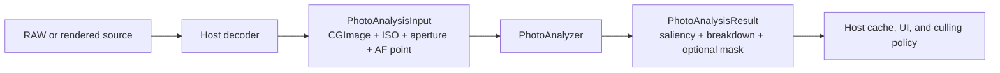
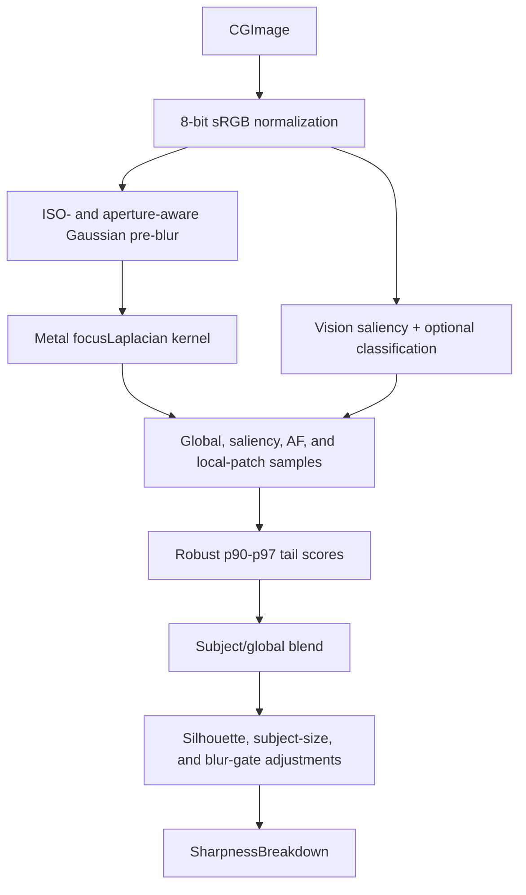

+++
author = "Thomas Evensen"
title = "How PhotoAnalysisKit Is Constructed"
linkTitle = "PhotoAnalysisKit Architecture"
date = "2026-07-20"
description = "A detailed guide to PhotoAnalysisKit's image-analysis boundary, sharpness pipeline, focus evidence, masks, calibration, batching, feature prints, resources, and concurrency."
tags = ["image-analysis", "sharpness", "focus-mask", "vision", "swift-package", "architecture"]
categories = ["technical details"]
mermaid = true
weight = 20
+++

# How PhotoAnalysisKit Is Constructed

PhotoAnalysisKit is the reusable measurement layer extracted from RawCull. It turns a decoded `CGImage` plus neutral capture metadata into sharpness, saliency, focus evidence, and an optional focus-mask image. It can also create opaque Apple Vision feature prints.

The package measures a photo; it does not decide whether to keep it. That distinction prevents image-processing code from becoming coupled to RawCull's files, settings, views, caches, or culling policy.

## 1. Begin With The Package Boundary

PhotoAnalysisKit owns:

- sRGB normalization for predictable analysis input;
- Core Image and Metal Laplacian processing;
- Vision saliency and optional subject classification;
- scalar sharpness metrics and failure classification;
- AF-point, subject, local-patch, and global focus evidence;
- focus-mask selection and rendering;
- numeric configuration, presets, quality levels, and analysis identity;
- bounded batch analysis and calibration;
- Vision feature-print generation and native comparison.

The host application owns:

- RAW, JPEG, or other source decoding;
- file URLs, security-scoped access, and sandbox bookmarks;
- source identity, cache keys, cache directories, and persistence;
- observable task state, progress presentation, and cancellation policy;
- settings labels and saved-settings migration;
- sorting, ratings, burst decisions, and culling actions.

The input boundary is intentionally small:



PhotoAnalysisKit does not import RawParserKit or RawCullCore. RawCull provides the adapters between them.

## 2. Read `Package.swift` As The First Design Document

The manifest declares Swift tools 6.2, Swift 6 language mode, macOS 26, one library product, and one test target.

```text
PhotoAnalysisKit package
├── PhotoAnalysisKit library
│   ├── public contracts and facade
│   ├── Core Image, Vision, and Accelerate implementation
│   └── packaged default.metallib
└── PhotoAnalysisKitTests
```

There are no third-party package dependencies. The implementation uses Apple frameworks including Core Graphics, Core Image, Vision, Accelerate, and Foundation.

The target enables `InferIsolatedConformances` and `NonisolatedNonsendingByDefault`. The package is therefore built under the same strict Swift 6 concurrency assumptions as the host without adopting UI isolation.

## 3. `PhotoAnalysisInput` Is The Decoding Boundary

`Sources/PhotoAnalysisKit/PhotoAnalysisInput.swift` defines the package's source value:

```swift
public struct PhotoAnalysisInput: Sendable {
    public let image: CGImage
    public let iso: Int
    public let aperture: Double?
    public let normalizedAFPoint: CGPoint?
}
```

The AF point uses normalized `0...1` coordinates with the origin at the visual top-left. This matches the camera metadata shape used by RawCull. Vision uses a bottom-left coordinate system, so the package performs the vertical conversion internally.

ISO is clamped to at least 1. Aperture and AF point are optional because not every image or camera provides them. The package can still compute a global result when either is absent.

This value has no URL or file identifier. Two consequences follow:

1. The package cannot reopen a source behind the host's back.
2. The host must associate returned results with the correct file and invalidate them when that file or decode policy changes.

`PhotoAnalysisResult` returns:

| Field | Meaning |
|---|---|
| `saliency` | Optional neutral subject label and confidence |
| `breakdown` | Scalar score plus detailed evidence and diagnostics |
| `focusMask` | Optional rendered overlay image |
| `score` | Convenience access to `breakdown.finalScore` |

An absent breakdown means analysis could not produce a valid result or was cancelled. It is different from a valid score of zero.

## 4. `PhotoAnalyzer` Is The Public Facade

`Sources/PhotoAnalysisKit/PhotoAnalyzer.swift` keeps the public entry points small:

| API | Work performed |
|---|---|
| `analyze` | Saliency, classification, scalar scoring, and focus evidence; no overlay rendering |
| `analyzeWithFocusMask` | Analysis plus a mask derived from the same evidence |
| `focusMask` | Mask rendering, optionally reusing previously computed evidence |
| `calibrate` | Catalog-sample calibration of the visual edge threshold |
| `sharpnessDescriptor` | Stable identity for cacheable non-mask analysis behavior |

The facade contains an immutable `FocusMaskEngine`. Both types are `@unchecked Sendable` because `CIContext` does not declare sendability even though this package holds no mutable model or UI state and reuses the context concurrently.

For each input, `PhotoAnalyzer` copies the supplied configuration, replaces its ISO with the input ISO, and derives an aperture hint from the input aperture. Callers can safely reuse one base configuration across many files.

When a host already stores `SharpnessBreakdown.focusEvidence`, passing it to `focusMask` avoids repeating the saliency selection step. This makes the measurement result useful as an input to later presentation work.

## 5. Follow The Scalar Sharpness Pipeline

The core implementation is in `FocusMaskEngine+Scoring.swift`.



### 5.1 Normalize Before Measuring

`normalizeToSRGB` redraws the input into an 8-bit sRGB RGBA bitmap. The Metal pipeline therefore receives a predictable pixel format regardless of the source image's bit depth or color space.

### 5.2 Find Candidate Subject Regions

`VNGenerateAttentionBasedSaliencyImageRequest` supplies salient-object rectangles. Small weak objects are removed, and candidates are ordered using AF overlap or distance, saliency confidence, interior detail, area, and deterministic coordinates.

When classification is enabled, `VNClassifyImageRequest` supplies a neutral subject label. The package filters out broad environment descriptions and prefers likely subjects such as animals or people. This label is evidence, not a keep/reject decision.

### 5.3 Build Edge Energy

The packaged `focusLaplacian` Metal kernel runs after Gaussian pre-blur. The pre-blur grows with ISO so high-frequency sensor noise is less likely to masquerade as detail. Aperture hints damp or strengthen parts of this behavior for wide, middle, and landscape apertures.

The result is rendered as floating-point RGBA data. The red channel carries edge energy.

### 5.4 Score Several Regions

The engine samples:

- the full image after excluding a configurable border;
- the selected salient region;
- the camera AF region;
- smaller AF-center and AF-neighborhood regions;
- ranked local patches within subject or AF regions.

`robustTailScore` sorts the sample values, measures the p90-p97 energy band relative to a p20 noise floor, and penalizes a band that is too sparse. `microContrast` computes the standard deviation of finite edge samples.

The normal blend combines full-frame and subject evidence. When both AF and saliency scores exist, AF has the larger share of the subject score. A conservative local-detail component can then refine the broad subject measurement.

The final value may be adjusted for:

- a silhouette-dominated subject whose strongest energy is mostly at the outer rim;
- the area of a saliency-only subject;
- an aperture-aware soft blur gate driven by subject micro-contrast.

`SharpnessBreakdown` preserves the component scores and selected evidence so a host can explain the result instead of presenting a single unexplained number.

### 5.5 Distinguish Failure Shapes

`FocusFailureKind` classifies the evidence as:

- `.motionBlur` when global, subject, and AF detail are all weak and micro-contrast is low;
- `.missedFocus` when the frame has usable global detail but the subject is much weaker;
- `.none` when neither pattern is established.

These are algorithmic classifications, not final user-facing copy or culling actions.

## 6. Focus Evidence And Mask Rendering Are Related But Separate

Scalar scoring answers “how much reliable detail is present?” Mask rendering answers “where should the UI draw visible focused edges?” They share evidence but have different configuration needs.

`FocusEvidence` records the winning region, AF scores, selected patch rankings, spatial alignment, dominance, silhouette handling, visual threshold, coverage, and confidence diagnostics. `FocusPatchRanking` exposes the detail, coverage, shape, position, and penalty components behind each candidate patch.

The overlay pipeline:

1. chooses AF-center, AF-neighborhood, AF, saliency, mixed, or global evidence;
2. builds primary and, for AF regions, fine-detail Laplacians;
3. ranks local patches and selects the best evidence patches;
4. chooses an adaptive percentile threshold;
5. optionally relaxes the threshold to guarantee minimum visible coverage;
6. applies erosion and dilation to the binary edge mask;
7. colorizes, clips, feathers, and crops the mask;
8. returns updated evidence and render diagnostics with the image.

`FocusMaskRegionSource` describes whether saliency, AF, both, or neither provided the overlay region. `FocusEvidenceOverlayStyle` distinguishes subject edges from global edges. RawCull decides how these neutral values appear in its interface.

## 7. Configuration, Presets, And Cache Identity

`SharpnessConfiguration` is a value snapshot containing numeric algorithm settings. It separates host-editable behavior from observable settings models.

Notable groups are:

| Configuration group | Examples |
|---|---|
| Edge pipeline | `preBlurRadius`, `threshold`, `energyMultiplier` |
| Mask morphology | `dilationRadius`, `erosionRadius`, `featherRadius` |
| Visibility | `guaranteeVisibleFocusEvidence`, `minimumEvidenceCoverage` |
| Region selection | AF radii, border inset, saliency weight |
| Scoring adjustments | subject-size factor, silhouette strength, fine-detail weight |
| Capture hints | `iso`, `apertureHint` |

`SharpnessPreset` applies high-level subject tuning for automatic, birds and wildlife, portrait, landscape, or general action use. `SharpnessQuality` selects fast, balanced, or high-precision fine-detail work. The host may persist its own UI enums, but should map them into these package values instead of duplicating constants.

Persisted results need more than a filename. `SharpnessAnalysisDescriptor` records:

- descriptor schema version;
- scalar algorithm version;
- ISO-scaling policy version;
- aperture-hint policy version;
- every host-configurable value that affects non-mask scoring;
- the stable scoring energy multiplier.

The descriptor deliberately excludes per-image ISO and aperture, mask-only presentation settings, decoded dimensions, source choice, and source-file identity. A host must add those values to its cache identity.

```text
Host sharpness cache identity
├── PhotoAnalysisKit SharpnessAnalysisDescriptor
├── per-image ISO and aperture
├── source file identity
├── selected preview/decode policy
└── decoded pixel dimensions
```

## 8. Bounded Batch Analysis

`PhotoAnalysisBatchRequest<Identifier>` contains an identifier and an async input provider. The provider inversion is important: PhotoAnalysisKit coordinates work, while the host retains file access and decoding policy.

`analyzeBatch` starts only up to `maximumConcurrentTasks` child tasks. When one completes, it enqueues one more request. This prevents a large catalog from creating an unbounded number of decoded bitmaps.

The API has three ordering and failure guarantees:

- progress is emitted in completion order;
- the returned results preserve request order;
- a decode failure is represented by a result whose `analysis` is `nil`.

If the parent task is cancelled, the method cancels the group and returns `nil`, telling the host to discard partial results rather than mistake them for a complete batch.

## 9. Calibration Changes The Overlay, Not The Score

Calibration samples Laplacian energies from host-provided decoded inputs with bounded concurrency. It downsamples the collected sample set, sorts it, and returns p50, p90, p95, and p99 statistics plus a clamped threshold at the requested percentile.

At least `minimumSuccessfulImages` inputs must succeed. Cancellation or too few samples returns `nil`.

Calibration changes only the visual edge threshold. Core sharpness scores keep a stable gain and do not depend on the current catalog. This prevents the same photo from receiving a different scalar score merely because unrelated photos were added or removed.

## 10. Vision Feature Prints Stay Opaque

`VisionFeaturePrintBackend` is an actor that creates a `VNFeaturePrintObservation` using Vision revision 2 by default. The observation is securely archived inside `VisionFeaturePrint.payload`.

The value also stores its Vision revision and representation version. Before comparison, the backend verifies both values, securely unarchives each observation, and calls Vision's native `computeDistance`.

The host can persist the opaque payload, but it must associate it with source-file identity. Incompatible prints return `nil`; corrupt archives or failed Vision operations throw a typed `VisionFeaturePrintError`.

PhotoAnalysisKit intentionally does not copy PhotoAIKit's general similarity artifact descriptors, CLIP fallback, or batch indexing. It supplies only the focused Vision measurement primitive.

## 11. Metal Resources Are Part Of The Algorithm

`Sources/PhotoAnalysisKit/Resources/Kernels.ci.metal` is the source for the Core Image kernel. SwiftPM copies Metal source resources but does not compile them for command-line builds, so the package also checks in `default.metallib`.

`Tools/build_metallib.sh` regenerates the binary. A kernel change is incomplete until the checked-in library has been rebuilt and tests have been run. The binary resource affects algorithm output and must be treated like source, not an optional deployment file.

## 12. Concurrency And Cancellation

The package uses four complementary techniques:

- **Immutable facade and engine:** callers pass input and configuration snapshots; no app state is retained.
- **Explicit concurrent workers:** synchronous Core Image and Vision work runs outside caller UI isolation while retaining task priority and task-local context.
- **Bounded task groups:** batch analysis and calibration cap simultaneous inputs.
- **Cooperative checks:** expensive stages test cancellation before Vision work, rendering, large loops, and result publication.

`@unchecked Sendable` is confined to the immutable Core Image facade and engine. Public transport values are `Sendable` value types.

## 13. Testing The Public Contract

`Tests/PhotoAnalysisKitTests/` imports the library through `import PhotoAnalysisKit`, not `@testable import`. Tests therefore exercise the public surface used by a host.

The suite covers:

- end-to-end sharpness analysis with the packaged Metal kernel;
- focus-mask images, evidence, and diagnostics;
- calibration from decoded images and neutral metadata;
- bounded concurrency, order preservation, progress, decode failure, and cancellation;
- descriptor encoding and changes in identity-affecting settings;
- robust-tail, micro-contrast, ISO scaling, and focus-failure metrics;
- configuration presets and aperture behavior;
- Vision feature-print compatibility, round trips, and malformed payloads.

Synthetic images keep the suite deterministic and independent of RAW files, model downloads, cache directories, and application state.

## 14. How To Add Another Analysis

Use the existing boundary as a checklist:

1. Accept `CGImage` and only the neutral metadata the algorithm needs.
2. Keep URLs, camera decoding, settings state, and source selection in the host.
3. Return a `Sendable` package-owned result with enough evidence to explain it.
4. Put numeric tuning in a value configuration, not UI preferences.
5. Define a versioned descriptor when hosts may persist the output.
6. Make synchronous framework work cancellation-aware and independent of UI isolation.
7. Bound multi-image work instead of spawning one live task per catalog item.
8. Test through the public API with synthetic images and values.

If the proposed API needs `FileItem`, SwiftUI, a cache directory, or a rating, that concern belongs in RawCull's adapter or policy layer.

## Source Map

| Topic | PhotoAnalysisKit source |
|---|---|
| Product and resource declaration | `Package.swift` |
| Input and result boundary | `Sources/PhotoAnalysisKit/PhotoAnalysisInput.swift` |
| Public analysis facade and metrics | `Sources/PhotoAnalysisKit/PhotoAnalyzer.swift` |
| Batch orchestration | `Sources/PhotoAnalysisKit/PhotoAnalysisBatch.swift` |
| Configuration and presets | `Sources/PhotoAnalysisKit/SharpnessConfiguration.swift`, `SharpnessPresets.swift` |
| Cache descriptor | `Sources/PhotoAnalysisKit/SharpnessAnalysisDescriptor.swift` |
| Public evidence values | `Sources/PhotoAnalysisKit/FocusMaskTypes.swift` |
| Engine isolation | `Sources/PhotoAnalysisKit/FocusMaskEngine.swift` |
| Saliency and scalar scoring | `Sources/PhotoAnalysisKit/FocusMaskEngine+Scoring.swift` |
| Overlay generation and patch ranking | `Sources/PhotoAnalysisKit/FocusMaskEngine+MaskGeneration.swift` |
| Calibration | `Sources/PhotoAnalysisKit/FocusMaskCalibration.swift` |
| Vision feature prints | `Sources/PhotoAnalysisKit/VisionFeaturePrintBackend.swift` |
| Metal source and compiled resource | `Sources/PhotoAnalysisKit/Resources/` |
| Extraction decisions | `Documentation/ExtractionMap.md` |
| Public behavior tests | `Tests/PhotoAnalysisKitTests/` |

Next, see how package-neutral measurements become culling-domain decisions in [How RawCullCore Is Constructed](../rawcullcore/).
