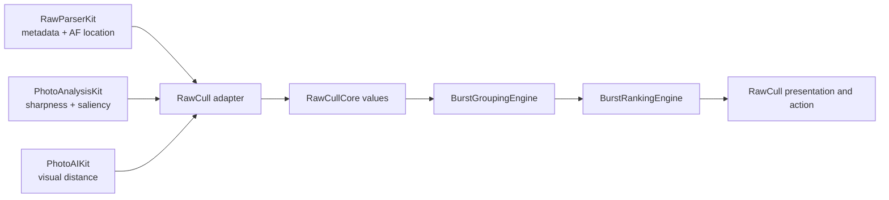
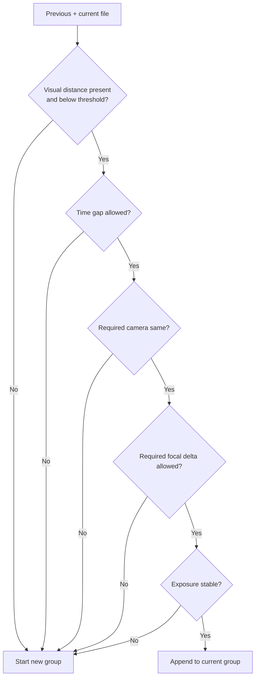

+++
author = "Thomas Evensen"
title = "How RawCullCore Is Constructed"
linkTitle = "RawCullCore Architecture"
date = "2026-07-30"
description = "A detailed guide to RawCullCore's package-safe models, capture-time and EV-aware burst grouping, ranking evidence, confidence rules, histograms, concurrency, and tests."
tags = ["culling", "burst", "ranking", "metadata", "swift-package", "architecture"]
categories = ["technical details"]
mermaid = true
weight = 30
+++

# How RawCullCore Is Constructed

RawCullCore is the small domain layer at the center of RawCull. It does not
decode or analyze photos. Instead, it receives file metadata and measurements
already produced elsewhere, groups sequential files into bursts, and ranks the
candidates using deterministic culling rules.

Its main architectural value is that a recommendation can be tested without
opening a RAW file, running Vision, creating a Metal context, loading
application settings, or constructing a view model.

## 1. Begin With The Package Boundary

RawCullCore owns:

- package-safe file, EXIF, source-catalog, and saliency values;
- normalized focus-point parsing;
- burst group, boundary-evidence, ranking, confidence, and review-state models;
- pure burst grouping rules;
- pure burst ranking and one-click-safety rules;
- a lightweight 256-bin luminance histogram.

RawCullCore deliberately does not own:

- TIFF, MakerNote, ARW, or NEF parsing;
- thumbnail, preview, or full RAW decoding;
- Vision, Core Image, Metal, CLIP, or SAM 3 analysis;
- caches, settings, security-scoped URLs, and saved-file coordination;
- observable view models, SwiftUI, selection, sorting, and culling actions.

This produces a clear flow:



The arrows describe how RawCull composes runtime values. RawCullCore imports
none of the other packages.

## 2. The Manifest Optimizes For A Small Domain Library

`Package.swift` declares Swift tools 6.2, Swift 6 language mode, macOS 26, one
`RawCullCore` library target, and one test target. It has no external package
dependencies and no bundled resources.

The target uses:

```swift
.defaultIsolation(MainActor.self)
.enableUpcomingFeature("InferIsolatedConformances")
.enableUpcomingFeature("NonisolatedNonsendingByDefault")
```

Default main-actor isolation matches the surrounding application environment,
but the package's public value types and pure engines are explicitly
`nonisolated`. Background grouping and ranking therefore do not acquire
unnecessary main-actor hops.

This is a useful distinction: the build default is conservative, while each
proven pure API opts out explicitly.

## 3. Package-Safe Models Replace Application State

The package uses transport values instead of importing RawCull's `FileItem` or
view models.

### 3.1 `ExifMetadata`

`ExifMetadata` is a `Codable`, `Hashable`, and `Sendable` snapshot containing
display strings and numeric values for shutter speed, focal length, aperture,
ISO, exposure compensation, camera, lens, RAW type, size class, and pixel
dimensions.

It contains both strings and numbers because they serve different purposes:

- strings preserve display-ready metadata such as shutter notation and lens
  names;
- numeric exposure time, focal length, aperture, ISO, and exposure compensation
  support deterministic stop-based rules without reparsing display text.

RawCull or an adapter constructs this value from RawParserKit's
`RawImageMetadata`. RawCullCore does not know where the values came from.

### 3.2 `RawCullFileItem`

`RawCullFileItem` contains an ID, URL, name, byte size, modification date,
optional capture date and capture-time-zone offset, optional EXIF snapshot, and
optional normalized AF point.

Equality and hashing use only `id`. Two snapshots with the same ID are the same
logical file item even if another stored field changed. This matches the
identity behavior expected by RawCull collections.

`effectiveCaptureDate` prefers the EXIF capture instant and falls back to the
file modification date. `usesFileModificationDateForCaptureTime` exposes which
path was used so grouping and confidence can treat the fallback conservatively.
`formattedSize` is a lightweight Foundation convenience. File access and mutable
scan state remain outside the value.

### 3.3 Catalog And Saliency Summaries

`RawCullSourceCatalog` identifies a named source URL without adding bookmark or
access-lifecycle behavior.

`SaliencyInfo` stores only an optional subject label and confidence. It
deliberately does not import Vision or expose a Vision observation. A
PhotoAnalysisKit result can be translated into this small culling-domain value
at the host boundary.

## 4. Focus-Point Parsing Connects Vendor Metadata To Analysis

RawParserKit's vendor parsers return a focus string in this shape:

```text
imageWidth imageHeight focusX focusY
```

`FocusPointParser.normalizedPoint(from:)` splits on arbitrary whitespace,
requires exactly four numeric values and positive image dimensions, and returns:

```text
x = focusX / imageWidth
y = focusY / imageHeight
```

The origin remains at the visual top-left. PhotoAnalysisKit accepts that
convention and performs its own Vision coordinate conversion.

The parser does not clamp the returned point. Vendor parsers and host validation
are expected to supply meaningful sensor coordinates. Malformed input or
non-positive dimensions return `nil`.

## 5. Burst Models Preserve Evidence, Not Just A Winner

`BurstAnalysisModels.swift` defines the values exchanged by the two engines.

```text
BurstGroupingOutput
├── groups: [BurstGroup]
└── boundaryEvidence: [BurstBoundaryEvidence]

BurstAnalysisResult
├── ordered candidate scores
├── recommended and second-best IDs
├── confidence and review state
├── one-click safety flag
├── reasons
└── cautions
```

This design avoids throwing away intermediate decisions. RawCull can show why a
boundary was created, why a file won, and why automation is or is not considered
safe.

`BurstGroupingConfig.algorithmVersion` is currently 4 and gives hosts a version
marker for persisted grouping output. Its configurable thresholds cover visual
distance, EXIF and fallback time gaps, camera equality, focal-length similarity,
and maximum shutter, aperture, ISO, and exposure-compensation changes in EV.
Custom decoding supplies defaults for fields that are absent from older saved
configurations.

`BurstReviewState` keeps historical states for cache compatibility. Unknown
decoded raw values fall back to `.none`. `BurstWinnerOverride` also migrates
older data by generating a missing ID and defaulting missing member filenames to
an empty array.

## 6. `BurstGroupingEngine`: Decide Where A Burst Splits

The grouping engine expects files in shot order. It starts with the first file
and evaluates each adjacent pair.



A new group begins when any enabled boundary rule fires:

- similarity evidence is missing;
- visual distance is greater than or equal to `visualDistanceThreshold`;
- the absolute capture gap exceeds `maxTimeGapSeconds`, or
  `maxFallbackTimeGapSeconds` when either file lacks a parsed EXIF capture
  instant;
- camera identity changes when `requireSameCamera` is enabled;
- numeric or parsed focal length changes by more than `maxFocalLengthDeltaMM`
  when similarity is required;
- shutter speed, aperture, ISO, or exposure compensation changes by more than
  its configured EV threshold.

The default EXIF capture gap is 2 seconds; the default file-date fallback gap is
10 seconds. Each boundary records `captureTimeUsedFallback`, allowing later
ranking to distinguish precise camera time from filesystem time.

Exposure comparison works in photographic stops:

```text
shutter delta  = |log2(current seconds / previous seconds)|
aperture delta = 2 × |log2(current f-number / previous f-number)|
ISO delta      = |log2(current ISO / previous ISO)|
compensation   = |current EV - previous EV|
```

The defaults are 0.5 EV for shutter, aperture, and ISO and 0.34 EV for exposure
compensation. The engine prefers numeric values. When a numeric shutter,
aperture, or ISO comparison is unavailable but both normalized display strings
are present and differ, it still treats the exposure as changed. The largest
available adjustment is retained as `exposureAdjustmentEV`.

Focal length similarly prefers `focalLengthMM` and falls back to the first
number in the display string. If either side has no usable value, that rule has
no delta to evaluate.

Lens changes are recorded in `BurstBoundaryEvidence`, but do not by themselves
split a group. They later make the group's ranking metadata unstable. Keeping
evidence separate from the grouping decision makes this behavior visible rather
than implicit.

Missing similarity is conservative: it creates a boundary instead of assuming
two files belong together. `BurstPairKey.cacheKey` standardizes the ordered
adjacent-pair key used to supply those distances.

Each boundary record stores the measured values, boolean changes, final
decision, and human-readable reasons. The output assigns stable sequential group
IDs beginning at zero for that run.

## 7. `BurstRankingEngine`: Turn Evidence Into A Recommendation

Ranking consumes groups, files keyed by ID, sharpness scores, a score
normalization maximum, saliency summaries, boundary evidence, and optional
review states.

### 7.1 Determine Group Conditions

For each group, the engine derives:

- **metadata stability:** none of its internal boundaries report exposure,
  camera, or lens changes;
- **capture-time reliability:** every member has a parsed EXIF capture date
  rather than the modification-date fallback;
- **tight similarity:** every internal boundary has a visual distance below
  0.22;
- **dominant subject:** the most frequent non-nil saliency label;
- **burst-relative sharpness:** a within-group `0...1` normalization when at
  least two valid scores exist and their normalized spread is at least 0.03.

The configured grouping threshold decides membership; the fixed tighter 0.22
check contributes to ranking confidence. They answer different questions.

### 7.2 Score Each Candidate

If burst-relative sharpness is available, the ranking sharpness component is:

```text
ranking sharpness = 0.65 × catalog-normalized sharpness
                  + 0.35 × burst-relative sharpness
```

The final candidate score is:

```text
overall = 0.62 × ranking sharpness
        + 0.12 × focus-point evidence
        + 0.10 × saliency consistency
        + 0.16 × metadata evidence
```

The supporting components are deliberately simple and inspectable:

| Component                   | Rule                                                                      |
| --------------------------- | ------------------------------------------------------------------------- |
| Focus point                 | 0.70 when AF metadata exists, otherwise 0.45                              |
| Saliency                    | 0.75 for the dominant label, 0.25 for a different label, 0.45 when absent |
| Metadata base               | 0.70 when stable, otherwise 0.40                                          |
| Tight-similarity adjustment | +0.15                                                                     |
| ISO adjustment              | Above ISO 1600, -0.05 per stop, capped at -0.15                           |
| Wide-aperture adjustment    | +0.05 at f/5.6 or wider                                                   |
| Motion-risk adjustment      | +0.05 for a clearly fast shutter; up to -0.15 for a slower shutter        |

Every component is clamped or normalized into a predictable range before use.
Candidates are sorted by descending overall score; equal scores preserve the
group's original shot order.

Motion risk uses `exposureTimeSeconds` with `focalLengthMM` when both are
available. A shutter at least twice as fast as the reciprocal focal-length rule
gets the positive adjustment; a shutter slower than the reciprocal rule gets a
stop-based penalty. Without focal length, 1/500 second or faster is treated as
lower risk and 1/60 second or slower as elevated risk.

Each candidate also carries reasons and cautions such as measured sharpness,
available AF evidence, classified subject, missing sharpness, changed metadata,
fast or slow shutter behavior, and high ISO.

### 7.3 Assign Confidence Separately

Winning a group does not automatically mean a decision is safe to automate.

High confidence requires:

- at least one sharpness score;
- at least three files in the group;
- a best-versus-second score gap of at least 0.12;
- best absolute sharpness of at least 0.65 after normalization;
- stable metadata;
- tight visual similarity;
- parsed capture times for every member.

Medium confidence requires a gap of at least 0.05 and stable metadata. Other
results are low confidence.

`isSafeForOneClickCulling` is true only for high confidence.
`canApplyOneClickCulling(hasSharpnessScores:)` adds an explicit host-supplied
confirmation that sharpness data is available before an action is enabled.
RawCull still owns the action itself.

Reasons and cautions on `BurstAnalysisResult` are capped to three each so the
result remains concise enough for inspection UI and persistence.

A modification-date fallback therefore does not prevent grouping, but it does
prevent high-confidence automation and adds a capture-time caution.

## 8. Histogram Calculation Is Intentionally Lightweight

`HistogramCalculator.normalizedLuminanceHistogram(from:)` directly reads an
8-bit RGB or RGBA-style `CGImage` buffer. Each pixel is placed in one of 256
bins using Rec. 601 luminance:

```text
Y = 0.299R + 0.587G + 0.114B
```

The bins are normalized by the largest bin count, so the peak has value 1. This
is shape normalization, not probability normalization; the bins do not
necessarily sum to 1.

The implementation requires positive dimensions, provider data, 8 bits per
component, and at least three bytes per pixel. Unsupported input returns a
zero-filled 256-bin array, preserving a stable return shape for views and
callers.

The helper is appropriate for display and lightweight comparisons. Color
conversion, RAW development, high-bit-depth analysis, and channel-layout
generalization are outside this package.

## 9. Concurrency Is Achieved Through Purity

RawCullCore contains no actor because it owns no shared mutable runtime state.
Models are `Sendable` values and engines are namespaces of `nonisolated` static
functions.

The package performs no asynchronous I/O. Callers do expensive decoding, Vision
work, embeddings, and sharpness analysis on the appropriate tasks, then pass
snapshots into RawCullCore.

This design has several practical benefits:

- grouping and ranking are deterministic for the same inputs;
- no application singleton can change a result midway through a call;
- tests do not require async setup or framework assets;
- background work does not cross the main actor merely because the host uses
  main-actor default isolation.

## 10. Testing Rules And Migrations

`Tests/RawCullCoreTests/` uses Swift Testing and synthetic values. Coverage
includes:

- model coding, hashing, identity, and source-catalog values;
- valid, decimal, whitespace-varied, and malformed focus strings;
- empty and stable groups;
- boundaries caused by missing distance, time, camera, focal length, and
  exposure;
- EXIF capture ordering, time-zone offsets, modification-date fallback, and the
  different fallback gap;
- numeric and display-string exposure comparisons in photographic stops;
- boundary evidence content;
- absolute and burst-relative sharpness ranking, motion risk, and progressive
  ISO penalties;
- missing scores, stable tie order, confidence, review-state propagation, and
  one-click eligibility;
- RGB and RGBA histogram bins, peak normalization, and unsupported input.

No test needs an actual catalog, RAW file, Vision model, Metal device, cache
directory, or settings store. That is the strongest evidence that the package
boundary is doing useful work.

## 11. How To Extend Culling Logic

Use these constraints when adding a rule:

1. Pass the required fact into a `Sendable` package value; do not reach into a
   view model.
2. Preserve raw evidence separately from the final boolean or winner.
3. Keep scoring weights and confidence thresholds deterministic and testable.
4. Decide whether a rule affects group membership, candidate ranking,
   confidence, or only a caution.
5. Version persisted behavior when a changed rule can invalidate cached results.
6. Maintain decoding fallbacks for existing review and override data.
7. Leave framework observations and heavy image processing in the producing
   package.
8. Leave user actions and presentation state in RawCull.

## Source Map

| Topic                                            | RawCullCore source                                                                                     |
| ------------------------------------------------ | ------------------------------------------------------------------------------------------------------ |
| Product and concurrency settings                 | `Package.swift`                                                                                        |
| EXIF transport value                             | `Sources/RawCullCore/ExifMetadata.swift`                                                               |
| File and source identity                         | `Sources/RawCullCore/RawCullFileItem.swift`, `RawCullSourceCatalog.swift`                              |
| Saliency summary                                 | `Sources/RawCullCore/SaliencyInfo.swift`                                                               |
| Focus normalization                              | `Sources/RawCullCore/FocusPointParser.swift`                                                           |
| Burst contracts and migrations                   | `Sources/RawCullCore/BurstAnalysisModels.swift`                                                        |
| Boundary decisions                               | `Sources/RawCullCore/BurstGroupingEngine.swift`                                                        |
| Ranking and confidence                           | `Sources/RawCullCore/BurstRankingEngine.swift`                                                         |
| Histogram                                        | `Sources/RawCullCore/HistogramCalculator.swift`                                                        |
| Behavior tests                                   | `Tests/RawCullCoreTests/`                                                                              |
| RawCull metadata adapter and burst orchestration | `RawCull/Model/RawImageLoading.swift`, `RawCull/Model/ViewModels/RawCullViewModel+BurstGrouping.swift` |

Return to the package overview in [RawCull Packages](/docs/packages/), or
continue with the file-decoding layer in
[How RawParserKit Is Constructed](../rawparserkit/).
