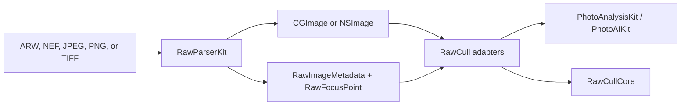
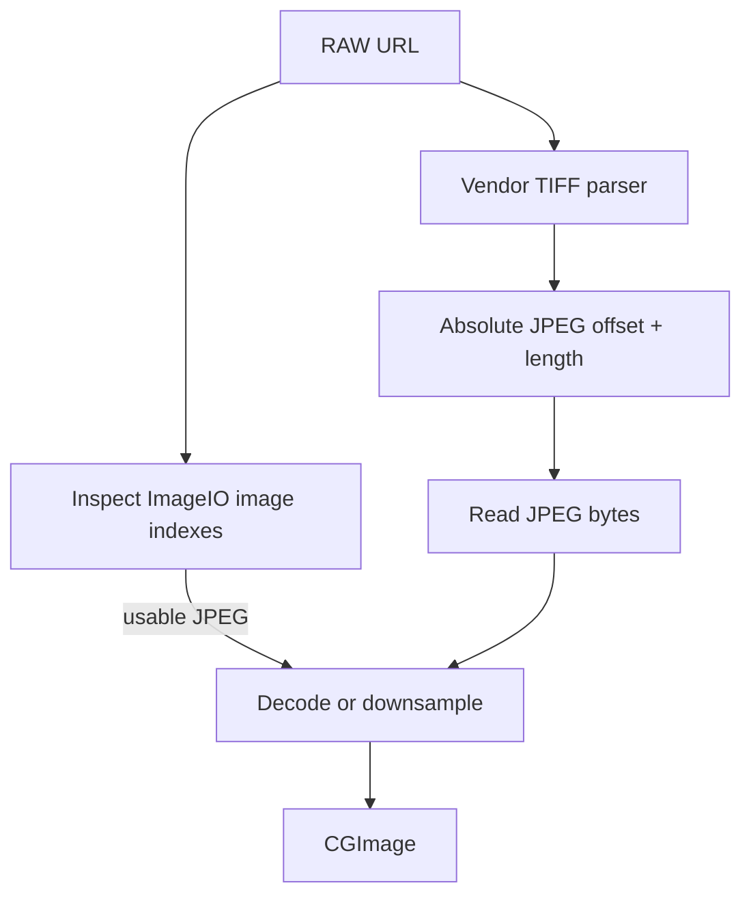

+++
author = "Thomas Evensen"
title = "How RawParserKit Is Constructed"
linkTitle = "RawParserKit Architecture"
date = "2026-07-20"
description = "A detailed guide to RawParserKit's vendor dispatch, TIFF and MakerNote parsing, embedded previews, metadata, orientation, decode limiting, cancellation, compatibility APIs, and tests."
tags = ["raw", "arw", "nef", "makernote", "imageio", "swift-package", "architecture"]
categories = ["technical details"]
mermaid = true
weight = 40
+++

# How RawParserKit Is Constructed

RawParserKit is RawCull's camera-file boundary. It knows how Sony ARW and Nikon NEF files are structured, how to locate their embedded JPEGs and AF metadata, and how to turn those sources into orientation-normalized images and display-ready metadata.

The package stops at decoding. It does not score sharpness, generate embeddings, group bursts, cache application results, or decide which photo should be kept.

## 1. Begin With The Package Boundary

RawParserKit owns:

- vendor-neutral RAW format dispatch;
- Sony ARW and Nikon NEF format knowledge;
- TIFF IFD and vendor MakerNote traversal;
- focus-location and embedded-JPEG offset parsing;
- RAW and rendered-image thumbnails and previews;
- source-orientation normalization;
- display-ready EXIF and RAW metadata extraction;
- Sony full sensor development to JPEG;
- decode task deduplication, concurrency limiting, and cooperative cancellation;
- diagnostics and staged compatibility APIs.

The host application owns:

- security-scoped URL access and sandbox bookmarks;
- directory discovery, catalogs, and source selection;
- memory and disk cache locations and eviction policy;
- image-analysis inputs and result identity;
- observable loading state, placeholders, retries, and presentation;
- ratings, burst grouping, ranking, and saved-file behavior.

RawParserKit supplies inputs to higher layers without importing them:



## 2. Package Shape And Framework Boundary

`Package.swift` declares Swift tools 6.2, Swift 6 language mode, macOS 26, one library product, and one test target. There are no third-party package dependencies.

The implementation uses Apple frameworks appropriate to file decoding: Foundation, AppKit, Core Graphics, ImageIO, Core Image, OSLog, and synchronization primitives from `os`.

Like RawCullCore, the target enables main-actor default isolation plus `InferIsolatedConformances` and `NonisolatedNonsendingByDefault`. Pure parsing and static format APIs opt out with `nonisolated`; the stateful loader and limiter use actors.

The source is arranged in layers:

```text
RawImageLoader                         high-level deduplicated facade
├── RawFormatRegistry + RawFormat      vendor-neutral dispatch
│   ├── SonyRawFormat
│   └── NikonRawFormat
├── thumbnail and preview extractors   ImageIO + binary fallback
├── MakerNote parsers                  TIFF byte traversal
├── OrientationNormalizedImageLoader   rendered/embedded image helpers
└── cancellation + decode limiter      concurrency control
```

Callers can use the facade for normal browser behavior or a lower layer when they need explicit control.

## 3. `RawFormat` Makes Vendor Dispatch Explicit

`Sources/RawParserKit/RawFormat.swift` describes the static capabilities every camera format supplies:

- supported filename extensions and a display name;
- thumbnail extraction;
- embedded-preview extraction;
- AF focus-location parsing;
- a readable label for compression codes;
- camera-specific megapixel thresholds for S, M, and L size classes.

Conformers are stateless enums. `RawFormatRegistry.all` currently registers:

| Conformer | Extension | Vendor responsibilities |
|---|---|---|
| `SonyRawFormat` | `.arw` | Sony extractors, MakerNote parser, compression labels, body thresholds, and full sensor JPEG creation |
| `NikonRawFormat` | `.nef` | Nikon extractors, MakerNote parser, compression labels, and body thresholds |

`format(for:)` lowercases a URL's extension and returns a format metatype. Callers invoke static protocol requirements on that value without switching on brands.

The default `rawSizeClass` implementation converts dimensions to megapixels, obtains body-specific L and M thresholds, and returns `L`, `M`, or `S`. Unknown bodies use a generic fallback supplied by the conformer.

This is a simple plugin architecture inside the package. Adding a camera brand means adding a conformer and registering it, not adding vendor switches throughout the loader.

## 4. `RawImageLoader` Is The High-Level Facade

`RawImageLoader.shared` is an actor. It offers four current operations:

| API | Result |
|---|---|
| `thumbnail(for:maxPixelSize:)` | An `NSImage` suitable for grids and browsers |
| `thumbnailCGImage(for:maxPixelSize:)` | The same thumbnail as `CGImage` |
| `previewImage(for:)` | A larger sidecar or embedded preview |
| `metadata(for:)` | A neutral `RawImageMetadata` snapshot |

### 4.1 Deduplicate Equivalent Work

The actor stores in-flight tasks:

- thumbnails keyed by URL and requested pixel size;
- previews keyed by URL;
- metadata keyed by URL.

If another caller requests the same work while it is running, both await the existing task. The entry is removed after completion. This prevents rapid view updates from decoding the same large image repeatedly.

### 4.2 Bound Expensive Decodes

The facade uses two `DecodeConcurrencyLimiter` actors:

- up to six concurrent thumbnail decodes;
- up to two concurrent full-size preview decodes.

These limits control memory as much as CPU. A few full-resolution bitmaps can consume substantially more memory than the compressed RAW files that produced them.

### 4.3 Follow The Thumbnail Strategy

For a rendered JPEG, PNG, or TIFF, the loader asks ImageIO for an orientation-aware thumbnail. For RAW input, it tries an embedded ImageIO thumbnail first and then dispatches to the registered vendor extractor. The vendor result is orientation-normalized before it becomes an `NSImage`.

### 4.4 Follow The Preview Strategy

The preview path checks for a same-basename `.jpg` sidecar first. If absent, it tries an orientation-aware embedded preview and then the registered format's embedded-preview extractor. Vendor output is normalized using the source orientation.

The sidecar-first decision is host-facing convenience, not RAW parsing. A caller that requires only bytes physically embedded in the RAW can call the format or extractor API directly.

## 5. Metadata Is Normalized Into A Neutral Snapshot

`RawImageMetadata` contains optional values for camera, lens, exposure, aperture, numeric aperture, focal length, ISO, numeric ISO, capture date, dimensions, focus point, RAW compression label, size class, and pixel dimensions.

`RawImageLoader.metadata(for:)` combines several sources:

1. ImageIO properties from the source or a sidecar fallback;
2. TIFF make, model, compression, and date fields;
3. EXIF exposure, aperture, focal length, ISO, lens, and dimensions;
4. the registered vendor MakerNote parser for an AF point;
5. EXIF subject-area coordinates when vendor focus data is unavailable;
6. vendor-specific compression labels and size-class thresholds.

`rows` returns non-empty display label/value pairs, while `isEmpty` lets the facade omit an empty metadata object. Numeric aperture, ISO, width, and height remain available so hosts do not have to parse the formatted strings for analysis or domain rules.

`RawFocusPoint` stores normalized X and Y coordinates. Its failable focus-string initializer accepts the common `"width height x y"` shape, checks positive dimensions, and rejects coordinates outside `0...1`.

RawCull maps this parser-owned snapshot into its own `ExifMetadata` and `RawCullFileItem` values. The similar types exist on purpose: each package owns the vocabulary at its boundary and neither must depend on the other.

## 6. Thumbnail Extraction Prefers Embedded Work

Thumbnails should not require full RAW development when a camera already stored a usable JPEG.

### 6.1 Sony

`SonyThumbnailExtractor` first asks `SonyMakerNoteParser` for embedded JPEG locations and decodes a selected JPEG directly. This bypasses macOS RAW decoder failures seen with newer ARW layouts. If the binary path cannot locate a JPEG, it falls back to ImageIO's embedded-thumbnail behavior.

### 6.2 Nikon

`NikonThumbnailExtractor` asks ImageIO for a transformed embedded thumbnail. Both vendor extractors then redraw into an 8-bit premultiplied sRGB bitmap using interpolation quality derived from `qualityCost`.

Both APIs run their synchronous ImageIO work through `CancellableImageIOWork` and throw `ThumbnailError` for an invalid source, failed generation, or failed bitmap context.

`ThumbnailSharpener` is an optional lower-level Core Image helper for producing a sharpened preview at a requested maximum dimension. The high-level boundary does not force sharpening on every caller.

## 7. Embedded Preview Extraction Has Two Paths

The two vendors use the same building blocks in a different order. `SonyEmbeddedJPEGExtractor` prefers the binary TIFF locator, avoiding RAW decoder initialization on affected ARW files, then falls back to ImageIO. `NikonEmbeddedJPEGExtractor` inspects ImageIO sub-images first and uses the binary locator when the preview is not exposed there.



`fullSize: true` permits a longest edge up to 8640 pixels. The normal preview path limits large images to 4320 pixels.

The Nikon fallback prefers the full-resolution SubIFD preview for full-size requests and IFD1 for smaller requests. Sony chooses the largest available JPEG first, with preview and thumbnail fallbacks.

Extractor-level limiters default to two concurrent operations, and a caller can inject a shared limiter. This allows a host facade to enforce one budget across several decode paths instead of accidentally stacking independent limits.

## 8. Sony Full-Size JPEG Creation Is Different From Extraction

`SonyRawFormat.createFullSizeJPEG(from:quality:)` does not return a camera-embedded preview. `SonyRAWJPEGCreator` develops the ARW sensor data through macOS `CIRAWFilter`, renders it into sRGB, and encodes JPEG data.

Quality must be in `0...1`. The operation can fail with:

- `invalidQuality`;
- `unsupportedOrInvalidRAW` when the installed macOS RAW decoder cannot develop that file;
- `encodingFailed`.

This distinction matters in UI and caching. An embedded preview and a developed sensor image have different cost, pixels, appearance, and invalidation semantics even if both are JPEG-encoded at the end.

## 9. Sony MakerNote And TIFF Parsing

Sony ARW is TIFF-based. Focus parsing follows this structure:

```text
TIFF IFD0
└── ExifIFD tag 0x8769
    └── MakerNote tag 0x927C
        └── Sony MakerNote IFD
            └── FocusLocation tag 0x2027
                (fallback: 0x204A)
```

The focus tag contains four unsigned 16-bit values: image width, image height, X, and Y. Sony MakerNote IFD offsets are interpreted as absolute file offsets.

The production parser uses a fast path and a fallback:

- focus location reads the first 4 MB, then retries with the full file when necessary;
- embedded-JPEG discovery reads the first 512 KB, then retries the full file when no locations were found.

The embedded locator walks TIFF IFDs and returns optional absolute locations for a small thumbnail, preview, and full JPEG. `readEmbeddedJPEGData` seeks directly to a validated location and reads its byte range.

The fast path keeps normal scans inexpensive; the full-file fallback supports bodies that place relevant TIFF structures near the end of the file.

## 10. Nikon MakerNote And TIFF Parsing

Nikon NEF is also TIFF-based, but modern Nikon Type-3 MakerNotes contain their own TIFF header:

```text
TIFF IFD0
└── ExifIFD tag 0x8769
    └── MakerNote tag 0x927C
        ├── "Nikon\0" signature + version
        └── inner TIFF header
            └── Nikon IFD
                └── AFInfo2 tag 0x00B7
```

Offsets in the inner TIFF are relative to the MakerNote TIFF-header base, not the start of the NEF file. Keeping this offset rule inside the Nikon parser prevents a generic loader from acquiring vendor-specific exceptions.

For supported modern AFInfo2 layouts, the parser reads AF image dimensions, area position, and area size, and returns the same `"width height x y"` shape as Sony. The public shape lets all downstream code use one focus-point adapter.

Nikon embedded preview discovery examines Compression=6 SubIFDs referenced from IFD0 and the IFD1 JPEG interchange fields. It returns optional locations for the largest preview and IFD1 JPEG.

As on Sony, focus parsing starts with 4 MB and falls back to the full file. Embedded-location parsing uses a 1 MB fast path followed by a full-file retry when required.

## 11. Diagnostics Report The Failed Stage

The ordinary parser APIs return optionals because missing or unsupported MakerNote data is expected during normal browsing.

For troubleshooting, each vendor also exposes diagnostic forms for focus and embedded-JPEG lookup. `RawParserDiagnostics<Value>` contains:

- the optional parsed value;
- an ordered trace of stages and offsets checked;
- an optional final failure explanation.

This keeps logging policy outside the binary parser while allowing RawCull's diagnostics UI to show whether failure occurred at file access, TIFF validation, IFD lookup, MakerNote traversal, tag interpretation, or fallback.

## 12. Orientation Helpers Normalize Visual Coordinates

`OrientationNormalizedImageLoader` provides lower-level operations for rendered URLs, encoded JPEG data, source thumbnails, embedded thumbnails, and embedded previews.

ImageIO's transform option is used when available. The loader also implements the eight EXIF orientation transforms, including mirrored and transposed cases, and can read orientation from the RAW source when decoding separately extracted JPEG data.

`SupportedFileType` enumerates `.arw`, `.nef`, `.jpeg`, `.jpg`, `.png`, `.tif`, and `.tiff`. Its rendered-image set distinguishes sources that can be loaded directly from formats that need RAW dispatch.

Orientation is part of the parser boundary because AF coordinates and subject analysis must refer to the same visual image the user sees.

## 13. Cancellation And Decode Limiting Solve Different Problems

`CancellableImageIOWork` bridges a synchronous ImageIO closure to async code on a global dispatch queue. It creates an `ImageIOCancellationToken` and uses a locked state machine to ensure the checked continuation is resumed exactly once, even when cancellation races completion.

Cancellation is cooperative. The token is checked before and after synchronous framework calls and between multi-stage loops. A framework function already executing may not stop internally, but its result is discarded when cancellation is observed.

`DecodeConcurrencyLimiter` is an actor that solves admission control. It:

1. grants work immediately while slots are available;
2. queues additional continuations;
3. removes and resumes a cancelled waiter;
4. transfers a released slot directly to the next waiter;
5. releases the slot with `defer` when work completes.

Cancellation prevents obsolete work; limiting prevents too much valid work from running simultaneously. The loader needs both.

## 14. Compatibility APIs Support Staged Migration

The package retains deprecated names such as:

- `BrowserExifInfo` and `BrowserFocusPoint`;
- `thumbnail200px`, `extractembeddedJPG`, and `exifInfo`;
- `JPGSonyARWExtractor` and `JPGNikonNEFExtractor`;
- `extractFullJPEG` on `RawFormat`.

Each shim forwards to a current neutral name. This lets RawCull migrate call sites without forcing an all-at-once source break, while deprecation warnings make the intended direction visible.

New code should use `RawImageMetadata`, `RawFocusPoint`, `thumbnail`, `previewImage`, `metadata`, the embedded-JPEG extractors, and `extractEmbeddedPreview`.

## 15. Test Binary Rules Without Shipping Camera Files

`Tests/RawParserKitTests/` uses Swift Testing and mostly synthetic TIFF-like byte buffers. The suite covers:

- registry extension matching and dispatch;
- Sony focus tags, offset rules, invalid byte-order markers, fallback tags, embedded JPEG locations, and diagnostics;
- Nikon Type-3 MakerNote and AFInfo2 layouts, SubIFDs, IFD1 JPEGs, offset rules, and diagnostics;
- direct reading of embedded JPEG bytes;
- cancellation before decode and cancellation behavior in vendor extractors;
- decode-limiter capacity;
- Sony full-size JPEG quality validation and generated JPEG properties;
- current public naming and format-helper behavior.

Synthetic binary fixtures make edge cases reproducible and avoid committing large proprietary ARW and NEF samples. Framework integration is tested with small generated images where needed.

## 16. How To Add Another Camera Vendor

Use the existing extension points:

1. Add a stateless `RawFormat` conformer with its extension and display name.
2. Implement vendor-specific thumbnail, preview, focus, compression, and size-class behavior.
3. Put TIFF or MakerNote byte rules in a dedicated parser, including explicit offset bases and bounds checks.
4. Return the common normalized focus-location string at the public boundary.
5. Add ImageIO behavior first and a binary embedded-JPEG fallback when the framework does not expose the preview reliably.
6. Make blocking decode stages cooperative with `CancellableImageIOWork`.
7. Register the conformer in `RawFormatRegistry.all`.
8. Add synthetic binary tests for endian, offsets, missing tags, corrupt lengths, and diagnostics.
9. Leave analysis, cache placement, and UI policy in their owning layers.

## Source Map

| Topic | RawParserKit source |
|---|---|
| Product and concurrency settings | `Package.swift` |
| Format contract and dispatch | `Sources/RawParserKit/RawFormat.swift`, `RawFormatRegistry.swift` |
| Vendor conformers | `Sources/RawParserKit/SonyRawFormat.swift`, `NikonRawFormat.swift` |
| High-level facade | `Sources/RawParserKit/RawImageLoader.swift` |
| Metadata and focus values | `Sources/RawParserKit/BrowserExifInfo.swift`, `BrowserFocusPoint.swift` |
| Sony TIFF and MakerNote parsing | `Sources/RawParserKit/SonyMakerNoteParser.swift` |
| Nikon TIFF and MakerNote parsing | `Sources/RawParserKit/NikonMakerNoteParser.swift` |
| Embedded preview extraction | `Sources/RawParserKit/JPGSonyARWExtractor.swift`, `JPGNikonNEFExtractor.swift` |
| Thumbnail extraction | `Sources/RawParserKit/SonyThumbnailExtractor.swift`, `NikonThumbnailExtractor.swift` |
| Full Sony sensor development | `Sources/RawParserKit/SonyRAWJPEGCreator.swift` |
| Orientation and rendered files | `Sources/RawParserKit/OrientationNormalizedImageLoader.swift` |
| Cancellation bridge | `Sources/RawParserKit/CancellableImageIOWork.swift` |
| Decode admission control | `Sources/RawParserKit/DecodeConcurrencyLimiter.swift` |
| Parser diagnostics | `Sources/RawParserKit/RawParserDiagnostics.swift` |
| Behavior and binary-fixture tests | `Tests/RawParserKitTests/` |

Continue from decoded images into [How PhotoAnalysisKit Is Constructed](../photoanalysiskit/), or return to the [package overview](/docs/packages/).
