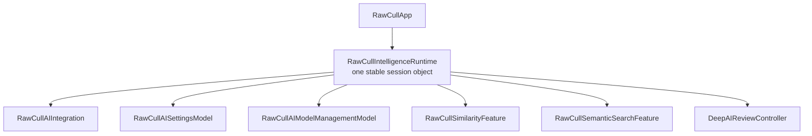
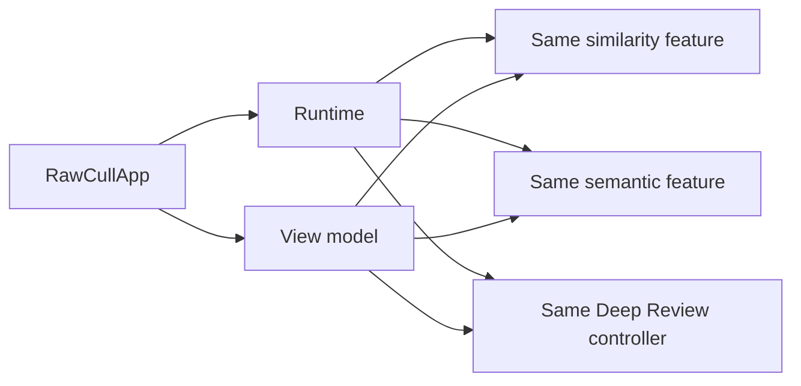
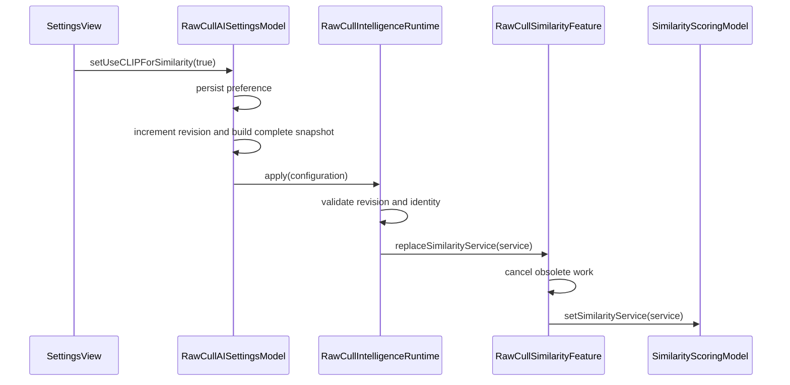
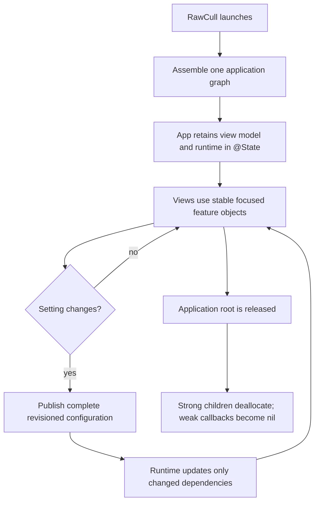

+++
author = "Thomas Evensen"
title = "The RawCull Intelligence Runtime"
date = "2026-09-03"
lastmod = "2026-09-03"
description = "How RawCullIntelligenceRuntime provides stable AI object lifetimes, applies configuration changes, and avoids rebuilding the application graph when settings change."
weight = 59
tags = ["ai", "architecture", "runtime", "swift", "dependency-injection"]
categories = ["technical details"]
mermaid = true
+++

# The RawCull Intelligence Runtime

`RawCullIntelligenceRuntime` is RawCull's long-lived AI lifetime container and
configuration coordinator. It is created once when RawCull starts and retained
until the application releases its root state. It is not a background process, a
thread, an inference engine, or a temporary task created when a user opens the
Settings window.

The word _runtime_ describes the live set of AI-facing application objects used
during one RawCull session:



These objects keep their identities while settings and provider selections
change. Reconfiguration changes selected dependencies inside the established
graph; it does not replace the graph.

## What The Runtime Is Responsible For

The runtime has two closely related responsibilities.

First, it strongly retains the stable AI objects needed by the application:

```swift
@MainActor
final class RawCullIntelligenceRuntime:
    RawCullIntelligenceConfigurationApplying
{
    let integration: RawCullAIIntegration
    let similarityFeature: RawCullSimilarityFeature
    let semanticSearchFeature: RawCullSemanticSearchFeature
    let deepAIReviewController: DeepAIReviewController
    let settingsModel: RawCullAISettingsModel
    let modelManagementModel: RawCullAIModelManagementModel
}
```

Second, it receives complete, revisioned settings configurations and applies
only meaningful changes. It is the controlled point through which settings can
replace the active similarity service, semantic-search service, or segmentation
selection.

The runtime deliberately does not own general application behavior such as the
current catalog, selected files, navigation, ratings, culling decisions, or
undo. Those responsibilities remain in `RawCullViewModel`.

## How The Runtime Is Created

`RawCullApp.init()` asks the application composition root to create the live
state:

```swift
let applicationState = RawCullApplicationState.live()

_viewModel = State(initialValue: applicationState.viewModel)
_intelligenceRuntime = State(
    initialValue: applicationState.intelligenceRuntime
)
```

`RawCullApplicationState` is an assembly value. The app extracts and retains its
two stable roots separately in SwiftUI `@State`:

```text
RawCullApp
 ├─ strong → RawCullViewModel
 └─ strong → RawCullIntelligenceRuntime
```

`RawCullApplicationState.make(...)` constructs their shared dependencies in a
deterministic order:

1. Create `RawCullAIIntegration`, which composes the concrete Vision, CLIP, SAM
   3, and EfficientSAM implementations behind narrow services.
2. Create `RawCullAIModelManagementModel`.
3. Create `RawCullAISettingsModel` with that exact model-management instance.
4. Ask settings for the initial typed configuration.
5. Create one `SimilarityScoringModel` from the initial similarity and semantic
   services.
6. Create `RawCullSimilarityFeature` over the scoring model.
7. Create `RawCullSemanticSearchFeature` over the same scoring model and the
   same similarity feature.
8. Create `DeepAIReviewController` around the integration's existing
   `DeepAIReviewFeature`.
9. Create `RawCullViewModel` with those exact feature objects. Its initializer
   also creates the burst coordinator.
10. Create `RawCullIntelligenceRuntime` with the already-created objects.
11. Bind the narrow weak coordination edges.
12. Assert shared object identity before returning the application state.

The identity assertions are architectural checks. They verify, for example, that
the view model and runtime expose the exact same similarity feature rather than
two equivalent-looking instances.

## Stable Identity Matters

Several parts of RawCull keep references to the same feature objects:



The runtime and view model retaining the same object is intentional. The runtime
guarantees the intelligence lifetime; the view model uses the feature when
application policy requires it. SwiftUI views also receive these feature
references and observe their existing state.

Stable identity preserves:

- active tasks and cancellation handles;
- operation and catalog generations used to reject stale completions;
- observable progress and presentation state;
- the shared similarity artifact and semantic-search state;
- cached Deep Review results;
- view bindings to the current feature objects;
- testable identity across the application graph.

Changing a service inside a stable feature preserves all unrelated state and
lets the feature explicitly invalidate only the work made obsolete by that
change.

## How A Setting Change Is Applied

Suppose the user changes the preferred similarity backend from Vision to CLIP.
The existing object graph handles the change as a value flowing through a
controlled path:



`RawCullAISettingsModel.publishConfiguration()` performs the handoff:

```swift
private func publishConfiguration() {
    guard let configurationConsumer else { return }
    configurationRevision &+= 1
    capabilities = configurationConsumer.apply(
        configuration: configurationSnapshot(
            revision: configurationRevision
        )
    )
}
```

The snapshot is complete. It contains the similarity service, compatible
artifact backend descriptors, semantic-search capability and service, selected
segmentation model, and a monotonically increasing revision. The runtime does
not have to combine several callbacks that might describe different moments in
time.

When `apply(configuration:)` receives the snapshot, it:

1. Rejects a revision older than or equal to the most recently accepted
   revision, except for the permitted same-revision/same-identity case.
2. Compares the complete incoming identity with the last applied identity.
3. Accepts a newer but identical configuration without resetting feature work.
4. Changes the segmentation provider only when the segmentation identity
   changed.
5. Replaces the similarity service only when its backend or accepted artifact
   backends changed.
6. Replaces semantic-search configuration only when its capability or backend
   changed.
7. Records the accepted identity and revision.

The stable `RawCullSimilarityFeature`, `RawCullSemanticSearchFeature`, and
`DeepAIReviewController` instances remain in place.

## Why RawCull Does Not Recreate Everything On A Setting Change

It might appear simpler to construct a new integration, scoring model, feature
objects, controllers, and view model whenever a setting changes. In a stateful
SwiftUI application, however, reconstruction changes much more than the selected
backend.

| Stable runtime reconfiguration                                    | Recreate the graph after each change                                      |
| ----------------------------------------------------------------- | ------------------------------------------------------------------------- |
| Existing feature identities remain valid.                         | Every existing view and owner must receive replacement references.        |
| Only the dependency affected by the setting is replaced.          | Unrelated models and controllers are also recreated.                      |
| Active work can be cancelled by the object that owns it.          | Old tasks may continue on objects that are no longer presented.           |
| Generation counters remain available to reject late results.      | New objects may not know the generations owned by the old objects.        |
| Observable UI state has one continuing owner.                     | Old and new observable objects can temporarily produce split UI state.    |
| Shared scoring-model identity is preserved.                       | Similarity and semantic search can accidentally receive different stores. |
| Cached and in-memory results survive unrelated changes.           | Reconstruction discards state unless every value is manually migrated.    |
| One complete configuration is applied atomically on `@MainActor`. | Multiple replacements can expose partially updated combinations.          |
| Tests can assert exact shared instances and focused invalidation. | Tests must account for graph-wide replacement and rebinding.              |

### The split-graph problem

Consider a view that already holds a similarity feature:

```text
Before setting change

View ────────────────→ SimilarityFeature A
ViewModel ───────────→ SimilarityFeature A
Runtime ─────────────→ SimilarityFeature A
```

If settings create a new feature and update only the runtime, the application
becomes inconsistent:

```text
After incomplete reconstruction

View ────────────────→ SimilarityFeature A  (old)
ViewModel ───────────→ SimilarityFeature A  (old)
Runtime ─────────────→ SimilarityFeature B  (new)
```

The two instances may have the same type and initial values, but they do not
have the same identity, tasks, progress, results, or observation registrations.
Some UI can continue reading the old backend while new commands use the new one.

RawCull instead keeps `SimilarityFeature A` and calls:

```swift
similarityFeature.replaceSimilarityService(newService)
```

Every existing reference continues to reach the same feature, which now uses the
accepted service.

### The orphaned-task problem

Feature objects own task handles and generation counters. Replacing an entire
feature does not automatically make work started by the previous feature safe.
That work may still finish and attempt to publish an obsolete result.

The stable feature can cancel its own tasks, advance its generations, compare
catalog/backend identity, and discard late completions. It has the historical
state required to decide whether a result is still current.

### The state-migration problem

Rebuilding would require deciding which state should be copied into every new
object. Copying too little loses progress, cached results, and UI state. Copying
too much can carry backend-specific artifacts into an incompatible
configuration. Updating a dependency in place makes that invalidation decision
local to the feature that understands the state.

## Why Settings Calls Back To The Runtime Weakly

The runtime strongly owns its settings model:

```text
Runtime ──strong──→ SettingsModel
```

Settings must send configurations back to the runtime, but it must not keep its
owner alive. Its stored consumer is therefore explicitly declared `weak`:

```swift
@ObservationIgnored private weak var configurationConsumer:
    (any RawCullIntelligenceConfigurationApplying)?
```

The protocol is constrained to `AnyObject`, because Swift weak storage applies
only to class instances. The property is optional because Swift automatically
sets a weak reference to `nil` after its target is deallocated.

The resulting graph has one ownership direction and one non-owning callback:

```text
Runtime ──strong──→ SettingsModel
Runtime ←──weak──── SettingsModel
```

If the callback were strong, runtime and settings would retain each other:

```text
Runtime ──strong──→ SettingsModel
Runtime ←─strong─── SettingsModel
```

Releasing the app's runtime root would then leave both objects alive. The fact
that both objects normally last for the complete application session does not
remove the cycle: they must still be releasable when that session ends, and
shorter-lived tests must be able to prove that deallocation occurs.

`weak` also expresses the design contract: settings may notify the runtime, but
settings does not own the runtime. `@ObservationIgnored` has a separate purpose;
it prevents this binding detail from being treated as observable UI state. It
does not make the property weak.

## Other Weak Coordination Edges

The same ownership rule is used elsewhere in the graph:

| Owner              | Strongly retained child         | Weak callback toward                                        |
| ------------------ | ------------------------------- | ----------------------------------------------------------- |
| Runtime            | `RawCullAISettingsModel`        | Runtime through `RawCullIntelligenceConfigurationApplying`  |
| Settings           | `RawCullAIModelManagementModel` | Settings through `RawCullAIManagedModelLocationsApplying`   |
| Runtime/view model | `RawCullSimilarityFeature`      | View model through `RawCullSimilarityApplicationContext`    |
| Runtime/view model | `RawCullSemanticSearchFeature`  | View model through `RawCullSemanticSearchApplicationTarget` |
| Runtime/view model | `DeepAIReviewController`        | View model through `DeepAIReviewApplicationContext`         |
| View model         | `BurstAnalysisCoordinator`      | No stored callback; per-run closures capture `[weak self]`  |

These protocols expose only the small amount of application behavior each
feature needs. A feature can request a catalog snapshot or selection update
without owning the complete view model.

## Runtime, Integration, And View Model

The three layers answer different questions:

| Type                         | Primary question                                                                                                        |
| ---------------------------- | ----------------------------------------------------------------------------------------------------------------------- |
| `RawCullIntelligenceRuntime` | Which stable AI application objects exist, and which complete configuration should they use now?                        |
| `RawCullAIIntegration`       | How are concrete Vision, CLIP, SAM 3, and EfficientSAM providers validated and composed behind narrow services?         |
| `RawCullViewModel`           | Which catalog and files are active, and how should selection, navigation, ratings, culling, review, and results behave? |

The runtime does not perform every AI operation itself. Views call the focused
similarity, semantic-search, and Deep Review surfaces. Those features delegate
to the shared scoring model or backend services and use narrow weak application
contexts only when RawCull-specific policy is required.

## Lifetime Summary

The complete lifecycle is:



The central rule is simple: create the stateful application objects once, keep
their identities stable, and reconfigure their replaceable dependencies through
one controlled boundary.

## Source Map

| Concern                                                    | RawCull source                                                             |
| ---------------------------------------------------------- | -------------------------------------------------------------------------- |
| Application startup                                        | `RawCull/Main/RawCullApp.swift`                                            |
| Assembly, runtime ownership, and configuration application | `RawCull/Intelligence/Composition/RawCullIntelligenceRuntime.swift`        |
| Concrete provider composition                              | `RawCull/Intelligence/Composition/RawCullAIIntegration.swift`              |
| Settings publication and weak runtime consumer             | `RawCull/Intelligence/ModelManagement/RawCullAISettingsModel.swift`        |
| Model-location refresh and weak settings consumer          | `RawCull/Intelligence/ModelManagement/RawCullAIModelManagementModel.swift` |
| Similarity lifetime and weak application context           | `RawCull/Intelligence/Similarity/RawCullSimilarityFeature.swift`           |
| Semantic-search lifetime and weak application target       | `RawCull/Intelligence/SemanticSearch/RawCullSemanticSearchFeature.swift`   |
| Deep Review request construction                           | `RawCull/Intelligence/DeepReview/DeepAIReviewController.swift`             |
| Main view-model assembly and burst coordinator             | `RawCull/Model/ViewModels/RawCullViewModel.swift`                          |

For the surrounding modular architecture, see
[Modular AI Integration](../modularaiintegration/). For actor isolation, task
ownership, and background execution, see [Concurrency](../concurrency-revised/).
