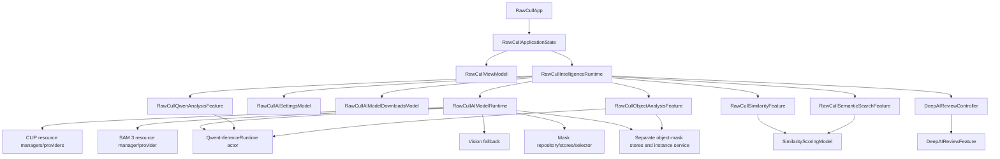
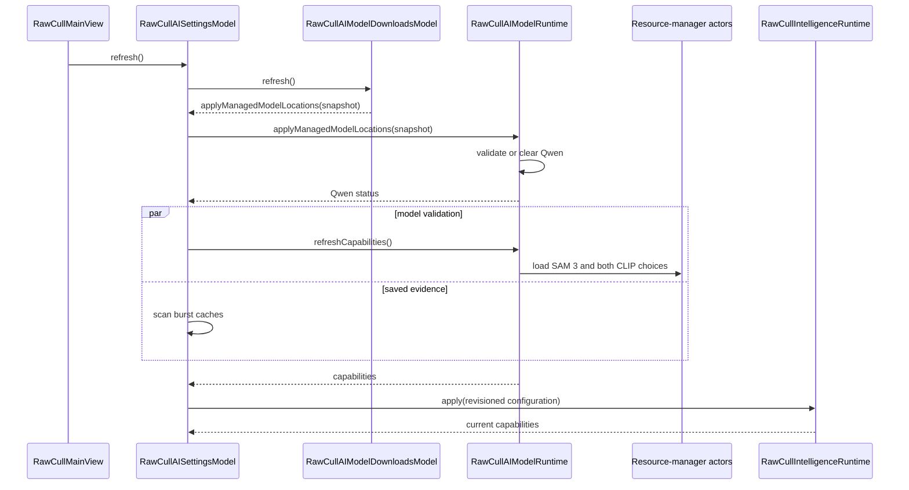
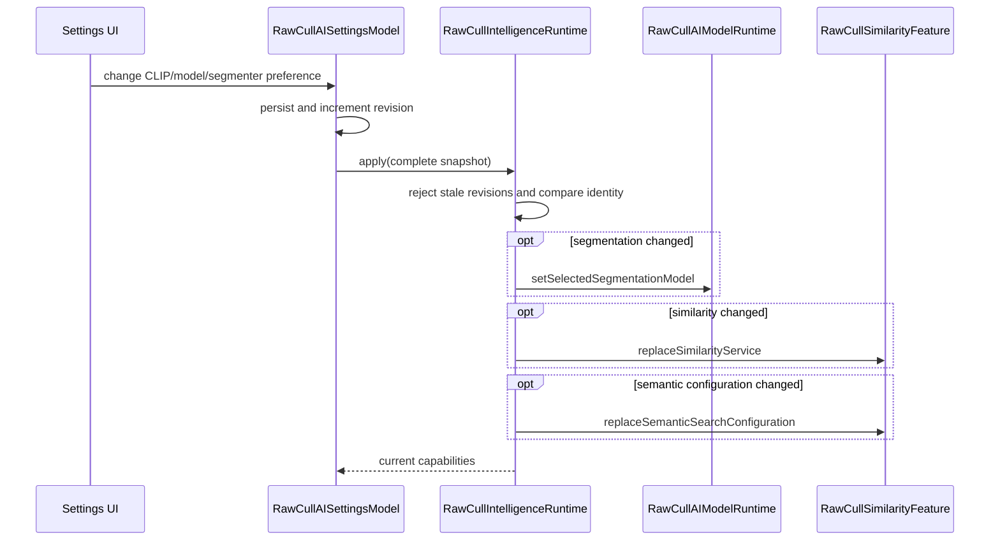
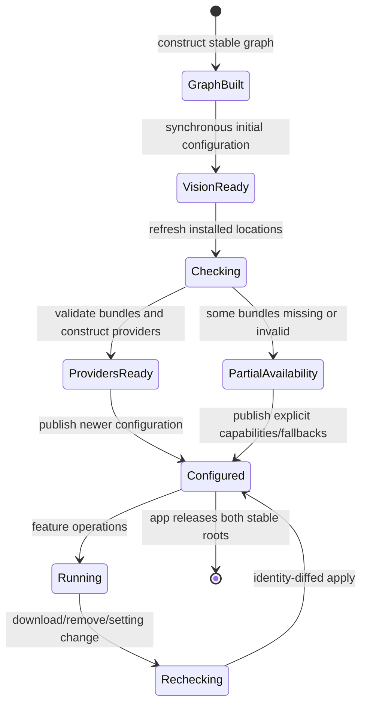

+++
author = "Thomas Evensen"
title = "The RawCull AI Runtime"
linkTitle = "AI Runtime"
date = "2026-09-03"
lastmod = "2026-09-24"
description = "How RawCull owns and refreshes local CLIP, SAM 3, Qwen, Vision, Deep Review, and Objects runtimes."
weight = 59
tags = ["ai", "architecture", "runtime", "swift", "dependency-injection", "objects"]
categories = ["technical details"]
mermaid = true
+++

# The RawCull AI Runtime

RawCull's AI runtime is the long-lived object graph that connects downloaded
model assets to stable application features. It is not one model, one thread,
or a background daemon. It is a set of objects with deliberately different
lifetimes and actor-isolation rules.

The current implementation has two runtime layers:

| Runtime | Primary responsibility |
| --- | --- |
| `RawCullAIModelRuntime` | Own concrete provider/resource lifecycles: CLIP, SAM 3, Qwen, Vision, model capability snapshots, separate subject/object mask stores, and segmentation-service installation. |
| `RawCullIntelligenceRuntime` | Own stable similarity, semantic search, Deep Review, Qwen, and Objects feature lifetimes; apply complete, revisioned similarity/semantic/segmentation settings decisions without rebuilding the graph. |

That distinction replaces the older, broader `RawCullAIIntegration` shape. The
authoritative sources are
[`RawCullAIModelRuntime.swift`](https://github.com/rsyncOSX/RawCull/blob/version-3.2.6/RawCull/Intelligence/Composition/RawCullAIModelRuntime.swift)
and
[`RawCullIntelligenceRuntime.swift`](https://github.com/rsyncOSX/RawCull/blob/version-3.2.6/RawCull/Intelligence/Composition/RawCullIntelligenceRuntime.swift).
For model algorithms and data products, see
[AI Models in RawCull](../aiinrawcull/).

## Runtime Topology



The arrows above mix ownership and collaboration. The precise ownership rules
are discussed below; notably, callbacks from a child toward an owner are weak.

## What Each Layer Owns

### `RawCullAIModelRuntime`

The model runtime is `@MainActor` because model selection and provider
installation must be coordinated with observable feature state. Heavy work is
still isolated elsewhere: its resource managers and Qwen runtime are actors,
and PhotoAIKit's CLIP and SAM 3 providers are actor-owned.

It owns:

- application AI paths;
- three `RawCullAIModelResourceManager` actors: SAM 3, DataComp CLIP, and
  OpenAI CLIP;
- a single `QwenInferenceServing` actor;
- the always-available `VisionFeaturePrintBackend` and Vision similarity
  service;
- dictionaries of validated CLIP and segmentation providers;
- resolved CLIP model locations used to create replacement providers;
- memory and optional disk subject-mask stores;
- separate memory and optional disk object-mask stores;
- an optional `ObjectSegmentationService` built from the validated SAM 3
  provider and those object stores;
- the current `SubjectMaskRepository`, `SegmentationService`, and
  `SubjectMaskSelector`;
- the selected segmentation model and active model identity; and
- the latest `RawCullAICapabilities` snapshot.

Views do not traverse this object. They receive the focused feature surfaces
from `RawCullIntelligenceRuntime`.

### `RawCullIntelligenceRuntime`

The intelligence runtime owns the objects whose identities must remain stable:

```swift
let modelRuntime: RawCullAIModelRuntime
let similarityFeature: RawCullSimilarityFeature
let semanticSearchFeature: RawCullSemanticSearchFeature
let deepAIReviewController: DeepAIReviewController
let qwenAnalysisFeature: RawCullQwenAnalysisFeature
let objectAnalysisFeature: RawCullObjectAnalysisFeature
let settingsModel: RawCullAISettingsModel
let modelDownloadsModel: RawCullAIModelDownloadsModel
```

It also records the last accepted configuration revision and identity. Its
single mutation entry point is `apply(configuration:)`.

### `RawCullViewModel`

The main view model owns product and catalog policy, not model runtimes. It
answers questions such as which files are selected, what the current catalog
identity is, what burst ranks and sharpness scores exist, and whether an AI
operation conflicts with other work. Narrow protocols expose only the pieces
the AI features need.

## Construction: From App Launch to a Live Graph

[`RawCullApp.init()`](https://github.com/rsyncOSX/RawCull/blob/version-3.2.6/RawCull/Main/RawCullApp.swift#L111)
calls `RawCullApplicationState.live()`. SwiftUI retains the returned view model
and intelligence runtime in separate `@State` properties:

```text
RawCullApp
 ├─ strong → RawCullViewModel
 └─ strong → RawCullIntelligenceRuntime
```

`live()` constructs a default `RawCullAIModelRuntime`, then delegates to the
injectable `RawCullApplicationState.make(...)`. The factory accepts stores,
preferences, scanners, download catalog/coordinator, and version information as
parameters so tests can build the same graph with deterministic substitutes.

### Phase 1: initialize the model runtime

`RawCullAIModelRuntime.init` performs only synchronous, bounded setup:

1. Store `RawCullAIPaths` and the Qwen inference actor.
2. Create SAM 3 and CLIP resource-manager actors with their PhotoAIKit
   factories. Managed URLs are initially unset.
3. Create one Vision provider and wrap it in
   `RawCullVisionSimilarityService`.
4. Create `SubjectMaskMemoryStore`.
5. Attempt to create `SubjectMaskDiskStore` at
   `Caches/no.blogspot.RawCull/SAM3Masks`. Failure is represented as a
   capability state; it does not prevent the application from launching.
   Create a separate object-mask memory store and try an object disk store at
   the configured object-mask cache path. A disk-store failure leaves Objects
   with its memory store.
6. Build the list of usable stores: memory always, disk when construction
   succeeded.
7. Create an `UnavailableSegmentationProvider`, repository, segmentation
   service, and selector. This placeholder gives the graph a complete shape
   before SAM validation.
8. Publish an initial capability snapshot: Vision available, model resources
   checking, and mask-storage status known.

No CLIP, SAM 3, or Qwen model engine is loaded in this initializer.

### Phase 2: assemble stable features

`RawCullApplicationState.make` then performs the following order:

1. Create `RawCullAIModelDownloadsModel` from runtime paths and the production
   model catalog.
2. Create `RawCullQwenAnalysisFeature` and `RawCullObjectAnalysisFeature` with
   the same `modelRuntime.qwenInference`. Pass the object feature the exact
   memory and optional disk object-mask stores owned by the model runtime.
3. Create `DeepAIReviewFeature` with the initial mask-generation capability.
4. Bind that exact feature to the model runtime. The runtime installs an actual
   pipeline later when a segmentation provider becomes available.
5. Create `RawCullAISettingsModel` with model runtime, downloads model, Qwen
   feature, user defaults, and saved-burst-evidence scan.
6. Ask settings for a synchronous revision-0 configuration.
7. Create one `SimilarityScoringModel` from the selected similarity service,
   semantic capability/service, and persistent artifact store.
8. Wrap it in `RawCullSimilarityFeature` and
   `RawCullSemanticSearchFeature`. Both wrappers refer to the same scoring model.
9. Wrap the Deep Review feature in `DeepAIReviewController`.
10. Create `RawCullViewModel` with those exact feature/controller instances.
11. Create `RawCullIntelligenceRuntime` and bind the similarity feature's weak
    application context.
12. Bind semantic search to the view model and settings to the runtime.

The final settings binding immediately publishes the first configuration. This
happens only after every receiver exists.

### Phase 3: verify graph identity

Debug assertions verify that:

- view model and runtime share the same similarity feature;
- semantic search and similarity share the same scoring model/feature identity;
- view model and runtime share the same semantic and Deep Review objects;
- controller and model runtime refer to the same Deep Review feature;
- runtime and Qwen feature share the same Qwen inference actor;
- runtime and Objects feature share that same Qwen inference actor;
- settings, runtime, and Qwen feature share the intended model runtime and
  inference actor; and
- settings and runtime expose the same downloads model.

These are architectural invariants. Two equivalent-looking instances would not
share task handles, progress, caches, result dictionaries, generation counters,
or SwiftUI observation.

## Development Handoff: PhotoAIKit Objects to the Runtime

PhotoAIKit supplies provider factories, typed contracts, workflows, and stores.
RawCull creates those objects and decides when they become usable. There is no
package callback that injects providers into `RawCullIntelligenceRuntime`:
`RawCullAIModelRuntime` owns the provider handoff, while Settings delivers
selected services to the stable feature objects.

### Declare and construct the package boundary

`RawCullAIModelRuntime.swift` imports `CoreAICLIPBackend`,
`CoreAISAM3Backend`, `PhotoAIContracts`, `PhotoAIStorage`,
`PhotoAIWorkflows`, and `VisionFeaturePrintBackend`. At construction it passes
`CoreAICLIPProvider.factory` and `CoreAISAM3Provider.factory` to separate
`RawCullAIModelResourceManager` actors. It also creates the Vision provider,
`SubjectMaskMemoryStore`, optional `SubjectMaskDiskStore`, and an unavailable
segmentation provider. The latter lets `SegmentationService`,
`SubjectMaskRepository`, and `SubjectMaskSelector` exist before a SAM bundle is
validated. Qwen's `CoreAIQwenProvider.factory` is used by the separate
`QwenInferenceRuntime` actor.

These are the objects crossing the package boundary:

| PhotoAIKit object or contract | RawCull receiver and use |
| --- | --- |
| `CoreAICLIPProvider` and `SimilarityBackendDescriptor` | Model runtime retains the validated provider; similarity and semantic services wrap it. The descriptor identifies compatible artifacts. |
| `CoreAISAM3Provider` as `SubjectSegmenting`, with `ModelIdentity` | Model runtime installs it in a segmentation service and selector, then gives Deep Review a pipeline. Identity determines when the pipeline must be rebuilt. |
| The same `CoreAISAM3Provider` as `ObjectInstanceSegmenting` | Model runtime builds a separate `ObjectSegmentationService` with object-mask stores and gives it to the existing Objects feature through Settings. |
| `VisionFeaturePrintBackend` | Model runtime wraps it in the always-ready Vision similarity service. |
| `SubjectMaskMemoryStore` and optional `SubjectMaskDiskStore` | Repository and segmentation service share the stores; the disk store also supports Deep Review mask loading. |
| `ObjectMaskMemoryStore` and optional `ObjectMaskDiskStore` | A separate instance-mask cache namespace, shared by object segmentation, detail outline loading, and assessment retry. |
| `CoreAIQwenProvider` | Qwen inference actor retains the validated provider and loads its vision-language model on first use; the Qwen feature holds that same actor. |

### Enable installed models and hand off providers

The development path from a model download to a live feature is:

```text
Background Assets snapshot (complete model-ID → URL map)
  → Downloads model → Settings.applyManagedModelLocations
  → RawCullAIModelRuntime.applyManagedModelLocations
  → resource-manager actors / QwenInferenceRuntime
  → PhotoAIKit capability check and provider construction
  → RawCullAIModelRuntime.refreshCapabilities
  → Settings.configurationSnapshot → RawCullIntelligenceRuntime.apply
  → existing feature objects
```

The model runtime supplies managed URLs to each CLIP and SAM resource manager.
Each actor checks a metadata snapshot, asks its PhotoAIKit factory to validate
the candidate bundle, and constructs a provider only for an available resource.
`refreshCapabilities()` loads those actors concurrently, then stores the
validated providers, their resolved CLIP URLs, and a capability snapshot on the
main actor. If SAM 3 validated, it also constructs the object instance service
with the separate object-mask stores. Qwen instead validates or clears its actor in
`applyManagedModelLocations`; Settings passes its status to the already-created
Qwen feature. Validation does not eagerly load Qwen's vision-language model.

The provider reaches a feature through one of three paths:

1. For **image similarity**, Settings calls
   `modelRuntime.similarityService(prefersCLIP:clipModel:)`. It wraps the selected
   validated CLIP provider in `RawCullCLIPSimilarityService`, or uses the Vision
   service. The CLIP service also receives the resolved bundle URL through a
   replacement-provider factory for finite-vector recovery.
2. For **semantic search**, Settings calls
   `modelRuntime.semanticSearchService(clipModel:)`. The same validated CLIP
   provider backs `RawCullCLIPSemanticSearchService`; a missing provider yields
   no semantic service. `configurationSnapshot` carries the selected capability
   and service to `RawCullIntelligenceRuntime.apply(configuration:)`, which
   updates the shared `SimilarityScoringModel` through its stable feature.
3. For **Deep Review**, `refreshCapabilities()` activates the selected SAM
   provider. The model runtime rebuilds the repository, segmentation service,
   and selector only when `ModelIdentity` changes, then calls
   `DeepAIReviewFeature.install` with a pipeline, optional disk-mask loader, and
   availability. The existing controller and feature keep their identities.
4. For **Objects**, Settings installs `modelRuntime.objectSegmentation` and the
   current Qwen status into `RawCullObjectAnalysisFeature` after validation.
   The feature stays at the same identity and becomes ready only when both
   services are available. It uses the same Qwen actor as standalone Qwen and
   the same SAM 3 provider as Deep Review, through a different workflow/cache.

The runtime configuration carries selected services and descriptor-based
identity, not an unvalidated model URL. Its revision prevents an older Settings
decision from overwriting a newer one. When adding a PhotoAIKit backend, wire
its factory and managed location into the model runtime, translate its
capability and provider result, then expose it through the appropriate stable
feature or configuration path. Keep model-specific inference inside the
provider or actor and application policy inside RawCull.

## Startup Refresh and Installed-Model Activation

The graph is usable immediately with Vision while disk checks happen later.
When `RawCullMainView` appears, this task starts the real refresh:

```swift
.task {
    await intelligenceRuntime.settingsModel.refresh()
}
```

The call path is:



### One complete location snapshot

`applyManagedModelLocations(_:)` is the only activation path for a complete set
of installed locations. It gives the current SAM and CLIP URLs to their resource
managers. A missing Qwen URL calls `qwenInference.clear()`; a present URL is
standardized and validated.

Using a complete snapshot avoids a transient mixture such as “new CLIP, old
SAM, removed Qwen still active.” Every invocation describes one model-install
state.

### Generation-gated refresh

Settings increments `refreshGeneration` before beginning work. The generation
is checked after Qwen validation and after the concurrent capability/evidence
work. A later refresh therefore supersedes an earlier one; the earlier result
cannot publish merely because its disk work finished last.

The `defer` that clears `isScanningSavedBurstData` also checks the generation,
so an obsolete refresh cannot hide the current refresh's progress indicator.

### Concurrent capability validation

`RawCullAIModelRuntime.refreshCapabilities()` starts SAM 3, DataComp CLIP, and
OpenAI CLIP loads with `async let`. Each resource-manager actor computes a
lightweight recursive metadata snapshot. When unchanged, the previous validated
capability/provider result is reused. When changed, PhotoAIKit validates the
bundle and constructs a provider.

After all three complete, the main-actor runtime atomically replaces its
provider dictionaries and resolved location dictionaries, translates package
statuses into RawCull statuses, builds semantic-search readiness separately,
stores one new capability snapshot, and activates the selected segmentation
provider.

## Capability State Is More Than “Loaded”

`RawCullAICapabilityStatus` distinguishes:

| State | Meaning |
| --- | --- |
| `checking(expectedLocations:)` | Validation is pending. |
| `available(location:)` | Bundle validation and provider construction succeeded, or an always-available service such as Vision is ready. |
| `missing(expectedLocations:)` | No candidate bundle was found. |
| `invalid(location:reason:)` | A candidate exists but validation or provider construction failed. |
| `unavailable(reason:)` | The runtime cannot offer the capability for another explicit reason. |

CLIP model availability and semantic-search readiness are separate. A provider
must expose the text/image contracts before semantic search is `.ready`. Vision
remains a valid similarity service but can never satisfy semantic text search.

Qwen uses an internal `QwenModelStatus` with not-configured, checking,
available, missing, and invalid states. Settings translates it to the common
capability presentation and updates the Qwen feature at the same time.

## Resource Managers and Their Cache

`RawCullAIModelResourceManager<Provider>` is an actor because filesystem
inspection, cryptographic bundle validation, and provider initialization must
not run on the main actor or race with a managed-location change.

The resource cache has two keys:

- `RawCullAIModelResourceSnapshot`, a sorted list of path, file kind, byte
  count, modification time, and symlink target; and
- the resulting capability, optional provider, and optional provider-init
  failure.

`setManagedCandidateURL` invalidates both when the URL changes. `load()` also
detects modifications within the same directory. The snapshot only decides
whether validation may be reused. PhotoAIKit's resolver remains responsible for
metadata, required files, asset extension, fingerprint, and checksum validity.

Bundle validity and provider construction are reported separately. A bundle can
be structurally valid yet fail to initialize its concrete runtime; RawCull maps
that case to `.invalid` with the provider error so Settings can explain the
actual stage that failed.

## Selecting the Similarity Runtime

`RawCullAIModelRuntime.similarityService(prefersCLIP:clipModel:)` has a strict
selection order:

1. If the user disabled CLIP, return the existing Vision service.
2. If the selected CLIP provider is absent, log the expected/resolved path and
   return Vision.
3. If the provider exists but its resolved location is missing, return Vision.
4. Otherwise return a new `RawCullCLIPSimilarityService` around the validated
   provider and supply a factory that can reconstruct a provider from the exact
   validated location for finite-vector recovery.

The service value can change while `RawCullSimilarityFeature` and
`SimilarityScoringModel` retain their identities. Backend descriptors determine
whether existing artifacts are still compatible.

Semantic search is constructed only from a currently validated CLIP provider.
The provider itself satisfies both `TextEmbeddingProviding` and
`ImageTextSimilarityComparing`, so `RawCullCLIPSemanticSearchService` can use
the same model identity as the cached image embeddings.

## Installing and Replacing the Segmentation Runtime

The model runtime retains the selected `RawCullSegmentationModel`, currently
SAM 3. Selection and availability changes converge on
`activateSelectedSegmentationProvider(availability:)`.

When a provider is available, `installSegmentationProviderIfNeeded` compares
its `ModelIdentity` with the active identity. A change rebuilds:

1. `SubjectMaskRepositoryConfiguration` with prompt, model identity, and maximum
   input side;
2. `SubjectMaskRepository` over the retained stores;
3. `SegmentationService` over the new provider and stores; and
4. `SubjectMaskSelector` over the matching repository and service.

When unavailable, the runtime installs the placeholder provider only if a real
identity was previously active. Identity checks prevent needless reconstruction
on repeated equivalent refreshes.

The stable `DeepAIReviewFeature` then receives:

- a new `RawCullDeepAIReviewPipeline` when the provider exists;
- a disk-mask loader when disk storage exists; and
- the current availability state.

If availability disappears during a review, `DeepAIReviewFeature.install`
cancels the active operation. Stored feature identity and already completed
results remain under one owner.

## Objects Runtime: shared models, separate workflow

Objects uses the same validated SAM 3 provider as Deep Review, but calls its
instance-segmentation contract through a separate ObjectSegmentationService.
It uses the same QwenInferenceRuntime actor as standalone Qwen, but owns a
separate feature state machine and result array. These shared actors prevent
duplicate heavy model instances; the separate workflows keep subject-mask
selection and per-object instance analysis from sharing incompatible caches.

### Activation and deactivation

The model runtime creates ObjectMaskMemoryStore at launch and tries
ObjectMaskDiskStore using the configured object-mask cache directory. It starts
with no object segmentation service. A complete managed-location snapshot
clears that service, changes SAM 3 and CLIP resource-manager candidates, and
validates or clears Qwen. Settings first cancels and marks Objects unavailable
while this snapshot is applied. The generation-gated capability refresh then
loads the SAM 3 provider; when available, it builds ObjectSegmentationService
with the object stores, 4,320-pixel maximum side, and eight-instance maximum.
Settings installs that service and the latest Qwen status into the existing
RawCullObjectAnalysisFeature.

The feature is ready only when both services exist. It distinguishes checking,
SAM 3 unavailable, Qwen unavailable, and both unavailable so the view can
direct users to the missing download. install(segmentation:qwenStatus:) cancels
an active batch when either dependency changes. Model removal therefore cannot
leave an active Objects operation attached to a stale provider.

### Feature lifetime and task boundaries

RawCullApplicationState.make creates one object feature and passes it to
Settings, RawCullIntelligenceRuntime, and the AI Analysis view. Identity
assertions check that it shares the model runtime's Qwen actor. The feature
retains the Qwen actor, image loader, mask stores, current object service,
availability, results, progress, and a cancellable task. It snapshots the
chosen concept mode, manual phrases, and criteria at batch start. Files are
processed sequentially, each concept is segmented sequentially, and
cancellation is checked between image loading, discovery, segmentation,
board construction, and Qwen assessment.

The model runtime is main-actor isolated for installation and selection.
ObjectSegmentationService and QwenInferenceRuntime are actors. The mask
deduplication and board rendering CPU work runs in concurrent tasks before
returning immutable results to the main-actor feature. Object results and
captured timings stay in memory; object masks may outlive a feature result in
the optional disk store. A detail view retrieves masks using the stored SAM 3
model identity and the same source/concept/cache parameters, then generates
yellow outlines without regenerating a model result.

### No-match, response failure, and retry

An empty retained instance set completes as No Matching Objects and skips the
Qwen board. When SAM 3 found instances but Qwen returned invalid or incomplete
assessment JSON, the result keeps the instances and free-form response, records
a stage-specific error, and remains eligible for Analyze or Retry Failed. It
does not become Complete merely because segmentation succeeded.

For assessment retry, the feature checks source size and modification date,
discovery mode, manual concepts, Qwen model name, and the stored result. It
loads every retained mask using PhotoAIKit's object cache key, which also
encodes source identity, concept, SAM 3 model identity, input maximum side,
and instance limit. Only a complete cache hit reuses segmentation; otherwise
the workflow rediscovers concepts when needed and reruns SAM 3. Cancellation
and generation checks keep a superseded result from publishing.

The results table labels whole-photo Qwen confidence. The detail view labels
each SAM 3 mask score independently. The exact board-ID check establishes that
the response describes the expected number of objects; it cannot prove that
the descriptions correctly match those objects. The September 24 puffin
evaluation produced 16/16 structured results yet still exposed a swapped
two-bird description and false scene claims. See
[AI Models in RawCull](../aiinrawcull/#objects-instance-level-sam-3-and-qwen-analysis)
for the prompt, mask filtering, board layout, timings, and release-gate limits.

## Qwen Runtime Lifetime

Qwen intentionally does not use the generic resource-manager actor. Its
`QwenInferenceRuntime` owns two lazy layers:

1. `CoreAIQwenProvider`, created during validation; and
2. `CoreAIVisionLanguageModel`, created on the first assessment and retained for
   subsequent sessions.

Every validation or clear increments `modelGeneration`. `assess` captures that
generation before an asynchronous model load and checks it after every
suspension. If Settings removes or replaces the model during loading or
generation, the old operation throws cancellation instead of publishing through
an obsolete model.

`RawCullQwenAnalysisFeature` and `RawCullObjectAnalysisFeature` each own a
separate batch generation and task while sharing that one inference actor.
Both process images one at a time, isolate per-file failures, and cancel when
their required model status changes. The features and inference actor protect
different races: batch/UI lifetime and provider/model lifetime.

## Revisioned Configuration Application

Settings publishes one complete `RawCullIntelligenceConfiguration` containing:

- a monotonically increasing revision;
- the selected similarity service;
- semantic-search capability and optional service; and
- the selected segmentation model.

Its `identity` contains values, not provider references:

- selected similarity backend descriptor;
- accepted artifact backend descriptors;
- semantic capability;
- semantic backend descriptor; and
- segmentation selection.

Concrete services stay on `@MainActor`; only descriptor-based identity is
`Sendable`.

### The apply algorithm

`RawCullIntelligenceRuntime.apply(configuration:)` follows this order:

1. Compute incoming identity.
2. Reject a revision less than or equal to the last accepted revision. A
   same-revision/different-identity assertion catches a broken publisher.
3. If a newer revision describes the same identity, record the newer revision
   without resetting any work.
4. If segmentation selection changed, ask the model runtime to activate it.
5. If similarity backend or accepted artifact descriptors changed, replace the
   similarity service through the stable feature.
6. If semantic capability or semantic backend changed, replace semantic
   configuration through that same stable similarity feature.
7. Record the accepted identity and revision.
8. Return the model runtime's current capability snapshot to Settings.



Revision and identity solve different problems. Revision orders decisions;
identity determines whether a newer decision requires work.

## What Service Replacement Invalidates

`RawCullSimilarityFeature.replaceSimilarityService` first compares complete
backend identities. For a real change it:

1. asks the application context to cancel and reset burst analysis tied to the
   old backend;
2. installs the new service in `SimilarityScoringModel`;
3. cancels existing image hydration;
4. advances the image-hydration generation; and
5. rehydrates the current catalog for the new accepted descriptors.

Semantic replacement updates semantic capability/service, cancels semantic
hydration, advances its independent generation, and rehydrates compatible
artifacts. Image similarity and semantic search use separate task handles and
generations so changing one concern does not confuse completion from the other.

Catalog hydration performs image and semantic hydration in order and finally
checks the current catalog identity. Ranking captures operation generation,
catalog identity, and backend identity. A late completion must match all three
before it is accepted.

## Stable Identity: Why the Graph Is Not Rebuilt

Several views and owners retain the same feature objects:

```text
RawCullApp ───────────→ RawCullIntelligenceRuntime
RawCullViewModel ─────→ RawCullSimilarityFeature A
Runtime ──────────────→ RawCullSimilarityFeature A
SwiftUI view ─────────→ RawCullSimilarityFeature A
```

On a model switch RawCull keeps `A` and changes its service. Rebuilding would
create a split graph where an existing view observes `A` while runtime commands
reach `B`. The objects might have the same type, but they would not share:

- active task handles;
- cancellation and generation state;
- indexing/search progress;
- hydrated artifacts and distances;
- Deep Review results and mask-candidate history;
- Qwen results and current batch;
- Objects results, numbered instance IDs, retry state, and mask-cache access;
- SwiftUI observation registrations; or
- application-context bindings.

Keeping the stateful owner stable also lets the owner make a precise
invalidation decision. Reconstructing everything would either lose unrelated
state or risk copying backend-specific state into an incompatible runtime.

## Ownership and Weak Coordination Edges

The runtime strongly owns Settings, but Settings must call back to the runtime.
That callback is weak:

```swift
@ObservationIgnored private weak var configurationConsumer:
    (any RawCullIntelligenceConfigurationApplying)?
```

`AnyObject` permits weak protocol storage. `@ObservationIgnored` prevents a
coordination detail from becoming UI state; it does not affect ownership.

Other coordination edges follow the same rule:

| Strong owner/child relation | Weak or per-run callback |
| --- | --- |
| Intelligence runtime → Settings | Settings → `RawCullIntelligenceConfigurationApplying` |
| Settings → Downloads model | Downloads model → `RawCullAIManagedModelLocationsApplying` |
| Runtime/view model → Similarity feature | Similarity feature → `RawCullSimilarityApplicationContext` |
| Runtime/view model → Semantic feature | Semantic feature → `RawCullSemanticSearchApplicationTarget` |
| Runtime/view model → Deep Review controller | Controller → `DeepAIReviewApplicationContext` |
| View model → Burst coordinator | Per-run closures capture `[weak self]` |

This produces one clear ownership direction and prevents retain cycles in both
the full application session and shorter-lived tests.

## Actor Isolation and Work Placement

| Component | Isolation | Why |
| --- | --- | --- |
| `RawCullAIModelRuntime` | `@MainActor` | Atomically publishes capabilities and installs services used by observable features. |
| `RawCullIntelligenceRuntime` | `@MainActor` | Applies ordered settings decisions to stable UI-facing objects. |
| Settings/features/controllers/scoring model | `@MainActor` | Own observable state, tasks, progress, and presentation. |
| `RawCullAIModelResourceManager` | actor | Serializes location/cache state while keeping filesystem and provider setup off the main actor. |
| `CoreAICLIPProvider` | actor | Owns lazy Core AI model/tokenizer state and serial inference. |
| `CoreAISAM3Provider` | actor | Owns lazy segmentation engine/tokenizer state. |
| `SegmentationService` | actor | Coordinates provider access and mask stores. |
| `ObjectSegmentationService` | actor | Coordinates per-concept SAM 3 instance inference and the separate object-mask stores. |
| `QwenInferenceRuntime` | actor | Owns provider, loaded VLM, and model generation. |
| `RawCullObjectAnalysisFeature` | `@MainActor` | Owns availability, sequential batch, progress, results, retries, and generation. |
| Pure scoring/ranking functions | `@concurrent` or nonisolated | Run CPU-heavy work without making observable state unsafe. |

The main actor coordinates; it does not perform model hashing, model execution,
image vector comparison, or pixel-level subject-detail scoring itself.

## Cancellation and Stale-Result Defences

RawCull uses several independent tokens because they protect different scopes:

| Counter or identity | Rejects |
| --- | --- |
| Settings `refreshGeneration` | An older model/evidence refresh finishing after a newer one. |
| Runtime configuration revision | An older settings decision arriving after a newer decision. |
| Similarity hydration generations | Results from tasks invalidated by service or catalog changes. |
| Similarity ranking generation + catalog/backend identity | Ranking for an old anchor, catalog, or backend. |
| Deep Review generation | Progress/results after cancellation or restart. |
| Qwen feature generation | Batch results after cancellation/restart. |
| Objects feature generation | Object results after cancellation, model replacement, tool/source switch, or restart. |
| Qwen model generation | A lazy load or response using a removed/replaced provider. |

Task cancellation is cooperative, so the generation and identity checks are
essential. Cancellation requests work to stop; generations prevent late work
that did not stop immediately from becoming current state.

## Failure and Fallback Policy

Runtime fallback is explicit:

- If CLIP is disabled, missing, invalid, or fails provider construction,
  similarity uses Vision.
- Once a CLIP indexing pass begins, individual failures do **not** receive
  Vision artifacts. Valid CLIP results remain; failed files stay unavailable.
- Semantic search is unavailable without a compatible text-capable CLIP
  provider and compatible cached image artifacts.
- Deep Review is unavailable without the selected segmentation provider. A
  failed candidate does not prevent later candidates from being evaluated.
- Disk mask-cache creation failure leaves memory storage usable, while the
  capability reports the disk failure.
- Qwen absence clears its runtime; an invalid or text-only bundle is reported,
  and an active batch is cancelled when status becomes unavailable.
- Objects requires both SAM 3 and Qwen. Its availability names the missing
  dependency; it does not silently substitute CLIP, Vision, or generic prose.
  An empty SAM 3 object set is a successful no-match result. An invalid Qwen
  assessment after segmentation stays visible and retryable.

This distinction between **service-selection fallback** and **within-operation
fallback** prevents heterogeneous artifacts and misleading results.

## Runtime Lifecycle Summary



The important invariant is that provider availability may change many times,
while application feature identities remain stable for the session.

## Source Map

| Concern | Source |
| --- | --- |
| App retention and startup refresh | [`RawCull/Main/RawCullApp.swift`](https://github.com/rsyncOSX/RawCull/blob/version-3.2.6/RawCull/Main/RawCullApp.swift) |
| Model/provider runtime | [`RawCull/Intelligence/Composition/RawCullAIModelRuntime.swift`](https://github.com/rsyncOSX/RawCull/blob/version-3.2.6/RawCull/Intelligence/Composition/RawCullAIModelRuntime.swift) |
| Assembly and stable runtime | [`RawCull/Intelligence/Composition/RawCullIntelligenceRuntime.swift`](https://github.com/rsyncOSX/RawCull/blob/version-3.2.6/RawCull/Intelligence/Composition/RawCullIntelligenceRuntime.swift) |
| Runtime paths/capabilities | [`RawCull/Intelligence/Contracts/RawCullAIModels.swift`](https://github.com/rsyncOSX/RawCull/blob/version-3.2.6/RawCull/Intelligence/Contracts/RawCullAIModels.swift) |
| Resource-manager actor/cache | [`RawCull/Intelligence/ModelManagement/RawCullAIModelResourceManager.swift`](https://github.com/rsyncOSX/RawCull/blob/version-3.2.6/RawCull/Intelligence/ModelManagement/RawCullAIModelResourceManager.swift) |
| Settings refresh/config publication | [`RawCull/Intelligence/ModelManagement/RawCullAISettingsModel.swift`](https://github.com/rsyncOSX/RawCull/blob/version-3.2.6/RawCull/Intelligence/ModelManagement/RawCullAISettingsModel.swift) |
| Downloads and location snapshot | [`RawCull/Intelligence/ModelManagement/RawCullAIModelDownloadsModel.swift`](https://github.com/rsyncOSX/RawCull/blob/version-3.2.6/RawCull/Intelligence/ModelManagement/RawCullAIModelDownloadsModel.swift) |
| Stable similarity operations | [`RawCull/Intelligence/Similarity/RawCullSimilarityFeature.swift`](https://github.com/rsyncOSX/RawCull/blob/version-3.2.6/RawCull/Intelligence/Similarity/RawCullSimilarityFeature.swift) |
| Shared similarity/search state | [`RawCull/Intelligence/Similarity/SimilarityScoringModel.swift`](https://github.com/rsyncOSX/RawCull/blob/version-3.2.6/RawCull/Intelligence/Similarity/SimilarityScoringModel.swift) |
| Deep Review service installation/state | [`RawCull/Intelligence/DeepReview/DeepAIReviewFeature.swift`](https://github.com/rsyncOSX/RawCull/blob/version-3.2.6/RawCull/Intelligence/DeepReview/DeepAIReviewFeature.swift) |
| Qwen provider/model actor | [`RawCull/Intelligence/Qwen/QwenInferenceRuntime.swift`](https://github.com/rsyncOSX/RawCull/blob/version-3.2.6/RawCull/Intelligence/Qwen/QwenInferenceRuntime.swift) |
| Objects feature, cache reuse, and diagnostics | [`RawCull/Intelligence/ObjectAnalysis/RawCullObjectAnalysisFeature.swift`](https://github.com/rsyncOSX/RawCull/blob/version-3.2.6/RawCull/Intelligence/ObjectAnalysis/RawCullObjectAnalysisFeature.swift) |
| Objects contracts, validation, and board | [`RawCull/Intelligence/ObjectAnalysis`](https://github.com/rsyncOSX/RawCull/tree/version-3.2.6/RawCull/Intelligence/ObjectAnalysis) |
| Objects view and status | [`RawCull/Views/AIAnalysis/ObjectAnalysisView.swift`](https://github.com/rsyncOSX/RawCull/blob/version-3.2.6/RawCull/Views/AIAnalysis/ObjectAnalysisView.swift) |
| PhotoAIKit object workflow | [`PhotoAIWorkflows/ObjectSegmentationService.swift`](https://github.com/rsyncOSX/PhotoAIKit/blob/77cc1d84a5d98a485caa15be102c8a55eb3d7698/Sources/PhotoAIWorkflows/ObjectSegmentationService.swift) |

The runtime's central rule is simple: validate and replace model-dependent
services behind stable state owners, then accept results only when revision,
generation, catalog, and backend identities still match.
