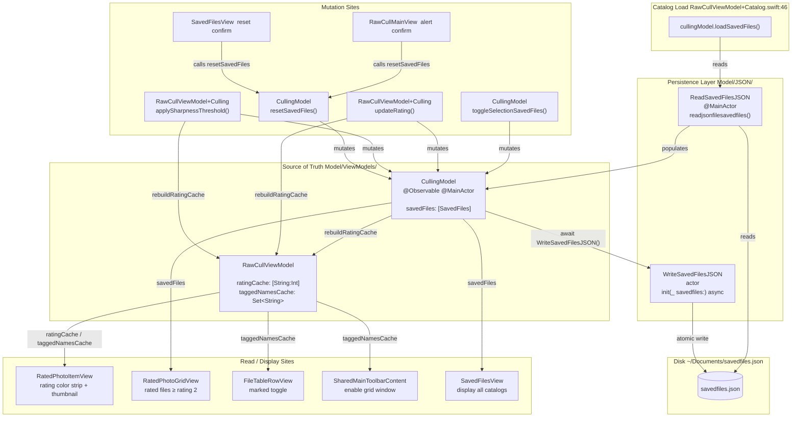

+++
author = "Thomas Evensen"
title = "Saved Files"
date = "2026-04-09"
weight = 1
tags = ["saved files"]
categories = ["technical details"]
mermaid = true
+++

# SavedFiles Architecture

This document describes how `SavedFiles` are created, read, and updated across the RawCull codebase, and where the source of truth lives.

---

## Data Model

```
SavedFiles
├── id: UUID
├── catalog: URL?          — directory path scanned (per-catalog grouping key)
├── dateStart: String?     — timestamp of when cataloging started
└── filerecords: [FileRecord]?
         ├── id: UUID
         ├── fileName: String?         — RAW file name (.arw or .nef)
         ├── dateTagged: String?       — when the file was tagged
         ├── dateCopied: String?       — when the file was copied (unused)
         ├── rating: Int?              — 1–5 star, −1 rejected, 0 keeper
         ├── sharpnessScore: Float?    — raw sharpness score (pre-normalisation)
         └── saliencySubject: String?  — Vision subject label, e.g. "bird"
```

**Disk location:** `~/Documents/savedfiles.json`

`sharpnessScore` and `saliencySubject` are persisted so that scores and
subject labels survive a restart without re-running the scoring pipeline.
They are populated after `SharpnessScoringModel.scoreFiles(_:)` completes
and restored on catalog open by `applyPreloadedScores(_:preloadedScores:preloadedSaliency:)`.

---

## Source of Truth

`CullingModel.savedFiles: [SavedFiles]` is the single in-memory source of truth.
It is an `@Observable @MainActor` property — all reads and mutations happen on the main thread.

`RawCullViewModel` maintains two derived caches rebuilt after every mutation:
- `ratingCache: [String: Int]` — O(1) rating lookups by filename
- `taggedNamesCache: Set<String>` — O(1) tagged-file membership checks

---

## Lifecycle Diagram



---

## Write Operations

Every write passes the full `cullingModel.savedFiles` array to the static `WriteSavedFilesJSON.write(_:)` (actor, atomic write). The actor encodes on its executor via `DecodeEncodeGeneric` and writes with `.atomic` options so a crash mid-write never corrupts the JSON.

| Trigger | Location | What changes |
|---------|----------|--------------|
| User rates a file (1–5 / reject) | `RawCullViewModel+Culling.updateRating()` | Updates or appends a `FileRecord` with the new `rating` |
| User rates a selection | `RawCullViewModel+Culling.updateRating(for:rating:)` overload | Bulk-updates / appends across a `[FileItem]` selection |
| User applies sharpness threshold | `RawCullViewModel+Culling.applySharpnessThreshold()` | Walks `filteredFiles`, sets `rating = 0` (above threshold) or `−1` (below) using `score / maxScore × 100` |
| Scoring pass completes | `RawCullViewModel+Sharpness` | Writes `sharpnessScore` and `saliencySubject` into each `FileRecord` |
| User resets current catalog | `CullingModel.resetSavedFiles(in:)` | Clears `filerecords` for the catalog (async write inside the method) |
| User confirms reset alert (main view) | `RawCullMainView` (alert) | Calls `resetSavedFiles(in:)` |
| User confirms reset (SavedFilesView) | `SavedFilesView` | Calls `resetSavedFiles(in:)` |

---

## Read Operations

All in-memory reads hit `CullingModel.savedFiles` or the derived caches — no disk I/O after initial load.

| Purpose | Location |
|---------|----------|
| Build rating / tagged caches | `RawCullViewModel+Culling.rebuildRatingCache()` |
| Is file unrated (not yet starred or rejected)? | `CullingModel.isUnrated(photo:in:)` |
| Count tagged files | `CullingModel.countSelectedFiles(in:)` |
| Rating color strip in grid cell | `RatedPhotoItemView` |
| Rated-file grid display (≥ ★★) | `RatedPhotoGridView` |
| Rating filter (`.all` / `.rejected` / `.keepers` / `.stars(n)`) | `RawCullViewModel+Culling.passesRatingFilter()` |
| Enable grid window button | `SharedMainToolbarContent` |
| Management UI | `SavedFilesView` |

---

## Key Design Notes

- **Per-catalog grouping:** `SavedFiles` is keyed by `catalog: URL`. Each scanned directory gets its own entry; `filerecords` holds only the files for that catalog.
- **Atomic writes:** `WriteSavedFilesJSON` uses the `.atomic` write option to prevent JSON corruption on crash.
- **Cache invalidation:** `ratingCache` and `taggedNamesCache` are always rebuilt immediately after any mutation — there is no deferred or lazy invalidation.
- **Single load point:** `loadSavedFiles()` is called exactly once per catalog selection, in `RawCullViewModel+Catalog.swift:46`, after the file scan completes.
- **`isUnrated` (renamed from `isTagged`):** `CullingModel.isUnrated(photo:in:)` checks whether a file is tagged but has no star rating or rejection yet (`rating == 0`). The rename more accurately reflects the semantic: the function returns `true` when a file has been picked/tagged but not yet evaluated.
- **`isPicked` badge:** `ImageItemView` computes `isPicked = taggedNamesCache.contains(file.name) && getRating(file) == 0`. When true, a small orange **"P"** badge (`PickedBadgeView`) appears in the top-right corner of the thumbnail, alongside the blue multi-selection checkmark. The previous green tint ribbon at the bottom of thumbnails has been removed.
- **`SavedFilesView` source of truth:** `SavedFilesView` no longer holds a local `@State var savedFiles` copy. It reads `viewModel.cullingModel.savedFiles` directly. The `.task { }` loader on appear and the manual reset assignments have been removed — `CullingModel` is the single source of truth.

 
