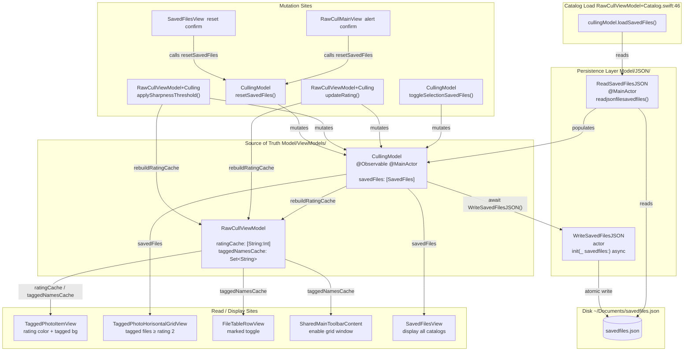

+++
author = "Thomas Evensen"
title = "Saved Files"
date = "2026-04-09"
weight = 1
tags = ["saved files"]
categories = ["technical details"]
mermaid = true
+++

# SavedFiles Architecture

This document describes how `SavedFiles` are created, read, and updated across the RawCull codebase, and where the source of truth lives.

---

## Data Model

```
SavedFiles
├── id: UUID
├── catalog: URL?          — directory path scanned (per-catalog grouping key)
├── dateStart: String?     — timestamp of when cataloging started
└── filerecords: [FileRecord]?
         ├── id: UUID
         ├── fileName: String?    — ARW file name
         ├── dateTagged: String?  — when the file was tagged
         ├── dateCopied: String?  — when the file was copied (unused)
         └── rating: Int?         — 1-5 star, -1 rejected, 0 keeper
```

**Disk location:** `~/Documents/savedfiles.json`

---

## Source of Truth

`CullingModel.savedFiles: [SavedFiles]` is the single in-memory source of truth.
It is an `@Observable @MainActor` property — all reads and mutations happen on the main thread.

`RawCullViewModel` maintains two derived caches rebuilt after every mutation:
- `ratingCache: [String: Int]` — O(1) rating lookups by filename
- `taggedNamesCache: Set<String>` — O(1) tagged-file membership checks

---

## Lifecycle Diagram



---

## Write Operations

Every write passes the full `cullingModel.savedFiles` array to `WriteSavedFilesJSON` (actor, atomic write).

| Trigger | Location | What changes |
|---------|----------|--------------|
| User tags / untags a file | `CullingModel.toggleSelectionSavedFiles()` | Adds or removes a `FileRecord` |
| User rates a file (1-5 / reject) | `RawCullViewModel+Culling.updateRating()` | Updates `FileRecord.rating` |
| User applies sharpness threshold | `RawCullViewModel+Culling.applySharpnessThreshold()` | Bulk-updates ratings below threshold |
| User resets current catalog | `CullingModel.resetSavedFiles()` | Clears `filerecords` for the catalog |
| User confirms reset alert (main view) | `RawCullMainView` (alert) | Calls `resetSavedFiles()` |
| User confirms reset (SavedFilesView) | `SavedFilesView` | Calls `resetSavedFiles()` |

---

## Read Operations

All in-memory reads hit `CullingModel.savedFiles` or the derived caches — no disk I/O after initial load.

| Purpose | Location |
|---------|----------|
| Build rating / tagged caches | `RawCullViewModel.rebuildRatingCache()` |
| Is file tagged? | `CullingModel.isTagged()` |
| Count tagged files | `CullingModel.countSelectedFiles()` |
| Rating color in thumbnail | `TaggedPhotoItemView` |
| Tagged-file grid display | `TaggedPhotoHorisontalGridView` |
| Marked toggle in file table | `FileTableRowView.marktoggle()` |
| Enable grid window button | `SharedMainToolbarContent` |
| Management UI | `SavedFilesView` |

---

## Key Design Notes

- **Per-catalog grouping:** `SavedFiles` is keyed by `catalog: URL`. Each scanned directory gets its own entry; `filerecords` holds only the files for that catalog.
- **Atomic writes:** `WriteSavedFilesJSON` uses the `.atomic` write option to prevent JSON corruption on crash.
- **Cache invalidation:** `ratingCache` and `taggedNamesCache` are always rebuilt immediately after any mutation — there is no deferred or lazy invalidation.
- **Single load point:** `loadSavedFiles()` is called exactly once per catalog selection, in `RawCullViewModel+Catalog.swift:46`, after the file scan completes.

 
