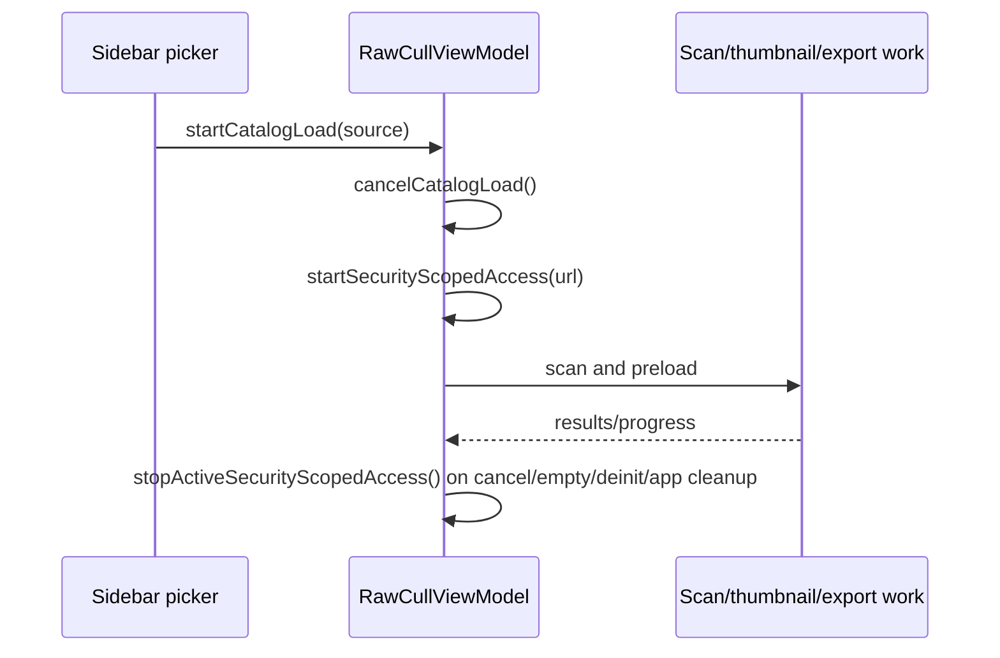
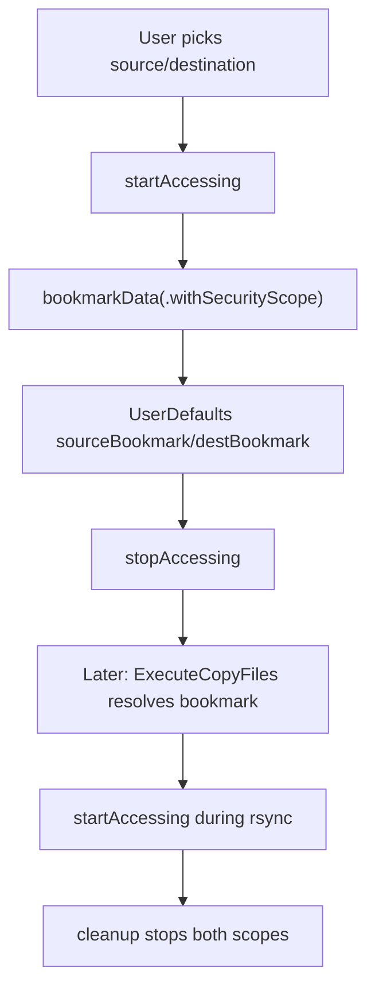

+++
author = "Thomas Evensen"
title = "Security-Scoped URLs"
date = "2026-02-05"
tags = ["security", "sandbox", "bookmarks"]
categories = ["technical details"]
mermaid = true
+++

# Security-Scoped URLs

RawCull is a sandboxed macOS app. Any access outside the app container must come from user consent, usually a file/folder picker. RawCull uses two security-scope patterns:

1. active catalog access for browsing/culling,
2. persistent bookmarks for the rsync copy source and destination.

## Source Map

| Area | Files |
|---|---|
| Active catalog scope | `RawCullViewModel.swift`, `RawCullViewModel+Catalog.swift`, `RawCullApp.swift` |
| Catalog scan scope | `Actors/ScanFiles.swift` |
| Copy-folder bookmarks | `Views/CopyFiles/OpencatalogView.swift`, `SourceAndDestinationSection.swift` |
| rsync runtime scope | `Model/ParametersRsync/ExecuteCopyFiles.swift` |
| File writes needing scope | `ExtractAndSaveJPGs.swift`, `SaveJPGImage.swift`, rsync workflow |

## API Basics

The core calls are:

```swift
let ok = url.startAccessingSecurityScopedResource()
url.stopAccessingSecurityScopedResource()
```

Persistent access is stored as bookmark data:

```swift
let data = try url.bookmarkData(options: .withSecurityScope, ...)
let url = try URL(resolvingBookmarkData: data, options: .withSecurityScope, ...)
```

Every successful `startAccessing...` must eventually be paired with `stopAccessing...`.

## Active Catalog Scope

The catalog browsing flow is owned by `RawCullViewModel`.



`startSecurityScopedAccess(for:)` is idempotent for the currently active URL. If a different catalog is selected, it stops the previous active scope before starting the new one.

`cancelCatalogLoad()` releases the active scope and cancels related work. `RawCullApp.performCleanupTask()` also calls `stopActiveSecurityScopedAccess()` on termination.

## ScanFiles Scope

`ScanFiles.scanFiles(url:onProgress:)` also starts and stops access around directory scanning:

```swift
guard url.startAccessingSecurityScopedResource() else { return [] }
defer { url.stopAccessingSecurityScopedResource() }
```

This is a local defensive scope for the scan actor. The broader catalog scope remains owned by `RawCullViewModel` so later preload/export/zoom work can still access files while the catalog is active.

## Copy Workflow Bookmarks

The copy workflow needs persistent source/destination folders for rsync. `OpencatalogView` creates bookmarks when the user picks folders.



The bookmark keys are:

| Key | Meaning |
|---|---|
| `sourceBookmark` | rsync source folder |
| `destBookmark` | rsync destination folder |

If bookmark resolution fails, `ExecuteCopyFiles` tries the fallback path from the UI.

## rsync Runtime Cleanup

`ExecuteCopyFiles` stores the accessed URLs in:

- `sourceAccessedURL`,
- `destAccessedURL`.

`cleanup()` finishes the progress stream, stops both security-scoped resources, clears process references, and is guarded by `didCleanUp` so multiple termination paths are safe.

`close()` sets `isClosing`, cancels the process, and calls cleanup. Normal process termination waits briefly after `onCompletion` before cleanup so completion code can still use the scoped URLs.

## File Writes

Writes outside the app container require an active user-granted scope. The main examples are:

| Write | Scope source |
|---|---|
| Extracted JPEG sidecars next to RAW files | active catalog scope |
| rsync destination writes | `destBookmark` scope |
| rsync include file | app Documents folder, no external scope required |

App-owned JSON/cache files under Application Support or Caches do not need security-scoped access.

## What To Check When Changing This Area

- Keep one clear owner for each long-lived scope.
- Pair every successful start with a stop on all exit paths.
- Use bookmarks for persistent copy-folder access, not for every temporary catalog scan.
- When adding a new file write, ask whether it targets the app container or a user folder.
- If copy closes early, verify `ExecuteCopyFiles.cleanup()` still runs exactly once.
