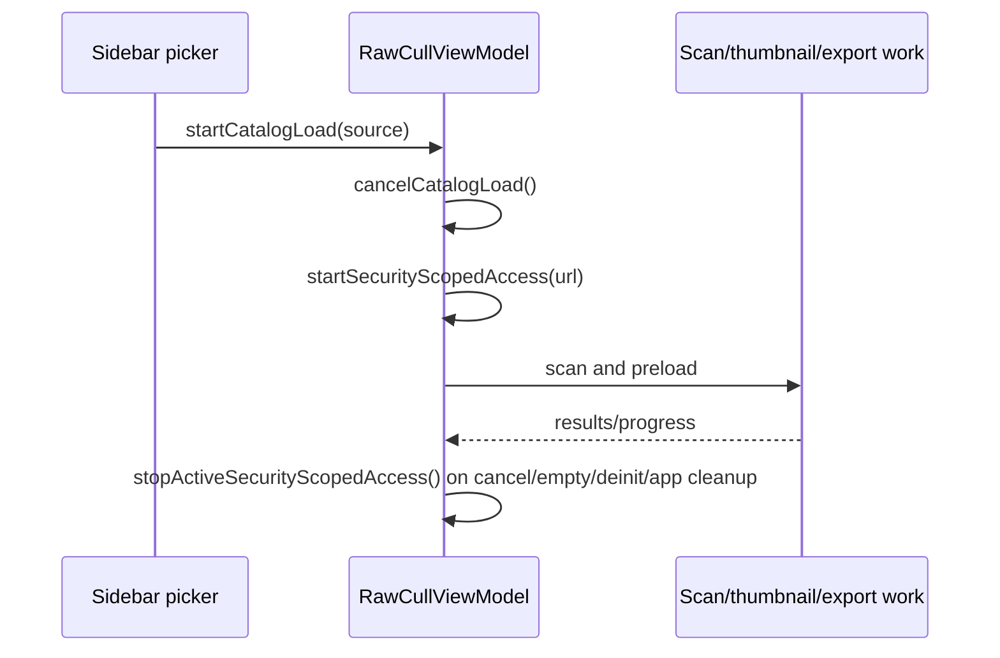
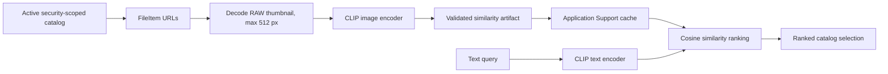
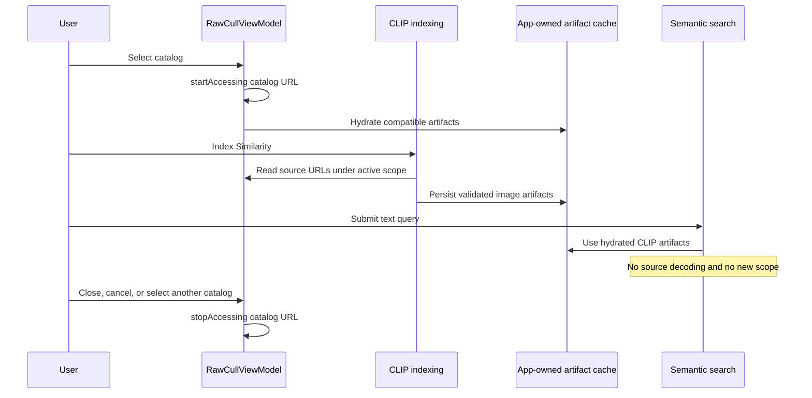
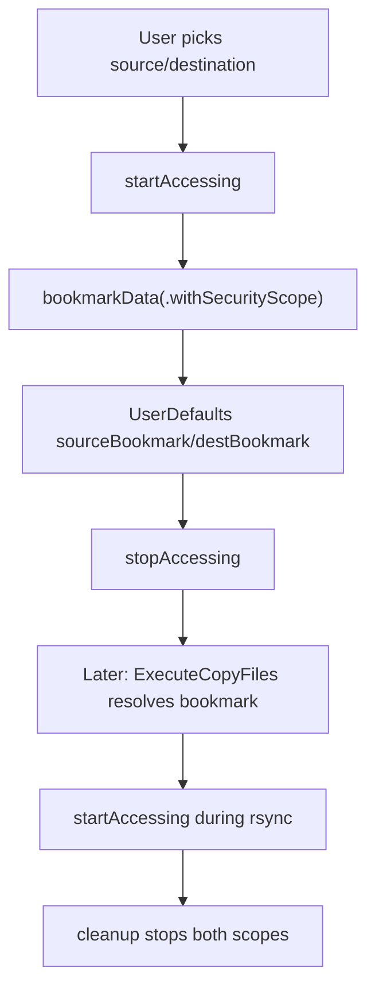

+++
author = "Thomas Evensen"
title = "Security-Scoped URLs"
date = "2026-02-05"
tags = ["security", "sandbox", "bookmarks"]
categories = ["technical details"]
mermaid = true
+++

# Security-Scoped URLs

RawCull is a sandboxed macOS app. Any access outside the app container must come from user consent, usually a file/folder picker. RawCull uses two security-scope patterns:

1. active catalog access for browsing/culling,
2. persistent bookmarks for the rsync copy source and destination.

## Source Map

| Area | Files |
|---|---|
| Active catalog scope | `RawCullViewModel.swift`, `RawCullViewModel+Catalog.swift`, `RawCullApp.swift` |
| Catalog scan scope | `Actors/ScanFiles.swift` |
| CLIP indexing | `RawCullViewModel+Similarity.swift`, `SimilarityScoringModel.swift`, `RawCullVisionSimilarityService.swift` |
| Semantic search | `RawCullViewModel+Similarity.swift`, `SimilarityScoringModel.swift`, `RawCullSemanticSearchService.swift` |
| Similarity artifact cache | `Actors/PerFileAnalysisArtifactStore.swift` |
| Copy-folder bookmarks | `Views/CopyFiles/OpencatalogView.swift`, `SourceAndDestinationSection.swift` |
| rsync runtime scope | `Model/ParametersRsync/ExecuteCopyFiles.swift` |
| Selected JPG export | `ExtractJPGsSheetView.swift`, `RawCullViewModel+Thumbnails.swift`, `ExtractAndSaveJPGs.swift`, `SaveJPGImage.swift` |
| App termination | `Main/RawCullApp.swift`, `CullingModel.swift` |
| RAW diagnostics | `RawCullViewModel+Diagnostics.swift`, `RawFileDiagnostics.swift` |

## API Basics

The core calls are:

```swift
let ok = url.startAccessingSecurityScopedResource()
url.stopAccessingSecurityScopedResource()
```

Persistent access is stored as bookmark data:

```swift
let data = try url.bookmarkData(options: .withSecurityScope, ...)
let url = try URL(resolvingBookmarkData: data, options: .withSecurityScope, ...)
```

Every successful `startAccessing...` must eventually be paired with `stopAccessing...`.

## Active Catalog Scope

The catalog browsing flow is owned by `RawCullViewModel`.



`startSecurityScopedAccess(for:)` is idempotent for the currently active URL. If a different catalog is selected, it stops the previous active scope before starting the new one.

`cancelCatalogLoad()` releases the active scope and cancels related work. An empty scan also releases it. `RawCullViewModel.deinit` is the final defensive release.

Catalog changes are persistence boundaries: `startCatalogLoad(for:)` waits for `CullingModel.flushPersistence()` before it cancels the old catalog and its scope. If the flush fails, RawCull restores the previous selection and keeps the old catalog active.

## ScanFiles Scope

`ScanFiles.scanFiles(url:onProgress:)` also starts and stops access around directory scanning:

```swift
let didStartSecurityScope = url.startAccessingSecurityScopedResource()
defer {
    if didStartSecurityScope {
        url.stopAccessingSecurityScopedResource()
    }
}
```

This is a local defensive scope for the scan actor. It stops only when its own start succeeded. The broader catalog scope remains owned by `RawCullViewModel` so later preload, diagnostics, export, zoom, and AI work can still access files while the catalog is active.

## Scope Ownership Matrix

The owner is the component that records a successful start and is therefore responsible for the matching stop. A borrower may use URLs covered by a longer-lived owner, but must not stop that owner's scope.

| Operation | Scope owner | Start | Stop | Failure and cancellation cleanup |
|---|---|---|---|---|
| Active catalog | `RawCullViewModel` | `startSecurityScopedAccess(for:)` before catalog work | Catalog cancel/change, empty scan, successful app termination, or deinit | A failed start is not recorded. Switching first flushes culling persistence; a failed flush retains the old catalog and scope. |
| Directory scan | `ScanFiles.scanFiles` | Local `startAccessingSecurityScopedResource()` | `defer`, but only when the local start returned `true` | `defer` covers success, thrown filesystem errors, cancellation, and early return. The view model's broader scope is not stopped. |
| Selected JPG export | `RawCullViewModel.startSelectedJPGExtraction` | Start the chosen destination immediately before creating `ExtractAndSaveJPGs` | On return from `extractAndSavejpgs()`, before publishing completion or failure UI | Failed destination start aborts without a stop. Per-file failures are collected; the operation-level stop still runs after the actor returns. Source reads borrow the active catalog scope. |
| rsync copy | `ExecuteCopyFiles` | Resolve and start source, then destination, from bookmarks or fallback paths | Idempotent `cleanup()` after normal completion, close/cancel, startup failure, launch failure, or deinit | If destination setup fails, cleanup stops the already-started source. `didCleanUp` prevents double stops and duplicate include-file removal. |
| RAW diagnostics | Active catalog (`RawCullViewModel`) | No additional start; the command is available for a `FileItem` in the active catalog | No additional stop | Cancelling or replacing `rawDiagnosticsTask` only cancels diagnostic work. Catalog teardown owns scope cleanup. |
| AI indexing | Active catalog (`RawCullViewModel`) | No per-file start; indexing borrows the selected directory scope | No per-file stop | Index cancellation stops AI work, not the catalog scope. Catalog cancellation/change releases the owner scope after cancelling related work. |
| Semantic query | None for ranking; active catalog remains open for follow-on actions | No start; ranking reads hydrated in-memory artifacts | No stop | Query cancellation discards query work. Any subsequent preview/export uses the appropriate catalog or export scope. |

## CLIP Indexing and Semantic Search

CLIP indexing and semantic search use the active catalog scope differently. Indexing reads source images, while a search query operates on cached embeddings.



### CLIP indexing requires the catalog scope

`RawCullViewModel.indexSimilarity()` first hydrates reusable artifacts and then asks `SimilarityScoringModel.indexFiles(_:)` to generate any missing or stale artifacts. Each `FileItem` becomes an `AIImageSource` containing the file URL.

For an artifact that must be generated, `RawCullSimilarityImageDecoder` reads the source URL. It first asks `RawParserKitImageLoader` for a thumbnail with a maximum dimension of 512 pixels and then tries ImageIO as a fallback. Because these URLs point into the user-selected catalog, decoding depends on the catalog directory's security-scoped access still being active.

RawCull does not call `startAccessingSecurityScopedResource()` for every image. Access was already started for the selected directory by `RawCullViewModel`, and that scope covers its files. The view model deliberately keeps the directory scope open after the initial scan so indexing, thumbnail generation, previews, exports, and other catalog operations can read the same URLs.

The decoded image is passed to the selected local similarity backend. When the selected backend is CLIP, PhotoAIKit creates a normalized image embedding. Semantic-search coverage can only be populated when the active similarity backend produces artifacts compatible with the selected CLIP semantic-search backend. If Vision similarity is selected, the UI asks the user to enable **Use selected CLIP model for similarity** before building missing semantic-search artifacts.

Successfully validated artifacts are written one file at a time to:

```text
~/Library/Application Support/RawCull/AnalysisArtifacts/Similarity/
```

In the sandbox, that resolves inside RawCull's container. It is app-owned storage and does not need a security-scoped URL. Cache records are keyed and validated against the source fingerprint, artifact schema, model/backend descriptor, and RawCull's embedding pipeline signature. A moved, renamed, changed, incompatible, or corrupt source is therefore treated as a cache miss and must be indexed again while the catalog scope is active.

### Semantic search reuses cached CLIP artifacts

Opening a catalog hydrates compatible artifacts from the app-owned cache into `semanticArtifacts`. A semantic query then:

1. applies the ordinary catalog admission rules, such as filename and rating filters,
2. keeps only files with an artifact compatible with the currently selected CLIP backend,
3. encodes the literal text query with the local CLIP text encoder,
4. computes cosine similarity between that temporary text embedding and the cached image embeddings,
5. sorts the matches and exposes the selected highest-ranked files as the active catalog working set.

`searchSemantically(for:)` and `rankSemantically(query:files:)` do not decode RAW files, generate image embeddings, or read image contents from the catalog. The text-query embedding exists only for that search call and is not persisted. Consequently, semantic ranking itself does not acquire a new security scope; it uses in-memory artifacts that were restored or created earlier.

The catalog scope nevertheless remains active during semantic search. Ranked files can immediately flow into preview, zoom, export, culling, burst, or Deep Review operations that do need their source URLs. Clearing a search changes the working set, not the security-scope owner or lifetime.

### Scope lifetime for the AI workflow



## Copy Workflow Bookmarks

The copy workflow needs persistent source/destination folders for rsync. `OpencatalogView` creates bookmarks when the user picks folders.



The bookmark keys are:

| Key | Meaning |
|---|---|
| `sourceBookmark` | rsync source folder |
| `destBookmark` | rsync destination folder |

If bookmark resolution fails, `ExecuteCopyFiles` tries the fallback path from the UI.

The fallback follows the same ownership rule as a resolved bookmark: only a URL whose `startAccessingSecurityScopedResource()` succeeds is returned and stored. A failed bookmark start does not create ownership; if the fallback also fails, startup aborts. If source access succeeds but destination access fails, `cleanup()` releases the source before returning the startup error.

## rsync Runtime Cleanup

`ExecuteCopyFiles` stores the accessed URLs in:

- `sourceAccessedURL`,
- `destAccessedURL`.

`cleanup()` finishes the progress stream, stops both security-scoped resources, clears process references, and is guarded by `didCleanUp` so multiple termination paths are safe.

`close()` sets `isClosing`, cancels the process, and calls cleanup. Normal process termination waits briefly after `onCompletion` before cleanup so completion code can still use the scoped URLs.

The include list is written under `Application Support/RawCull/CopyLists`, not the user-selected source or destination. Cleanup removes the per-operation list on every path after it has been created.

## Selected JPG Export Destination

The export sheet can use an existing catalog or a folder returned by its **Choose...** file importer. `extractJPGDestination` remembers that choice for the lifetime of the `RawCullViewModel`; it is not a persistent rsync-style bookmark.

Pressing **Extract** starts a separate security scope for the destination immediately before `ExtractAndSaveJPGs` begins. The scope remains active for the entire batch, including detached atomic writes performed by `SaveJPGImage`, and is stopped when `extractAndSavejpgs()` returns. The active source catalog scope remains a different ownership unit and covers RAW/JPEG reads. If source and destination happen to be the same URL, each successful start still belongs to its own operation and must receive its own stop.

Destination access failure prevents actor creation and presents **Export Not Started**. Individual extraction or write failures do not shorten the destination lifetime: the actor returns an aggregate result, the view model stops the destination scope, and then it presents **Export Incomplete** if needed.

## App Termination And Persistence

`AppDelegate.applicationShouldTerminate(_:)` returns `.terminateLater` and starts one termination task. That task awaits `cullingModel.flushPersistence()` before releasing the active catalog scope. A second termination request while the task is running also returns `.terminateLater` rather than starting another flush.

If persistence succeeds, the app stops the active catalog scope and replies `true` to AppKit. If persistence fails, it deliberately keeps both the app and scope alive and replies `false`; this avoids terminating after an unsaved culling-state failure. This termination path owns only the active catalog scope. Export and rsync operations retain their own completion, close, and deinit cleanup.

## File Writes

Writes outside the app container require an active user-granted scope. The main examples are:

| Write | Scope source |
|---|---|
| Extracted JPEG sidecars next to RAW files | active catalog scope |
| Selected JPG export folder | operation-owned destination scope |
| rsync destination writes | `destBookmark` scope |
| rsync include file | app Application Support folder, no external scope required |

App-owned JSON/cache files under Application Support or Caches do not need security-scoped access.

## What To Check When Changing This Area

- Keep one clear owner for each long-lived scope.
- Pair every successful start with a stop on all exit paths.
- Keep catalog switching and app termination behind a successful culling-state persistence flush.
- Keep the selected JPG destination scope open until the whole export actor returns; do not stop it after scheduling detached writes.
- Keep the active catalog scope alive for CLIP indexing and for operations launched from semantic-search results.
- Do not add per-file security-scope calls inside the CLIP indexer; the selected catalog directory owns that access.
- Keep semantic ranking cache-only. If it begins decoding source images, its security assumptions and UI behavior must be revisited.
- Store similarity artifacts and query-independent embeddings in app-owned storage, not beside the RAW files.
- Use bookmarks for persistent copy-folder access, not for every temporary catalog scan.
- When adding a new file write, ask whether it targets the app container or a user folder.
- If copy closes early, verify `ExecuteCopyFiles.cleanup()` still runs exactly once.
- Test partial rsync startup (source succeeds, destination fails) and partial JPG export failures as ownership cases, not only as UI errors.
