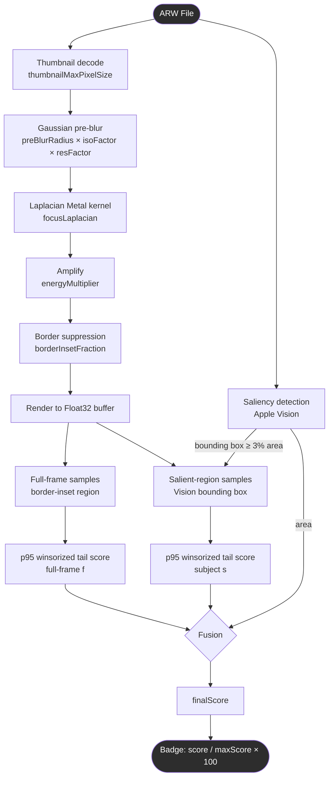
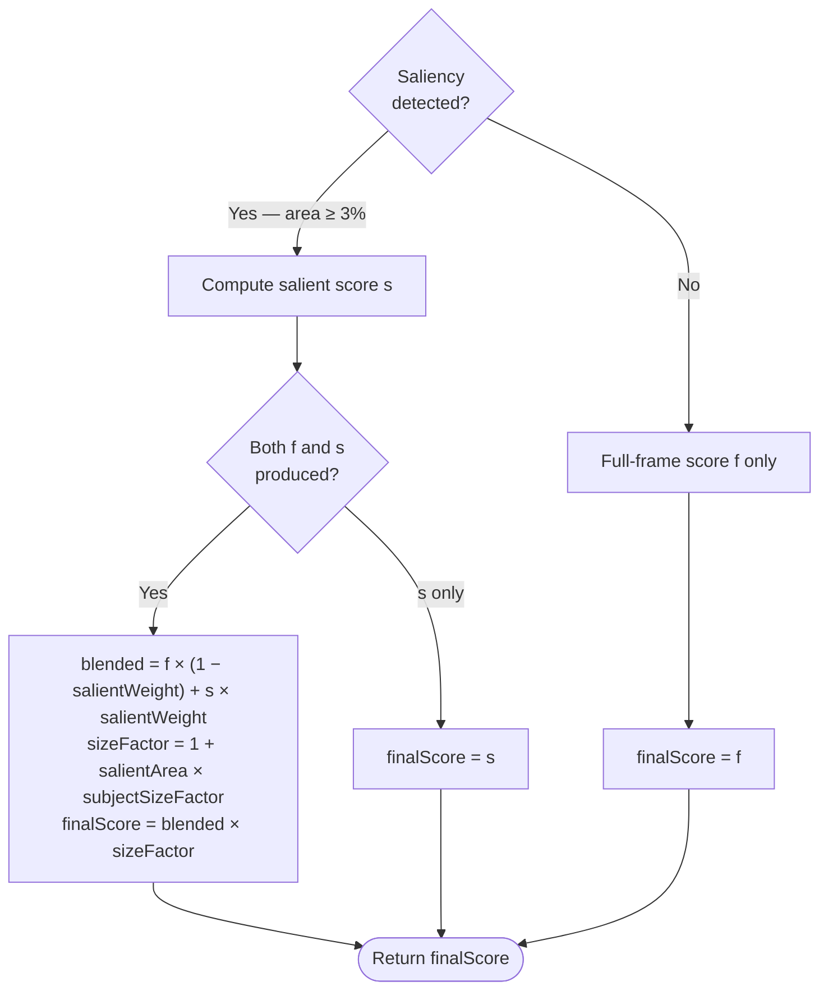
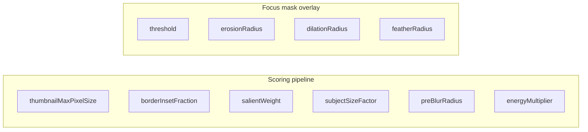

+++
author = "Thomas Evensen"
title = "Sharpness Scoring"
date = "2026-03-25"
weight = 1
tags = ["sharpness"]
categories = ["technical details"]
mermaid = true
+++

# Updated Sharpness Scoring in RawCull

This document describes how RawCull computes sharpness scores, what each parameter does, and a boundary-value test procedure for validating parameter behaviour. This applies to version 1.3.7 of RawCull

---

## How the Scoring Pipeline Works



Each ARW file goes through the following stages in detail:

### 1. Thumbnail decode
ImageIO extracts the embedded JPEG thumbnail at the requested pixel size (`thumbnailMaxPixelSize`). If no embedded thumbnail is available, the full RAW is decoded instead. The thumbnail is the only input to the scoring pipeline — the full 61 MP RAW pixel data is never read for scoring.

### 2. Saliency detection
Apple Vision (`VNGenerateAttentionBasedSaliencyImageRequest`) analyses the thumbnail and returns the bounding boxes of visually salient objects. The boxes are unioned into a single region. If the union area is less than 3% of the frame, or if Vision finds nothing, saliency is discarded and only the full-frame path is used. This step runs in parallel with the image decode.

### 3. Gaussian pre-blur
A Gaussian blur is applied before the Laplacian. This is critical: without pre-blur, noise pixels generate false Laplacian responses and inflate scores on out-of-focus images. The effective blur radius is:

```
effectiveRadius = preBlurRadius × isoFactor × resFactor

isoFactor = clamp(sqrt(ISO / 400),             1.0, 3.0)
resFactor = clamp(sqrt(max(imageWidth, 512) / 512), 1.0, 3.0)
```

At ISO 400 both factors are 1.0. At ISO 6400 `isoFactor ≈ 4.0` (capped at 3.0), so the blur automatically increases to suppress noise before the edge detector fires.

### 4. Laplacian (Metal kernel)
A Laplacian-of-Gaussian edge magnitude is computed via the `focusLaplacian` Metal kernel. This measures the second derivative of luminance — the response is high where focus is sharp and near zero where the image is blurred. The output is amplified by `energyMultiplier`.

### 5. Border suppression
The outer `borderInsetFraction` of pixels on each edge is zeroed out (replaced with black) before any scoring or thresholding. This prevents the Gaussian pre-blur from generating an artificial sharp step at the image boundary that would otherwise appear as a bright rectangle in the focus mask and inflate scores.

### 6. Pixel sampling
The amplified Laplacian is rendered to a Float32 buffer. Two sample sets are collected:

- **Full-frame samples**: all pixels inside the border-inset region.
- **Salient-region samples**: pixels within the Vision bounding box, if available and containing at least 256 pixels.

### 7. Robust tail score (p95 winsorized mean)
Each sample set is scored independently:

1. Find the 95th-percentile value (p95) — the threshold above which only the sharpest pixels sit.
2. Find the 99.5th-percentile value (p99.5) — used as an upper clip to reduce the influence of extreme outliers.
3. Return the mean of all values ≥ p95, clipped at p99.5.

This produces a score that reflects the sharpest 5% of pixels rather than average image sharpness, which is a better predictor of perceived in-focus quality.

### 8. Score fusion



### 9. Badge display
The badge shown on each thumbnail is `score / maxScore × 100`, normalised to the highest score in the current catalog. All comparisons are therefore relative within a session, not absolute.

---

## Parameters

### Where each parameter applies



`borderInsetFraction`, `preBlurRadius`, and `energyMultiplier` affect **both** scoring and the focus mask overlay. Changes made in the zoom view's Focus Mask Controls panel are immediately reflected in the next score run.

---

### Scoring Resolution — `thumbnailMaxPixelSize`

| Setting | Value |
|---------|-------|
| Fast    | 512 px |
| Medium  | 768 px |
| Accurate | 1024 px |
| Default | 512 px |

The pixel size of the thumbnail decoded for scoring. A larger thumbnail contains finer spatial detail, which improves score accuracy — especially at high ISO where noise patterns can obscure real edges at 512 px. Each step roughly doubles decode and pipeline time.

Applies to: scoring only (the focus mask overlay always uses the full displayed image).

---

### Border Inset — `borderInsetFraction`

| Bound | Value | Effect |
|-------|-------|--------|
| Min | 0% | No border exclusion; Gaussian edge artefacts visible in mask and inflate scores |
| Default | 4% | Removes the typical blur-boundary band |
| Max | 10% | Removes a wide margin; subjects near the frame edge may be partially excluded |

The fraction of the image dimension excluded from each of the four edges. Prevents the Gaussian pre-blur from creating an artificial bright rectangle at the image boundary in both the focus mask and the score.

Applies to: scoring and focus mask overlay.

---

### Subject Weight — `salientWeight`

| Bound | Value | Effect |
|-------|-------|--------|
| Min | 0.0 | Entire score is the full-frame tail score; subject sharpness is ignored |
| Default | 0.75 | Subject region contributes 75%, full frame 25% |
| Max | 1.0 | Entire score is the salient-region score; if saliency fails, falls back to full-frame |

Controls how much the Vision-detected subject region drives the score versus the full frame. At 0.0, background texture (grass, foliage) dominates and scores cluster regardless of subject focus. At 1.0, background is entirely ignored.

Applies to: scoring only.

---

### Subject Size Bonus — `subjectSizeFactor`

| Bound | Value | Effect |
|-------|-------|--------|
| Min | 0.0 | No size bonus; equal focus quality scores identically regardless of subject distance |
| Default | 1.5 | Subject at 20% frame area → ×1.30 multiplier; 5% frame area → ×1.075 |
| Max | 3.0 | Subject at 20% frame area → ×1.60 multiplier; strong preference for close subjects |

Multiplies the fused score by `1 + salientArea × subjectSizeFactor`. Gives a proportional bonus to images where the subject fills more of the frame — closer subjects score higher than equally-sharp distant ones.

Applies to: scoring only. Has no effect if saliency detection finds nothing (salientArea = 0).

---

### Pre-blur Radius — `preBlurRadius`

| Bound | Value | Effect |
|-------|-------|--------|
| Min | 0.3 | Almost no blur; Laplacian fires on noise pixels as well as real edges |
| Default | 1.92 | Balanced noise suppression at ISO 400 |
| Max | 4.0 | Heavy blur; only very strong edges survive |

Base Gaussian blur radius applied before the Laplacian, automatically scaled upward at higher ISO and larger images. This is the single most influential parameter for whether noise or real sharpness drives the score.

Accessible via: Focus Mask Controls (zoom view) and Scoring Parameters sheet. Applies to: scoring and focus mask overlay.

---

### Amplify — `energyMultiplier`

| Bound | Value | Effect |
|-------|-------|--------|
| Min | 1.0 | No amplification; raw Laplacian values are very small |
| Default | 7.62 | Set automatically by calibration |
| Max | 20.0 | Strong amplification; subtle sharpness differences become large score gaps |

Multiplies the Laplacian output before scoring and thresholding. The calibration step (`Re-score`) automatically adjusts this so the p95 of the burst lands at 0.50 — manual adjustment is rarely needed.

Accessible via: Focus Mask Controls (zoom view). Applies to: scoring and focus mask overlay.

---

### Threshold, Erosion, Dilation, Feather Radius

These four parameters affect only the **focus mask visual overlay** in the zoom view. They have no effect on sharpness scores.

Accessible via: Focus Mask Controls (zoom view).

---

## Test Procedure

The goal is to confirm that each parameter produces the expected behaviour at its boundary values. Use a burst of 20–30 frames containing a clear subject (bird, animal) at varying distances and focus accuracy.

**Before each test:**
1. Open the catalog, press **Re-score** to establish a calibrated baseline.
2. Note which images score highest and lowest and what the score spread is.
3. Adjust one parameter at a time, press **Re-score** after each change, and compare against the baseline.

---

### Test 1 — Scoring Resolution

| Step | Setting | Expected result |
|------|---------|-----------------|
| 1a | 512 px | Baseline. At ISO 6400+, some noise-driven variation expected |
| 1b | 1024 px | Scores more stable; high-ISO images show less noise influence. Scoring takes ~3–4× longer |
| 1c | 512 px | Scores return to baseline behaviour |

**Pass criteria:** 1024 px produces smaller score gaps between frames that differ only in noise, and larger score gaps between frames that differ in actual focus quality.

---

### Test 2 — Border Inset

| Step | Setting | Expected result |
|------|---------|-----------------|
| 2a | 0% | Focus mask shows a bright rectangle around the full image border |
| 2b | 4% | Border rectangle is absent from mask; scores slightly lower for images where background edges reached the frame edge |
| 2c | 10% | Border completely clean; verify subjects near the frame edge are not partially excluded by inspecting the focus mask |

**Pass criteria:** At 0% the mask shows an obvious border artefact. At 4% and 10% it is absent. Subject detail in the centre of the frame is unaffected at all three values.

---

### Test 3 — Subject Weight

| Step | Setting | Expected result |
|------|---------|-----------------|
| 3a | 0.0 | Scores driven by full-frame background texture; frames with sharp foliage score high even if the subject is soft; score spread is narrow |
| 3b | 0.75 | Subject sharpness dominates; clearly in-focus frames rank above soft frames |
| 3c | 1.0 | Score is entirely the salient-region score; any frame with no detected subject must fall back gracefully to a non-zero score |

**Pass criteria:** At 0.0 scores cluster in a narrow band. At 0.75 and 1.0 there is clear separation between in-focus and soft frames. At 1.0 frames with no Vision detection produce a non-zero score (full-frame fallback).

---

### Test 4 — Subject Size Bonus

| Step | Setting | Expected result |
|------|---------|-----------------|
| 4a | 0.0 | Close and distant frames with equivalent focus quality score similarly |
| 4b | 1.5 | The closest frame (largest subject) scores noticeably higher than the most distant frame even at similar focus quality |
| 4c | 3.0 | Size bonus is strong; rank order correlates with subject size; verify a perfectly sharp distant frame does not rank above a clearly soft close frame |

**Pass criteria:** At 0.0 rank order is determined by focus quality alone. At 1.5 and 3.0 close subjects score higher. At 3.0 the bonus should not cause obviously soft large-subject frames to outrank sharp small-subject frames.

---

### Test 5 — Pre-blur Radius

| Step | Setting | Expected result |
|------|---------|-----------------|
| 5a | 0.3 | At high ISO, noise-dominated images score artificially high; focus mask shows noise grain highlighted as "sharp" |
| 5b | 1.92 | Balanced; noise suppressed, real edges preserved |
| 5c | 4.0 | Only very strong contrast edges highlighted; soft-but-textured backgrounds show little or no mask; score spread may narrow |

**Pass criteria:** At 0.3 with high-ISO files the focus mask shows widespread highlighting that does not correspond to genuine sharp edges. At 1.92 and above it is clean. At 4.0 the sharpest in-focus frame still scores highest.

---

### Test 6 — Amplify (Energy Multiplier)

| Step | Setting | Expected result |
|------|---------|-----------------|
| 6a | 1.0 | Raw Laplacian values are tiny; most badges show low scores; little spread between frames |
| 6b | 7.62 (calibrated) | Good spread; badge scores use the full 0–100 range relative to the sharpest frame |
| 6c | 20.0 | Signal saturates; many frames score similarly near the top; focus mask nearly fully lit on any textured region |

**Pass criteria:** At 1.0 all scores are very low and compressed. At 20.0 scores are saturated and compressed at the top. At the calibrated default there is clear separation. Note: `Re-score` resets this to the calibrated value automatically.

---

### Combined Boundary Test

To confirm parameters do not interact unexpectedly at extremes:


**Minimum values:** thumbnailMaxPixelSize=512, borderInsetFraction=0%, salientWeight=0.0, subjectSizeFactor=0.0, preBlurRadius=0.3, energyMultiplier=1.0

**Maximum values:** thumbnailMaxPixelSize=1024, borderInsetFraction=10%, salientWeight=1.0, subjectSizeFactor=3.0, preBlurRadius=4.0, energyMultiplier=20.0


