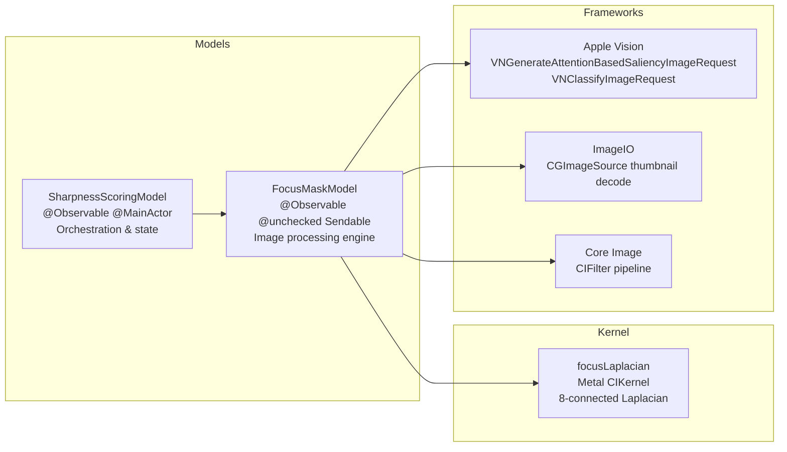
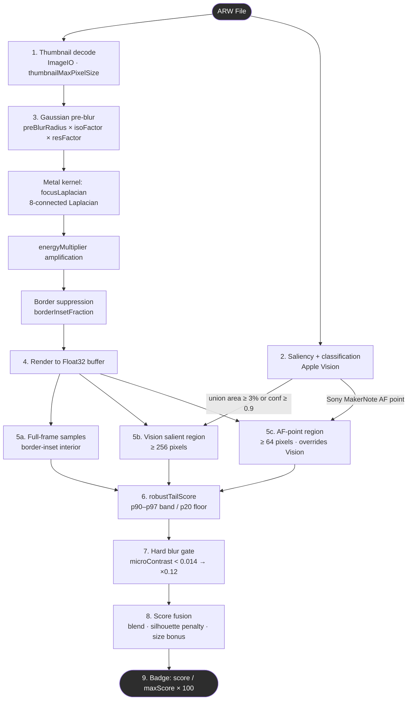
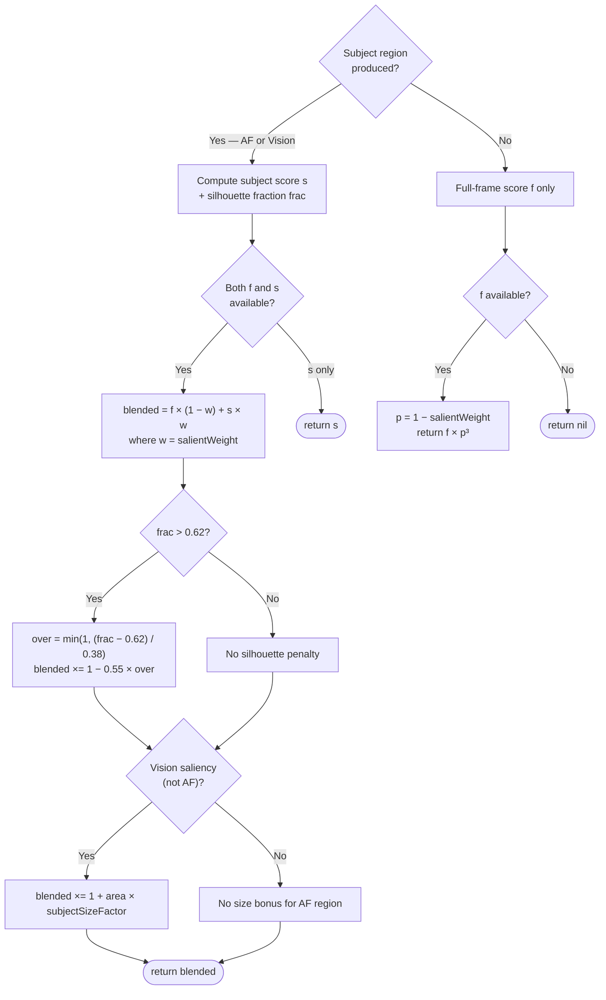
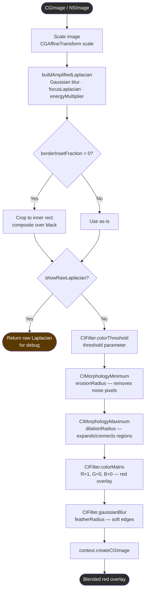
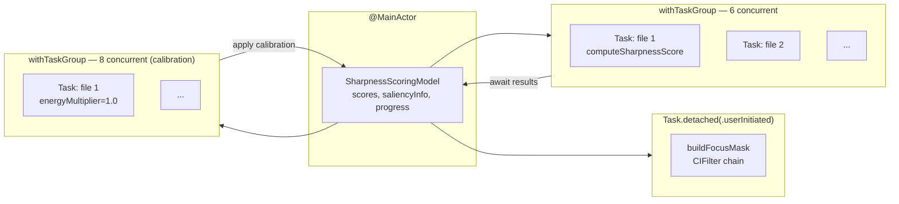
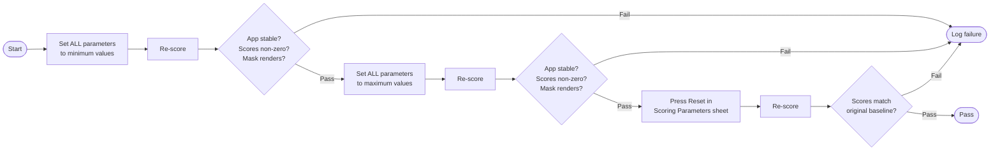

+++
author = "Thomas Evensen"
title = "Sharpness Scoring and Focus Mask"
date = "2026-04-11"
weight = 1
tags = ["sharpness"]
categories = ["technical details"]
mermaid = true
+++

# Sharpness Scoring and Focus Mask

This document describes how RawCull computes sharpness scores, generates focus mask overlays, what every parameter does, and the test procedure for validating parameter behaviour.

---

## Architecture Overview

Two `@Observable` model classes collaborate with a single Metal compute kernel:



**`SharpnessScoringModel`** (`SharpnessScoringModel.swift`) holds all observable state visible to the UI: scores, progress counters, sort/filter toggles, and calibration flags. All public methods run on `@MainActor`.

**`FocusMaskModel`** (`FocusMaskModel.swift`) owns the `CIContext` and all image-processing logic. Most methods are `nonisolated` so they can run inside `Task.detached` without hopping to the main actor.

---

## Scoring Pipeline

Each ARW file passes through nine stages. Thumbnail decode and saliency detection run in parallel — saliency results are available when needed in the sampling stage.



### 1. Thumbnail decode

`ImageIO` extracts the embedded JPEG thumbnail at the requested pixel size (`thumbnailMaxPixelSize`, default 512 px). `kCGImageSourceCreateThumbnailWithTransform: true` applies the EXIF orientation so the image is always right-side up before processing. If no embedded thumbnail is available, the full RAW is decoded with `kCGImageSourceShouldAllowFloat: true`. The full 61 MP pixel data is never read during scoring.

### 2. Saliency detection and subject classification

Vision analyses the thumbnail in parallel with the decode. Two requests are submitted together:

- **`VNGenerateAttentionBasedSaliencyImageRequest`** — finds visually salient objects and returns their bounding boxes. All boxes are unioned into a single `CGRect`.
- **`VNClassifyImageRequest`** — classifies the overall image content (only when `enableSubjectClassification` is `true`).

The union region is discarded if its area is less than 3% of the frame **and** the maximum salient-object confidence is below 0.9. This prevents single low-confidence pixel clusters from driving the subject score.

Subject classification filters observations with two passes:

| Pass | Confidence threshold | Criteria | Examples |
|------|---------------------|----------|---------|
| 1 | ≥ 0.06 | Label contains a subject keyword | "bird", "raptor", "fox", "wolf", "person", "face", "insect" … |
| 2 | ≥ 0.15 | Label does not contain an environment token | Passes if not "landscape", "sky", "plant", "texture", "structure" … |

Pass 1 always takes priority. The first matching label is returned as the `SaliencyInfo.subjectLabel` string; it appears as the subject badge in the UI and as the saliency-category filter value.

### 3. Amplified Laplacian

Three sub-steps build the amplified edge map:

**Gaussian pre-blur.** Applied before the Laplacian to suppress noise. Without blur, noise pixels generate false Laplacian responses that inflate scores on out-of-focus images. The effective radius adapts to both ISO and image resolution:

```
isoFactor = clamp(sqrt(ISO / 400),              1.0, 3.0)
resFactor = clamp(sqrt(max(imageWidth, 512) / 512), 1.0, 3.0)
effectiveRadius = min(preBlurRadius × isoFactor × resFactor, 100.0)
```

At ISO 400 on a 512 px thumbnail both factors are 1.0. At ISO 6400 `isoFactor ≈ 4.0` (capped at 3.0); on a 2048 px image `resFactor ≈ 2.0`, so blur scales up in proportion.

**`focusLaplacian` Metal kernel.** Measures the second spatial derivative of luminance via an 8-connected discrete Laplacian (see [Metal Kernel](#metal-kernel--focuslaplacian) below). The response is high where the image is sharp and near zero where it is blurred.

**`energyMultiplier` amplification.** The Laplacian output is multiplied channel-by-channel via `CIFilter.colorMatrix()`. Raw Laplacian values are very small; this amplification brings typical scores into a useful numeric range. Calibration sets this automatically.

**Border suppression.** The outer `borderInsetFraction` of pixels on each edge is zeroed before scoring and thresholding. This prevents the Gaussian pre-blur from generating an artificial sharp step at the image boundary (a bright rectangle artefact in the focus mask that would also inflate scores).

### 4. Render to Float32 buffer

The amplified Laplacian is rendered into a flat `[Float]` array (RGBA, 16 bytes/pixel) using `CIContext.render(_:toBitmap:rowBytes:bounds:format:colorSpace:)` with format `.RGBAf`. Only the red channel is used — because the Laplacian output is greyscale (R = G = B = energy), red carries the full signal.

### 5. Region sampling

Three independent sample sets are collected from the Float32 buffer:

**5a. Full-frame samples.** All finite pixels within the border-inset interior (`borderCols … width − borderCols`, `borderRows … height − borderRows`).

**5b. Vision salient region.** The bounding box returned by saliency detection is mapped from Vision's coordinate system (y = 0 at visual bottom) to the buffer's coordinate system (row 0 at visual top) by inverting the y-axis:

```
rowStart = (1.0 − region.maxY) × height
rowEnd   = (1.0 − region.minY) × height
```

Requires ≥ 256 sample pixels to compute a score; otherwise discarded.

**5c. AF-point region.** When a Sony MakerNote AF centre point is available (`FileItem.afFocusNormalized`, a `CGPoint` normalised to 0–1 origin top-left), a square region centred on that point is created:

```
r = afRegionRadius                  // fraction of image dimension
visionY = 1.0 − pt.y               // flip to Vision y-axis for analyzeRegion
region = CGRect(x: pt.x − r, y: visionY − r, width: r×2, height: r×2)
         .intersection(CGRect(0, 0, 1, 1))   // clamp to image bounds
```

Requires ≥ 64 sample pixels. **When an AF-point region is produced it replaces the Vision salient region** in all subsequent scoring steps.

Each region also computes a **silhouette fraction** in a single pass over its pixels:

```
b = 12% of min(regionWidth, regionHeight)    // border zone thickness
borderFraction = borderMean / (borderMean + innerMean)
```

A high `borderFraction` means Laplacian energy is concentrated at the region boundary rather than the interior — the signature of a silhouette or out-of-focus halo.

### 6. Robust tail score

Each sample set is scored identically with `robustTailScore`:

```
p20 = 20th-percentile value  (noise floor)
p90 = 90th-percentile value  (band start)
p97 = 97th-percentile value  (band end)

if p97 ≤ p90:
    return max(0, p90 − p20)

bandMean      = mean of (v − p20) for all v in [p90, p97]
densityFactor = min(1.0, (count / n) / 0.06)
return bandMean × densityFactor
```

The algorithm scores the **p90–p97 edge band** relative to the p20 noise floor rather than an absolute p95 percentile. The `densityFactor` term applies a **sparse-edge penalty**: if fewer than 6% of pixels fall in the band (i.e., the image has very few edges), the score is scaled down proportionally. Out-of-focus images pass the noise floor check but fail the density check and score low.

Percentiles are computed with an in-place quickselect (average O(n)) rather than a sort, so large Float buffers are processed efficiently.

### 7. Hard blur gate

Before fusion, the subject region's **micro-contrast** (standard deviation of its Laplacian samples) is checked:

```swift
func microContrast(_ samples: [Float]) -> Float {
    // = sqrt(E[x²] − E[x]²)  i.e. standard deviation
}
```

If `microContrast < 0.014` and the region has at least 64 samples, the score is hard-clamped:

```
return max(0.01, effectiveSubjectScore × 0.12)
```

This gate catches images where the Laplacian fires on noise or film grain even though the subject has no real edge detail — a common failure mode at very high ISO or with strong defocus. The 0.12 multiplier reduces the score to roughly one-eighth rather than zeroing it, preserving relative ordering within a burst.

### 8. Score fusion



Key decisions:

- **Silhouette penalty.** When the subject region's `borderFraction` exceeds 0.62 the blend is reduced by up to 55%. At `frac = 1.0` (pure silhouette) the penalty is `−0.55`, i.e. the score is halved. The 0.38 denominator normalises the excess over the 0.62 trigger.
- **Subject-size bonus.** Applied only when the subject came from Vision saliency (not an AF-point region). `blended ×= 1 + area × subjectSizeFactor`. Closer subjects fill more of the frame and receive a proportionally higher score for equivalent sharpness.
- **Fallback with cubic penalty.** When saliency detection finds nothing, only the full-frame score is used — but it is raised to the power of `(1 − salientWeight)³`. At the default `salientWeight = 0.75`, `p = 0.25` and `p³ = 0.0156`, so the score is aggressively reduced. This discourages background-sharp / subject-soft images from ranking high.

### 9. Badge display

The badge shown on each thumbnail is:

```
badge = score / maxScore × 100
```

`maxScore` is the **90th percentile** of all scores in the current catalog (`scores.values` sorted, index `0.90 × (count − 1)`). For catalogs with fewer than ten scored images the raw maximum is used instead. All comparisons are relative within a session, not absolute.

---

## Focus Mask Pipeline

The focus mask overlay is generated on demand in the zoom view. It shares `buildAmplifiedLaplacian` with the scoring path but adds morphological cleanup and red colorisation.



The `CIContext` is created once with `.workingColorSpace: NSNull()` (no color management, fastest path) and `.workingFormat: CIFormat.RGBAf` (32-bit float per channel). It is shared across all scoring and mask operations without locking — `CIContext` is thread-safe for rendering.

`generateFocusMask(from:scale:)` dispatches processing via `Task.detached(priority: .userInitiated)` so the CIFilter chain never runs on the main thread.

The `showRawLaplacian` flag bypasses threshold and morphology to display the raw amplified Laplacian directly — useful for diagnosing parameter choices without the binary mask.

---

## Metal Kernel — `focusLaplacian`

```metal
// Kernels.ci.metal
float4 focusLaplacian(sampler src) {
    float2 pos = src.coord();

    float4 c  = src.sample(pos);
    float4 n  = src.sample(pos + float2( 0, -1));
    float4 s  = src.sample(pos + float2( 0,  1));
    float4 e  = src.sample(pos + float2( 1,  0));
    float4 w  = src.sample(pos + float2(-1,  0));
    float4 ne = src.sample(pos + float2( 1, -1));
    float4 nw = src.sample(pos + float2(-1, -1));
    float4 se = src.sample(pos + float2( 1,  1));
    float4 sw = src.sample(pos + float2(-1,  1));

    float4 laplace = 8.0 * c - (n + s + e + w + ne + nw + se + sw);
    float energy   = dot(abs(laplace.rgb), float3(0.299, 0.587, 0.114));

    return float4(energy, energy, energy, 1.0);
}
```

The discrete 8-connected Laplacian stencil:

```
−1  −1  −1
−1  +8  −1
−1  −1  −1
```

This implements `∇²I[i,j] = 8·I[i,j] − Σ(8 neighbours)`. The absolute value is taken before weighting so both light-to-dark and dark-to-light transitions produce positive energy. The 8-connected neighbourhood is isotropic — it responds equally to edges at any angle.

Luminance is computed with ITU-R BT.601 coefficients `(0.299, 0.587, 0.114)`, which reflect the human visual system's differential sensitivity to red, green, and blue.

The kernel is loaded once at module initialisation from `default.metallib` into a module-level `let _focusMagnitudeKernel: CIKernel?`. If loading fails all scoring and mask functions that call `buildAmplifiedLaplacian` return `nil`.

---

## Calibration

Calibration runs automatically before every scoring pass (`calibrateFromBurst` is called by `SharpnessScoringModel.calibrateFromBurst`). It determines `energyMultiplier` and `threshold` empirically from the current catalog so scores span a useful numeric range regardless of subject, lens, or lighting.

**Algorithm:**

1. All files are decoded in parallel (up to 8 concurrent tasks).
2. Each file is scored with `energyMultiplier = 1.0` (no amplification) and `classify = false`. The same `computeSharpnessScalar` path runs, including saliency detection.
3. All finite positive scores are collected and sorted.
4. Percentiles are computed:

| Percentile | Variable | Role |
|------------|----------|------|
| p50 | median | Diagnostics / logging |
| p90 | threshold anchor | Sets the binary threshold after amplification |
| p95 | gain anchor | Calibration target |
| p99 | diagnostics | Upper-tail check |

5. Gain and threshold are derived:

```
rawGain        = targetP95AfterGain(0.50) / max(p95, 1e-6)
tunedGain      = clamp(rawGain, 0.5, 32.0)
tunedThreshold = clamp(p90 × tunedGain, 0.0, 1.0)
```

The target `0.50` means the 95th-percentile score after amplification lands at 0.50, leaving headroom for outliers while keeping the bulk of scores between 0 and 1. Clamping gain to `[0.5, 32.0]` prevents degenerate results from very small or very large catalogs.

6. `applyCalibration` writes the result to `config.energyMultiplier` and `config.threshold` on `@MainActor`.

Calibration requires at least 5 scoreable images (configurable via `minSamples`). If fewer are found, calibration is skipped and the existing config values are used.

---

## Configuration — `FocusDetectorConfig`

All parameters are fields of the `FocusDetectorConfig` struct held by `FocusMaskModel.config`.

### Parameter reference

| Parameter | Default | Range | Scope | Description |
|-----------|---------|-------|-------|-------------|
| `preBlurRadius` | 1.92 | 0.3 – 4.0 | Both | Base Gaussian blur radius before the Laplacian. Automatically scaled by ISO and image resolution. The single most influential parameter for noise suppression. |
| `iso` | 400 | — | Both | Set per-file from EXIF at score time; drives `isoFactor`. Not exposed in the UI. |
| `threshold` | 0.46 | 0.01 – 0.70 | Mask only | Minimum amplified Laplacian value to include in the binary focus mask. Set by calibration; also adjustable in Focus Mask Controls. |
| `energyMultiplier` | 7.62 | 1.0 – 20.0 | Both | Multiplies Laplacian output before scoring and thresholding. Set by calibration. |
| `dilationRadius` | 1.0 | 0 – 3.0 | Mask only | Morphological dilation (pixels). Expands and connects nearby mask regions. |
| `erosionRadius` | 1.0 | 0 – 2.0 | Mask only | Morphological erosion (pixels). Removes isolated noise pixels before dilation. |
| `featherRadius` | 2.0 | 0 – — | Mask only | Gaussian blur applied to the final red mask for soft edges. |
| `borderInsetFraction` | 0.04 | 0 – 0.10 | Both | Fraction of each image edge excluded from scoring and the focus mask. Prevents Gaussian edge artefacts. |
| `salientWeight` | 0.75 | 0 – 1.0 | Scoring only | Weight of subject-region score vs full-frame score in the blend. |
| `subjectSizeFactor` | 0.1 | 0 – 3.0 | Scoring only | Bonus multiplier for subject area: `blended ×= 1 + area × factor`. Applied only for Vision saliency, not AF-point regions. |
| `enableSubjectClassification` | true | — | Scoring only | When true, runs `VNClassifyImageRequest` to determine the subject label. Adds a small per-image cost. |
| `afRegionRadius` | 0.12 | — | Scoring only | Half-size of the AF-point scoring region as a fraction of image dimension. |

**Scope key:** *Both* = affects scoring and focus mask overlay. *Scoring only* = affects scores, not mask appearance. *Mask only* = affects mask overlay only.

### Shooting mode presets

`SharpnessScoringModel` initialises to the `birdsInFlight` preset. Call `applyMode(.perchedWildlife)` (or `applyMode(.birdsInFlight)`) to switch. Presets override the entire `FocusDetectorConfig`.

| Parameter | `birdsInFlight` | `perchedWildlife` | Notes |
|-----------|----------------|-------------------|-------|
| `preBlurRadius` | 2.2 | 1.8 | BIF: more noise suppression for high-ISO action shots |
| `threshold` | 0.46 | 0.44 | Perched: slightly more sensitive to soft edges |
| `dilationRadius` | 1.0 | 1.0 | — |
| `erosionRadius` | 1.0 | 1.0 | — |
| `featherRadius` | 2.0 | 1.5 | — |
| `borderInsetFraction` | 0.05 | 0.04 | BIF: slightly wider border exclusion |
| `salientWeight` | 0.85 | 0.70 | BIF: subject sharpness dominates; perched: more background balance |
| `subjectSizeFactor` | 0.05 | 0.08 | Perched: slightly larger size bonus |
| `afRegionRadius` | 0.06 | 0.08 | BIF: tight AF region for fast-tracking scenarios |

---

## Concurrency



**Scoring (`scoreFiles`):** Uses `withTaskGroup` with an iterator-based work distribution — the group is seeded with the first 6 tasks, and for each completed result one new task is dequeued. This maintains exactly 6 in-flight tasks without overloading the system.

**Calibration (`calibrateFromBurstParallel`):** Same iterator pattern with up to 8 concurrent tasks. Classification is disabled (`classify: false`) and `energyMultiplier` is forced to 1.0 for every task.

**Focus mask:** `generateFocusMask` wraps `buildFocusMask` in `Task.detached(priority: .userInitiated)`. The `CIContext` and `FocusDetectorConfig` are captured by value at call time so there are no data races.

**Cancellation:** `cancelScoring()` cancels the `_scoringTask` handle. Each loop iteration in `scoreFiles` checks `Task.isCancelled` before committing results to the model.

---

## Persistence

Scores and saliency labels survive session restarts via `SavedFiles.filerecords`:

```swift
struct FileRecord: Identifiable, Codable {
    var sharpnessScore: Float?     // raw Float, not normalised
    var saliencySubject: String?   // e.g. "bird", "fox"
    // + id, fileName, rating, dateCopied …
}
```

**Saving** (called by `RawCullViewModel` after `scoreFiles` completes): iterates over the current `FileItem` array, looks up each UUID in `sharpnessModel.scores` and `.saliencyInfo`, and writes the values into the matching `FileRecord`. The updated `SavedFiles` struct is then serialised to JSON.

**Loading** (`applyPreloadedScores`): called on catalog open. Accepts pre-decoded `[UUID: Float]` and `[UUID: SaliencyInfo]` dictionaries (read from JSON by the caller), validates that every UUID belongs to the current `FileItem` set, and writes the intersection into `scores` and `saliencyInfo`. Sets `sortBySharpness = true` if any scores are present so the sort order is restored immediately.

---

## Test Procedure

Use a burst of 20–30 frames with a clear subject (bird, animal) at varying distances and focus accuracy.

**Before each test:**
1. Open the catalog, press **Re-score** to establish a calibrated baseline.
2. Note which images score highest and lowest and the score spread.
3. Adjust one parameter at a time, press **Re-score** after each change, and compare to baseline.

---

### Test 1 — Scoring Resolution

| Step | Setting | Expected result |
|------|---------|-----------------|
| 1a | 512 px | Baseline. At ISO 6400+, some noise-driven variation expected |
| 1b | 1024 px | Scores more stable; high-ISO images show less noise influence. Scoring takes ~3–4× longer |
| 1c | 512 px | Scores return to baseline behaviour |

**Pass criteria:** 1024 px produces smaller score gaps between frames differing only in noise, and larger gaps between frames differing in actual focus quality.

---

### Test 2 — Border Inset

| Step | Setting | Expected result |
|------|---------|-----------------|
| 2a | 0% | Focus mask shows a bright rectangle around the full image border |
| 2b | 4% | Border rectangle absent from mask; scores slightly lower for images where background edges reached the frame edge |
| 2c | 10% | Border completely clean; subjects near the frame edge may be partially excluded — verify with focus mask |

**Pass criteria:** At 0% the mask shows an obvious border artefact. At 4% and 10% it is absent. Subject detail in the image centre is unaffected at all three values.

---

### Test 3 — Subject Weight

| Step | Setting | Expected result |
|------|---------|-----------------|
| 3a | 0.0 | Full-frame background texture drives scores; frames with sharp foliage score high even if subject is soft; narrow spread |
| 3b | 0.75 | Subject sharpness dominates; clearly in-focus frames rank above soft frames |
| 3c | 1.0 | Score is entirely the salient-region score; frames with no Vision detection must produce a non-zero score via fallback |

**Pass criteria:** At 0.0 scores cluster narrowly. At 0.75 and 1.0 there is clear separation. At 1.0 frames with no Vision detection produce a non-zero score (full-frame cubic fallback).

---

### Test 4 — Subject Size Bonus

| Step | Setting | Expected result |
|------|---------|-----------------|
| 4a | 0.0 | Close and distant frames with equivalent focus quality score similarly |
| 4b | 0.1 (default) | Close frame scores noticeably higher than equally sharp distant frame |
| 4c | 3.0 | Rank order correlates with subject size; verify a sharp distant frame still outranks an obviously soft close frame |

**Pass criteria:** At 0.0 rank is determined by focus quality alone. At 0.1 and 3.0 close subjects score higher. At 3.0 the bonus must not cause soft large-subject frames to outrank sharp small-subject frames.

---

### Test 5 — Pre-blur Radius

| Step | Setting | Expected result |
|------|---------|-----------------|
| 5a | 0.3 | At high ISO, noise images score artificially high; focus mask highlights noise grain as "sharp" |
| 5b | 1.92 | Balanced; noise suppressed, real edges preserved |
| 5c | 4.0 | Only strong edges highlighted; soft-but-textured backgrounds show little mask; score spread may narrow |

**Pass criteria:** At 0.3 with high-ISO files the focus mask shows widespread false highlights. At 1.92 and above it is clean. At 4.0 the sharpest in-focus frame still scores highest.

---

### Test 6 — Amplify (Energy Multiplier)

| Step | Setting | Expected result |
|------|---------|-----------------|
| 6a | 1.0 | All badges show very low scores; little spread between frames |
| 6b | 7.62 (calibrated) | Good spread; badge scores span 0–100 relative to sharpest frame |
| 6c | 20.0 | Signal saturates; many frames score near the top; focus mask nearly fully lit on any texture |

**Pass criteria:** At 1.0 all scores are compressed low. At 20.0 scores are compressed high. At the calibrated value there is clear separation. Re-score resets this automatically.

---

### Test 7 — Shooting Mode Presets

| Step | Action | Expected result |
|------|--------|-----------------|
| 7a | Switch to `birdsInFlight`, Re-score | Higher salientWeight (0.85); tight AF region; BIF subjects rank above background-sharp frames |
| 7b | Switch to `perchedWildlife`, Re-score | Lower salientWeight (0.70); slightly more sensitive threshold; background contributes more |
| 7c | Compare scores on a perched bird burst | `perchedWildlife` produces a wider score spread across static subjects |

**Pass criteria:** Switching presets and re-scoring changes the rank order on at least 20% of frames in a mixed burst, reflecting the different weighting strategies.

---

### Test 8 — AF-Point Scoring

Requires Sony ARW files that contain a MakerNote `FocusLocation` field (parsed by `SonyMakerNoteParser`).

| Step | Action | Expected result |
|------|--------|-----------------|
| 8a | Score with AF point available | `afRegionRadius` region used; Vision saliency overridden |
| 8b | Score same files with `afRegionRadius = 0` | AF region disabled; Vision saliency used instead |
| 8c | Compare rank order | Frames where AF point is on subject should score higher in 8a than 8b for burst with partially missed AF shots |

**Pass criteria:** When the AF point is on the subject, AF-point scoring produces tighter discrimination between sharp and slightly-missed shots than Vision-only scoring.

---

### Combined Boundary Test



**Minimum values:** thumbnailMaxPixelSize=512, borderInsetFraction=0%, salientWeight=0.0, subjectSizeFactor=0.0, preBlurRadius=0.3, energyMultiplier=1.0

**Maximum values:** thumbnailMaxPixelSize=1024, borderInsetFraction=10%, salientWeight=1.0, subjectSizeFactor=3.0, preBlurRadius=4.0, energyMultiplier=20.0
