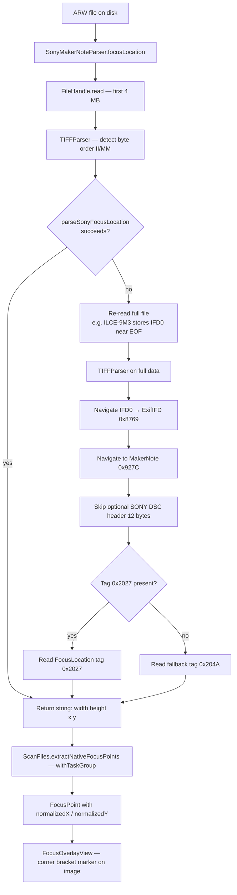

+++
author = "Thomas Evensen"
title = "Sony MakerNote Parser"
date = "2026-03-25"
tags = ["focus points", "sony", "arw", "parser"]
categories = ["technical details"]
mermaid = true
+++

# Sony MakerNote Parser — Focus Point Extraction

> **Files covered:**
> - `RawCull/Enum/SonyMakerNoteParser.swift`
> - `RawCull/Model/ViewModels/FocusPointsModel.swift`
> - `RawCull/Actors/ScanFiles.swift`
> - `RawCull/Views/FocusPoints/FocusOverlayView.swift`

---

## Overview

RawCull extracts autofocus (AF) focus point coordinates directly from Sony ARW
raw files without requiring any external tools such as `exiftool`. The parser
supports the ILCE-1 (A1), ILCE-1M2 (A1 II), ILCE-7M5 (A7 V), ILCE-7RM5
(A7R V), and ILCE-9M3 (A9 III).

The focus location is stored inside the Sony proprietary MakerNote block
embedded in the EXIF data of every ARW file. `SonyMakerNoteParser` (declared
as an `enum` to prevent instantiation) navigates the binary TIFF structure to
locate and decode this data. It also exposes helpers for locating and reading
the three JPEG images embedded in every ARW file, and a verbose diagnostic
walk used by the body-compatibility test suite.

> **Nikon parallel:** A companion `NikonMakerNoteParser` (in
> `Enum/NikonMakerNoteParser.swift`) does the equivalent job for NEF files,
> parsing the Nikon Type-3 MakerNote layout and the `AFInfo2` tag (`0x00B7`)
> used by Z9, Z8, Z7, and Z6 class bodies. Both parsers expose
> `focusLocation(from:) -> String?` returning `"width height x y"`, so the
> downstream `ScanFiles.parseFocusNormalized` consumes them identically. The
> rest of this document focuses on the Sony implementation; the Nikon parser
> uses the same design with minor differences (relative offsets within the
> MakerNote inner TIFF header, `AFInfoVersion` gating of the AFInfo2 layout).

---

## ARW File Structure

Sony ARW is a TIFF-based format (typically little-endian). EXIF and MakerNote
data are embedded within the standard TIFF IFD chain:

```
TIFF Header
  └── IFD0
        └── ExifIFD  (tag 0x8769)
              └── MakerNote  (tag 0x927C)
                    └── Sony MakerNote IFD
                          └── FocusLocation  (tag 0x2027)
```

Tag `0x2027` (FocusLocation) holds four `int16u` values:

| Index | Meaning |
|---|---|
| 0 | Image width (sensor pixels) |
| 1 | Image height (sensor pixels) |
| 2 | Focus point X coordinate |
| 3 | Focus point Y coordinate |

The origin is the top-left corner of the sensor. Values are already in full
sensor pixel space — no scaling is required. Tag `0x204a` is a redundant copy
of the same data (within one pixel) and is used as a fallback.

> **Note:** Tag `0x9400` (AFInfo) is an enciphered binary block and is not
> used for focus location.

---

## SonyMakerNoteParser — Public API

The public type is an enum with four `nonisolated static` methods.

### `focusLocation`

```swift
nonisolated static func focusLocation(from url: URL) -> String?
```

Returns a space-separated `"width height x y"` string, or `nil` if the file
cannot be parsed or contains no valid focus data.

The method uses a two-pass strategy to balance performance against
correctness across all supported bodies:

```swift
nonisolated static func focusLocation(from url: URL) -> String? {
    guard let fh = try? FileHandle(forReadingFrom: url) else { return nil }
    defer { try? fh.close() }

    // Fast path: read only the first 4 MB. Most Sony bodies (A1, A1 II, A7 V,
    // A7R V) store MakerNote metadata well within this range.
    guard let data = try? fh.read(upToCount: 4 * 1024 * 1024) else { return nil }
    if let result = TIFFParser(data: data)?.parseSonyFocusLocation() {
        return "\(result.width) \(result.height) \(result.x) \(result.y)"
    }

    // Slow path: IFD0 may fall beyond the 4 MB window (e.g. ILCE-9M3 stores
    // TIFF metadata in the last 1–2 MB of the file). Re-read the full file.
    try? fh.seek(toOffset: 0)
    guard let full = try? fh.read(upToCount: Int.max),
          full.count > data.count,
          let result = TIFFParser(data: full)?.parseSonyFocusLocation()
    else { return nil }
    return "\(result.width) \(result.height) \(result.x) \(result.y)"
}
```

The fast path reads only the first 4 MB. For most bodies (A1, A1 II, A7 V,
A7R V) the MakerNote sits well within this range, and using
`FileHandle.read(upToCount:)` avoids the full ~50 MB file read that
`Data(contentsOf:, options: .mappedIfSafe)` would cause on external storage
where memory-mapping (`mmap`) is unavailable.

The slow path is triggered only when the fast path returns `nil` and the full
file is larger than the 4 MB window. The A9 III (ILCE-9M3) stores its TIFF
IFD0 near the end of the file, so a full read is necessary for that body.

### `embeddedJPEGLocations`

```swift
nonisolated static func embeddedJPEGLocations(from url: URL) -> EmbeddedJPEGLocations?
```

Returns the absolute file offsets and byte lengths of the three JPEGs embedded
in every Sony ARW — a tiny IFD1 thumbnail (~8 KB), an IFD0 preview
(~400 KB, 1616×1080), and a full-resolution IFD2 JPEG (~4 MB). Only the first
64 KB is read because all IFD structures fall within that range.

Used as a fallback when the macOS RA16 decoder cannot handle the file (e.g.
ARW 6.0 from the A7 V returns `err=-50` from
`CGImageSourceCreateThumbnailAtIndex`).

### `readEmbeddedJPEGData`

```swift
nonisolated static func readEmbeddedJPEGData(
    at location: EmbeddedJPEGLocations.Location,
    from url: URL
) -> Data?
```

Reads raw bytes for a single embedded JPEG from the file at the given absolute
offset. Seeks directly to the position and reads only the required byte count.

### `tiffDiagnostics`

```swift
nonisolated static func tiffDiagnostics(from url: URL) -> TIFFWalkDiagnostics?
```

Performs a verbose walk of every IFD level — IFD0 → ExifIFD → MakerNote →
Sony IFD → FocusLocation — and returns a `TIFFWalkDiagnostics` snapshot.
Used by the body-compatibility test to diagnose unsupported bodies and identify
candidate tags for extending the parser. Returns `nil` only if the file cannot
be opened or has no valid TIFF header.

Like `focusLocation`, the method retries with a full-file read when IFD0
reports zero entries (indicating the offset lies beyond the initial 4 MB
window).

---

## Diagnostic Types

### `TIFFWalkDiagnostics`

A `Sendable` struct capturing the full state of a verbose IFD walk:

```swift
struct TIFFWalkDiagnostics: Sendable {
    let isLittleEndian: Bool
    let ifd0Offset: Int
    let ifd0EntryCount: Int
    let exifIFDOffset: Int?
    let exifEntryCount: Int?
    let makerNoteOffset: Int?
    let makerNoteSize: Int?
    let hasSonyPrefix: Bool
    let sonyIFDOffset: Int?
    let sonyIFDEntryCount: Int?
    /// Every tag number found in the Sony MakerNote IFD, sorted ascending.
    let sonyAllTags: [UInt16]
    /// 0x2027 or 0x204A if a focus location tag was found, nil otherwise.
    let focusTagUsed: UInt16?
    let focusOffset: Int?
    /// Raw 8 bytes of the FocusLocation value (4 × uint16 LE).
    let focusRawBytes: [UInt8]?
    /// Decoded result; nil when tag is missing or dimensions are zero.
    let focusResult: FocusLocationValues?
}
```

`sonyAllTags` lists every tag number found in the Sony MakerNote IFD in
ascending order, making it straightforward to spot tags present on a new body
that do not appear in existing test fixtures.

### `EmbeddedJPEGLocations`

A `Sendable` struct holding the three embedded JPEG locations:

```swift
struct EmbeddedJPEGLocations: Sendable {
    struct Location: Sendable {
        let offset: Int   // absolute file offset
        let length: Int   // byte count
    }
    let thumbnail: Location?   // IFD1 tiny thumbnail (~8 KB, ~160 px)
    let preview: Location?     // IFD0 preview JPEG (~400 KB, 1616×1080)
    let fullJPEG: Location?    // IFD2 full-resolution JPEG (~4 MB, 7008×4672)
}
```

---

## TIFFParser — Binary Navigation

The private `TIFFParser` struct does all binary parsing work.

### Byte Order Detection

```swift
init?(data: Data) {
    guard data.count >= 8 else { return nil }
    let b0 = data[0], b1 = data[1]
    if b0 == 0x49 && b1 == 0x49 { le = true }        // "II" — little-endian
    else if b0 == 0x4D && b1 == 0x4D { le = false }  // "MM" — big-endian
    else { return nil }
    self.data = data
}
```

Sony ARW files are little-endian (`II`), but the parser handles both byte
orders via `readU16` and `readU32` helpers.

### Focus Location Navigation

```swift
func parseSonyFocusLocation() -> (width: Int, height: Int, x: Int, y: Int)? {
    guard let ifd0 = readU32(at: 4).map(Int.init) else { return nil }

    // Navigate: IFD0 → ExifIFD → MakerNote IFD
    guard let exifIFD = subIFDOffset(in: ifd0, tag: 0x8769),
          let (mnOffset, _) = tagDataRange(in: exifIFD, tag: 0x927C)
    else { return nil }

    let ifdStart = sonyIFDStart(at: mnOffset)

    // Try tag 0x2027 first, fall back to 0x204a
    let flTag: UInt16 = tagDataRange(in: ifdStart, tag: 0x2027) != nil
        ? 0x2027 : 0x204A
    guard let (flOffset, flSize) = tagDataRange(in: ifdStart, tag: flTag),
          flSize >= 8
    else { return nil }

    let width  = Int(readU16(at: flOffset + 0))
    let height = Int(readU16(at: flOffset + 2))
    let x      = Int(readU16(at: flOffset + 4))
    let y      = Int(readU16(at: flOffset + 6))

    guard width > 0, height > 0, x > 0 || y > 0 else { return nil }
    return (width, height, x, y)
}
```

The IFD0 offset is read from bytes 4–7 of the TIFF header (standard TIFF).
The parser then follows each IFD pointer in sequence until the Sony MakerNote
IFD is reached.

### Sony MakerNote Header

Some Sony files prefix the MakerNote IFD with a 12-byte ASCII header
`"SONY DSC "` (9 bytes) followed by 3 null bytes. The parser detects and skips
it by checking the raw bytes directly — endian-aware integer reads are not used
for ASCII magic:

```swift
private func sonyIFDStart(at offset: Int) -> Int {
    guard offset + 12 <= data.count else { return offset }
    let isSony = data[offset]   == 0x53 &&  // S
                 data[offset+1] == 0x4F &&  // O
                 data[offset+2] == 0x4E &&  // N
                 data[offset+3] == 0x59     // Y
    return isSony ? offset + 12 : offset
}
```

### IFD Entry Parsing

Each IFD entry is 12 bytes: 2 bytes tag, 2 bytes type, 4 bytes count, 4 bytes
value/offset.

```swift
private func tagDataRange(in ifdOffset: Int, tag: UInt16)
    -> (dataOffset: Int, byteCount: Int)?
{
    let entryCount = Int(readU16(at: ifdOffset))
    for i in 0 ..< entryCount {
        let e = ifdOffset + 2 + i * 12
        guard e + 12 <= data.count else { break }
        if readU16(at: e) == tag {
            let type  = Int(readU16(at: e + 2))
            let count = Int(readU32(at: e + 4) ?? 0)
            let sizes = [0,1,1,2,4,8,1,1,2,4,8,4,8,4]
            let bytes = count * (type < sizes.count ? sizes[type] : 1)

            if bytes <= 4 { return (e + 8, bytes) }   // inline value
            guard let ptr = readU32(at: e + 8) else { return nil }
            // Sony MakerNote IFD entries use absolute file offsets
            // (not relative to MakerNote start) per ExifTool ProcessExif.
            return (Int(ptr), bytes)
        }
    }
    return nil
}
```

Sony MakerNote IFD entries use **absolute file offsets**, consistent with
ExifTool's `ProcessExif` behaviour. The type-size table covers all 14 standard
TIFF types (index 0–13).

### Embedded JPEG Location Parsing

`parseEmbeddedJPEGLocations()` walks the IFD0 → IFD1 → IFD2 chain and reads
the offset/length tag pairs that point to each embedded JPEG. Both
`StripOffsets`/`StripByteCounts` (tags `0x0111`/`0x0117`) and
`JPEGInterchangeFormat`/`JPEGInterchangeFormatLength` (tags `0x0201`/`0x0202`)
are tried for each IFD, since different Sony bodies use different tag pairs:

```swift
// IFD0 preview — try StripOffsets first, fall back to JPEGInterchangeFormat
let preview = locateJPEG(in: ifd0, offTag: 0x0111, lenTag: 0x0117)
           ?? locateJPEG(in: ifd0, offTag: 0x0201, lenTag: 0x0202)

// IFD1 thumbnail — JPEGInterchangeFormat only
let thumbnail = locateJPEG(in: ifd1, offTag: 0x0201, lenTag: 0x0202)

// IFD2 full-resolution JPEG — try both tag pairs
let fullJPEG = locateJPEG(in: ifd2, offTag: 0x0111, lenTag: 0x0117)
            ?? locateJPEG(in: ifd2, offTag: 0x0201, lenTag: 0x0202)
```

The IFD chain pointer for each subsequent IFD is read from the 4-byte word
immediately following the last entry of the current IFD. A zero pointer or a
read failure terminates the walk and returns whatever locations have been
found so far.

---

## Data Models

### FocusPoint

The parsed string `"width height x y"` is converted into a typed `FocusPoint`
struct:

```swift
struct FocusPoint: Identifiable {
    let sensorWidth: CGFloat
    let sensorHeight: CGFloat
    let x: CGFloat
    let y: CGFloat

    var normalizedX: CGFloat { x / sensorWidth }
    var normalizedY: CGFloat { y / sensorHeight }
}
```

Normalized coordinates (0.0–1.0) are used for rendering, making the marker
position independent of the display image resolution.

---

## Integration in ScanFiles

Focus points are extracted during the catalog scan in `ScanFiles` using a
concurrent `withTaskGroup`, after the EXIF task group has completed:

```swift
decodedFocusPoints = await extractNativeFocusPoints(from: result)
    ?? decodeFocusPointsJSON(from: url)
```

Native extraction is attempted first. If no ARW files in the catalog yield a
result (e.g. unsupported bodies or files captured before the feature was
added), the actor falls back to reading a `focuspoints.json` sidecar file from
the same directory.

```swift
private func extractNativeFocusPoints(from items: [FileItem]) async
    -> [DecodeFocusPoints]?
{
    let collected = await withTaskGroup(of: DecodeFocusPoints?.self) { group in
        for item in items {
            group.addTask {
                guard let location = SonyMakerNoteParser.focusLocation(from: item.url)
                else { return nil }
                return DecodeFocusPoints(
                    sourceFile: item.url.lastPathComponent,
                    focusLocation: location
                )
            }
        }
        var results: [DecodeFocusPoints] = []
        for await result in group {
            if let r = result { results.append(r) }
        }
        return results
    }
    return collected.isEmpty ? nil : collected
}
```

`SonyMakerNoteParser.focusLocation` is `nonisolated static`, so task group
tasks invoke it directly on the cooperative thread pool without hopping back
to the `ScanFiles` actor's serial executor. All files are parsed concurrently.

---

## Visualization

Focus point markers are rendered as corner brackets over the image using a
custom SwiftUI `Shape`:

```swift
struct FocusPointMarker: Shape {
    let normalizedX: CGFloat
    let normalizedY: CGFloat
    let boxSize: CGFloat

    func path(in rect: CGRect) -> Path {
        let cx = normalizedX * rect.width
        let cy = normalizedY * rect.height
        let half = boxSize / 2
        let bracket = boxSize * 0.28
        // Draws 8 corner bracket lines around the focus position
        …
    }
}
```

The marker size is user-adjustable (32–100 px) via a slider in
`FocusPointControllerView`.

---

## End-to-End Flow



---

## Key Technical Points

| Topic | Detail |
|---|---|
| File format | Sony ARW is TIFF-based, typically little-endian |
| Supported bodies | ILCE-1, ILCE-1M2, ILCE-7M5, ILCE-7RM5, ILCE-9M3 |
| Focus tag | `0x2027` (FocusLocation), fallback `0x204A` |
| Data format | `int16u[4]` — width, height, x, y in sensor pixels |
| File read (fast path) | First 4 MB only via `FileHandle` — sufficient for most bodies |
| File read (slow path) | Full file re-read when fast path fails; required for ILCE-9M3 (IFD0 near EOF) |
| Pointer base | Sony MakerNote IFD pointers are absolute file offsets |
| MakerNote header | Optional 12-byte `"SONY DSC "` prefix detected by raw byte comparison |
| Encrypted tag | `0x9400` (AFInfo) is enciphered and not used |
| Embedded JPEGs | `embeddedJPEGLocations` locates thumbnail, preview, and full-res JPEG from IFD1/IFD0/IFD2 |
| Diagnostics | `tiffDiagnostics` walks all IFD levels and exposes every Sony MakerNote tag for compatibility testing |
| Concurrency | `extractNativeFocusPoints` uses `withTaskGroup`; all public methods are `nonisolated static` |
| Fallback | `focuspoints.json` sidecar used when native parsing yields no results |
| Coordinates | Origin top-left; normalized to 0.0–1.0 before rendering |
