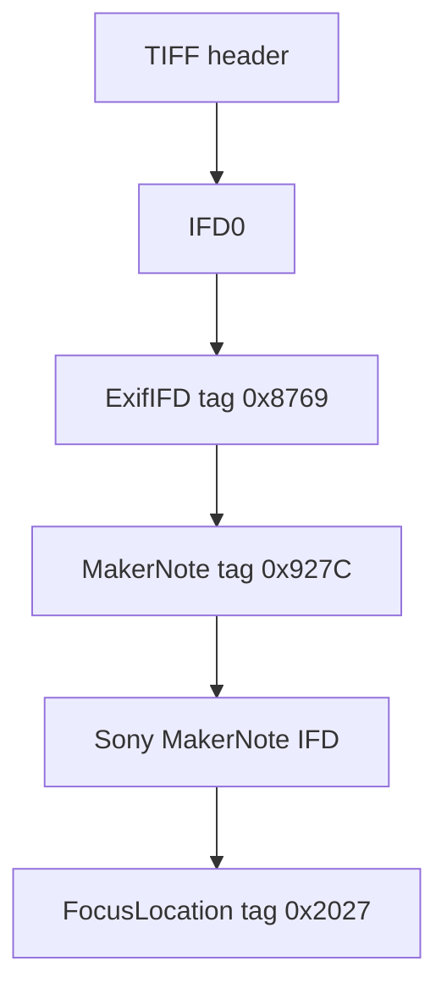
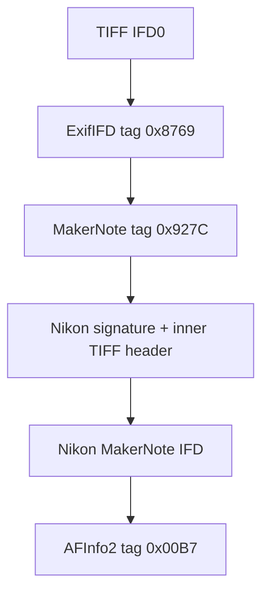

+++
author = "Thomas Evensen"
title = "Sony/Nikon MakerNote Parser"
date = "2026-03-25"
tags = ["focus points", "sony", "nikon", "arw", "nef", "parser"]
categories = ["technical details"]
mermaid = true
+++

# Sony/Nikon MakerNote Parser

RawCull reads autofocus points and embedded JPEG locations directly from RAW metadata. This is implemented in `RawParserKit`, while the app consumes the parser through the vendor-neutral `RawFormat` protocol.

## Source Map

| Area | Files |
|---|---|
| Format protocol/registry | `RawParserKit/Sources/RawParserKit/RawFormat.swift`, `RawFormatRegistry.swift` |
| Sony parser | `SonyMakerNoteParser.swift`, `SonyRawFormat.swift` |
| Nikon parser | `NikonMakerNoteParser.swift`, `NikonRawFormat.swift` |
| Thumbnail/JPEG extractors | `SonyThumbnailExtractor.swift`, `NikonThumbnailExtractor.swift`, `JPGSonyARWExtractor.swift`, `JPGNikonNEFExtractor.swift` |
| Diagnostics | `RawParserDiagnostics.swift`, app `RawFileDiagnostics.swift` |
| App scan consumer | `Actors/ScanFiles.swift` |
| Focus-point normalization | `RawCullCore/Sources/RawCullCore/FocusPointParser.swift` |
| Tests | `RawParserKit/Tests/RawParserKitTests/`, `RawCullCore/Tests/RawCullCoreTests/FocusPointParserTests.swift` |

## Vendor-Neutral Contract

App code usually does not call `SonyMakerNoteParser` or `NikonMakerNoteParser` directly. It resolves a format first:

```swift
guard let format = RawFormatRegistry.format(for: url) else { return }
let focus = format.focusLocation(from: url)
```

`RawFormat` also exposes thumbnail extraction, full embedded JPEG extraction, compression labels, and size-class thresholds. This keeps `ScanFiles`, thumbnail actors, and diagnostics mostly vendor-neutral.

## Focus Location Shape

Both parsers return the same string shape:

```text
imageWidth imageHeight focusX focusY
```

Example:

```text
6000 4000 3000 1000
```

`FocusPointParser.normalizedPoint(from:)` converts that into a normalized `CGPoint`:

```text
x = focusX / imageWidth
y = focusY / imageHeight
```

Invalid dimensions, malformed strings, and out-of-range points are rejected.

## Sony ARW Structure

Sony ARW is TIFF-based. The focus point is found by walking TIFF/EXIF structures:


```mermaid
flowchart TD
    A["TIFF header"] --> B["IFD0"]
    B --> C["ExifIFD tag 0x8769"]
    C --> D["MakerNote tag 0x927C"]
    D --> E["Sony MakerNote IFD"]
    E --> F["FocusLocation tag 0x2027"]
```

The Sony parser also locates embedded JPEG candidates:

| Candidate | Use |
|---|---|
| thumbnail | Small embedded preview |
| preview | Preferred scoring/zoom preview when available |
| fullJPEG | Largest embedded JPEG candidate |

For newer Sony files where ImageIO cannot expose a preview, focus scoring can use the parser's embedded JPEG fallback.

## Nikon NEF Structure

Nikon NEF is also TIFF-based, but the MakerNote has a Nikon Type-3 inner TIFF layout.


```mermaid
flowchart TD
    A["TIFF IFD0"] --> B["ExifIFD tag 0x8769"]
    B --> C["MakerNote tag 0x927C"]
    C --> D["Nikon signature + inner TIFF header"]
    D --> E["Nikon MakerNote IFD"]
    E --> F["AFInfo2 tag 0x00B7"]
```

The Nikon parser supports modern Z-series style AFInfo versions used by bodies such as Z9/Z8/Z7/Z6 class cameras. Tests also cover unsupported older AFInfo layouts returning nil instead of producing misleading coordinates.

For embedded JPEGs, Nikon parsing can walk TIFF SubIFDs when ImageIO does not expose the preview as a top-level image.

## Diagnostics

`RawFileDiagnostics.log(for:)` is the developer entry point from the app. It reports:

- file identity and size,
- selected `RawFormat`,
- scanned EXIF metadata,
- ImageIO image count and per-index properties,
- compression-code labels,
- parser traces for embedded JPEG locations,
- parser traces for AF focus location.

Diagnostics are intentionally read-only. They are useful when adding a camera body or debugging a RAW file that does not produce focus points or previews.

## Tests

| Test file | Covers |
|---|---|
| `SonyMakerNoteParserTests.swift` | Sony focus and embedded JPEG parsing |
| `NikonMakerNoteParserTests.swift` | Nikon focus and embedded JPEG parsing with synthetic NEF blobs |
| `RawFormatRegistryTests.swift` | Extension-to-format dispatch |
| `SonyRAWJPEGCreatorTests.swift` | Sony RAW JPEG creation behavior |
| `FocusPointParserTests.swift` | Normalizing parser strings into points |

The Nikon tests use synthetic binary blobs so parser offsets and AFInfo behavior can be checked without real camera files.

## Adding A New RAW Format

1. Add a new `RawFormat` conformer.
2. Implement thumbnail extraction, full JPEG extraction, focus location, compression labels, and size thresholds.
3. Register the conformer in `RawFormatRegistry.all`.
4. Add parser/extractor diagnostics.
5. Add package tests for registry dispatch and parser edge cases.
6. Update scan/thumbnail docs if the new format changes behavior.

## What To Check When Changing This Area

- Parser failures should return nil or diagnostics, not crash.
- Keep byte-offset code covered by synthetic tests where possible.
- Do not let app code branch deeply on file extension when `RawFormat` can dispatch.
- If focus-location string shape changes, update `FocusPointParser` and scan consumers together.
- Embedded JPEG parser changes can affect thumbnails, zoom previews, and sharpness scoring.
